# GitHub Spec Kit ハンズオン — 川渡りパズルで AI-DLC と比較体験する

- 対象環境: Windows + VS Code + Claude Code（ターミナルは Git Bash 想定）
- プロジェクト作成先: `/c/dev/handson-spec-kit/river-crossing-speckit`
- 題材: 川渡りパズル（農夫・オオカミ・ヤギ・キャベツ、Vanilla HTML/CSS/JS、ビルド不要）
- 所要時間目安: 1.5〜2時間（フルフロー）
- 確認時点の最新版: Spec Kit v0.13.0（[Releases](https://github.com/github/spec-kit/releases) で最新を確認して置き換え可）

> 本教材は同フォルダの [`spec-kit-handson-v2.md`](./spec-kit-handson-v2.md)（Todoアプリ版・実行結果付き）で確認済みの**正確なコマンド体系**（`/speckit.constitution` 等、`specify init --integration claude`）をベースに、題材を **川渡りパズル** に差し替えたものです。この題材は AWS AI-DLC で既に一度実装済み（`C:\Users\Yoshi\Claude\Handson\RiverCrossingPuzzle`）のため、**同じ題材・同じ人が2つの手法を実際に動かして比較できる**ことを狙いとしています。

---

## 1. 勉強対象の概要

### 1.1 GitHub Spec Kit とは

[Spec Kit](https://github.com/github/spec-kit) は GitHub が OSS として公開する、**仕様駆動開発（Spec-Driven Development / SDD）** を実践するためのツールキットです。「コードが主役で仕様は使い捨ての足場」という関係を逆転させ、**仕様を実行可能な成果物**として扱い、仕様 → 計画 → タスク → 実装へ段階的に AI（Claude Code）と協働して作り上げます。

ワークフローは Claude Code の**スキル**（`.claude/skills/` 配下、スラッシュコマンドとして呼び出す）として提供され、各フェーズが「次に進む前に人がレビューする」ゲートとして機能します。

### 1.2 中心概念

| 概念 | 説明 |
|---|---|
| **Spec-Driven Development（SDD）** | 仕様を最初に固め、実装はその仕様から段階的に導出する開発スタイル |
| **Constitution（憲法）** | プロジェクト全体を貫く原則。全フェーズの判断基準になり、`plan`/`analyze`/`implement` を拘束する |
| **Spec（仕様）** | *What / Why* のみを書く成果物。技術スタックにはあえて触れない |
| **Plan（計画）** | *How* を定める成果物。技術選定・アーキテクチャ・データモデルなど |
| **Tasks（タスク）** | plan を実行可能な単位に分解した作業リスト。依存順・並列可否・対象ファイルが明記される |
| **Gate（ゲート）** | 各フェーズ間に置かれる人によるレビューポイント |

### 1.3 全体構造

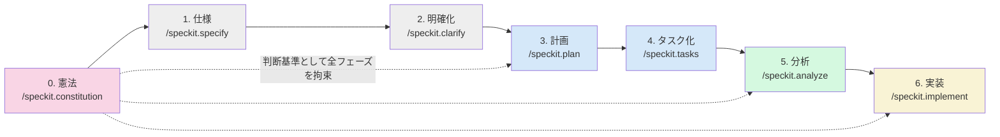

| フェーズ | コマンド | 生成物 | 決めること |
|---|---|---|---|
| 0. 憲法 | `/speckit.constitution` | `.specify/memory/constitution.md` | プロジェクト全体の原則 |
| 1. 仕様 | `/speckit.specify` | `specs/001-xxx/spec.md` + featureブランチ | **What / Why** |
| 2. 明確化 | `/speckit.clarify` | spec.md に Clarifications 追記 | 曖昧な要件のQ&A解消 |
| 3. 計画 | `/speckit.plan` | `plan.md`, `research.md`, `data-model.md` 等 | **How** |
| 4. タスク化 | `/speckit.tasks` | `tasks.md` | 依存順・並列可否付きの実行可能タスク |
| 5. 分析 | `/speckit.analyze` | 分析レポート | spec / plan / tasks の整合性検査 |
| 6. 実装 | `/speckit.implement` | 動作するコード | tasks.md を順番に実行 |

オプションとして `/speckit.checklist`（要件の品質チェックリスト生成）もあります。

### 1.4 AI-DLC との対応関係

このハンズオンの主目的は、AI-DLC 版（`C:\Users\Yoshi\Claude\Handson\RiverCrossingPuzzle`）で使った **同じ入力情報**（`vision-document.md` / `technical-environment.md` の内容）を Spec Kit の各コマンドに流し込み、生成物とプロセスの違いを比較することです。

| AI-DLC 側の資産・概念 | Spec Kit での対応 |
|---|---|
| `vision-document.md`（事前入力） | `/speckit.specify` のプロンプトに要点を書き込む（事前ファイルではなくその場で入力） |
| `technical-environment.md`（禁止ライブラリ表等） | `/speckit.constitution` のプロンプト、および `/speckit.plan` の技術指定 |
| `requirement-verification-questions.md`（ファイルQ&A） | `/speckit.clarify`（チャット対話でQ&A、spec.mdに自動記録） |
| Workflow Planning（適応的スキップ判断） | 標準では固定フロー。深さの調整は明示的な指示が必要 |
| 各ステージの人間承認ゲート | `/speckit.analyze`（機械的整合性チェック、非破壊） |
| Build and Test ステージ | 標準ワークフローに専用ステージなし。テストは `/speckit.plan`/`/speckit.tasks` の指定次第 |

具体的な比較まとめは [4.3](#43-ai-dlc-との比較まとめ実測ベース) で表にします。

---

## 2. ハンズオンの概要

### 2.1 想定環境・所要時間

- Windows 11 + Git Bash + VS Code + Claude Code（`spec-kit-handson-v2.md` を既に実施済みなら `specify` CLI は導入済みのはず）
- 所要時間: フルフローで 1.5〜2時間

### 2.2 ゴールイメージ

- 川渡りパズルを Spec Kit の7フェーズで実装し、`.specify/memory/constitution.md` から `index.html` までの生成物を自分で読める
- AI-DLC 版で得た `requirements.md` / `functional-design/` / `code-generation-plan.md` と、Spec Kit の `spec.md` / `plan.md` / `tasks.md` を実際に見比べ、情報の粒度・記述形式の違いを説明できる
- 「同じルール（`isLosingState` / `isWin` の失敗・クリア判定）を、2つの手法がそれぞれどう設計に落とし込むか」を体験している

### 2.3 学べることの全体像

| 演習 | 実行コマンド | 学習項目 | AI-DLC版での対応ステージ |
|---|---|---|---|
| 演習0 | `specify init` | プロジェクト構造、スキルの仕組み | セットアップ（`CLAUDE.md` 配置） |
| 演習1 | `/speckit.constitution` | 原則の言語化、後続フェーズを拘束する仕組み | `technical-environment.md` の禁止ライブラリ表 |
| 演習2 | `/speckit.specify` | What/How分離、ユーザーストーリー分割 | Requirements Analysis（`requirements.md`） |
| 演習3 | `/speckit.clarify` | 曖昧要件の構造化Q&A | Requirements Analysis の確認質問（Q1〜Q9） |
| 演習4 | `/speckit.plan` | 技術選定の記録、状態モデル設計 | Functional Design（`business-rules.md` 等） |
| 演習5 | `/speckit.tasks` | タスク分解の粒度、並列マーカー | Code Generation Planning |
| 演習6 | `/speckit.analyze` | 一貫性・カバレッジの機械的検査 | 各ステージの人間承認ゲート |
| 演習7 | `/speckit.implement` | TDD（Red→Green）、tasks.md駆動の実装 | Code Generation |
| 演習8 | （手動検証） | 生成コードの独立検証 | Build and Test |

### 2.4 演習の流れ

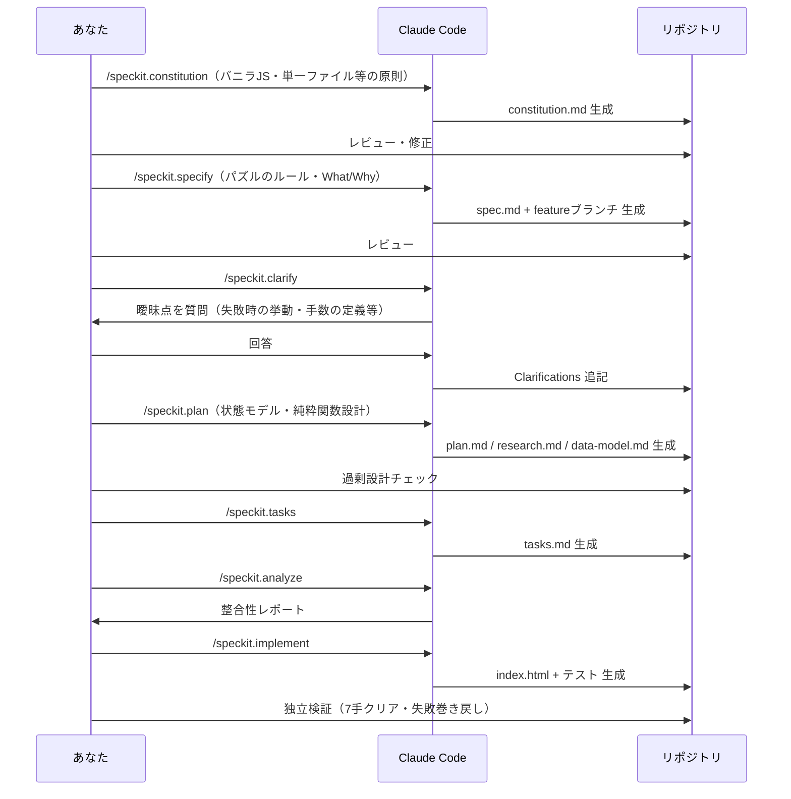

---

## 3. ハンズオンの手順

各ステップの後は必ず生成物を開いて内容を確認・修正してから次へ進みます。プロンプトは Claude Code 内で入力してください。

### 演習0: 事前準備 — プロジェクト初期化

**目的**: Spec Kit のプロジェクト構造を作る。

`specify` CLI が未導入の場合のみ:

```bash
uv tool install specify-cli --from git+https://github.com/github/spec-kit.git@v0.13.0
specify --help
```

プロジェクト初期化（`spec-kit-handson-v2.md` の `handson-spec-kit/` と兄弟フォルダにする）:

```bash
cd /c/dev/handson-spec-kit
specify init river-crossing-speckit --integration claude
cd river-crossing-speckit
code .
```

実行すると、対話型のセットアップ画面が表示されます。

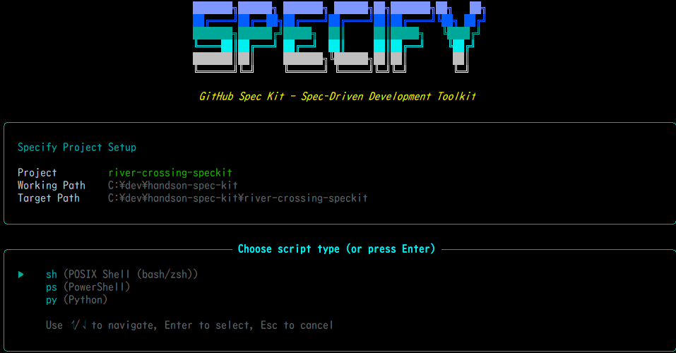

- 上段: `Project` / `Working Path` / `Target Path` が意図した通りか確認する
- 下段: `Choose script type` では、Git Bash を使う本教材の前提に合わせて **`sh (POSIX Shell (bash/zsh))`** を選択する（`.specify/scripts/bash/` が生成され、以降のスキルが内部でこれを呼び出す）。PowerShellを使う場合は `ps` を選ぶ

- `--integration claude` で Claude Code 用のスキル（`.claude/skills/speckit-*/`）が配置される
- Git リポジトリは自動初期化される（`git branch` で確認）

生成される構成:

```text
river-crossing-speckit/
├── .claude/skills/               # speckit-constitution, speckit-specify, ... 各SKILL.md
├── .specify/
│   ├── memory/constitution.md    # 初期はプレースホルダ
│   ├── scripts/bash/
│   ├── templates/
│   └── workflows/
```

#### `.claude/` と `.specify/` の役割

初めて見ると「なぜ2つのフォルダに分かれているのか」が分かりにくいため、既存の `handson-spec-kit/`（Todoアプリ版）で実際に生成された中身を基に整理します。

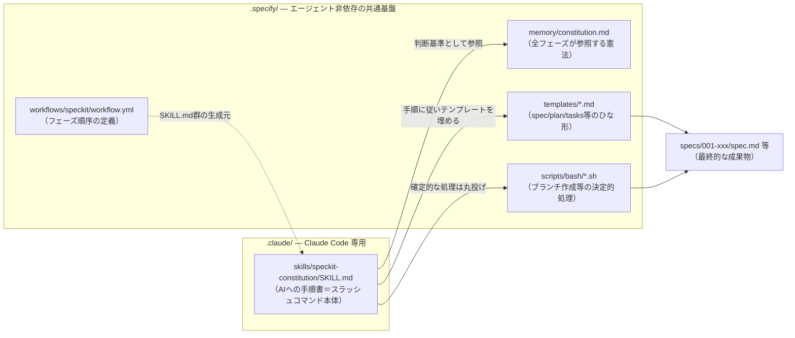

| フォルダ | 位置づけ | 中身の例（実測） |
|---|---|---|
| **`.claude/skills/<name>/SKILL.md`** | **Claude Code だけが読む**、フェーズごとのAI向け指示書。YAMLフロントマター（`name`/`description`/`argument-hint`等）＋Markdown本文で構成され、これが `/speckit-constitution` のようなスラッシュコマンドの実体になる | `speckit-constitution/SKILL.md` の冒頭に `name: "speckit-constitution"` `description: "Create or update the project constitution..."` などが記載されている |
| **`.specify/memory/constitution.md`** | 演習1で作る「憲法」。以降のすべてのSKILL.mdがここを参照して判断する | 初期状態はプレースホルダのみのテンプレート |
| **`.specify/templates/`** | 生成物（spec/plan/tasks/checklist/constitution）の**ひな形**。SKILL.mdはこの型を埋める形で成果物を書く | `spec-template.md` `plan-template.md` `tasks-template.md` `checklist-template.md` `constitution-template.md` |
| **`.specify/scripts/bash/`** | 「AIの自由な判断に任せず、確実に実行すべき処理」をスクリプト化したもの（ブランチ作成・ディレクトリ作成・前提チェック等） | `create-new-feature.sh` `setup-plan.sh` `setup-tasks.sh` `check-prerequisites.sh` `common.sh`。演習0で `sh` を選んだ場合にここへ生成される |
| **`.specify/workflows/speckit/workflow.yml`** | フェーズの順序・依存関係を定義する、SKILL.md群の生成元 | — |
| **`.specify/integration.json` / `init-options.json`** | `specify init` 実行時の設定（選んだエージェント・スクリプト種別・バージョン）の記録 | `{"integration": "claude", "script": "sh", ...}` |
| **`.specify/feature.json`** | 現在アクティブな feature ディレクトリの記録 | `{"feature_directory": "specs/001-todo-app"}` |
| **`.specify/integrations/claude.manifest.json`** | インストールされた `.claude/` 配下ファイルのハッシュ一覧（アップグレード時の差分検出に使う） | 各SKILL.mdのファイルパスとハッシュ値のペア |

**要点**:
- `.claude/` は Claude Code というエージェント **専用** の置き場所。`--integration copilot` 等を選べば、代わりに `.github/prompts/` のような別フォルダにコマンドが配置される。
- `.specify/` は **エージェントに依存しない共通基盤**。「憲法」「テンプレート」「決定的スクリプト」「設定」を持ち、`.claude/` 側のSKILL.mdはこれらを読み書きしながら動く。
- つまり `.claude/` が「AIへの指示書（各エージェント固有）」、`.specify/` が「プロジェクトの記憶・ルール・型（エージェント共通）」という役割分担になっている。

> **AI-DLC との対比**: AI-DLC は `CLAUDE.md`（司令塔ルール）と `.aidlc-rule-details/`（詳細マニュアル）という2段構成でしたが、いずれも Claude Code 向けの1セットでした。Spec Kit は同じ「指示書と詳細情報を分ける」設計を、**「エージェント固有（`.claude/`）」と「エージェント非依存（`.specify/`）」という軸**でさらに分離している点が特徴です。

VS Code の統合ターミナルで `claude` を起動し、`/speckit` と入力して候補が出れば準備完了です。

✅ **確認ポイント**: `.claude/skills/` に `speckit-constitution` 〜 `speckit-implement` 等のフォルダがある。

**ここで学んだこと**: AI-DLC が `CLAUDE.md` 1枚に司令塔ルールを置くのに対し、Spec Kit はフェーズごとに独立したスキルフォルダとして配置する。

#### 入力ドキュメントを準備する（テキスト直接指定 vs ファイル化）

`/speckit.constitution` や `/speckit.specify` はプロンプトに直接テキストを書いても動きますが、**あらかじめファイルを用意して読み込ませる方法**を推奨します。`speckit-constitution/SKILL.md` の指示文には次のように書かれています。

> "If user input (conversation) supplies a value, use it. Otherwise infer from existing repo context (**README, docs**, prior constitution versions if embedded)."

つまり会話中の指示だけでなく、**リポジトリ内のファイルも情報源として使える**設計です。ただし AI-DLC の `CLAUDE.md` のように「起動時に決まったファイル名を自動で読みに行く」仕組みではないため、**プロンプト内でファイル名を明示して読ませる**必要があります。

| 観点 | テキストを直接指定 | ファイルを事前に用意 |
|---|---|---|
| 再現性 | 打鍵ミス・言い忘れが起きやすい | ファイルとして固定され、何度でも同じ内容を渡せる |
| Git管理 | チャットログにしか残らない | `git diff` でレビュー・履歴管理できる |
| 使い回し | コマンドごとに書き直しが必要 | `/speckit.constitution` `/speckit.specify` `/speckit.plan` で同じファイルを参照できる |
| AI-DLC との比較 | — | AI-DLC の `vision-document.md`/`technical-environment.md` と同じ「事前入力ドキュメント方式」を再現できる |

本教材では、AI-DLC版と全く同じ内容の `vision-document.md` と `technical-environment.md` を、あらかじめこのプロジェクト直下に用意しています（AI-DLC版からの内容そのまま流用）。以降の演習1・2・4では、このファイルを読み込ませるプロンプトを使います。

```text
river-crossing-speckit/
├── vision-document.md          # パズルのWhat/Why（演習2で使用）
├── technical-environment.md    # 技術制約・サンプルコード（演習1・4で使用）
```

---

### 演習1: プロジェクト憲法の作成 — `/speckit.constitution`

**目的**: `technical-environment.md`（禁止ライブラリ表・コーディング規約）の内容を、Spec Kit の「憲法」として先に固定する。

```text
/speckit.constitution technical-environment.md を読み込み、その内容（禁止ライブラリ表・
コーディング規約・基本スタック）を、このプロジェクトの原則としてまとめてください。
特に「禁止ライブラリ表」は絶対に緩めないでください。加えて、主要ロジックへの自動テストと
YAGNI（過剰設計の禁止）も原則に含めてください。
```

✅ **確認ポイント**:
- Claude Codeが実際に `technical-environment.md` を開いて（ファイル読み込みツールが動く）から憲法を生成していること
- `.specify/memory/constitution.md` に「禁止ライブラリ表」「単一ファイル」「状態オブジェクトへの集約」等がAI-DLC版と同等の粒度で反映されていること

> #### 📋 実例（本教材で実際に得られた生成結果）
>
> 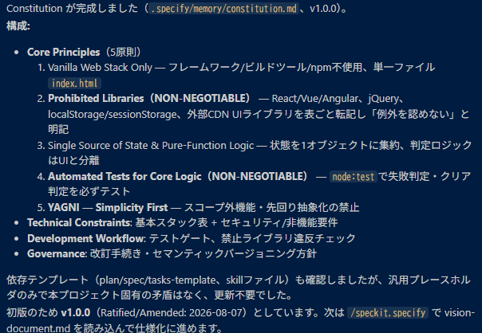
>
> `technical-environment.md` を読み込ませた結果、**5つのCore Principles（v1.0.0）**として憲法が生成された。
>
> | # | 原則 | 由来（technical-environment.mdのどこを反映したか） |
> |---|---|---|
> | 1 | Vanilla Web Stack Only | 「1. 基本スタック」（フレームワーク・ビルドツール・npm不使用、単一 `index.html`） |
> | 2 | Prohibited Libraries（**NON-NEGOTIABLE**） | 「2. 禁止ライブラリ表」をそのまま転記し、「例外を認めない」と明記 |
> | 3 | Single Source of State & Pure-Function Logic | 「3. コーディング規約」（状態を1オブジェクトに集約、判定ロジックはUIと分離） |
> | 4 | Automated Tests for Core Logic（**NON-NEGOTIABLE**） | プロンプトで追加指示した「主要ロジックへの自動テスト」→ `node:test` での失敗判定・クリア判定テストを必須化 |
> | 5 | YAGNI — Simplicity First | プロンプトで追加指示した「過剰設計の禁止」→ スコープ外機能・先回り抽象化の禁止 |
>
> 加えて `Technical Constraints`（基本スタック表＋セキュリティ/非機能要件）と `Development Workflow`（テストゲート・禁止ライブラリ違反チェック）、`Governance`（改訂手続き・セマンティックバージョニング方針）も生成された。依存テンプレート（plan/spec/tasks-template、skillファイル）との矛盾チェックも自動で行われ、今回は更新不要と判定された。
>
> **観察ポイント**: プロンプトで明示していない「YAGNI」原則が、`technical-environment.md` には無い一般的なベストプラクティスとして自然に追加されている。これは `spec-kit-handson-v2.md`（Todoアプリ版）の実例で「指示していないアクセシビリティ要件が自動追加された」現象と同種で、**Spec Kitのエージェントは入力ドキュメントを土台にしつつ、そこに無い一般原則も補って埋める**傾向があると分かる。

**ここで学んだこと**: AI-DLC の `technical-environment.md` は「人が事前に書いてAIに読ませる入力ファイル」だが、Spec Kit の憲法は「対話（＋参照ファイル）を通じてAIが生成する出力ファイル」。情報の流れる向き（人→AI）は同じでも成立過程が逆になる。ファイルを明示的に読み込ませることで、AI-DLC と同じ「ドキュメント・ファースト」を Spec Kit 上でも再現できる。

---

### 演習2: 仕様の作成 — `/speckit.specify`

**目的**: 技術スタックに触れず、パズルの *What / Why* だけを言語化する。`vision-document.md` を読み込ませて使う。

```text
/speckit.specify vision-document.md を読み込み、その内容を基に川渡りパズルの仕様を作成してください。
特に「2. パズルのルール」「3. MVPに含める機能」「4. スコープ外」をそのまま要件に反映し、
「5. 既知の未確定事項」に書かれている論点（操作方式・見た目・失敗時の挙動）は、
このドキュメントに書かれた回答（クリック操作／絵文字・CSS図形／直前状態への巻き戻し）を採用してください。
```

✅ **確認ポイント**:
- Claude Codeが `vision-document.md` を実際に開いて読んでいること
- featureブランチ（例: `001-river-crossing-puzzle`）が自動作成される（`git branch` で確認）
- `specs/001-xxx/spec.md` にユーザーストーリーと機能要件が生成される
- `[NEEDS CLARIFICATION]` マーカーの有無を確認（`vision-document.md` の「5. 既知の未確定事項」に答えを書いておいたので、AI-DLC版よりマーカーが少なくなるはず）

> #### 📋 実例（本教材で実際に得られた生成結果）
>
> 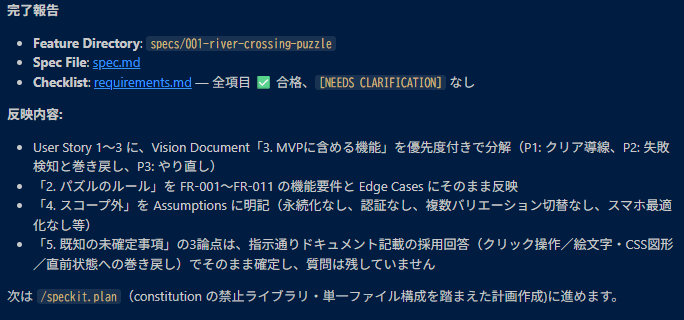
>
> - **Feature Directory**: `specs/001-river-crossing-puzzle`／**Spec File**: `spec.md`／**Checklist**（`requirements.md`）: 全項目 ✅ 合格、`[NEEDS CLARIFICATION]` **なし**
> - **反映内容**:
>   | vision-document.md の節 | spec.md への反映のされ方 |
>   |---|---|
>   | 「3. MVPに含める機能」 | User Story 1〜3 に優先度付きで分解（P1: クリア導線、P2: 失敗検知と巻き戻し、P3: やり直し） |
>   | 「2. パズルのルール」 | FR-001〜FR-011 の機能要件と Edge Cases にそのまま反映 |
>   | 「4. スコープ外」 | Assumptions に明記（永続化なし・認証なし・複数バリエーション切替なし・スマホ最適化なし 等） |
>   | 「5. 既知の未確定事項」 | 3論点とも、ドキュメント記載の採用回答（クリック操作／絵文字・CSS図形／直前状態への巻き戻し）でそのまま確定し、質問は残らなかった |
>
> **観察ポイント**: 演習2冒頭で狙った通り、`vision-document.md` に事前に論点への回答まで書いておいたことで `[NEEDS CLARIFICATION]` が**ゼロ**になった。AI-DLC版では同じ論点（操作方式・見た目・失敗時の挙動）が `requirement-verification-questions.md` としてQ1〜Q9の質問ファイルに出ていたが、Spec Kit版では入力ドキュメントの充実度によって**そもそも質問自体が発生しなかった**。これは「事前ドキュメントを用意するほど質問が減る」というAI-DLCの学びと同じ効果が、Spec Kit側でも再現できることを示す実例。

**ここで学んだこと**: AI-DLC は「質問ファイル→回答→`requirements.md`生成」という質問ファーストの順序だったが、`/speckit.specify` は「一発のプロンプトから仕様ドラフトを生成→曖昧点はマーカーで残す」という生成ファーストの順序。ただし `vision-document.md` に事前に論点への回答まで書いておけば、AI-DLC の「事前ドキュメントが充実しているほど質問が減る」という効果を Spec Kit 側でも再現できる。

---

### 演習3: 仕様の明確化 — `/speckit.clarify`

**目的**: plan の前に曖昧な要件を解消する。AI-DLC版で人間が答えたQ1〜Q9（失敗時の挙動・手数の定義・Undo有無等）と類似の論点が出やすい。

```text
/speckit.clarify
```

チャット上で最大5問ほど質問されます。回答すると `spec.md` の Clarifications セクションに記録されます。

| 想定される質問例（AI-DLC版Q1・Q4相当） | 回答例 |
|---|---|
| 失敗時、巻き戻し後に何を表示するか | 失敗理由のメッセージを表示し、操作を継続可能にする |
| 手数の数え方（舟の移動のみか、乗降も含むか） | 舟の対岸移動のみを1手としてカウント |
| 不正操作（無効な相手を乗せようとする等）の扱い | 操作自体を無効化し、UIをグレーアウトする |

✅ **確認ポイント**: `spec.md` の `[NEEDS CLARIFICATION]` が解消され、Clarifications に一問一答が記録されている。

**ここで学んだこと**: AI-DLC は質問を**ファイルに書き出し**、`[Answer]:` を編集して「読み直して続行」と伝える運用だった（Windows/Git Bashで `/memory` がパス変換される、といったつまずきもここに起因）。Spec Kit の `/speckit.clarify` は**チャット対話で完結**するため、ファイル操作特有のつまずきは起きにくい。

---

### 演習4: 実装計画の作成 — `/speckit.plan`

**目的**: ここで初めて技術スタックと状態モデルを指定する。`technical-environment.md` の「4. サンプルコード例」をそのまま踏襲させる。

```text
/speckit.plan technical-environment.md を読み込み、特に「4. サンプルコード例」の状態オブジェクトの
形（boatPassenger を含む）、isLosingState・isWin の実装パターンをそのまま踏襲して計画を立ててください。
不変条件として「farmerは常にboatと同じ岸にいる」を維持する設計にしてください。
クリック要素には data-testid を付与し、テストしやすくしてください。
```

✅ **確認ポイント**: `plan.md` / `research.md` / `data-model.md` が生成される。以下を必ずレビュー:
- `research.md`: 状態モデルや純粋関数分離の根拠が記録されているか
- `plan.md`: 憲法（演習1）に違反していないか、**過剰設計がないか**

過剰設計を見つけたら:

```text
plan.md をレビューして、憲法のシンプルさ原則に照らして過剰な要素があれば削除してください。
```

> #### 📋 実例（本教材で実際に得られた生成結果）
>
> 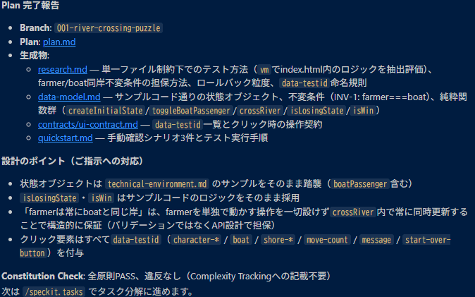
>
> - **Branch**: `001-river-crossing-puzzle`／**Plan**: `plan.md`
> - **生成物**:
>   | ファイル | 内容 |
>   |---|---|
>   | `research.md` | 単一ファイル制約下でのテスト方法（`vm` で `index.html` 内のロジックを抽出評価）、farmer/boat同岸不変条件の担保方法、ロールバック粒度、`data-testid` 命名規則 |
>   | `data-model.md` | サンプルコード通りの状態オブジェクト、不変条件（INV-1: `farmer===boat`）、純粋関数群（`createInitialState` / `toggleBoatPassenger` / `crossRiver` / `isLosingState` / `isWin`） |
>   | `contracts/ui-contract.md` | `data-testid` 一覧とクリック時の操作契約 |
>   | `quickstart.md` | 手動確認シナリオ3件とテスト実行手順 |
> - **設計のポイント（プロンプトでの指示への対応）**:
>   - 状態オブジェクトは `technical-environment.md` のサンプルをそのまま踏襲（`boatPassenger` 含む）
>   - `isLosingState`・`isWin` はサンプルコードのロジックをそのまま採用
>   - 「farmerは常にboatと同じ岸」は、farmerを単独で動かす操作を一切設けず `crossRiver` 内で常に同時更新することで**構造的に保証**（バリデーションではなくAPI設計で担保）
>   - クリック要素はすべて `data-testid`（`character-*` / `boat` / `shore-*` / `move-count` / `message` / `start-over-button`）を付与
> - **Constitution Check**: 全原則PASS、違反なし（Complexity Trackingへの記載不要）
>
> **観察ポイント**: 「farmerがいないと舟は動かせない」という不変条件を、AI-DLC版は `functional-design/business-rules.md` に**ルール（R1〜R8）として文章で明記**していたが、Spec Kit版は `crossRiver` という**API設計そのものでfarmerを動かす手段を排除する**ことで、バリデーション不要の構造的な保証を選んだ。同じ不変条件でも、設計書の書き方（宣言的なルール記述 vs 構造的な排除）に手法ごとの個性が出た好例。

**ここで学んだこと**: `/speckit.plan` は AI-DLC の Functional Design（`business-rules.md` 等）と Code Generation Planning を合わせた役割を担う。AI-DLC は「適応的ワークフロー」でこの工程の深さをAIが自動調整したが（今回は"最小深さ"で実行）、Spec Kit の `/speckit.plan` にはそうした自動深さ調整はなく、テンプレートに沿って一律に生成される。

---

### 演習5: タスク分解 — `/speckit.tasks`

**目的**: plan を実行可能な作業単位に分解する。

```text
/speckit.tasks
```

✅ **確認ポイント**: `specs/001-xxx/tasks.md` が生成される。`isLosingState` / `isWin` / 移動処理（cross） / UI描画 / Start Over が個別タスクとして分解され、依存順・並列可否 `[P]` が付与されていることを確認する。

> #### 📋 実例（本教材で実際に得られた生成結果）
>
> 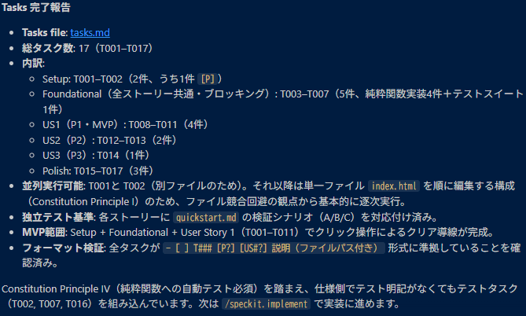
>
> - **Tasks file**: `tasks.md`／**総タスク数**: 17（T001〜T017）
> - **内訳**:
>   | フェーズ | タスク | 件数 |
>   |---|---|---|
>   | Setup | T001〜T002（うち1件 `[P]`） | 2件 |
>   | Foundational（全ストーリー共通・ブロッキング） | T003〜T007（純粋関数実装4件＋テストスイート1件） | 5件 |
>   | US1（P1・MVP） | T008〜T011 | 4件 |
>   | US2（P2） | T012〜T013 | 2件 |
>   | US3（P3） | T014 | 1件 |
>   | Polish | T015〜T017 | 3件 |
> - **並列実行可能**: T001とT002（別ファイルのため）のみ。それ以降は単一ファイル `index.html` を順に編集する構成（Constitution Principle I）のため、ファイル競合回避の観点から基本的に逐次実行
> - **独立テスト基準**: 各ストーリーに `quickstart.md` の検証シナリオ（A/B/C）を対応付け済み
> - **MVP範囲**: Setup + Foundational + User Story 1（T001〜T011）でクリック操作によるクリア導線が完成
> - Constitution Principle IV（純粋関数への自動テスト必須）を踏まえ、仕様側でテスト明記がなくてもテストタスク（T002, T007, T016）を組み込み済み
>
> **観察ポイント**: AI-DLC版の `code-generation-plan.md` はR1〜R8のルールを関数に対応付ける表形式が中心だったが、Spec Kit版の `tasks.md` は**ユーザーストーリー単位＋MVP範囲の明示**が特徴的。「どこまで実装すれば動くものになるか（T001〜T011）」が最初から分かる点は、時間が足りないときの判断材料として実務的に有用。また「単一ファイル制約があるため並列実行はほぼできない」という制約も、AI-DLCの「成果物は index.html 1ファイル」という方針とタスク分解の両方に一貫して効いている。

**ここで学んだこと**: `tasks.md` は AI-DLC の `code-generation-plan.md` に相当するが、より「1タスク＝1コミット相当」のチェックリスト実行に特化した形式。

---

### 演習6: 整合性分析 — `/speckit.analyze`

**目的**: 実装前に spec / plan / tasks の食い違いを検出する（読み取り専用）。

```text
/speckit.analyze
```

✅ **確認ポイント**: 「失敗時は自動巻き戻り」等の要件が `tasks.md` のどのタスクでカバーされているか対応が取れていること。CRITICAL指摘があれば `/speckit.specify` や `/speckit.plan` に戻って修正する。

> #### 📋 実例（本教材で実際に得られた生成結果）
>
> 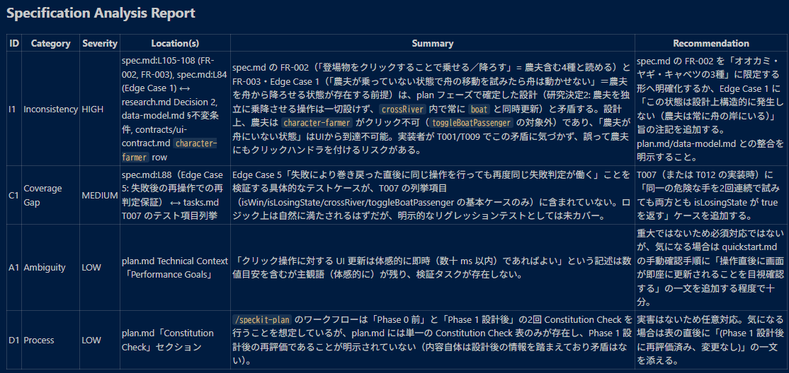
>
> **Specification Analysis Report**（4件の指摘。CRITICALはゼロ）:
>
> | ID | Category | Severity | 概要 |
> |---|---|---|---|
> | I1 | Inconsistency | **HIGH** | `spec.md` のFR-002/FR-003/Edge Case 1（「農夫が舟にいない状態で舟の移動を試みる」ケースを想定した記述）が、`plan.md`/`data-model.md` の設計（演習4で見た「farmerを単独で動かす操作を一切設けない」構造的保証）と矛盾する。**設計上そもそも到達不可能な状態を、仕様書側がまだ起こりうる前提で書いている** |
> | C1 | Coverage Gap | MEDIUM | Edge Case 5（失敗後に同じ操作を繰り返しても再度失敗判定される）を検証するテストが `tasks.md` T007に明示されていない |
> | A1 | Ambiguity | LOW | `plan.md` の「UI更新は体感的に即時」という記述が主観語で、検証タスクが存在しない |
> | D1 | Process | LOW | `plan.md` のConstitution Checkが1回分のみ記載で、Phase 1設計後の再評価であることが明示されていない |
>
> 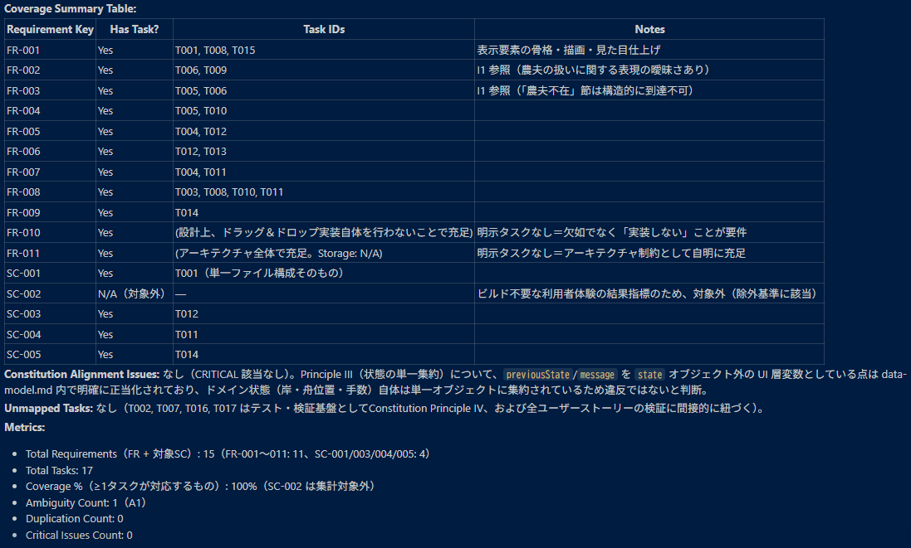
>
> **Coverage Summary**: 全15要件（FR11件＋対象SC4件）に対しタスク対応 **100%**（SC-002は集計対象外）、Ambiguity 1件、Duplication 0件、**Critical Issues 0件**。Constitution Alignment Issuesもなし。
>
> 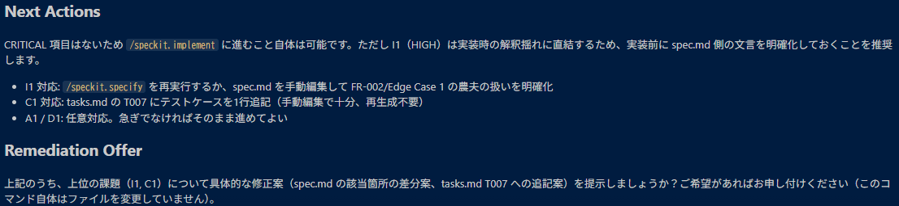
>
> **Next Actions**: CRITICALが無いため `/speckit.implement` に進むこと自体は可能。ただしI1（HIGH）は実装時の解釈揺れに直結するため、実装前に `spec.md` の文言明確化を推奨、と提案された。修正案の自動提示（Remediation Offer）も申し出られたが、**このコマンド自体はファイルを一切変更していない**（読み取り専用）。
>
> **観察ポイント**: I1は「AIが自分自身の過去の判断（演習4の設計）と、別の成果物（演習2の仕様）の矛盾を検出した」実例で、`/speckit.analyze` が単なる建前ではなく実際に機能することを示している。AI-DLCであれば、このような矛盾は各ステージで**人間が `requirements.md`/`business-rules.md` を読み比べる**ことで発見する想定だが、Spec Kitでは機械的な横断チェックとして自動化されている。一方でCRITICALではないため、**進めるかどうかの最終判断はユーザーに委ねられている**（AI-DLCの承認ゲートのように強制はされない）点は演習6の解説通り。

**ここで学んだこと**: AI-DLC の各ステージ末には**人間が生成物を読んで承認する明示的なゲート**があり、承認しないと次に進めない。`/speckit.analyze` は整合性の**機械チェック**であり、実行するかどうか・結果を受けて先へ進むかはユーザー判断に委ねられる。「立ち止まって確認する」思想は共通だが、AI-DLC の方がゲートとしての強制力が明示的。本教材の実例（I1）のように、`/speckit.analyze` は実際に有用な矛盾を検出できるため、**CRITICALでなくても指摘には目を通す価値がある**。

---

### 演習7: 実装 — `/speckit.implement`

**目的**: tasks.md を順番に実行させ、TDD（Red→Green）でコードを生成する。

```text
/speckit.implement
```

✅ **確認ポイント（動作確認、AI-DLC版と同じ観点）**:

```bash
node --test                 # plan で node:test を指定した場合
start index.html            # Git Bash からWindows既定ブラウザで開く
```

- [ ] ブラウザで `index.html` を開くだけで動作する
- [ ] 古典的な7手の正解手順でクリアできる
- [ ] 失敗操作（農夫不在でオオカミ×ヤギ等）で直前状態に巻き戻る
- [ ] 乗客がいる状態での二重乗船が無視される
- [ ] 「最初からやり直す」で初期化される

> #### 📋 実例（本教材で実際に得られた生成結果）
>
> 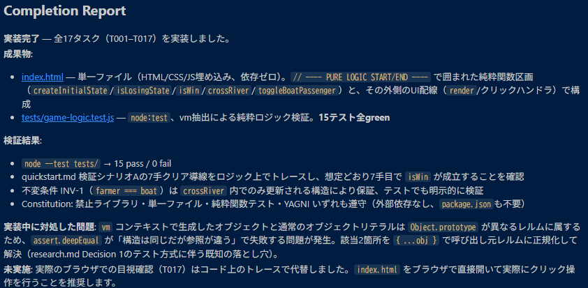
>
> **Completion Report**: 全17タスク（T001〜T017）を実装完了。
> - **成果物**: `index.html`（単一ファイル、依存ゼロ。`// ---- PURE LOGIC START/END ----` で囲んだ純粋関数区画〔`createInitialState`/`isLosingState`/`isWin`/`crossRiver`/`toggleBoatPassenger`〕と、その外側のUI配線〔`render`/クリックハンドラ〕で構成）／`tests/game-logic.test.js`（`node:test` ＋ `vm` 抽出による純粋ロジック検証、**15テスト全green**）
> - **検証結果**: `node --test tests/` → 15 pass / 0 fail。`quickstart.md` シナリオAの7手クリア導線をロジック上でトレースし7手目で `isWin` 成立を確認。不変条件INV-1（`farmer === boat`）は `crossRiver` 内でのみ更新される構造で保証、テストでも明示的に検証。Constitution（禁止ライブラリ・単一ファイル・純粋関数テスト・YAGNI）はいずれも遵守
> - **実装中に対処した問題**: `vm` コンテキストで生成したオブジェクトと通常のオブジェクトリテラルは `Object.prototype` が異なるレルムに属するため、`assert.deepEqual` が「構造は同じだが参照が違う」で失敗する問題が発生。該当2箇所を `{...obj}` で呼び出し元レルムに正規化して解決（`research.md` Decision 1のテスト方式に伴う既知の落とし穴）
> - **未実施**: 実際のブラウザでの目視確認（T017）は**コード上のトレースで代替**されており、実ブラウザでのクリック操作確認はまだ済んでいない
>
> **観察ポイント**: AIによる「15テスト全green」はあくまで `vm` 抽出によるロジック単体テストの結果であり、実ブラウザでのクリック操作は未確認のまま報告された。これはAI-DLC版でも同様に起きたパターン（AIの自己検証はNode.js単体実行＋Playwrightだったが、記録者が別途独立検証を行った）と一致する。**「テスト全green」の報告を鵜呑みにせず、次の演習8で必ず自分の手でブラウザ動作を確認する**ことが重要。

**ここで学んだこと**: `/speckit.implement` は AI-DLC の Code Generation ステージに相当。AI-DLC には Construction フェーズ末に **Build and Test という独立ステージ**（Unit/Integration/E2E/Performance/Securityの観点を明示的に洗い出す）があるが、Spec Kit の標準ワークフローには同等の専用ステージがなく、テストは `/speckit.plan`/`/speckit.tasks` でどこまでタスク化したか次第。

---

### 演習8: 独立検証（Spec Kit標準外・推奨プラクティス）

**目的**: AIの自己申告に頼らず、自分の手で動作を検証する。AI-DLC版の検証記録と同じ観点を流用する。演習7の実例で「ブラウザでの目視確認は未実施」と分かったので、まずはブラウザで `index.html` を開く。

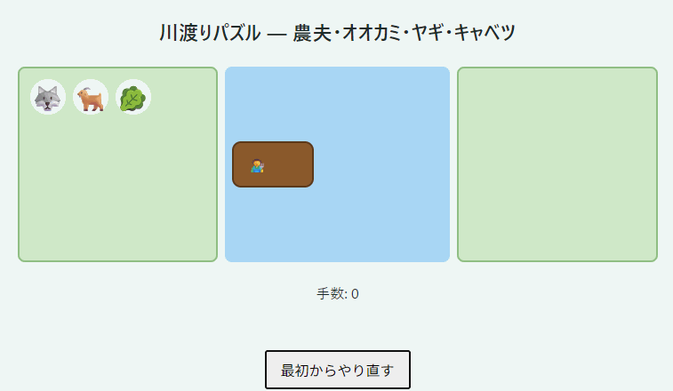

✅ **確認ポイント**: `vision-document.md` の「見た目: 絵文字・CSS図形」の通り、フレームワーク・画像素材なしで登場物（🐺🐐🥬）・両岸・舟・手数・「最初からやり直す」ボタンが表示されている。ここまでは静的な見た目の確認であり、**実際にクリックしてゲームが遊べるか**は次の手順で確認する。

```bash
node -e "
const state = { farmer:'left', wolf:'left', goat:'left', cabbage:'left', boat:'left', moves:0 };
// index.html から抽出した isLosingState / isWin / cross をここに貼り付けて検証
"
```

✅ **確認ポイント**: 古典7手の正解手順で `status==='won'` かつ `moves===7`。

**ここで学んだこと**: どちらの手法を使っても、実装後の独立検証を省略してはならない。これはAI-DLC版・Spec Kit版で共通の教訓。

---

### 演習9（任意）: 仕上げ — チェックリストとマージ

```text
/speckit.checklist 仕様の完全性と一貫性を検証するチェックリストを作成してください
```

> #### 📋 実例（本教材で実際に得られた生成結果）
>
> 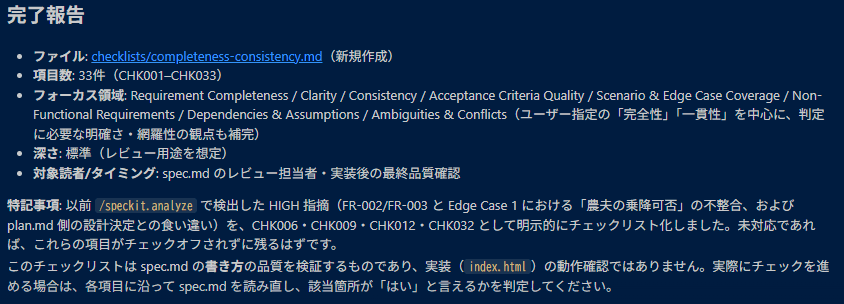
>
> - **ファイル**: `checklists/completeness-consistency.md`（新規作成）／**項目数**: 33件（CHK001〜CHK033）
> - **フォーカス領域**: Requirement Completeness / Clarity / Consistency / Acceptance Criteria Quality / Scenario & Edge Case Coverage / Non-Functional Requirements / Dependencies & Assumptions / Ambiguities & Conflicts（指定した「完全性」「一貫性」を中心に、判定に必要な明確さ・網羅性の観点も補完）
> - **深さ**: 標準（レビュー用途を想定）／**対象読者・タイミング**: `spec.md` のレビュー担当者・実装後の最終品質確認
> - **特記事項**: 演習6の `/speckit.analyze` で検出したHIGH指摘（I1: FR-002/FR-003とEdge Case 1における「農夫の乗降可否」の不整合）を、**CHK006・CHK009・CHK012・CHK032として明示的にチェックリスト化**。未対応であれば、これらは現時点でチェックオフされずに残っているはず
>
> **観察ポイント**: `/speckit.checklist` が生成したのは `spec.md` の**書き方の品質を検証するチェックリスト**であり、`index.html` の動作確認ではない。そして演習6で見つかった矛盾（I1）が本教材では未修正のまま演習7・8まで進んでいるため、この33項目チェックリストを実際に回すと**CHK006等が「いいえ」判定になり、指摘が再浮上する**はず。これは `/speckit.analyze`（成果物同士の矛盾検査）と `/speckit.checklist`（要件の書き方・網羅性チェック）が独立した別ゲートでありながら、**同じ問題を異なる角度から繰り返し検出できる**ことを示す実例。AI-DLCであれば「指摘を先送りにした状態」は人間の承認ゲートで押し戻されるはずの場面であり、Spec Kitでは複数の非強制ゲートの積み重ねで同種の効果を狙っていることが分かる。

```bash
git add -A && git commit -m "feat: 川渡りパズル実装 (Spec Kit SDD)"
git switch main && git merge 001-river-crossing-puzzle   # ブランチ名は実際のものに置き換え
```

**ここで学んだこと**: `checklist` は `analyze`（今ある成果物同士の矛盾）とは異なり、「まだ書かれていない要件の抜け」を見つける役割を持つ。ただし本教材の実例のように、`analyze` で見つけた指摘を放置すると `checklist` 側にも同じ問題が形を変えて現れることがあり、**両方のゲートを併用する価値**が実感できる。

---

## 4. 習得事項のまとめ

### 4.1 触れた要素の一覧

| カテゴリ | 要素 |
|---|---|
| CLI | `specify init --integration claude` |
| スラッシュコマンド | `/speckit.constitution` `/speckit.specify` `/speckit.clarify` `/speckit.plan` `/speckit.tasks` `/speckit.analyze` `/speckit.implement` `/speckit.checklist` |
| 生成物 | constitution.md, spec.md, plan.md, research.md, data-model.md, quickstart.md, tasks.md |
| 開発プラクティス | ユーザーストーリー分割、TDD（Red→Green）、featureブランチ運用、Constitution Check |

### 4.2 トラブルシューティング

| 症状 | 対処 |
|---|---|
| `specify: command not found` | ターミナルを開き直す。ダメなら `uv tool update-shell` 後に再起動 |
| `/speckit.*` が Claude Code に出ない | `.claude/skills/` があるプロジェクトルートで `claude` を起動しているか確認 |
| 古い記事の `--ai claude` が動かない | 現行版は `--integration claude`（オプション名変更済み） |
| `plan.md` が作り込みすぎている | 「憲法のシンプルさ原則に照らして過剰な要素があれば削除して」と明示的に指示する |
| Windows でスクリプトエラー | Git Bash を使用する（`.specify/scripts/bash/` が前提） |
| ファイルを参照させたのに内容が反映されない | プロンプトにファイル名（`vision-document.md` 等）を明記しているか確認する。それでも反映されない場合は「まず `technical-environment.md` を開いて中身を確認してから」のように、読み込みを明示的な最初のステップとして指示する |

### 4.3 AI-DLC との比較まとめ（実測ベース）

| 観点 | AWS AI-DLC | GitHub Spec Kit |
|---|---|---|
| 基本思想 | Never Vibe Code（要件→設計→計画→コードの一本の鎖） | Spec-Driven Development（仕様を実行可能な一次情報とする） |
| 対応AIエージェント | Claude Code 前提（`CLAUDE.md` 密結合） | マルチエージェント対応（`--integration` でClaude Code/Copilot等を選択） |
| 事前ドキュメント | `vision-document.md`/`technical-environment.md` をユーザーが事前作成し入力 | なし。`/speckit.constitution`/`/speckit.specify` にその場で書く |
| 質問の出し方 | ファイルに書き出し、`[Answer]:` で回答して読み直させる | `/speckit.clarify` でチャット対話（最大5問、実測では3問で収束した例あり） |
| 適応的ワークフロー | プロジェクトの複雑さに応じAIがステージのスキップ・深さを自動判断 | 基本は固定フロー。深さ調整は明示的な追加指示が必要 |
| 承認ゲート | 各ステージ終了時に人間の承認が明示的な関門 | `/speckit.analyze`（機械的整合性チェック、非破壊、進行の強制ブロックではない） |
| 進行管理 | `aidlc-state.md`/`audit.md` でステート・監査ログを保持 | Gitブランチ（`NNN-feature-name`）と `specs/` ディレクトリで管理 |
| テスト・検証 | Build and Testが独立ステージ（Unit/Integration/E2E/Perf/Security） | 標準ワークフローに専用ステージなし。`/speckit.plan`/`tasks`の指定次第 |
| 品質チェック | 承認ゲートに統合 | `/speckit.analyze`（矛盾検査）と `/speckit.checklist`（要件の抜け検査）で役割分担 |
| ブラウンフィールド対応 | Reverse Engineering ワークフローあり | `specify init . --force --integration claude` で既存プロジェクトに後付け可能 |

**総括**: 両者とも「AIにいきなりコードを書かせない」「仕様・計画を成果物として残し後工程の根拠にする」思想は共通。違いは、AI-DLC が**単一エージェントに密結合し、承認ゲートで進行を強く制御する**設計であるのに対し、Spec Kit は**マルチエージェント対応のテンプレート配布**に軸足を置き、進行の強制力よりも仕様書自体の一貫性（`analyze`/`checklist`）を重視する設計であること。

---

## 5. 今後の学習ロードマップ

1. **`/speckit.clarify` を意図的にスキップした場合の差を見る**（優先度: 高）— clarifyを飛ばして直接 plan → tasks → implement まで進め、`/speckit.analyze` でどんな指摘が増えるかを、AI-DLC版で質問に丁寧に答えた場合との差として比較する
2. **同一結果の突き合わせ**（優先度: 高）— AI-DLC版とSpec Kit版、それぞれの `index.html` の実装（状態モデル・純粋関数の書き方）を横に並べて差分を見る。設計判断がどこで分岐したかが分かる
3. **ブラウンフィールド適用**（優先度: 中）— AI-DLC版の `index.html` に対して `specify init . --force --integration claude` を実行し、既存コードから逆算して `spec.md` を書く体験をする。AI-DLC の Reverse Engineering ワークフローとの比較材料になる
4. **他のAIエージェントとの比較**（優先度: 低）— 同じ `specs/` 成果物を `--integration copilot` 等別エージェントの `implement` に渡し、実装結果の差異を観察する

### 参考リンク

- [github/spec-kit（公式リポジトリ）](https://github.com/github/spec-kit)
- [公式ドキュメントサイト](https://github.github.io/spec-kit/)
- [Releases（最新バージョン確認）](https://github.com/github/spec-kit/releases)
- 比較対象（AI-DLC版・別プロジェクト）: `C:\Users\Yoshi\Claude\Handson\RiverCrossingPuzzle\docs\ja\実施記録_ハンズオン教材用.md`
- 同フォルダの先行ハンズオン（Todoアプリ・実行結果付き）: [`spec-kit-handson-v2.md`](./spec-kit-handson-v2.md)
