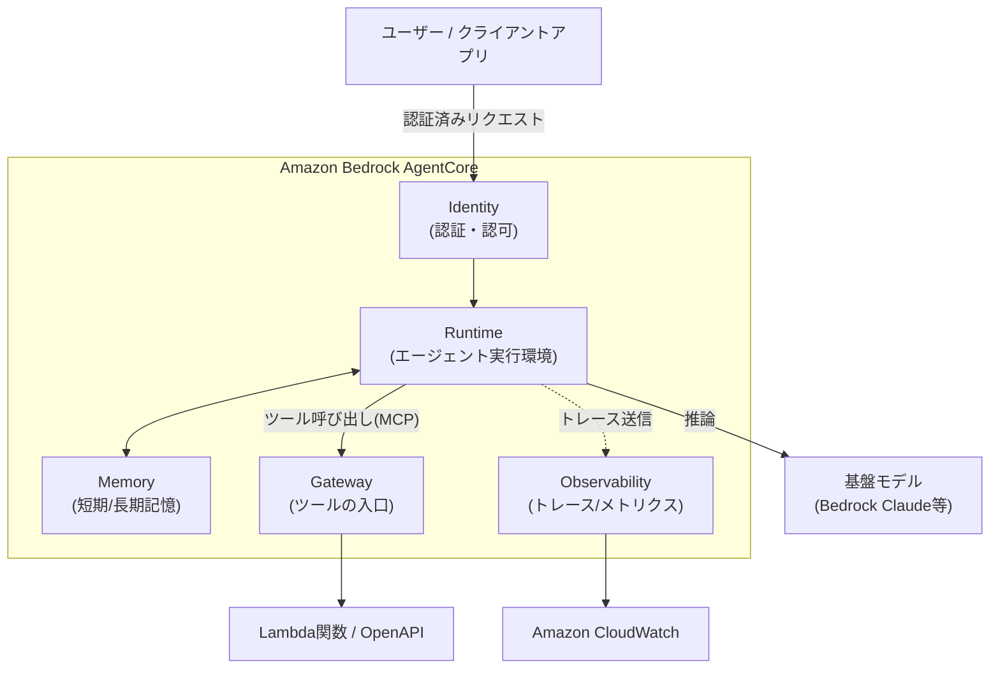
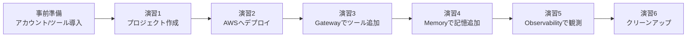
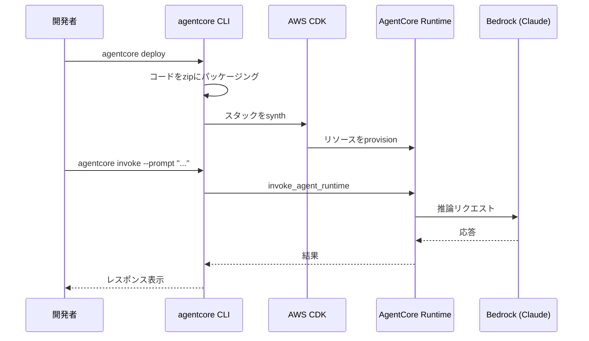

# AWS Agent Core ハンズオン — Strandsエージェントを作って、AWS上に本番デプロイし、ツール・記憶・可観測性まで一気通貫で体験する

## 1. 勉強対象の概要

### Amazon Bedrock AgentCoreとは

**Amazon Bedrock AgentCore**（以下 AgentCore）は、AIエージェントを「本番運用」するためのフルマネージドなプラットフォームです。LangGraph・CrewAI・Strands Agents・Google ADK・OpenAI Agents SDKなど好きなフレームワークと、Bedrock・Anthropic・OpenAI・Geminiなど好きなモデルを組み合わせて作ったエージェントを、インフラ管理なしで安全かつスケーラブルに動かすための部品群を提供します。

「エージェントのコードを書く」ところまではフレームワークが得意でも、「それを誰が呼び出せるようにするか」「会話の記憶をどう永続化するか」「社内APIをどう安全にツール化するか」「本番で何が起きているかどう追跡するか」は毎回自作すると非常に手間がかかります。AgentCoreはこの"最後の1マイル"をサービスとして提供します。

### 中心となるコンポーネント

| コンポーネント | 役割 |
|---|---|
| **Runtime** | エージェント／ツールをサーバーレスで動かすホスティング環境。セッションごとに隔離されたmicroVMで実行され、最大8時間の長時間実行にも対応 |
| **Gateway** | 既存のLambda関数やOpenAPI、他のMCPサーバーを「MCP互換ツール」に変換し、単一のセキュアなエンドポイントとしてエージェントに公開する |
| **Memory** | 短期記憶（セッション内の会話履歴）と長期記憶（セッションをまたぐ事実・要約・嗜好の抽出）をマネージドで提供 |
| **Identity** | エージェント自身のワークロードID管理、ユーザー認証（Inbound Auth）、外部サービスへの認可（Outbound Auth）を一元管理 |
| **Observability** | OpenTelemetry準拠のトレース・メトリクス・ログをCloudWatchに集約し、エージェントの意思決定プロセスを可視化 |
| **Browser / Code Interpreter** | Webブラウジングやコード実行をエージェントに安全に行わせるためのマネージドサンドボックス |

### 全体構成イメージ



### 周辺エコシステムとの関係

AgentCoreは「エージェントロジックをどう書くか」には関与しません。そこは Strands Agents / LangGraph / CrewAI などの**フレームワーク**の仕事です。AgentCoreはその成果物を「どう本番で動かすか」を担当する、インフラ側のレイヤーだと理解すると位置づけが掴みやすくなります。

---

## 2. ハンズオンの概要

### 想定環境・所要時間

| 項目 | 内容 |
|---|---|
| 想定読者 | AWSの基本操作（IAM、CloudWatchなど）は理解しているが、AgentCoreは初めて触る人 |
| 所要時間の目安 | 約2.5〜3時間 |
| 実行環境 | Windows + Git Bash（WSLがあればなお快適）／ macOS / Linux |
| 必要なもの | AWSアカウント、Node.js 20+、Python 3.10+、`uv`、Amazon Bedrockでのモデルアクセス有効化 |
| フレームワーク | **Strands Agents**（AgentCoreが最も手厚くサポートする軽量エージェントフレームワーク） |

### ゴールイメージ

このハンズオンを終えると、以下ができるようになっています。

- `agentcore` CLIでエージェントプロジェクトを作成し、ローカルで動作確認できる
- 作成したエージェントをAgentCore Runtimeに実際にデプロイし、AWS上で呼び出せる
- Lambda関数をGateway経由でMCPツール化し、エージェントに使わせられる
- AgentCore Memoryで会話の短期記憶・長期記憶を持たせられる
- CloudWatchでエージェントの実行トレースを確認できる
- 使い終わったリソースを安全に削除できる

### 学べることの全体像

| 演習 | 学習項目 | 触れるAgentCoreコンポーネント |
|---|---|---|
| 演習1 | プロジェクトの作成とローカル実行 | CLI, Runtime(ローカル) |
| 演習2 | AWSへのデプロイと呼び出し | Runtime |
| 演習3 | Lambdaをツール化してエージェントに使わせる | Gateway |
| 演習4 | 会話の記憶を持たせる | Memory |
| 演習5 | 実行状況をトレースで可視化する | Observability |
| 演習6 | リソースの後片付け | Runtime, Gateway, Memory |

### ハンズオンの流れ



---

## 3. ハンズオンの手順

### 事前準備

1. **AWSアカウント**を用意し、認証情報を設定する（`aws configure` または環境変数）。
2. **Amazon Bedrockのモデルアクセスを有効化**する。AWSコンソール（リージョンを **アジアパシフィック（東京）/ ap-northeast-1** に切り替えた状態で）→ Bedrock → 「モデルアクセス」で **Anthropic Claude Sonnet 4.6** を有効化してください。このハンズオンはリージョン `ap-northeast-1`（東京）、モデルは **Claude Sonnet 4.6** を前提にします。
   > ⚠️ **東京リージョン特有の注意点**: 東京リージョン（`ap-northeast-1`）はClaude Sonnet 4.6の「In-Region」提供対象外で、**Geoクロスリージョン推論プロファイル経由でのみ**呼び出せます。モデルIDをそのまま（`anthropic.claude-sonnet-4-6`）指定するとエラーになるため、必ず **`jp.anthropic.claude-sonnet-4-6`**（JPジオ推論プロファイルID。東京・大阪にルーティングされます）を指定してください。本ハンズオンのコード例はこのIDを使用しています。
3. **Node.js 20以上**をインストール（AgentCore CLIはnpmパッケージとして配布されています）。
   ```bash
   node --version
   ```
4. **Python 3.10以上** と、高速なPythonパッケージマネージャ **uv** をインストールする。
   ```bash
   python3 --version
   curl -LsSf https://astral.sh/uv/install.sh | sh   # uvが未導入の場合
   ```
5. IAM権限として、AgentCoreのAPI呼び出しとCDKブートストラップ用ロールをAssumeできる権限が必要です（学習目的であれば管理者相当のIAMユーザー/ロールで進めるのが簡単です）。

✅ **確認ポイント**: `node --version`、`python3 --version`、`aws sts get-caller-identity` がすべてエラーなく実行できること。

---

### 演習1: プロジェクトを作成してローカルで動かす

**目的**: AgentCore CLIの基本操作（`create` → `dev`）を体験し、Strandsエージェントの最小構成を理解する。

#### 手順

1. AgentCore CLIをグローバルインストールします。
   ```bash
   npm install -g @aws/agentcore
   agentcore --version
   ```

2. プロジェクトを初期化します。今回は`uv`でPythonプロジェクトを作ってから、AgentCore CLIでエージェントを追加する流れにします。
   ```bash
   uv init my_first_agent --python 3.13
   cd my_first_agent
   uv add bedrock-agentcore strands-agents
   ```
   各コマンドの意味は以下の通りです。

   | コマンド | 説明 |
   |---|---|
   | `uv init my_first_agent --python 3.13` | `my_first_agent`という名前のディレクトリを作成し、Python 3.13を使う新規Pythonプロジェクトとして初期化する。`pyproject.toml`（依存関係の定義ファイル）や`.python-version`などの雛形ファイルがここで生成される |
   | `uv add bedrock-agentcore strands-agents` | プロジェクトに2つのPythonパッケージを依存関係として追加し、インストールする。`bedrock-agentcore`はAgentCore Runtime向けのアプリを書くためのSDK（`BedrockAgentCoreApp`などを提供）、`strands-agents`はエージェントのループ（モデル呼び出し・ツール実行の制御）を実装するStrands Agents SDK。実行すると`.venv`という仮想環境ディレクトリが自動作成され、`pyproject.toml`と依存関係を固定する`uv.lock`が更新される |

3. `agentcore create` でエージェントの雛形を生成します。対話式ウィザードが起動するので、以下を選択してください。
   - **Agent**（コードベースのエージェント）
   - フレームワーク: **Strands Agents**
   - モデルプロバイダ: **Amazon Bedrock**
   - メモリ: **None**（記憶は演習4で追加します）
   - ビルド種別: **CodeZip**

   コマンド一発で指定する場合は以下でも同じ結果になります。
   ```bash
   agentcore create \
     --name MyAgent \
     --framework Strands \
     --model-provider Bedrock \
     --memory none \
     --build CodeZip
   ```

4. 生成されたプロジェクト構成を確認します。
   ```
   my_first_agent/
   ├── agentcore/
   │   ├── agentcore.json      # プロジェクト/リソース定義
   │   └── aws-targets.json    # デプロイ先アカウント/リージョン
   └── app/
       └── MyAgent/
           ├── main.py         # エージェントのエントリーポイント
           └── pyproject.toml
   ```

   `app/MyAgent/main.py` を開くと、以下のような構造になっているはずです（フレームワーク選択により細部は異なります）。

   ```python
   from bedrock_agentcore.runtime import BedrockAgentCoreApp
   from strands import Agent

   app = BedrockAgentCoreApp()

   @app.entrypoint
   def invoke(payload, context):
       agent = Agent(system_prompt="You are a helpful assistant.")
       response = agent(payload.get("prompt"))
       return response

   if __name__ == "__main__":
       app.run()
   ```

   `@app.entrypoint` が付いた関数がAgentCore Runtimeから呼び出される入り口になります。

5. ローカルサーバーを起動して動作確認します（ポート8080が空いていることを確認してください）。
   ```bash
   cd my_first_agent
   agentcore dev --no-browser
   ```
   別のターミナルを開いて呼び出します。
   ```bash
   curl -X POST http://localhost:8080/invocations \
     -H "Content-Type: application/json" \
     -d '{"prompt": "自己紹介してください"}'
   ```

✅ **確認ポイント**: `{"result": "..."}` のようなJSONレスポンスが返ってくれば成功です。ターミナルで `Ctrl+C` を押してローカルサーバーを停止します。

**ここで学んだこと**: `agentcore create` はフレームワーク・モデル・メモリなどの設定をもとにエージェントの雛形一式（コード＋設定ファイル）を生成し、`agentcore dev` はそれをローカルでホットリロード付きで即座に動かせる。

---

### 演習2: AWSにデプロイして呼び出す

**目的**: ローカルで動いたエージェントを実際にAgentCore Runtime上にデプロイし、クラウド経由で呼び出す。

#### 手順

1. デプロイを実行します。初回はCDKのブートストラップが走るため数分かかります。
   ```bash
   agentcore deploy
   ```
   デプロイは内部的に、①コードをzipアーティファクトへパッケージング → ②AWS CDKでインフラをsynth/provision → ③AgentCore Runtimeエンドポイントを作成 → ④CloudWatchロギング/Observabilityを構成、という流れで進みます。

   何が変更されるか事前に確認したい場合はドライランが使えます。
   ```bash
   agentcore deploy --dry-run
   ```

2. デプロイ状況を確認します。
   ```bash
   agentcore status
   ```

3. デプロイしたエージェントを呼び出します。
   ```bash
   agentcore invoke --prompt "Hello, what can you do?"
   ```

4. ログをその場でストリーミング確認することもできます。
   ```bash
   agentcore logs --since 10m
   ```

#### 処理の流れ



✅ **確認ポイント**: `agentcore invoke` がAWS上のエージェントから応答を返すこと。`agentcore status` で Runtime のステータスが `READY` 相当になっていること。

> 💡 **boto3で直接デプロイ/呼び出しをしたい場合**（CI/CDに組み込む場合など）は、`bedrock-agentcore-control` クライアントの `create_agent_runtime` / `update_agent_runtime` と、`bedrock-agentcore` クライアントの `invoke_agent_runtime` をコードから直接叩くこともできます。CLIはこれらのAPI呼び出しを裏側で自動化しているだけです。

**ここで学んだこと**: AgentCore Runtimeは「zipで固めたコード＋実行ロール」を渡すだけでサーバーレスに動くエージェントホスティング環境であり、セッションごとに隔離されたmicroVMで実行される。

---

### 演習3: Gatewayで独自ツール（Lambda）をエージェントに持たせる

**目的**: 既存のLambda関数を、コードを書き換えずにMCP互換ツールとして公開し、エージェントから呼び出せるようにする。

#### 手順

1. 新しいプロジェクトを作り、エージェントとGatewayを一緒に用意します。
   ```bash
   agentcore create --name MyGatewayAgent --defaults
   cd MyGatewayAgent
   ```
   `--defaults` を付けるとStrandsエージェントの標準構成が自動選択されます。

2. Gatewayを追加します。学習用として、まずは認証なし（`NONE`）で作成します。
   ```bash
   agentcore add gateway --name TestGateway --authorizer-type NONE --runtimes MyGatewayAgent
   ```

3. 呼び出したいツールの入出力スキーマを`tools.json`として定義し、既存のLambda関数（ARN）をターゲットとして登録します。
   ```bash
   agentcore add gateway-target --name TestLambdaTarget --type lambda-function-arn \
     --lambda-arn <YOUR_LAMBDA_ARN> \
     --tool-schema-file tools.json \
     --gateway TestGateway
   ```
   （検証用のLambda関数がない場合は、`amazon-bedrock-agentcore-samples` リポジトリのGatewayサンプルに天気/時刻を返すモックLambdaが用意されています。）

4. デプロイします。
   ```bash
   agentcore deploy
   agentcore status   # GatewayのURLを控えておく
   ```

5. GatewayのURL（MCPエンドポイント）を使い、MCPクライアント経由でツールを呼び出すエージェントスクリプトを作成します。

   ```python
   # run_agent.py
   from strands import Agent
   from strands.models import BedrockModel
   from strands.tools.mcp.mcp_client import MCPClient
   from mcp.client.streamable_http import streamablehttp_client

   gateway_url = "<agentcore status で取得したGateway URL>"

   bedrock_model = BedrockModel(
       model_id="jp.anthropic.claude-sonnet-4-6",  # 東京(ap-northeast-1)用のJPジオ推論プロファイルID
       streaming=True,
   )

   mcp_client = MCPClient(lambda: streamablehttp_client(gateway_url))

   with mcp_client:
       tools = mcp_client.list_tools_sync()
       print("Available tools:", [t.tool_name for t in tools])

       agent = Agent(model=bedrock_model, tools=tools)
       response = agent("シアトルの天気を教えて")
       print(response.message)
   ```

   ```bash
   pip install strands-agents mcp
   python run_agent.py
   ```

✅ **確認ポイント**: `Available tools:` にLambdaで定義したツール名が表示され、エージェントがそのツールを使って応答を返すこと。以下のコマンドでもGatewayが生きているか直接確認できます。
```bash
curl -X POST <GATEWAY_URL> \
  -H "Content-Type: application/json" \
  -d '{"jsonrpc":"2.0","id":1,"method":"tools/list","params":{}}'
```

**ここで学んだこと**: Gatewayは「APIやLambdaをMCPツールへ変換する翻訳レイヤー」であり、認証方式（NONE / Cognitoなどを使ったJWT）をゲートウェイ単位で切り替えられる。本番では`--authorizer-type CUSTOM_JWT`でOAuth連携するのが基本となる。

---

### 演習4: Memoryでエージェントに記憶を持たせる

**目的**: 会話履歴（短期記憶）と、セッションをまたいで抽出される事実・要約（長期記憶）の違いを体験する。

#### 手順

1. セマンティック戦略付きのMemoryリソースを作成します。
   ```bash
   agentcore add memory --name CustomerSupportSemantic --strategies SEMANTIC
   agentcore deploy
   agentcore status
   ```

2. Pythonから直接イベント（会話ターン）を書き込んでみます。
   ```python
   import boto3
   from bedrock_agentcore.memory import MemorySessionManager
   from bedrock_agentcore.memory.constants import ConversationalMessage, MessageRole

   control_client = boto3.client('bedrock-agentcore-control', region_name='ap-northeast-1')
   memory_id = control_client.list_memories()['memories'][0]['id']

   session_manager = MemorySessionManager(memory_id=memory_id, region_name="ap-northeast-1")
   session = session_manager.create_memory_session(
       actor_id="User1",
       session_id="OrderSupportSession1",
   )

   session.add_turns(messages=[
       ConversationalMessage("Hi, how can I help you today?", MessageRole.ASSISTANT)
   ])
   session.add_turns(messages=[
       ConversationalMessage(
           "Hi, I am a new customer. My order #35476 hasn't arrived.",
           MessageRole.USER)
   ])
   session.add_turns(messages=[
       ConversationalMessage("I'm sorry to hear that. Let me look up your order.", MessageRole.ASSISTANT)
   ])

   # 短期記憶: 直近のターンを取得
   for turn in session.get_last_k_turns(k=5):
       print("Turn:", turn)
   ```

3. 数秒待ってから、長期記憶に抽出された情報を確認します。
   ```python
   records = session.list_long_term_memory_records(namespace_path="/")
   for r in records:
       print("Memory record:", r)

   # 意味検索での取得も可能
   results = session.search_long_term_memories(
       query="サポート内容を要約して",
       namespace_path="/",
       top_k=3,
   )
   ```

4. **応用**: 演習1〜2で作ったエージェントにMemoryを組み込む場合は、`app/MyAgent/memory/session.py` に `AgentCoreMemorySessionManager` を定義し、`main.py` の `Agent(...)` 生成時に `session_manager=` として渡します。デプロイ後は環境変数 `MEMORY_<NAME>_ID` が自動的にエージェントの実行環境に注入されます。

✅ **確認ポイント**: `get_last_k_turns` で直近の会話が取れること、そしてイベント書き込みから少し時間を置くと`list_long_term_memory_records`で注文番号などの事実が抽出されて出てくること。

**ここで学んだこと**: 短期記憶は「そのままの会話ログ」、長期記憶は「LLMが会話から抽出した要点」であり、後者は`SEMANTIC`（事実抽出）や`SUMMARIZATION`（要約）などの**戦略（strategy）**単位で挙動を切り替えられる。

---

### 演習5: Observabilityでトレースを見る

**目的**: エージェントの推論ステップ・ツール呼び出しをCloudWatchで可視化する。

#### 手順

1. まだ有効化していなければ、**CloudWatch Transaction Search**を一度だけ有効化します（アカウント単位の設定です）。
   - コンソールで行う場合: CloudWatchコンソール → **Application Signals (APM)** → **Transaction search** → **Enable Transaction Search**
   - CLIで行う場合:
     ```bash
     aws xray update-trace-segment-destination --destination CloudWatchLogs
     ```

2. トレースをより詳細に取得したい場合は、依存関係にADOT（AWS Distro for OpenTelemetry）を追加します。
   ```bash
   uv add aws-opentelemetry-distro
   ```
   ローカル実行時はエントリーポイントをOpenTelemetryでラップします。
   ```bash
   opentelemetry-instrument python main.py
   ```
   （AgentCore CLIでデプロイした場合、`agentcore deploy`が自動でこの計装を組み込みます。）

3. 演習2で呼び出したエージェントに対して、もう数回`agentcore invoke`を実行し、トレースを生成します。
   ```bash
   agentcore invoke --prompt "東京の観光名所を3つ教えて"
   ```

4. [CloudWatch GenAI Observability コンソール](https://console.aws.amazon.com/cloudwatch/home#gen-ai-observability) を開き、エージェントの実行トレース（推論ステップ、レイテンシ、ツール呼び出し）を確認します。

5. ログをCLIから直接確認することもできます。
   ```bash
   agentcore logs --since 30m --level error
   agentcore traces list
   agentcore traces get <trace-id>
   ```

✅ **確認ポイント**: CloudWatch GenAI Observabilityページに直近の呼び出しがトレースとして表示され、各ステップ（モデル呼び出し・ツール呼び出し）の所要時間が確認できること。

**ここで学んだこと**: AgentCoreはデフォルトでもRuntime・Memory・Gatewayの基本メトリクスをCloudWatchに出しているが、ADOTを組み込むことでエージェントの「思考の中身」まで含めた詳細なスパン/トレースを取得できる。

---

### 演習6: クリーンアップ

**目的**: 課金が発生し続けないよう、作成したリソースを確実に削除する。

#### 手順

各プロジェクトディレクトリで以下を実行します（演習1〜2用、演習3用、演習4用のプロジェクトそれぞれで行ってください）。

```bash
agentcore remove all
agentcore deploy
```

`remove all` は設定ファイル上のリソース定義を空にし、続く`agentcore deploy`がその差分を検知してAWS上の実リソース（Runtime・Gateway・Memoryなど）を削除します。

✅ **確認ポイント**: `agentcore status` でリソースが存在しないことを確認、またはAWSコンソールのAgentCore各ページ（Agents / Gateways / Memory）で該当リソースが消えていることを確認する。演習3でLambda関数を別途作成した場合は、それも忘れずに削除してください。

---

## 4. 習得事項のまとめ

### 触れた要素の一覧

| 要素 | 使ったコマンド/API | 概要 |
|---|---|---|
| CLIセットアップ | `npm install -g @aws/agentcore` | AgentCore CLI導入 |
| プロジェクト作成 | `agentcore create` | フレームワーク/モデル/メモリを選んでエージェント雛形を生成 |
| ローカル実行 | `agentcore dev` | ホットリロード付きローカルサーバー |
| デプロイ | `agentcore deploy` | zip化 → CDK → Runtimeエンドポイント作成 |
| 呼び出し | `agentcore invoke` | AWS上のエージェントを実行 |
| Gateway追加 | `agentcore add gateway` / `gateway-target` | Lambda等をMCPツール化 |
| Memory追加 | `agentcore add memory --strategies SEMANTIC` | 短期/長期記憶リソース作成 |
| Memory API | `MemorySessionManager`, `add_turns`, `list_long_term_memory_records` | 会話イベントの書き込み・記憶の取得 |
| Observability | CloudWatch Transaction Search, ADOT | トレース/メトリクスの可視化 |
| 後片付け | `agentcore remove all && agentcore deploy` | リソース削除 |

### つまずきやすいポイント

| 症状 | 原因 | 対処法 |
|---|---|---|
| `No module named 'strands'` | Python依存パッケージ未導入 | `pip install strands-agents`（またはプロジェクト内で`uv add strands-agents`） |
| `Model not enabled` | BedrockのモデルアクセスがOFF | Bedrockコンソール → モデルアクセス → Claudeモデルを有効化 |
| `AccessDeniedException` | IAM権限不足 | `bedrock-agentcore:*` 等の必要な権限をIAMユーザー/ロールに付与 |
| Gatewayが応答しない | 作成直後でDNS未反映 | 作成から30〜60秒待ってから再試行 |
| ローカルで8080番ポート使用中エラー | 他プロセスがポート占有 | `agentcore dev --port <別番号>` を指定 |
| 長期記憶にレコードが出てこない | 抽出処理には数秒〜数十秒のラグがある | 少し時間を置いてから`list_long_term_memory_records`を再実行 |

### 応用・発展

- 演習ではLambdaをGatewayのターゲットにしましたが、OpenAPI仕様やSmithyモデルをそのままターゲットにすることも可能です。既存の社内APIをそのままエージェントのツールにできます。
- `agentcore add credential` を使うと、Slack・GitHubなど非Bedrockな外部サービスへの認証情報（APIキー/OAuth）をIdentity経由で安全に管理できます。
- チーム開発では`agentcore.json`をGit管理し、CI/CDパイプラインから`agentcore deploy`を実行する運用が現実的です。

---

## 5. 今後の学習ロードマップ

優先順位の高い順に次の学習トピックを挙げます。

1. **AgentCore Identity（認証・認可の深掘り）** — 今回はGatewayを`NONE`認証で試しましたが、実運用ではCognito/Okta/Entra IDと連携したInbound Auth、外部サービスへのOutbound Authが必須になります。OAuthフローの設計を学びましょう。
2. **AgentCore Browser / Code Interpreter** — Webブラウジングやコード実行が必要なエージェント（リサーチ系、データ分析系）を作る場合に使うマネージドサンドボックスです。
3. **マルチエージェント構成（A2A・Gatewayでのエージェント間連携）** — 複数のエージェントを協調させる設計パターンを学ぶと、より複雑な業務プロセスに応用できます。
4. **AgentCore Evaluations / Optimization** — 本番投入後の品質評価とプロンプト/ツール記述の継続的な改善サイクルを学び、運用フェーズへ進みましょう。

### 参考リンク

- [Amazon Bedrock AgentCore Overview（公式）](https://docs.aws.amazon.com/bedrock-agentcore/latest/devguide/what-is-bedrock-agentcore.html)
- [Get started with Amazon Bedrock AgentCore（CLIクイックスタート）](https://docs.aws.amazon.com/bedrock-agentcore/latest/devguide/agentcore-get-started-cli.html)
- [Direct code deployment for Python](https://docs.aws.amazon.com/bedrock-agentcore/latest/devguide/runtime-get-started-code-deploy-python.html)
- [AgentCore Gateway クイックスタート](https://docs.aws.amazon.com/bedrock-agentcore/latest/devguide/gateway-quick-start.html)
- [AgentCore Memory クイックスタート](https://docs.aws.amazon.com/bedrock-agentcore/latest/devguide/memory-get-started.html)
- [AgentCore Observability 設定ガイド](https://docs.aws.amazon.com/bedrock-agentcore/latest/devguide/observability-configure.html)
- [AgentCore Identity](https://docs.aws.amazon.com/bedrock-agentcore/latest/devguide/identity.html)
- [amazon-bedrock-agentcore-samples（公式サンプル集）](https://github.com/awslabs/amazon-bedrock-agentcore-samples/)
- [Strands Agents SDK ドキュメント](https://strandsagents.com/latest/documentation/docs/)
- [AgentCore CLI ソースコード](https://github.com/aws/agentcore-cli)
