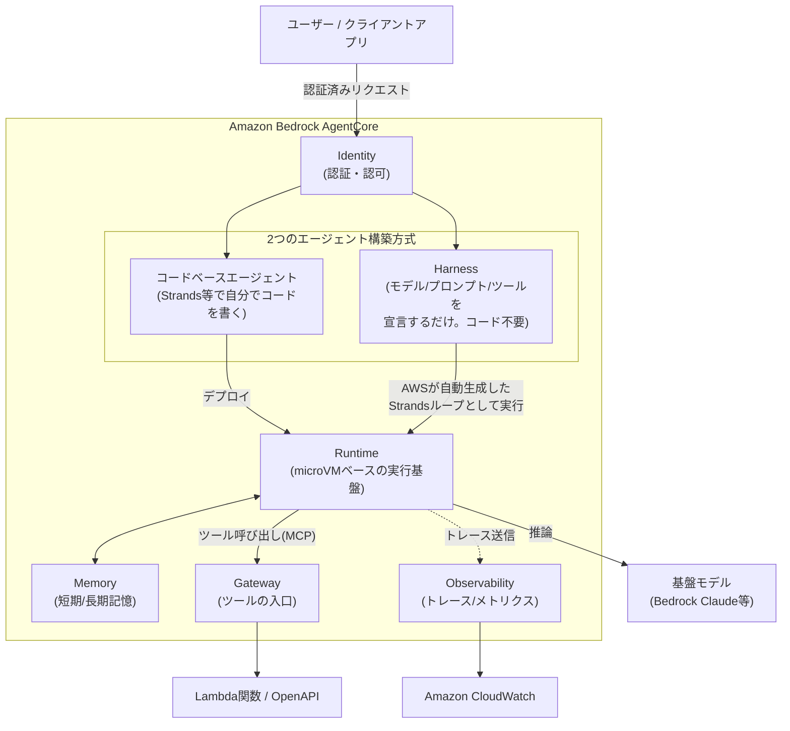
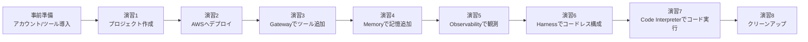
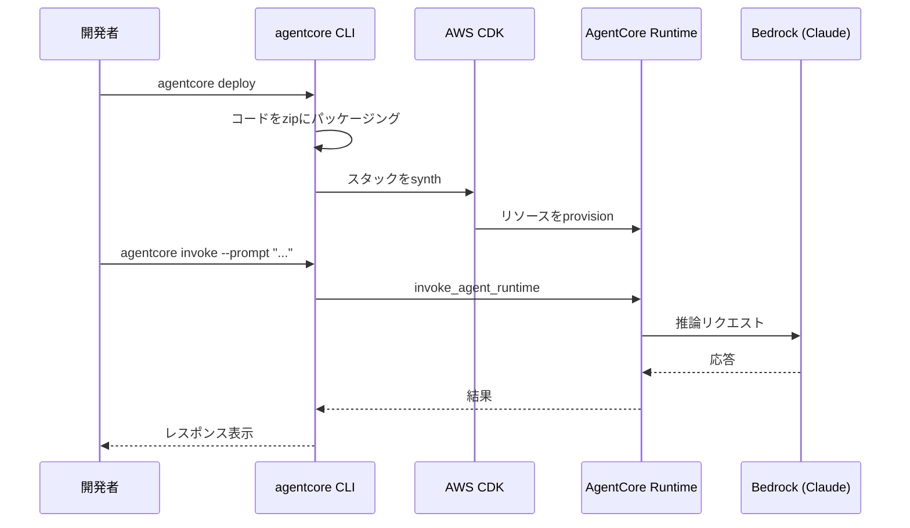
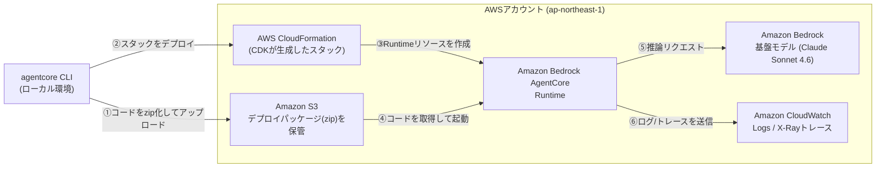
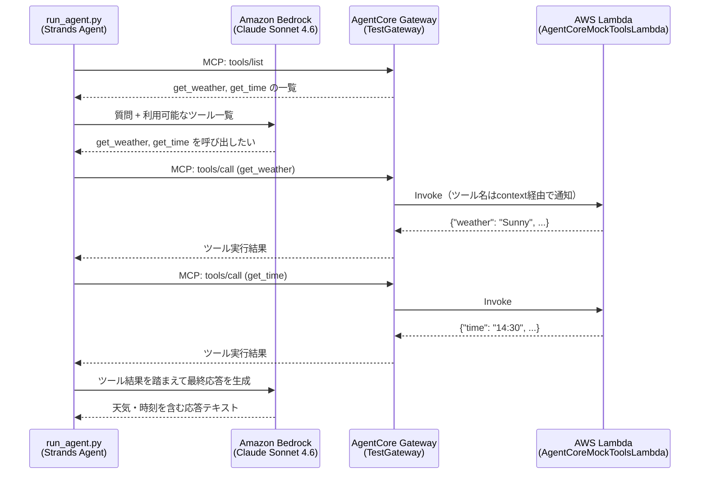

# AWS Agent Core ハンズオン — Strandsエージェントを作って、AWS上に本番デプロイし、ツール・記憶・可観測性まで一気通貫で体験する

## 1. 勉強対象の概要

### Amazon Bedrock AgentCoreとは

**Amazon Bedrock AgentCore**（以下 AgentCore）は、AIエージェントを「本番運用」するためのフルマネージドなプラットフォームです。LangGraph・CrewAI・Strands Agents・Google ADK・OpenAI Agents SDKなど好きなフレームワークと、Bedrock・Anthropic・OpenAI・Geminiなど好きなモデルを組み合わせて作ったエージェントを、インフラ管理なしで安全かつスケーラブルに動かすための部品群を提供します。

「エージェントのコードを書く」ところまではフレームワークが得意でも、「それを誰が呼び出せるようにするか」「会話の記憶をどう永続化するか」「社内APIをどう安全にツール化するか」「本番で何が起きているかどう追跡するか」は毎回自作すると非常に手間がかかります。AgentCoreはこの"最後の1マイル"をサービスとして提供します。

### 中心となるコンポーネント

| コンポーネント | 役割 |
|---|---|
| **Runtime** | エージェント／ツールをサーバーレスで動かすホスティング環境。セッションごとに隔離されたmicroVMで実行され、最大8時間の長時間実行にも対応 |
| **Harness** | モデル・システムプロンプト・ツールを**設定ファイルで宣言するだけ**で動くマネージドなエージェントループ。オーケストレーションのコードを書く必要がない |
| **Gateway** | 既存のLambda関数やOpenAPI、他のMCPサーバーを「MCP互換ツール」に変換し、単一のセキュアなエンドポイントとしてエージェントに公開する |
| **Memory** | 短期記憶（セッション内の会話履歴）と長期記憶（セッションをまたぐ事実・要約・嗜好の抽出）をマネージドで提供 |
| **Identity** | エージェント自身のワークロードID管理、ユーザー認証（Inbound Auth）、外部サービスへの認可（Outbound Auth）を一元管理 |
| **Observability** | OpenTelemetry準拠のトレース・メトリクス・ログをCloudWatchに集約し、エージェントの意思決定プロセスを可視化 |
| **Browser / Code Interpreter** | Webブラウジングやコード実行をエージェントに安全に行わせるためのマネージドサンドボックス |

### 全体構成イメージ



どちらの方式（コードベースエージェント／Harness）を選んでも、実行基盤としては同じ**Runtime**（microVM）の上で動き、Memory・Gateway・Observabilityといった他のAgentCoreコンポーネントもそのまま共有できます。違いは「エージェントの振る舞いをコードで書くか、設定だけで宣言するか」という一点です。

### 周辺エコシステムとの関係

AgentCoreは「エージェントロジックをどう書くか」には関与しません。そこは Strands Agents / LangGraph / CrewAI などの**フレームワーク**の仕事です。AgentCoreはその成果物を「どう本番で動かすか」を担当する、インフラ側のレイヤーだと理解すると位置づけが掴みやすくなります。

---

## 2. ハンズオンの概要

### 想定環境・所要時間

| 項目 | 内容 |
|---|---|
| 想定読者 | AWSの基本操作（IAM、CloudWatchなど）は理解しているが、AgentCoreは初めて触る人 |
| 所要時間の目安 | 約2.5〜3時間 |
| 実行環境 | Windows + Git Bash（WSLがあればなお快適）／ macOS / Linux |
| 必要なもの | AWSアカウント、Node.js 20+、Python 3.10+、`uv`、**AWS CLI v2（最新版）**、Amazon Bedrockでのモデルアクセス有効化 |
| フレームワーク | **Strands Agents**（AgentCoreが最も手厚くサポートする軽量エージェントフレームワーク） |

### ゴールイメージ

このハンズオンを終えると、以下ができるようになっています。

- `agentcore` CLIでエージェントプロジェクトを作成し、ローカルで動作確認できる
- 作成したエージェントをAgentCore Runtimeに実際にデプロイし、AWS上で呼び出せる
- Lambda関数をGateway経由でMCPツール化し、エージェントに使わせられる
- AgentCore Memoryで会話の短期記憶・長期記憶を持たせられる
- CloudWatchでエージェントの実行トレースを確認できる
- コードを1行も書かずにHarnessでエージェントを構成できる
- Code Interpreterでエージェントに正確なコード実行能力を持たせられる
- 使い終わったリソースを安全に削除できる

### 学べることの全体像

| 演習 | 学習項目 | 触れるAgentCoreコンポーネント |
|---|---|---|
| 演習1 | プロジェクトの作成とローカル実行 | CLI, Runtime(ローカル) |
| 演習2 | AWSへのデプロイと呼び出し | Runtime |
| 演習3 | Lambdaをツール化してエージェントに使わせる | Gateway |
| 演習4 | 会話の記憶を持たせる | Memory |
| 演習5 | 実行状況をトレースで可視化する | Observability |
| 演習6 | コードレスにエージェントを構成する | Harness |
| 演習7 | サンドボックスでコードを実行させる | Code Interpreter(組み込みツール) |
| 演習8 | リソースの後片付け | Runtime, Gateway, Memory, Harness |

### ハンズオンの流れ



---

## 3. ハンズオンの手順

### 事前準備

1. **AWSアカウント**を用意し、認証情報を設定する（`aws configure` または環境変数）。AWS SSO(IAM Identity Center)を利用している場合、セッションは一定時間で失効します。ハンズオンの途中で`Token has expired and refresh failed`のようなエラーが出たら、`aws sso login`（プロファイル指定時は`aws sso login --profile <プロファイル名>`）で再ログインしてから作業を再開してください。
   > ⚠️ **AWS CLIは最新版にアップグレードしておいてください**。`bedrock-agentcore-control`など本ハンズオンで使うサービスは比較的新しく追加されたものなので、古いバージョン（例: 2.24系）では`aws: error: argument command: Invalid choice`のようなエラーで存在しないコマンド扱いになります。`aws --version`で確認し、古い場合は[公式インストーラ](https://awscli.amazonaws.com/AWSCLIV2.msi)を再実行して上書きアップグレードしてください（2.36以降で動作確認済み）。
2. **Amazon Bedrockのモデルアクセスを有効化**する。AWSコンソール（リージョンを **アジアパシフィック（東京）/ ap-northeast-1** に切り替えた状態で）→ Bedrock → 「モデルアクセス」で **Anthropic Claude Sonnet 4.6** を有効化してください。このハンズオンはリージョン `ap-northeast-1`（東京）、モデルは **Claude Sonnet 4.6** を前提にします。
   > ⚠️ **東京リージョン特有の注意点**: 東京リージョン（`ap-northeast-1`）はClaude Sonnet 4.6の「In-Region」提供対象外で、**Geoクロスリージョン推論プロファイル経由でのみ**呼び出せます。モデルIDをそのまま（`anthropic.claude-sonnet-4-6`）指定するとエラーになるため、必ず **`jp.anthropic.claude-sonnet-4-6`**（JPジオ推論プロファイルID。東京・大阪にルーティングされます）を指定してください。本ハンズオンのコード例はこのIDを使用しています。
3. **Node.js 20以上**をインストール（AgentCore CLIはnpmパッケージとして配布されています）。
   ```bash
   node --version
   ```
   > 💡 Node.js 20系を使うと、`agentcore`コマンド実行のたびに`NodeVersionSupportWarning: ... versions published after ... will require node >=22.`という警告が表示されることがあります。これはAWS SDK for JavaScript(v3)からの将来のNode 22移行に関する予告であり、ハンズオンの動作には影響しないので無視して構いません。気になる場合はNode.js 22以上へアップグレードしてください。
4. **Python 3.10以上** と、高速なPythonパッケージマネージャ **uv** をインストールする。
   ```bash
   python3 --version
   curl -LsSf https://astral.sh/uv/install.sh | sh   # uvが未導入の場合
   ```
5. IAM権限として、AgentCoreのAPI呼び出しとCDKブートストラップ用ロールをAssumeできる権限が必要です（学習目的であれば管理者相当のIAMユーザー/ロールで進めるのが簡単です）。

✅ **確認ポイント**: `node --version`、`python3 --version`、`aws sts get-caller-identity` がすべてエラーなく実行できること。

---

### 演習1: プロジェクトを作成してローカルで動かす

**目的**: AgentCore CLIの基本操作（`create` → `dev`）を体験し、Strandsエージェントの最小構成を理解する。

#### 手順

1. AgentCore CLIをグローバルインストールします。
   ```bash
   npm install -g @aws/agentcore
   agentcore --version
   ```

2. 作業ディレクトリを作り、その中で`agentcore create`を実行してエージェントの雛形を生成します。`agentcore create`はPythonプロジェクトの作成（`uv`経由）からエージェントコードの生成まで一括で行うため、事前に`uv init`する必要はありません。対話プロンプトの回答揺れによるフォルダ構成の違いを避けるため、ここではフラグを直接指定する非対話形式で実行します。
   ```bash
   mkdir my_first_agent && cd my_first_agent
   agentcore create \
     --name MyAgent \
     --framework Strands \
     --model-provider Bedrock \
     --memory none \
     --build CodeZip
   ```
   各フラグの意味は以下の通りです。

   | フラグ | 説明 |
   |---|---|
   | `--name MyAgent` | エージェントの名前。生成されるコードの配置先フォルダ名にも使われる |
   | `--framework Strands` | エージェントループの実装にStrands Agents SDKを使う |
   | `--model-provider Bedrock` | 基盤モデルとしてAmazon Bedrockを使う |
   | `--memory none` | この時点では記憶機能を持たせない（記憶は演習4で追加） |
   | `--build CodeZip` | コンテナではなくzipパッケージとしてデプロイする（direct code deployment） |

   対話式ウィザードで進めたい場合は、フラグなしで`agentcore create`を実行し、**Agent**（コードベースのエージェント）→ **Strands Agents** → **Amazon Bedrock** → **None**（メモリ）→ **CodeZip** の順に選択してください。ただしウィザードでは「プロジェクト名」を別途尋ねられることがあり、ここで`MyAgent`のように`--name`と同じ値を入力すると、`my_first_agent`の中にさらに`MyAgent/`という同名フォルダが作られる二重ネスト構造になり分かりにくくなります。**フォルダ構成をシンプルに保ちたい場合は上記のフラグ指定コマンドを使ってください。**

3. 生成された場所を確認します。CLIのバージョンや実行方法によって、`agentcore/agentcore.json`が`my_first_agent/`直下に生成される場合と、`my_first_agent/MyAgent/`のようにもう1段階ネストした場所に生成される場合があります。固定のツリー構成を覚えるより、以下のコマンドで**実際にどこに生成されたか**を都度確認する方が確実です。
   ```bash
   find . -name agentcore.json
   ```
   出力されたパスから`agentcore/agentcore.json`を除いた部分が、以降の`agentcore dev`・`agentcore deploy`などをすべて実行する**プロジェクトルート**です。例えば`./MyAgent/agentcore/agentcore.json`と出力されたら、`cd MyAgent`してから以降のコマンドを実行してください（`./agentcore/agentcore.json`と出力された場合はカレントディレクトリのままで構いません）。

   同様に、エージェント本体のコード（`main.py`）も探して開いてみましょう。
   ```bash
   find . -name main.py
   ```
   典型的には`app/MyAgent/main.py`（プロジェクトルートからの相対パス）に生成されており、開くと以下のような構造になっているはずです（フレームワーク選択により細部は異なります）。

   ```python
   from bedrock_agentcore.runtime import BedrockAgentCoreApp
   from strands import Agent

   app = BedrockAgentCoreApp()

   @app.entrypoint
   def invoke(payload, context):
       agent = Agent(system_prompt="You are a helpful assistant.")
       response = agent(payload.get("prompt"))
       return response

   if __name__ == "__main__":
       app.run()
   ```

   `@app.entrypoint` が付いた関数がAgentCore Runtimeから呼び出される入り口になります。

4. ローカルサーバーを起動して動作確認します（ポート8080が空いていることを確認してください）。手順3で特定した**プロジェクトルート**（`agentcore/agentcore.json`が存在するディレクトリ）で実行してください。新しいターミナルを開き直した場合は特に注意してください。
   ```bash
   agentcore dev --no-browser
   ```
   `--no-browser`を付けると、ブラウザの代わりにターミナル上で動くTUI（対話型チャット画面）が起動します。以下のような画面になり、`Status: running`と表示されればサーバーは正常に起動しています。

   ```
   Dev Server

   Agent: MyAgent
   Server: http://localhost:8080/invocations
   Status: running
   Log: agentcore/.cli/logs/dev/dev-20260730-060338.log

   >
   ```

   この`>`プロンプトに直接メッセージを入力し、Enterで送信するとその場でエージェントと対話できます。日本語もそのまま入力できます。
   ```
   > 自己紹介して下さい。
   ```
   エージェントの応答が読みやすいテキストとしてそのまま画面に表示されます。TUIを終了するときは`Ctrl+C`です。

   > 💡 **curlで外部から呼び出したい場合**: `agentcore dev`はHTTPサーバーとしても動作しているため、TUIを起動したまま別ターミナルを開き、`curl -X POST http://localhost:8080/invocations -H "Content-Type: application/json" -d '{"prompt": "Hello"}'`のようにAPI経由で呼び出すこともできます。この場合レスポンスは`data: {"event": {...}}`が複数行連なる**SSE（Server-Sent Events）形式**で返ります。ただしWindows環境でターミナルに直接日本語を入力すると、コードページ（Shift-JIS/cp932）の関係で`curl`側が文字化けし`'utf-8' codec can't decode byte ... invalid start byte`エラーになることがあるため、日本語で試す場合はTUIでの対話をおすすめします。

✅ **確認ポイント**: TUIの`>`プロンプトにメッセージを送り、エラーなくエージェントからの応答テキストが表示されれば成功です。

**ここで学んだこと**: `agentcore create` はフレームワーク・モデル・メモリなどの設定をもとにエージェントの雛形一式（コード＋設定ファイル）を生成し、`agentcore dev` はそれをローカルでホットリロード付きで即座に動かせる。

---

### 演習2: AWSにデプロイして呼び出す

**目的**: ローカルで動いたエージェントを実際にAgentCore Runtime上にデプロイし、クラウド経由で呼び出す。

#### 手順

1. 実際にデプロイする前に、何が行われるかをドライランで確認します。AWSリソースを一切変更せずに、プロジェクトの検証・CDKスタックの合成までを試すことができるため、初回は先にこちらを実行するのがおすすめです。
   ```bash
   agentcore deploy --dry-run
   ```
   このアカウント/リージョンで初めてAgentCoreをデプロイする場合、以下のように**「AWS環境にCDKのブートストラップが必要」**という結果になることがあります。
   ```
   ✗ Check bootstrap status
   AWS environment needs bootstrapping. Run with --yes to auto-bootstrap.
   ```
   これはエラーではなく、「CDKがCloudFormationテンプレートやアセットを置くためのS3バケット・IAMロールなどを、このAWSアカウント/リージョンにまだ用意していない」ことを示す想定内のメッセージです。ブートストラップは**アカウント×リージョンの組み合わせごと**に一度だけ必要な準備作業（`CDKToolkit`というCloudFormationスタックの作成）です。他のプロジェクトで別リージョン（例: `us-east-1`）だけブートストラップ済みでも、東京リージョンでは別途必要になる点に注意してください。

   既に東京リージョンでブートストラップ済みかどうかは、以下のコマンドでも確認できます。
   ```bash
   aws cloudformation describe-stacks \
     --stack-name CDKToolkit \
     --region ap-northeast-1 \
     --query "Stacks[0].StackStatus"
   ```
   `CREATE_COMPLETE`または`UPDATE_COMPLETE`が返れば、既にブートストラップ済みなので次のステップの確認プロンプトは**N（実行しない）を選んでも問題ありません**。スタックが存在しない場合はY（またはあとで`--yes`）を選んでブートストラップさせてください。

2. 本番デプロイを実行します。初回でまだブートストラップされていない場合は、ここでCDKのブートストラップが走るため数分かかります。
   ```bash
   agentcore deploy
   ```
   ブートストラップの実行についてはプロンプトで確認が入ります。CI/CDなど対話なしで実行したい場合は、メッセージにあった通り`--yes`を付けると確認をスキップして自動的にブートストラップします。
   ```bash
   agentcore deploy --yes
   ```
   デプロイは内部的に、①コードをzipアーティファクトへパッケージング → ②（初回のみ）CDKブートストラップ → ③AWS CDKでインフラをsynth/provision → ④AgentCore Runtimeエンドポイントを作成 → ⑤CloudWatchロギング/Observabilityを構成、という流れで進みます。成功すると以下のように各ステップが`[done]`になり、`Deploy to AWS Complete`と表示されます。
   ```
   [done]    Validate project
   [done]    Check dependencies
   [done]    Sync CDK dependencies
   [done]    Build CDK project
   [done]    Synthesize CloudFormation
   [done]    Check stack status
   [done]    Publish assets
   [done]    Persist deployment state

   ✓ Deploy to AWS Complete

   Next: Run agentcore invoke to test your agent, or agentcore status to view deployment status
   ```
   「Publish assets」（ブートストラップで作られるS3バケットへのアップロード）が`[done]`になっていれば、ブートストラップは正しく完了しています。

3. デプロイ状況を確認します。
   ```bash
   agentcore status
   ```
   `Runtime: READY`と表示されていればデプロイは成功しています。

4. デプロイしたエージェントを呼び出します。
   ```bash
   agentcore invoke --prompt "こんにちわ。あなたは何ができますか？"
   ```
   応答の最後に、以下のように**セッションID**が表示されます。
   ```
   Session: 9290170d-5c3a-465c-b8c8-7d176ea722d4
   To resume: agentcore invoke --session-id 9290170d-5c3a-465c-b8c8-7d176ea722d4
   ```
   `agentcore invoke`は実行するたびに新しいセッションを開始し、そのセッション単位で会話コンテキストが管理されます。同じ会話を続けたい場合は、表示された`--session-id`を指定して呼び出し直してください。
   ```bash
   agentcore invoke --prompt "さっきの質問の続きだけど…" --session-id 9290170d-5c3a-465c-b8c8-7d176ea722d4
   ```

5. ログをその場でストリーミング確認することもできます。
   ```bash
   agentcore logs --since 10m
   ```

#### 処理の流れ



#### `agentcore deploy` でデプロイされるAWSサービス

`agentcore deploy` を実行すると、裏側では以下のAWSサービスが連携して動きます（IAMロールやセキュリティグループなど、細かな補助リソースは省略しています）。



- **Amazon S3**: `agentcore deploy`がzip化したコード一式（デプロイパッケージ）を、CDKブートストラップで作成済みのアセット用バケットにアップロードします。
- **AWS CloudFormation**: CDKが合成したテンプレートを使い、AgentCore Runtimeなど必要なリソースをスタックとしてプロビジョニングします。
- **Amazon Bedrock AgentCore Runtime**: 実際にエージェントコードが動く、サーバーレスなホスティング環境です。呼び出しのたびにセッション単位で隔離されたmicroVMが割り当てられます。
- **Amazon Bedrock**: Runtime上のエージェントコードが推論のたびに呼び出す基盤モデル（本ハンズオンでは`jp.anthropic.claude-sonnet-4-6`）です。
- **Amazon CloudWatch**: Runtimeのログや、演習5で有効化するトレース（X-Ray/Application Signals）の送信先です。

✅ **確認ポイント**: `agentcore invoke` がAWS上のエージェントから応答を返すこと。`agentcore status` で Runtime のステータスが `READY` 相当になっていること。

> 💡 **boto3で直接デプロイ/呼び出しをしたい場合**（CI/CDに組み込む場合など）は、`bedrock-agentcore-control` クライアントの `create_agent_runtime` / `update_agent_runtime` と、`bedrock-agentcore` クライアントの `invoke_agent_runtime` をコードから直接叩くこともできます。CLIはこれらのAPI呼び出しを裏側で自動化しているだけです。

**ここで学んだこと**: AgentCore Runtimeは「zipで固めたコード＋実行ロール」を渡すだけでサーバーレスに動くエージェントホスティング環境であり、セッションごとに隔離されたmicroVMで実行される。

---

### 演習3: Gatewayで独自ツール（Lambda）をエージェントに持たせる

**目的**: 天気・時刻を返すモックのLambda関数を自分でデプロイし、それをコードを書き換えずにMCP互換ツールとして公開して、エージェントから呼び出せるようにする。

#### 手順

1. まず、Gatewayが呼び出す**モックLambda関数**を用意します。`get_weather`（天気を返す）と`get_time`（時刻を返す）の2つのツールを実装するだけの、動作確認用の簡単な関数です。演習1・演習3のプロジェクトとは別の作業ディレクトリで進めます。
   ```bash
   mkdir mock_tools_lambda && cd mock_tools_lambda
   ```

   `lambda_function.py`を作成します。GatewayはLambdaを呼び出す際、`event`引数に`inputSchema`のプロパティをそのまま渡し、`context.client_context.custom`にツール名などのメタデータを渡します。呼び出されたツール名は`<ターゲット名>___<ツール名>`という形式になるため、プレフィックスを取り除いてから判定します。
   ```python
   # lambda_function.py
   def lambda_handler(event, context):
       delimiter = "___"
       original_tool_name = context.client_context.custom["bedrockAgentCoreToolName"]
       tool_name = original_tool_name[original_tool_name.index(delimiter) + len(delimiter):]

       if tool_name == "get_weather":
           location = event.get("location", "unknown")
           return {"location": location, "weather": "Sunny", "temperature_c": 22}

       if tool_name == "get_time":
           timezone = event.get("timezone", "UTC")
           return {"timezone": timezone, "time": "14:30"}

       return {"error": f"Unknown tool: {tool_name}"}
   ```

   Lambda実行用のIAMロール（CloudWatch Logsへの書き込み権限のみを持つ最小限のロール）を作成します。まず、以下の内容で`trust-policy.json`というファイルを作成してください（テキストエディタで新規作成して保存する形で構いません）。
   ```json
   {
     "Version": "2012-10-17",
     "Statement": [
       {
         "Effect": "Allow",
         "Principal": { "Service": "lambda.amazonaws.com" },
         "Action": "sts:AssumeRole"
       }
     ]
   }
   ```
   作成した`trust-policy.json`を使ってIAMロールを作成し、Lambda実行に必要な基本ポリシーをアタッチします。
   ```bash
   aws iam create-role \
     --role-name AgentCoreMockToolsLambdaRole \
     --assume-role-policy-document file://trust-policy.json

   aws iam attach-role-policy \
     --role-name AgentCoreMockToolsLambdaRole \
     --policy-arn arn:aws:iam::aws:policy/service-role/AWSLambdaBasicExecutionRole
   ```

   コードをzip化し、東京リージョンにLambda関数を作成します。作成直後はIAMロールの反映が間に合わず`InvalidParameterValueException`になることがあるため、その場合は10〜20秒待って`create-function`を再実行してください。
   ```bash
   zip function.zip lambda_function.py

   ACCOUNT_ID=$(aws sts get-caller-identity --query Account --output text)

   aws lambda create-function \
     --function-name AgentCoreMockToolsLambda \
     --runtime python3.13 \
     --handler lambda_function.lambda_handler \
     --role arn:aws:iam::${ACCOUNT_ID}:role/AgentCoreMockToolsLambdaRole \
     --zip-file fileb://function.zip \
     --timeout 10 \
     --region ap-northeast-1
   ```

   作成したLambda関数のARNを控えておきます（後の手順で使います）。
   ```bash
   aws lambda get-function \
     --function-name AgentCoreMockToolsLambda \
     --region ap-northeast-1 \
     --query "Configuration.FunctionArn" \
     --output text
   ```

   ✅ **確認ポイント**: 上記コマンドで`arn:aws:lambda:ap-northeast-1:<アカウントID>:function:AgentCoreMockToolsLambda`の形式のARNが出力されること。

2. エージェントとGatewayを一緒に用意する、新しいプロジェクトを作成します。**演習1の`my_first_agent`とは別の、独立した新規プロジェクトです。** まだ`my_first_agent`（またはそのサブディレクトリ）の中にいる場合は、`cd ../..`などで完全に外に出てから実行してください（現在地の確認は`pwd`）。手順1で作った`mock_tools_lambda`とも別ディレクトリにしてください。
   ```bash
   cd ..   # mock_tools_lambda の外に出る
   agentcore create --name MyGatewayAgent --defaults
   ```
   `agentcore create --name MyGatewayAgent`は、指定した名前のフォルダ（`MyGatewayAgent/`）をカレントディレクトリに**自分で作成します**。演習1と同じ理由で、事前に`mkdir MyGatewayAgent && cd MyGatewayAgent`のように同じ名前のフォルダを先に作ってしまうと、`MyGatewayAgent/MyGatewayAgent/`という二重ネストになるので行わないでください。実行後、生成された場所は`find . -name agentcore.json`で確認し、`agentcore/agentcore.json`があるディレクトリ（プロジェクトルート、通常は`MyGatewayAgent/`）に`cd`してから以降のコマンドを実行してください。

3. Gatewayを追加します。学習用として、まずは認証なし（`NONE`）で作成します。
   ```bash
   agentcore add gateway --name TestGateway --authorizer-type NONE --runtimes MyGatewayAgent
   ```

4. `get_weather`と`get_time`の入出力スキーマを`tools.json`として定義します。手順1のLambda関数が対応している2つのツールと一致させます。**手順2で特定したプロジェクトルート**（`agentcore/agentcore.json`があるディレクトリ、例えば`MyGatewayAgent/`）に作成してください。次のコマンドで`--tool-schema-file tools.json`と相対パス指定するため、同じディレクトリに置く必要があります。
   ```json
   [
     {
       "name": "get_weather",
       "description": "指定した場所の現在の天気を取得する",
       "inputSchema": {
         "type": "object",
         "properties": {
           "location": {
             "type": "string",
             "description": "場所（例: seattle, wa）"
           }
         },
         "required": ["location"]
       }
     },
     {
       "name": "get_time",
       "description": "指定したタイムゾーンの現在時刻を取得する",
       "inputSchema": {
         "type": "object",
         "properties": {
           "timezone": {
             "type": "string",
             "description": "タイムゾーン（例: Asia/Tokyo）"
           }
         },
         "required": ["timezone"]
       }
     }
   ]
   ```

   手順1で控えたLambda ARNを使い、これをGatewayのターゲットとして登録します。
   ```bash
   agentcore add gateway-target --name TestLambdaTarget --type lambda-function-arn \
     --lambda-arn <手順1で控えたLambda ARN> \
     --tool-schema-file tools.json \
     --gateway TestGateway
   ```
   > 💡 GatewayがこのLambda関数を呼び出すためのリソースベースポリシー（Lambda側の`aws lambda add-permission`相当）は、`agentcore deploy`実行時にCLIが自動的に設定します。もし後続の呼び出しで`AccessDeniedException`が出た場合のみ、手動での権限付与を検討してください。

5. デプロイします。
   ```bash
   agentcore deploy
   agentcore status
   ```
   `agentcore status`の出力にはGatewayの**ID**（例: `mygatewayagent-testgateway-wsb1zajxzj`）は表示されますが、呼び出しに使うURLそのものは表示されません。以下のコマンドで、そのIDを使ってGatewayのURL（`gatewayUrl`）を取得します。
   ```bash
   aws bedrock-agentcore-control get-gateway \
     --gateway-identifier <agentcore statusで表示されたGatewayのID> \
     --region ap-northeast-1 \
     --query 'gatewayUrl' \
     --output text
   ```
   出力される`gatewayUrl`は**ベースドメインのみ**（例: `https://mygatewayagent-testgateway-wsb1zajxzj.gateway.bedrock-agentcore.ap-northeast-1.amazonaws.com`）です。MCPエンドポイントとして使うには、**末尾に`/mcp`を付け足す**必要があります。`/mcp`を付けずにアクセスすると`com.amazon.coral.service#UnknownOperationException`というエラーになるので注意してください。
   ```
   https://mygatewayagent-testgateway-wsb1zajxzj.gateway.bedrock-agentcore.ap-northeast-1.amazonaws.com/mcp
   ```

6. GatewayのURL（MCPエンドポイント、`/mcp`を付けたもの）を使い、MCPクライアント経由でツールを呼び出すエージェントスクリプトを作成します。

   ```python
   # run_agent.py
   from strands import Agent
   from strands.models import BedrockModel
   from strands.tools.mcp.mcp_client import MCPClient
   from mcp.client.streamable_http import streamablehttp_client

   gateway_url = "<agentcore status で取得したGateway URL>"

   bedrock_model = BedrockModel(
       model_id="jp.anthropic.claude-sonnet-4-6",  # 東京(ap-northeast-1)用のJPジオ推論プロファイルID
       streaming=True,
   )

   mcp_client = MCPClient(lambda: streamablehttp_client(gateway_url))

   with mcp_client:
       tools = mcp_client.list_tools_sync()
       print("Available tools:", [t.tool_name for t in tools])

       agent = Agent(model=bedrock_model, tools=tools)
       response = agent("シアトルの天気を教えて。あと東京の今の時刻も教えて")
       print(response.message)
   ```

   ```bash
   pip install strands-agents mcp
   python run_agent.py
   ```

#### 処理の流れ

演習3で構築した仕組み全体を通すと、1回の質問応答の裏側では以下のようなやり取りが行われています。



ポイントは、**GatewayがMCPプロトコル（`tools/list`・`tools/call`）とLambdaのInvoke APIの間の"翻訳"を担っている**ことです。`run_agent.py`（Strandsエージェント）はLambdaの存在を意識せず、MCPツールとしてのみ`get_weather`・`get_time`を認識しています。また、ツール呼び出しの要否を判断しているのはGatewayではなく**Bedrock上のClaude Sonnet 4.6自身**であり、Gatewayは「呼び出したい」という指示を受けてLambdaへ中継しているだけである点にも注目してください。

✅ **確認ポイント**: `Available tools:` に`get_weather`・`get_time`が表示され、エージェントがそれぞれのツールを実際に呼び出して（Lambdaが返すモックの）天気・時刻の情報を含めて応答すること。以下のコマンドでもGatewayが生きているか直接確認できます。
```bash
curl -X POST <GATEWAY_URL>/mcp \
  -H "Content-Type: application/json" \
  -d '{"jsonrpc":"2.0","id":1,"method":"tools/list","params":{}}'
```

**ここで学んだこと**: Gatewayは「APIやLambdaをMCPツールへ変換する翻訳レイヤー」であり、認証方式（NONE / Cognitoなどを使ったJWT）をゲートウェイ単位で切り替えられる。本番では`--authorizer-type CUSTOM_JWT`でOAuth連携するのが基本となる。

---

### 演習4: Memoryでエージェントに記憶を持たせる

**目的**: 会話履歴（短期記憶）と、セッションをまたいで抽出される事実・要約（長期記憶）の違いを体験する。

#### 手順

1. セマンティック戦略付きのMemoryリソースを作成します。`agentcore add`は`agentcore create`と異なり**既存のプロジェクトに追加する**コマンドなので、新規プロジェクトを作る必要はありません。演習3の`MyGatewayAgent`（または演習1の`my_first_agent`）のプロジェクトルート（`agentcore/agentcore.json`があるディレクトリ）で、そのまま実行してください。
   ```bash
   agentcore add memory --name CustomerSupportSemantic --strategies SEMANTIC
   agentcore deploy
   agentcore status
   ```

2. Pythonから直接イベント（会話ターン）を書き込んでみます。`MyGatewayAgent`のプロジェクトルートに`memory_step2.py`というファイルを作成してください。
   ```python
   # memory_step2.py
   import boto3
   from bedrock_agentcore.memory import MemorySessionManager
   from bedrock_agentcore.memory.constants import ConversationalMessage, MessageRole

   control_client = boto3.client('bedrock-agentcore-control', region_name='ap-northeast-1')
   memory_id = control_client.list_memories()['memories'][0]['id']

   session_manager = MemorySessionManager(memory_id=memory_id, region_name="ap-northeast-1")
   session = session_manager.create_memory_session(
       actor_id="User1",
       session_id="OrderSupportSession1",
   )

   session.add_turns(messages=[
       ConversationalMessage("Hi, how can I help you today?", MessageRole.ASSISTANT)
   ])
   session.add_turns(messages=[
       ConversationalMessage(
           "Hi, I am a new customer. My order #35476 hasn't arrived.",
           MessageRole.USER)
   ])
   session.add_turns(messages=[
       ConversationalMessage("I'm sorry to hear that. Let me look up your order.", MessageRole.ASSISTANT)
   ])

   # 短期記憶: 直近のターンを取得
   for turn in session.get_last_k_turns(k=5):
       print("Turn:", turn)
   ```
   ```bash
   pip install boto3 bedrock-agentcore
   python memory_step2.py
   ```

3. 長期記憶への抽出処理が終わるまで数秒〜数十秒待ってから、別ファイル`memory_step3.py`を作成して実行します。長期記憶の読み出しは手順2とは別プロセス（別の実行）になるため、`memory_id`の取得と`session`の再構築を改めて行います（`actor_id`・`session_id`は手順2と同じ値を指定してください）。
   ```python
   # memory_step3.py
   import boto3
   from bedrock_agentcore.memory import MemorySessionManager

   control_client = boto3.client('bedrock-agentcore-control', region_name='ap-northeast-1')
   memory_id = control_client.list_memories()['memories'][0]['id']

   session_manager = MemorySessionManager(memory_id=memory_id, region_name="ap-northeast-1")
   session = session_manager.create_memory_session(
       actor_id="User1",
       session_id="OrderSupportSession1",
   )

   records = session.list_long_term_memory_records(namespace_path="/")
   for r in records:
       print("Memory record:", r)

   # 意味検索での取得も可能
   results = session.search_long_term_memories(
       query="サポート内容を要約して",
       namespace_path="/",
       top_k=3,
   )
   for r in results:
       print("Search result:", r)
   ```
   ```bash
   python memory_step3.py
   ```
   まだ長期記憶が抽出されておらず`records`が空の場合は、もう少し待ってから再実行してください。

4. **応用**: 演習1〜2で作ったエージェントにMemoryを組み込む場合は、`app/MyAgent/memory/session.py` に `AgentCoreMemorySessionManager` を定義し、`main.py` の `Agent(...)` 生成時に `session_manager=` として渡します。デプロイ後は環境変数 `MEMORY_<NAME>_ID` が自動的にエージェントの実行環境に注入されます。

✅ **確認ポイント**: `get_last_k_turns` で直近の会話が取れること、そしてイベント書き込みから少し時間を置くと`list_long_term_memory_records`で注文番号などの事実が抽出されて出てくること。

**ここで学んだこと**: 短期記憶は「そのままの会話ログ」、長期記憶は「LLMが会話から抽出した要点」であり、後者は`SEMANTIC`（事実抽出）や`SUMMARIZATION`（要約）などの**戦略（strategy）**単位で挙動を切り替えられる。

---

### 演習5: Observabilityでトレースを見る

**目的**: エージェントの推論ステップ・ツール呼び出しをCloudWatchで可視化する。

#### 手順

**このプロジェクトルートで実施します**: 演習5は手順3で「演習2で呼び出したエージェント」を再度呼び出すため、`MyGatewayAgent`ではなく**演習1・2で使った`my_first_agent`のプロジェクトルート**（`MyAgent`のプロジェクト、`agentcore.json`があるディレクトリ）で作業してください。

1. まだ有効化していなければ、**CloudWatch Transaction Search**を一度だけ有効化します（アカウント単位の設定です）。
   - コンソールで行う場合: CloudWatchコンソール → **Application Signals (APM)** → **Transaction search** → **Enable Transaction Search**
   - CLIで行う場合:
     ```bash
     aws xray update-trace-segment-destination --destination CloudWatchLogs
     ```

2. （任意・ローカルで試したい場合のみ）トレースをより詳細に取得したい場合は、依存関係にADOT（AWS Distro for OpenTelemetry）を追加します。**このコマンドはプロジェクトルート（`agentcore.json`のある場所）ではなく、実際に`main.py`があるディレクトリ**（`find . -name main.py`で確認。演習1の環境では`app/MyAgent/`）**で実行してください**。
   ```bash
   cd app/MyAgent   # main.pyがあるディレクトリに移動（実際のパスはfind . -name main.pyで確認）
   uv add aws-opentelemetry-distro
   ```
   ローカル実行時はエントリーポイントをOpenTelemetryでラップします（同じく`main.py`があるディレクトリで実行）。
   ```bash
   opentelemetry-instrument python main.py
   ```
   （AgentCore CLIでデプロイした場合は、`agentcore deploy`実行時にプロジェクトルートから自動でこの計装を組み込むため、この手順2は省略しても構いません。手順3以降の`agentcore invoke`はプロジェクトルートに戻って実行してください。）

3. 演習2で呼び出したエージェントに対して、もう数回`agentcore invoke`を実行し、トレースを生成します。
   ```bash
   agentcore invoke --prompt "東京の観光名所を3つ教えて"
   ```

4. [CloudWatch GenAI Observability コンソール](https://console.aws.amazon.com/cloudwatch/home#gen-ai-observability) を開き、エージェントの実行トレース（推論ステップ、レイテンシ、ツール呼び出し）を確認します。

5. ログをCLIから直接確認することもできます。
   ```bash
   agentcore logs --since 30m --level error
   agentcore traces list
   agentcore traces get <trace-id>
   ```

✅ **確認ポイント**: CloudWatch GenAI Observabilityページに直近の呼び出しがトレースとして表示され、各ステップ（モデル呼び出し・ツール呼び出し）の所要時間が確認できること。

**ここで学んだこと**: AgentCoreはデフォルトでもRuntime・Memory・Gatewayの基本メトリクスをCloudWatchに出しているが、ADOTを組み込むことでエージェントの「思考の中身」まで含めた詳細なスパン/トレースを取得できる。

---

### 演習6: Harnessでコードレスにエージェントを構成する

**目的**: Pythonコードを1行も書かずに、設定（モデル・システムプロンプト・ツール）だけでエージェントを動かす「Harness」を体験し、演習1の**コードベースのRuntimeエージェント**との違いを理解する。演習3で作った`MyGatewayAgent`プロジェクトを再利用し、そこで既に動いている`TestGateway`（天気/時刻ツール）をそのままHarnessにも接続します。

#### 手順

1. `MyGatewayAgent`のプロジェクトルート（`agentcore/agentcore.json`があるディレクトリ）に移動します。実は、このプロジェクトには演習3で`agentcore create --defaults`によって自動生成された**未設定のHarness**（`MyGatewayAgent`という名前）が既に存在しています。ここでは、それとは別に**明示的に設定したHarness**を追加で作成します。
   ```bash
   agentcore add harness \
     --name WeatherHarness \
     --model-id jp.anthropic.claude-sonnet-4-6 \
     --system-prompt "あなたは天気と時刻を案内するアシスタントです。ツールを使って正確な情報を答えてください。"
   ```
   モデルIDには、これまでの演習と同じ東京リージョン用のJPジオ推論プロファイルIDを指定しています。

2. 演習3で作った`TestGateway`（天気・時刻を返すLambdaが登録済み）を、このHarnessのツールとして接続します。同じプロジェクト内のGatewayなので、ARNではなく**プロジェクト内のGateway名**で参照できます。
   ```bash
   agentcore add tool --harness WeatherHarness --type agentcore_gateway \
     --name weather-tools --gateway TestGateway
   ```
   > 💡 Harnessの実行ロールがGatewayを呼び出すための権限（`bedrock-agentcore:InvokeGateway`）も、CLIが自動的に付与します。呼び出し時に`AccessDeniedException`が出た場合のみ、手動での権限確認を検討してください。

3. デプロイします。
   ```bash
   agentcore deploy
   ```

4. Harnessを呼び出します。演習2の`MyAgent`（コードベース）を呼んだときと同じ`agentcore invoke`ですが、`--harness`でどちらを呼ぶか指定します。
   ```bash
   agentcore invoke --harness WeatherHarness "シアトルの天気と、東京の時刻を教えて"
   ```
   演習3の`run_agent.py`と同じLambda由来のツール（`get_weather`・`get_time`）を、**今回は自分でエージェントループのコードを1行も書かずに**呼び出せていることを確認してください。

5. **応用**: 同じセッションのまま、呼び出し単位でモデルやシステムプロンプトを一時的に上書きできます（Harnessの設定自体は変更されません）。
   ```bash
   agentcore invoke --harness WeatherHarness \
     --system-prompt "あなたは一言だけで答える無口なアシスタントです。" \
     "シアトルの天気は？"
   ```
   コードベースのRuntimeエージェント（演習1・2）でこれをやろうとすると、`main.py`を書き換えて再デプロイする必要がありますが、Harnessでは1回の呼び出しのオプションを変えるだけで試せます。

✅ **確認ポイント**: `agentcore invoke --harness WeatherHarness` がエラーなく応答を返し、その中に（Lambdaが返すモックの）天気・時刻の情報が含まれること。

**ここで学んだこと**: Harnessは「モデル・システムプロンプト・ツールを宣言するだけ」で動くマネージドなエージェントループであり、演習1の`MyAgent`（Strandsコードを自分で書いてRuntimeにデプロイ）とは異なる構築方式である。両者は同じGatewayやMemoryといったAgentCoreの他コンポーネントを共有でき、「まずHarnessで素早く試作し、必要になったらコードベースへ持ち出す（エクスポート）」という使い分けができる。

---

### 演習7: Code Interpreterでコードを安全に実行させる

**目的**: AgentCoreの組み込みツールの一つ**Code Interpreter**を使い、エージェント（や自分のスクリプト）がサンドボックス環境でPythonコードを安全に実行できることを体験する。LLM単体は正確な計算が苦手ですが、Code Interpreterに計算を任せることで精度を上げられる、という使いどころを理解します。

Code Interpreterは、演習3のGatewayや演習6のHarnessと違い、**AWS管理の既定リソース（`aws.codeinterpreter.v1`）をそのまま使えるため、CDK/CloudFormationによるデプロイが一切不要**です。IAM権限さえあれば、boto3だけで数分で試せます。

#### 手順

1. 作業用ディレクトリを作成します（演習1〜6のどのプロジェクトとも独立した、新しいディレクトリで構いません）。
   ```bash
   mkdir agentcore_code_interpreter_test && cd agentcore_code_interpreter_test
   pip install boto3
   ```

2. IAM権限を確認します。本ハンズオンの前提（管理者相当のIAMユーザー/ロール）であれば追加作業は不要ですが、制限されたIAMユーザーで進めている場合は、以下のアクションを許可するインラインポリシーが必要です。
   ```json
   {
     "Version": "2012-10-17",
     "Statement": [
       {
         "Sid": "BedrockAgentCoreCodeInterpreterFullAccess",
         "Effect": "Allow",
         "Action": [
           "bedrock-agentcore:StartCodeInterpreterSession",
           "bedrock-agentcore:InvokeCodeInterpreter",
           "bedrock-agentcore:StopCodeInterpreterSession"
         ],
         "Resource": "arn:aws:bedrock-agentcore:ap-northeast-1:<アカウントID>:code-interpreter/*"
       }
     ]
   }
   ```

3. `code_interpreter_test.py`を作成します。単なる`Hello World`ではなく、LLMが誤りやすい**正確な統計計算**をCode Interpreterに実行させてみます。
   ```python
   # code_interpreter_test.py
   import boto3

   code_to_execute = """
   import statistics

   data = [23, 45, 12, 67, 34, 89, 21]
   print(f"平均: {statistics.mean(data)}")
   print(f"中央値: {statistics.median(data)}")
   print(f"標準偏差: {statistics.stdev(data):.2f}")
   """

   client = boto3.client("bedrock-agentcore", region_name="ap-northeast-1")

   # セッション開始
   session_response = client.start_code_interpreter_session(
       codeInterpreterIdentifier="aws.codeinterpreter.v1",
       name="my-code-session",
       sessionTimeoutSeconds=900,
   )
   session_id = session_response["sessionId"]
   print(f"Started session: {session_id}\n")

   try:
       # コードを実行
       execute_response = client.invoke_code_interpreter(
           codeInterpreterIdentifier="aws.codeinterpreter.v1",
           sessionId=session_id,
           name="executeCode",
           arguments={"language": "python", "code": code_to_execute},
       )

       # 結果を表示
       for event in execute_response["stream"]:
           if "result" in event:
               for content_item in event["result"].get("content", []):
                   if content_item["type"] == "text":
                       print(content_item["text"])
   finally:
       # セッションを終了（リソースを解放）
       client.stop_code_interpreter_session(
           codeInterpreterIdentifier="aws.codeinterpreter.v1",
           sessionId=session_id,
       )
       print(f"\nStopped session: {session_id}")
   ```

4. 実行します。
   ```bash
   python code_interpreter_test.py
   ```

✅ **確認ポイント**: セッションIDが表示され、続けて`平均`・`中央値`・`標準偏差`の正確な計算結果が出力され、最後にセッション終了のログが出ること。

> 💡 **応用**: 演習6のHarnessにこのツールをそのまま追加することもできます。
> ```bash
> agentcore add tool --harness WeatherHarness --type agentcore_code_interpreter --name code-interpreter
> agentcore deploy
> ```
> こうすると、Harness自身が「必要に応じて自分でコードを書いて実行する」ようになり、`agentcore invoke --harness WeatherHarness "23, 45, 12, 67, 34, 89, 21 の標準偏差を計算して"`のような依頼にも、正確な計算結果で答えられるようになります。

**ここで学んだこと**: Code InterpreterはAWS管理の既定リソース（`aws.codeinterpreter.v1`）をセッション単位で呼び出すだけで使え、GatewayやHarnessのような事前のリソース作成・デプロイが不要。「セッション開始 → コード実行 → セッション終了」という3ステップのAPIだけで、エージェントに正確な計算・データ処理能力を与えられる。

---

### 演習8: クリーンアップ

**目的**: 課金が発生し続けないよう、作成したリソースを確実に削除する。

#### 手順

各プロジェクトディレクトリで以下を実行します（演習1〜2用、演習3・6用、演習4用のプロジェクトそれぞれで行ってください）。演習6の`WeatherHarness`は演習3と同じ`MyGatewayAgent`プロジェクトに含まれるため、同じ`remove all`でまとめて削除されます。なお演習7のCode Interpreterは、AWS管理の既定リソース（`aws.codeinterpreter.v1`）をセッション単位で使っただけで、こちらで何かリソースを作成したわけではないため、削除作業は不要です（スクリプト内の`stop_code_interpreter_session`で都度セッションは終了済みです）。

```bash
agentcore remove all
agentcore deploy
```

`remove all` は設定ファイル上のリソース定義を空にし、続く`agentcore deploy`がその差分を検知してAWS上の実リソース（Runtime・Gateway・Memory・Harnessなど）を削除します。

✅ **確認ポイント**: `agentcore status` でリソースが存在しないことを確認、またはAWSコンソールのAgentCore各ページ（Agents / Gateways / Memory）で該当リソースが消えていることを確認する。

演習3で作成したモックLambda関数と、そのIAMロールは`agentcore remove`の対象外（AgentCore CLIが作成したリソースではないため）なので、以下のコマンドで別途削除してください。
```bash
aws lambda delete-function --function-name AgentCoreMockToolsLambda --region ap-northeast-1
aws iam detach-role-policy \
  --role-name AgentCoreMockToolsLambdaRole \
  --policy-arn arn:aws:iam::aws:policy/service-role/AWSLambdaBasicExecutionRole
aws iam delete-role --role-name AgentCoreMockToolsLambdaRole
```

---

## 4. 習得事項のまとめ

### 触れた要素の一覧

| 要素 | 使ったコマンド/API | 概要 |
|---|---|---|
| CLIセットアップ | `npm install -g @aws/agentcore` | AgentCore CLI導入 |
| プロジェクト作成 | `agentcore create` | フレームワーク/モデル/メモリを選んでエージェント雛形を生成 |
| ローカル実行 | `agentcore dev` | ホットリロード付きローカルサーバー |
| デプロイ | `agentcore deploy` | zip化 → CDK → Runtimeエンドポイント作成 |
| 呼び出し | `agentcore invoke` / `--session-id` | AWS上のエージェントを実行。`--session-id`で同一セッションの会話を継続 |
| モックLambdaデプロイ | `aws iam create-role`, `aws lambda create-function` | Gatewayで公開する天気/時刻ツールをAWS CLIで自作・デプロイ |
| Gateway追加 | `agentcore add gateway` / `gateway-target` | Lambda等をMCPツール化 |
| Memory追加 | `agentcore add memory --strategies SEMANTIC` | 短期/長期記憶リソース作成 |
| Memory API | `MemorySessionManager`, `add_turns`, `list_long_term_memory_records` | 会話イベントの書き込み・記憶の取得 |
| Observability | CloudWatch Transaction Search, ADOT | トレース/メトリクスの可視化 |
| Harness追加 | `agentcore add harness` / `add tool` | コード不要でモデル・プロンプト・ツールを宣言的に構成 |
| Harness呼び出し | `agentcore invoke --harness` | Harnessを呼び出し。呼び出し単位でモデル/プロンプトを一時上書き可能 |
| Code Interpreter | `start_code_interpreter_session`, `invoke_code_interpreter`, `stop_code_interpreter_session` | AWS管理の既定サンドボックス（`aws.codeinterpreter.v1`）でコードを実行。デプロイ不要 |
| 後片付け | `agentcore remove all && agentcore deploy` | リソース削除 |

### つまずきやすいポイント

| 症状 | 原因 | 対処法 |
|---|---|---|
| `No agentcore project found` | `agentcore.json`が存在しないディレクトリで`agentcore dev`/`deploy`等を実行している | `pwd`で現在地を確認し、`agentcore/agentcore.json`があるプロジェクトルート（`agentcore create`を実行したディレクトリ）まで`cd`してから再実行する |
| `curl: (7) Failed to connect to ... port 8080` | `agentcore dev`がエラーで起動できていない、または別ターミナルの作業ディレクトリがズレている | まず`agentcore dev`側のターミナルにエラーが出ていないか確認する。上記の`No agentcore project found`が出ていればディレクトリを揃えて`agentcore dev`を再起動してから`curl`を叩き直す |
| `'utf-8' codec can't decode byte ... invalid start byte` | Windowsのターミナルで日本語を直接入力すると、Shift-JIS(cp932)でエンコードされたままcurlに渡ってしまう | 日本語プロンプトはUTF-8ファイルに保存してから`curl --data-binary @ファイル名`で渡す。または動作確認だけなら英語のプロンプトを使う |
| `Token has expired and refresh failed` | AWS SSO(IAM Identity Center)のセッションが失効している | `aws sso login`（プロファイル指定時は`--profile <プロファイル名>`）で再ログインし、`agentcore dev`を再起動してから再試行する |
| `AWS environment needs bootstrapping` | このAWSアカウント×**東京リージョン**の組み合わせでCDKブートストラップ（`CDKToolkit`スタック）が未作成 | `aws cloudformation describe-stacks --stack-name CDKToolkit --region ap-northeast-1`で存在確認。無ければ`agentcore deploy`実行時のプロンプトでY、または`agentcore deploy --yes`で自動ブートストラップする。既に東京リージョンで作成済みなら`agentcore deploy`のプロンプトはNで進めてよい |
| `NodeVersionSupportWarning: ... will require node >=22` | Node.js 20系利用時に毎回表示されるAWS SDK for JavaScriptからの将来予告 | エラーではないため無視してよい。気になる場合はNode.js 22以上にアップグレードする |
| Lambda `create-function`が`InvalidParameterValueException` | 直前に作成したIAMロールがまだ全リージョンに反映されていない | 10〜20秒待ってから同じ`aws lambda create-function`コマンドを再実行する |
| `com.amazon.coral.service#UnknownOperationException` | Gateway URLに`/mcp`が付いていない（`get-gateway`が返す`gatewayUrl`はベースドメインのみ） | URLの末尾に`/mcp`を追加してアクセスする |
| `aws: error: argument command: Invalid choice`（`bedrock-agentcore-control`等） | AWS CLIのバージョンが古く、対象サービスに対応していない | `aws --version`を確認し、最新のAWS CLI v2にアップグレードする |
| `agentcore add harness`が`ConfigValidationError`（`name`の正規表現エラー） | Harness名にハイフン`-`を使っている（`^[a-zA-Z][a-zA-Z0-9_]{0,39}$`のみ許可、ハイフン不可） | ハイフンをアンダースコアかキャメルケースに置き換える（例: `weather-harness` → `WeatherHarness`） |
| `No module named 'strands'` | Python依存パッケージ未導入 | `pip install strands-agents`（またはプロジェクト内で`uv add strands-agents`） |
| `Model not enabled` | BedrockのモデルアクセスがOFF | Bedrockコンソール → モデルアクセス → Claudeモデルを有効化 |
| `AccessDeniedException` | IAM権限不足 | `bedrock-agentcore:*` 等の必要な権限をIAMユーザー/ロールに付与 |
| Gatewayが応答しない | 作成直後でDNS未反映 | 作成から30〜60秒待ってから再試行 |
| ローカルで8080番ポート使用中エラー | 他プロセスがポート占有 | `agentcore dev --port <別番号>` を指定 |
| 長期記憶にレコードが出てこない | 抽出処理には数秒〜数十秒のラグがある | 少し時間を置いてから`list_long_term_memory_records`を再実行 |

### 応用・発展

- 演習ではLambdaをGatewayのターゲットにしましたが、OpenAPI仕様やSmithyモデルをそのままターゲットにすることも可能です。既存の社内APIをそのままエージェントのツールにできます。
- `agentcore add credential` を使うと、Slack・GitHubなど非Bedrockな外部サービスへの認証情報（APIキー/OAuth）をIdentity経由で安全に管理できます。
- チーム開発では`agentcore.json`をGit管理し、CI/CDパイプラインから`agentcore deploy`を実行する運用が現実的です。

---

## 5. 今後の学習ロードマップ

優先順位の高い順に次の学習トピックを挙げます。

1. **AgentCore Identity（認証・認可の深掘り）** — 今回はGatewayを`NONE`認証で試しましたが、実運用ではCognito/Okta/Entra IDと連携したInbound Auth、外部サービスへのOutbound Authが必須になります。OAuthフローの設計を学びましょう。
2. **AgentCore Browser** — 演習7ではCode Interpreterを試しましたが、もう一つの組み込みツールであるBrowserは、Webサイトの操作・フォーム入力・情報抽出をエージェントに安全に行わせるマネージドサンドボックスです。PlaywrightなどのライブラリとWebSocketベースのストリーミングAPIを使う分、Code Interpreterより一手間かかりますが、リサーチ系エージェントには欠かせません。
3. **マルチエージェント構成（A2A・Gatewayでのエージェント間連携）** — 複数のエージェントを協調させる設計パターンを学ぶと、より複雑な業務プロセスに応用できます。
4. **AgentCore Evaluations / Optimization** — 本番投入後の品質評価とプロンプト/ツール記述の継続的な改善サイクルを学び、運用フェーズへ進みましょう。
5. **Harnessの発展機能（Skills・独自コンテナ・コードへのエクスポート）** — 演習6ではHarnessの基本（モデル・プロンプト・ツール）のみ扱いました。AWS Skillsカタログの活用や、設定だけでは足りなくなった時にStrandsコードへエクスポートしてRuntimeへ持ち出す方法も学ぶと、HarnessとRuntimeの使い分けがより明確になります。

### 参考リンク

- [Amazon Bedrock AgentCore Overview（公式）](https://docs.aws.amazon.com/bedrock-agentcore/latest/devguide/what-is-bedrock-agentcore.html)
- [Get started with Amazon Bedrock AgentCore（CLIクイックスタート）](https://docs.aws.amazon.com/bedrock-agentcore/latest/devguide/agentcore-get-started-cli.html)
- [Direct code deployment for Python](https://docs.aws.amazon.com/bedrock-agentcore/latest/devguide/runtime-get-started-code-deploy-python.html)
- [AgentCore Gateway クイックスタート](https://docs.aws.amazon.com/bedrock-agentcore/latest/devguide/gateway-quick-start.html)
- [AgentCore Memory クイックスタート](https://docs.aws.amazon.com/bedrock-agentcore/latest/devguide/memory-get-started.html)
- [AgentCore Observability 設定ガイド](https://docs.aws.amazon.com/bedrock-agentcore/latest/devguide/observability-configure.html)
- [AgentCore Identity](https://docs.aws.amazon.com/bedrock-agentcore/latest/devguide/identity.html)
- [AgentCore harness](https://docs.aws.amazon.com/bedrock-agentcore/latest/devguide/harness.html)
- [AgentCore Code Interpreter](https://docs.aws.amazon.com/bedrock-agentcore/latest/devguide/code-interpreter-tool.html)
- [AgentCore Browser](https://docs.aws.amazon.com/bedrock-agentcore/latest/devguide/browser-tool.html)
- [amazon-bedrock-agentcore-samples（公式サンプル集）](https://github.com/awslabs/amazon-bedrock-agentcore-samples/)
- [Strands Agents SDK ドキュメント](https://strandsagents.com/latest/documentation/docs/)
- [AgentCore CLI ソースコード](https://github.com/aws/agentcore-cli)
