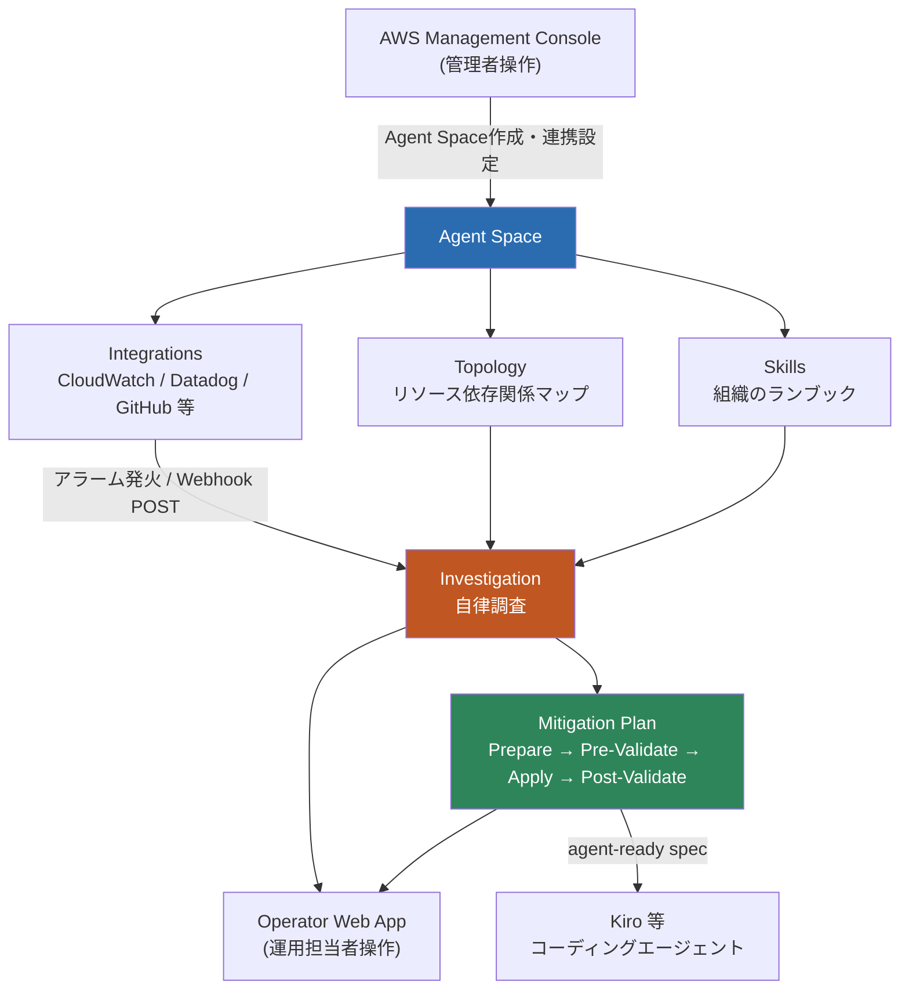
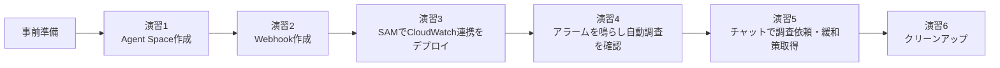
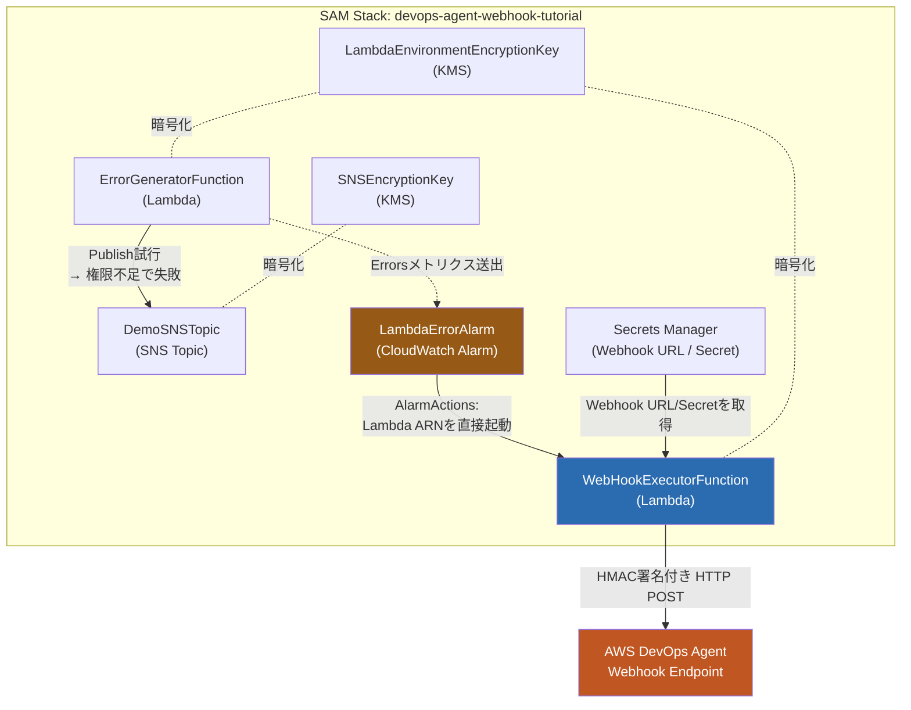
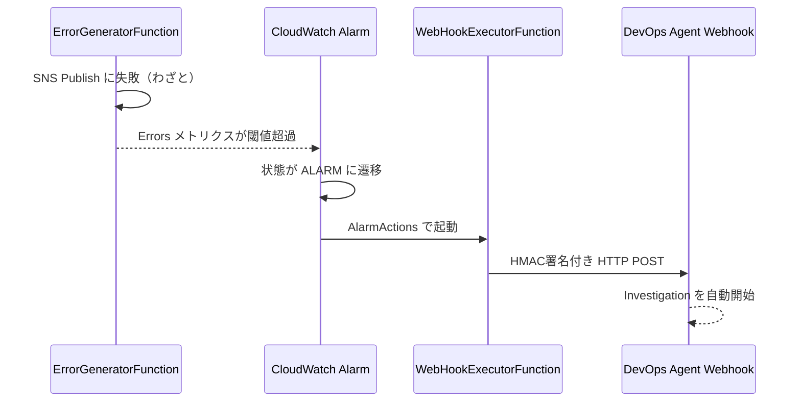
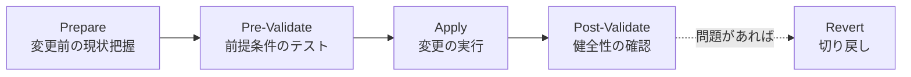

# AWS DevOps Agent ハンズオン — アラーム検知から自律調査・緩和策生成までを体験する

CloudWatch アラームをきっかけに AWS DevOps Agent が自律的にインシデント調査を始め、根本原因と緩和策（mitigation plan）を提示するまでの一連の流れを、実際に AWS 上に手を動かして構築しながら体験するハンズオンです。

---

## 1. 勉強対象の概要

### AWS DevOps Agent とは

AWS DevOps Agent は、AWS が 2025年12月の re:Invent で発表し、2026年3月31日に一般提供（GA）を開始した **AI 駆動の "常時稼働するチームメイト"** です。Amazon Bedrock AgentCore 上に構築された「frontier agent（自律的に長時間・複数ステップのタスクをこなすエージェント）」の一種で、以下の2領域をカバーします。

- **本番運用（Production operations）**: アラートやチケットをきっかけに即座にインシデント調査を開始し、根本原因を特定して緩和策を提示する。過去のインシデントを分析して再発防止の改善提案も行う。
- **リリース管理（Release management・プレビュー）**: コード変更のリリース前レビュー（ポリシー準拠・依存関係・アクセス制御のチェック）や、変更内容に応じたテストの自動生成・実行を行う。

CloudWatch・Datadog・Dynatrace・New Relic・Splunk・Grafana といった可観測性ツールや、GitHub・GitLab・Azure DevOps などの CI/CD、ServiceNow・PagerDuty・Slack・Microsoft Teams といったインシデント管理/コミュニケーションツールと連携し、AWS・マルチクラウド・オンプレミスにまたがる環境を横断的に調査できる点が特徴です。

### 中心概念

| 概念 | 説明 |
|---|---|
| **Agent Space** | エージェントが「何にアクセスし、何を調査してよいか」を定義する論理コンテナ。AWS アカウント設定・外部ツール連携・アクセス権限をまとめて保持する |
| **Topology（アプリケーショントポロジ）** | Agent Space が自動的に構築する、リソースとその依存関係の継続更新マップ。調査時にアーキテクチャを理解するための土台になる |
| **Investigation（調査）** | アラートや Webhook をきっかけに自律的に開始される調査プロセス。テレメトリ・コード・デプロイ履歴を相関分析し、根本原因（Root Cause）を特定する |
| **Mitigation Plan（緩和策）** | 調査結果から生成される実行計画。**Prepare → Pre-Validate → Apply → Post-Validate** の4フェーズで構成され、コード修正が必要な場合は Kiro 等のコーディングエージェントに渡せる agent-ready spec も出力される |
| **Skills** | `SKILL.md` を中心とした Markdown ベースの再利用可能なランブック。組織固有の調査手順・運用標準をエージェントに教え込む仕組み（Agent Skills 仕様のサブセット） |
| **Webhook / Integrations** | CloudWatch・Datadog・GitHub 等の外部システムから調査を起動する入口。汎用 Webhook は HMAC-SHA256 署名で認証する |
| **管理コンソール / Operator Web App** | 管理者は AWS マネジメントコンソールで Agent Space や連携を設定し、運用担当者（Operator）は専用の Web アプリで調査確認やチャットを行う「デュアルコンソール構成」 |

### 全体像（概念間の関係）



### 調査対象の範囲（どんなアプリ・リソースを調査できるか）

今回のハンズオンで扱う Lambda はほんの一例で、実際に調査できる範囲はかなり広い。

- **リソース種別を問わない**: EC2・Lambda（サーバーレス）・ECS・EKS（コンテナ）といったコンピュートから、RDS・DynamoDB・S3 などのデータ層、VPC・ロードバランサーなどのネットワークまで、特定のリソースタイプに縛られず「アプリケーション」という単位でまとめて理解する
- **リソースの発見方法は2通り**:
  1. **CloudFormation スタック経由**（SAM・CDK 含む）— 今回のハンズオンもこのパターン。IaC でデプロイされたリソースはスタック単位で自動的にまとめて認識される
  2. **AWS Resource Explorer 経由** — コンソールや API で直接作った IaC 管理外のリソースも、タグが付いていれば認識できる（対象アカウントで Resource Explorer の有効化が必要）
- **トポロジに出ていなくても調査対象になり得る**: Application Resource Mapping（Topology）に載っていないリソースでも、AWS サービス API や接続済みの観測ツール経由で追加調査できる
- **AWS 専用ではない**: Dynatrace・Datadog・New Relic・Splunk・Grafana といった観測ツールと連携することで、Azure・GCP 上のリソースやオンプレミス環境も調査対象にできる（マルチクラウド／オンプレミス対応）
- **アクセス範囲は自分でコントロールできる**: Agent Space に紐づく IAM ロールの権限を絞ることで「このアカウント・このリソースだけ調査可能」という範囲を制限できる。本番運用では prod/dev/staging で Agent Space を分けるのが推奨パターン

### 周辺エコシステムでの位置づけ

AWS DevOps Agent は、AWS が2025年12月2日の re:Invent 2025 で発表した **frontier agents** という新しいカテゴリの一員。frontier agents は以下の3つの特徴を共有する。

- **自律性**: 目標だけを示せば、達成方法はエージェント自身が考える
- **スケーラビリティ**: 複数のタスクを同時並行で処理できる
- **持続性**: 人間の常時介入なしに、数時間〜数日単位で稼働し続けられる

re:Invent 2025 時点で発表されている frontier agents は次の3つ。

| エージェント | 対象領域 | 概要・実績 |
|---|---|---|
| **Kiro autonomous agent** | ソフトウェア開発 | チーム共有のエージェントとして、GitHub・Jira・Slack 等と連携しセッションをまたいだ文脈を保持。バグ対応からコードカバレッジ改善まで、複数リポジトリにまたがる変更にも対応 |
| **AWS Security Agent** | セキュリティ | アプリ設計・コードレビュー・ペネトレーションテストを担う「セキュリティコンサルタント」役。修復コード付きで脆弱性を報告する |
| **AWS DevOps Agent**（本ハンズオンの対象） | 運用 | インシデント対応と予防的改善。根本原因特定率86%超という実績が公表されている |

- 監視・観測データは既存の Datadog / New Relic / Splunk / CloudWatch などをそのまま使える（自前でテレメトリ基盤を作り直す必要がない）
- 緩和策の実装は Kiro のような**コーディングエージェントに引き継げる**ため、「検知→原因特定→修正提案→実装」までを複数エージェントの連携で完結させられる

---

## 2. ハンズオンの概要

### 想定環境・所要時間

| 項目 | 内容 |
|---|---|
| 想定読者 | AWS の基本操作（IAM・Lambda・CloudWatch）に慣れている人 |
| 必要なもの | 検証用 AWS アカウント（Administrator 相当の IAM 権限推奨）、AWS CLI、AWS SAM CLI、git |
| 所要時間目安 | 1.5〜2時間 |
| 費用 | 少額課金あり（詳細は「3. ハンズオンの手順」内の料金セクション参照）。ハンズオン後は必ずクリーンアップすること |

### ゴールイメージ

このハンズオンを終えると、次のことができるようになります。

- DevOps Agent の中心概念である **Agent Space** を作成できる
- **Webhook** を作成し、外部イベントから調査を起動できるようにできる
- **CloudWatch アラーム → Lambda → DevOps Agent Webhook** という定番の連携を、AWS 公式サンプル（SAM）で構築できる
- わざと Lambda エラーを発生させてアラームを鳴らし、DevOps Agent が**自動で調査を開始**する様子を確認できる
- Operator Web App から**チャットで調査を依頼**し、**根本原因**と**緩和策（mitigation plan）**を受け取れる

### 学べることの全体像

| ステップ | 学ぶこと | 主な成果物 |
|---|---|---|
| 事前準備 | 料金体系・リージョン制約の理解 | AWS CLI 認証確認 |
| 演習1 | Agent Space の概念と IAM ロール自動作成 | 稼働中の Agent Space |
| 演習2 | Webhook による調査起動の仕組み、HMAC 認証 | Webhook URL / Secret |
| 演習3 | SAM（IaC）による CloudWatch 連携の定番構成 | デプロイ済み CloudFormation スタック |
| 演習4 | アラームが `ALARM` になり Webhook が自動発火する流れ | 自動起動された Investigation |
| 演習5 | 自然言語での調査依頼、Root Cause と Mitigation Plan の読み方 | 4フェーズの緩和策 |
| 演習6 | 不要リソースの削除と課金停止 | クリーンな環境 |

### 演習全体の流れ



---

## 3. ハンズオンの手順

### 事前準備

#### アカウント・権限
- 有効な AWS アカウント（DevOps Agent の利用には AWS アカウントが必須）
- 個人検証アカウントなら **Administrator 相当の IAM 権限**があると詰まりにくい（本番では最小権限に絞ること）
- Agent Space 作成時に **IAM ロールを自動作成**するため、`iam:CreateRole` 等の権限が必要

#### リージョン
DevOps Agent は提供リージョンが限定されています。作業前に対応リージョンを確認し、**Agent Space・CloudWatch・Lambda をすべて同一リージョン**に揃えてください。

| リージョン名 | リージョンコード |
|---|---|
| US East (N. Virginia) | `us-east-1` |
| US West (Oregon) | `us-west-2` |
| Canada (Central) | `ca-central-1` |
| South America (São Paulo) | `sa-east-1` |
| Asia Pacific (Mumbai) | `ap-south-1` |
| Asia Pacific (Singapore) | `ap-southeast-1` |
| Asia Pacific (Sydney) | `ap-southeast-2` |
| Asia Pacific (Tokyo) | `ap-northeast-1` |
| Europe (Frankfurt) | `eu-central-1` |
| Europe (Ireland) | `eu-west-1` |
| Europe (London) | `eu-west-2` |

> 本ハンズオンでは **東京リージョン（`ap-northeast-1`）** を使用します。なお、Investigation 対象の AWS リソース自体は Agent Space と異なるリージョンにあっても横断的に調査可能です（Agent Space を作ったリージョンに調査データが保存されるだけ）。

#### 必要ツール（ローカル）

| ツール | 確認コマンド | 備考 |
|---|---|---|
| AWS CLI | `aws --version` | `aws configure` で認証情報を設定済みにしておく |
| AWS SAM CLI | `sam.cmd --version` | v1.0.0 以上 |
| git | `git --version` | サンプル取得用 |

> 💻 **Windows（GitBash）での注意**: GitBash 上では `sam` コマンドが見つからない、または正しく実行されないことがある。その場合は `sam.cmd`（Windows 版 SAM CLI が実際にインストールする実行ファイル名）を明示的に使うこと。本ハンズオンのコマンド例はすべて `sam.cmd` で統一している。

#### ⚠️ 料金についての注意（先に読む）

- **課金単位は「エージェント秒」**: 調査（Investigation）・評価（Evaluation）・オンデマンド SRE タスクのいずれも、**1 エージェント秒あたり $0.0083** の統一レートで、実際にエージェントが作業した時間分だけ秒単位課金されます（前払いなし、セットアップ費用なし）。
- **新規顧客向けに 2 か月間の無料トライアル**があり、毎月 最大 **10 Agent Space・調査 20 時間・評価 15 時間・チャット 20 時間** まで無料枠が付きます（本ハンズオンはこの範囲に収まる想定）。
- AWS Support 契約者には月次クレジットが付与される場合があります（Unified Operations 100%／Enterprise Support 75%／Business Support+ 30%、毎月末に失効）。
- DevOps Agent が裏で使う他サービス（CloudWatch Logs Insights クエリ、トレース取得など）やこのハンズオンで作る Lambda / CloudWatch / SNS / Secrets Manager は**各サービスの通常料金で別途課金**されます（このハンズオンの規模なら僅少）。
- 検証が終わったら**必ず演習6のクリーンアップを実施**してください。
- 最新の料金条件: https://aws.amazon.com/devops-agent/pricing/

#### 作業リージョンの決定と CLI 認証確認

```bash
aws sts get-caller-identity
```

想定どおりのアカウント ID が返れば OK。以降のコンソール操作・CLI はすべて選んだリージョン（`ap-northeast-1`）に固定します。

---

### 演習1: Agent Space を作る

**目的**: DevOps Agent が「何にアクセスして良いか」を定義する土台となる Agent Space を作成し、IAM ロールの自動作成という基本パターンを理解する。

**手順**:

1. AWS マネジメントコンソールにサインインし、**AWS DevOps Agent コンソール**を開く
   - 直リンク（`ap-northeast-1` の例）: https://ap-northeast-1.console.aws.amazon.com/aidevops/home?region=ap-northeast-1
2. **エージェントスペースを作成** を選択すると、1ページのフォームが開く
3. **Agent Space の詳細**
   - **エージェントスペース名**: 用途が分かる名前（例: `handson-agent`）
   - **説明**（任意）: `DevOps Agent 入門ハンズオン用`
   - **エージェントの応答言語**（任意）: 日本語で回答させたい場合は **Japanese (Japan)** を選択（未選択なら入力言語に追従）
4. **この Agent Space AWS リソースへのアクセスを許可する**（調査対象アカウントへのアクセス用 IAM ロール）
   - 「プライマリアカウントロールを設定する」で、入門では既定の **新しい DevOps エージェントロールを自動作成** のままにする
   - 「作成されるエージェントスペースロール名」に `DevOpsAgentRole-AgentSpace-xxxxxxxx` のような名前が自動入力される
5. **AWS タグを含める**（任意）は必要なら追加
6. **ウェブアプリを有効にする**（Operator が対話する Web アプリ用ロール）
   - 「現在のアカウントロールを設定する」も同様に既定の **新しい DevOps エージェントロールを自動作成** のままにする
   - 「作成されるウェブアプリロール名」に `DevOpsAgentRole-WebappAdmin-xxxxxxxx` のような名前が自動入力される
7. **作成** を選択

**✅ 確認ポイント**:
- Agent Space の詳細ページが開き、上部タブに **機能／ウェブアプリ／設定／概要レポート** が並んでいる
- **ウェブアプリ** タブを開くと、「オペレーターアクセス」に手順4で自動作成された IAM ロールの ARN が表示され、右側の「ウェブアプリリンク」に **IAM 経由で起動する** ボタンが表示される
- そのボタンを押すと Operator Web App が新しいタブで開き、既存の AWS コンソールセッション（IAM）でそのまま入れる（セッションは8時間）。IAM Identity Center や外部 IdP を別途設定しなくても、検証目的ならこのリンクで十分
- **機能** タブ → **クラウド** → **Primary source** に、手順4で作ったロールに対応するプライマリアカウントが表示されていること

> メモ: 既存の Agent Space で手順4・6を作成時に設定し忘れた場合でも、後から **機能** タブ→クラウド→Primary source→**Add**、および **ウェブアプリ** タブ→オペレーターアクセス→**ウェブアプリを設定** から、同じ3択（自動作成／既存ロール割り当て／ポリシーテンプレート）で追いかけて設定できる。

**ここで学んだこと**: Agent Space は「調査対象アカウントへのアクセス権（クラウド / Primary source）」と「運用担当者が使う Web アプリへのアクセス権（オペレーターアクセス）」を分離した2つの IAM ロールで構成されており、どちらも作成時・作成後のどちらからでも同じ3択パターンで設定できること。

---

### 演習2: Webhook を作る

**目的**: 外部イベント（今回は CloudWatch）から調査を起動するための入口を、Agent Space 作成の直後に用意しておく。

**手順**:

Webhook の作成は「データスキーマ確認 → 認証方式の設定 → URL/認証情報の生成」という **3ステップのウィザード** になっている。

1. Agent Space の **機能** タブを一番下までスクロールし、**ウェブフック** セクションを開く
   - 似た名前の「機能ウェブフック」は連携済みツール向けの別機能なので、CloudWatch 連携で使うのは上側の **Agent Space ウェブフック** の方
2. 「Agent Space ウェブフックなし」の下にある **Webhook を追加**（または右上の **追加**）を選択し、ウィザードを開始
3. **ステップ1: データスキーマが DevOps エージェントの要件と一致することを確認**
   - 送信するイベントの JSON スキーマ（下記参照）が表示されるので確認し、**次へ**
4. **ステップ2: ウェブフックの認証を設定する**
   - **ウェブフックの認証タイプ** で **HMAC**（既定、共有シークレットで HMAC-SHA256 署名する方式）を選択したまま **次へ**
   - もう一方の **API キー** は認可ヘッダーにベアラートークンを載せる方式（今回は使わない）
5. **ステップ3: URL と認証情報を生成する**
   - **URL と認証情報を生成する** ボタンを押す
   - **.csv ファイルをダウンロード** ボタンを押し、**Webhook URL と HMAC シークレットが入った .csv を安全な場所に保存**
   - 「自分の URL と認証情報を保存して保管しました」にチェックを入れる
   - **追加** を選択して Webhook を確定させる

> ⚠️ **URL・認証情報はこの画面を離れると再表示できません。**.csv をダウンロードし忘れると、Webhook を作り直す（＝新しい URL/Secret を再生成する）ことになる。

**送信ペイロードのスキーマ（ステップ1で表示される内容）**

Webhook に送るイベントの形式は以下です。今回はサンプルの Lambda がこの形で送ってくれるので、手で組む必要はありません。

```jsonc
{
  "eventType": "incident",
  "incidentId": "string",
  "action": "created | updated | closed | resolved",
  "priority": "CRITICAL | HIGH | MEDIUM | LOW | MINIMAL",
  "title": "string",
  "description": "string (任意)",
  "timestamp": "string (任意)",
  "service": "string (任意)",
  "data": { }   // 元イベントをそのまま添付 (任意)
}
```

認証には **HMAC（SHA-256 署名）** を使います。リクエストのタイムスタンプとペイロードを Secret で署名し、DevOps Agent 側で同じ計算をして照合する仕組みです（次の演習で使うサンプルに実装済み）。ダウンロードした .csv の中身が、次の演習で Secrets Manager に登録する `webhookUrl` / `webhookSecret` の値になる。

**✅ 確認ポイント**: .csv をダウンロード済みで、中に Webhook URL と HMAC シークレットの両方が入っている。ウィザードで **追加** を押した後、ウェブフック セクションの一覧に作成した Webhook が表示されている。

**ここで学んだこと**: DevOps Agent への調査依頼は「Webhook への HTTP POST」という単純なインターフェースに統一されており、CloudWatch に限らずどんな外部システムからでも同じ仕組みで調査を起動できること。また、認証情報は画面上にコピー用テキストとして常時表示されるのではなく、**.csv ダウンロードでのみ一度だけ取得できる**設計になっていること。

---

### 演習3: CloudWatch 連携を SAM でデプロイする

**目的**: 「わざとエラーを出す Lambda」「エラーを監視する CloudWatch アラーム」「アラームで発火し Webhook を叩く Lambda」という定番構成を、AWS 公式サンプル（SAM）で一括構築し、IaC でエージェント連携を組む感覚を掴む。

#### このサンプル（`sample-aws-devops-agent-cloudwatch`）はどのようなシステムか

`aws-samples/sample-aws-devops-agent-cloudwatch` は、**「CloudWatch アラームが ALARM 状態になった瞬間に、DevOps Agent の Webhook を自動で叩いて調査を始めさせる」ための最小構成一式を SAM でまるごと構築できるチュートリアル用リポジトリ**です。Lambda 2 つと CloudWatch アラーム、SNS トピックだけで完結するサーバーレス構成になっており、「アラーム検知 → 自動調査起動」という定番パターンをそのまま流用できるリファレンス実装として使えます。

**主なリソースと役割（SAM テンプレート `template.yaml` より）**

| 論理ID | リソース種別 | 役割 |
|---|---|---|
| `ErrorGeneratorFunction` | Lambda | 検証用にわざとエラーを起こす関数。SNS トピックへの Publish を試みるが、IAM ロールに SNS 権限を与えていないため必ず失敗し、`Errors` メトリクスを発生させる |
| `DemoSNSTopic` | SNS Topic | `ErrorGeneratorFunction` が Publish に失敗する対象。実際に通知が飛ぶことはなく、あくまでエラーを起こすための"当て先" |
| `LambdaErrorAlarm` | CloudWatch Alarm | `ErrorGeneratorFunction` の `Errors` メトリクスを監視し、閾値超過で `ALARM` 状態に遷移する |
| `WebHookExecutorFunction` | Lambda | `LambdaErrorAlarm` の `AlarmActions` から**直接**起動される関数。Secrets Manager から Webhook 認証情報を取得し、HMAC 署名付き HTTP POST を DevOps Agent に送信する |
| `WebHookExecutorInvokePermission` | IAM (Lambda Permission) | プリンシパル `lambda.alarms.cloudwatch.amazonaws.com` に `WebHookExecutorFunction` の実行を許可し、CloudWatch アラームが直接 Lambda を呼べるようにする |
| Secrets Manager（`SecretArn` パラメータ） | Secrets Manager | 演習2で作成した Webhook URL / Secret を保管。`WebHookExecutorFunction` が実行時に読み出す |
| `SNSEncryptionKey` / `LambdaEnvironmentEncryptionKey` | KMS | SNS トピックと Lambda 環境変数を暗号化する CMK |

ポイントは、**CloudWatch アラームが SNS や EventBridge を経由せず、`AlarmActions` に Lambda の ARN を直接指定して `WebHookExecutorFunction` を起動している**ことです（CloudWatch アラームが対応している「Lambda を直接アラームアクションに指定できる」機能を利用）。SNS トピックは実在しますが、通知経路としては使われず、`ErrorGeneratorFunction` にわざとエラーを起こさせるための小道具という位置づけです。

**アーキテクチャ図**



上のアーキテクチャ図が「どのリソースがどう繋がっているか」の静的な構造を示すのに対し、下のシーケンス図は演習4で実際に発生する**時系列の処理の流れ**を示しています。



**手順**:

**3-1. Webhook 認証情報を Secrets Manager に保存**

```bash
export WEBHOOK_URL="https://event-ai.ap-northeast-1.api.aws/webhook/generic/your-webhook-id"   # 演習2でダウンロードした.csvの値
export WEBHOOK_SECRET="your-webhook-secret-here"                                 # 演習2で保存した値
export SECRET_NAME="devops-agent-webhook-credentials"

aws secretsmanager create-secret \
  --name "${SECRET_NAME}" \
  --description "DevOps Agent WebHook credentials" \
  --secret-string "{\"webhookUrl\":\"${WEBHOOK_URL}\",\"webhookSecret\":\"${WEBHOOK_SECRET}\"}"
```

出力される **ARN** を控えておく（次のデプロイで使用）。

> ⚠️ **このハンズオンを2回目以降に実施する場合**、演習6のクリーンアップで同名のシークレットを削除済みだと、`InvalidRequestException: You can't create this secret because a secret with this name is already scheduled for deletion.` になることがある。`--recovery-window-in-days 7` を指定して削除すると、Secrets Manager は即座に削除せず**7日間の復旧待ち状態（pending deletion）**にし、その間は同名での新規作成を受け付けないため。
>
> 対処（復元して値を上書きするのが簡単）:
> ```bash
> aws secretsmanager restore-secret --secret-id "${SECRET_NAME}"
>
> aws secretsmanager put-secret-value \
>   --secret-id "${SECRET_NAME}" \
>   --secret-string "{\"webhookUrl\":\"${WEBHOOK_URL}\",\"webhookSecret\":\"${WEBHOOK_SECRET}\"}"
>
> aws secretsmanager describe-secret --secret-id "${SECRET_NAME}" --query ARN --output text
> ```
> 別解として、待ち時間なく進めたいだけなら `SECRET_NAME` を `devops-agent-webhook-credentials-v2` のように別名にしても良い（7日経てば元の名前は自動的に使えるようになる）。

**3-2. サンプルを取得してビルド**

```bash
git clone https://github.com/aws-samples/sample-aws-devops-agent-cloudwatch.git
cd sample-aws-devops-agent-cloudwatch
sam.cmd build
```

`Build Succeeded` が出れば成功。

**3-3. デプロイ（初回はガイド付きが安全）**

```bash
sam.cmd deploy --guided
```

プロンプト回答例:
- **Stack Name**: `devops-agent-webhook-tutorial`
- **AWS Region**: `ap-northeast-1`（Agent Space と同一に）
- **Parameter SecretArn**: 3-1 で控えた Secret の ARN
- **Confirm changes before deploy**: `Y`
- **Allow SAM CLI IAM role creation**: `Y`
- **Save arguments to configuration file**: `Y`

（2回目以降は直接デプロイも可）

```bash
sam.cmd deploy \
  --stack-name devops-agent-webhook-tutorial \
  --parameter-overrides SecretArn=<あなたのSecret ARN> \
  --capabilities CAPABILITY_IAM \
  --resolve-s3
```

**✅ 確認ポイント**: `sam.cmd deploy` が正常終了し、CloudFormation スタック `devops-agent-webhook-tutorial` が `CREATE_COMPLETE` になっている。

> ⚠️ **Lambda の同時実行数（concurrency）エラーが出る場合**: `CREATE_FAILED` で `Specified ReservedConcurrentExecutions for function decreases account's UnreservedConcurrentExecution below its minimum value of [10]` というエラーになることがある。これはテンプレートが `ErrorGeneratorFunction`（`ReservedConcurrentExecutions: 5`）と `WebHookExecutorFunction`（同 `10`）で合計15の同時実行数を予約しようとするのに対し、Lambda は「予約後も最低10の未予約枠を残す」ルールがあるため、アカウント/リージョンの同時実行数クォータが25未満（個人検証アカウントや使い始めのリージョンでは既定値がまだ低いことがある）だと予約できずに失敗するというもの。
>
> 現在のクォータは以下で確認できる。
> ```bash
> aws lambda get-account-settings --region ap-northeast-1 --query 'AccountLimit'
> ```
>
> **対処（ハンズオン用途なら最短）**: クローンした `template.yaml` の `ErrorGeneratorFunction` と `WebHookExecutorFunction` から `ReservedConcurrentExecutions` の行をそれぞれ削除し（この規模の検証では同時実行数の予約は不要）、失敗したスタックを削除してから作り直す。
> ```bash
> sam.cmd delete --stack-name devops-agent-webhook-tutorial
> sam.cmd build
> sam.cmd deploy
> ```
> ※ Service Quotas でアカウント全体の同時実行数クォータを引き上げる方法もあるが、自動承認されない場合は数分〜数時間待つことがある。

**ここで学んだこと**: DevOps Agent との連携もただの AWS リソース（Lambda・CloudWatch アラーム・Secrets Manager）の組み合わせなので、普段の IaC ワークフローにそのまま乗せられること。個人検証アカウントでは Lambda の同時実行数クォータが既定で低いことがあり、サンプルの `ReservedConcurrentExecutions` のようなアカウント全体のリソースに影響する設定はハンズオン規模では引っかかりやすいポイントであること。

---

### 演習4: 動作テスト（アラームを鳴らす）

**目的**: 実際にエラーを起こしてアラームを鳴らし、Webhook 経由で DevOps Agent の Investigation が**自動で**始まることを確認する。

**手順**:

**4-1. エラー生成 Lambda を実行**

```bash
FUNCTION_NAME=$(aws cloudformation describe-stack-resources \
  --stack-name devops-agent-webhook-tutorial \
  --query "StackResources[?LogicalResourceId=='ErrorGeneratorFunction'].PhysicalResourceId" \
  --output text)

aws lambda invoke --function-name "$FUNCTION_NAME" --payload '{}' response.json
cat response.json
```

→ SNS 権限不足で**わざと失敗**します（これは意図どおりの挙動）。

**4-2. アラームが ALARM になるのを確認（1〜2分待つ）**

```bash
ALARM_NAME=$(aws cloudformation describe-stacks \
  --stack-name devops-agent-webhook-tutorial \
  --query "Stacks[0].Outputs[?OutputKey=='LambdaErrorAlarmName'].OutputValue" \
  --output text)

aws cloudwatch describe-alarms \
  --alarm-names "$ALARM_NAME" \
  --query "MetricAlarms[].[AlarmName,StateValue,StateReason]" \
  --output table
```

`StateValue` が `ALARM` になれば OK。

**4-3. Webhook 実行 Lambda のログを確認**

```bash
WEBHOOK_FUNCTION_NAME=$(aws cloudformation describe-stack-resources \
  --stack-name devops-agent-webhook-tutorial \
  --query "StackResources[?LogicalResourceId=='WebHookExecutorFunction'].PhysicalResourceId" \
  --output text)

MSYS_NO_PATHCONV=1 aws logs tail "/aws/lambda/$WEBHOOK_FUNCTION_NAME" --follow
```

`Sending webhook request` と **HTTP 200/202** が見えればフローは成立。

> 💻 **Windows（GitBash）での注意**: `/aws/lambda/...` のように `/` で始まる引数を Windows ネイティブの `aws.exe` にそのまま渡すと、GitBash（MSYS2）が絶対パスと誤認して Windows パスに自動変換してしまい、`InvalidParameterException: ... logGroupName ...` のようなエラーになることがある。`MSYS_NO_PATHCONV=1` を先頭に付けてこの自動変換を無効化する。

**4-4. DevOps Agent 側で調査開始を確認**

1. Agent Space 詳細ページの **ウェブアプリ** タブ →「オペレーターアクセス」内「ウェブアプリリンク」にある **IAM 経由で起動する** ボタンを押し、Operator Web App を新しいタブで開く
2. 開いた **インシデントレスポンスダッシュボード** の調査一覧に、**新しい調査（Investigation）** が出ていることを確認
   - 「調査」列の名前が CloudWatch アラーム名（例: `devops-agent-webhook-tutorial-LambdaErrorAlarm-xxxxxxxx`）に対応
   - 「以下によってトリガーされます」列が `Event Channel`（Webhook 経由での起動を表す）
   - 「ステータス」列は調査中は「進行中」、完了すると「完了しました」に変わる（テスト用の小さな調査なので数分で完了することが多い）

**✅ 確認ポイント**: インシデントレスポンスダッシュボード上に、手動で何もせずとも「Event Channel」がトリガーした調査が自動的に作成されている。

**ここで学んだこと**: 「アラーム → 自動調査」という DevOps Agent の中核体験。人間はアラームを見に行く前に、エージェントが先に調査を始めている状態を作れること。

---

### 演習5: チャットで調査依頼 & 緩和策の生成

**目的**: 自動起動だけでなく、自然言語での調査依頼と、緩和策（Mitigation Plan）の読み方を体験する。

**手順**:

1. Operator Web App の **インシデントレスポンスダッシュボード** にある「調査を開始」欄に、日本語で質問を入力
   - 例: `直近30分で、チュートリアル用のLambda関数にエラーが発生している原因は何ですか？`
   - Agent response language を Japanese (Japan) にしていれば、日本語で返答される
2. 送信すると、DevOps Agent がすぐに調査を始めるのではなく、まず進め方を確認してくる
   - **1. インベスティゲーションを開始する**（推奨）: バックグラウンドで詳細な根本原因調査を実行（ログ・メトリクス・変更履歴を包括的に分析）
   - **2. このチャットで調べる**: チャット上でインラインに確認する速報的なチェック
   - 根本原因と緩和策までしっかり得たいので、ここでは **1. インベスティゲーションを開始する** を選ぶ
3. （任意）ダッシュボードの「最新のアラーム」などのショートカットボタンを使うと、対象リソースを指定した状態で調査を開始できる
4. 調査完了後、**Root Cause** タブで根本原因を確認
5. **Generate mitigation plan** を選ぶと、緩和策が下図の4フェーズで生成される
6. コードレベルの修正が含まれる場合は **agent-ready spec** が出るので、Kiro などのコーディングエージェントに渡して修正まで繋げられる（発展）



**✅ 確認ポイント**: Root Cause タブに具体的な原因説明が表示され、Mitigation Plan に Prepare〜Post-Validate の各フェーズで実行可能なアクションが並んでいる。

**ここで学んだこと**: DevOps Agent は「原因を言うだけ」ではなく、検証可能な手順（Pre-Validate）と切り戻し前提（Post-Validate）まで含めた実行計画を出す設計になっていること。

---

### 演習6: クリーンアップ（課金停止）

> ⚠️ リソース削除を伴います。**削除は必ずあなた自身の判断で実行**してください。

**目的**: ハンズオンで作ったリソースを削除し、不要な課金を止める。

**手順**:

**6-1. SAM スタックを削除**

```bash
sam.cmd delete --stack-name devops-agent-webhook-tutorial
```

**6-2. Secrets Manager のシークレットを削除**

```bash
aws secretsmanager delete-secret \
  --secret-id devops-agent-webhook-credentials \
  --recovery-window-in-days 7
```

**6-3. Agent Space の停止/削除**
- 課金は「エージェントが稼働した時間」に対して発生するため、検証後は investigation を止め、不要なら Agent Space を削除
- 削除手順: https://docs.aws.amazon.com/devopsagent/latest/userguide/deleting-an-agent-space.html

**6-4. 残存リソースの確認**
- CloudWatch Log Group はデフォルトで残るため、不要なら手動削除
- スタックが消えたかは以下で確認

```bash
aws cloudformation describe-stacks --stack-name devops-agent-webhook-tutorial
# → スタックが存在しないエラーが返れば削除完了
```

**✅ 確認ポイント**: `describe-stacks` がエラーになり、Secrets Manager・Agent Space にも残存物がない。

**ここで学んだこと**: DevOps Agent は秒課金のサービスであるため、検証用リソースは「作って終わり」にせず、必ず削除まで一連の作業として扱う習慣が重要であること。

---

## 4. 習得事項のまとめ

### ハンズオンで触れた要素

| 要素 | 内容 |
|---|---|
| Agent Space | IAM ロール自動作成を使った作成、Operator Web App へのアクセス |
| Webhook | HMAC 署名付き汎用 Webhook の作成、ペイロードスキーマ |
| SAM（IaC） | `sam.cmd build` / `sam.cmd deploy --guided` によるスタックデプロイ |
| CloudWatch アラーム | エラーメトリクスによる `ALARM` 遷移と `AlarmActions` 連携 |
| Investigation | アラーム起点の自動調査、チャットからのオンデマンド調査依頼 |
| Root Cause / Mitigation Plan | 根本原因の確認と Prepare→Pre-Validate→Apply→Post-Validate の緩和策 |
| クリーンアップ | CloudFormation スタック・Secret・Agent Space の削除 |

### つまずきポイント（トラブルシュート）

| 症状 | 見るところ |
|---|---|
| Webhook Lambda が 401/403 | Secrets Manager の `webhookSecret` が正しいか、HMAC 署名の計算方法 |
| 調査が始まらない | アラームが本当に `ALARM` になったか、Webhook Lambda ログの HTTP ステータス |
| 「IAM 経由で起動する」リンクが出ない/開けない | ウェブアプリタブでオペレーターアクセス用ロールが作成済みか（未作成なら「ウェブアプリを設定」を実行）、コンソールの IAM セッション権限 |
| リージョン不一致 | Agent Space・CloudWatch・Lambda が同一リージョンか、対応リージョン（11リージョン）に含まれるか |
| ロール作成でエラー | 実行中の IAM ユーザーに `iam:CreateRole` 権限があるか |
| 無料枠を超えて課金される | 調査20時間・評価15時間・チャット20時間/月などの上限に達していないか |
| `create-secret` で `already scheduled for deletion` エラー | 前回のハンズオンで同名シークレットを削除済み（7日間の復旧待ち状態）。`restore-secret` → `put-secret-value` で復元するか、別名で作成する（演習3-1参照） |
| `sam.cmd deploy` が `ReservedConcurrentExecutions` 絡みで `CREATE_FAILED` | アカウント/リージョンの Lambda 同時実行数クォータ不足。`template.yaml` から `ReservedConcurrentExecutions` を削除して再デプロイ（演習3-3参照） |
| `aws logs tail /aws/lambda/...` が `InvalidParameterException`（logGroupName） | GitBash の MSYS パス自動変換が原因。`MSYS_NO_PATHCONV=1` を先頭に付けて実行する（演習4-3参照） |

### 応用・発展

- 生成された **Mitigation Plan** はチームでレビューしてから Apply する運用にすれば、自律調査と人間の承認プロセスを両立できる
- **Skills** に自組織のランブックを Markdown で書いて登録すれば、同じ調査手順を毎回エージェントに教える必要がなくなる
- Investigation の起点は CloudWatch に限らない。Datadog・Splunk・GitHub 等の**built-in integration** や、独自の **Webhook** で他システムからも起動できる
- 緩和策の agent-ready spec を Kiro に渡せば、「検知→原因特定→修正コード生成」までを別々のエージェントで自動連携できる

---

## 5. 今後の学習ロードマップ

1. **DevOps Agent Skills を自作してランブックを標準化する**（最優先）: `SKILL.md` の frontmatter（`name`/`description`）の書き方、Agent Type（Incident Triage / Incident RCA / Incident Mitigation 等）へのターゲティングを学び、自組織の調査手順を資産化する
2. **Slack / GitHub / ServiceNow 連携を広げる**: Settings → Communications で Slack ワークスペースを登録して調査結果をチャンネルに投稿したり、Capabilities タブから GitHub リポジトリを接続してデプロイと障害を相関分析する
3. **Release management（プレビュー）を試す**: リリース前のコード変更レビュー（release readiness review）や自律テストを体験し、本番運用だけでなく開発フローにも DevOps Agent を組み込む（この機能はプレビュー中 `us-east-1` のみ対応のため、本ハンズオンの `ap-northeast-1` の Agent Space とは別に試す必要がある点に注意）
4. **CLI / CDK で Agent Space を IaC 管理する**: コンソール操作に頼らず、Agent Space・Skills・連携設定をコードで管理し、複数環境（prod/dev/staging）へ再現性高くロールアウトする

### 参考リンク

- 製品ページ: https://aws.amazon.com/devops-agent/
- FAQ: https://aws.amazon.com/devops-agent/faqs/
- 料金: https://aws.amazon.com/devops-agent/pricing/
- About AWS DevOps Agent（コンセプト解説）: https://docs.aws.amazon.com/devopsagent/latest/userguide/about-aws-devops-agent.html
- Agent Space 作成（公式手順）: https://docs.aws.amazon.com/devopsagent/latest/userguide/getting-started-with-aws-devops-agent-creating-an-agent-space.html
- Webhook 経由での起動（公式手順）: https://docs.aws.amazon.com/devopsagent/latest/userguide/configuring-capabilities-for-aws-devops-agent-invoking-devops-agent-through-webhook.html
- CLI オンボーディング: https://docs.aws.amazon.com/devopsagent/latest/userguide/getting-started-with-aws-devops-agent-cli-onboarding-guide.html
- CloudWatch Webhook サンプル(SAM): https://github.com/aws-samples/sample-aws-devops-agent-cloudwatch
- ブログ（エンドツーエンド構築）: https://aws.amazon.com/blogs/devops/building-an-end-to-end-agentic-sre-using-aws-devops-agent/
- ブログ（Kiro CLI 連携による自動修復）: https://aws.amazon.com/blogs/devops/automated-incident-remediation-with-aws-devops-agent-and-kiro-cli/
- 対応リージョン: https://docs.aws.amazon.com/devopsagent/latest/userguide/about-aws-devops-agent-supported-regions.html
- DevOps Agent Skills: https://docs.aws.amazon.com/devopsagent/latest/userguide/about-aws-devops-agent-devops-agent-skills.html
- コミュニティ製 Skills サンプル集: https://aws-samples.github.io/sample-devops-agent-tools/
