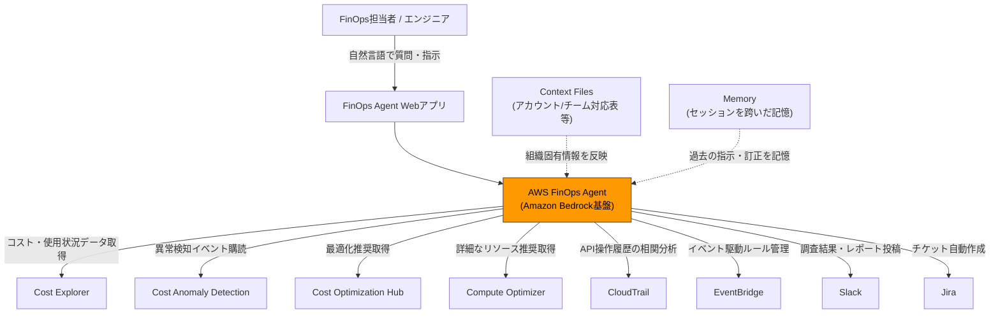
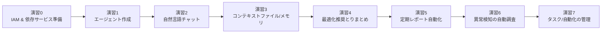
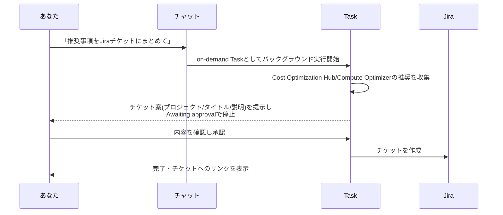
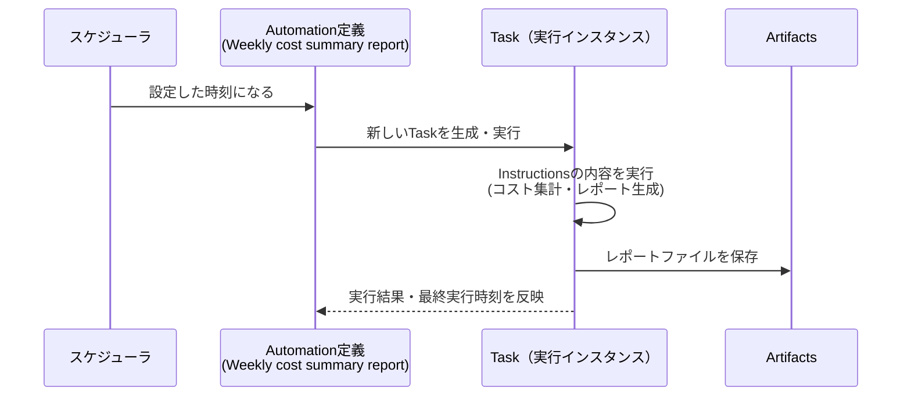
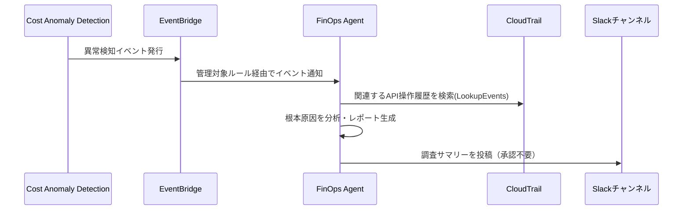
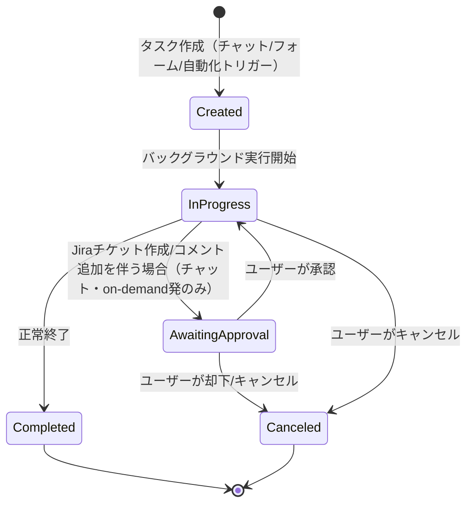

# AWS FinOps Agent ハンズオン — 自然言語でクラウドコストを分析・調査・自動レポート化するエージェントを使いこなす

> 本教材は2026年7月時点のAWS公式ドキュメント（[AWS FinOps Agent (preview) User Guide](https://docs.aws.amazon.com/finops-agent/latest/userguide/what-is.html)）に基づいています。AWS FinOps Agentは2026年6月にパブリックプレビューとして発表されたばかりのサービスであり、**プレビュー期間中は仕様が変更される可能性があります**。

> **リージョンに関する注意**: 「us-east-1限定」というのは**エージェントの実行環境（コントロールプレーン）が置かれるリージョン**の話であり、**分析対象のコストデータの範囲とは別**です。エージェントはCost Explorer等のAPIを呼び出しますが、これらは元々アカウント/AWS Organization全体の請求データを対象にしており、リージョンで絞り込まれるものではありません。そのため東京リージョン（`ap-northeast-1`）を含む、そのアカウントが利用している全リージョンのコストが分析対象に含まれます。さらに、AWS Organizationsの**管理アカウント**でエージェントを作成した場合は、傘下の全メンバーアカウントを横断したコスト分析も可能です（単一のメンバーアカウントで作成した場合はそのアカウントのコストのみが対象）。

## 1. 勉強対象の概要

### AWS FinOps Agentとは

AWS FinOps Agentは、Amazon Bedrock上に構築された「フロンティアエージェント」で、クラウドコストの継続的な監視・異常調査・最適化機会の発見をエンジニアやFinOps担当者に代わって行うAIエージェントです。2026年6月にパブリックプレビューとして発表されました。

FinOps（Financial Operations）自体は「クラウド費用を可視化し、エンジニアリング・財務・ビジネスの各チームが協力して費用対効果を最大化する実践活動」を指す概念であり、AWS FinOps Agentはその実践を自動化・省力化するためのAWSマネージドサービスという位置づけです。

従来、FinOps担当者はCost Explorerのコンソールを手作業で操作し、異常なコスト増加があれば手動でCloudTrailログを漁って原因を特定し、Slackやチケットで報告する、という作業を繰り返していました。AWS FinOps Agentはこの一連の作業を自然言語での対話・スケジュール実行・イベント駆動実行に置き換えます。

### 中心概念

| 概念 | 説明 |
|---|---|
| **Agent（エージェント）** | アカウント内に作成する独立したFinOps Agentのインスタンス。IAM権限・コンテキストファイル・メモリ・タスクキュー・外部連携をそれぞれ個別に持つ |
| **Agent Role / Operator Role** | エージェントが動作する上で使う2種類のIAMロール。Agent Roleはコスト・使用状況データの読み取り用、Operator Roleはチャット・タスク・自動化などWebアプリ操作用 |
| **Task（タスク）** | エージェントがバックグラウンドで実行する処理単位。on-demand（都度実行）・scheduled（定期実行）・event-based（イベント駆動）の3種類 |
| **Automation（自動化）** | scheduledタスクやevent-basedタスクの実行定義。「いつ・何をするか」を自然言語で指示して作成する |
| **Context Files & Memory** | 組織固有の情報（アカウントとチームの対応表、命名規則、レポートテンプレートなど）をエージェントに学習させる仕組み |
| **統合先サービス** | Cost Explorer、Cost Anomaly Detection、Cost Optimization Hub、Compute Optimizer、CloudTrail、EventBridge、Jira、Slack |

### 全体構成図



### FinOps Agentが依存する主なAWS API権限

| 分類 | 主なAPI例 |
|---|---|
| コスト分析 | `ce:GetCostAndUsage`, `ce:GetCostForecast`, `ce:GetCostAndUsageComparisons` |
| Savings Plans / RI | `ce:GetSavingsPlansUtilization`, `ce:GetReservationPurchaseRecommendation` |
| 異常検知 | `ce:GetAnomalies`, `ce:GetAnomalyMonitors` |
| 最適化推奨 | `cost-optimization-hub:ListRecommendations`, `compute-optimizer:GetEC2InstanceRecommendations` |
| 根本原因調査 | `cloudtrail:LookupEvents`, `cloudwatch:GetMetricData` |
| 自動化基盤 | `events:PutRule`, `events:PutTargets`（EventBridge管理ルール） |

## 2. ハンズオンの概要

### 想定環境・所要時間

| 項目 | 内容 |
|---|---|
| 対象読者 | AWSの基本操作（IAM、コンソール）に慣れている中級者。Cost ExplorerやCloudTrailに触れたことがあると理解が早い |
| 必要なもの | 管理者権限（またはIAMポリシーを作成できる権限）を持つAWSアカウント、`us-east-1`リージョンへのアクセス |
| オプション | Slackワークスペースの管理者権限（演習6用）、Jiraサイトの管理者権限（演習4の発展用） |
| 所要時間の目安 | 約2.5〜3時間（オプション演習を含む） |
| 費用 | AWS FinOps Agent自体はプレビュー期間中は無料。ただしエージェントが裏で呼び出すCost Explorer APIは**リクエストごとに$0.01**課金される点に注意（詳細は4章） |

### ゴールイメージ

このハンズオンを終えると、以下ができるようになっています。

- AWS FinOps Agentを作成し、必要なIAM権限・依存サービスを自分で構成できる
- 自然言語でコストに関する質問を投げ、根拠データ付きの回答を得られる
- コンテキストファイルとメモリを使って、エージェントの回答を自組織向けにカスタマイズできる
- 最適化推奨事項をまとめさせ、必要に応じてJiraチケットに変換できる
- 定期コストレポートの自動生成（スケジュール自動化）を設定できる
- コスト異常検知をトリガーにした「自動調査→Slack通知」のイベント駆動自動化を構築できる

### 演習と学習項目の対応

| 演習 | 学べること | 所要時間目安 |
|---|---|---|
| 演習0: 事前準備 | IAMポリシー/ロール構成、依存サービスの有効化 | 30分 |
| 演習1: エージェント作成 | 作成ウィザードの5ステップ、AgentSpaceの概念 | 20分 |
| 演習2: 自然言語チャット | コスト質問の投げ方、回答の読み方 | 25分 |
| 演習3: コンテキストファイルとメモリ | 組織情報の学習、記憶の指示方法 | 20分 |
| 演習4: 最適化推奨のとりまとめ | Cost Optimization Hub/Compute Optimizer連携、承認フロー | 20分 |
| 演習5: 定期レポート自動化 | scheduled automationの作成・管理 | 20分 |
| 演習6: 異常検知の自動調査 | event-based automation、EventBridge連携、Slack通知 | 30分 |
| 演習7（発展）: タスク管理 | Task/Automationワークスペースの操作、承認・キャンセル | 15分 |

### 演習全体の流れ



## 3. ハンズオンの手順

### 演習0: 事前準備（IAM構成と依存サービスの有効化）

**目的**: FinOps Agentが動作するために必要なIAM権限と、裏で使われるAWSサービス（Compute Optimizer、Cost Anomaly Detection）を有効化する。

FinOps Agentは4つのIAMポリシーと2つのIAMロールを使います。作成ウィザードにこれらを自動作成させることもできますが、まず全体像を理解するために表で整理します。

| # | ポリシー名（サンプル） | アタッチ先 | 役割 |
|---|---|---|---|
| 1 | `FinOpsAgentSetupPolicy` | 管理者のIAMユーザー/ロール | エージェントの作成・管理、連携設定、ログインセッション発行 |
| 2 | `FinOpsAgentAgentPolicy` | Agent Role | Cost Explorer / Compute Optimizer / CloudTrail 等の読み取り、EventBridgeルール管理 |
| 3 | `FinOpsAgentOperatorPolicy` | Operator Role | 会話・タスク・自動化・コンテキストファイルの操作 |
| 4 | `FinOpsAgentWebAppPolicy` | 利用する各メンバーのIAMユーザー/ロール | Webアプリへのログインセッション発行、Cost Explorer読み取り（任意） |

> **ハンズオンでの近道**: 個人検証であれば、演習1の作成ウィザードで「Auto-create a new role」を選べば上記2・3のロールは自動生成されます。ここでは仕組みを理解するために手動構成の考え方も押さえておきます。

1. 管理者権限を持つIAMユーザー/ロールに、最低限次のアクションを許可します（`FinOpsAgentSetupPolicy`相当）。

```json
{
  "Version": "2012-10-17",
  "Statement": [
    {
      "Sid": "FinOpsAgentAdminSetup",
      "Effect": "Allow",
      "Action": [
        "finops-agent:CreateAgentSpace",
        "finops-agent:GetAgentSpace",
        "finops-agent:ListAgentSpaces",
        "finops-agent:CreateConnection",
        "finops-agent:CreateIntegration",
        "finops-agent:CreateOneTimeLoginSession"
      ],
      "Resource": "*"
    },
    {
      "Sid": "CreateFinOpsServiceRolesOnly",
      "Effect": "Allow",
      "Action": "iam:CreateRole",
      "Resource": "arn:aws:iam::*:role/service-role/*"
    }
  ]
}
```

2. **AWS Compute Optimizer** を有効化します。[Compute Optimizerコンソール](https://console.aws.amazon.com/compute-optimizer/)を開き、opt-inします。これを忘れるとリサイズ推奨・アイドルリソース推奨をエージェントが取得できません。

3. **AWS Cost Anomaly Detection** のモニタを最低1つ用意します。[Cost Anomaly Detectionページ](https://console.aws.amazon.com/cost-management/home#/anomaly-detection)の「コストモニター」タブを開いてください。**Cost Explorerを有効化しているアカウントには`Default-Services-Monitor`（モニタータイプ: AWSのサービス、管理者: AWSによる管理）が自動的に作成済みのことが多く**、それが表示されていればこの手順は完了しています。表示されない場合のみ、「モニターを作成」から新規に作成してください（演習6で使用します）。

4. **AWS Cost Optimization Hub** と **CloudTrail Event History** はすべてのアカウントでデフォルト有効なので、追加設定は不要です。

✅ **確認ポイント**: Compute Optimizerのダッシュボードで「Opt-in status: Active」と表示されること。Cost Anomaly Detectionのモニタ一覧に作成したモニタが表示されること。

**ここで学んだこと**: FinOps Agentは単体のサービスではなく、Cost Explorer・Compute Optimizer・Cost Anomaly Detectionなど既存のAWS Cost Management群を横断的に呼び出す「オーケストレーター」であり、裏側サービスの有効化状況が回答品質に直結する。

---

### 演習1: エージェントの作成

**目的**: 作成ウィザードを通して、エージェントの基本構成要素（IAMロール、Webアプリアクセス、外部連携）を体験する。

1. AWS Management Consoleで **US East (N. Virginia) / us-east-1** リージョンに切り替えます。
2. 「AWS FinOps Agent」コンソールページを開き、**Create** を選択してウィザードを起動します。
3. **Step 1: 名前を付ける** — エージェント名（英数字・スペース・ハイフンのみ、128文字以内）と説明を入力します（例: `MyFirstFinOpsAgent`）。
4. **Step 2: アクセスさせるAWSリソースの選択** — 「Auto-create a new role（推奨）」を選択します。ウィザードが `FinOpsAgentAgentPolicy` を付与したAgent Roleを自動作成します。
5. **Step 3: Webアプリへのアクセス権付与** — 同様に「Auto-create a new role」を選択し、Operator Roleを自動作成させます。
6. **Step 4: サードパーティ連携（任意）** — Slack/Jiraを事前に連携済みでなければ、ここはスキップして後から追加できます（演習4・6で扱います）。
7. **Step 5: レビューして作成** — 内容を確認し、**Create agent** を選択します。

✅ **確認ポイント**: Agentsページにエージェントが表示され、詳細ページの「Permissions」タブにAgent RoleとOperator Roleの両方がリストされていること。「Open agent」からWebアプリが新しいタブで開くこと（コンソールセッションを使って自動認証されます）。

**ここで学んだこと**: 1つのAWSアカウントに複数のエージェントを作成でき、各エージェントは権限・コンテキスト・タスクキューを完全に独立して持つ。IAM管理を厳格化したい組織では手動でロールを用意することもできる。

---

### 演習2: 自然言語でのコスト質問

**目的**: チャットで実際にコストデータへ自然言語で問い合わせ、回答の根拠を確認する。

Webアプリのチャット欄に、以下のようなプロンプトを順に試してみます（1メッセージ最大1,000文字）。

```text
先月のサービス別コスト上位5つを教えて
```

```text
今月のコストが先月と比べてどう変化しているか、増加要因も含めて教えて
```

```text
EC2インスタンスでリサイズできそうなものはある？
```

✅ **確認ポイント**: 回答が実際のCost Explorer/Compute Optimizerのデータに基づいた具体的な数値（サービス名・金額・増減率）を含んでいること。回答の末尾にある👍/👎ボタンで、回答の質を評価できることを確認する。

**ここで学んだこと**: エージェントは質問内容に応じてCost ExplorerのAPI（比較・予測など）とCompute Optimizerを自動的に使い分ける。会話は同一スレッド内で文脈を保持するため、「それを先週分でも見せて」のような追加質問が成立する。

---

### 演習3: コンテキストファイルとメモリの活用

**目的**: 組織固有の情報をエージェントに学習させ、回答をカスタマイズする。

> **このハンズオンでのカスタマイズ例**: 会社組織のように「チーム」で分ける代わりに、AWS Organizations（Control Tower/Landing Zone）でよくある「アカウントの役割」で分類する例を使います。以下は3アカウント構成（メインのワークロードアカウント、Audit＝セキュリティ監査用アカウント、LogArchive＝ログ集約用アカウント）を想定した例です。**アカウントIDはダミー値なので、ご自身の環境で試す際は実際のアカウントIDに書き換えてアップロードしてください**（アカウントIDそのものは機密情報ではありませんが、教材としては書き換え可能なテンプレートにしています）。

1. サイドナビゲーションの **Context files** を開きます。
2. 以下のようなCSVファイル（`account-role-mapping.csv`）を作成し、アップロードします（対応形式: `.txt` `.csv` `.json` `.md` `.html` `.yaml/.yml`、1ファイル最大10MB、エージェントあたり合計100MB）。

```csv
account_id,account_name,account_role,expected_spend_pattern
111111111111,aws-yk,メインワークロード（開発・検証用）,変動費が中心。新しいリソースの起動/停止で増減する
222222222222,Audit,Control Tower監査アカウント（セキュリティ・コンプライアンス監査用）,固定費のみが想定される。ワークロードは持たない
333333333333,LogArchive,Control Toweログ集約アカウント（CloudTrail/Configログの一元保管用）,S3/ログ保管費用のみ想定。ゆるやかに増加する程度が正常
```

3. チャットで次のように尋ねます。

```text
アカウントの役割ごとにコストを分けて見せて。特にAuditとLogArchiveアカウントは通常どのくらいの費用が発生しているか教えて
```

4. さらにメモリ機能を試します。次のように指示してみます。

```text
AuditとLogArchiveアカウントは基本的にワークロードを持たないので、想定外にコストが増えている場合は異常として重点的に報告して。これを覚えておいて
```

✅ **確認ポイント**: アカウント名（aws-yk、Audit、LogArchive）ごとに分類された回答が返ること。新しい会話を開始しても、先ほど指示した「Audit/LogArchiveの異常監視ルール」が別セッションで踏襲されること。

**ここで学んだこと**: コンテキストファイルは「エージェントに渡す静的な参照データ」、メモリは「対話の中で明示的に指示した恒久的なルールや訂正」という役割分担になっている。コンテキストファイルはエージェントからは読み取り専用で、会話内で書き換えることはできない。Control Tower構成のように「Audit/LogArchiveは通常固定費のみ」という運用知識をコンテキストファイル＋メモリで教えておくと、後の演習6の異常検知でも「このアカウントで異常＝ほぼ確実に見るべき異常」という高精度なアラートにつながる。

---

### 演習4: 最適化推奨のとりまとめ（Jira連携による承認フローを理解する）

**目的**: on-demandタスクとして最適化推奨をまとめさせる操作を体験しつつ、「Awaiting approval」を経由する承認フローの仕組みを理解する。Jira環境をお持ちの場合は実際に体験し、お持ちでない場合は仕組みの理解を演習のゴールとします。

> AWS FinOps Agentが承認（Awaiting approval）を要求する書き込み系アクションは、現在のプレビュー版では**Jiraのチケット作成・コメント追加の2つだけ**です（Slack投稿は承認不要で即実行されます）。そのためこの演習は、Jira環境の有無で体験の深さが変わります。

#### 前半: 推奨事項のとりまとめ（Jiraなしでも実行可能）

1. チャットで次のように依頼します。

```text
Cost Optimization HubとCompute Optimizerの推奨事項をまとめて、タスクとして実行して
```

2. サイドナビゲーションの **Tasks** を開き、作成されたタスクの進行状況（`In progress` → `Completed`）を確認します。

✅ **確認ポイント**: タスクがバックグラウンドで実行され、チャットをブロックしないこと。

#### 後半: Jira連携の全体像と承認フロー（一般情報）

Jira連携は次の2段階で構成されます。

| 段階 | 内容 |
|---|---|
| Integration（アカウントレベル・1回のみ） | Jira管理者がJira Cloudサイトに「AWS FinOps Agent」のForgeアプリをインストールし、OAuth認可する。サイト単位の設定で、アカウント内の全エージェントから共有される |
| Connection（エージェントレベル・エージェントごと） | 各エージェントに対して、アクセスを許可するJiraプロジェクト（2〜10文字のSpace key、例: `ENG`）を個別に指定する。エージェントは接続したプロジェクトにのみアクセスできる |

接続後、エージェントは接続先プロジェクトに対して **チケットの作成**・**コメントの追加**・**チケットの読み取り**（ステータスや担当者の参照）の3つができます。担当者や優先度の設定はJira側のプロジェクトデフォルトに従うため、エージェント自身は指定しません。



チャットや on-demand タスクからJiraチケット作成を依頼すると、エージェントは実行前にチケット案（プロジェクト・タイトル・説明）を提示し、**`Awaiting approval`状態でタスクを一時停止**します。内容を確認・承認すると、実際にJira側へチケットが作成され、タスクは`Completed`になります。承認前のタスクは、Tasksワークスペースの **Awaiting approval** フィルタで確認できます。

一方、**scheduled/event-basedのAutomationから実行される場合は、Automation設定時点で事前承認されているとみなされ、`Awaiting approval`を経由せず無承認で実行されます**（この対比は演習6で扱います）。

> **Jira環境をお持ちの場合**: 上記を実際に試したい場合は、エージェント詳細ページの **Add connection** からJira Forgeアプリのインストールとプロジェクト接続を行った上で、前半のプロンプトを「…Jiraの`<Space key>`プロジェクトにチケットを作成して」に変えて依頼してください。`Awaiting approval`での一時停止 → 承認 → Jira側でのチケット作成、という一連の流れを確認できます。

✅ **理解度チェック**（Jira環境がない場合は、以下に自分の言葉で答えられれば演習4は完了です）
- なぜJiraのチケット作成だけ承認が必要で、Slack投稿は不要なのか
- チャットから依頼した場合と、Automationから実行された場合とで、承認の有無はどう変わるか
- `Awaiting approval`状態のタスクは、Tasksワークスペースのどこで確認できるか

**ここで学んだこと**: 「読み取り系の操作」は常に無承認で実行されるが、「Jiraチケットの作成・コメント追加」だけは、チャット/on-demandタスク発の場合に限り承認が必須になる（Slack投稿は同じ書き込み系操作でも無承認）。これはFinOps Agentのガードレール設計における唯一の「人間の承認を挟む」ポイントであり、後述の演習6で「自動化から実行する場合は事前承認済みとして無承認で走る」という対比を確認する。

---

### 演習5: 定期コストレポートの自動化

**目的**: scheduled automationを作成し、定期実行の仕組みを理解する。

Automationは、チャットに自然言語で依頼する方法（例:「毎週月曜の朝9時に、先週のコストサマリーをPDFレポートとして生成して」）でも作成できますが、ここでは **Automations** ワークスペースの **Create automation** フォームから直接作成する方法で体験します（項目が整理されていて、後から見返しやすいためおすすめです）。

1. サイドナビゲーションの **Automations** を開き、**Create automation** を選択します。
2. **Instructions** に、何を・どの範囲で・どんな形式で出力してほしいかを具体的に書きます。演習3でアップロードしたコンテキストファイル（aws-yk / Audit / LogArchive のアカウント役割）を踏まえた例です。

```text
先週分のコストサマリーをHTMLレポートとして作成してください。
全体のコスト推移に加えて、アカウントの役割別（aws-yk=メインワークロード、Audit、LogArchive）の内訳を含めてください。
AuditとLogArchiveアカウントは通常固定費のみのはずなので、想定を超える変動があれば特に強調してください。
```

3. **When to run** で **Run on a schedule** を選択します（他に、即時1回だけ実行する **Run once**、演習6で使う **Run when an event occurs** があります）。
4. **Name** に分かりやすい名前を付けます（例: `Weekly cost summary report`）。**Description** は任意です。
5. **Schedule** で頻度を設定します。例えば Frequency: `Weekly` / Every `1` week(s) / Delivery day: `Mon` / Delivery time: `08:00 AM` / タイムゾーン: `Asia/Tokyo (UTC+09:00)`。時刻はUTCに変換されてスケジュールされるため、サマータイムの切り替わり時期は配信時刻が1時間前後する場合がある点に注意してください。
6. 内容を確認し、**Create automation** で確定します。

7. サイドナビゲーションの **Automations** に戻り、トリガー種別（Scheduled）・スケジュール・ステータス・次回実行予定を確認します。

### Automation実行時にTaskが起動することを確認する

Automationは「いつ・何をするか」の**定義**であり、実際にスケジュール時刻が来ると、そのつどエージェントが新しい **Task** を生成して実行します。つまりAutomation 1つに対して、実行のたびにTaskが1つずつ積み重なっていきます。



週次スケジュールだと次回実行まで最大1週間待つことになり、ハンズオンとしては非効率です。そこで、Task生成の仕組みだけをすぐに確認したい場合は、次のいずれかの方法を使ってください。

- **方法A（推奨）**: 手順3で一時的に **Run once** を選び、同じInstructionsで作成する。**Run once**は作成した瞬間にTaskを1つ生成して即実行するため、下記の確認手順をすぐに試せる。確認できたら、このテスト用automationは削除し、あらためて**Run on a schedule**で本番用を作り直す。
- **方法B**: 手順5のSchedule設定を、確認のためだけに「数分後に実行される時刻」に一時的に設定する（例えば現在時刻の2〜3分後）。トリガーを確認できたら、本来の週次スケジュールに設定し直す。

いずれかの方法でTaskを1つ発生させたら、以下の手順で確認します。

8. サイドナビゲーションの **Tasks** を開きます。一覧の一番上に新しいタスクが追加されていることを確認します（作成時刻が今しがたのもの）。
9. そのタスクを選択して詳細ページを開きます。次の点を確認します。
   - **Instructions/Overview**: Automationで入力した指示文（「先週分のコストサマリーを…」）がそのままタスクの実行指示として反映されていること
   - **Execution activities**: エージェントがCost Explorer等のAPIを呼び出した実行ログが記録されていること
   - **Status**: `In progress` → `Completed` と遷移すること
   - **生成されたファイル**: レポート（HTML/PDF/PPT）がタスクの成果物として添付されていること
10. **Automations** ワークスペースに戻り、対象のAutomation詳細ページを開きます。**Last triggered**（最終実行時刻）が更新されていること、実行履歴からさきほど確認したTaskへのリンクをたどれることを確認します。
11. 生成されたレポートは **Artifacts** ワークスペースからも直接ダウンロードできます（HTML/PDF/PPT形式）。

✅ **確認ポイント**: Automationがトリガーされるたびに、Tasksワークスペースに新しいタスクが1件ずつ追加されること。Automation詳細ページの「Last triggered」とTaskの実行時刻が一致していること。Automation詳細ページから無効化（Disable）・削除ができること。

**ここで学んだこと**: Automationは「定義（テンプレート）」、Taskは「その定義に基づく実行インスタンス」という1対多の関係になっている。scheduled/event-basedのどちらであっても、実行のたびに必ずTasksワークスペースに痕跡が残るため、「本当に指示通り動いたか」「何を根拠に回答したか」を後から必ず検証できる。Automationを削除しても、それまでに生成済みのタスク・成果物は残る。

---

### 演習6（発展）: コスト異常検知の自動調査とSlack通知

**目的**: イベント駆動のend-to-end自動化を構築し、「トリガー→アクション→通知先」の3要素を体験する。

> **Slackが手元にない場合の代替案**
> | 選択肢 | 方法 | 向いているケース |
> |---|---|---|
> | A. 個人用の無料Slackワークスペースを新規作成する | [slack.com](https://slack.com/get-started#/createnew)からメールアドレスだけで無料ワークスペースを即時作成できる（クレジットカード不要）。自分専用のワークスペースに`#finops-alerts`のようなチャンネルを作り、そこにAWS FinOps Agentのアプリを追加すれば、本文中の手順1〜5をそのまま体験できる。会社のSlackとは完全に独立しているため、業務への影響はない | Slack投稿の承認不要フローや、Automations一覧への反映まで含めてend-to-endで体験したい場合。作成〜チャンネル準備まで5分程度 |
> | B. 連携せず、on-demandタスクとして代替する | 手順1〜3（Slack接続）をスキップし、手順4のプロンプトを「本番環境のモニタで1000ドルを超えるコスト異常が検知されたら、根本原因を調査して」のように**通知先を指定しない文面**に変える。この場合エージェントは自動化ではなく一時的な調査として応答するため、後述のイベント駆動automationそのものは作成されない点に注意 | Slack連携そのものより「根本原因調査ロジック」の中身を確認したい場合 |
> | C. Email/Amazon SNSで代替する | AWS FinOps Agent自体が投稿できる宛先はプレビュー時点でSlackとJiraのみで、Email/SNSには対応していない。そのため**FinOps Agentとは独立したAWS Cost Anomaly Detection自体のアラートサブスクリプション機能**（Email/Amazon SNSをネイティブサポート）を使う。①Cost Anomaly Detectionの「アラートサブスクリプション」タブでEmail宛先のサブスクリプションを作成（即時通知が欲しい場合はIndividual alerts＋SNSトピックにメールアドレスをサブスクライブ、ゆるやかでよければDaily/Weekly summaryでEmail直接指定）。②異常検知メールが届いたら、FinOps Agentのチャットに「この異常について根本原因を調査して」と手動で投げてon-demandタスクとして実行する | Slack/Jiraのどちらも用意できないが、通知だけは自動で受け取りたい場合。「通知はメール、調査はチャット手動トリガー」という半自動フローになる点に注意 |
>
> 以降の手順は選択肢Aを前提に書いていますが、選択肢B・Cの場合は「Slackに投稿して」の部分をそれぞれの代替方法に読み替えてください。



1. Slack側でAWS FinOps Agentアプリを対象チャンネルに追加し、チャンネルIDを控えます（チャンネル名を右クリック→View channel details）。
2. FinOps Agentコンソールのエージェント詳細ページで **Add connection** → **Slack** を選択し、SlackインテグレーションとチャンネルIDを指定して接続します。
3. チャット欄で、トリガー条件と対応内容を1つのプロンプトにまとめて指示します。

```text
本番環境のモニタで1000ドルを超えるコスト異常が検知されたら、根本原因を調査して #finops-alerts に投稿して
```

4. エージェントはこれを一時的な調査ではなく、`COST_ANOMALY` トリガーを持つ **event-based automation** として登録します。裏側ではEventBridgeの管理対象ルールが自動プロビジョニングされます。
5. **Automations** ワークスペースを開き、作成された自動化のトリガー種別・ステータス・最終トリガー時刻を確認します。

✅ **確認ポイント**: Automationsの一覧に「Event-based」のエントリが追加されていること。Cost Anomaly Detectionのテスト用異常（または実際の異常）が発生した際に、Slackチャンネルへ投稿が届くこと。

**ここで学んだこと**: 同じ「Slackへの投稿」というアクションでも、自動化として事前定義されていれば承認なしでend-to-endに実行される。プロンプトに金額しきい値（1000ドル超）のようなフィルタ条件を含めることで、対応が必要な異常だけに注意を絞れる。

---

### 演習7: タスク/自動化のライフサイクル確認

**目的**: これまでの演習で作成したタスク・自動化を俯瞰し、状態遷移を理解する。



1. **Tasks** ワークスペースで、フィルタ（All tasks / Awaiting approval / In progress / Completed）を切り替えながら、これまで作成した各タスクの状態を確認します。
2. 実行中のタスクを選び、詳細ページから **Cancel** できることを確認します。

✅ **確認ポイント**: 状態遷移図の通りに、タスクが Created → In progress → Completed（または Awaiting approval を経由）と遷移していくことを、実際の画面上で確認できること。

**ここで学んだこと**: on-demandタスクとscheduled/event-basedの自動化から生成されるタスクは、同じタスクキュー・同じライフサイクルを共有する。承認が必要になるかどうかは「アクションの種類」と「起点（チャット/on-demand vs 自動化）」の組み合わせで決まる。

## 4. 習得事項のまとめ

### 触れた要素一覧

| カテゴリ | 触れた要素 |
|---|---|
| IAM | Setup/Agent/Operator/WebAppの4ポリシー、Agent Role/Operator Roleの2ロール、`sts:SetSourceIdentity`によるユーザー追跡 |
| 依存サービス | Cost Explorer、Cost Anomaly Detection、Cost Optimization Hub、Compute Optimizer、CloudTrail、EventBridge |
| エージェント機能 | 自然言語チャット、Context Files、Memory、Task（on-demand/scheduled/event-based）、Automation |
| 外部連携 | Slack投稿（承認不要）、Jiraチケット作成（チャット発は要承認、自動化発は事前承認済み） |
| 成果物 | HTML/PDF/PPT形式のレポート（Artifactsワークスペース） |

### トラブルシューティング

| 症状 | 原因 | 対処 |
|---|---|---|
| Webアプリが開けない/権限エラーになる | IAMに`FinOpsAgentWebAppPolicy`相当の権限が付与されていない | 管理者に依頼し、`finops-agent:CreateOneTimeLoginSession`等を含むポリシーをアタッチしてもらう |
| 30分でWebアプリからログアウトされる | プレビュー期間中の仕様でセッションが30分固定 | AWSコンソールに再サインインしてWebアプリを開き直す |
| リサイズ/アイドル推奨が全く出てこない | Compute Optimizerがopt-inされていない | Compute Optimizerコンソールでopt-inを実施（演習0） |
| 異常検知の自動化がいつまでも発火しない | Cost Anomaly Detectionのモニタが未作成、またはしきい値条件に合致していない | モニタの作成状況・しきい値設定を確認する |
| Jiraチケット作成が自動化から実行されるとき承認なしで走ることに違和感がある | 自動化設定時点で「毎回のチケット作成」を事前承認する仕様であるため（意図した挙動） | 自動化を作る前に、意図した内容かどうかプロンプトの文面を見直す |
| Cost Explorerの請求が想定より多い | Cost Explorer APIはページネーションされた**リクエストごとに$0.01**課金される。頻繁な質問やレポート自動化はAPI呼び出し回数を増やす | 定期レポートの頻度やチャットでの質問粒度を見直し、必要以上に細かい期間・ディメンションで問い合わせない |
| Compute Optimizerのopt-inでコストが発生するか不安 | 基本機能（opt-in・rightsizing/アイドルリソース推奨の取得）は無料。有料なのはオプトイン制の「Enhanced infrastructure metrics」（EC2/RDS対象、約$0.0003360215/リソース時間 ≒ 継続稼働で月額約$0.25/リソース）のみで、明示的に有効化しない限り課金されない | 演習0の通常opt-inだけで進める分には無料。Enhanced infrastructure metricsは誤って有効化しないよう別画面での操作になっている点を確認する |

### 応用・発展

- Slack/Jiraを実際のFinOps運用フローに組み込めば、「コスト異常→自動調査→エンジニアのSlackに直接通知→対応漏れがあればJiraでトラッキング」という一連の運用がノーコードで完結します。
- Context Filesにレポートテンプレートやカスタム指示（例:「Jiraチケットは常にFINOPSプロジェクトを使う」）を登録しておくと、チームメンバー間で一貫した運用ルールを強制できます。
- プレビュー期間中は無料枠がありますが、GA後の料金体系や、Cost Explorer APIの実費（$0.01/リクエスト）は継続的に発生するため、自動化の実行頻度は費用対効果を見ながら調整してください。

### 後片付け（クリーンアップ）

エージェント自体はアイドル状態（チャットもせず、Automationも動いていない）であれば追加コストは基本的に発生しませんが、演習5・6で作成したAutomationを放置すると、ハンズオン終了後も定期的に動き続けてCost Explorer APIの実費や意図しないSlack投稿・Jiraチケット作成が発生し続けます。また、エージェントには請求データやCloudTrailへの広い読み取り権限が付与されているため、使わないなら片付けておくのがセキュリティ上も望ましい対応です。

1. **Automations** ワークスペースを開き、演習5・6で作成したAutomationを無効化（Disable）または削除する。これによりEventBridgeの管理対象ルールも一緒に整理される。
2. Jira/Slack連携を追加していれば、エージェント詳細ページの **Integrations** タブから接続を削除する（エージェント削除の前提条件でもある）。
3. Agentsページでエージェントを選択し、**Delete** する。Webアプリのリンクと会話履歴が削除される。
4. **IAMコンソールを手動で確認する**: ウィザードが自動作成した`FinOpsAgentRole`（`service-role/`配下）・`FinOpsAgentOperatorRole`と、それに紐づくAWS管理ポリシーが、エージェント削除後も自動で削除されるかは公式ドキュメントに明記がない。念のためIAMコンソールで残っていないか確認し、不要であれば手動で削除する。
5. Compute Optimizerのopt-inやCost Anomaly Detectionのデフォルトモニターは、エージェントと無関係に動く無料の標準サービスなので、無理に元に戻す必要はない。
6. ハンズオン用に無料のJira Cloudサイトや個人用Slackワークスペースを作成した場合は、それらも合わせて削除して構わない（放置していても実害はない）。

## 5. 今後の学習ロードマップ

| 優先度 | トピック | 学ぶ理由 |
|---|---|---|
| 1 | **FinOps Framework（FinOps Foundationの提唱するフレームワーク）とFOCUS仕様** | AWS FinOps AgentはFinOpsという実践を自動化するツールに過ぎない。Inform/Optimize/Operateの3フェーズやFOCUS（FinOps Open Cost and Usage Specification）を理解すると、エージェントの回答をどう組織のプロセスに組み込むべきかが分かる |
| 2 | **Cost Optimization Hub / Compute Optimizerの単体理解** | FinOps Agentはこれらのラッパーに過ぎないため、元のサービス単体でのAPI・推奨ロジックを理解しておくと、エージェントの回答を鵜呑みにせず検証できるようになる |
| 3 | **Amazon Bedrock AgentCore + Strands Agents SDKでの自作FinOpsエージェント構築** | AWS FinOps Agentが提供しない粒度（CUR 2.0やVPC Flow Logsを使ったリソース単位・ネットワーク単位の分析）が必要な場合、`aws-samples/sample-cost-analyzer-agent`のようなOSSサンプルを参考に自作エージェントを構築する道がある |
| 4 | **AWS Well-Architected Framework コスト最適化の柱、およびCUR 2.0 + Athena** | エージェントが参照するコストデータの生データ（Cost and Usage Report）をAthenaで直接クエリできるようになると、エージェントの分析結果を独自に深掘り検証できる |

### 参考リンク

- [What is AWS FinOps Agent (preview)?](https://docs.aws.amazon.com/finops-agent/latest/userguide/what-is.html) — 公式ユーザーガイド トップページ
- [Getting started with AWS FinOps Agent](https://docs.aws.amazon.com/finops-agent/latest/userguide/getting-started.html)
- [AWS FinOps Agent IAM setup guide](https://docs.aws.amazon.com/finops-agent/latest/userguide/setting-up.html)
- [Creating an agent](https://docs.aws.amazon.com/finops-agent/latest/userguide/creating-an-agent.html)
- [Event-triggered cost anomaly investigation](https://docs.aws.amazon.com/finops-agent/latest/userguide/automated-anomaly-response.html)
- [Context files and memory](https://docs.aws.amazon.com/finops-agent/latest/userguide/context-files-and-memory.html)
- [Task management](https://docs.aws.amazon.com/finops-agent/latest/userguide/task-management.html)
- [AWS FinOps Agent FAQs](https://aws.amazon.com/finops-agent/faqs/)
- [Announcing the public preview of AWS FinOps Agent（公式ブログ）](https://aws.amazon.com/blogs/aws-cloud-financial-management/aws-finops-agent-is-now-public-preview/)
- [aws-samples/sample-cost-analyzer-agent（Bedrock AgentCore + Strands SDKによる自作エージェントのサンプル）](https://github.com/aws-samples/sample-cost-analyzer-agent)
- [aws-samples/sample-finops-agent-amazon-bedrock-agentcore](https://github.com/aws-samples/sample-finops-agent-amazon-bedrock-agentcore)
