# AWS Security Agent ハンズオン — 生成AIエージェントで「設計レビュー → 脅威モデリング → コードレビュー → 侵入テスト」を一気通貫で体験する

> 本教材は AWS 公式ドキュメント（[What is AWS Security Agent?](https://docs.aws.amazon.com/securityagent/latest/userguide/what-is.html) ほか、末尾の参考リンク参照）をもとに 2026年8月時点の情報で作成しています。AWS Security Agent は 2025年12月にプレビュー公開され、2026年3月に侵入テスト機能がGA、以降も脅威モデリングなど機能追加が続いている新しいサービスです。今後仕様が変わる可能性があるため、実施前に必ず公式ドキュメントの最新版を確認してください。

## 1. 勉強対象の概要

### AWS Security Agent とは

**AWS Security Agent** は、アプリケーション開発ライフサイクル全体（設計 → 実装 → デプロイ）を通じてセキュリティを継続的に検証する「フロンティアエージェント（frontier agent）」です。人間のセキュリティエンジニアが行っていたレビューや侵入テストを、生成AIエージェントがオンデマンドかつ大規模に実行できるようにします。

これまでのAWSセキュリティサービス（GuardDuty、Security Hub など）が「稼働中のインフラの異常検知」を主目的にするのに対し、AWS Security Agent は **開発プロセスに入り込んで「作る前・作っている最中」に脆弱性を潰す** ことに主眼を置いている点が大きな特徴です。

### 中心概念

| 概念 | 説明 |
| --- | --- |
| **Agent Space** | アプリケーション／プロジェクト単位で作成する作業スペース。連携リポジトリ・侵入テスト設定・レビュー結果はここに紐づく。1アプリ＝1 Agent Space が推奨構成 |
| **Design Review（設計レビュー）** | 設計書・アーキテクチャ資料をアップロードし、組織のセキュリティ要件との適合性をコードを書く前にチェックする |
| **Threat Model（脅威モデル）** | ソースコードや設計書（scope doc）からアプリのアーキテクチャ・信頼境界・データフローを理解し、**STRIDE**（なりすまし/改ざん/否認/情報漏洩/DoS/権限昇格）の観点で脅威を洗い出す。再実行可能な「構成」として保存される |
| **Code Review（コードレビュー）** | GitHub/GitLab/Bitbucket/S3 上のソースコード全体を静的解析し、脆弱性と組織のセキュリティ要件違反を検出。Pull Request 単位の自動レビューにも対応 |
| **Penetration Test（侵入テスト）** | 検証済みドメインに対して多段階の攻撃シナリオを自律実行し、実際に悪用可能な脆弱性を発見・証明する。唯一 **課金対象**（$50/task-hour） |
| **Security Requirements（セキュリティ要件）** | 組織全体で1度定義し、すべての設計レビュー・コードレビューで自動的に検証される基準（認可ライブラリ、ログ方針、データアクセスポリシー等） |
| **Finding / Remediation** | 検出された脆弱性。多くの場合、修正コードを含む Pull Request が自動生成される |

### コードレビュー vs 脅威モデル: 何が違うのか

どちらも同じGitHubリポジトリ（ソースコード）を入力として使いますが、**見る粒度と目的が異なります**。

| | コードレビュー | 脅威モデル |
| --- | --- | --- |
| 見る単位 | ファイル・行（局所的） | システム全体・信頼境界（大局的） |
| 問いの立て方 | 「このコードは安全に書かれているか」 | 「この設計・構造はどう攻撃されうるか」 |
| 典型的な指摘の例 | `eval()`の誤用によるRCE（特定ファイルの特定行に紐づく単体のバグ） | 監査ログの仕組みがシステム全体に存在しない（複数ファイル・複数コンポーネントにまたがる設計上のギャップ、STRIDEで分類） |
| 修正の仕方 | 自動生成されたPR/diffをそのまま適用できることが多い | アーキテクチャ・設計方針の見直しが必要なことが多く、自動修正PRは生成されない |

コードレビュー（SAST的な静的解析）と脅威モデリングは相互補完の関係にあり、両方を使うことで「木（個々のコードのバグ）」と「森（システム全体の構造的な弱点）」の両方を見ることができます。

### 全体構造のイメージ

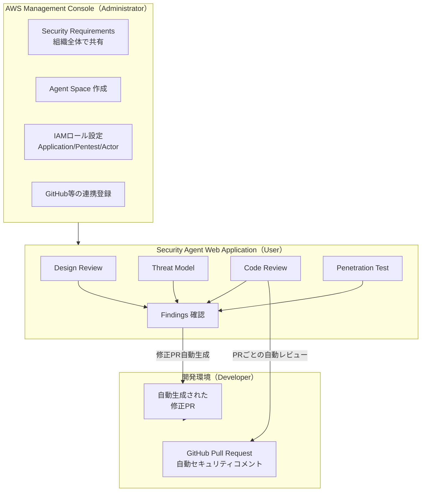
```mermaid
flowchart TD
    subgraph Console["AWS Management Console（Administrator）"]
        SR[Security Requirements<br/>組織全体で共有]
        AS[Agent Space 作成]
        IAM[IAMロール設定<br/>Application/Pentest/Actor]
        INT[GitHub等の連携登録]
    end

    subgraph WebApp["Security Agent Web Application（User）"]
        DR[Design Review]
        TM[Threat Model]
        CR[Code Review]
        PT[Penetration Test]
        FD[Findings 確認]
    end

    subgraph Dev["開発環境（Developer）"]
        PR[GitHub Pull Request<br/>自動セキュリティコメント]
        FIX[自動生成された<br/>修正PR]
    end

    Console --> WebApp
    DR --> FD
    TM --> FD
    CR --> FD
    PT --> FD
    FD -->|修正PR自動生成| FIX
    CR -->|PRごとの自動レビュー| PR
    FIX --> Dev
```

### 役割（ロール）の整理

| ロール | 働く場所 | やること |
| --- | --- | --- |
| Administrator | AWS Management Console | Agent Space作成、セキュリティ要件定義、IAMロール・連携設定、ユーザー管理 |
| User | Security Agent Web Application | 侵入テスト・コードレビュー・脅威モデル・設計レビューの実行とFinding確認 |
| Developer | GitHub / IDE（Kiro, Claude Code等） | PR上の自動セキュリティ指摘の確認、修正の取り込み |

---

## 2. ハンズオンの概要

### 想定環境・所要時間

| 項目 | 内容 |
| --- | --- |
| 実行環境 | 実際のAWSアカウント（管理者権限があるアカウント推奨） |
| リージョン | 侵入テスト等をGAで利用できるリージョンの1つ、例: `ap-northeast-1`（東京） |
| 必要な外部アカウント | GitHubアカウント（無料枠でOK。演習用に脆弱なサンプルリポジトリをForkして使用） |
| ターミナル | GitBash |
| 所要時間目安 | 2〜3時間（侵入テストの演習まで行う場合は、テスト実行の待ち時間で+数時間かかることがある） |
| 費用目安 | **コードレビュー・脅威モデル・設計レビューはプレビュー中につき無料**（2026年8月時点、月あたりコードレビュー1,000件・設計レビュー200件の上限あり）。**侵入テストのみ課金対象（$50/task-hour）**で、2ヶ月間の無料トライアル（月400 task-hour）が用意されている |

> ⚠️ **コスト注意**: 侵入テストは課金対象の機能です。本教材では、まず無料のコードレビュー・脅威モデル・設計レビューで基本操作を習得し、侵入テストは無料トライアル枠内で小さいスコープに絞って試す構成にしています。演習5は任意（オプション）として扱ってください。

### ゴールイメージ

このハンズオンを終えると、以下ができるようになります。

- AWS Security Agent の Agent Space をゼロから構築できる
- 意図的に脆弱なサンプルアプリに対してコードレビューを実行し、Findingsを読み解ける
- ソースコードから脅威モデル（STRIDE分類）を生成し、アーキテクチャ上のリスクを説明できる
- 設計ドキュメントに対する設計レビューを実施できる
- （任意）ドメイン検証を行い、実際に侵入テストを実行してみる
- Findingに対する自動修正PRのレビュー・マージフローを理解する

### 学べることの全体像

| 演習 | 学習項目 | 対応する中心概念 |
| --- | --- | --- |
| 事前準備 | AWS Security Agentの有効化、Agent Space作成、IAM-only/SSOの選択 | Agent Space, IAMロール |
| 演習1 | GitHubリポジトリ連携とコードレビュー実行 | Code Review, Finding |
| 演習2 | Findingsの読み方と自動修正PRの確認 | Remediation |
| 演習3 | 脅威モデルの作成とSTRIDE分析の確認 | Threat Model |
| 演習4 | 設計ドキュメントに対する設計レビュー | Design Review, Security Requirements |
| 演習5（任意） | ドメイン検証と侵入テストの実行 | Penetration Test, IAMロール(Actor Role) |

### 演習の流れ

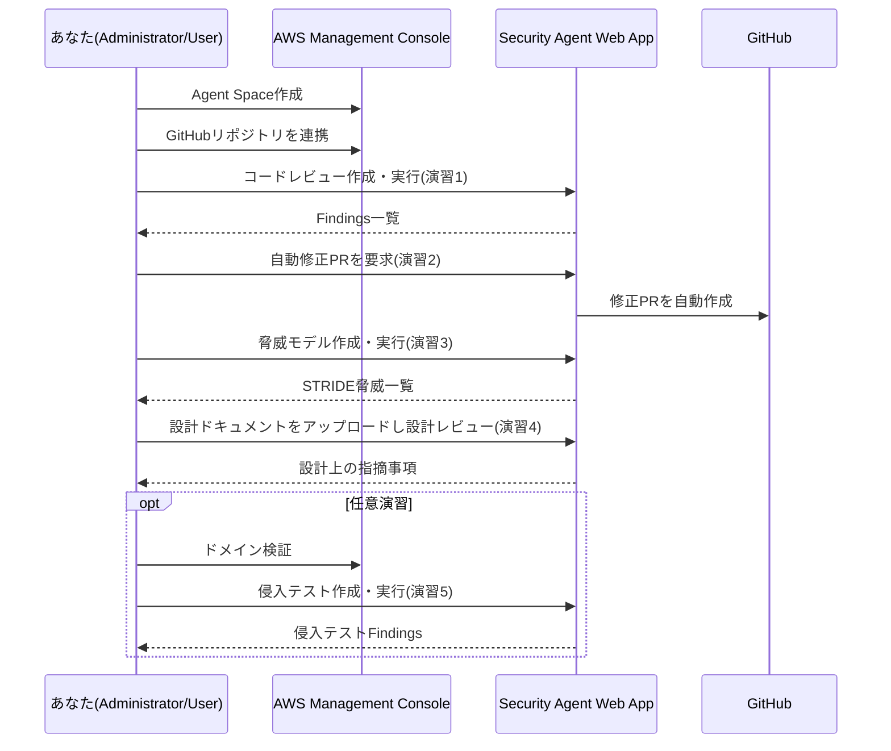
```mermaid
sequenceDiagram
    participant You as あなた(Administrator/User)
    participant Console as AWS Management Console
    participant WebApp as Security Agent Web App
    participant GitHub as GitHub

    You->>Console: Agent Space作成
    You->>Console: GitHubリポジトリを連携
    You->>WebApp: コードレビュー作成・実行(演習1)
    WebApp-->>You: Findings一覧
    You->>WebApp: 自動修正PRを要求(演習2)
    WebApp->>GitHub: 修正PRを自動作成
    You->>WebApp: 脅威モデル作成・実行(演習3)
    WebApp-->>You: STRIDE脅威一覧
    You->>WebApp: 設計ドキュメントをアップロードし設計レビュー(演習4)
    WebApp-->>You: 設計上の指摘事項
    opt 任意演習
        You->>Console: ドメイン検証
        You->>WebApp: 侵入テスト作成・実行(演習5)
        WebApp-->>You: 侵入テストFindings
    end
```

---

## 3. ハンズオンの手順

### 事前準備

#### 0-1. サンプルの脆弱なリポジトリを用意する

コードレビューと脅威モデルの題材として、意図的に脆弱性を仕込んだ公開リポジトリを自分のGitHubアカウントにForkします。演習用途では [OWASP Juice Shop](https://github.com/juice-shop/juice-shop) や [OWASP NodeGoat](https://github.com/OWASP/NodeGoat) のような教育目的の脆弱アプリが適しています。

```bash
# GitBashで実行
git clone https://github.com/<あなたのGitHubユーザー名>/NodeGoat.git
cd NodeGoat
```

> Forkはブラウザ上のGitHubで「Fork」ボタンから行ってください。

#### 0-2. AWS Security Agent を有効化する

1. AWS Management Console にサインインする。
2. リージョンを対応リージョン（例: 東京 `ap-northeast-1`）に切り替える。
3. サービス検索で **AWS Security Agent** を開く。
4. コンソールのランディングページにある **Set up AWS Security Agent** を選択する。
5. ユーザーアクセス方式を選択する。
   - **IAM Identity Center（SSO）**: 組織でSSOを使っている場合に推奨。
   - **IAM-only access**: 個人検証用にはこちらが手軽。AWSコンソールにアクセスできるIAMプリンシパルであれば、Agent Spaceの管理画面にある「admin access link」からWebアプリを起動できる。

✅ **確認ポイント**: コンソールに「Agent Spaces」ページが表示され、Agent Space作成ボタンが押せる状態になっていること。

#### 0-3. Agent Space を作成する

1. **Agent Spaces** ページで **Create Agent Space** を選択する。
2. **Agent Space name** に `handson-nodegoat` のような分かりやすい名前を入力する。
3. **Description** に「NodeGoat脆弱性学習用ハンズオン」など目的を記入する（任意）。
4. **Create** を選択する。

✅ **確認ポイント**: Agent Space一覧に作成したスペースが表示され、詳細ページに遷移できること。

#### 0-4. GitHubリポジトリを連携する

Agent Spaceの詳細ページには **ペネトレーションテスト／設計レビュー／脅威モデル／コードレビュー** の4枚のカードが並んでおり、それぞれ個別に「セットアップが必要」または「準備完了」の状態を持ちます。

- **設計レビュー**は組織のセキュリティ要件があればGitHub連携なしで使えるため、最初から「準備完了」と表示されます（演習4でそのまま使えます）。
- **ペネトレーションテスト**・**脅威モデル**は演習3・演習5で使うので、この時点では触らなくて構いません。
- 今回連携するのは **コードレビュー** のカードです。

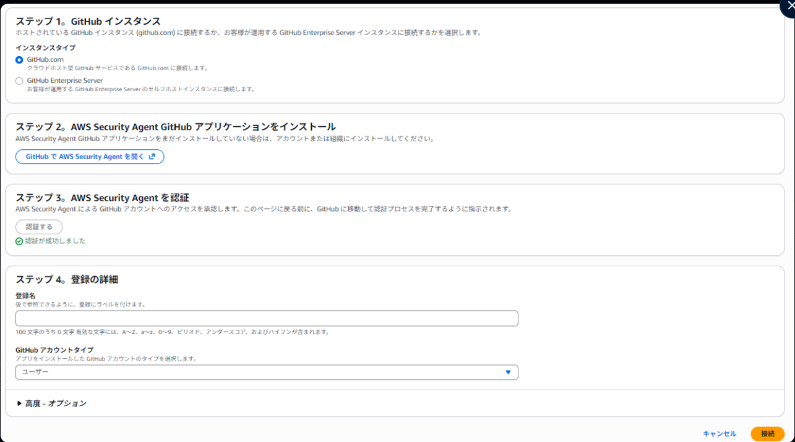

1. Agent Spaceの詳細ページで、**コードレビュー** カードの **「コードレビューを有効にする」** ボタンを選択する。
2. 「コードレビュー構成をセットアップする」ウィザードが開く（ステップ1: インテグレーション、リポジトリ、バケットを接続する／ステップ2: オプション設定）。
3. **「接続された統合」** セクションの **「追加」** ボタンを選択する。
4. 「統合を追加」モーダルで **「新規登録を作成」**（初回はこちらを選択）→ プロバイダとして **GitHub** を選択し、**「次へ」** を選択する。

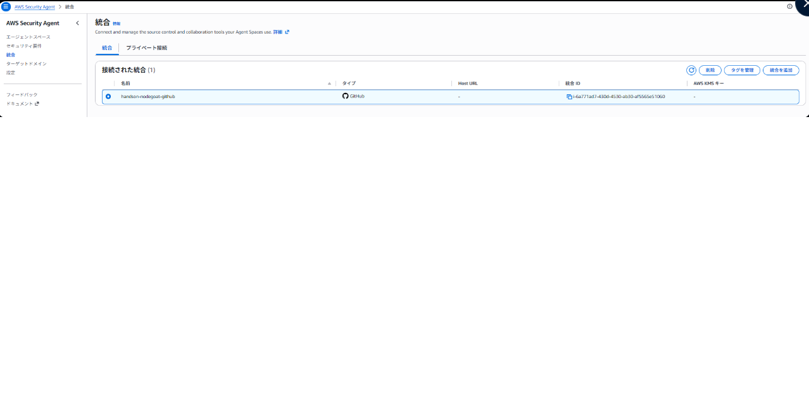

5. 「GitHubをAWS Security Agentに接続」ページで、4つのステップを上から順に完了させる。
   1. **ステップ1. GitHubインスタンス**: `GitHub.com` を選択（デフォルトのままでOK）。
   2. **ステップ2. AWS Security Agent GitHubアプリケーションをインストール**: 「GitHubでAWS Security Agentを開く」を選択し、GitHubの別タブでインストールを行う。リポジトリアクセス範囲は **「Only select repositories」** を選び、Forkした `NodeGoat` のみにチェックして **Install** する（最小権限の原則）。
   3. **ステップ3. AWS Security Agentを認証**: GitHubタブでのインストールが終わったらAWSコンソールの画面に戻り、「認証する」を選択してOAuth認証を完了する。
   4. **ステップ4. 登録の詳細**: 登録名（例: `handson-nodegoat-github`。半角英数字・ピリオド・アンダースコア・ハイフンのみ使用可、100文字以内）を入力し、GitHubアカウントタイプは個人アカウントなら「ユーザー」のままにする。「高度 - オプション」は今回は開かなくてよい。

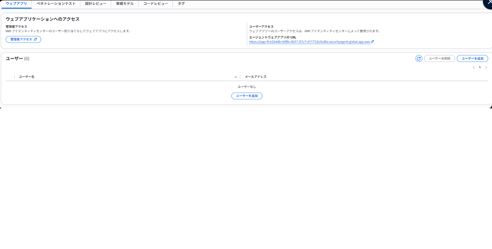

6. 右下の **「接続」** ボタンを選択し、GitHub統合の登録を完了する。この登録はAWS Security Agentアカウント全体（テナントレベル）のものであり、**この時点ではまだAgent Spaceには紐付いていない**点に注意する（左メニューの「統合」ページで確認すると `接続された統合(1)` として表示される）。
7. Agent Spaceの「コードレビュー構成をセットアップする」ウィザードに戻り（Agent Space一覧 → 対象のAgent Space → コードレビューカードの「コードレビューを有効にする」から再度開く）、**「接続された統合」** の **「追加」** を再度選択する。
8. 今度は「統合を追加」モーダルで **「利用可能な登録」** を選び、手順6で作成した登録（例: `handson-nodegoat-github`）を選択して次へ進む。これでAgent Spaceに統合が紐付き、「接続された統合(1)」と表示される。
9. GitHubリポジトリ一覧が表示されるので、`NodeGoat` 行の **チェックボックスにチェックを入れる**。チェックすると **「コードレビューコメント」**（PRへの自動レビューコメント）と **「コード修正」**（自動修正PRの許可）を設定できる。演習2で自動修正PRを試すため、**「コード修正」は有効**にしておく（「コードレビューコメント」は今回の演習では任意）。
10. **「S3バケット」** セクションは今回のコードレビュー演習では使わないため、未設定のままスキップしてよい。
11. **「コードレビュー設定」** は、セキュリティ要件と一般的な脆弱性の両方を検証する **「セキュリティ要件と脆弱性検出結果」**（デフォルトで選択済み）のままにし、**「次へ」** を選択する。

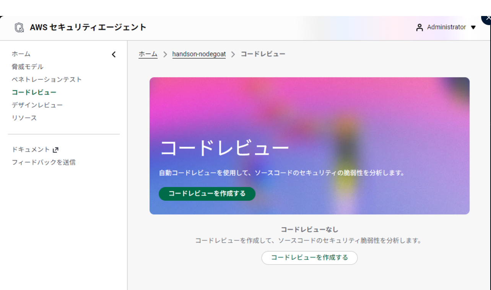

12. **「オプション設定」** 画面が表示される。**「CloudWatchログ」**・**「サービスアクセス」** はいずれもオプションで、未設定のまま進めるとログググループ・サービスロールが自動作成される。今回のハンズオンでは両方とも開かずにそのまま **「保存」** を選択してセットアップを完了する。

✅ **確認ポイント**: Agent Spaceの「コードレビュー」カードが「準備完了」等の状態に変わり、「接続された統合」に対象リポジトリが表示されること。

> 💡 脅威モデル（演習3）でも同じGitHubリポジトリを使いますが、**脅威モデルはコードレビューとは別に「脅威モデルを有効にする」ボタンからのセットアップが必要**です。コードレビューを有効化しても脅威モデル用の連携は自動的には行われないので、演習3の際に改めてセットアップしてください。

**ここで学んだこと**: AWS Security Agentは「組織全体の設定（GitHub登録）」と「Agent Space単位の設定（どのリポジトリを使うか）」に加えて、**機能（カード）ごとに個別の有効化操作**が必要な構造になっている。

---

### 演習1: コードレビューを作成・実行する

**目的**: GitHub連携したソースコードに対して静的解析を実行し、脆弱性のFindingsを取得する流れを体験する。

#### 手順

1. Agent Spaceの詳細ページで **「管理者アクセス」** を選択し、Security Agent Web Applicationにログインする。
2. 左サイドバーの **「コードレビュー」** を選択する。
3. 表示されたバナーの **「コードレビューを作成する」** ボタンを選択する。
4. **タイトル** に `nodegoat-full-scan` のような名前を入力する。
5. **ソース** の **GitHub** タブで、連携済みの `NodeGoat` リポジトリにチェックを入れる（連携済みリポジトリが1つだけの場合、最初からチェック済みで表示されることもある）。
6. **アクセス許可** セクションの **サービスロール** は、Agent Space設定時に自動作成されたロールが自動的に選択されている（変更不要）。
7. **CloudWatchロググループ - オプション** は未選択のままでよい（自動的にロググループが作成される）。
8. **自動コード修正** は、まずはチェックを外したままにしておく（演習2で有効にして試す）。

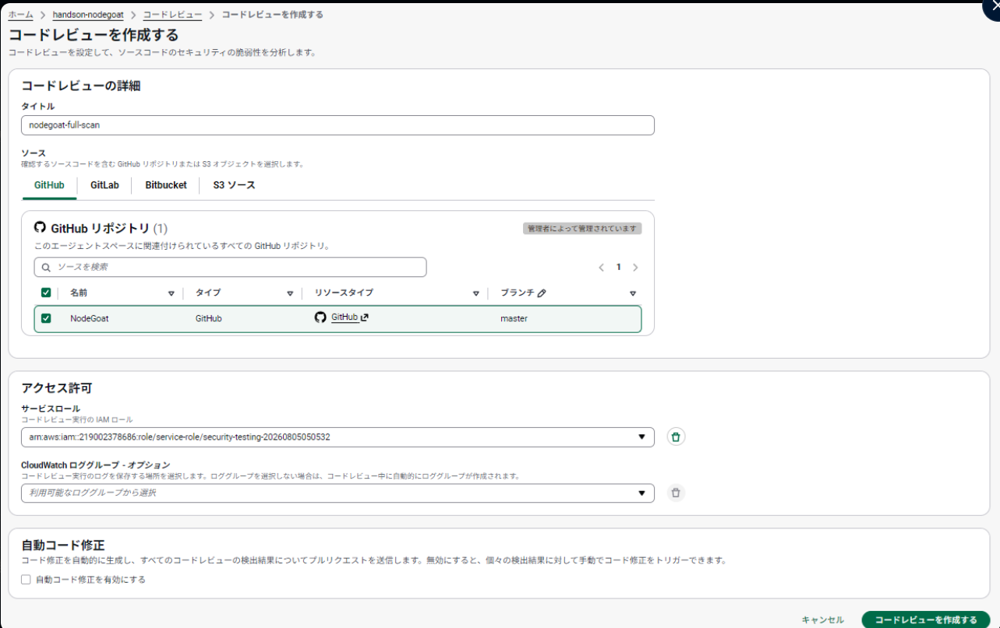

9. 右下の **「コードレビューを作成する」** ボタンを選択する。
10. 詳細ページに遷移すると、実行が自動的に開始され、ステータスが **「進行中」** になる（開始されない場合は右上の **「レビューを開始する」** ボタンを選択する）。

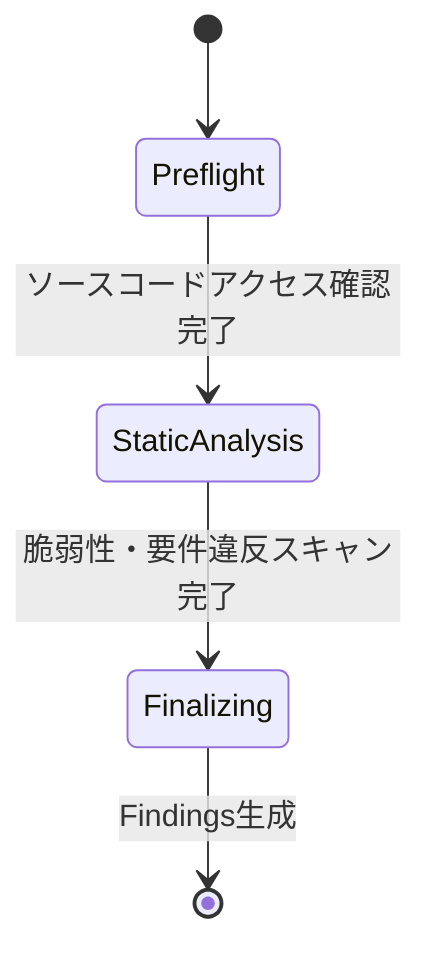
```mermaid
stateDiagram-v2
    [*] --> Preflight
    Preflight --> StaticAnalysis: ソースコードアクセス確認完了
    StaticAnalysis --> Finalizing: 脆弱性・要件違反スキャン完了
    Finalizing --> [*]: Findings生成
```

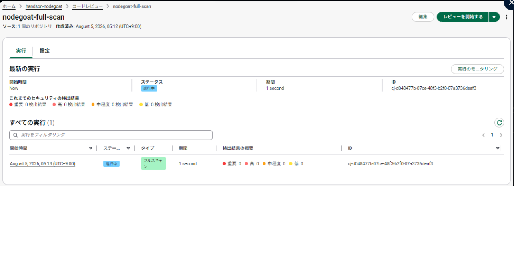

11. 実行状況は詳細ページの **「実行」** タブから確認できる（Preflight → 静的解析 → Finalizing の順に進行）。

✅ **確認ポイント**: 実行が完了し、**Findings** タブに複数の脆弱性（例: インジェクション、認可不備、機微情報のハードコードなど）が severity（深刻度）付きで一覧表示されること。

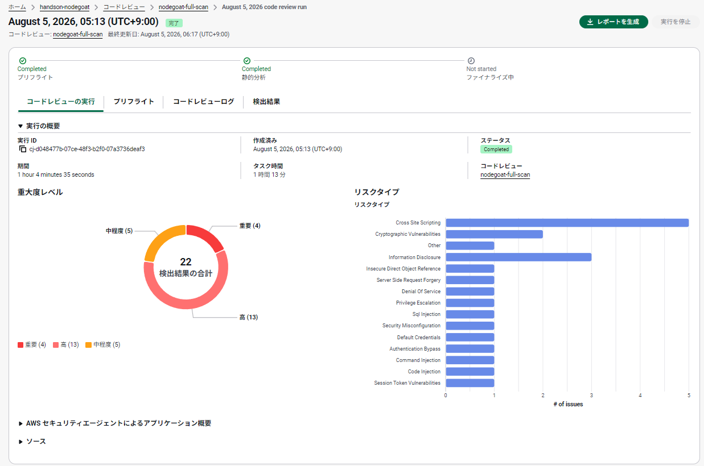

**ここで学んだこと**: Code Review は「設定（configuration）」と「実行（run）」が分離した再利用可能な仕組みで、コードが変わるたびに同じ設定で再実行できる。NodeGoatのようなあえて脆弱性を仕込んだ小規模アプリでも、タスク時間にして1時間強かけて22件（重要4／高13／中程度5）ものFindingsが検出されるなど、AIエージェントによる静的解析の網羅性がうかがえる。

---

### 演習2: Findingsを読み解き、自動修正PRを確認する

**目的**: Findingの内容（影響範囲・再現手順・修正案）を理解し、AIによる自動修正PRのフローを体験する。

#### 手順

1. 演習1の実行詳細ページで **「検出結果」** タブを開き、severity（重大度）が `Critical` や `High` のFindingを1つクリックする。
2. 右側に表示されるFinding詳細で、以下の情報を確認する。
   - タイトル（脆弱性の概要。例: `Server-Side JavaScript Injection via eval() on POST /contributions — Remote Code Execution`）
   - **説明**: 該当ファイル・行番号、脆弱性の仕組み、想定される影響範囲
   - **Verified**: エージェントが実際に検証した内容（どの経路が保護されていて、どこにサニタイズがないか等）
   - **コードの場所**: 該当ファイルパス
3. Finding詳細の **「推奨される修正」** セクションで、AIエージェントが提案する修正方針（該当ファイル・行番号ごとの具体的な対応内容）を確認する。
4. **「コード修正」** セクションの **「コードを修正」** ボタンを選択する（個別の自動修正リクエスト）。
5. 画面上部に **「コード修正が開始されました」** という通知が表示される。この処理は非同期で実行されるため、しばらく待つ（🔄更新ボタンで **ステータス** の変化を随時確認する。`IN_PROGRESS` → `COMPLETED` と変化する）。
6. `COMPLETED` になったら **「プルリクエスト」** 欄を確認する。
   - **Privateリポジトリの場合**: GitHub上に自動生成されたPull Requestへのリンクが表示される。
   - **Publicリポジトリの場合（NodeGoatのForkは既定でPublic）**: 脆弱性の詳細を公開しないためPRは作成されず、代わりに **「コード diff」** リンクが表示される。

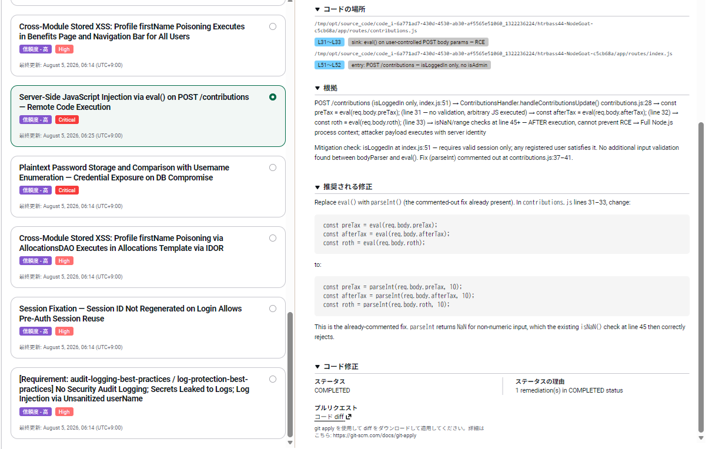

✅ **確認ポイント**: `Privateリポジトリ`ならGitHub上のPRに、`Publicリポジトリ`なら「コード diff」に、Findingで指摘されたファイル・行に対する具体的な修正内容が含まれていること。

### Publicリポジトリの場合: diffを適用して確認する

1. Finding詳細の **「コード diff」** リンクを選択し、diffファイルをダウンロードする。
2. GitBashでNodeGoatのローカルリポジトリに移動し、適用可能か確認する。

   ```bash
   cd ~/path/to/NodeGoat
   git apply --check ~/Downloads/<ダウンロードしたファイル名>.diff
   ```

3. エラーが出なければ実際に適用する。

   ```bash
   git apply ~/Downloads/<ダウンロードしたファイル名>.diff
   ```

4. `git diff` で変更内容を確認する。「推奨される修正」に列挙されていた項目（helmet設定の有効化、CSRFトークン、cookieのhttpOnly/secure設定など）が実際のコードにどう反映されているか見比べる。

**ここで学んだこと**: 修正の提供方法はリポジトリの公開設定によって「PR自動作成」か「diff提供（`git apply`で手動適用）」に振り分けられる。いずれの場合も、マージ・適用前に必ず人間がレビューする運用が前提。

---

### 演習3: 脅威モデル（Threat Model）を作成する

**目的**: ソースコードからアーキテクチャ・信頼境界・データフローを自動抽出し、STRIDE分類で脅威を洗い出す体験をする。

#### 手順

1. Web Applicationの左サイドバーで **「脅威モデル」** を選択する。
2. **「脅威モデルを作成する」** を選択する。
3. **タイトル** に `nodegoat-threat-model` と入力する。
4. **「リポジトリ」** セクションで、演習1と同じ `NodeGoat` リポジトリを選択する。
5. **「機能仕様書」**（API仕様や設計ドキュメントをアップロードして分析の焦点を絞るオプション項目）は今回は省略し、ソースコードのみから生成させる（0件のままでよい）。
6. **「アクセス許可」** のサービスロールは自動選択済みのものをそのまま使う。CloudWatchロググループはオプションなので未選択でよい。

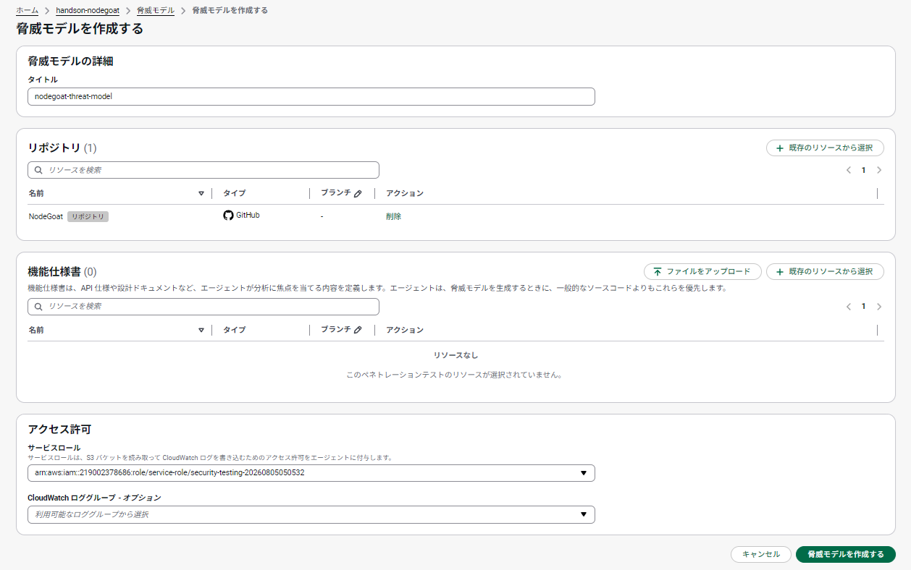

7. **「脅威モデルを作成する」** ボタンを選択する。
8. 作成後、詳細ページから実行（Run）を開始する。
9. 完了後、実行詳細ページの **「概要」** タブに、**重大度レベル**（severityごとの内訳ドーナツグラフ）と **脅威カテゴリ**（STRIDEカテゴリ別の件数バーグラフ）が表示される。

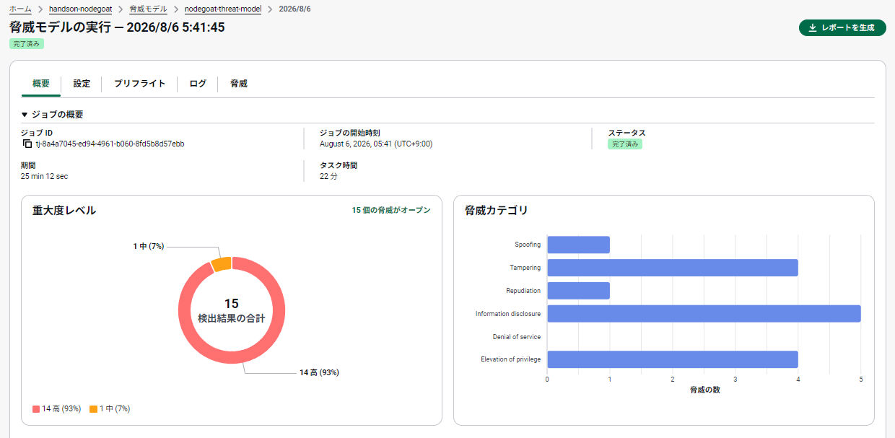

10. 同じ **「概要」** タブのまま下にスクロールし、**「▼ システムの概要」** セクションを確認する（デフォルトで展開されている）。Purpose（目的）・Capabilities（機能）・Architecture（アーキテクチャ）・Components（コンポーネント一覧）・Trust Boundaries（信頼境界）が英語の文章とテーブルで詳細に記述されている。

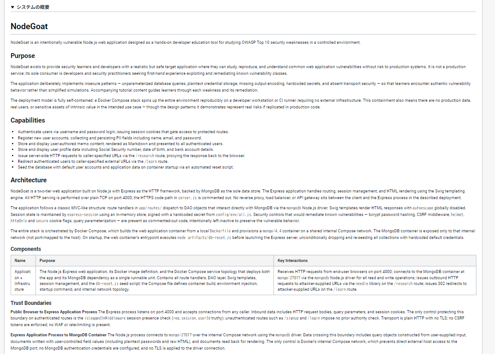

11. **「脅威」** タブを選択する。左側に15件の脅威が一覧表示され、それぞれ重大度（High等）バッジ付きで並んでいる。1件クリックすると右側に詳細が表示される。
    - **重大度 / STRIDEカテゴリ / 影響を受けるアセット**: 脅威の分類と影響範囲
    - **説明**: ステートメント（何が起きうるか）／ソース（攻撃者像）／前提条件／アクション（攻撃手順）／影響、の5項目に分解された詳細な記述
    - **リファレンス > 根拠**: 該当するソースコードファイルパス（例: `session.js`, `memos-dao.js`, `db-reset.js`）

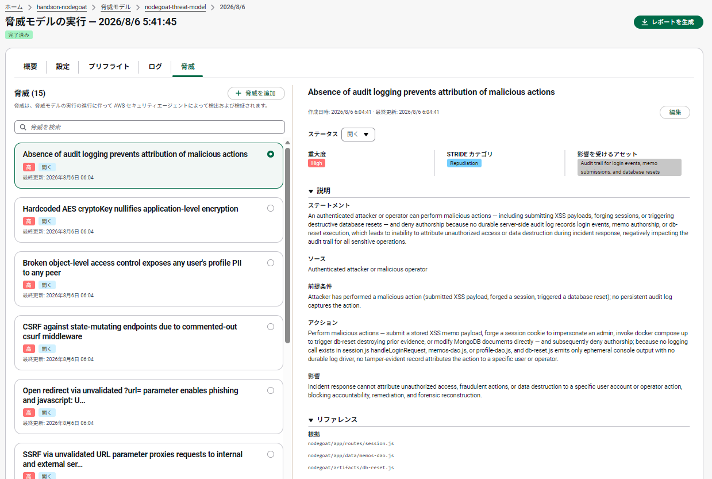

✅ **確認ポイント**: 少なくとも2つ以上のSTRIDEカテゴリにまたがる脅威が、根拠（該当ファイル）付きでリストされていること。

**ここで学んだこと**: 脅威モデルは「使い捨て」ではなく「構成として保存され、コードが進化するたびに再実行できる」もの。CIに定期実行を組み込むような運用も想定されている。NodeGoatではタスク時間22分で15件の脅威(高14件・中1件)が検出され、Spoofing・Tampering・Repudiation・Information disclosure・Elevation of privilegeの5カテゴリにまたがっていた（Denial of serviceは0件）。コードレビューが「個々のコード上の欠陥」を見るのに対し、脅威モデルは「アーキテクチャ全体としてどう攻撃され得るか」という別の切り口で脅威を洗い出せることがわかる。

---

### 演習4: 設計レビュー（Design Review）を実施する

**目的**: コードを書く前の設計段階でセキュリティ要件との適合性をチェックする「シフトレフト」の体験をする。

#### 手順

1. 簡単な設計メモを用意する。あえて複数のセキュリティ上の問題を含む設計を1ページ程度のテキストで書く。以下はそのまま使える例（NodeGoatに「従業員が自分の給与・口座情報を編集でき、管理者は全従業員分をエクスポートできる」機能を追加する、という想定）。

   ```markdown
   # 設計メモ: NodeGoat 従業員プロフィール編集機能 拡張

   ## 概要
   既存のNodeGoat（福利厚生ポータル）に、従業員が自身のプロフィール（氏名・給与情報照会・銀行口座情報）を
   編集できる新機能と、管理者が全従業員の給与データを一覧・エクスポートできる管理者用APIを追加する。

   ## 認証方式
   - ログイン成功後、サーバーはJWTを発行する。
   - 発行したJWTはブラウザの localStorage に保存し、以降のAPIリクエストのAuthorizationヘッダーに付与する。
   - JWTの有効期限は30日間とし、リフレッシュトークンの仕組みは設けない。

   ## セッション管理
   - セッションCookieは httpOnly と secure 属性を付与せずに発行する（開発環境での動作確認を優先するため）。
   - セッションタイムアウトは設定しない。

   ## 認可（アクセス制御）
   - /api/admin/employees/export エンドポイント（全従業員の給与・口座情報をCSVエクスポートするAPI）は、
     ログイン済みであれば誰でもアクセスできる実装とする。管理者ロールのチェックは、フロントエンドの
     画面表示を制御するのみで、バックエンドAPI側では行わない。

   ## データ保存
   - 銀行口座番号はデータベースに平文で保存する（暗号化は将来のフェーズで検討）。
   - パスワードは既存のNodeGoatの実装を踏襲し、bcryptでハッシュ化する。

   ## 通信
   - 社内ネットワークからの利用を前提とするため、HTTPS化は行わずHTTP通信のみとする。

   ## ログ・監査
   - 誰がいつ給与データをエクスポートしたかの記録（監査ログ）は特に取得しない。
   ```

   このメモには、トークンの保存方法（localStorage）、Cookie属性の欠如、バックエンド側の認可チェック欠如（IDOR/権限昇格につながる）、機微情報の平文保存、HTTPS未使用、監査ログの欠如、という**複数カテゴリの問題**を意図的に埋め込んでいる。演習3の脅威モデルで検出された「監査ログの欠如」と同種の問題を、今度は**コードを書く前の設計段階**で検出できるかを比較しながら確認すると学びが深まる。
2. Web Applicationの **「デザインレビュー」** を選択し、**「デザインレビューを作成」** を選ぶ。
3. **「デザインレビュー名」**（最大80文字）に `nodegoat-design` のような名前を入力する。
4. **「確認するファイル」** に、上記の設計メモをファイル（`.md` や `.txt` 等）として保存したものをドラッグ＆ドロップ、または **「ファイルを選択」** からアップロードする。DOC/DOCX/JPEG/MD/PDF/PNG/TXTに対応しており、最大5ファイル（各2MB、合計6MB）まで添付できる。

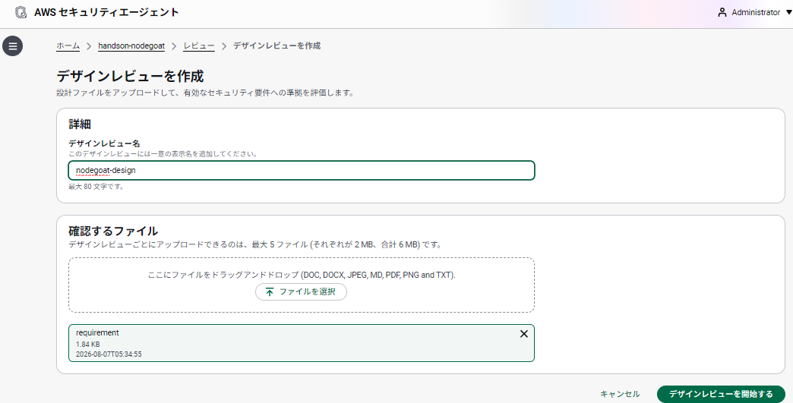

5. 右下の **「デザインレビューを開始する」** ボタンを選択する（作成と同時に実行が開始される）。
6. 実行が完了すると、組織のセキュリティ要件（Security Requirements）と照らし合わせた指摘事項が返ってくる。

✅ **確認ポイント**: 設計メモに埋め込んだ問題点（JWTの保存方法、Cookie属性、バックエンド側の認可チェック欠如、機微情報の平文保存、HTTPS未使用、監査ログ欠如など）のうち、複数が指摘事項として検出されていること。実行結果ページの **「検出結果の概要」** に、**非準拠（Non-Compliant）**・**データ不足**・**準拠**・**該当なし** の4区分で件数が集計される。

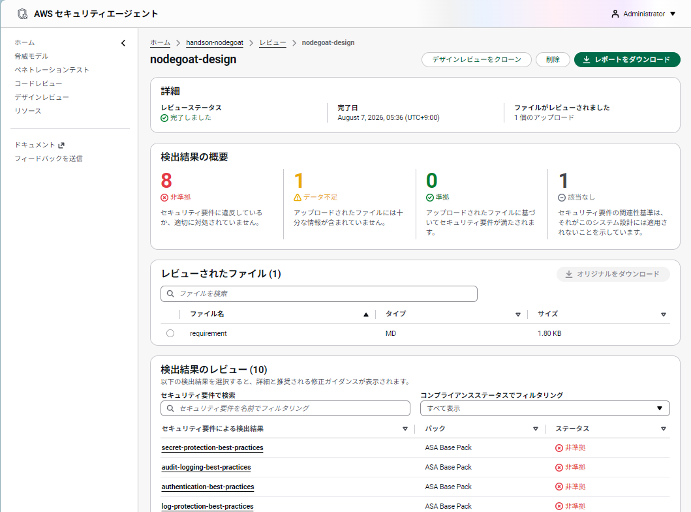

NodeGoatの例では10件のセキュリティ要件のうち **8件が非準拠** と判定され、`secret-protection-best-practices`（秘密情報保護）、`audit-logging-best-practices`（監査ログ）、`authentication-best-practices`（認証）、`log-protection-best-practices`（ログ保護）など、設計メモに埋め込んだ問題点にほぼ対応する要件で軒並み「非準拠」の判定が出た。

**ここで学んだこと**: Design Reviewは「一度きりの評価」でありThreat Modelのように再実行できない。ドキュメントを更新して再評価したい場合は「Clone」して新しいレビューを作る。組織のSecurity Requirements（`ASA Base Pack`のような要件パック）に照らして「準拠/非準拠/データ不足/該当なし」という明確なコンプライアンス判定が出る点が、脅威モデルやコードレビューとは異なる設計レビューの特徴。

---

### 演習5（任意・課金あり）: 侵入テスト（Penetration Test）を実行する

**目的**: 検証済みドメインに対する自律的な多段階攻撃シナリオの実行を体験する。**この演習は課金対象（$50/task-hour）です。無料トライアル枠（2ヶ月間、月400 task-hour）の範囲内で、必ずスコープを絞って実施してください。**

#### 手順概要

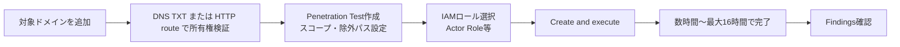
```mermaid
flowchart LR
    A[対象ドメインを追加] --> B[DNS TXT または HTTP route で所有権検証]
    B --> C[Penetration Test作成<br/>スコープ・除外パス設定]
    C --> D[IAMロール選択<br/>Actor Role等]
    D --> E[Create and execute]
    E --> F[数時間〜最大16時間で完了]
    F --> G[Findings確認]
```

1. Agent Spaceの **Penetration test** タブで **Set up penetration test** を選択し、テスト対象ドメイン（自分が所有し、テスト許可のあるドメインに限る）を追加する。
2. ドメイン所有権を **DNS TXTレコード** または **`.well-known/aws/securityagent-domain-verification.json` への HTTPトークン設置** のいずれかで検証する。
3. 検証完了後、Web Applicationで **Create a penetration test** を選択する。
4. Target URL、除外したいリスクタイプ、テスト対象外パス（例: `/admin/delete` のような破壊的操作）を設定する。
5. 認証が必要なアプリの場合はテスト用アカウントの認証情報を設定する（本番の管理者アカウントは絶対に使わない）。
6. IAMサービスロール（Penetration Test Service Role）を選択する。
7. **Create and execute** を選択してテストを開始する。

✅ **確認ポイント**: Findingsに、再現可能な攻撃パス（reproducible attack path）と影響分析付きの脆弱性が表示されること。

> ⚠️ **重要な注意事項**
> - **必ず自分が所有し、かつ侵入テストの実施許可がある環境**に対してのみ実行してください。第三者のドメインへの実行は不正アクセス禁止法等の法令違反になり得ます。
> - 破壊的操作（削除・決済等）のエンドポイントは必ず **Out-of-scope URLs** に追加してください。
> - テストは長時間（最大16時間程度）かかることがあるため、実行前に必ず課金される task-hour の見積もりとトライアル残枠を確認してください。

**ここで学んだこと**: 侵入テストは「ドメインの所有権検証」が必須の前提条件であり、スコープ設定（除外パス・除外リスクタイプ）でテスト範囲を安全にコントロールできる。

---

## 4. 習得事項のまとめ

### 触れた要素一覧

| 要素 | 演習 | 役割 |
| --- | --- | --- |
| Agent Space | 事前準備 | アプリ単位の作業スペース |
| GitHub連携（テナント登録／Agent Space接続） | 事前準備 | ソースコード・PR連携の基盤 |
| Code Review | 演習1 | 全リポジトリの静的解析 |
| Finding / Remediation PR | 演習2 | 脆弱性の詳細確認と自動修正 |
| Threat Model（STRIDE） | 演習3 | アーキテクチャ・データフローからの脅威洗い出し |
| Design Review | 演習4 | 実装前のセキュリティ適合性チェック |
| Penetration Test（任意） | 演習5 | 実環境に対する自律攻撃シミュレーション |
| IAMロール（Application/Pentest Service/Actor Role） | 全般 | 各機能がAWSリソース・対象アプリにアクセスするための権限管理 |

### トラブルシューティング

| つまずきポイント | 原因 | 対処法 |
| --- | --- | --- |
| Code reviewが `Preflight` で失敗する | サービスロールに対象S3/GitHubへのアクセス権限がない | サービスロールのポリシーを確認し、`SecurityAudit`相当や個別権限を付与する |
| コードレビューの「静的分析」がなかなか終わらない | ハングではなく、AIエージェントが複数タスク（16件程度）を順番にこなしているだけのことが多い | 実行詳細ページの **「コードレビューログ」** タブを開き、各タスク（Code scanner for Architecture等）が1つずつ「完了済み」に変化しているか確認する。ログに実際の解析内容（grepコマンド実行結果など）が流れていれば正常に進行中。小規模アプリでも数十分かかることがある |
| 侵入テストが作成できない | 対象ドメインが未検証 | DNS TXTレコードまたはHTTPルート検証を先に完了させる |
| 「コードを修正」を実行したのにGitHub上にPRが見当たらない | Fork元リポジトリがPublicのまま（NodeGoatのForkはデフォルトでPublic）だと、脆弱性の詳細を公開しないためPRではなくFinding詳細ページへのdiff添付になる仕様 | Finding詳細ページで添付されたdiffを確認する。実際にPRが作られる流れを見たい場合は、リポジトリをGitHubの `Settings > Danger Zone > Change visibility` からPrivateに変更してから再実行する |
| Simulated validationが使えない | 複数リポジトリを同時にソース指定している、または非コンテナ化前提のアプリ | 単一リポジトリ・Dockerize可能なアプリ構成に絞る |
| 侵入テストで想定外の課金が発生 | スコープが広すぎる、除外パス未設定 | Out-of-scope URLsを設定し、対象ドメイン・パスを最小限に絞る |
| Design Reviewを更新して再評価したい | Design Reviewは再実行不可の仕様 | 既存レビューを **Clone** して新しいドキュメントで再評価する |
| 検出結果・脅威モデル・推奨修正の説明文が英語で読みにくい | 2026年8月時点、AWSコンソール自体は日本語化できてもAIエージェントが生成する本文（Finding説明、推奨される修正など）は英語のみ。Agent Space作成フォームにも言語設定の項目はない | 英語のまま読み解くか、翻訳ツールで補助する。将来のアップデートで多言語対応が入る可能性はあるが、現時点は非対応 |

### 応用・発展

- 生成された脅威モデル・Findingsは、社内のセキュリティレビュー資料やコンプライアンス報告のドラフトとして活用できる。
- Code ReviewのPRコメント機能をCI（GitHub Actions等）と組み合わせることで、通常のPRレビューフローにセキュリティチェックを組み込める。
- Security Requirementsを組織のセキュアコーディング規約に合わせてカスタマイズすることで、レビューの一貫性を高められる。
- **別の脆弱アプリで比較してみる**: [OWASP WebGoat](https://github.com/WebGoat/WebGoat)（Java/Spring Boot、OWASP Top 10ごとの独立したレッスン集）でコードレビューを実行すると、NodeGoat（Node.js/Express、1つの業務アプリを模したシナリオ）とは異なる言語・検出傾向を比較できる。ただしWebGoatはリポジトリが大きく、レビューにかなり時間がかかる点と、レッスンの集合体という構造上、脅威モデル・設計レビューでは一貫したシステムとして分析しにくい点に注意（脅威モデル・設計レビューにはNodeGoatのような単一アプリ構成の題材が向いている）。

---

## 5. 今後の学習ロードマップ

優先度順に、次に学ぶと理解が深まるトピックを挙げます。

1. **AWS DevOps Agent との連携** — AWS Security Agentと同時期に登場した姉妹サービス。インフラ運用の自動化エージェントで、Agent Spaceの概念など共通点が多く理解がスムーズ。
2. **IDE/CLI連携（Kiro、Claude Code plugin、MCP統合）** — 2026年6月以降に追加された機能。開発者がコンテキストスイッチなしにセキュリティスキャン・脅威モデル生成を行えるようになる仕組みを学ぶ。
3. **GuardDuty / Security Hub との住み分け理解** — AWS Security Agentが「開発ライフサイクル」を守るのに対し、GuardDuty/Security Hubは「稼働中インフラの異常検知・統合管理」を担う。両者を組み合わせたセキュリティ運用体制の設計を学ぶ。
4. **STRIDE / OWASP Top 10 の基礎理論** — 脅威モデルやコードレビューのFindingsをより深く理解するために、STRIDEフレームワークとOWASP Top 10（Webアプリの代表的脆弱性分類）を体系的に学ぶ。

### 参考リンク

- [What is AWS Security Agent?](https://docs.aws.amazon.com/securityagent/latest/userguide/what-is.html) — サービス概要
- [How AWS Security Agent works](https://docs.aws.amazon.com/securityagent/latest/userguide/how-it-works.html) — コンポーネント構成とロール
- [Understand the resource hierarchy and lifecycle](https://docs.aws.amazon.com/securityagent/latest/userguide/understand-lifecycle.html) — Agent Space等のリソース階層
- [Create an Agent Space](https://docs.aws.amazon.com/securityagent/latest/userguide/create-agent-space.html)
- [Create an IAM Role for AWS Security Agent](https://docs.aws.amazon.com/securityagent/latest/userguide/create-iam-role.html)
- [Create a code review](https://docs.aws.amazon.com/securityagent/latest/userguide/perform-code-review-scan.html)
- [Create a penetration test](https://docs.aws.amazon.com/securityagent/latest/userguide/perform-penetration-test.html)
- [Enable an application domain for penetration testing](https://docs.aws.amazon.com/securityagent/latest/userguide/enable-test-domain.html)
- [AWS Security Agent FAQs](https://aws.amazon.com/security-agent/faqs/) — 料金・無料枠の詳細
- [AWS Security Agent Pricing](https://aws.amazon.com/security-agent/pricing/)
- [AWS Security Agent adds threat modeling, Kiro power and Claude Code plugin, and more（AWS Blog）](https://aws.amazon.com/blogs/aws/aws-security-agent-adds-threat-modeling-kiro-power-and-claude-code-plugin-and-more/)
- [AWS CLI Reference for AWS Security Agent](https://docs.aws.amazon.com/cli/latest/reference/securityagent/)
- [OWASP Juice Shop](https://github.com/juice-shop/juice-shop) / [OWASP NodeGoat](https://github.com/OWASP/NodeGoat) / [OWASP WebGoat](https://github.com/WebGoat/WebGoat) — 演習用の意図的に脆弱なサンプルアプリ
- [I ran AWS Security Agent's full pipeline on my personal project（DEV Community）](https://dev.to/aws-builders/i-ran-aws-security-agents-full-pipeline-on-my-personal-project-design-review-code-review-and-1cp2) — 実践者によるレポート言語の制約（英語のみ）等の実体験レポート
