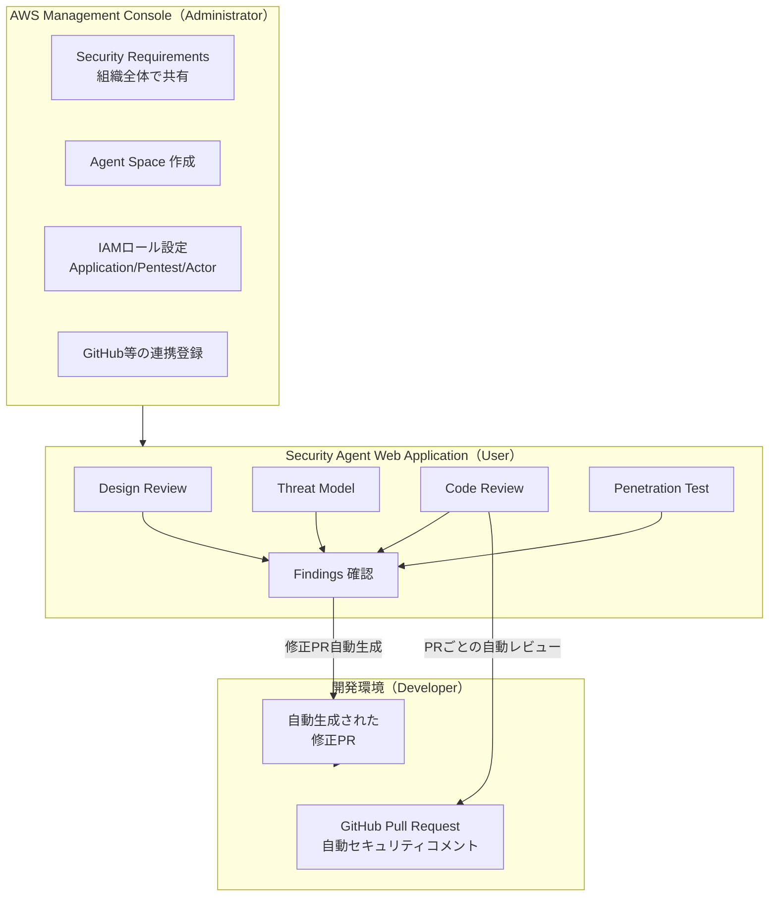
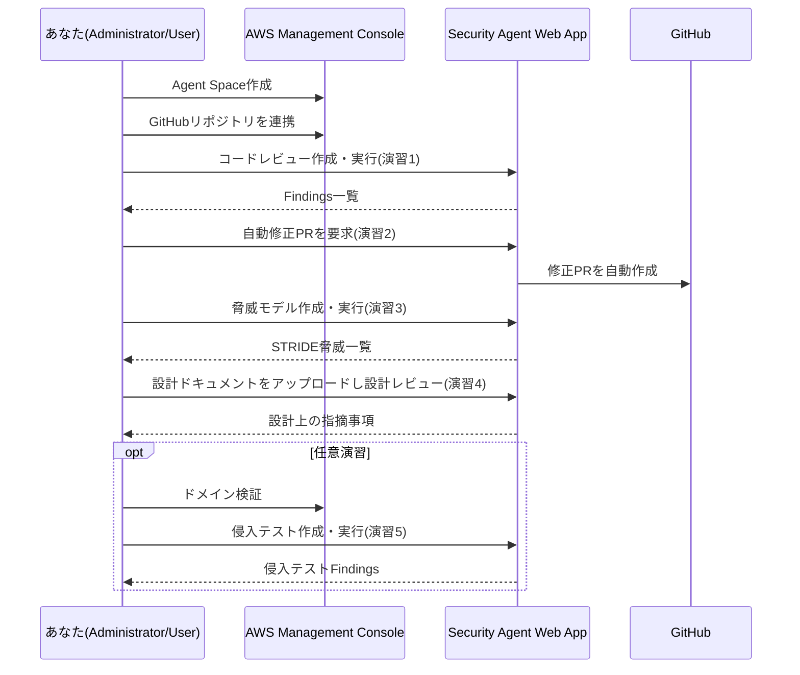
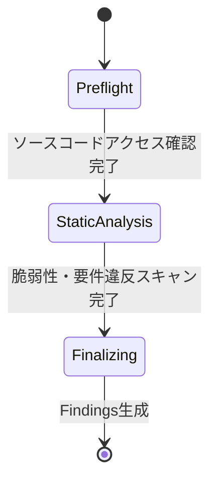
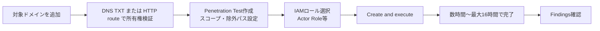

# AWS Security Agent ハンズオン — 生成AIエージェントで「設計レビュー → 脅威モデリング → コードレビュー → 侵入テスト」を一気通貫で体験する

> 本教材は AWS 公式ドキュメント（[What is AWS Security Agent?](https://docs.aws.amazon.com/securityagent/latest/userguide/what-is.html) ほか、末尾の参考リンク参照）をもとに 2026年8月時点の情報で作成しています。AWS Security Agent は 2025年12月にプレビュー公開され、2026年3月に侵入テスト機能がGA、以降も脅威モデリングなど機能追加が続いている新しいサービスです。今後仕様が変わる可能性があるため、実施前に必ず公式ドキュメントの最新版を確認してください。

## 1. 勉強対象の概要

### AWS Security Agent とは

**AWS Security Agent** は、アプリケーション開発ライフサイクル全体（設計 → 実装 → デプロイ）を通じてセキュリティを継続的に検証する「フロンティアエージェント（frontier agent）」です。人間のセキュリティエンジニアが行っていたレビューや侵入テストを、生成AIエージェントがオンデマンドかつ大規模に実行できるようにします。

これまでのAWSセキュリティサービス（GuardDuty、Security Hub など）が「稼働中のインフラの異常検知」を主目的にするのに対し、AWS Security Agent は **開発プロセスに入り込んで「作る前・作っている最中」に脆弱性を潰す** ことに主眼を置いている点が大きな特徴です。

### 中心概念

| 概念 | 説明 |
| --- | --- |
| **Agent Space** | アプリケーション／プロジェクト単位で作成する作業スペース。連携リポジトリ・侵入テスト設定・レビュー結果はここに紐づく。1アプリ＝1 Agent Space が推奨構成 |
| **Design Review（設計レビュー）** | 設計書・アーキテクチャ資料をアップロードし、組織のセキュリティ要件との適合性をコードを書く前にチェックする |
| **Threat Model（脅威モデル）** | ソースコードや設計書（scope doc）からアプリのアーキテクチャ・信頼境界・データフローを理解し、**STRIDE**（なりすまし/改ざん/否認/情報漏洩/DoS/権限昇格）の観点で脅威を洗い出す。再実行可能な「構成」として保存される |
| **Code Review（コードレビュー）** | GitHub/GitLab/Bitbucket/S3 上のソースコード全体を静的解析し、脆弱性と組織のセキュリティ要件違反を検出。Pull Request 単位の自動レビューにも対応 |
| **Penetration Test（侵入テスト）** | 検証済みドメインに対して多段階の攻撃シナリオを自律実行し、実際に悪用可能な脆弱性を発見・証明する。唯一 **課金対象**（$50/task-hour） |
| **Security Requirements（セキュリティ要件）** | 組織全体で1度定義し、すべての設計レビュー・コードレビューで自動的に検証される基準（認可ライブラリ、ログ方針、データアクセスポリシー等） |
| **Finding / Remediation** | 検出された脆弱性。多くの場合、修正コードを含む Pull Request が自動生成される |

### 全体構造のイメージ



### 役割（ロール）の整理

| ロール | 働く場所 | やること |
| --- | --- | --- |
| Administrator | AWS Management Console | Agent Space作成、セキュリティ要件定義、IAMロール・連携設定、ユーザー管理 |
| User | Security Agent Web Application | 侵入テスト・コードレビュー・脅威モデル・設計レビューの実行とFinding確認 |
| Developer | GitHub / IDE（Kiro, Claude Code等） | PR上の自動セキュリティ指摘の確認、修正の取り込み |

---

## 2. ハンズオンの概要

### 想定環境・所要時間

| 項目 | 内容 |
| --- | --- |
| 実行環境 | 実際のAWSアカウント（管理者権限があるアカウント推奨） |
| リージョン | 侵入テスト等をGAで利用できるリージョンの1つ、例: `ap-northeast-1`（東京） |
| 必要な外部アカウント | GitHubアカウント（無料枠でOK。演習用に脆弱なサンプルリポジトリをForkして使用） |
| ターミナル | GitBash |
| 所要時間目安 | 2〜3時間（侵入テストの演習まで行う場合は、テスト実行の待ち時間で+数時間かかることがある） |
| 費用目安 | **コードレビュー・脅威モデル・設計レビューはプレビュー中につき無料**（2026年8月時点、月あたりコードレビュー1,000件・設計レビュー200件の上限あり）。**侵入テストのみ課金対象（$50/task-hour）**で、2ヶ月間の無料トライアル（月400 task-hour）が用意されている |

> ⚠️ **コスト注意**: 侵入テストは課金対象の機能です。本教材では、まず無料のコードレビュー・脅威モデル・設計レビューで基本操作を習得し、侵入テストは無料トライアル枠内で小さいスコープに絞って試す構成にしています。演習5は任意（オプション）として扱ってください。

### ゴールイメージ

このハンズオンを終えると、以下ができるようになります。

- AWS Security Agent の Agent Space をゼロから構築できる
- 意図的に脆弱なサンプルアプリに対してコードレビューを実行し、Findingsを読み解ける
- ソースコードから脅威モデル（STRIDE分類）を生成し、アーキテクチャ上のリスクを説明できる
- 設計ドキュメントに対する設計レビューを実施できる
- （任意）ドメイン検証を行い、実際に侵入テストを実行してみる
- Findingに対する自動修正PRのレビュー・マージフローを理解する

### 学べることの全体像

| 演習 | 学習項目 | 対応する中心概念 |
| --- | --- | --- |
| 事前準備 | AWS Security Agentの有効化、Agent Space作成、IAM-only/SSOの選択 | Agent Space, IAMロール |
| 演習1 | GitHubリポジトリ連携とコードレビュー実行 | Code Review, Finding |
| 演習2 | Findingsの読み方と自動修正PRの確認 | Remediation |
| 演習3 | 脅威モデルの作成とSTRIDE分析の確認 | Threat Model |
| 演習4 | 設計ドキュメントに対する設計レビュー | Design Review, Security Requirements |
| 演習5（任意） | ドメイン検証と侵入テストの実行 | Penetration Test, IAMロール(Actor Role) |

### 演習の流れ



---

## 3. ハンズオンの手順

### 事前準備

#### 0-1. サンプルの脆弱なリポジトリを用意する

コードレビューと脅威モデルの題材として、意図的に脆弱性を仕込んだ公開リポジトリを自分のGitHubアカウントにForkします。演習用途では [OWASP Juice Shop](https://github.com/juice-shop/juice-shop) や [OWASP NodeGoat](https://github.com/OWASP/NodeGoat) のような教育目的の脆弱アプリが適しています。

```bash
# GitBashで実行
git clone https://github.com/<あなたのGitHubユーザー名>/NodeGoat.git
cd NodeGoat
```

> Forkはブラウザ上のGitHubで「Fork」ボタンから行ってください。

#### 0-2. AWS Security Agent を有効化する

1. AWS Management Console にサインインする。
2. リージョンを対応リージョン（例: 東京 `ap-northeast-1`）に切り替える。
3. サービス検索で **AWS Security Agent** を開く。
4. コンソールのランディングページにある **Set up AWS Security Agent** を選択する。
5. ユーザーアクセス方式を選択する。
   - **IAM Identity Center（SSO）**: 組織でSSOを使っている場合に推奨。
   - **IAM-only access**: 個人検証用にはこちらが手軽。AWSコンソールにアクセスできるIAMプリンシパルであれば、Agent Spaceの管理画面にある「admin access link」からWebアプリを起動できる。

✅ **確認ポイント**: コンソールに「Agent Spaces」ページが表示され、Agent Space作成ボタンが押せる状態になっていること。

#### 0-3. Agent Space を作成する

1. **Agent Spaces** ページで **Create Agent Space** を選択する。
2. **Agent Space name** に `handson-nodegoat` のような分かりやすい名前を入力する。
3. **Description** に「NodeGoat脆弱性学習用ハンズオン」など目的を記入する（任意）。
4. **Create** を選択する。

✅ **確認ポイント**: Agent Space一覧に作成したスペースが表示され、詳細ページに遷移できること。

#### 0-4. GitHubリポジトリを連携する

1. Agent Spaceの詳細ページで、GitHub連携（Integrations）セクションを開く。
2. 初回はAWS Security Agent GitHub Appの認可（テナントレベルの登録）を行う。GitHubの認可画面が開くので、対象のGitHubアカウント/Organizationを選択して許可する。
3. 連携するリポジトリとして、先ほどForkした `NodeGoat`（または任意の脆弱サンプル）を選択する。
4. **Code review** の利用を有効にする。

✅ **確認ポイント**: Agent Spaceの「Integrations」に対象リポジトリが `Connected` の状態で表示されること。

**ここで学んだこと**: AWS Security Agentは「組織全体の設定（GitHub登録）」と「Agent Space単位の設定（どのリポジトリを使うか）」が分離されている。

---

### 演習1: コードレビューを作成・実行する

**目的**: GitHub連携したソースコードに対して静的解析を実行し、脆弱性のFindingsを取得する流れを体験する。

#### 手順

1. Security Agent Web Application（Agent Space詳細ページの **Start in web app** から起動）にログインする。
2. 左サイドバーの **Code reviews** を選択する。
3. **Create code review** を選択する。
4. **Title** に `nodegoat-full-scan` のような名前を入力する。
5. **Sources** タブで **GitHub repositories** を選び、連携済みの `NodeGoat` リポジトリにチェックを入れる。
6. **Permissions** セクションで、あらかじめコンソール側で設定済みのサービスロールを選択する（初回は管理者にIAMロール設定を依頼、または自分で `SecurityAudit` 相当の最小権限ロールを作成しておく）。
7. **Automatic code remediation** は、まずは無効のままで良い（演習2で有効化して試す）。
8. **Simulated validation**（実行環境を立てて実際に脆弱性が悪用可能か動的検証するオプション）は今回は無効のままにしておく（時間短縮のため）。
9. **Create code review** を選択する。
10. 詳細ページで **Start review** を選択し、レビューを開始する。



11. 実行状況は **Code review run** タブから確認できる（Preflight → Static analysis → Finalizing の順に進行）。

✅ **確認ポイント**: 実行が完了し、**Findings** タブに複数の脆弱性（例: インジェクション、認可不備、機微情報のハードコードなど）が severity（深刻度）付きで一覧表示されること。

**ここで学んだこと**: Code Review は「設定（configuration）」と「実行（run）」が分離した再利用可能な仕組みで、コードが変わるたびに同じ設定で再実行できる。

---

### 演習2: Findingsを読み解き、自動修正PRを確認する

**目的**: Findingの内容（影響範囲・再現手順・修正案）を理解し、AIによる自動修正PRのフローを体験する。

#### 手順

1. 演習1のFindings一覧から、severityが高いものを1つクリックする。
2. Finding詳細に含まれる以下の情報を確認する。
   - 該当ファイル・行番号
   - 脆弱性の種類（例: SQLインジェクション、認可不備など）
   - 影響分析（impact analysis）
   - 修正ガイダンス
3. Finding詳細画面で **Remediate**（個別の自動修正リクエスト）を選択する。
4. GitHub上に自動生成されたPull Requestを開き、差分を確認する。

✅ **確認ポイント**: GitHub上のPRに、Findingで指摘されたファイル・行に対する具体的な修正コミットが付いていること。

> ⚠️ 公開（Public）リポジトリの場合、脆弱性の詳細が公開されるのを避けるためPRは自動作成されず、代わりにダウンロード可能な diff（提案パッチ）が添付される仕様です。プライベートリポジトリで試すとPRの挙動を確認しやすいです。

**ここで学んだこと**: 修正PRはリポジトリの公開設定によって「PR自動作成」か「非公開diff提供」に振り分けられる。マージ前に必ず人間がレビューする運用が前提。

---

### 演習3: 脅威モデル（Threat Model）を作成する

**目的**: ソースコードからアーキテクチャ・信頼境界・データフローを自動抽出し、STRIDE分類で脅威を洗い出す体験をする。

#### 手順

1. Web Applicationの左サイドバーで **Threat models** を選択する。
2. **Create threat model** を選択する。
3. Titleに `nodegoat-threat-model` と入力する。
4. **Sources** として、演習1と同じGitHubリポジトリを選択する（scope docは今回は省略し、コードのみから生成させる）。
5. 実行に必要なCloudWatchロググループ・サービスロールを選択する。
6. 作成後、詳細ページから実行（Run）を開始する。
7. 完了後、生成された **System overview**（アーキテクチャ概要・データフロー図・信頼境界の説明）を確認する。
8. **Threats** タブで、STRIDEカテゴリ（Spoofing / Tampering / Repudiation / Information Disclosure / Denial of Service / Elevation of Privilege）ごとに分類された脅威と、重大度・推奨対策を確認する。

✅ **確認ポイント**: 少なくとも2つ以上のSTRIDEカテゴリにまたがる脅威が、根拠（evidence）と推奨対策（recommendation）付きでリストされていること。

**ここで学んだこと**: 脅威モデルは「使い捨て」ではなく「構成として保存され、コードが進化するたびに再実行できる」もの。CIに定期実行を組み込むような運用も想定されている。

---

### 演習4: 設計レビュー（Design Review）を実施する

**目的**: コードを書く前の設計段階でセキュリティ要件との適合性をチェックする「シフトレフト」の体験をする。

#### 手順

1. 簡単な設計メモを用意する（例: 「ユーザー認証にJWTを使い、トークンをlocalStorageに保存する」「管理者APIには認可チェックを入れない」など、あえて問題を含む設計を1ページ程度のテキストで書く）。
2. Web Applicationの **Design reviews** を選択し、**Create design review** を選ぶ。
3. 作成した設計メモ（テキストファイルまたは直接貼り付け）をアップロードする。
4. 実行すると、組織のセキュリティ要件（Security Requirements）と照らし合わせた指摘事項が返ってくる。

✅ **確認ポイント**: アップロードした設計メモに含めた問題点（例: トークンの保存方法、認可チェック欠如）が指摘事項として検出されていること。

**ここで学んだこと**: Design Reviewは「一度きりの評価」でありThreat Modelのように再実行できない。ドキュメントを更新して再評価したい場合は「Clone」して新しいレビューを作る。

---

### 演習5（任意・課金あり）: 侵入テスト（Penetration Test）を実行する

**目的**: 検証済みドメインに対する自律的な多段階攻撃シナリオの実行を体験する。**この演習は課金対象（$50/task-hour）です。無料トライアル枠（2ヶ月間、月400 task-hour）の範囲内で、必ずスコープを絞って実施してください。**

#### 手順概要



1. Agent Spaceの **Penetration test** タブで **Set up penetration test** を選択し、テスト対象ドメイン（自分が所有し、テスト許可のあるドメインに限る）を追加する。
2. ドメイン所有権を **DNS TXTレコード** または **`.well-known/aws/securityagent-domain-verification.json` への HTTPトークン設置** のいずれかで検証する。
3. 検証完了後、Web Applicationで **Create a penetration test** を選択する。
4. Target URL、除外したいリスクタイプ、テスト対象外パス（例: `/admin/delete` のような破壊的操作）を設定する。
5. 認証が必要なアプリの場合はテスト用アカウントの認証情報を設定する（本番の管理者アカウントは絶対に使わない）。
6. IAMサービスロール（Penetration Test Service Role）を選択する。
7. **Create and execute** を選択してテストを開始する。

✅ **確認ポイント**: Findingsに、再現可能な攻撃パス（reproducible attack path）と影響分析付きの脆弱性が表示されること。

> ⚠️ **重要な注意事項**
> - **必ず自分が所有し、かつ侵入テストの実施許可がある環境**に対してのみ実行してください。第三者のドメインへの実行は不正アクセス禁止法等の法令違反になり得ます。
> - 破壊的操作（削除・決済等）のエンドポイントは必ず **Out-of-scope URLs** に追加してください。
> - テストは長時間（最大16時間程度）かかることがあるため、実行前に必ず課金される task-hour の見積もりとトライアル残枠を確認してください。

**ここで学んだこと**: 侵入テストは「ドメインの所有権検証」が必須の前提条件であり、スコープ設定（除外パス・除外リスクタイプ）でテスト範囲を安全にコントロールできる。

---

## 4. 習得事項のまとめ

### 触れた要素一覧

| 要素 | 演習 | 役割 |
| --- | --- | --- |
| Agent Space | 事前準備 | アプリ単位の作業スペース |
| GitHub連携（テナント登録／Agent Space接続） | 事前準備 | ソースコード・PR連携の基盤 |
| Code Review | 演習1 | 全リポジトリの静的解析 |
| Finding / Remediation PR | 演習2 | 脆弱性の詳細確認と自動修正 |
| Threat Model（STRIDE） | 演習3 | アーキテクチャ・データフローからの脅威洗い出し |
| Design Review | 演習4 | 実装前のセキュリティ適合性チェック |
| Penetration Test（任意） | 演習5 | 実環境に対する自律攻撃シミュレーション |
| IAMロール（Application/Pentest Service/Actor Role） | 全般 | 各機能がAWSリソース・対象アプリにアクセスするための権限管理 |

### トラブルシューティング

| つまずきポイント | 原因 | 対処法 |
| --- | --- | --- |
| Code reviewが `Preflight` で失敗する | サービスロールに対象S3/GitHubへのアクセス権限がない | サービスロールのポリシーを確認し、`SecurityAudit`相当や個別権限を付与する |
| 侵入テストが作成できない | 対象ドメインが未検証 | DNS TXTレコードまたはHTTPルート検証を先に完了させる |
| Public repoで修正PRが作られない | 公開リポジトリでは脆弱性公開回避のためPRではなくdiff添付になる仕様 | Private repoで試すか、添付されたdiffを手動適用する |
| Simulated validationが使えない | 複数リポジトリを同時にソース指定している、または非コンテナ化前提のアプリ | 単一リポジトリ・Dockerize可能なアプリ構成に絞る |
| 侵入テストで想定外の課金が発生 | スコープが広すぎる、除外パス未設定 | Out-of-scope URLsを設定し、対象ドメイン・パスを最小限に絞る |
| Design Reviewを更新して再評価したい | Design Reviewは再実行不可の仕様 | 既存レビューを **Clone** して新しいドキュメントで再評価する |

### 応用・発展

- 生成された脅威モデル・Findingsは、社内のセキュリティレビュー資料やコンプライアンス報告のドラフトとして活用できる。
- Code ReviewのPRコメント機能をCI（GitHub Actions等）と組み合わせることで、通常のPRレビューフローにセキュリティチェックを組み込める。
- Security Requirementsを組織のセキュアコーディング規約に合わせてカスタマイズすることで、レビューの一貫性を高められる。

---

## 5. 今後の学習ロードマップ

優先度順に、次に学ぶと理解が深まるトピックを挙げます。

1. **AWS DevOps Agent との連携** — AWS Security Agentと同時期に登場した姉妹サービス。インフラ運用の自動化エージェントで、Agent Spaceの概念など共通点が多く理解がスムーズ。
2. **IDE/CLI連携（Kiro、Claude Code plugin、MCP統合）** — 2026年6月以降に追加された機能。開発者がコンテキストスイッチなしにセキュリティスキャン・脅威モデル生成を行えるようになる仕組みを学ぶ。
3. **GuardDuty / Security Hub との住み分け理解** — AWS Security Agentが「開発ライフサイクル」を守るのに対し、GuardDuty/Security Hubは「稼働中インフラの異常検知・統合管理」を担う。両者を組み合わせたセキュリティ運用体制の設計を学ぶ。
4. **STRIDE / OWASP Top 10 の基礎理論** — 脅威モデルやコードレビューのFindingsをより深く理解するために、STRIDEフレームワークとOWASP Top 10（Webアプリの代表的脆弱性分類）を体系的に学ぶ。

### 参考リンク

- [What is AWS Security Agent?](https://docs.aws.amazon.com/securityagent/latest/userguide/what-is.html) — サービス概要
- [How AWS Security Agent works](https://docs.aws.amazon.com/securityagent/latest/userguide/how-it-works.html) — コンポーネント構成とロール
- [Understand the resource hierarchy and lifecycle](https://docs.aws.amazon.com/securityagent/latest/userguide/understand-lifecycle.html) — Agent Space等のリソース階層
- [Create an Agent Space](https://docs.aws.amazon.com/securityagent/latest/userguide/create-agent-space.html)
- [Create an IAM Role for AWS Security Agent](https://docs.aws.amazon.com/securityagent/latest/userguide/create-iam-role.html)
- [Create a code review](https://docs.aws.amazon.com/securityagent/latest/userguide/perform-code-review-scan.html)
- [Create a penetration test](https://docs.aws.amazon.com/securityagent/latest/userguide/perform-penetration-test.html)
- [Enable an application domain for penetration testing](https://docs.aws.amazon.com/securityagent/latest/userguide/enable-test-domain.html)
- [AWS Security Agent FAQs](https://aws.amazon.com/security-agent/faqs/) — 料金・無料枠の詳細
- [AWS Security Agent Pricing](https://aws.amazon.com/security-agent/pricing/)
- [AWS Security Agent adds threat modeling, Kiro power and Claude Code plugin, and more（AWS Blog）](https://aws.amazon.com/blogs/aws/aws-security-agent-adds-threat-modeling-kiro-power-and-claude-code-plugin-and-more/)
- [AWS CLI Reference for AWS Security Agent](https://docs.aws.amazon.com/cli/latest/reference/securityagent/)
- [OWASP Juice Shop](https://github.com/juice-shop/juice-shop) / [OWASP NodeGoat](https://github.com/OWASP/NodeGoat) — 演習用の意図的に脆弱なサンプルアプリ
