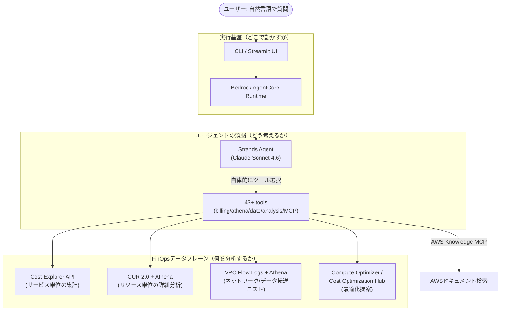
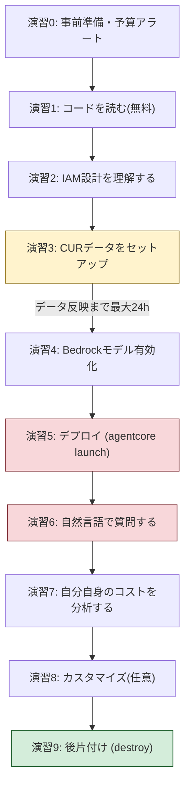
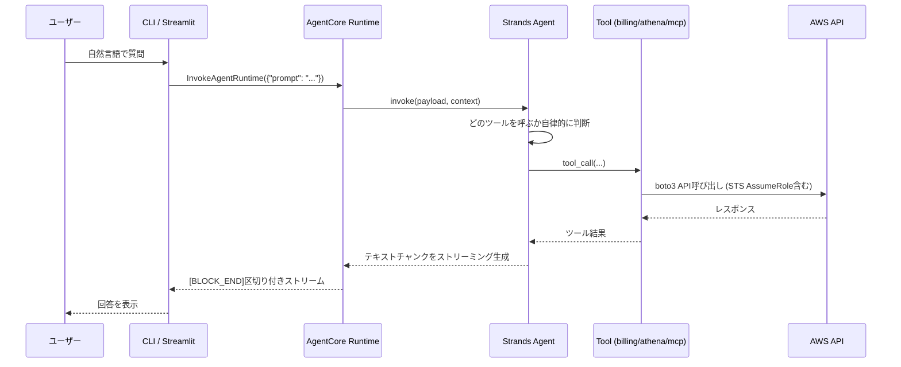
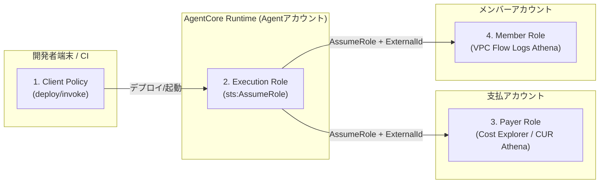
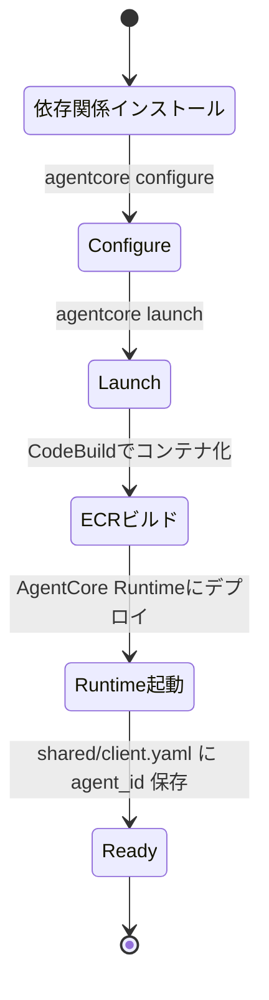

# Amazon Bedrock AgentCore & FinOps ハンズオン — AWSコスト分析AIエージェントを自分の手でデプロイし、AgentCoreの実装パターンとFinOpsの実践知識を身につける

このハンズオンは、AWS公式サンプル [`aws-samples/sample-cost-analyzer-agent`](https://github.com/aws-samples/sample-cost-analyzer-agent) を教材に、以下の2つを同時に学びます。

- **Amazon Bedrock AgentCore** — AIエージェントを本番運用するためのマネージドランタイム
- **FinOps** — クラウドコストを可視化・最適化・運用に組み込む実践フレームワーク

このサンプルは「FinOpsを実践するためのAIエージェントを、AgentCoreの上に構築する」という構成になっているため、両方を1つの教材で学ぶのに最適です。

> ⚠️ **重要な注意**: このハンズオンの一部の演習は実際のAWSアカウントに課金が発生します（Bedrockモデル推論、Athenaスキャン、AgentCoreランタイムなど）。各演習にコスト目安と節約のコツを明記しています。個人のサンドボックスアカウント、かつ予算アラートを設定した上で進めてください。

---

## 1. 勉強対象の概要

### 1.1 FinOpsとは何か

FinOps（Financial Operations）は、[FinOps Foundation](https://www.finops.org/framework/) が提唱する、クラウド利用のコストに対してエンジニアリング・財務・ビジネスの各チームが共通言語で協業するための実践フレームワークです。「コスト削減」そのものが目的ではなく、**ビジネス価値とコストのバランスを継続的に最適化する文化・プロセス**を指します。

FinOpsのライフサイクルは3つのフェーズで構成されます。

| フェーズ | 目的 | 具体的な活動例 |
|---|---|---|
| **Inform（把握）** | コストの可視化と説明責任の共有 | コスト配分（タグ付け）、予算策定、ベンチマーキング、フォーキャスト |
| **Optimize（最適化）** | ムダの削減と効率改善 | リザーブドインスタンス/Savings Plans購入、リソースのライトサイジング、アイドルリソース削除 |
| **Operate（運用）** | 継続的なガバナンスとKPI管理 | 異常検知の自動化、ポリシー適用、レポーティングの定常運用 |

このサンプルエージェントは、まさに **Inform（Cost Explorer/CURによる可視化）** と **Optimize（Compute Optimizer/Savings Plansの推奨）** を自然言語インターフェースで実現するツールです。

### 1.2 Amazon Bedrock AgentCoreとは何か

[Amazon Bedrock AgentCore](https://aws.amazon.com/bedrock/agentcore/) は、AIエージェントを**本番スケールで**構築・デプロイ・運用するためのマネージドサービス群です。2025年後半にGA（一般提供）となり、2026年に入ってからも機能拡張が続いています。「エージェントのコードはあなたが書き、実行基盤・セッション分離・メモリ・ツール接続・セキュリティ・スケーリング・監視はAgentCoreが引き受ける」という役割分担が特徴です。

AgentCoreは単一のサービスではなく、疎結合な**プリミティブ（構成要素）の集合**です。

| プリミティブ | 役割 |
|---|---|
| **Runtime** | エージェントコードを実行するサーバーレス基盤。セッションごとにmicroVMで分離、最大8時間のセッション（Lambdaの15分制限より長い） |
| **Gateway** | 既存のAPI/Lambdaをエージェント向けツール（MCP）に変換して公開 |
| **Memory** | 短期・長期のエージェント記憶を管理 |
| **Identity** | エージェントやユーザーの認証・認可（OAuth等）を管理 |
| **Observability** | CloudWatchと連携したトレース・メトリクス |
| **Code Interpreter / Browser** | サンドボックスでのコード実行・ブラウザ操作 |

このハンズオンで実際に触るのは主に **Runtime** です（サンプルは `--disable-memory` でMemoryを無効化し、Runtimeのみを使う最小構成でデプロイします）。

### 1.3 Strands Agents SDKとは何か

[Strands Agents SDK](https://strandsagents.com/) は、AWSが2025年5月にApache-2.0でOSS公開したエージェント構築フレームワークです。Amazon Q DeveloperやAWS Glueなど、Amazon社内の本番エージェントにも使われています。

特徴は **モデル駆動（model-driven）** であること — 複雑なフローをコードでハードコーディングするのではなく、LLM自身に「どのツールをいつ呼ぶか」を推論させます。開発者は「モデル」「ツール一覧」「システムプロンプト」を渡すだけで、ツール呼び出しループ・会話管理・可観測性はSDKが面倒を見ます。AWS Bedrock/AgentCoreとネイティブ統合されていますが、Anthropic APIやOpenAIなど他プロバイダにも対応したモデル非依存の設計です。

### 1.4 全体像：3つのレイヤーの関係

このサンプルリポジトリは、次の3層構造で理解すると全体像がつかめます。



### 1.5 押さえるべき中心概念

| 概念 | 一言で言うと |
|---|---|
| **AgentCore Runtime** | エージェントを本番稼働させるためのサーバーレス実行環境（`agentcore configure` → `launch` → `invoke`） |
| **Strands Agent + Tools** | LLMが自律的にツールを選んで呼び出す「エージェントループ」の実装 |
| **プロンプトキャッシュ** | システムプロンプト/ツール定義をキャッシュし、コストを最大90%・レイテンシを最大85%削減する仕組み |
| **CUR 2.0 (AWS Data Exports)** | リソース単位のコスト明細をParquet形式でS3に出力し、Athenaで直接SQL分析できる仕組み |
| **クロスアカウントIAM（AssumeRole）** | AWS Organizations配下の支払アカウント/メンバーアカウントに、実行ロールが一時的に権限昇格して安全にアクセスする設計 |
| **MCP (Model Context Protocol)** | エージェントとツール/ドキュメントサーバーを繋ぐ標準プロトコル。本サンプルではAWS公式ドキュメント検索に利用 |

---

## 2. ハンズオンの概要

### 2.1 想定環境・所要時間

| 項目 | 内容 |
|---|---|
| 前提知識 | AWSの基本操作（IAM, S3, CLI）が分かる中級者。生成AI/エージェントの知識は不要 |
| OS/シェル | Windows + GitBash（本教材のコマンドはGitBash前提） |
| 必要なもの | AWS個人検証用アカウント、Python 3.10+、AWS CLI、（推奨）Bedrockモデルアクセス許可 |
| 所要時間目安 | 通し実施で 約3〜4時間（CURデータの反映待ち時間は除く） |
| 実費課金 | あり。目安 **数十円〜数百円程度**（演習ごとに明記。詳細は各演習を参照） |

### 2.2 ゴールイメージ

このハンズオンを終えると、以下ができるようになっています。

- Bedrock AgentCoreの`configure → launch → invoke → destroy`というライフサイクルを自分の手で実行し、Runtimeの仕組みを説明できる
- Strands Agent SDKにおける「ツール」「システムプロンプト」「プロンプトキャッシュ」の役割を、実コードを読んで説明できる
- 自然言語の質問に対して、エージェントがCost Explorer / CUR Athena / VPC Flow Logs のどれを選んで叩いているかを、ログから追跡できる
- FinOpsの Inform/Optimize フェーズを、実際のAWS請求データに対して自然言語で実践できる
- **「エージェント自身の運用コスト」をFinOps的に分析する**（メタ的にFinOpsをFinOpsエージェントに適用する）
- 学んだ構成をベースに、自分のユースケース向けにツールやプロンプトライブラリを拡張できる

### 2.3 学べることの全体像

| 演習 | 主な学習項目 | 課金 |
|---|---|---|
| 演習0: 事前準備 | AWS CLI/Python環境確認、予算アラート設定 | なし |
| 演習1: コード探検 | AgentCoreエントリポイント、Strands Agent構成、プロンプトキャッシュ実装 | なし |
| 演習2: IAMロール設計の理解 | 4ロールモデル（Client/Execution/Payer/Member）、AssumeRole、外部ID | なし |
| 演習3: CURデータのセットアップ | AWS Data Exports (CUR 2.0)、Athena連携 | S3保存料のみ（僅少） |
| 演習4: 使用モデルの確認 | モデルID選択（Sonnet 4.6）、Model Access廃止の仕様理解、AWS Marketplaceサブスクリプション | なし |
| 演習5: エージェントのデプロイ | `config.yaml`設定、`deploy.sh`、`agentcore configure/launch` | ECR/CodeBuild少額、Runtime稼働分 |
| 演習6: 自然言語でのFinOps分析 | ツールルーティング、ストリーミング応答 | Bedrock推論 + Athenaスキャン |
| 演習7: エージェント自身のコスト分析（メタFinOps） | プロンプトキャッシュ効果測定、CloudWatchログ確認 | 数円程度の追加照会 |
| 演習8（応用）: カスタマイズ | プロンプトライブラリ追加、独自ツール追加 | なし〜僅少 |
| 演習9: 後片付け | `agentcore destroy`、Data Export削除、IAMロール削除 | 削除のみ（課金停止） |

### 2.4 ハンズオン全体の流れ



黄色（演習3）は待ち時間が発生する工程、赤色（演習5・6）は実費課金が発生する工程、緑（演習9）は課金停止の工程です。

---

## 3. ハンズオンの手順

### 演習0: 事前準備

**目的**: 環境を整え、思わぬ課金を防ぐガードレール（予算アラート）を先に張る。

```bash
# GitBashで実行
python3 --version   # 3.10以上を確認
aws --version
aws sts get-caller-identity   # 認証情報が有効か確認
```

AWS Budgetsで予算アラートを先に設定しておきます（コンソール: Billing and Cost Management → Budgets → Create budget）。例えば「月額5ドルを超えたら通知」のようなシンプルな予算で十分です。

✅ **確認ポイント**: `aws sts get-caller-identity` が自分のアカウントIDを返す。Budgetsにアラートが1つ以上登録されている。

**ここで学んだこと**: FinOpsの「Inform」フェーズの最も基本的な実践＝予算アラートによる可視化を、自分ごととして体験した。

---

### 演習1: リポジトリのクローンとコード探検（無料）

**目的**: デプロイする前に、何が動くのかをコードレベルで理解する。AgentCoreのエントリポイントとStrandsのエージェント構成パターンを把握する。

```bash
git clone https://github.com/aws-samples/sample-cost-analyzer-agent.git
cd sample-cost-analyzer-agent
```

以下のファイルを開いて読みます。

| ファイル | 着目ポイント |
|---|---|
| `agent/agentcore_agent.py` | `BedrockAgentCoreApp()` と `@app.entrypoint` の使い方。`Agent(model=..., tools=..., system_prompt=..., tool_executor=ConcurrentToolExecutor())` がStrandsエージェント本体 |
| `agent/agentcore_agent.py` (L164-176) | `SystemContentBlock(cachePoint={"type": "default", "ttl": cache_ttl})` — プロンプトキャッシュの実装箇所 |
| `agent/tools/billing_tools.py` | Cost Explorer等43 APIをツール化している箇所 |
| `agent/tools/athena_tools.py` | CUR/VPC Flow LogsへのSQLクエリをツール化している箇所 |
| `agent/prompts/system_prompt.py` | エージェントの振る舞いを決めるシステムプロンプト |
| `docs/tools.md` | 全ツールの一覧（次のセクションでも要約あり） |

特に `agentcore_agent.py` の `invoke()` 関数に着目してください。AgentCoreのエントリポイントは「受け取ったpayloadからプロンプトを取り出し、`agent.stream_async()` でトークンをストリーミングして返す」という非常にシンプルな形をしています。



✅ **確認ポイント**: `invoke()` 関数がなぜ `async generator`（`yield`を使う関数）になっているか、自分の言葉で説明できる。

**ここで学んだこと**: AgentCoreのエントリポイントは「app.entrypointデコレータ + payload/context」という薄い契約であり、実際のエージェントロジックはStrands SDK側にあるという役割分担。

---

### 演習2: IAMロール設計を理解する（無料）

**目的**: このサンプルが採用する「4ロールモデル」によるクロスアカウントFinOpsアクセスの設計を理解する。実務での多くのAgentCoreエージェントもこの設計パターンを踏襲する。

`docs/iam-permissions.md` を開き、以下の関係を図と照らし合わせて読みます。



**本ハンズオンでは簡略化した「集約シナリオ（Scenario A）」を使います** — CURデータとエージェントを同一アカウントに置き、クロスアカウントAssumeRoleを省略する構成です（`agent/config.yaml.example` の「Alternative: Centralized Logging Account」セクション参照）。これにより演習3以降の設定が大幅に簡単になります。

✅ **確認ポイント**: なぜ`ExternalId`が必要か（"confused deputy"問題の防止）を説明できる。Payer RoleとMember Roleがそれぞれ何の権限を持つか表で言える。

**ここで学んだこと**: FinOpsエージェントが複数アカウントの請求データにアクセスする際の、最小権限原則に基づいたクロスアカウントIAM設計パターン。

---

### 演習3: CURデータのセットアップ

**目的**: リソース単位のコスト分析（EC2インスタンス別、S3バケット別など）を可能にする CUR 2.0 データをAthenaで検索可能な形にする。

> 💰 **課金目安**: Data Export自体は無料。S3への保存料（数十MB〜数GB、月数円〜数十円）のみ。**既にCURやAthenaでのコスト分析基盤がある場合はこの演習はスキップして構いません。**
>
> ⏱️ **注意**: エクスポート作成後、最初のデータがS3に反映されるまで **最大24時間** かかります。演習4・5を先に進めて後で戻ってきても構いません。

実際のコンソールのウィザードは以下の順序で進みます（AWS公式ドキュメントで確認済みの正確な順序）。

1. Billing and Cost Management コンソール → **Data Exports** → **Create export**
2. **Export type** で **Standard data export** を選択
3. **Export name** に任意の名前を入力（例: `handson-sample-cost-analyzer-agent`）
4. **Data table configurations** でテーブルを選択:
   - Table で **CUR 2.0** を選択（**FOCUS with AWS columns は選ばないこと** — 主要カラムがFOCUS標準命名`BilledCost`等のままで、このエージェントが前提とするCURネイティブ命名`line_item_unblended_cost`等と一致せず、自動検出・SQLクエリの両方が失敗する）
   - **Include resource IDs** にチェック（EC2インスタンス単位などリソース別分析に必須）
   - **Time granularity** は **`Daily`** を選択する（下記コラム参照。**作成後に変更不可**）
5. **Column selection** で列を選択（迷う場合はヘッダーの先頭チェックボックスで全選択してよい）
6. **Data table delivery options** → Data export refresh cadence（課金/コストデータは `Daily` 固定で選択肢なし）
7. **File versioning** で **`Overwrite existing data export file`** を選択（S3保存コストを抑えられる。学習目的なら履歴保持の`Create new`は不要）
8. **Report data integration** で **`Amazon Athena`** を選択する ← **ここが「Athena連携の有効化」に該当する項目**。これを選ぶと自動的にParquet形式・overwriteが選択され、作成後にAthenaセットアップ用のCloudFormationスクリプト（`crawler-cfn.yml`）がS3に配信されるようになる
9. **Compression type and file format** は手順8で自動的に **Parquet** が選ばれているはずなのでそのままでよい
10. **Data export storage settings** で出力先S3バケットを指定（`This account` → 新規バケット作成 or 既存バケット選択）
11. **S3 path prefix** に `cur2/` のような分かりやすい値を入力（例: `s3://<バケット>/cur2/<エクスポート名>/data/BILLING_PERIOD=YYYY-MM/...` という構造で格納される。テーブルはAthena/Glue経由で自動検出されるため、プレフィックスの値自体はエージェントの動作に影響しない。後でVPC Flow Logsも同じバケットに置く場合は `vpcflowlogs/` など別プレフィックスにしてテーブル衝突を避ける）
12. Tags は省略可
13. **Create** をクリックして作成完了

> 📌 **時間粒度（TIME_GRANULARITY）の選び方**: CUR 2.0では `HOURLY` / `DAILY` / `MONTHLY` の3択があり、**作成後に変更できません**。このハンズオンの質問例（先月のサービス別コスト、EC2インスタンス別コストなど）は日〜月単位で十分なため `DAILY` を推奨します。`HOURLY` にするとデータ量が最大24倍になり、Athenaのスキャン課金（$5/TB）が増加するため、時間帯別のオートスケーリング分析など明確な理由がない限り避けてください。

参考: [Creating a standard export (AWS公式ドキュメント)](https://docs.aws.amazon.com/cur/latest/userguide/dataexports-create-standard.html)

### S3に配信されるデータの中身を理解する

CloudFormationスタック（`crawler-cfn.yml`）を実行して初回データが配信されると、S3の `<プレフィックス>/<エクスポート名>/` 配下は次のような構成になります。

```
handson-sample-cost-analyzer-agent/          ← エクスポート名のフォルダ
├── crawler-cfn.yml                          ← ①Athena連携用CloudFormationテンプレート
├── data/                                    ← ②実際のコストデータ本体(Parquet)
├── metadata/                                ← ③マニフェスト・SQLファイル
└── execution_status/                        ← ④配信ステータス
```

| フォルダ/ファイル | 中身 | 役割 |
|---|---|---|
| **①`crawler-cfn.yml`** | CloudFormationテンプレート | 実行するとGlueデータベース・クローラー・Lambdaを作成する（前述の手順） |
| **②`data/`** | `BILLING_PERIOD=YYYY-MM/<エクスポート名>-00001.snappy.parquet` などのParquetファイル | **CURの実データそのもの**（`line_item_unblended_cost`などの列を持つ請求明細）。Glueクローラーがこのフォルダをスキャンし、Athenaから見える`data`テーブルを作る |
| **③`metadata/`** | `BILLING_PERIOD=YYYY-MM/<エクスポート名>-Manifest.json` など | そのエクスポート実行の「目録」。含まれる列一覧・対象データファイルのパス一覧・対象期間を記録。CloudFormationを使わない場合の手動セットアップ用SQL（`-create-table.sql`）もここに入る |
| **④`execution_status/`** | ステータスを示すParquetファイル | Athenaの`execution_status`テーブル（`DELIVERY_SUCCESS`が返ってくるあれ）の実体データ |

**つまり何が起きているか**:
1. AWSが指定した粒度（本ハンズオンではDaily）で請求データを`data/BILLING_PERIOD=YYYY-MM/`配下にParquet形式で書き出す
2. Glueクローラーがそれをスキャンし、Athenaから`SELECT`できるテーブルとして認識させる（列名・型・パーティションを自動検出）
3. `metadata/`のManifest.jsonは「どのファイルが最新の配信結果か」を追跡するための目録
4. `execution_status/`は「配信が成功したか」を確認するための軽量なチェック用テーブル

この4点が揃っていれば、CURデータ基盤としては完成です。あとは`config.yaml`の`athena.cur.database`にGlueデータベース名を設定すれば、サンプルエージェントの`execute_cur_athena_query`ツールがこの`data`テーブルに対してSQLを発行できるようになります（演習5の内容）。

### Glueデータベース名の確認手順（`config.yaml`の`athena.cur.database`に必要）

エクスポート作成画面（概要・列選択など）には**Glueデータベース名は表示されません**。これは別途CloudFormationテンプレートを実行して初めて作られるためです。

1. 出力先S3バケットの `<プレフィックス>/<エクスポート名>/crawler-cfn.yml` を確認する（このファイルはデータ配信を待たずに早い段階で置かれることが多いが、`Data last refreshed` が空欄のうちは見つからない場合もある）
2. S3コンソールで `crawler-cfn.yml` の「オブジェクトURL」をコピー
3. CloudFormationコンソール → **スタックの作成** → テンプレートソースで**Amazon S3 URL**を選択してURLを貼り付け → IAMリソース作成への同意にチェック → 作成
4. このテンプレートは**Glueデータベースを新規作成**します（既存データベース名を指定するものではない）。作成後の名前は次のどちらかで確認します。
   - スタックの **「リソース」タブ** → タイプ `AWS::Glue::Database` の行の**物理ID**
   - または **AWS Glueコンソール → データベース** 一覧から新規作成されたものを探す
   - もしくはテンプレート自体（`crawler-cfn.yml`）を開き、`AWSDataExportsDatabase` リソースの `DatabaseInput.Name` を直接読む（命名規則: `athenadataexports_<エクスポート名のハイフンをアンダースコアに置換したもの>`。例: エクスポート名が `handson-sample-cost-analyzer-agent` なら `athenadataexports_handson_sample_cost_analyzer_agent`）

> 💡 CloudFormationを使わない場合は、`metadata/BILLING_PERIOD=YYYY-MM/<エクスポート名>-create-table.sql`（初回データ配信後に生成）内の `CREATE DATABASE <database name>` を自分で実行する方法もあります。この場合はデータベース名を自分で決められます。

> ⚠️ **`UnreservedConcurrentExecution below its minimum value`エラーが出た場合**: このテンプレートには `AWSDataExportsInitializer` と `AWSDataExportsS3Notification` という2つのLambda関数があり、それぞれに `ReservedConcurrentExecutions: 1` が設定されています。新規アカウント/新規リージョンでLambdaの同時実行数クォータが低いとこの小さな予約すら失敗することがあります。その場合は`crawler-cfn.yml`をダウンロードし、この2箇所の `ReservedConcurrentExecutions: 1` の行を削除してから、失敗したスタックを削除→ローカルファイルをアップロードする形で再作成してください。

> 📌 **Athenaを初めて使う場合の注意**: そのリージョンで初めてAthenaを使う際は、クエリエディタの**実行ボタンが無効のまま**になっていることがあります。これはクエリ結果の保存先が未設定なことが原因で、query editor画面の左パネル/データベース選択が合っていても関係なく発生します。ページ上部の「ワークグループ」表示付近から以下いずれかを設定してください。
> - **方法A（推奨・簡単）**: 左メニュー **ワークグループ** → `primary` → **編集** → クエリ結果の設定で **「Athenaが管理」(Athena managed)** を選択（S3バケット不要。結果は24時間で自動削除）
> - **方法B（従来方式）**: ページ上部の **設定(Settings)** → **管理(Manage)** → **クエリ結果の場所** に `s3://<バケット>/athena-results/` のようなパスを指定（`docs/iam-permissions.md`の`S3AthenaResults`権限が指す出力先と同じ）
>
> 併せて左パネルで**データソース: `AwsDataCatalog`**・**データベース: `athenadataexports_...`** が選択されているかも確認してください。

✅ **確認ポイント**: Athenaコンソールで対象データベースに対して `SELECT * FROM execution_status LIMIT 10;`（このCFNテンプレートが直接作成するステータステーブル）や、データ到達後は `SELECT * FROM <クローラーが作成したCURテーブル> LIMIT 10;` が実行できる。

**ここで学んだこと**: 「請求データをSQLで分析可能にする」ことがFinOpsのInformフェーズの土台であり、Parquet + Athenaによって低コスト（$5/TBスキャン）で実現できること。

---

### 演習4: 使用するモデルを確認する（Model Accessの手動有効化は不要）

**目的**: エージェントが使う基盤モデルを決め、呼び出し可否を確認する。

> 📌 **重要な仕様変更**: 2025年9月29日付でBedrockの **Model Access画面は廃止** され、サーバーレスの基盤モデルは全AWSアカウントで自動的に有効化されるようになりました（`PutFoundationModelEntitlement` APIごと廃止）。そのため「コンソールでモデルアクセスを申請する」という手順自体が不要になっています。IAM側の権限（`bedrock:InvokeModel` 等、演習5で設定）さえあれば初回呼び出し時にそのまま使えます。

このハンズオンではAnthropicのClaude Sonnet 4.5ではなく、後継の **Claude Sonnet 4.6**（2026年2月17日リリース、コーディング・コンピュータ操作・長文コンテキスト・エージェント計画能力が強化）を使用します。

| 用途 | モデルID |
|---|---|
| 通常のリージョン内呼び出し | `anthropic.claude-sonnet-4-6` |
| クロスリージョン推論（地域内, 日本） | `jp.anthropic.claude-sonnet-4-6`（ソース: `ap-northeast-1`/`ap-northeast-3`、宛先も日本国内に限定） |
| クロスリージョン推論（グローバル） | `global.anthropic.claude-sonnet-4-6`（`ap-northeast-1`を含む世界中のリージョンから利用可能。本サンプルの`config.yaml.example`が採用する形式だが、本ハンズオンでは輸出管理の都合上採用しない） |

**本ハンズオンでは輸出管理（データ・処理を日本国内リージョンに限定したい)の都合上、`jp.anthropic.claude-sonnet-4-6` を使用します。** `global.*` は世界中のリージョンに動的ルーティングされ、リクエストがどの国で処理されるか制御できないのに対し、`jp.anthropic.claude-sonnet-4-6` は下表の通りソース/宛先とも日本国内リージョンに限定されるためです。

| Geo推論ID | ソースリージョン | 宛先リージョン（実際に処理される場所） |
|---|---|---|
| `jp.anthropic.claude-sonnet-4-6` | `ap-northeast-1`(東京) / `ap-northeast-3`(大阪) | `ap-northeast-1`(東京) / `ap-northeast-3`(大阪) のみ |

> 💰 **FinOps的な補足（コストとコンプライアンスのトレードオフ）**: AWSの発表によると、Globalクロスリージョン推論はGeo（地域内）推論に比べて入出力トークン料金が約10%安くなります。つまり `jp.*` を選ぶことは、輸出管理上の要件を満たす代わりに**約10%程度のBedrock推論コスト増**を受け入れる判断でもあります。これはFinOpsの実践そのもの — 「コンプライアンス要件とコストのどちらを優先するか」を明示的にトレードオフとして扱う良い例です。演習7でこの差を実測してみてください。

> 💡 **Claude Sonnet 5について**: 2026年6月30日リリースの最新モデル `global.anthropic.claude-sonnet-5` は、東京リージョンからは **Globalクロスリージョン推論のみ対応**（`jp.*`のようなGeo/日本限定プロファイルが現時点で存在しない）です。そのため輸出管理要件がある本ハンズオンでは、現時点でSonnet 5への切り替えは推奨しません。Geo(JP)プロファイルが提供され次第、乗り換えを検討してください。

初回のモデル呼び出し時にAWS Marketplaceへの自動サブスクライブが発生する点に注意してください（`docs/iam-permissions.md` の "Marketplace Model Access" 参照。IAMロールに`aws-marketplace:Subscribe`権限が必要）。

✅ **確認ポイント**: 演習5でデプロイ後、最初のクエリが成功する（＝モデル呼び出しが通る）ことをもって確認とする。事前のコンソール操作は不要。

**ここで学んだこと**: Bedrockのモデル利用は2025年9月の仕様変更で「コンソールでの事前申請」から「IAM権限があれば自動的に使える」方式に変わった。一方でAnthropicモデル特有のAWS Marketplaceサブスクライブは初回呼び出し時に別途発生する。

> 🗾 **リージョンについて（東京 ap-northeast-1 で実行する場合）**: このハンズオンはAgentCore対応リージョンであれば`ap-northeast-1`（東京）でも実行できます。Bedrockモデルアクセスの有効化もTokyoコンソールで行ってください。なお `config.yaml` のモデルIDは既定の `global.anthropic.claude-sonnet-4-5-...`（グローバルクロスリージョン推論プロファイル）のままにしてください — Tokyoはこのプロファイルの対応ソースリージョンに含まれます。Cost Explorer等の課金APIはus-east-1にしかエンドポイントがありませんが、`agent/services/session_manager.py` が `aws.region` の値に関係なく課金サービス呼び出しを自動的にus-east-1へルーティングする実装になっているため、追加対応は不要です。

---

### 演習5: エージェントの設定とデプロイ

**目的**: `agentcore` CLIを使って実際にAgentCore Runtimeへデプロイする一連の流れ（`configure → launch`）を体験する。

> 💰 **課金目安**: CodeBuild/ECRのビルドで数円、AgentCore Runtimeは稼働中のみ課金（$0.0895/vCPU時 + $0.00945/GB時。エージェント待機中のI/O待ちには課金されない設計）。数時間のハンズオンなら数十円程度。

```bash
cp agent/config.yaml.example agent/config.yaml
```

`agent/config.yaml` を編集し、演習2で決めた「集約シナリオ」構成にします（東京リージョンで実行する場合は `aws.region` を `ap-northeast-1` にしてください。課金APIはコード側で自動的にus-east-1にルーティングされるため、この設定値のままで問題ありません）。

```yaml
aws:
  region: ap-northeast-1   # 東京で実行する場合。us-east-1でも可

accounts:
  - account_id: "<PAYER_ACCOUNT_ID>"
    role_arn: "arn:aws:iam::<PAYER_ACCOUNT_ID>:role/CostAnalyzerAgentPayerRole"
    account_type: payer
  - account_id: "<LOCAL_ACCOUNT_ID>"
    account_type: member
    athena:
      cur:
        database: athenadataexports_<エクスポート名をアンダースコア区切りにしたもの>   # 演習3参照。例: athenadataexports_handson_sample_cost_analyzer_agent
        # table は省略可（自動検出される）

agentcore:
  execution_role_arn: ""   # 空欄でAgentCoreが自動作成

agent:
  model:
    model_id: jp.anthropic.claude-sonnet-4-6   # 演習4参照。輸出管理のため日本国内限定のGeo推論プロファイルを使用
    cache_tools: true
    cache_ttl: "5m"
```

続けて `docs/iam-permissions.md` の **Payer Role** の権限（Cost Explorer/Compute Optimizer等）を持つIAMロールを作成し、`role_arn` に設定します。

デプロイを実行します。

```bash
./deploy.sh
```

内部では以下が実行されます（`deploy.sh` の中身）。



✅ **確認ポイント**: `agentcore status` でRuntimeが `READY` 状態になっている。`shared/client.yaml` に `agent_id` が書き込まれている。

**ここで学んだこと**: AgentCoreの `configure/launch` は「コンテナビルド(CodeBuild/ECR) → Runtime登録」までを自動化してくれる。コードを書く側は`app.entrypoint`だけ意識すればよい。

---

### 演習6: 自然言語でFinOpsクエリを実行する

**目的**: エージェントが質問の性質に応じてCost Explorer / CUR Athena / Compute Optimizerのどれを自律的に選ぶかを、実際のやり取りから観察する。

```bash
# サービス単位の集計 → Cost Explorer APIが選ばれる
./cli/cli.sh -q "先月のサービス別コストトップ5を教えて"

# リソース単位の詳細 → CUR Athenaクエリが選ばれる
./cli/cli.sh -q "最もコストの高いEC2インスタンスはどれ？"

# 最適化提案 → Compute Optimizer / Cost Optimization Hubが選ばれる
./cli/cli.sh -q "コスト最適化の推奨事項を教えて"
```

デバッグモードでツール呼び出しの内訳を見ます。

```bash
./cli/cli.sh -v -q "先月と今月のコストを比較して"
```

✅ **確認ポイント**: `-v` の出力（または `agentcore logs`）で、質問ごとに異なるツール（`get_cost_and_usage` vs `execute_cur_athena_query` vs `get_recommendation`）が呼ばれていることを確認できる。

**ここで学んだこと**: Strandsのモデル駆動アーキテクチャでは、ツールルーティングのロジックをif/elseで書く必要がない。ツールのdocstring（説明文）とシステムプロンプトの設計が、ルーティング精度を左右する。

---

### 演習7: エージェント自身のコストを分析する（メタFinOps）

**目的**: 「FinOpsエージェントの運用コスト」自体にFinOpsの考え方を適用する。README記載のコスト試算式を、自分の実行結果で検証する。

1回のシンプルな質問（Cost Explorer 1回呼び出し）のコスト内訳の考え方は次の通りです。

| コンポーネント | 計算式（目安） | 概算コスト |
|---|---|---|
| Bedrock推論 | 約5,000キャッシュ入力トークン×$0.30/1M + 約1,000入力トークン×$3/1M + 約1,500出力トークン×$15/1M | 〜$0.03 |
| AgentCore Runtime | 約15秒実行 × $0.000056/秒（0.25vCPU換算） | 〜$0.001 |
| Cost Explorer API | 1回 × $0.01/リクエスト | $0.01 |
| **合計** | | **〜$0.04/クエリ** |

これを自分のアカウントで検証します。

```bash
# CloudWatch Logsでプロンプトキャッシュのヒット/ミスを確認
agentcore logs
```

`agent/agentcore_agent.py` のログには `Config integrity hash` や `System prompt caching enabled with 5m TTL` などが出力されます。同じセッション内で2回目以降の質問を送り、初回（キャッシュ書き込み）と2回目以降（キャッシュ読み取り）でレイテンシと（Cost Explorerのコンソール上の）Bedrockトークン消費がどう変わるかを比較してください。

✅ **確認ポイント**: 2回目以降の質問の方が体感的に速く返ってくる（プロンプトキャッシュのヒットによる高速化）。

**ここで学んだこと**: FinOpsの「Inform」を、クラウド利用者向けの請求データだけでなく、**自分たちが作ったAIエージェント自身の運用コスト**にも適用できる。プロンプトキャッシュのようなアーキテクチャ選択が、直接コスト効率に効いてくる。

---

### 演習8（応用）: プロンプトライブラリと独自ツールの追加

**目的**: 自分たちの組織のFinOpsユースケースに合わせてエージェントを拡張する感覚をつかむ。

`shared/prompts.yaml` に自組織向けの定型質問を追加します。

```yaml
custom:
  name: "My Team's Queries"
  icon: "🎯"
  prompts:
    - title: "本番環境のコスト"
      prompt: "env=prodタグが付いたリソースのコストを見せて"
```

```bash
./cli/cli.sh
# インタラクティブモードで /prompts コマンドから追加したプロンプトを選択
```

余裕があれば `agent/tools/` 配下の既存ツール（例: `analysis_tools.py`）を参考に、独自のツール関数を1つ追加し、`agentcore_agent.py` の `tools` リストに登録してみてください。

✅ **確認ポイント**: `/prompts` に追加したカスタムプロンプトが一覧表示される。

**ここで学んだこと**: Strandsのツールは「関数 + docstring」で定義できるため、既存ツールを模倣すれば独自ツールの追加は難しくない。

---

### 演習9: 後片付け（課金停止）

**目的**: 検証用リソースを削除し、継続課金を止める。

```bash
agentcore destroy
```

追加で以下も確認・削除します。

- 演習3で作成した **Data Export**（Billing コンソール → Data Exports から削除）
- 演習5で作成した **IAMロール**（Payer Role、Execution Roleが自動作成された場合はそれも）
- 演習3のAthenaクエリ結果が出力されたS3バケット（不要なら削除）
- 演習0で設定したBudgetsアラート（継続利用しないなら削除、継続利用するなら残す）

✅ **確認ポイント**: `agentcore status` が「エージェントが見つかりません」を返す。Billing コンソールにData Exportが残っていない。

**ここで学んだこと**: FinOpsの実践は「使い終わったら消す」という基本動作の徹底そのものである。検証環境のクリーンアップも立派なOptimizeフェーズの実践。

---

## 4. 習得事項のまとめ

### 4.1 触れた要素の一覧

| カテゴリ | 要素 | このハンズオンでの役割 |
|---|---|---|
| AgentCore | Runtime, `app.entrypoint`, `agentcore configure/launch/status/logs/destroy` | エージェントの実行基盤とライフサイクル管理 |
| Strands Agents SDK | `Agent`, `BedrockModel`, `tools`, `ConcurrentToolExecutor`, `SystemContentBlock(cachePoint=...)` | モデル駆動のエージェントループとプロンプトキャッシュ |
| FinOps (Inform) | Cost Explorer API, CUR 2.0 + Athena, VPC Flow Logs | サービス単位/リソース単位/ネットワーク単位のコスト可視化 |
| FinOps (Optimize) | Compute Optimizer, Cost Optimization Hub, Savings Plans API | ライトサイジング・購入計画の推奨 |
| IAM/セキュリティ | 4ロールモデル、AssumeRole、ExternalId、プロンプトインジェクション対策 | クロスアカウントかつ安全なマルチテナントアクセス |
| 周辺技術 | MCP (Model Context Protocol) | AWSドキュメント検索ツールの標準化された接続 |

### 4.2 つまずきやすいポイントとトラブルシューティング

| 症状 | 原因・対処 |
|---|---|
| `Agent not found` | `shared/client.yaml` の `agent_id` が未設定 or 誤り。`agentcore status` で確認 |
| `Access denied` | `aws sts get-caller-identity` で認証情報を再確認。Client PolicyまたはPayer Roleの権限不足の可能性 |
| Athenaクエリが失敗する | `config.yaml` の `athena.cur`/`athena.vpc_flowlogs` のデータベース名を確認。Athenaワークグループの出力先S3が設定されているか確認 |
| Cost Explorerでエラー | Payer RoleにIAMポリシーの `ce:*` 権限が付与されているか確認 |
| Bedrockモデル呼び出し失敗 | Model Accessは2025年9月に廃止済みのため事前申請は不要。IAMロールに`bedrock:InvokeModel`と初回用の`aws-marketplace:Subscribe`権限があるか確認 |
| CURデータが空 | データ反映まで最大24時間かかる仕様。エクスポート作成直後は空でも正常 |
| `crawler-cfn.yml`のスタック作成が`UnreservedConcurrentExecution below its minimum value`で失敗 | 新規アカウント/新規リージョンでLambda同時実行数クォータが低いことが原因。テンプレート内の`ReservedConcurrentExecutions`行を削除してローカルファイルから再作成するか、Service Quotasで`Concurrent executions`(`L-B99A9384`)の引き上げをリクエストする |
| デプロイが完了しない | `agentcore` CLIが未インストール → `pip install bedrock-agentcore-starter-toolkit` |

### 4.3 応用・実務への発展

- 複数のAWSアカウント（AWS Organizations）を跨いだ全社FinOps基盤として、クロスアカウントIAM構成（演習2の4ロールモデル）をフル活用する
- Slackボット化やSlash Command連携、定期実行（EventBridge Scheduler）による「毎朝のコストレポート自動配信」
- 認証機能付きの本番Webフロントエンドが必要な場合は、README内でも紹介されている [sample-amazon-bedrock-agentcore-fullstack-webapp](https://github.com/aws-samples/sample-amazon-bedrock-agentcore-fullstack-webapp) を参照する
- 社内のFinOps成熟度に応じて、`shared/prompts.yaml` のプロンプトライブラリを部門別にカスタマイズし、Operateフェーズの定常運用に組み込む

---

## 5. 今後の学習ロードマップ

優先順位付きで、次に学ぶとよいトピックです。

1. **AgentCoreの他プリミティブ（Gateway / Memory / Identity / Observability）** — 本ハンズオンではRuntimeのみ扱った。会話履歴を跨いだMemory活用や、既存Lambda/APIをGatewayでツール化する体験は次のステップとして最適。
2. **新しい AgentCore CLI（`@aws/agentcore`）への移行** — 本サンプルが使う `bedrock-agentcore-starter-toolkit` は現在レガシー扱いで、後継の [agentcore-cli](https://github.com/aws/agentcore-cli) はStrands以外（LangGraph, LangChain, Google ADK, OpenAI Agents等）もサポートする方向に進化している。
3. **Strandsのマルチエージェント構成（Agent-to-Agent, A2A）** — 1つの司令塔エージェントが専門エージェント群を束ねるパターンを学ぶと、より複雑なFinOpsワークフロー（例: コスト分析→承認申請→自動チケット起票）を組める。
4. **FinOps Foundation の認定資格・ドメイン学習** — [FinOps Framework](https://www.finops.org/framework/) の全ドメイン（Allocation, Anomaly Management, Forecasting, Unit Economics, Rate Optimizationなど）を体系的に学び、FinOps Certified Practitioner等の学習パスに進む。

### 参考リンク

- [aws-samples/sample-cost-analyzer-agent](https://github.com/aws-samples/sample-cost-analyzer-agent) — 本ハンズオンの教材リポジトリ
- [Amazon Bedrock AgentCore（公式）](https://aws.amazon.com/bedrock/agentcore/)
- [Amazon Bedrock AgentCore Pricing（公式）](https://aws.amazon.com/bedrock/agentcore/pricing/)
- [Get started with the Amazon Bedrock AgentCore starter toolkit（公式ドキュメント）](https://docs.aws.amazon.com/bedrock-agentcore/latest/devguide/getting-started-starter-toolkit.html)
- [aws/agentcore-cli（次世代CLI）](https://github.com/aws/agentcore-cli)
- [Strands Agents SDK 公式サイト](https://strandsagents.com/)
- [Strands Agents SDK: A technical deep dive（AWS機械学習ブログ）](https://aws.amazon.com/blogs/machine-learning/strands-agents-sdk-a-technical-deep-dive-into-agent-architectures-and-observability/)
- [AWS Data Exports — Creating a standard export（CUR 2.0公式ガイド）](https://docs.aws.amazon.com/cur/latest/userguide/dataexports-create-standard.html)
- [FinOps Foundation — Framework Overview](https://www.finops.org/framework/)
- [sample-amazon-bedrock-agentcore-fullstack-webapp（本番向け認証付きフロントエンド構成例）](https://github.com/aws-samples/sample-amazon-bedrock-agentcore-fullstack-webapp)
