# Datadog AIOps ハンズオン — AWSサーバーレス構成で学ぶ異常検知・分散トレーシング・根本原因分析

## 1. 勉強対象の概要

### Datadogとは

[Datadog](https://www.datadoghq.com/)は、インフラ監視・APM(アプリケーションパフォーマンス監視)・ログ管理・セキュリティ監視などを1つのプラットフォームに統合したSaaS型のオブザーバビリティ(可観測性)サービスです。単に「メトリクスを見る」だけでなく、収集した大量のテレメトリデータ(メトリクス・トレース・ログ)をAIで解析し、異常の検知や根本原因の特定を自動化する **AIOps(AI for IT Operations)** 機能を備えている点が大きな特徴です。

### 押さえるべき中心概念

| 概念 | 説明 |
|---|---|
| **メトリクス / トレース / ログ の三本柱** | Datadogは「Three Pillars of Observability」と呼ばれるこの3種類のテレメトリを統一タグ(unified tagging)で紐付け、横断的に分析できるようにする |
| **APM(Application Performance Monitoring)** | サービス間のリクエストの流れを分散トレースとして可視化する機能。マイクロサービス/サーバーレス構成でボトルネックや依存関係を把握する |
| **Watchdog** | Datadogの中核AIエンジン。正常な状態を機械学習で学習し、異常・外れ値を自動検知する。AIOpsの心臓部 |
| **Watchdog RCA(Root Cause Analysis)** | Watchdogが検知した異常について、関連する複数のシグナル(デプロイ・インフラ・トレース・ログ)を横断的に分析し、根本原因・臨界障害(Critical Failure)・影響範囲(Impact)を自動で特定する |
| **Service Map / 相関分析** | サービス同士の依存関係を自動描画し、あるサービスの異常が他サービスにどう波及するかを可視化する |
| **Serverless Monitoring** | AWS Lambdaなどのサーバーレスリソース専用の監視機能。Lambda Extensionを使い、コールドスタートやタイムアウトなどサーバーレス特有の指標を収集する |

### 全体像

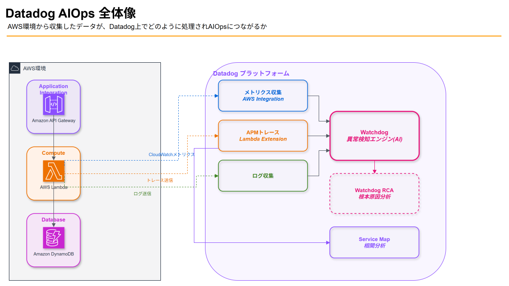

AWS環境側は、演習1で構築するAPI Gateway → Lambda → DynamoDBというリクエストフローです。Lambdaから3種類のテレメトリ(メトリクス・トレース・ログ)がそれぞれ別の経路でDatadogに送られ、Datadog側ではそれらを横断的に学習するWatchdogが異常を検知し、根本原因分析(RCA)や、APMトレースから構築されるService Map(相関分析)へとつながっていきます。

Datadog自体がAIOpsを実現するのではなく、**監視対象(今回はAWSサーバーレスシステム)から集めたデータをDatadogに渡すことで初めてAIOpsの機能が働く**、という関係性を理解しておくことが重要です。

---

## 2. ハンズオンの概要

このハンズオンで構築・監視するアーキテクチャの全体像は以下の通りです。①〜③がリクエストの実処理フロー、④〜⑥がDatadogへのテレメトリ収集フローです。

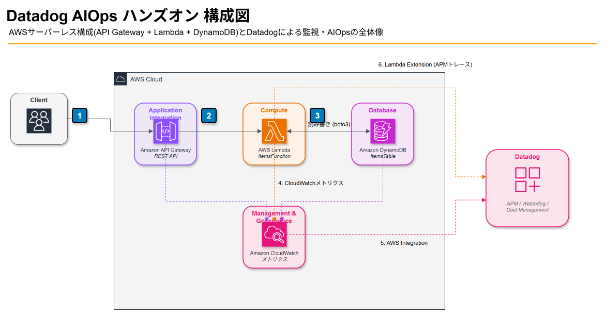

### 想定環境・所要時間

| 項目 | 内容 |
|---|---|
| 想定読者 | Datadog完全初心者(AWSの基本操作は経験済み) |
| 使用するDatadogプラン | 14日間無料トライアル(APM・Watchdog等フル機能が必要なため) |
| 使用するAWSリソース | API Gateway、Lambda(Python 3.12)、DynamoDB |
| 必要なツール | AWS CLI、AWS SAM CLI、Node.js(datadog-ci用)、GitBash |
| 所要時間目安 | 約2.5〜3時間 |

### ゴールイメージ

このハンズオンを終えると、次のことができるようになっています。

- API Gateway + Lambda + DynamoDBの最小構成サーバーレスAPIをAWS SAMで構築できる
- Datadog AWS Integrationを設定し、CloudWatchメトリクスをDatadogに取り込める
- Datadog Lambda Extensionでサーバーレスアプリの分散トレース(APM)を収集できる
- Service Mapで API Gateway → Lambda → DynamoDB の依存関係を可視化できる
- 意図的に異常を発生させ、**Watchdogによる自動異常検知**と**Watchdog RCAによる根本原因の自動特定**を体験できる
- 異常検知をベースにしたMonitor(アラート)を作成できる

### 学べることの全体像

| 演習 | 学習項目 | 使うDatadog機能 |
|---|---|---|
| 演習1 | サーバーレスAPIの構築 | (Datadog未使用、監視対象を作る) |
| 演習2 | AWSアカウント連携 | AWS Integration、Infrastructure監視 |
| 演習3 | サーバーレスアプリへの計装 | Serverless Monitoring、Lambda Extension |
| 演習4 | 分散トレーシングの確認 | APM、Service Map |
| 演習5 | 異常検知とAI根本原因分析 | Watchdog、Watchdog RCA、Error Tracking |
| 演習6 | アラートの自動化 | Monitors |
| 演習7 | AWS利用料の可視化 | Cloud Cost Management |

### ハンズオンの流れ

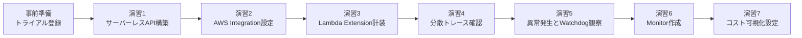
```mermaid
flowchart LR
    A[事前準備<br/>トライアル登録] --> B[演習1<br/>サーバーレスAPI構築]
    B --> C[演習2<br/>AWS Integration設定]
    C --> D[演習3<br/>Lambda Extension計装]
    D --> E[演習4<br/>分散トレース確認]
    E --> F[演習5<br/>異常発生とWatchdog観察]
    F --> G[演習6<br/>Monitor作成]
    G --> H[演習7<br/>コスト可視化設定]
```

---

## 3. ハンズオンの手順

### 事前準備

#### 3-0-1. Datadog 14日間無料トライアルに登録する

[Datadog無料トライアル申込みページ](https://www.datadoghq.com/free-datadog-trial/)にアクセスすると、以下のようなサインアップ画面が表示されます。

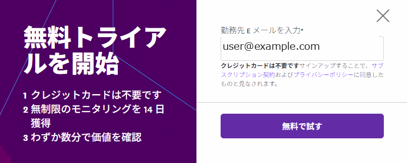

1. 「勤務先Eメールを入力」欄にメールアドレスを入力し、**無料で試す** をクリックしてアカウントを作成する(クレジットカードの入力は不要)
2. サインアップ後、左メニューの **Organization Settings > API Keys** からAPIキーをコピーしておく(演習3で使用)
3. 契約プランはトライアル終了後に自動でPay-As-You-Goへ移行する場合があるため、**トライアル終了予定日をカレンダーに控えておく**こと(不要なら期限内に解約する)

#### 3-0-2. ローカル環境の準備

GitBashで以下を実行し、必要なツールが入っているか確認します。

```bash
aws --version        # AWS CLI
sam --version        # AWS SAM CLI
node -v               # Node.js (datadog-ci用)
```

未インストールのものがあれば、それぞれの公式手順(AWS CLI / [AWS SAM CLI](https://docs.aws.amazon.com/serverless-application-model/latest/developerguide/install-sam-cli.html))に従って導入してください。AWS CLIは `aws configure` で認証情報を設定済みであることを前提とします。

---

### 演習1: サーバーレスAPIをAWS SAMで構築する

**目的**: 監視対象となる、API Gateway + Lambda + DynamoDBの最小構成APIを作る。

#### 手順

作業用ディレクトリを作成し、SAMテンプレートを配置します。

```bash
mkdir -p ~/dd-aiops-handson/src
cd ~/dd-aiops-handson
```

`template.yaml` を作成します。

```yaml
AWSTemplateFormatVersion: '2010-09-09'
Transform: AWS::Serverless-2016-10-31
Description: Datadog AIOps handson - Items API (API Gateway + Lambda + DynamoDB)

Globals:
  Function:
    Timeout: 10
    Runtime: python3.12
    MemorySize: 128

Resources:
  ItemsTable:
    Type: AWS::DynamoDB::Table
    Properties:
      TableName: dd-handson-items
      BillingMode: PAY_PER_REQUEST
      AttributeDefinitions:
        - AttributeName: id
          AttributeType: S
      KeySchema:
        - AttributeName: id
          KeyType: HASH

  ItemsFunction:
    Type: AWS::Serverless::Function
    Properties:
      FunctionName: dd-handson-items-function
      Handler: app.lambda_handler
      CodeUri: src/
      Policies:
        - DynamoDBCrudPolicy:
            TableName: !Ref ItemsTable
      Environment:
        Variables:
          TABLE_NAME: !Ref ItemsTable
      Events:
        CreateItem:
          Type: Api
          Properties:
            Path: /items
            Method: post
        ListItems:
          Type: Api
          Properties:
            Path: /items
            Method: get
        GetItem:
          Type: Api
          Properties:
            Path: /items/{id}
            Method: get

Outputs:
  ApiUrl:
    Description: API Gateway endpoint
    Value: !Sub "https://${ServerlessRestApi}.execute-api.${AWS::Region}.amazonaws.com/Prod"
```

`src/app.py` を作成します。`fail=true` というクエリパラメータを付けると意図的に例外を起こせるようにしておきます(演習5で使用)。

```python
import json
import os
import uuid
import boto3

TABLE_NAME = os.environ["TABLE_NAME"]
dynamodb = boto3.resource("dynamodb")
table = dynamodb.Table(TABLE_NAME)


def lambda_handler(event, context):
    method = event.get("httpMethod")
    query = event.get("queryStringParameters") or {}

    # Watchdog異常検知デモ用: ?fail=true を付けると強制的に例外を起こす
    if query.get("fail") == "true":
        raise Exception("Intentional failure for Watchdog demo")

    if method == "POST":
        body = json.loads(event.get("body") or "{}")
        item_id = str(uuid.uuid4())
        item = {"id": item_id, "name": body.get("name", "no-name")}
        table.put_item(Item=item)
        return _response(201, item)

    if method == "GET":
        path_params = event.get("pathParameters") or {}
        if path_params and "id" in path_params:
            resp = table.get_item(Key={"id": path_params["id"]})
            item = resp.get("Item")
            if not item:
                return _response(404, {"message": "not found"})
            return _response(200, item)
        resp = table.scan()
        return _response(200, resp.get("Items", []))

    return _response(400, {"message": "unsupported method"})


def _response(status_code, body):
    return {
        "statusCode": status_code,
        "headers": {"Content-Type": "application/json"},
        "body": json.dumps(body),
    }
```

ビルドとデプロイを行います。

```bash
sam build
sam deploy --guided
```

`sam deploy --guided` では以下のように回答します(スタック名やリージョンは任意で構いません)。

- Stack Name: `dd-aiops-handson`
- AWS Region: 利用したいリージョン(例: `ap-northeast-1`)
- Confirm changes before deploy: `Y`
- Allow SAM CLI IAM role creation: `Y`
- 残りはデフォルトのままEnter

> **注意**: このあと `ItemsFunction has no authentication. Is this okay?` という確認が**エンドポイントの数だけ(3回)**表示されます。これはSAM CLIが「認証なしの公開APIをデプロイしようとしている」ことを警告するセキュリティチェックで、バグではありません。今回は学習用途で認証を組み込んでいないため、3回とも `y` と回答してください。1回でも無回答(Enterのみ)で `N` 扱いになると `Error: Security Constraints Not Satisfied!` でデプロイが中断されます。

デプロイ完了後、出力される `ApiUrl` の値を控えておきます。

#### 動作確認

```bash
API_URL="<デプロイ後に表示されたApiUrlの値>"

# アイテム作成
curl -X POST "$API_URL/items" -d '{"name":"first item"}'

# 一覧取得
curl "$API_URL/items"
```

✅ **確認ポイント**: POSTでアイテムが作成され、GETで一覧に表示されればOKです。

#### ここで学んだこと

AWS SAMで、API Gateway・Lambda・DynamoDBが連携する最小構成のサーバーレスAPIを構築しました。この時点ではまだDatadogとは一切連携していません。

---

### 演習2: Datadog AWS Integrationを設定する

**目的**: DatadogにAWSアカウントを連携し、CloudWatch経由でAPI GatewayやDynamoDBのメトリクスを取り込めるようにする。

#### 手順

トライアル登録直後は、以下のようなオンボーディングウィザードが表示されます。

1. 「What would you like to monitor first?」画面が出たら **Infrastructure & backend applications** を選択する(今回はAPI Gateway/Lambda/DynamoDBというバックエンドリソースが対象のため)
2. 「How do you want to monitor your Infrastructure & backend applications?」画面が出たら **Add your Cloud Provider** を選択する(EC2ホストを使わないため、Agentインストール導線の **Install the Datadog Agent** は選ばない)
3. AWSを選択すると、以下のようなCloudFormationセットアップ画面が表示される

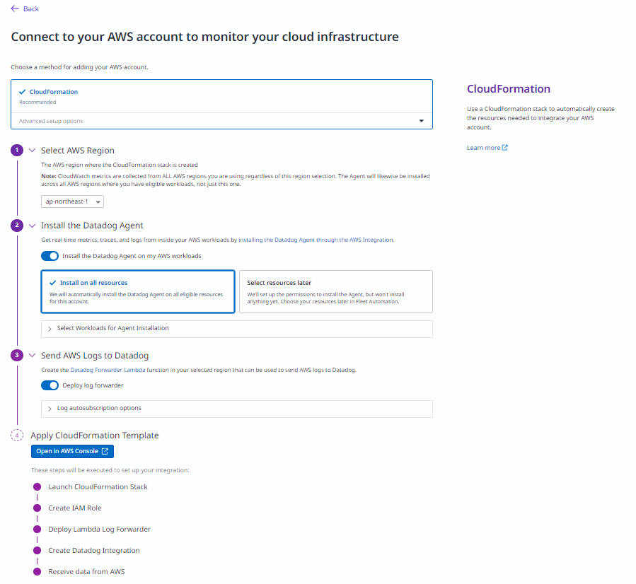

   - **Select AWS Region**: SAMでデプロイしたリージョン(例: `ap-northeast-1`)を選択する。CloudWatchメトリクス自体は選択リージョンに関わらず全リージョンから収集される
   - **Install the Datadog Agent**: **トグルをOFFにする**。今回はEC2を使わないため不要な設定。ONのまま「Install on all resources」を選ぶと、このAWSアカウント内にある**このハンズオンと無関係な既存EC2インスタンス**にまでAgentが自動インストールされてしまうため注意する
   - **Send AWS Logs to Datadog**: ONのままで問題ない(任意。Datadog Forwarder Lambdaが1つ作成されるだけで既存リソースへの影響はない)
   - **Apply CloudFormation Template**: **Open in AWS Console** をクリックする
4. AWSコンソールでCloudFormationのスタック作成画面が開く(パラメータは自動入力される)。内容を確認して **Create stack** を実行する。このテンプレートは、DatadogがAssumeRoleでメトリクスを読み取るためのIAMロールを作成するだけで、こちらのAWSリソースには変更を加えない
5. スタック作成が完了(数分程度)したら、Datadog側の画面に戻り連携完了を確認する

詳細は公式ガイド([Getting Started with AWS](https://docs.datadoghq.com/getting_started/integrations/aws/))を参照してください。

#### デプロイされるCloudFormationスタックの中身

AWSコンソールの **CloudFormation > スタック** を開くと、以下のように4つのネストされたスタックが作成されていることが確認できます。

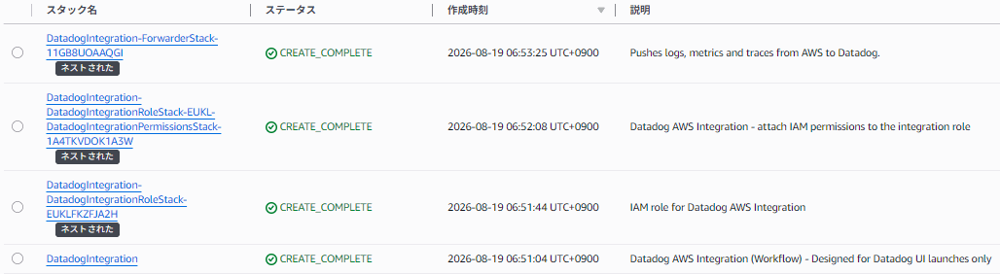

| スタック名 | 役割 |
|---|---|
| `DatadogIntegration`(親スタック) | Datadog UIから起動される、全体を統括するワークフロー用のトップレベルスタック。他の3つのスタックをネストして呼び出す |
| `DatadogIntegration-DatadogIntegrationRoleStack-*` | Datadogが自分のAWSアカウントから**AssumeRole**するためのIAMロール本体を作成する |
| `DatadogIntegration-DatadogIntegrationRoleStack-*-DatadogIntegrationPermissionsStack-*` | 上記IAMロールに、CloudWatchメトリクスの読み取りなど**実際の権限(IAMポリシー)をアタッチする** |
| `DatadogIntegration-ForwarderStack-*`(説明: "Pushes logs, metrics and traces from AWS to Datadog") | 演習2の設定で「Send AWS Logs to Datadog」をONにした場合に作成される、**Datadog Forwarder Lambda関数**。S3やCloudWatch LogsのログをDatadogへ転送する役割を持つ |

いずれも `CREATE_COMPLETE` になっていればセットアップは正常に完了しています。ポイントは、**IAMロール(権限の入れ物)とIAMポリシー(実際の権限内容)が別スタックに分かれている**ことと、Forwarderスタックは「ログ転送」専用であり、メトリクス収集(AssumeRoleによるCloudWatch読み取り)とは別の仕組みで動いている、という点です。

#### DatadogがAWSアカウントにアクセスする仕組み

先ほど作成されたIAMロールを使って、Datadogは実際にどうやってこちらのAWSアカウントのメトリクスを読みに来るのでしょうか。Datadogはアクセスキーのような**長期的な認証情報を一切受け取りません**。代わりに、AWSの推奨パターンである**クロスアカウントIAMロール(AssumeRole)**という仕組みを使っています。

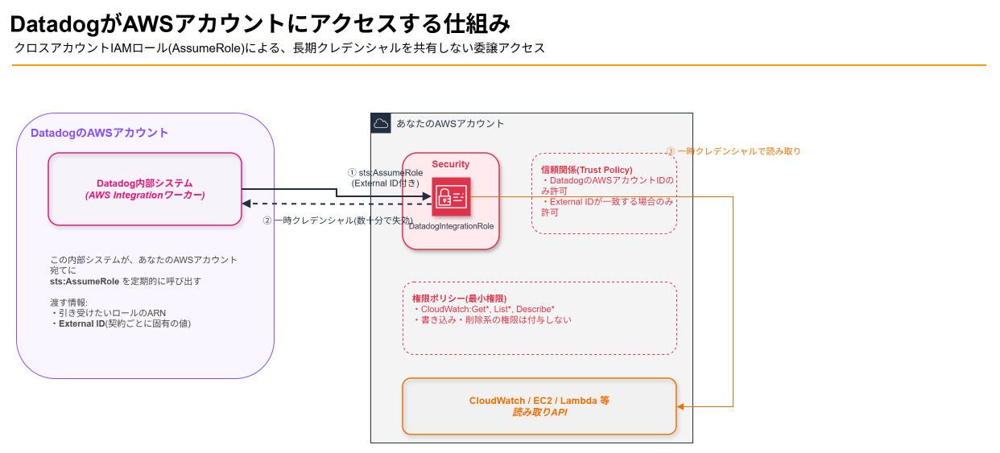

1. **Datadog自身が保有するAWSアカウント**内の内部システムが、こちらのAWSアカウントに向けて `sts:AssumeRole` を呼び出す。このとき、契約ごとに固有の **External ID** も一緒に渡す
2. こちらのAWSアカウント内の `DatadogIntegrationRole` は、信頼関係(Trust Policy)に登録された「DatadogのAWSアカウントID」と「External ID」の両方が一致した場合のみ、これを許可する
3. 許可されると、**数十分で失効する一時的なクレデンシャル**がDatadog側に払い出される
4. Datadogはその一時クレデンシャルを使い、`DatadogIntegrationRole` にアタッチされた**読み取り専用の権限ポリシー**の範囲内でCloudWatch等のメトリクスを取得する

**External IDが必要な理由**は、「DatadogのAWSアカウントID」だけを信頼関係に登録すると、Datadogの他の顧客のアカウントからも同じロールを引き受けられてしまう可能性がある(confused deputy problem)ためです。契約ごとに異なるExternal IDを追加で要求することで、「自分が設定した連携」からのアクセスだけに限定できます。

この仕組みにより、①長期的な認証情報が漏洩するリスクがない、②いつでもロールの削除・権限変更で連携を停止できる、③権限は読み取り専用に限定されている、という安全性が担保されています。

#### 動作確認

連携完了から約10分後、Datadogの **Infrastructure > AWS overview dashboard** を開きます。

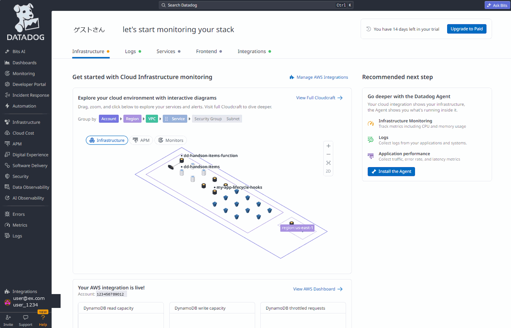

Cloudcraft機能により、連携したAWSアカウントの構成が自動で図式化され、`dd-handson-items-function`(演習1のLambda)や `dd-handson-items`(DynamoDBテーブル)が検出されていることを確認できます。画面をさらにスクロールすると、DynamoDBのメトリクスやホスト一覧が表示されます。

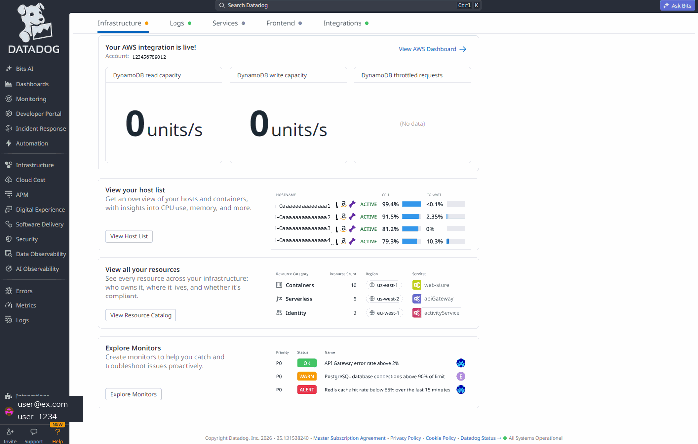

✅ **確認ポイント**: API Gateway・DynamoDB・Lambdaに関するCloudWatchメトリクス(リクエスト数、レイテンシ、スロットリング等)が表示されていればOKです。

> **補足**: DynamoDBの `read/write capacity` が `0 units/s` と表示されるのは正常です。今回のテーブルは `BillingMode: PAY_PER_REQUEST`(オンデマンドモード)で作成しており、このメトリクスはプロビジョンドキャパシティモード向けのものだからです。
>
> また「View your host list」にAWSアカウント内のEC2インスタンスが表示されることがあります。これは演習2で「Install the Datadog Agent」をOFFにしていても、**AWS Integration自体がアカウント内のリソースをCloudWatch経由で可視化する**ため起こる正常な挙動です(Agentプロセスが自動インストールされたわけではありません)。もし今回のハンズオンと無関係なEC2インスタンスが表示された場合は、それらが元々AWSアカウントに存在していたリソースだと考えられます。
>
> なお「View all your resources」「Explore Monitors」に表示されるPostgreSQL/Redisなどの項目は、今回のハンズオンには存在しないサービスです。これはDatadogが機能紹介のために表示するサンプル(デモ)データです。

#### ここで学んだこと

Datadogは自分でエージェントを常駐させなくても、AWS Integrationを通じてCloudWatchメトリクスを継続的に取り込めます。ただしこの時点では、リクエストがどのようにAPI Gateway→Lambda→DynamoDBと流れたかという「トレース」はまだ見えません。

---

### 演習3: Datadog Lambda ExtensionでAPM計装を行う

**目的**: LambdaにDatadogのトレーシング機能を組み込み、分散トレース・拡張メトリクス・ログを収集できるようにする。

#### 手順

Datadog CLIをインストールします。

```bash
npm install -g @datadog/datadog-ci @datadog/datadog-ci-plugin-lambda
```

DatadogのAPIキーとサイトを環境変数に設定します(トライアル登録時にAPIキーを控えていない場合は、Organization Settings > API Keysから取得してください)。

> **重要**: `DATADOG_SITE` は**AWSのリージョン(東京か米国かなど)とは無関係**です。トライアル登録時にDatadog側が割り当てた契約サイトに依存し、`datadoghq.com`(US1)とは限りません。ログイン後のブラウザのURLを確認し(例: `https://ap1.datadoghq.com/...` なら `ap1.datadoghq.com`、`https://app.datadoghq.com/...` なら `datadoghq.com`)、**実際のURLに表示されているサイトをそのまま指定してください**。ここを間違えると、APIキー自体は正しくても「Access denied. Please verify that your API key is valid.」というエラーで計装が失敗します(APIキーはサイトごとに個別管理されているため)。

```bash
export DATADOG_API_KEY="<Datadogで取得したAPIキー>"
export DATADOG_SITE="<実際のログインURLに表示されているサイト。例: ap1.datadoghq.com>"
```

> **補足**: 上記はテスト・学習用の簡易設定です。本番運用ではAPIキーを平文の環境変数に置かず、AWS Secrets Manager経由(`DATADOG_API_KEY_SECRET_ARN`)で渡すことが推奨されています。

Lambda関数にDatadogの計装を適用します。レイヤーバージョン(`-v`/`-e`)は更新頻度が高いため、実行前に[Python向けインストールガイド](https://docs.datadoghq.com/serverless/aws_lambda/instrumentation/python/)で最新値を確認してください。

このコマンドが実際にLambda関数の何を書き換えるのかを、実行前に図で確認しておきましょう。

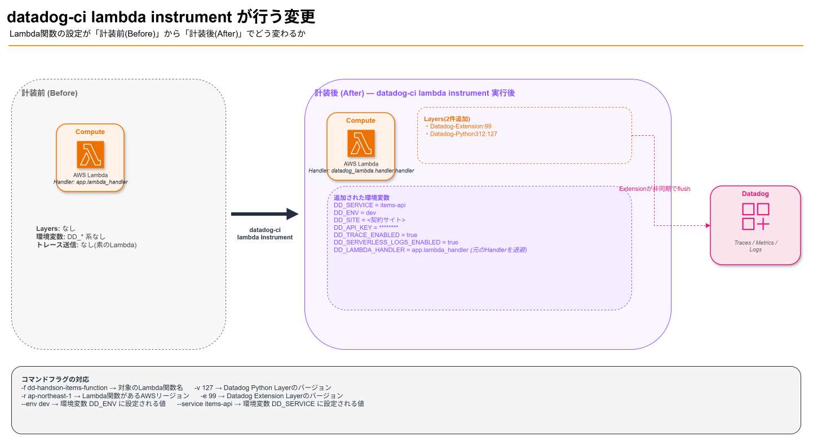

- **Handler**: `app.lambda_handler` から `datadog_lambda.handler.handler` に差し替わる(元のHandlerは `DD_LAMBDA_HANDLER` 環境変数に退避され、内部で呼び出される)
- **Layers**: `Datadog-Extension`(トレース等の送信を担うサイドカー)と `Datadog-Python312`(トレーシングライブラリ)の2つが追加される
- **環境変数**: `DD_SERVICE`・`DD_ENV`・`DD_SITE`・`DD_API_KEY` など、Datadogへの接続に必要な値が追加される
- **実行時の動き**: Lambda関数のコード自体は変更されないが、Extensionが裏側でトレース・メトリクス・ログを非同期にDatadogへ送信(flush)するようになる

```bash
datadog-ci lambda instrument \
  -f dd-handson-items-function \
  -r ap-northeast-1 \
  -v <最新のPythonレイヤーバージョン> \
  -e <最新のExtensionレイヤーバージョン> \
  --env dev \
  --service items-api
```

このコマンドは既存のLambda関数の設定(環境変数・レイヤー)を書き換えるだけで、コードの再デプロイは不要です。

#### 動作確認

演習1と同じcurlコマンドでAPIを何度か呼び出し、トラフィックを発生させます。

```bash
for i in $(seq 1 10); do curl -X POST "$API_URL/items" -d "{\"name\":\"item-$i\"}"; sleep 1; done
```

Datadogの左メニューから **APM** を開き、上部タブの **Traces** を選択します。

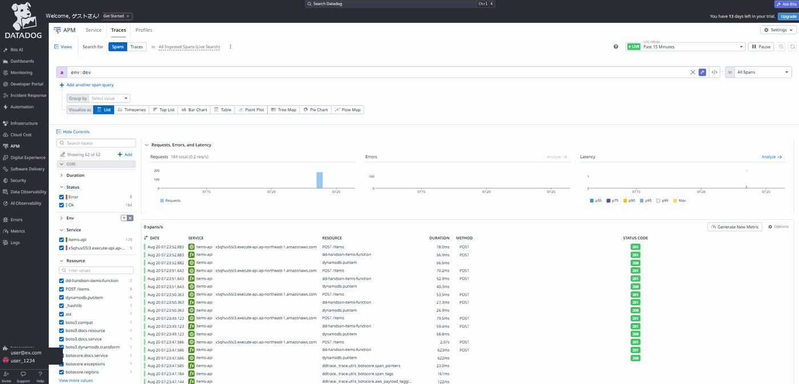

✅ **確認ポイント**: `items-api` サービスのトレースが表示され、各トレースの中に `dd-handson-items-function` の実行区間(span)が含まれていればOKです。上の例では、1回のリクエストが `POST /items`(API Gateway)→`dd-handson-items-function`(Lambda)→`dynamodb.putitem`(DynamoDB)という3段のスパンとして記録されています。

> **つまずきやすいポイント**: Lambdaのログに `Request was denied by Datadog: Access denied. Please verify that your API key is valid.` と出てトレースが届かない場合、APIキーではなく **`DATADOG_SITE` の設定ミス**が原因であることが多いです。`DATADOG_SITE` はAWSのリージョンとは無関係で、ログイン中のブラウザのURL(例: `https://ap1.datadoghq.com/...` なら `ap1.datadoghq.com`)に合わせて設定する必要があります。詳しくは4章のトラブルシューティングを参照してください。

#### ここで学んだこと

Datadog CLIによって、コードを変更せずに既存のLambda関数へ計装(トレーシング用のレイヤーと環境変数)を追加できました。これによりAPMが有効化され、リクエスト単位の詳細な処理時間が可視化されるようになります。

---

### 演習4: 分散トレーシングとService Mapで依存関係を確認する

**目的**: API Gateway → Lambda → DynamoDBの一連の処理がどう繋がっているかを可視化し理解する。

#### 手順とデータの流れ

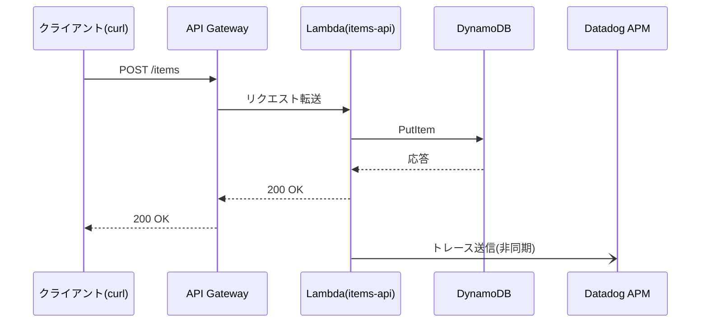
```mermaid
sequenceDiagram
    participant Client as クライアント(curl)
    participant APIGW as API Gateway
    participant Lambda as Lambda(items-api)
    participant DDB as DynamoDB
    participant DD as Datadog APM

    Client->>APIGW: POST /items
    APIGW->>Lambda: リクエスト転送
    Lambda->>DDB: PutItem
    DDB-->>Lambda: 応答
    Lambda-->>APIGW: 200 OK
    APIGW-->>Client: 200 OK
    Lambda-)DD: トレース送信(非同期)
```

1. Datadogの **APM > Traces** で、演習3で発生させたトレースの中から `POST /items` の行(一番上の親スパン)を1つクリックする
2. トレース詳細パネルが開いたら、上部の **Flame Graph** タブ(デフォルトで選択されています)を確認する

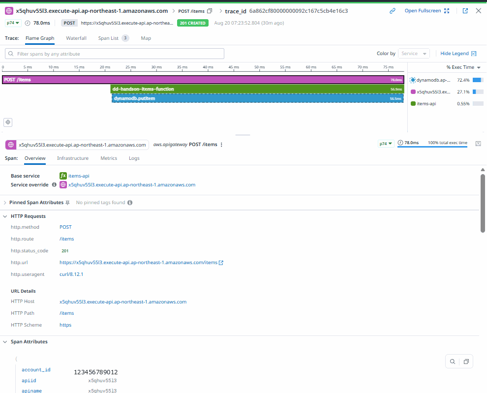

3. `POST /items`(API Gateway) → `dd-handson-items-function`(Lambda) → `dynamodb.putitem`(DynamoDB)という3段のスパンが、親子関係(ネスト)として時間軸上に表示されていることを確認する。上の例では全体78.0msのうち、DynamoDBへの書き込み(`dynamodb.putitem`)が56.5msを占めており、ここがボトルネックになっていることが一目で分かる
4. 左メニューの **APM > Service Map** を開く

#### 動作確認

✅ **確認ポイント**: Service Map上に `items-api` を中心として、API GatewayとDynamoDBがノードとして接続された図が表示されていればOKです。

#### ここで学んだこと

分散トレーシングにより、1件のリクエストがどのリソースを経由し、どこで時間がかかっているかを一目で追跡できるようになりました。Service Mapはこれを集計し、システム全体の依存関係図として自動生成したものです。この依存関係情報こそが、後述するWatchdog RCAが根本原因を特定する際の重要な手がかりになります。

---

### 演習5: 異常を発生させ、Watchdogの異常検知とRCAを観察する

**目的**: AIOpsの中核機能であるWatchdogが、実際にどのように異常を検知し、根本原因を推定するのかを体験する。

#### 手順

まず正常な状態のベースラインをWatchdogに学習させるため、数分間、軽いトラフィックを流し続けます。

```bash
for i in $(seq 1 30); do curl -s -o /dev/null "$API_URL/items"; sleep 5; done
```

続いて、演習1で仕込んでおいた `fail=true` パラメータを使い、エラーを集中的に発生させます。

```bash
for i in $(seq 1 50); do curl -s -o /dev/null "$API_URL/items?fail=true"; done
```

#### 確認ポイント1: Error Tracking

左メニューの **Errors** を開きます(APMのすぐ下にある項目です)。

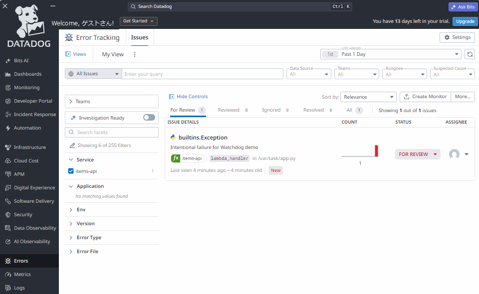

✅ `Intentional failure for Watchdog demo` の例外(`builtins.Exception`)がグルーピングされ、発生件数や発生元(`items-api` / `lambda_handler` / `app.py`)が表示されていることを確認します。

#### 確認ポイント2: Watchdog Alerts

左メニューの **Monitoring > Watchdog** を開きます。トライアル登録直後は「Watchdog is calibrating...」と表示され、しばらくは何も検出されないことがあります(Watchdogが正常な状態を学習している期間のため)。数十分待ってから再度開いてみてください。

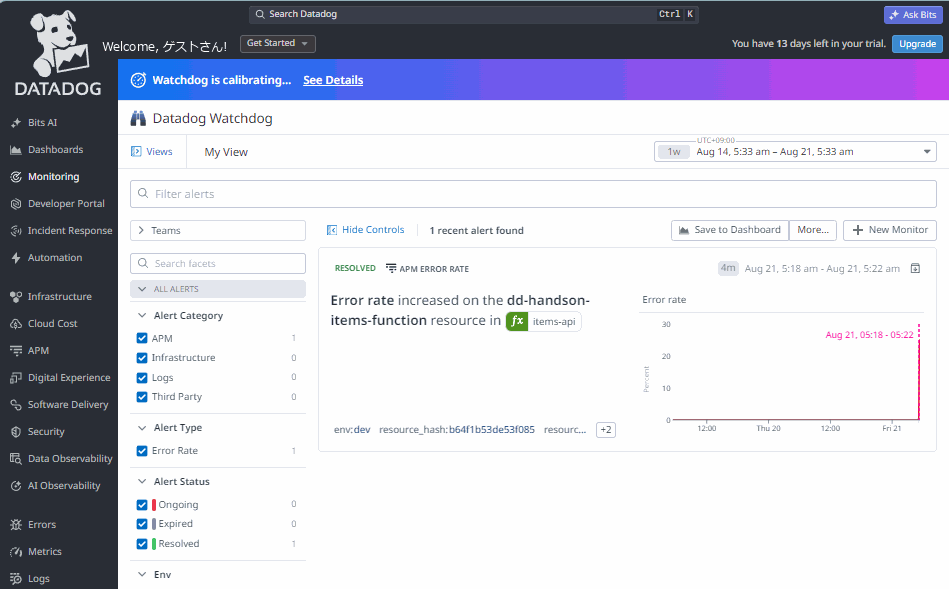

✅ `items-api` の `dd-handson-items-function` リソースでエラー率が上昇したことを示すアラートが自動的に生成されていればOKです。これは、しきい値をこちらが設定していないにもかかわらず、Watchdogが正常時のベースラインとの乖離を自ら学習・検知した結果です。上の例ではエラーバーストが短時間で収まったため、ステータスは既に `RESOLVED`(解決済み)になっています。

#### 確認ポイント3: Watchdog RCA

演習5の確認ポイント2で生成されたWatchdogアラートのカードをクリックすると、根本原因分析(RCA)の詳細画面が開きます(トラフィック量や有効化タイミングによっては表示までに時間を要する、またはトライアル環境の学習期間が短く検出されないことがあります)。

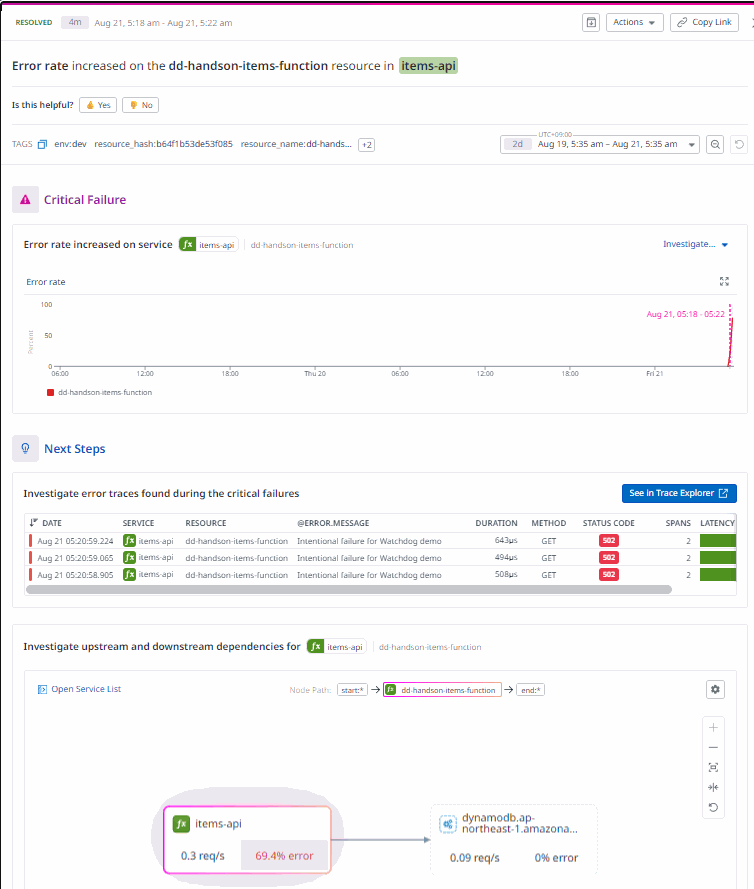

✅ 表示された場合、以下の要素が示されていることを確認してください。

| セクション | 今回の例での内容 |
|---|---|
| **Critical Failure**(臨界障害) | `items-api` の `dd-handson-items-function` リソースでエラー率が上昇したことが明示される |
| **Next Steps > Investigate error traces**(根本原因の手がかり) | 実際に失敗したトレースが一覧表示される。今回は `Intentional failure for Watchdog demo` という例外メッセージと `502` ステータスコードが並び、根本原因(コード内で発生した例外)を即座に特定できる |
| **Next Steps > Investigate upstream and downstream dependencies**(影響範囲) | `items-api`(エラー率69.4%)→ `dynamodb`(エラー率0%)というミニ依存関係図が表示される。**下流のDynamoDB側は正常**であることが分かり、障害がLambda内に留まっていて他サービスへ波及していないと判断できる |

しきい値も調査対象も一切指定していないのに、Watchdogが「失敗したトレースの特定」と「影響範囲(下流は無事)の特定」を自動でまとめてくれている点が、AIOpsの実務的な価値です。

#### ここで学んだこと

WatchdogはAPM・ログ・インフラメトリクスなど複数のシグナルを横断的に学習し、人がしきい値を設定しなくても異常を自動検知します。さらにWatchdog RCAは、検知した異常の背後にある根本原因・影響範囲までを自動で推定します。これがDatadogにおけるAIOpsの核心部分です。

---

### 演習6(任意): 異常検知をベースにしたMonitorを作成する

**目的**: 検知した異常を継続的に監視し、アラート通知につなげる仕組みを作る。

#### 手順

1. **Monitors > New Monitor > APM** を選択する
2. Service: `items-api`、Metric: `Error Rate` を選択する
3. Alert conditionで、固定しきい値ではなく **Anomaly Alert**(異常検知アルゴリズム)を選択する
4. 通知先(Notify)は学習用のため自分のメールアドレスのみでよい
5. Monitorを保存する(**Create and Publish**)

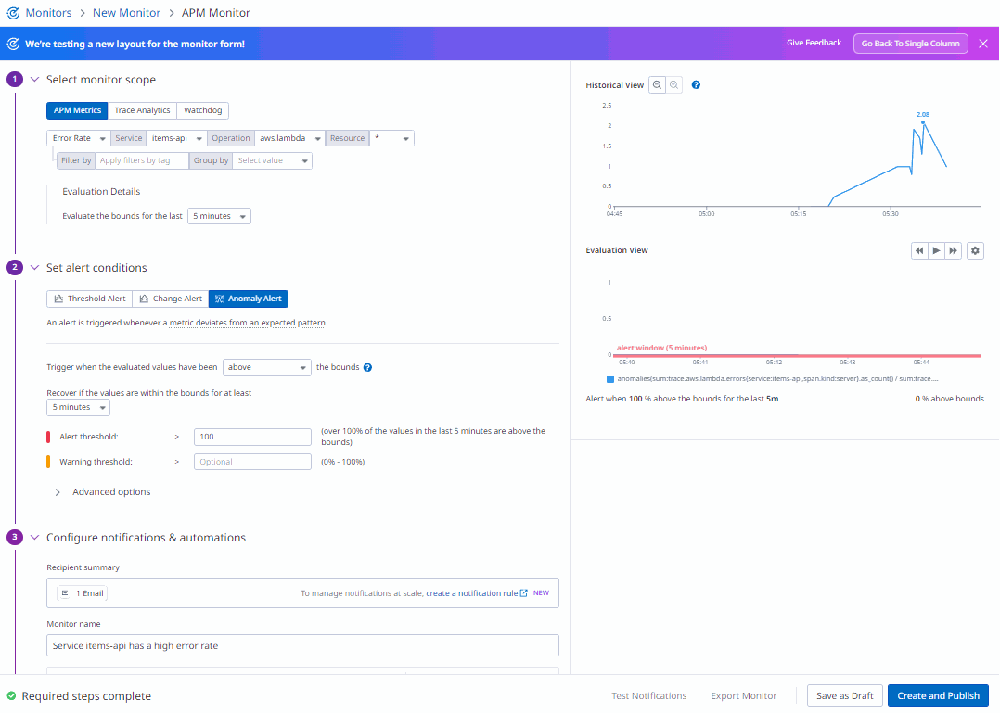

#### 動作確認

保存すると、Monitorのステータス画面が表示されます。

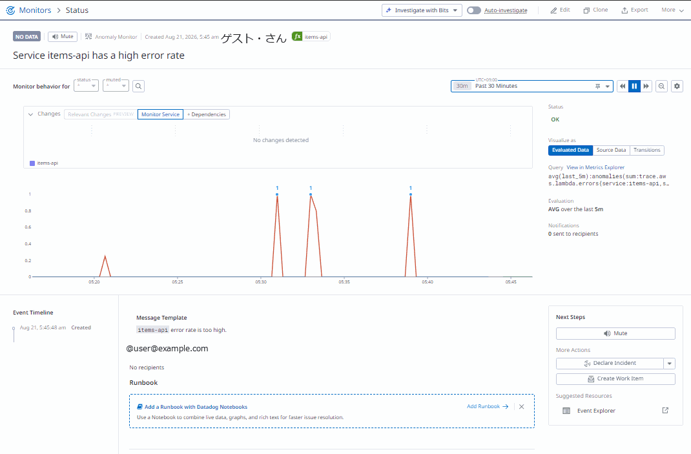

✅ Monitorのステータス画面で、演習5で発生させたエラーの波形(スパイク)が表示されていればOKです。上の例では、`avg(last_5m):anomalies(...)` というクエリでAnomaly Detectionが評価され、過去のエラーバーストが正しく検知対象として記録されています。

#### ここで学んだこと

固定しきい値(例:「エラー率が5%を超えたら通知」)ではなく、Watchdogと同様の異常検知アルゴリズムをMonitorに組み込むことで、トラフィックパターンの変化に応じた柔軟なアラートを設定できます。

---

### 演習7: Cloud Cost ManagementでAWS利用料を可視化する

**目的**: パフォーマンス監視だけでなく、AWSの利用料(コスト)もDatadog上で横断的に可視化できることを体験する。

> **注意**: この演習はAWSの請求データ(Cost and Usage Report)を経由するため、**設定後にデータが反映されるまで48〜72時間かかります**。他の演習と違い即座には確認できないので、時間のある時に設定だけ済ませておき、翌々日以降に結果を確認するとよいでしょう。演習2で設定したAWS Integrationが前提になります。

#### 手順

1. AWSマネジメントコンソールで、AWS管理アカウント(Organizationsのmanagement account)から **Billing and Cost Management > Data Exports** を開き、新規にCost and Usage Report(CUR 2.0)を作成する
   - エクスポート名・出力先S3バケットを指定する(バケットは新規作成でよい)
   - 出力パスにプレフィックスを付ける場合、`/cost/` のように先頭または末尾にスラッシュが付く形式は非対応(S3パスとしては `cost/hourly` のような中間スラッシュも許容されるが、**後述のCloudFormationスタック作成でエラーになるため、学習用途では `cost-hourly` のようにスラッシュを含まない値にしておくことを強く推奨**)
   - **ファイル形式・圧縮タイプ**: Datadogは **Parquet**、または **CSV + GZIP** をサポートしている(Parquetの方がクエリ性能・圧縮率の面で有利)
   - **粒度(Time granularity)**: **Hourly(時間単位)** を選択する
   - **リソースID**: 詳細設定内の **Include resource IDs** を必ず有効にする(個別リソース単位でコストを追跡するために必要。見落としやすい項目なので注意)
2. Datadogの左メニューから **Cloud Cost** を開き、**Providers > Configure AWS Account** に進む
3. **Use connected AWS account**(演習2で連携済みのAWSアカウントを流用する)を選択し、対象のAccountを選ぶ

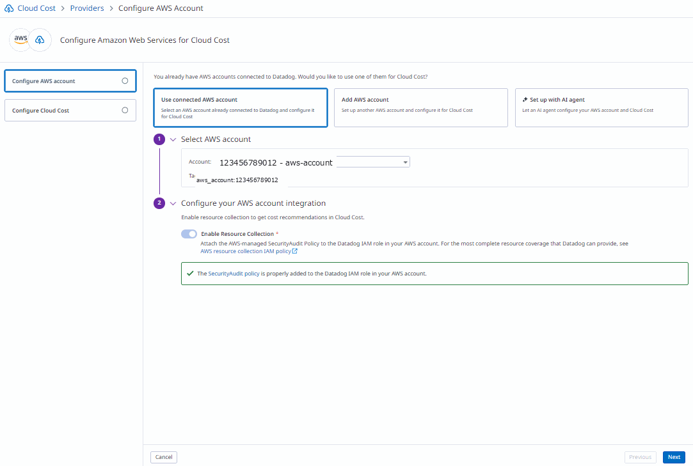

4. **Enable Resource Collection** をONにする。これにより、AWS管理のSecurityAuditポリシーが、演習2で作成済みのDatadog用IAMロールに自動でアタッチされ、個別リソース単位でのコスト分析が可能になる(緑色のチェックマークで「SecurityAudit policy is properly added」と表示されれば成功)
5. 次の画面で、手順1で作成したS3バケット名・リージョン・エクスポートパスプレフィックス・エクスポート名を入力する。**「Create S3 Bucket」は `No`(既存バケットを使う)に設定し、Bucket Regionを実際のバケットのリージョン(例: `ap-northeast-1`)に変更する**(デフォルトでは新規作成モードになっており、リージョンが `us-east-1` に固定されている)
6. **Create CloudFormation Stack** をクリックし、AWSコンソール側でスタックを作成する。IAMロールの選択画面が出た場合は「No role selected」のままで問題ない
7. スタック作成が完了したら、Datadogの画面に戻ってチェックボックスにチェックを入れ、**Add Account** をクリックする

成功すると、以下のような画面が表示されます。

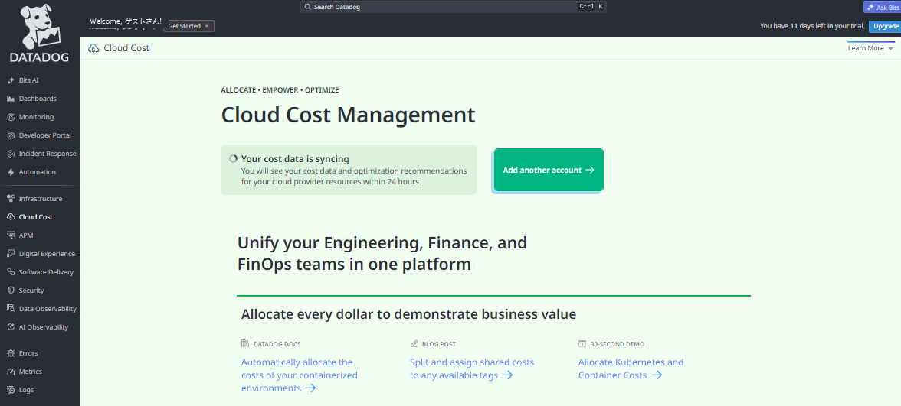

「Your cost data is syncing」と表示されていれば、AWSアカウントの追加自体は成功しています。この画面の「within 24 hours」はリソースの同期(インベントリ情報)に関する目安であり、実際のコストデータ(CUR経由)が反映されるまでは前述の通り**最大48〜72時間**かかる点に注意してください。

詳細は公式ガイド([Cloud Cost Management > AWS](https://docs.datadoghq.com/cloud_cost_management/setup/aws/))を参照してください。

#### 動作確認

設定から48〜72時間後、Datadogの **Infrastructure > Cloud Costs > Cost Analytics** を開きます。

✅ **確認ポイント**: サービス別(Lambda、API Gateway、DynamoDB等)・タグ別にAWS利用料の内訳が時系列グラフで表示されていればOKです。演習1〜6で使ったリソース(`dd-handson-*`)のコストも確認できます。

#### ここで学んだこと

Cloud Cost Managementにより、パフォーマンスメトリクス・トレース・ログと同じDatadog上で、AWS利用料もタグ単位で横断的に分析できるようになりました。「このサービスは異常検知でアラートが多いうえにコストも増加している」といった、パフォーマンスとコストを掛け合わせた分析はAIOps運用の実務でよく使われる視点です。

---

### クリーンアップ(後片付け)

ハンズオンで作成したリソースをそのままにしておくと、AWS側の課金や、Datadogトライアル終了後の整理漏れにつながります。学習が終わったら、以下の手順で後片付けをしてください。

#### 手順の流れ

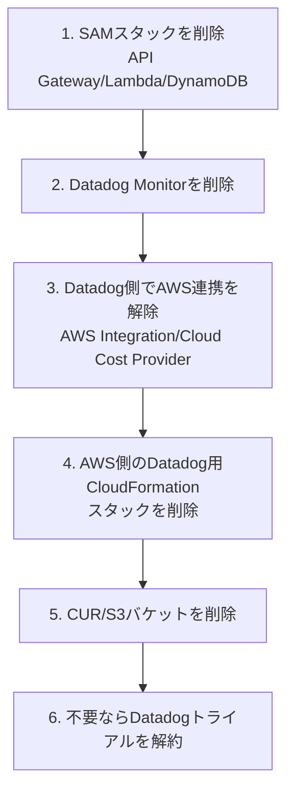
```mermaid
flowchart TD
    A[1. SAMスタックを削除<br/>API Gateway/Lambda/DynamoDB] --> B[2. Datadog Monitorを削除]
    B --> C[3. Datadog側でAWS連携を解除<br/>AWS Integration/Cloud Cost Provider]
    C --> D[4. AWS側のDatadog用CloudFormation<br/>スタックを削除]
    D --> E[5. CUR/S3バケットを削除]
    E --> F[6. 不要ならDatadogトライアルを解約]
```

先にDatadog側から見えるデータ(監視対象のAWSリソース)を消してしまうと混乱しやすいため、**「監視対象 → Datadog側の設定 → Datadog用の裏側のリソース」という順番**で消していくのがおすすめです。

#### 1. SAMスタックの削除(演習1で作成したリソース)

SAMプロジェクトのフォルダ(`~/dd-aiops-handson`)で以下を実行します。API Gateway・Lambda・DynamoDBテーブル・IAMロールがまとめて削除されます。

```bash
sam delete --stack-name dd-aiops-handson
```

確認プロンプトが出たら `y` で進めてください。

#### 2. Datadog Monitorの削除(演習6で作成したもの)

Datadogの **Monitors** から、演習6で作成した `Service items-api has a high error rate` を開き、**More > Delete** で削除します。

#### 3. DatadogでAWS連携を解除する

- **Integrations > AWS** から、演習2で連携したAWSアカウントを削除する
- **Cloud Cost > Providers** から、演習7で連携したAWSアカウントを削除する

いずれも「Datadog側の設定を消すだけ」で、AWS側のIAMロールやCloudFormationスタック自体は残ったままになる点に注意してください(次の手順で削除します)。

#### 4. AWS側のCloudFormationスタックを削除する

AWSコンソールの **CloudFormation > スタック** を開き、以下を削除します。

| スタック名 | 対応する演習 |
|---|---|
| `DatadogIntegration`(親スタック。ネストされた `ForwarderStack`/`RoleStack`/`PermissionsStack` も連動して削除される) | 演習2 |
| 演習7で作成したCloud Cost Management用のスタック | 演習7 |

親スタックを削除すればネストされた子スタックも自動的に削除されます。

#### 5. CURとS3バケットを削除する

- **Billing and Cost Management > Data Exports** から、演習7で作成したCost and Usage Reportのエクスポートを削除する
- 演習7で使ったS3バケットを開き、**中身のオブジェクトをすべて空にしてから**バケット自体を削除する(オブジェクトが残っているとバケット削除に失敗します)

#### 6. Datadogトライアルの解約(継続しない場合)

このハンズオンだけで契約を終える場合は、**Organization Settings > Subscription**(または同様のメニュー)からトライアルを解約してください。何もしないとトライアル終了後に有料プランへ自動移行する場合があるため、事前準備の章で触れた終了予定日を再度確認しておくと安心です。

✅ **確認ポイント**: AWSコンソールの請求ダッシュボードで、`dd-handson-*` という名前のリソースが残っていないこと、CloudFormationスタックが1つも残っていないことを確認できればクリーンアップ完了です。

---

## 4. 習得事項のまとめ

### 触れた要素一覧

| カテゴリ | 触れた機能 |
|---|---|
| AWS連携 | AWS Integration(CloudFormationによるIAMロール作成) |
| サーバーレス計装 | Datadog CLI(`datadog-ci lambda instrument`)、Lambda Extension |
| APM | Traces、Flame Graph、Service Map |
| AIOps | Watchdog(自動異常検知)、Watchdog RCA(根本原因分析) |
| ログ/エラー管理 | Error Tracking |
| アラート | Monitors(Anomaly Detection) |
| コスト管理 | Cloud Cost Management(AWS Cost and Usage Report連携) |

### トラブルシューティング

| 症状 | 原因・対処法 |
|---|---|
| AWS overview dashboardにメトリクスが出ない | Integration設定から反映まで最大10〜15分かかる。時間をおいて再確認する |
| `datadog-ci lambda instrument` が権限エラーになる | ローカルのAWS CLI認証情報にLambda関数の更新権限(`lambda:UpdateFunctionConfiguration`等)が不足している可能性がある |
| Lambdaのログに `Request was denied by Datadog: Access denied. Please verify that your API key is valid.` と出る | `DATADOG_SITE` が実際の契約サイトと一致していないことが原因であることが多い(APIキー自体は正しくても、サイトが違うと拒否される)。ログイン中のブラウザURL(`https://<サイト>/...`)を確認し、正しい値で `DATADOG_SITE` を設定し直して `datadog-ci lambda instrument` を再実行する |
| APM Tracesに何も表示されない | 計装後に一度もリクエストを送っていない、またはLambdaの環境変数`DD_API_KEY`系が反映されていない(計装後は既存のLambda関数の設定が更新されるため、反映を確認する) |
| Watchdogアラートが出ない | トライアル開始直後はベースライン学習期間が短く、異常判定されるまでに時間がかかることがある。数十分〜数時間、定常的にトラフィックを流し続けてから再度エラーを発生させる |
| DynamoDBのメトリクスが見えない | AWS Integrationで対象リージョン・アカウントが正しく選択されているか確認する |
| Cost Analyticsにデータが出ない | CUR設定から48〜72時間が経過していない可能性が高い。時間をおいて再確認する。それでも出ない場合はS3バケットのパスプレフィックス形式(中間スラッシュ)や付与したIAM権限を見直す |
| CloudFormationスタックが `DatadogCCMIAMPolicy` で `CREATE_FAILED`(`The specified value for policyName is invalid...`) | Export Path Prefixに含めた `/`(スラッシュ)がIAMポリシー名の生成に使われており、IAMの命名規則(英数字と `+=,.@_-` のみ)に違反しているのが原因。失敗したスタックを削除し、Export Path Prefixをスラッシュを含まない値(例: `cost-hourly`)に変更してから、AWS側のCUR設定・Datadog側の設定の両方を合わせて作り直す |
| Cloud Cost Management(AWSアカウント設定)でBucket Regionが `us-east-1` に固定され変更できない | ウィザードが新規バケット作成モードになっているのが原因。「Create S3 Bucket」を `No` に切り替えると、既存バケット使用モードになりBucket Regionが編集可能になる |

### 応用・発展

- 今回は単一のLambda関数でしたが、実務では複数のLambda関数・SQS・EventBridgeなどが絡む構成が一般的です。その場合もService Mapとトレースの連結(Span Auto-linking)により、複雑な依存関係を可視化できます
- Terraformを使っている場合は、[terraform-aws-lambda-datadog](https://github.com/DataDog/terraform-aws-lambda-datadog)モジュールでこの演習と同等の計装をコード化できます
- チームで使う場合は、AWS Integrationの設定をCloudFormation StackSetsやControl Tower Account Factory Customizationで複数アカウントに展開する運用が可能です

---

## 5. 今後の学習ロードマップ

優先順位の高い順に、次に学ぶとよいトピックを挙げます。

1. **Log Management連携**: 今回はAPMのみでしたが、Lambdaのログ(CloudWatch Logs)をDatadogに取り込み、ログ・トレース・メトリクスを紐付けた「統一タグ付け」を体験する
2. **Cloud SIEM / Security Monitoring**: AWS環境のセキュリティイベントに対する異常検知・脅威検知の仕組みを学ぶ
3. **Synthetic Monitoring**: 今回構築したAPIに対する定期的な死活監視(合成モニタリング)を設定し、Watchdogとの組み合わせでより早期に異常を検知する仕組みを作る
4. **Bits AI(Datadogの生成AIアシスタント)**: インシデント調査やRCA結果の説明を自然言語で対話的に行える機能を試す

### 参考リンク

- [Serverless Monitoring for AWS Lambda(公式ドキュメント)](https://docs.datadoghq.com/serverless/aws_lambda/)
- [Datadog CLIによるLambda計装ガイド(Python)](https://docs.datadoghq.com/serverless/aws_lambda/instrumentation/python/)
- [Getting Started with AWS Integration](https://docs.datadoghq.com/getting_started/integrations/aws/)
- [AWS Manual Setup Guide](https://docs.datadoghq.com/integrations/guide/aws-manual-setup/)
- [Watchdog RCA(公式ドキュメント)](https://docs.datadoghq.com/watchdog/rca/)
- [Cloud Cost Management > AWS(公式ドキュメント)](https://docs.datadoghq.com/cloud_cost_management/setup/aws/)
- [Datadog Serverless向け分散トレーシングガイド](https://docs.datadoghq.com/serverless/aws_lambda/distributed_tracing/)
- [Datadog無料トライアル申込みページ](https://www.datadoghq.com/free-datadog-trial/)
- [AWS SAM CLI インストールガイド](https://docs.aws.amazon.com/serverless-application-model/latest/developerguide/install-sam-cli.html)
