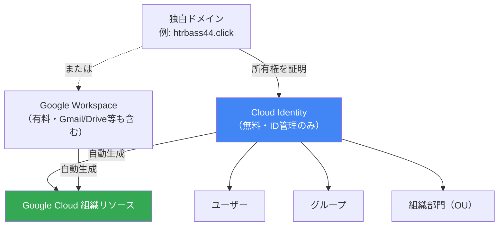
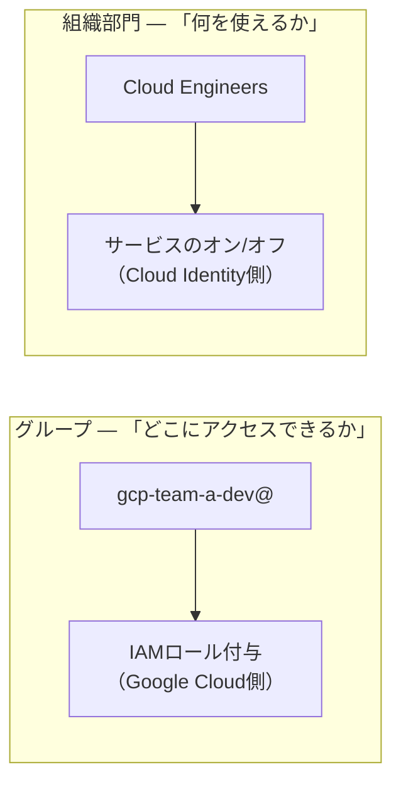
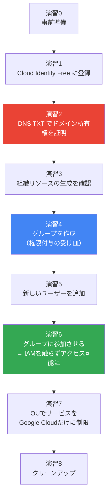
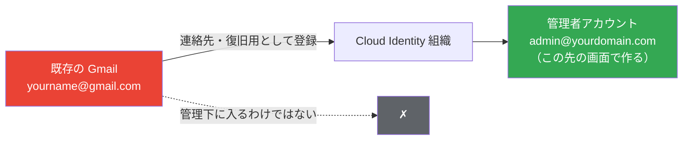
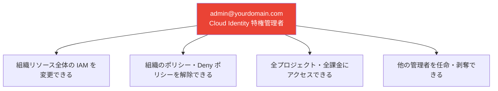
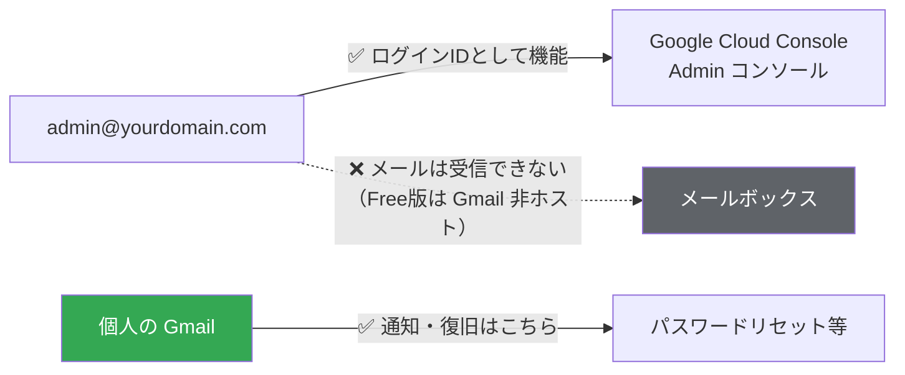

# Cloud Identity Free ハンズオン — ドメインから組織・ユーザー・グループを立ち上げる

> **対象読者**: [Google Cloud 組織払い出しハンズオン](./google-cloud-organization-handson.md) の前提となる「組織リソースそのものをどう作るか」「人（ユーザー）をどう払い出すか」を、実機で一から組み立てたい人。AWS でいう IAM Identity Center（旧 SSO）や AWS アカウントのルートユーザー相当の話。
> **所要時間**: 約 2〜2.5 時間
> **ターミナル**: GitBash（一部演習で使用）
> **前提**: 自分が管理できるドメインが 1 つ必要（取得・DNS設定の手順は [DNS と Route 53 ハンズオン](./dns-route53-handson.md) を参照）

---

## 1. 勉強対象の概要

### 1.1 Cloud Identity とは何か

**Google Cloud の「組織」は、Cloud Identity（または Google Workspace）というドメイン単位の ID 基盤の上に成り立っている。** プロジェクトやフォルダを作る前に、まずこの ID 基盤を用意しないと、Google Cloud の組織リソース自体が存在しない。



**Cloud Identity Free** はこの ID 基盤の無料版で、Gmail・Drive のようなアプリケーション（Workspace）を含まず、**ユーザー・グループ・組織部門の管理機能だけ**を提供する。Google Cloud を使うためだけであれば、これで十分。

### 1.2 なぜ「アカウント作成」ではなく「ドメイン登録」なのか

AWS では IAM ユーザーやルートアカウントを直接作るが、Google Cloud はそうではない。**Google Cloud の組織リソースは API では作れず、Cloud Identity にドメインを登録することで自動的に生成される。** ドメインの所有権を実際に証明する必要があるため、DNS の仕組み（TXT レコードでの検証）が前提知識になる。

### 1.3 押さえるべき中心概念

| 概念 | 一言 | AWS での近いもの |
|------|------|------------------|
| **Cloud Identity** | ドメイン単位の ID 基盤。組織リソースの土台 | IAM Identity Center（旧SSO）のディレクトリ |
| **組織管理者（super admin）** | Cloud Identity 全体を管理できる最強の ID | ルートアカウント |
| **ユーザー** | 個人の Google アカウント（`user@yourdomain.com`） | IAM Identity Center のユーザー |
| **グループ** | ユーザーの集合。権限付与の単位にする | IAM Identity Center のグループ |
| **組織部門（OU）** | ユーザーを束ねて、使えるサービスを一括制御する単位 | （直接の対応なし。AWS だと SCP のグループ適用に近い） |
| **Admin コンソール** (`admin.google.com`) | Cloud Identity 自体を管理する画面 | IAM Identity Center コンソール |
| **Cloud コンソール** (`console.cloud.google.com`) | Google Cloud のリソースを管理する画面（**別物**） | AWS マネジメントコンソール |

**この2つのコンソールを混同しないことが、本ハンズオン最大のポイント**である。ユーザー・グループ・組織部門は `admin.google.com` でしか操作できず、`console.cloud.google.com` には存在しない。

### 1.4 「組織」「フォルダ」「グループ」「組織部門」「チーム」の整理

似た言葉が多く、特に AWS Organizations の経験があるとかえって混同しやすい。ここで一度に整理する。

**まず押さえること: これらは「2つの独立したシステム」×「3本の木・平面」に分かれる。**

```
組織 (Organization) ← ドメインにつき必ず1個。Cloud Resource Manager 側の頂点
│
├─【木1】フォルダ階層 … Cloud Resource Manager（リソースを束ねる）
│   ├─ フォルダ: prod
│   │   └─ フォルダ: team-a
│   └─ フォルダ: sandbox
│       └─ フォルダ: team-a
│
├─【木2】組織部門（OU） … Cloud Identity（ユーザーを束ねる、階層あり）
│   └─ 組織部門: yourdomain（ルート）
│       └─ 組織部門: Cloud Engineers
│           └─ ユーザー: yamada.taro@ が所属（1人1箇所だけ）
│
└─【平面】グループ … Cloud Identity（ユーザーを束ねる、階層なし）
    └─ グループ: gcp-team-a-dev@
        └─ メンバー: yamada.taro@（複数グループに所属可）
```

**この3つは互いに独立**しており、`team-a` という文字列が複数箇所に出てくるのは**人間が命名を揃えているだけ**で、GCP が内部的に紐付けているわけではない。フォルダとグループを結びつけているのは、演習6で実際に貼った**IAMバインディングという「配線」1本**だけである。

**表で一覧化**

| 用語 | 所属システム | 何を束ねるか | 階層 | 本ハンズオンでの実例 |
|------|-------------|--------------|:---:|----------------------|
| **組織** | Cloud Resource Manager | （束ねる対象ではなく）階層の頂点そのもの | — | `htrbass44.click` |
| **フォルダ** | Cloud Resource Manager | リソース（プロジェクト・フォルダ） | ✅ あり | `prod`、`sandbox`、`team-a` |
| **グループ** | Cloud Identity | ユーザー（IAM付与の対象） | ❌ なし（1人が複数所属可） | `gcp-team-a-dev@` |
| **組織部門（OU）** | Cloud Identity | ユーザー（サービス制限の対象） | ✅ あり（1人1箇所のみ） | ルート → `Cloud Engineers` |

**使い分けの結論**: **グループ＝IAM付与用**（どこにアクセスできるか）、**組織部門＝サービス制限用**（何を使えるか）、と単純化して覚えてよい。



| | グループ | 組織部門（OU） |
|---|---|---|
| 制御する対象 | **Google Cloud のリソースへのアクセス権**（IAMロール） | **利用できる Google サービスの範囲**（Drive・YouTube等） |
| 1人が所属できる数 | 複数可 | **1つだけ**（必ずどこか1つのOUに属する） |
| 設定する場所 | Admin コンソール（作成）＋ Cloud コンソール（ロール付与） | Admin コンソールのみ |

### 1.5 用語の罠 2つ

| 罠 | 何が衝突しているか | 引っかかりやすい人 |
|---|---|---|
| ① 「チーム」の二重の意味 | **命名文字列**としての "team-a" と、**Googleグループの正式な設定項目**としての「チーム」 | 教材の命名（`team-a`）を見て、それが技術的な意味を持つと思い込む人 |
| ② 「組織部門（OU）」の名前衝突 | **Google Cloud の組織部門**と、**AWS Organizations の OU** | AWS Organizations 経験者 |

**罠①の詳細**

| | 名前としての "team-a" | アクセスタイプとしての「チーム」 |
|---|---|---|
| 正体 | ただの命名文字列 | **Google グループの正式な設定項目**（演習4） |
| GCP / Cloud Identity の用語か | ❌ 何と名付けてもよい | ✅ 実在する用語 |
| 使われる場面 | フォルダ名、グループのメールアドレス | グループ作成時の「アクセスタイプ」選択 |
| 選択肢 | 自由 | `公開` / **`チーム`** / `通知のみ` / `制限付き` / `カスタム` の5択 |
| 「チーム」の意味（アクセスタイプの場合） | — | 組織内の誰でも投稿できるが、参加にはリクエストが必要 |

**罠②の詳細**

| 用語 | 束ねる対象 | Google Cloud での対応 |
|---|---|---|
| AWS の「OU（組織単位）」 | AWS アカウント（＝リソース） | ≒ Google の **フォルダ**（1.3節の対応表のとおり） |
| Google の「組織部門（Organizational Unit）」 | **ユーザー**（人） | AWS に直接の対応なし。**フォルダとは別物** |

**同じ「OU」という略称が、AWS と Google で指すものが違う。** AWS 経験者ほど「OU＝リソースの入れ物」という先入観を持ち込みやすいので、Google の文脈で OU（組織部門）が出てきたら、**ユーザーの話をしている**と意識的に読み替えるとよい。

---

## 2. ハンズオンの概要

### 2.1 ゴールイメージ

このハンズオンを終えたとき、次ができるようになる。

1. 自分のドメインから Cloud Identity 組織リソースを一から立ち上げられる
2. IAM 権限付与の起点となる**グループ**を作れる
3. 新しいメンバーを**ユーザーとして追加**し、グループに参加させるだけでアクセス権を持たせられる
4. 組織部門（OU）を使って、**Google Cloud 以外の無関係なサービスへのアクセスを制限**できる

**成果物**: 検証済みの Cloud Identity 組織、`gcp-team-a-dev@` グループ、Google Cloud 専用に制限されたテストユーザー 1 名。

### 2.2 学べることの全体像

| 演習 | テーマ | 使う画面 | 目安 |
|------|--------|----------|------|
| 0 | 事前準備 | — | 10分 |
| 1 | Cloud Identity Free に登録する | ブラウザ（登録フォーム） | 20分 |
| 2 | ドメイン所有権を証明する | ブラウザ＋DNS | 15分 |
| 3 | 組織リソースの生成を確認する | Cloud コンソール／CLI | 15分 |
| 4 | グループを作成する | Admin コンソール | 15分 |
| 5 | 新しいユーザーを追加する | Admin コンソール | 15分 |
| 6 | ユーザーをグループに追加し、アクセスを確認する | Admin コンソール／Cloud コンソール | 15分 |
| 7 | 利用できる Google サービスを制限する | Admin コンソール | 20分 |
| 8 | クリーンアップ | Admin コンソール／CLI | 10分 |

### 2.3 演習の流れ



### 2.4 費用について

- **Cloud Identity Free は無料**（50 ユーザーまで）。
- ドメイン取得費（年 1,000〜2,000 円程度）は別途必要。
- 本ハンズオンで作成する組織・グループ・ユーザー・組織部門・サービス設定はすべて無料。

---

## 3. ハンズオンの手順

### 演習0: 事前準備

| 項目 | 内容 |
|------|------|
| ドメイン | 自分が DNS を管理できるドメイン 1 つ（[DNS ハンズオン](./dns-route53-handson.md)で用意） |
| ブラウザ | シークレットウィンドウが使えること（複数 Google アカウントの混在を避けるため） |
| gcloud CLI | 演習3・6 の確認で使用（無くても Cloud コンソールで代替可） |

> **DNS の知識が前提**: 演習2 の TXT レコード追加は、委任・ホストゾーンの仕組みを理解していないと詰まりやすい。先に [DNS と Route 53 ハンズオン](./dns-route53-handson.md) の演習1〜7 を済ませておくことを強く推奨する。

---

### 演習1: Cloud Identity Free に登録する

**目的**: ドメインを Cloud Identity に登録し、管理者アカウントを作る。

<https://workspace.google.com/gcpidentity/signup?sku=identitybasic> を開く。

#### 1-1. 会社情報の入力


| 項目 | 学習用途での入力 | 備考 |
|------|------------------|------|
| 会社名 | 任意（例: `handson-lab`） | 後から Admin コンソールで変更できる |
| 自分を含む従業員の数 | **自分だけ** | Free 版は 50 ユーザーまで。課金には影響しない |
| 地域 | **日本** | 契約主体の所在地。組織リソースのデータ所在地とは別物 |

> **「会社名」に本名や実在企業名を入れる必要はない**。Cloud Identity Free は法人契約の審査を伴わないため、学習用であればラボ名で問題ない。ただし**ドメインの所有権は実際に検証される**ので、そこだけは自分が管理するドメインが必須。

#### 1-2. 連絡先の入力


| 項目 | 入力するもの | 注意 |
|------|--------------|------|
| 現在のメールアドレス | **今使っている個人の Gmail 等** | ⚠️ これは**管理者アカウントのアドレスではない** |
| 姓 / 名 | 自分の名前 | アカウント復旧時の本人確認に使われる |

> **最大の誤解ポイント**: 「現在のメールアドレス」は**これから作る管理者アカウントとは別物**である。ここに入れるのは、Google からの連絡やアカウント復旧を受け取るための**既存の**アドレス。管理者アカウント（`admin@yourdomain.com` のような独自ドメインのアカウント）は、この先の画面でドメインを登録したあとに作る。ここに入れた Gmail が Cloud Identity の管理下に入ることもない。**あくまで連絡先**である。



> **実務での使い分け**: 本番環境では、ここに個人のアドレスではなく**メーリングリスト**（`cloud-admin@yourcompany.co.jp` 等）を入れる。担当者の退職・異動でアカウント復旧手段を失う事故を防ぐため。

#### 1-3. ドメイン名の入力（最重要）


ここで入力したドメインが **Cloud Identity のプライマリドメイン**になり、そのまま **Google Cloud 組織リソースの名前**になる。

```
htrbass44.click        ← 入力するのはこの形式のみ
```

| 書き方 | 可否 |
|--------|:---:|
| `example.com` | ✅ |
| `https://example.com` | ❌ スキームは不要 |
| `www.example.com` | ❌ `www` は付けない |
| `example.com.` | ❌ 末尾ドットは不要 |
| `gcp.example.com` | ⚠️ サブドメインも可（後述） |

**頂点かサブドメインか**

| | 頂点（`example.com`） | サブドメイン（`gcp.example.com`） |
|---|---|---|
| 管理者アカウント | `admin@example.com` | `admin@gcp.example.com` |
| 既存のメール運用への影響 | **なし**（Cloud Identity Free は Gmail 非ホストのため MX 変更不要） | なし |
| 向いているケース | 学習用・そのドメインを他に使っていない | 本番ドメインを別用途で使っており、分離したい |

**事前に確認すべきこと**

| 確認事項 | 理由 |
|---------|------|
| そのドメインが**他の Workspace / Cloud Identity に未登録**か | 登録済みだとここで弾かれる |
| **DNS の TXT レコードを追加できる**か | 演習2 の所有権検証に必要 |
| ドメインを**維持し続けられる**か | 組織リソースはこのドメインに紐付く。失効させると管理不能になる |

> **プライマリドメインは後から変更できるが、避けたほうがよい**。変更は可能で、その場合 Google Cloud の組織リソースの表示名も追随する（反映に数日かかる）。プロジェクトやリソースへの影響はないが、公式に「手間のかかる作業」と明記されている。最初に決めたドメインを使い続ける前提で選ぶ。

#### 1-4. 管理者アカウント（ユーザー名・パスワード）の作成


| 項目 | 入力するもの |
|------|--------------|
| ユーザー名 | `admin` → `admin@yourdomain.com` になる |
| パスワード | 8 文字以上。**パスワードマネージャーで生成した強力なもの** |
| チェックボックス 2 つ | マーケティングメールの受信可否。**両方オフでよい** |

**ここで作られるのは「組織で最も強いアカウント」**

このアカウントは Cloud Identity の **特権管理者（super admin）** となり、Google Cloud 側では `roles/resourcemanager.organizationAdmin` が自動付与される。



| リスク | 対策 |
|--------|------|
| 乗っ取られると組織全体を失う | **2 段階認証を必ず有効化**（登録後すぐ Admin コンソールで設定） |
| パスワードを失うと復旧が極めて困難 | パスワードマネージャーに保存。復旧用の連絡先（1-2 の Gmail）を維持 |
| 日常利用で権限事故を起こす | 実務では**ブレークグラス用途に限定**し、日常は権限を絞った別アカウントを使う |

> **実務での定石**: 特権管理者アカウントは「金庫に入れる鍵」として扱い、普段は使わない。[Google Cloud 組織払い出しハンズオン](./google-cloud-organization-handson.md)の演習1 で `organizationAdmin` を別ユーザーに限定するのは、まさにこの分離のため。本ハンズオンでは学習効率を優先して特権管理者のまま進めるが、本番では必ず分ける。

**「ビジネス用メールアドレスを作成」という表示について**

画面には「ビジネス用メールアドレスを作成することになります」とあるが、**Cloud Identity Free は Gmail をホストしない**。したがって：

- `admin@yourdomain.com` は **ログイン ID としては機能する**
- しかし **このアドレスでメールを受信することはできない**
- パスワードリセット等の通知は、1-2 で入力した**個人の Gmail に届く**



**だから 1-2 の連絡先アドレスが生命線になる。** ここを失うと管理者アカウントの復旧手段がなくなる。

> **メール自体を使いたい場合**: 無料の転送サービス（MX レコード経由）を組み合わせれば、`admin@yourdomain.com` 宛のメールを実際に受信できるようにもできる。詳細は [DNS ハンズオンの演習8](./dns-route53-handson.md#演習8-メール転送を設定するmxレコード)。

**ここで学んだこと**: Cloud Identity の登録は「会社情報 → 連絡先 → ドメイン → 管理者アカウント」の4ステップ。ドメインの入力がそのまま組織リソースの名前になり、管理者アカウントが組織で最も強い権限を持つ。

---

### 演習2: ドメイン所有権を証明する

**目的**: `google-site-verification` のような TXT 検証が、なぜ所有権の証明になるのかを理解し、実際に通す。

アカウント作成が完了すると、ドメイン検証の開始画面になる。


「始める」を押すと、まずドメインホスト（DNS を運用している事業者）の選択画面になる。


利用しているDNS事業者（例: Amazon Web Services）が自動で選択されているはず。そのまま「続行」でよい。

> **なぜ Google は当てられたのか**: ドメインの NS レコードを引き、そのホスト名から事業者を推定しているだけである（`dig`/`nslookup` で NS を引けば同じ情報が見える）。**選択されたホストが実際の運用先と違う場合、DNS の委任設定に問題がある可能性が高い**。[DNS ハンズオンの演習1〜4](./dns-route53-handson.md) で委任の仕組みを確認するとよい。
>
> なお選択したホストによって Google が表示する手順文言が変わるだけで、**やることは「TXT レコードを 1 行足す」で共通**。

「続行」を押すと `google-site-verification=...` という**あなた専用のランダム文字列**が発行される。これを DNS の TXT レコードに追加して「このドメインを管理している」ことを証明する。


「レコード名: デフォルト値に設定」はゾーンの頂点（ドメインそのもの）を指す。「TTL: 最小値に設定」は反映を早めるための推奨。

> **なぜこれが証明になるのか**: ゾーンのレコードを書き換えられるのは、そのドメインの DNS を管理している人だけ。**TXT を置けること＝ドメインの支配権を持つことの証明**になる。同じ原理が ACM の証明書 DNS 検証、Let's Encrypt の DNS-01 チャレンジ、各種 SaaS のドメイン認証でも使われている。

**⚠️ 適用前に必ず既存の TXT を確認する**

同じ名前・同じタイプのレコードセットは **1 つしか作れない**。頂点にすでに TXT がある状態で新規に追加すると、**既存の値が消える**。既存の TXT（SPF 等）がある場合は、まとめて 1 レコードセットに入れる。

```bash
# 例: Route 53 の場合
aws route53 list-resource-record-sets --hosted-zone-id "$ZONE_ID" \
  --query "ResourceRecordSets[?Type=='TXT'].{Name:Name,Values:ResourceRecords[].Value}" --output json
```

TXT レコードを投入したら、実際に引けるか確認してから Google 側の「確認」を押す。

```bash
# DNS-over-HTTPS で確認（Windows/GitBash でも動く）
curl -s "https://dns.google/resolve?name=yourdomain.com&type=TXT" | python -m json.tool
```

**✅ 確認ポイント**: 検証文字列が返ってきてから Google 側のボタンを押す。**先に押して失敗すると、リトライまで待たされることがある。**

> Route 53 を使う場合の詳細な投入手順（クォートの必要性、`INSYNC`の意味など）は [DNS ハンズオンの演習7](./dns-route53-handson.md#演習7-ドメイン所有権証明の仕組み) を参照。

**ここで学んだこと**: TXT による所有権証明は「ゾーンを書き換えられる者＝ドメインの支配者」という前提に立った、DNS の最も実用的な応用。

---

### 演習3: 組織リソースの生成を確認する

**目的**: 検証完了から組織リソース生成までの流れを理解し、実機で確認する。

「確認」が通ると、証明完了の画面が表示される。


「省略可能な設定手順」（チームメンバー追加 / Workspace プレミアム機能）は**どちらも不要**。Cloud Identity Free では Workspace アプリを使わない。

代わりに、この時点で **2 段階認証を有効化**しておく（<https://admin.google.com> → セキュリティ → 認証 → 2 段階認証プロセス）。

**⚠️ 同意画面は 2 種類あり、混同しやすい**

| 画面 | 内容 | 組織リソースを生成するか |
|------|------|:---:|
| 「新しいアカウントへようこそ」 | 管理対象アカウントの通知（組織管理者がデータを管理できる旨）。`gcloud auth login` の途中でも出る | ❌ しない |
| **「Google Cloud 利用規約」** | 国の選択＋規約チェック | ✅ **これがトリガー** |

作成した管理者アカウント（`admin@yourdomain.com`）で <https://console.cloud.google.com> にアクセスすると、後者が表示される。


| 項目 | 操作 |
|------|------|
| 国 | 日本 |
| 利用規約 | **チェック必須** |
| 最新情報に関する通知メール | 任意（オフでよい） |

**この画面にたどり着くまでにつまずきやすい点**

**① 複数アカウントでログイン中だとコンソールが読み込めないことがある**


ブラウザに個人の Gmail と管理者アカウントが同時にログインしていると、`authuser` の解決に失敗してこのエラーになることがある。**シークレットウィンドウで管理者アカウントのみでログインし直す**のが最も確実。

**② `gcloud auth login` の途中でも別の同意画面が挟まる**

`gcloud auth login` で管理者アカウントを選択すると、ブラウザ上でこの画面が出ることがある。


これは前述の表で示した「新しいアカウントへようこそ」画面そのもの。**組織リソースを生成する画面ではない**ので、「理解しました」を押して先に進んでよい。Cloud Identity 配下のアカウントである以上必ず表示される。

**組織リソースの生成を確認する**

```bash
gcloud auth login          # 管理者アカウントを選択
gcloud organizations list
```

```
DISPLAY_NAME     ID            DIRECTORY_CUSTOMER_ID
yourdomain.com   123456789012  C01abcdef
```

**✅ 確認ポイント**: 組織が 1 件返ること。`Listed 0 items.` の場合は利用規約への同意がまだ完了していない。

> **gcloud のアクティブアカウントに注意**: `gcloud auth login` 後は管理者アカウントが ACTIVE になる。既存の Gmail アカウントに戻したい場合は明示的に切り替える。
>
> ```bash
> gcloud config set account admin@yourdomain.com
> gcloud auth list                                   # 現在の ACTIVE を確認
> ```
>
> AWS のプロファイル切り替えと同じ感覚で、**「今どちらのアカウントで操作しているか」を常に意識する**こと。事故の大半はこれが原因になる。

**ここで学んだこと**: 同意画面には「アカウント通知」と「組織生成のトリガー」の2種類があり、混同しやすい。組織生成後は `gcloud organizations list` で必ず実機確認する。

---

### 演習4: グループを作成する

**目的**: IAM 権限付与の起点となるグループを作る。個人ユーザーに直接権限を付けない設計の第一歩。

Google Cloud IAM のベストプラクティスは **Google グループ単位での付与**。人事異動のたびに IAM を触らなくて済む。

**⚠️ ここから Admin コンソール（`admin.google.com`）を使う**。グループは Cloud Identity / Google Workspace の機能で、`console.cloud.google.com`（Google Cloud コンソール）には存在しない。

1. <https://admin.google.com> を開く（管理者アカウントでログイン）


   > 左上のロゴが「Google Cloud」ではなく「Admin」になっている点で見分けられる。ドメイン名がそのまま組織名として表示されている。

2. 左メニューから **「ディレクトリ」→「グループ」** を開く
3. 上部の **「グループを作成」** をクリック
4. **グループ名**に `GCP team-a developers`、**グループのメールアドレス**に `gcp-team-a-dev` と入力する（ドメインは自動で付く）


   > **「グループラベル」の「セキュリティ」にチェックを入れることを推奨**。説明文にあるとおり「機密情報やリソースへのアクセスを制御するために使用」するラベルで、このグループはまさにこの後 IAM ロールの付与対象になる。**削除できない設定**なので、意図して選ぶこと。

5. アクセス設定は **「チーム」**（Team）を選択（組織内からの参加・投稿を想定）— 実際にはこれが既定値になっている


   > 「チーム」は「組織内のユーザーであれば誰でもグループに投稿できるが、参加にはリクエストが必要」という設定。IAM 権限付与用グループでは、参加を承認制にしておくことで**意図しないメンバー追加を防げる**。「グループに参加できるユーザー」は既定のままでよい。

6. 「グループを作成」で確定する

> **API がエラーになる場合、あるいは Admin コンソールへのアクセス権が無い場合**: 以降の演習ではグループが無くても個人ユーザーで代替できる。学習目的なら省略しても支障はない。

**（参考）CLI 版**

```bash
gcloud identity groups create "gcp-team-a-dev@${DOMAIN}" \
  --organization="$CUSTOMER_ID" \
  --display-name="GCP team-a developers" \
  --labels="cloudidentity.googleapis.com/groups.discussion_forum"
```

**ここで学んだこと**: グループは Admin コンソールでしか作れない。「セキュリティ」ラベル、「チーム」アクセスタイプなど、IAM 権限付与用グループに適した設定がある。

---

### 演習5: 新しいユーザーを追加する

**目的**: 「新しいメンバーが加わる」という実際の運用を、ユーザー作成から始めて最後まで通す。

**⚠️ CLIには存在しない操作**。`gcloud identity` はグループとメンバーシップの管理コマンドしか持たず、**ユーザー自体を作成するコマンドは無い**（Cloud Identity/Workspace のユーザー管理は Admin SDK Directory API の領域で、gcloud はこれをラップしていない）。ここは**コンソール以外に手段が無い**、正真正銘のコンソール専用操作。

1. <https://admin.google.com> を開く（管理者アカウントでログイン）
2. 「ディレクトリ」→「ユーザー」を開く
3. **「新しいユーザーを追加」** をクリック
4. 表形式の入力欄が開く（複数ユーザーを一括追加できる UI。今回は1行だけ使う）。**名**に `太郎`、**姓**に `山田` と入力する（学習用の架空の氏名。実在の人物を指すものではない）
5. **メインのメールアドレス**に `yamada.taro` と入力する（ドメインは固定。「利用可能」と表示されれば重複なし）
6. **予備のメールアドレス**は任意（ログイン手順の通知用）。空欄でもよい


7. **「続行」** をクリックすると、パスワードの設定（自動生成／手動）や組織部門の選択画面に進む。学習用途ではパスワードは自動生成でよい
8. 最後の確認画面で **「ユーザーを追加」** をクリックして確定する


ここで表示される **ユーザー名とパスワードは、初回ログインに必要な情報**。パスワードはコピーアイコンで控えておく。「ログイン手順を送信する」を押すと、送信先アドレス（メール転送が設定済みであれば実際に受信できる）に案内メールが届く。


> このメールが届くこと自体、[DNS ハンズオン演習8](./dns-route53-handson.md#演習8-メール転送を設定するmxレコード) で設定したメール転送が**管理者アカウント以外の任意のアドレスでも機能している**ことの実証になる。
>
> **ログインは必須ではない**。演習6 のアクセス確認さえできれば、実際にログインして VM 作成まで試すのは**任意のボーナス演習**。試す場合はシークレットウィンドウを使い、既存セッションと混在させないこと。

実際にログインすると、Google アカウントのホーム画面が開く。


**ここで気づくはずの問題**: アプリランチャー（右上の格子アイコン）に、Drive・Gemini・YouTube・Maps・フォーム・Chat など、**Google Cloud とは無関係な消費者向け Google サービスが大量に並んでいる**。このアカウントは「Google Cloud のプロジェクトを触るためだけ」に作ったのに、既定では組織内の全サービスにアクセスできる状態になっている。演習7 で、これを Google Cloud だけに絞り込む。

> ディレクトリへの反映（他の画面から検索できるようになるまで）に最大24時間かかることがある、と公式ヘルプに明記されている。多くの場合は数分で反映されるが、次の演習で見つからない場合は時間を置いて再試行する。

**ここで学んだこと**: ユーザー作成は Admin コンソール専用の操作。既定では組織内の全 Google サービスにアクセスできてしまうため、目的外のサービスへのアクセスは別途制限する必要がある（演習7）。

---

### 演習6: ユーザーをグループに追加し、アクセスを確認する

**目的**: 「グループに参加させるだけで、IAM設定を一切いじらずにプロジェクトへアクセスできる」ことを実証する。**これが本ハンズオンの核心。**

**① 作成したユーザーを、演習4のグループに追加する**

1. 「ディレクトリ」→「グループ」を開き、`gcp-team-a-dev@yourdomain.com` を選択
2. **「メンバーを追加」** をクリック
3. `yamada.taro@yourdomain.com` を入力
4. 役割は「メンバー」のまま、**「グループに追加」** で確定する

**② アクセスできることを確認する**

グループに、あらかじめ Google Cloud 側で IAM ロールを付与しておく（フォルダ単位でロールを付与する具体的な手順は [Google Cloud 組織払い出しハンズオンの演習4-2](./google-cloud-organization-handson.md) を参照）。付与済みであれば、**IAM ポリシー トラブルシューター**で確認できる。

1. <https://console.cloud.google.com/iam-admin/troubleshooter> を開く
2. **プリンシパル**に `yamada.taro@yourdomain.com`
3. **リソース**の「参照」からプロジェクトを選ぶ（「リソースの種類」を「Project」に絞り込むと探しやすい）
4. **権限**にプロジェクトで確認したい操作（例: `compute.instances.create`）
5. 「アクセス権を確認」

**✅ 確認ポイント**: 「許可」が「アクセスを許可」になっていれば成功。展開すると、**グループの IAM ロールが、ユーザー個人に継承されている**ことが分かるはず。ユーザー個人に対しては、IAM バインディングを1件も作っていないことに注目。

**（参考）CLI 版**

```bash
# グループへの追加
gcloud identity groups memberships add \
  --group-email="gcp-team-a-dev@${DOMAIN}" \
  --member-email="yamada.taro@${DOMAIN}"

# メンバーシップの確認
gcloud identity groups memberships list \
  --group-email="gcp-team-a-dev@${DOMAIN}"

# アクセス確認（Policy Troubleshooter の CLI 版）
gcloud policy-troubleshoot iam "//cloudresourcemanager.googleapis.com/projects/${PROJ_DEV}" \
  --principal-email="yamada.taro@${DOMAIN}" \
  --permission="compute.instances.create"
```

**ここで学んだこと**: 「プロジェクトの払い出し」と「ユーザーの払い出し」は完全に別プロセス。前者は資源のコンテナを作るだけ、後者は人を既存のグループに参加させるだけ。**グループを起点に設計しておけば、新メンバーが増えるたびにIAMポリシーを1件も書き換える必要がない。** これがAWSでいう IAM Identity Center の Permission Set をグループにアサインする設計と同じ発想である。

---

### 演習7: 利用できる Google サービスを制限する

**目的**: 「このアカウントは Google Cloud のためだけに存在する」という設計を、実際に強制する。

演習5 のログイン画面で見たとおり、既定では Drive・Gemini・YouTube・Maps など**無関係なサービスにもアクセスできる**状態になっている。

Google Workspace/Cloud Identity には、**組織部門（OU）単位でサービスのオン・オフを切り替える機能**がある。個々のユーザーを1人ずつ設定するのではなく、**OUを1つ作り、そこに所属するユーザー全員に一括で制限をかける**のが正しいやり方（演習4で「グループ単位で付与する」と述べたのと同じ思想を、ここでは「OU単位で制限する」という形で使う）。

**① 組織部門を作成し、ユーザーを移動する**

1. <https://admin.google.com> の「ディレクトリ」→「組織部門」を開く
2. **「組織部門を作成」** し、名前を `Cloud Engineers` のように付ける（親は最上位のままでよい）
3. 「ディレクトリ」→「ユーザー」で `yamada.taro@yourdomain.com` を開き、**「組織部門を変更」** で今作った `Cloud Engineers` に移動する


   左側のユーザー詳細パネルには、現在の組織部門（変更前は最上位）、最終ログイン日時、管理者ロールの有無なども表示されている。「続行」を押すと確認画面を経て移動が確定する。

**② Google Workspace のコアサービスを制限する**

4. 「アプリ」→「Google Workspace」を開く。**左側の組織部門ツリーで `Cloud Engineers` を明示的にクリックして選択**する（既定では「このアカウントのすべてのユーザー」が選ばれているため、選び忘れると管理者アカウントにも影響してしまう）


   一覧に並ぶサービスから、Google Cloud に無関係なもの（AppSheet・Google Voice・Google サイト・Keep・ドライブとドキュメント 等）にチェックを入れ、右上の **「オフ」** をクリックして保存する

> **「ビジネス向け Google グループ」はオフにしても IAM の権限継承には影響しない**。公式ヘルプによれば、このサービスをオフにしても既存グループは削除されず、**メンバーへの IAM ロール継承もそのまま機能し続ける**。変わるのは「ユーザーが groups.google.com のアプリで高度な機能を使えなくなる」だけ。安全にオフにできるが、迷う場合はオンのままでも実害はない。

**③ 追加の Google サービスを制限する**

5. 「アプリ」→「追加の Google サービス」を開く。同様に `Cloud Engineers` を選択した状態で、YouTube・マップ・Playなど不要なサービスを **「オフ」** にする


> 画面上部の**「すべての組織部門で、追加サービスへのアクセス（個別のコントロールなし）が有効になっています［変更］」というバナーは無視してよい**。これは「この一覧に個別の行が無いその他大勢のサービス」を指す設定で、`Google Cloud Platform` のように**既に一覧に行があるサービスとは無関係**。
>
> 一覧は非常に長い（アルファベット順）ため、1つずつ選ぶより **ヘッダーの「すべて選択」でまとめてチェックし、`Google Cloud Platform` の行だけチェックを外してから「オフ」を押す**方が確実。

> ⚠️ **「Google Cloud」の項目だけは絶対にオフにしないこと**。「追加の Google サービス」の一覧に `Google Cloud` という項目があるが、これをオフにすると Cloud Console 自体に入れなくなる。**オフにするのは Google Cloud に無関係なものだけ**。

> 設定は組織部門（OU）単位で管理されるため、**今後 `Cloud Engineers` OU に追加する人は自動的に同じ制限を受ける**。演習4のグループ設計と対になる、「アクセス範囲」ではなく「使えるサービス」を絞り込む統制軸だと理解するとよい。

**⚠️ 反映には時間がかかる**: サービスのオン・オフ設定は、公式ヘルプによれば**最大24時間**かかることがある。すぐに反映されないことがある点は、演習5のユーザー追加と同じ。

**✅ 確認ポイント**: 少し待ってから `yamada.taro@` で再ログインし、アプリランチャーを開く。無効化したサービスが一覧から消えている（またはアクセス時にエラーになる）一方で、Google Cloud Console には引き続き入れることを確認する。

**ここで学んだこと**: グループが「どこにアクセスできるか」を制御するのに対し、組織部門（OU）は「何を使えるか」を制御する。両者は独立した統制軸で、Google Cloud だけを使わせたいユーザー像には OU 単位の制限が適している。

---

### 演習8: クリーンアップ

**目的**: 学習用に作ったユーザー・グループを片付ける。

```bash
source activate.sh

# グループのメンバーシップとグループ
gcloud identity groups memberships delete \
  --group-email="gcp-team-a-dev@${DOMAIN}" \
  --member-email="yamada.taro@${DOMAIN}" --quiet
gcloud identity groups delete "gcp-team-a-dev@${DOMAIN}" --quiet
```

**⚠️ ユーザーだけは CLI で削除できない**

`gcloud identity` にはグループ作成と同様、**ユーザー削除のコマンドも存在しない**。Admin コンソールから手動で削除する。

1. <https://admin.google.com> → 「ディレクトリ」→「ユーザー」
2. `yamada.taro@yourdomain.com` を選択
3. 「その他の操作」（縦三点リーダー）→「ユーザーを削除」

> 学習用の架空ユーザーとはいえ、放置すると Cloud Identity Free の**ユーザー数上限（50）**を静かに消費し続ける。ハンズオンを終えたら忘れずに削除する。

**✅ 確認ポイント**

```bash
gcloud identity groups memberships list --group-email="gcp-team-a-dev@${DOMAIN}" 2>&1 || echo "グループ削除済み"
```

> **組織リソース自体は削除しない**: [Google Cloud 組織払い出しハンズオン](./google-cloud-organization-handson.md)を引き続き使う場合は、Cloud Identity 組織・ドメイン登録はそのまま維持すること。組織を消すにはドメイン契約ごと解約する必要があり、後戻りが難しい。

**ここで学んだこと**: グループはCLIで削除できるが、ユーザーだけは Admin コンソールが必須。ユーザー数上限を静かに消費し続けないよう、学習用アカウントは忘れずに片付ける。

---

## 4. 習得事項のまとめ

### 4.1 触れた要素の一覧

| 領域 | 内容 | 使った画面/コマンド |
|------|------|---------------------|
| ドメイン登録 | Cloud Identity Free への登録フロー | ブラウザ登録フォーム |
| 所有権証明 | TXT レコードによるドメイン検証 | DNS（Route 53 等）＋ブラウザ |
| 組織リソース | 利用規約同意による自動生成 | `gcloud organizations list` |
| グループ | IAM権限付与の受け皿 | Admin コンソール「ディレクトリ」→「グループ」 |
| ユーザー | 新規メンバーの追加 | Admin コンソール「ディレクトリ」→「ユーザー」 |
| メンバーシップ | ユーザーをグループに参加させる | Admin コンソール／`gcloud identity groups memberships` |
| アクセス確認 | グループ経由のIAM継承 | IAM ポリシー トラブルシューター |
| 組織部門（OU） | 利用可能な Google サービスの制限 | Admin コンソール「ディレクトリ」→「組織部門」、「アプリ」 |

### 4.2 覚えておくべき「Cloud Identity 特有の勘所」

1. **組織リソースは作れない、自動的に生成される** — ドメインを Cloud Identity に登録し、検証・規約同意を経て自動生成される。
2. **2つのコンソールがある** — `console.cloud.google.com`（Google Cloud リソース）と `admin.google.com`（ユーザー・グループ・OU）。ユーザー・グループ・OU は後者でしか触れない。
3. **ユーザー作成・削除は CLI 非対応** — `gcloud identity` はグループとメンバーシップのみ。ユーザーは Admin コンソール必須。
4. **グループとOUは別の統制軸** — グループは「どこにアクセスできるか」（IAM）、OUは「何を使えるか」（サービス制限）。
5. **プロジェクトの払い出しとユーザーの払い出しは別プロセス** — 前者は資源のコンテナ、後者はグループへの参加だけで完結する。
6. **反映に時間がかかる操作が複数ある** — ユーザーのディレクトリ反映、IAMプリンシパル検証、サービスのオン/オフ、いずれも数分〜最大24時間の遅延があり得る。

### 4.3 トラブルシューティング

| 症状 | 原因 | 対処 |
|------|------|------|
| `gcloud organizations list` が空 | Cloud Identity ドメイン未紐付け、または利用規約未同意 | 特権管理者でログインし直し、`console.cloud.google.com` で利用規約同意画面を完了させる |
| 複数アカウントでログイン中だとコンソールが読み込めない | ブラウザの `authuser` 解決に失敗 | シークレットウィンドウで管理者アカウントのみでログインし直す |
| 「新しいアカウントへようこそ」画面が出て混乱する | 管理対象アカウントの通知であり、組織生成のトリガーではない | 「理解しました」を押して先に進んでよい。組織生成のトリガーは「Google Cloud 利用規約」画面のみ |
| **新規作成した Google グループをコンソールのプリンシパル欄に入力するとエラーになる** | Admin コンソールでのグループ作成と、Cloud IAM 側のプリンシパル検証システムへの反映にタイムラグがある | 数分待って再試行。急ぐ場合は CLI の `add-iam-policy-binding` を使う（対話的な検証をしないため影響を受けにくい） |
| プリンシパル欄の候補に `xxx.test-google-a.com` が出る | Google が自動発行する**メール受信テスト専用のエイリアス**。実運用の識別子ではない | 選ばない。本来のドメインのアドレスが認識されるまで待つか、CLI で直接指定する |
| ユーザー追加後、他の画面から検索できない | ディレクトリへの反映に時間がかかる（最大24時間） | 数分〜数時間待って再試行 |
| サービスのオン/オフが反映されない | 同上。最大24時間かかることが公式ヘルプに明記されている | 時間を置いて再確認 |
| 「追加の Google サービス」で `Google Cloud` を誤ってオフにしてしまった | 一覧の「すべて選択」操作時に対象から外し忘れた | 同じ画面で `Google Cloud` の行だけ「オン」に戻す |

### 4.4 実務への持ち込み方

- **管理者アカウントの運用**: 特権管理者は普段使いせず、日常操作用に権限を絞った別ユーザーを用意する。
- **グループ設計を先に固める**: 個人へのIAM直接付与を避け、役割ごとのグループを先に設計してからユーザーを増やす。
- **OU設計もセットで考える**: 「Google Cloud 専用ユーザー」「フル機能ユーザー」のようにOUを分けておくと、新規ユーザーへの制限適用が一括で済む。
- **本番ではCloud Identity Freeの先を検討する**: 50ユーザーを超える、あるいは高度なセキュリティ機能（Context-Aware Access等）が必要になったら、Cloud Identity Premium や Google Workspace へのアップグレードを検討する。

---

## 5. 今後の学習ロードマップ

### 優先度順の次のステップ

| 優先度 | トピック | 理由・学ぶこと |
|:---:|----------|----------------|
| ★★★ | **[Google Cloud 組織払い出しハンズオン](./google-cloud-organization-handson.md)** | 本ハンズオンで作った組織・グループ・ユーザーを土台に、フォルダ階層・IAM委譲・組織のポリシー・監査ログ集約までを構築する本編 |
| ★★★ | **外部 ID プロバイダとの連携（Workforce Identity 連携）** | 既存の社内 IdP（Entra ID / Okta 等）と Cloud Identity をどう繋ぐか。中規模以上の組織では Cloud Identity 単体でのユーザー管理より現実的な選択肢 |
| ★★ | **Context-Aware Access / BeyondCorp Enterprise** | 「どのデバイス・どのネットワークからアクセスしているか」に基づくアクセス制御。組織部門（OU）による制限をさらに発展させた概念 |
| ★★ | **Google Cloud Directory Sync（GCDS）** | オンプレミスの Active Directory とCloud Identityを自動同期するツール。本ハンズオンで手動作成したユーザー・グループ管理の自動化にあたる |
| ★ | **Cloud Identity Premium へのアップグレード** | セキュリティレポート、エンドポイント管理、高度なグループ設定など、Free版との機能差を把握する |

### 参考リンク

**公式ドキュメント**

- Cloud Identity のエディション: <https://docs.cloud.google.com/identity/docs/editions>
- Cloud Identity Free 登録: <https://workspace.google.com/gcpidentity/signup?sku=identitybasic>
- Cloud Identity 管理者としてのセットアップ: <https://docs.cloud.google.com/identity/docs/how-to/set-up-cloud-identity-admin>
- 組織リソースのセットアップ: <https://docs.cloud.google.com/resource-manager/docs/creating-managing-organization>
- 新規ユーザーのアカウントを追加する: <https://support.google.com/a/answer/33310>
- サービスのオン/オフを切り替える: <https://support.google.com/a/answer/182442>
- Groups for Business のオン/オフ: <https://support.google.com/a/answer/167096>
- IAM ポリシー トラブルシューター: <https://docs.cloud.google.com/policy-intelligence/docs/troubleshoot-access>
- Google グループのベストプラクティス（IAM）: <https://docs.cloud.google.com/iam/docs/groups-best-practices>

**関連教材**

- [DNS と Route 53 ハンズオン](./dns-route53-handson.md) — ドメイン検証・メール転送の前提知識
- [Google Cloud 組織払い出しハンズオン](./google-cloud-organization-handson.md) — 本ハンズオンの続き。フォルダ階層・IAM委譲・ガードレール・課金・監査ログを構築する本編
