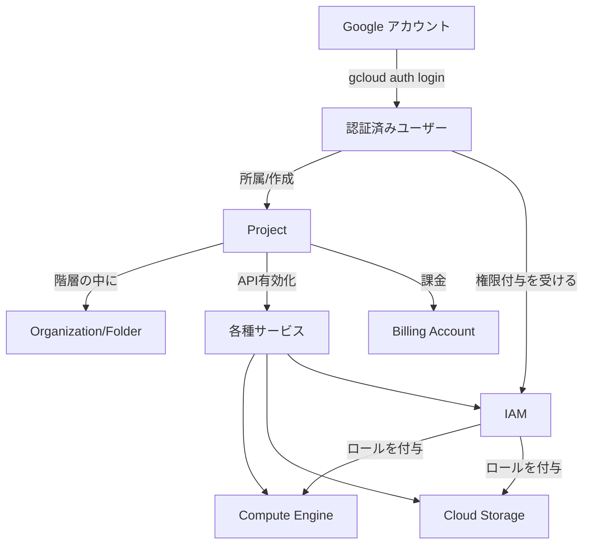
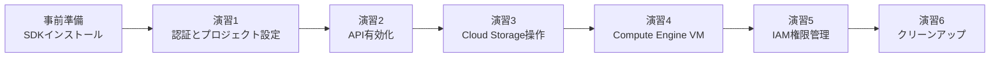
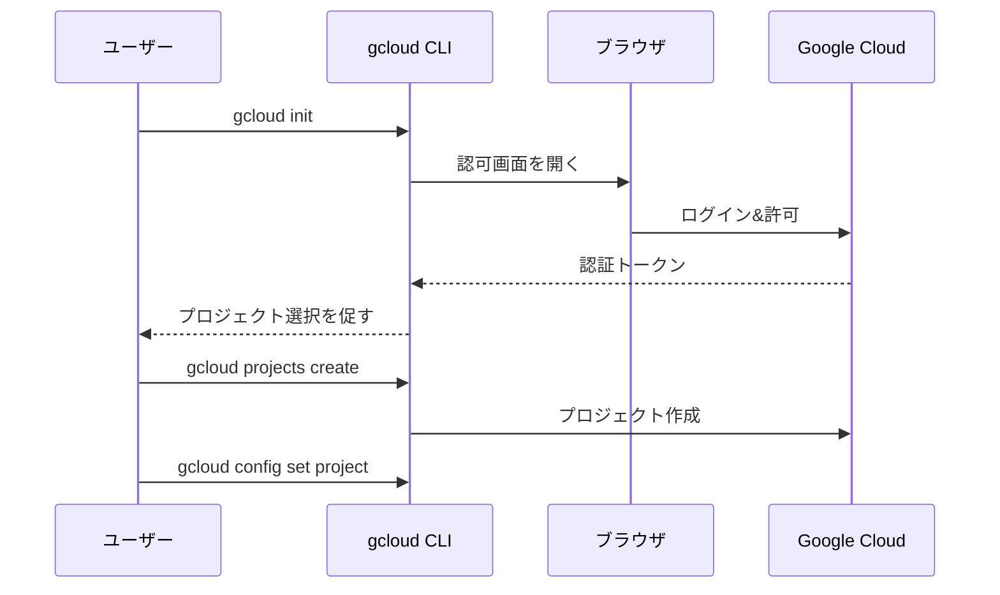
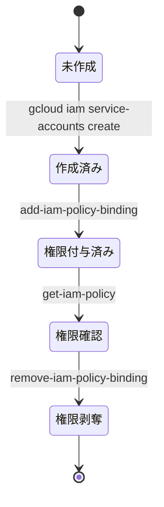

# Google Cloud CLI (gcloud) ハンズオン — コマンドラインでGCPのプロジェクト・VM・ストレージ・権限を操れるようになる

## 1. 勉強対象の概要

**Google Cloud CLI（`gcloud`）** は、Google Cloud Platform（GCP）のリソースをコマンドラインから作成・管理・削除するための公式ツールです。Google Cloud SDKに含まれ、Webコンソール（ブラウザのマネジメントコンソール）でできる操作のほとんどをターミナルから実行できます。スクリプト化・自動化・CI/CD連携がしやすく、実務ではコンソールよりCLI/IaC（Terraformなど）が中心になることが多いため、最初にCLIの型を身につけておくと後の学習が速くなります。

`gcloud` 以外にも、ストレージ専用の操作を行う `gsutil`（現在は `gcloud storage` に統合されつつある）や、BigQuery用の `bq` コマンドもSDKに含まれています。

### 押さえるべき中心概念

| 概念 | 説明 |
|---|---|
| **リソース階層** | Organization（組織） > Folder（フォルダ） > Project（プロジェクト） > Resource（VM・バケット等） という入れ子構造。個人学習では基本的にProject単位で作業する |
| **プロジェクト（Project）** | 課金・権限・APIの有効化がひも付く単位。すべてのリソースはいずれかのプロジェクトに所属する |
| **認証（Authentication）と認可（Authorization）** | 「誰であるか」を証明するのが認証（`gcloud auth login`）、「何ができるか」を制御するのがIAM |
| **IAM（Identity and Access Management）** | 「誰が」「何に対して」「どんな役割（ロール）を持つか」を定義する権限管理の仕組み |
| **リージョンとゾーン** | リージョン（例: `asia-northeast1` = 東京）は地理的な区画、ゾーン（例: `asia-northeast1-a`）はリージョン内のデータセンター単位。多くのリソース作成時に指定が必要 |
| **API（サービス）の有効化** | GCPの各サービス（Compute Engine, Cloud Storage等）はプロジェクトごとに明示的に有効化（`gcloud services enable`）してから使う |

### 全体像（概念間の関係）



### 主なコマンドグループ

| コマンドグループ | 役割 |
|---|---|
| `gcloud auth` | ユーザー/サービスアカウントの認証情報を管理 |
| `gcloud config` | `gcloud` 自体の設定（デフォルトプロジェクト、リージョン等）を管理 |
| `gcloud projects` | プロジェクトの作成・一覧・権限管理 |
| `gcloud services` | APIの有効化・無効化・一覧 |
| `gcloud compute` | Compute Engine（VM、ネットワーク等）の操作 |
| `gcloud storage` | Cloud Storageのバケット・オブジェクト操作 |
| `gcloud iam` | サービスアカウント・カスタムロールの管理 |

## 2. ハンズオンの概要

- **想定環境**: Windows 11 + Git Bash、Googleアカウント（Gmail可）、Google Cloud 無料枠（新規は$300クレジットの無料トライアル、または常時無料枠 [Always Free] の対象リソースを利用）
- **所要時間の目安**: 2〜3時間
- **費用**: 本教材は無料枠に収まる範囲（e2-microインスタンス1台、少量のCloud Storage）で構成していますが、**演習後のクリーンアップ（演習6）を必ず実施**してください。放置すると課金が発生する可能性があります。

### ゴールイメージ

このハンズオンを終えると、以下ができるようになっています。

| # | できるようになること | 使う主なコマンド |
|---|---|---|
| 1 | gcloud CLIをインストールし、Googleアカウントで認証してプロジェクトを設定する | `gcloud init`, `gcloud auth login`, `gcloud config set` |
| 2 | プロジェクトを作成し、必要なAPIを有効化する | `gcloud projects create`, `gcloud services enable` |
| 3 | Cloud Storageバケットを作成し、ファイルをアップロード/ダウンロードする | `gcloud storage buckets create`, `gcloud storage cp` |
| 4 | Compute EngineでVMインスタンスを起動し、SSH接続する | `gcloud compute instances create`, `gcloud compute ssh` |
| 5 | IAMで他ユーザー/サービスアカウントに権限を付与・確認・削除する | `gcloud projects add-iam-policy-binding`, `gcloud iam service-accounts create` |
| 6 | 使い終わったリソースを安全に削除し、課金を止める | `gcloud compute instances delete`, `gcloud storage rm`, `gcloud projects delete` |

### 演習の流れ



## 3. ハンズオンの手順

### 事前準備: gcloud CLIのインストール

1. Googleアカウントを用意する（お持ちのGmailアカウントで可）。初めてGoogle Cloudを使う場合は [Google Cloud 無料トライアル](https://cloud.google.com/free) の登録画面からアカウントを有効化しておくとスムーズです。
2. Windows用インストーラをダウンロードして実行します（Git Bashで以下を実行）。

```bash
curl -O https://dl.google.com/dl/cloudsdk/channels/rapid/GoogleCloudSDKInstaller.exe
./GoogleCloudSDKInstaller.exe
```

   インストーラのウィザードに従って進めます（デフォルト設定でOK）。インストール後、新しいターミナルを開き直してください。

   > 💡 **ローカルにインストールしたくない場合**: Google Cloud コンソール右上の「Cloud Shell」アイコンを使うと、ブラウザ上に `gcloud` がプリインストールされた環境がすぐ使えます。本教材のコマンドはCloud Shellでもそのまま動作します。

3. インストール確認。

```bash
gcloud version
```

✅ **確認ポイント**: `Google Cloud SDK ...` から始まるバージョン情報が表示されればOKです。

### 演習1: 認証とプロジェクト設定

**目的**: Googleアカウントで `gcloud` を認証し、作業対象のプロジェクトを作成・設定する。



1. 初期化コマンドを実行します。ブラウザが開くので、Googleアカウントでログインし権限を許可します。

```bash
gcloud init
```

   プロンプトに従って「新しい設定を作成」→ ログイン → （既存プロジェクトがなければ）「プロジェクトを後で作成」を選びます。ブラウザを開けない環境（サーバー等）では `gcloud init --console-only` を使います。

2. 認証済みアカウントを確認します。

```bash
gcloud auth list
```

3. 新しいプロジェクトを作成します（プロジェクトIDは**全世界で一意**である必要があるため、自分の名前や日付を混ぜます）。

```bash
gcloud projects create my-gcloud-handson-0808 --name="gcloud Handson"
```

4. 作成したプロジェクトを既定のプロジェクトとして設定します。

```bash
gcloud config set project my-gcloud-handson-0808
```

5. 課金アカウントをプロジェクトにリンクします（無料トライアル登録時に作られた課金アカウントを使用）。

```bash
gcloud billing accounts list
gcloud billing projects link my-gcloud-handson-0808 --billing-account=BILLING_ACCOUNT_ID
```

6. 現在の設定を確認します。

```bash
gcloud config list
```

✅ **確認ポイント**: `account` に自分のメールアドレス、`project` に作成したプロジェクトIDが表示される。

**ここで学んだこと**: `gcloud init` で認証とプロジェクトの初期設定を行い、`gcloud config set` でCLIが操作対象とするプロジェクトを固定できる。

### 演習2: API（サービス）の有効化

**目的**: これから使うCompute EngineとCloud StorageのAPIをプロジェクトで有効化する。

```bash
gcloud services enable compute.googleapis.com
gcloud services enable storage.googleapis.com
```

有効化されているAPI一覧を確認します。

```bash
gcloud services list --enabled
```

✅ **確認ポイント**: 一覧に `compute.googleapis.com` と `storage.googleapis.com` が含まれている。

**ここで学んだこと**: GCPの各サービスはプロジェクト単位で明示的に有効化しないと利用できない（無効なAPIを使おうとするとエラーになる）。

### 演習3: Cloud Storageバケット操作

**目的**: オブジェクトストレージ（Cloud Storage）にバケットを作り、ファイルの出し入れをする。

1. バケットを作成します（バケット名もグローバルに一意。ロケーションは東京 `asia-northeast1` を指定）。

```bash
gcloud storage buckets create gs://my-gcloud-handson-0808-bucket \
  --location=asia-northeast1 \
  --uniform-bucket-level-access
```

   > 💡 **`--uniform-bucket-level-access` とは**: Cloud Storageのアクセス制御方式を「均一（Uniform）」に指定するオプションです。
   >
   > | 方式 | 説明 |
   > |---|---|
   > | 均一（このフラグ） | バケット内の全オブジェクトの権限を **IAMのみ**で一元管理する |
   > | きめ細かい（未指定時のデフォルト） | IAMに加えて**オブジェクトごとのACL**も併用でき、オブジェクト単位で個別に公開設定を変えられる |
   >
   > 「きめ細かい」方式はオブジェクト単位のACLでうっかり個別ファイルを公開してしまう事故が起きやすいため、Google公式でも現在は「均一」が推奨・デフォルトです。一度「均一」で作成したバケットは、作成から90日間は「きめ細かい」に戻せない制限がありますが、学習用の使い捨てバケットでは気にする必要はありません。

2. ローカルにテストファイルを作り、アップロードします。

```bash
echo "hello gcloud storage" > hello.txt
gcloud storage cp hello.txt gs://my-gcloud-handson-0808-bucket/
```

3. バケット内のオブジェクトを一覧表示します。

```bash
gcloud storage ls gs://my-gcloud-handson-0808-bucket/
```

4. 別名でダウンロードして中身を確認します。

```bash
gcloud storage cp gs://my-gcloud-handson-0808-bucket/hello.txt downloaded.txt
cat downloaded.txt
```

5. オブジェクトを削除します（バケット自体は演習6でまとめて削除します）。

```bash
gcloud storage rm gs://my-gcloud-handson-0808-bucket/hello.txt
```

✅ **確認ポイント**: `gcloud storage ls` の結果からオブジェクトが消えている、`downloaded.txt` の中身が `hello gcloud storage` になっている。

**ここで学んだこと**: `gcloud storage` サブコマンド（`cp` / `ls` / `rm`）は、ローカルファイルシステムとCloud Storage（`gs://` パス）をほぼ同じ感覚で扱える。

### 演習4: Compute Engine VMインスタンスの作成

**目的**: 仮想マシン（VM）を無料枠の範囲で起動し、SSH接続してみる。

> ⚠️ **料金に関する注意**: Compute EngineのAlways Free枠（`e2-micro` インスタンス1台が無料）は `us-west1` / `us-central1` / `us-east1` のいずれかのリージョンでのみ対象です。**東京リージョン（`asia-northeast1`）はAlways Free枠の対象外**のため、以下の手順で作成するVMには通常の課金が発生します（`e2-micro` は東京リージョンでも比較的安価ですが、無料ではありません）。統一感より費用を優先したい場合は、このVM作成の演習だけ `--zone=us-central1-a` に読み替えてください。演習6のクリーンアップは必ず実施し、不要な課金を防いでください。

1. VMインスタンスを作成します（東京リージョンのゾーン `asia-northeast1-a` を指定）。

```bash
gcloud compute instances create handson-vm \
  --zone=asia-northeast1-a \
  --machine-type=e2-micro \
  --image-family=debian-12 \
  --image-project=debian-cloud \
  --boot-disk-size=30GB
```

2. 作成したインスタンスの一覧を確認します。

```bash
gcloud compute instances list
```

3. SSHで接続します（初回は鍵の自動生成が走ります）。

```bash
gcloud compute ssh handson-vm --zone=asia-northeast1-a
```

   接続できたら、VM内でコマンドを試してから `exit` で抜けます。

```bash
whoami
exit
```

4. 使わない時間はインスタンスを停止してコストを抑えます（Always Free対象時間内なら停止不要ですが操作を体験します）。

```bash
gcloud compute instances stop handson-vm --zone=asia-northeast1-a
```

✅ **確認ポイント**: `gcloud compute instances list` に `handson-vm` が `RUNNING`（停止後は `TERMINATED`）と表示される。SSH接続時にVM内のホスト名が表示される。

**ここで学んだこと**: VMの作成には少なくとも「ゾーン」「マシンタイプ」「OSイメージ（image-family/image-project）」の指定が必要で、`gcloud compute ssh` が鍵管理も含めて接続を仲介してくれる。

### 演習5: IAMによる権限管理

**目的**: サービスアカウントを作成し、IAMロールを付与・確認・削除する一連の流れを体験する。

> 💡 **サービスアカウントとは**: 人間ではなく、プログラム・VM・アプリケーションなどが使う「人でないアカウント」です。
>
> | | ユーザーアカウント | サービスアカウント |
> |---|---|---|
> | 使う主体 | 人間（あなた自身） | プログラム・VM・CI/CDパイプラインなど |
> | 識別子 | メールアドレス（例: `you@gmail.com`） | メール形式のID（例: `handson-sa@my-project.iam.gserviceaccount.com`） |
> | 典型的な用途 | `gcloud auth login` で自分がCLIを操作する | VM上のプログラムがCloud Storageに自動でアクセスする、等 |
>
> 個人アカウントの認証情報をプログラムに埋め込むのはセキュリティ上危険なため、プログラム専用に権限を絞ったアカウントを用意する、という考え方です。
>
> **AWSとの対応**: 機能的に最も近いのは **IAM Role**（特にEC2インスタンスプロファイルやLambda実行ロール）です。VM/コンテナに割り当てると、明示的な鍵管理なしに一時的な認証情報を自動取得できる点が同じだからです。一方、サービスアカウントの鍵ファイル（JSON形式）を発行して外部から使う場合は、**IAM Userのアクセスキー**（長期間有効な静的な鍵）に近い性質になります。GCPのサービスアカウントは、AWSでは分かれている「IAM Role」と「IAM User」の性質を1つの概念に併せ持っている、とイメージすると理解しやすいです。



1. サービスアカウント（プログラムやVMが使う「人でないアカウント」）を作成します。

```bash
gcloud iam service-accounts create handson-sa \
  --display-name="Handson Service Account"
```

2. 作成したサービスアカウントを確認します。

```bash
gcloud iam service-accounts list
```

3. このサービスアカウントに、Cloud Storageの閲覧権限（`roles/storage.objectViewer`）を付与します。

```bash
gcloud projects add-iam-policy-binding my-gcloud-handson-0808 \
  --member="serviceAccount:handson-sa@my-gcloud-handson-0808.iam.gserviceaccount.com" \
  --role="roles/storage.objectViewer"
```

4. プロジェクトのIAMポリシー全体を確認します。

```bash
gcloud projects get-iam-policy my-gcloud-handson-0808
```

5. 付与した権限を剥奪します。

```bash
gcloud projects remove-iam-policy-binding my-gcloud-handson-0808 \
  --member="serviceAccount:handson-sa@my-gcloud-handson-0808.iam.gserviceaccount.com" \
  --role="roles/storage.objectViewer"
```

✅ **確認ポイント**: `get-iam-policy` の出力（YAML形式）に、付与直後は該当の `role` と `member` の組が含まれ、剥奪後は消えている。反映まで数分かかる場合があります。

**ここで学んだこと**: IAMの権限は「誰に（member）」「何の役割を（role）」「どのリソースに対して（projects/instances等）」という3点セットで管理され、`add-iam-policy-binding` / `remove-iam-policy-binding` で操作する。

### 演習6: クリーンアップ（課金を止める）

**目的**: 演習で作成したリソースをすべて削除し、意図しない課金を防ぐ。

```bash
# VMインスタンスの削除
gcloud compute instances delete handson-vm --zone=asia-northeast1-a --quiet

# バケットの削除（中身ごと再帰的に削除）
gcloud storage rm -r gs://my-gcloud-handson-0808-bucket

# サービスアカウントの削除
gcloud iam service-accounts delete handson-sa@my-gcloud-handson-0808.iam.gserviceaccount.com --quiet

# 最後にプロジェクトごと削除（学習用に使い捨てたい場合）
gcloud projects delete my-gcloud-handson-0808 --quiet
```

✅ **確認ポイント**: `gcloud compute instances list` と `gcloud storage ls` で対象が表示されなくなる。`gcloud projects describe my-gcloud-handson-0808` が `DELETE_REQUESTED` 状態になっている（プロジェクト削除は即時ではなく約30日間の猶予期間を経て完全削除される）。

**ここで学んだこと**: 作成コマンドと対になる削除コマンド（`create`⇄`delete`）を必ずセットで覚える。プロジェクトごと消せば、消し忘れによる課金リスクを最小化できる。

## 4. 習得事項のまとめ

### コマンド一覧

| カテゴリ | コマンド | 用途 |
|---|---|---|
| セットアップ | `gcloud init` | 認証・プロジェクトの初期設定 |
| 認証 | `gcloud auth login` / `gcloud auth list` | ログイン／認証済みアカウント確認 |
| 設定 | `gcloud config set project` / `gcloud config list` | 既定プロジェクト等の設定・確認 |
| プロジェクト | `gcloud projects create/list/delete` | プロジェクトの作成・一覧・削除 |
| API | `gcloud services enable/list` | サービス（API）の有効化・確認 |
| ストレージ | `gcloud storage buckets create/ls/cp/rm` | バケット作成、オブジェクトの一覧・コピー・削除 |
| VM | `gcloud compute instances create/list/ssh/stop/delete` | VMの作成・一覧・接続・停止・削除 |
| IAM | `gcloud iam service-accounts create/list/delete` | サービスアカウントの管理 |
| IAM | `gcloud projects add-iam-policy-binding/remove-iam-policy-binding/get-iam-policy` | 権限の付与・剥奪・確認 |
| 課金 | `gcloud billing accounts list` / `gcloud billing projects link` | 課金アカウントの確認・紐付け |

### トラブルシューティング

| 症状 | 原因 | 対処法 |
|---|---|---|
| `PERMISSION_DENIED` エラー | 対象プロジェクトで必要なIAMロールが付いていない、またはAPIが未有効化 | `gcloud services list --enabled` でAPI有効化を確認し、自分のアカウントの権限をIAMコンソールまたは `get-iam-policy` で確認する |
| バケット/プロジェクト作成時に `already exists`（重複エラー） | バケット名・プロジェクトIDはグローバルで一意である必要がある | 名前に日付やランダムな文字列を付けて再試行する |
| `gcloud compute ssh` が失敗する | ファイアウォールでSSH（ポート22）がブロックされている、または鍵生成直後で反映待ち | `gcloud compute firewall-rules list` で `default-allow-ssh` 相当のルールを確認。数十秒待って再試行 |
| コマンドが `command not found` になる | インストール後にターミナルを再起動していない、PATHが通っていない | 新しいGit Bashウィンドウを開き直す。`gcloud version` で確認 |
| 意図しない課金が発生した | リソースの消し忘れ（特にVMの停止し忘れ） | Cloud Consoleの「お支払い」→予算とアラートを設定。演習6の削除コマンドを必ず実行する習慣をつける |
| IAM権限の変更がすぐ反映されない | IAMポリシーの伝播には最大数分かかることがある | 数分待ってから `get-iam-policy` で再確認する |

### 応用・発展

- 同じ手順を **シェルスクリプト化** すれば、環境構築の自動化（開発環境の使い捨て構築など）に応用できます。
- `gcloud config configurations` を使うと、複数プロジェクト（個人検証用・本番用など）の設定を切り替えて管理できます。
- CI/CDパイプライン（GitHub Actions等）ではサービスアカウントキーやWorkload Identity連携を使い、`gcloud` コマンドを非対話的に実行するのが一般的です。

## 5. 今後の学習ロードマップ

1. **Infrastructure as Code（Terraform）** — 今回手動で叩いたコマンドをコード化し、再現可能・レビュー可能なインフラ管理を学ぶ。`gcloud` で理解した概念（プロジェクト、IAM、VM）がそのままTerraformのリソース定義に対応します。
2. **Google Kubernetes Engine（GKE）** — `gcloud container clusters create` からコンテナオーケストレーションの世界へ。Compute Engineの次のステップとして自然な流れです。
3. **サーバーレス（Cloud Run / Cloud Functions）** — VM管理を意識せずにコンテナや関数をデプロイする方法。`gcloud run deploy` などコマンド体系はここまでの学習と地続きです。
4. **Cloud Build / Cloud Deploy によるCI/CD** — コードのpushからビルド・デプロイまでを自動化し、実務に近いワークフローを構築する。

### 参考リンク

- [Google Cloud CLI ドキュメント（インストール・初期化）](https://docs.cloud.google.com/sdk/docs/install)
- [gcloud CLI コマンドリファレンス](https://docs.cloud.google.com/sdk/gcloud/reference)
- [Cloud Storage: gcloud CLIでオブジェクトストレージを学ぶ（公式クイックスタート）](https://docs.cloud.google.com/storage/docs/discover-object-storage-gcloud)
- [IAMでのアクセス権の付与・変更・取り消し](https://docs.cloud.google.com/iam/docs/granting-changing-revoking-access)
- [Google Cloud 無料プログラム（Always Free / 無料トライアル）](https://cloud.google.com/free)
- [Compute Engine の料金](https://cloud.google.com/compute/all-pricing)
