# Google Cloud 組織払い出し ハンズオン — AWS Organizations 相当の統制を Google Cloud で組み立てる

> **対象読者**: AWS Organizations / Control Tower でマルチアカウント統制を運用した経験があり、これから Google Cloud で社内向けの「プロジェクト払い出し基盤（ランディングゾーン）」を設計・運用する人。
> **所要時間**: 約 3〜4 時間（演習9・10 を除けば約 2.5 時間）
> **ターミナル**: GitBash

---

## 1. 勉強対象の概要

### 1.1 何を学ぶのか

社内の各チームに「クラウド環境を安全に払い出す」ためには、次の 5 つを設計・実装する必要がある。

| # | 領域 | 問い |
|---|------|------|
| 1 | **リソース階層** | 誰の環境をどこに置くか。境界はどこか |
| 2 | **ID・権限** | 誰がどの範囲で何をできるか。払い出す権限は誰が持つか |
| 3 | **ガードレール** | 権限を持っていてもやらせてはいけないことをどう止めるか |
| 4 | **課金** | コストをどう分離し、誰が上限を握るか |
| 5 | **可視性** | 監査ログ・設定違反をどこに集約して見るか |

Google Cloud ではこれらが AWS と異なるサービスに分かれている。まずは対応関係を頭に入れる。

### 1.2 AWS Organizations との対応表（最重要）

| AWS | Google Cloud | 決定的に違う点 |
|-----|--------------|----------------|
| Organization | **組織リソース（Organization）** | 作成 API が無い。Cloud Identity / Google Workspace の**ドメインに 1:1 で自動生成**される |
| Root | 組織ノード | 同じ |
| OU（組織単位） | **フォルダ（Folder）** | 最大 **10 階層**、1 親あたり最大 **300 個**の子フォルダ |
| アカウント | **プロジェクト（Project）** | プロジェクトは AWS アカウントより「軽い」。1 チーム 1 アカウントではなく **1 ワークロード 1 プロジェクト**が普通 |
| SCP（サービスコントロールポリシー） | **組織のポリシー（Organization Policy）** + **IAM Deny ポリシー** | 2 つに分かれる。OrgPolicy は「リソース構成の制約」、Deny は「権限そのものの拒否」 |
| 一括請求（Consolidated Billing） | **Cloud 請求先アカウント（Billing Account）** | 請求先アカウントは階層の外にある独立オブジェクト。プロジェクトに**リンク**する |
| Control Tower | ランディングゾーン設計ガイド + **Cloud Foundation Fabric FAST** / Terraform Example Foundation | **フルマネージド製品は無い**。Terraform で自分で組む |
| Account Factory | **Project Factory**（Terraform モジュール） | 同上、IaC で実装 |
| IAM Identity Center | **Cloud Identity**（+ 外部 IdP 連携 / Workforce Identity 連携） | 組織の存在自体が Cloud Identity 前提 |
| タグポリシー | **Tags（Resource Manager タグ）** | GCP の **label と tag は別物**。IAM 条件・OrgPolicy 条件に使えるのは **tag** のみ |
| CloudTrail 組織証跡 | **Cloud Audit Logs** + 組織レベル **ログシンク**（`--include-children`） | 管理アクティビティ監査ログは既定で有効・無料 |
| AWS Config / ガードレール検知 | **Security Command Center** / Policy Intelligence | |
| AWS Budgets | **Cloud Billing Budgets** | |

> **一番の落とし穴**: AWS 感覚で「チームごとにアカウント（＝プロジェクト）を 1 つ」と設計すると破綻する。Google Cloud では**フォルダが AWS アカウントの境界感覚に近く**、プロジェクトはもっと細かく大量に作る前提で設計する。

> ⚠️ **もう一つの落とし穴：「OU」という略称の衝突**。上の表で「AWSのOU（組織単位）≒ Googleのフォルダ」と対応させたが、**Google Cloud には全く同じ「組織部門（Organizational Unit）」という名前で、ユーザーを束ねる別概念も存在する**（演習4-2b・[Cloud Identity Free ハンズオン](./cloud-identity-free-handson.md)で扱う）。名前が同じでも中身は別物なので要注意。
>
> ```
> AWS の OU（組織単位）    ≒  Google の フォルダ     ← リソースを束ねる（この表の話）
> Google の 組織部門（OU） ≠  AWS の OU              ← ユーザーを束ねる、全くの別物
> ```
>
> 「組織」「フォルダ」「グループ」「組織部門」「チーム」の全体整理は [Cloud Identity Free ハンズオンの 1.4〜1.5節](./cloud-identity-free-handson.md#14-組織フォルダグループ組織部門チームの整理) にまとめてある。演習4 に入る前に一読を推奨する。

### 1.3 リソース階層とポリシー継承

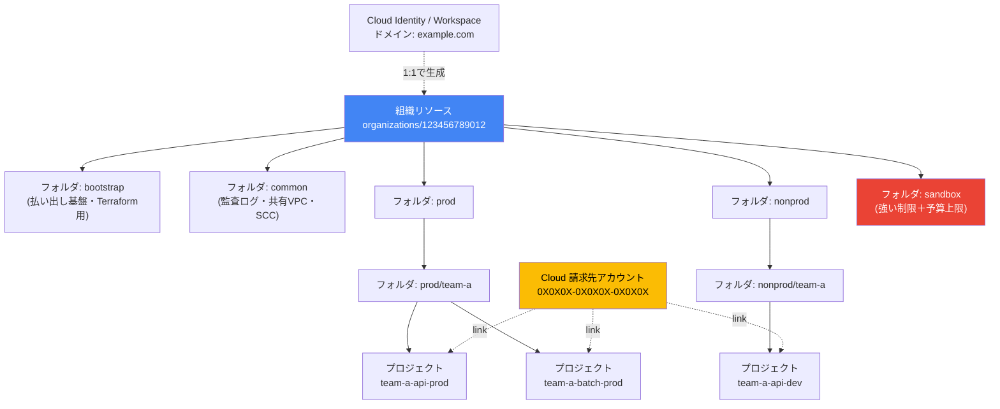
```mermaid
graph TD
    CI["Cloud Identity / Workspace<br/>ドメイン: example.com"] -.1:1で生成.-> ORG

    ORG["組織リソース<br/>organizations/123456789012"]
    ORG --> F_BOOT["フォルダ: bootstrap<br/>(払い出し基盤・Terraform用)"]
    ORG --> F_COMMON["フォルダ: common<br/>(監査ログ・共有VPC・SCC)"]
    ORG --> F_PROD["フォルダ: prod"]
    ORG --> F_NONPROD["フォルダ: nonprod"]
    ORG --> F_SBOX["フォルダ: sandbox<br/>(強い制限＋予算上限)"]

    F_PROD --> F_PROD_A["フォルダ: prod/team-a"]
    F_NONPROD --> F_DEV_A["フォルダ: nonprod/team-a"]

    F_PROD_A --> P1["プロジェクト<br/>team-a-api-prod"]
    F_PROD_A --> P2["プロジェクト<br/>team-a-batch-prod"]
    F_DEV_A --> P3["プロジェクト<br/>team-a-api-dev"]

    BILL["Cloud 請求先アカウント<br/>0X0X0X-0X0X0X-0X0X0X"]
    BILL -. link .-> P1
    BILL -. link .-> P2
    BILL -. link .-> P3

    style ORG fill:#4285F4,color:#fff
    style BILL fill:#FBBC04,color:#000
    style F_SBOX fill:#EA4335,color:#fff
```

継承のルールは 3 種類あり、**挙動が全部違う**。ここを混同すると事故る。

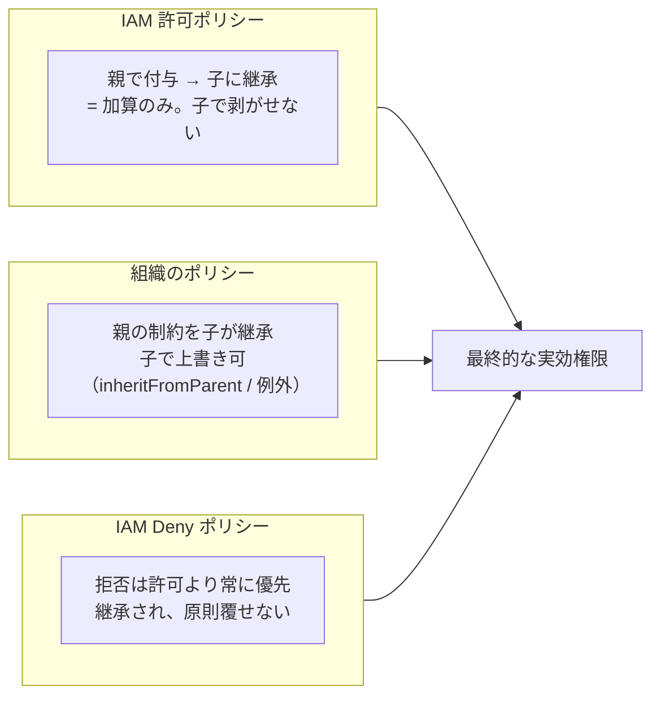
```mermaid
flowchart LR
    subgraph A["IAM 許可ポリシー"]
      A1["親で付与 → 子に継承<br/>= 加算のみ。子で剥がせない"]
    end
    subgraph B["組織のポリシー"]
      B1["親の制約を子が継承<br/>子で上書き可（inheritFromParent / 例外）"]
    end
    subgraph C["IAM Deny ポリシー"]
      C1["拒否は許可より常に優先<br/>継承され、原則覆せない"]
    end
    A --> D["最終的な実効権限"]
    B --> D
    C --> D
```

| 仕組み | 効き方 | AWS での近いもの |
|--------|--------|------------------|
| IAM 許可ポリシー（allow） | 上位で付けた権限は**必ず**下位に継承される。下位で減らせない | IAM ポリシー |
| 組織のポリシー（Organization Policy） | 「外部 IP を付けたVMは作れない」等、**リソース構成**を API レベルで制約 | SCP（の一部）＋ Config ルール |
| IAM Deny ポリシー | 特定プリンシパルの**特定 permission** を拒否。allow より優先 | SCP（の本質部分） |

### 1.4 押さえるべき中心概念

1. **組織リソースは作れない、自動的に生成される** — Cloud Identity（無料版でも可）でドメインを検証すると自動で 1 個できる。組織を消すにはドメイン契約ごと消す必要がある。
2. **IAM の既定はゆるい** — 組織を作った直後、ドメイン内の**全ユーザーが `roles/resourcemanager.projectCreator` と `roles/billing.creator` を持っている**。ここを剥がすのが統制の第一歩（演習1）。
3. **組織のポリシーの既定は 2024年5月以降きつくなった** — 詳細は 1.5 節。IAM がゆるいのと対照的に、一部の組織のポリシーは**作成した瞬間から enforce されている**。
4. **プロジェクト ID はグローバル一意で変更不可** — 命名規約は最初に決める（例: `{team}-{app}-{env}`）。
5. **請求先アカウントは階層の外** — 組織 IAM とは別に、請求先アカウント自身の IAM がある。「作れる人」と「課金を紐づけられる人」を分離できる。
6. **label と tag を混同しない** — label は課金レポートの分類用、tag は IAM 条件・OrgPolicy 条件のキー。
7. **ランディングゾーンは自作** — Control Tower 相当は無いので、Terraform（Cloud Foundation Fabric FAST / terraform-example-foundation）で組む。

### 1.5 2024年5月以降の組織に自動適用される「セキュリティベースライン制約」

**ここは公式ドキュメントでも見落とされがちな重要な変更点。** 2024年5月3日以降に作成された組織には、Google 管理の組織のポリシーが**作成と同時に・何もしなくても** 7 つ適用される。本ハンズオンの検証環境（`htrbass44.click`、作成日 2026年）でも全て有効になっていることを実機で確認済み。

| # | 制約 | 実効値（本環境で確認済み） | 内容 |
|---|------|---------------------------|------|
| 1 | `iam.managed.disableServiceAccountKeyCreation` | enforce: true | SA の静的キー発行を禁止 |
| 2 | `iam.disableServiceAccountKeyUpload` | enforce: true | SA キーのアップロードを禁止 |
| 3 | `iam.automaticIamGrantsForDefaultServiceAccounts` | enforce: true | 既定 SA への自動 Editor 権限付与を禁止 |
| 4 | **`iam.allowedPolicyMemberDomains`** | `allowedValues: [顧客ID]` | **自社ドメイン以外への IAM 権限付与を禁止**（演習5-2 で「これから設定する」ものとして紹介するが、実際は最初から有効） |
| 5 | **`essentialcontacts.managed.allowedContactDomains`** | enforce: true | **Essential Contacts の宛先を自社ドメインのみに制限**（演習1-4 で影響あり） |
| 6 | `compute.managed.restrictProtocolForwardingCreationForTypes` | enforce: true | プロトコル転送を制限 |
| 7 | `storage.uniformBucketLevelAccess` | enforce: true | 均一バケットレベルアクセスを強制 |

```bash
# 自分の組織で確認する
gcloud org-policies describe constraints/essentialcontacts.managed.allowedContactDomains \
  --organization=$ORG_ID --effective

gcloud org-policies describe constraints/iam.allowedPolicyMemberDomains \
  --organization=$ORG_ID --effective
```

> **AWS Organizations との対比が変わる点**: 「Google Cloud は既定がゆるい」という通説（1.3節の対応表・4.4節にも記載）は、**IAM の権限付与に関しては今も正しい**が、**組織のポリシーに関してはもう正しくない**。2024年5月以降の新規組織は、AWS の Control Tower 相当のガードレールの一部を**初日から**持っている。演習5 は「ゼロから設定する」演習ではなく、「**すでに効いているものを確認し、必要な分だけ追加・調整する**」演習として読み替えるとよい。
>
> 参考: [Introducing stronger default Org Policies for our customers（Google Cloud Blog）](https://cloud.google.com/blog/products/identity-security/introducing-stronger-default-org-policies-for-our-customers) / [Manage Google Cloud security baseline constraints（公式ドキュメント）](https://docs.cloud.google.com/resource-manager/docs/manage-baseline-constraints)

> **ベースライン制約は緩められる**: 「管理者が付けた既定」であって「変更不可能な仕様」ではない。`gcloud org-policies delete CONSTRAINT_NAME --organization=$ORG_ID` で無効化できる。ただし Google は「できるだけ狭い範囲（特定プロジェクトのみ等）で緩めること」を推奨している。

---

## 2. ハンズオンの概要

### 2.1 ゴールイメージ

このハンズオンを終えたとき、**「新しいチームから依頼が来たら、ガードレール付きのプロジェクトを 1 コマンドで払い出せる」**状態になる。

具体的な成果物:

- `bootstrap / common / prod / nonprod / sandbox` のフォルダ階層
- 払い出し専用サービスアカウント（＋最小権限のロール）
- 環境ごとに効き方の違う組織のポリシー 5 種（うち 1 つは dry-run で影響調査）
- SCP 相当の IAM Deny ポリシー 1 種
- 予算アラート付きの sandbox プロジェクト
- 組織全体の監査ログを 1 プロジェクトに集約するログシンク
- 払い出しスクリプト（bash）と、それを IaC 化した Terraform（Project Factory の最小版）

### 2.2 学べることの全体像

| 演習 | テーマ | 主に使うもの | 組織ノード必須? | 目安 |
|------|--------|--------------|:---:|-----|
| 0 | 事前準備 | gcloud CLI, 環境変数 | – | 15分 |
| 1 | 組織の把握と初期統制 | `gcloud organizations`, Essential Contacts | ✅ | 20分 |
| 2 | フォルダ階層の構築 | `gcloud resource-manager folders` | ✅ | 20分 |
| 3 | プロジェクト払い出し | `gcloud projects create`, `gcloud billing projects link` | ⚠️ 一部可 | 30分 |
| 4 | IAM 設計と権限委譲 | グループ, フォルダ単位ロール, カスタムロール | ✅ | 30分 |
| 5 | ガードレール① 組織のポリシー | `gcloud org-policies`, dry-run | ✅ | 35分 |
| 6 | ガードレール② IAM Deny ポリシー | `gcloud iam policies` | ✅ | 20分 |
| 7 | 課金ガバナンス | 予算アラート, BigQuery エクスポート | ⚠️ 一部可 | 25分 |
| 8 | 監査ログの集約 | 組織レベルログシンク | ✅ | 20分 |
| 9 | 払い出しの自動化 | bash → Terraform | ✅ | 40分 |
| 10 | クリーンアップ | delete 系コマンド | – | 15分 |

### 2.3 演習の流れ

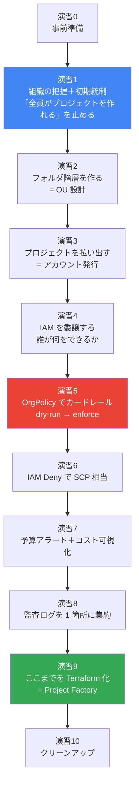
```mermaid
flowchart TD
    E0["演習0<br/>事前準備"] --> E1["演習1<br/>組織の把握＋初期統制<br/>「全員がプロジェクトを作れる」を止める"]
    E1 --> E2["演習2<br/>フォルダ階層を作る<br/>= OU 設計"]
    E2 --> E3["演習3<br/>プロジェクトを払い出す<br/>= アカウント発行"]
    E3 --> E4["演習4<br/>IAM を委譲する<br/>誰が何をできるか"]
    E4 --> E5["演習5<br/>OrgPolicy でガードレール<br/>dry-run → enforce"]
    E5 --> E6["演習6<br/>IAM Deny で SCP 相当"]
    E6 --> E7["演習7<br/>予算アラート＋コスト可視化"]
    E7 --> E8["演習8<br/>監査ログを 1 箇所に集約"]
    E8 --> E9["演習9<br/>ここまでを Terraform 化<br/>= Project Factory"]
    E9 --> E10["演習10<br/>クリーンアップ"]

    style E1 fill:#4285F4,color:#fff
    style E5 fill:#EA4335,color:#fff
    style E9 fill:#34A853,color:#fff
```

### 2.4 費用について

- **フォルダ・プロジェクト・組織のポリシー・IAM・Essential Contacts・管理アクティビティ監査ログ・予算アラート は無料**。
- 費用が発生しうるのは、演習7 の BigQuery 課金エクスポート（保存料、数円）と、演習8 のログシンク先ストレージ程度。
- **Cloud Identity Free 版は無料**（50 ユーザーまで）。ただし**ドメイン取得費（年 1,000〜2,000 円程度）は必要**。

---

## 3. ハンズオンの手順

### 演習0: 事前準備

#### 0-1. 必要なもの

| 項目 | 内容 |
|------|------|
| ターミナル | GitBash |
| gcloud CLI | 最新版（`gcloud version` で確認） |
| 組織リソース | Cloud Identity Free または Google Workspace のドメイン |
| 請求先アカウント | 有効な Cloud 請求先アカウント 1 つ |
| 権限 | 組織管理者（`roles/resourcemanager.organizationAdmin`）＝ Cloud Identity の特権管理者 |

#### 0-2. 組織リソースを用意する（持っていない場合）

Google Cloud の組織リソースは **API では作れない**。Cloud Identity にドメインを登録することで**自動的に生成される**。

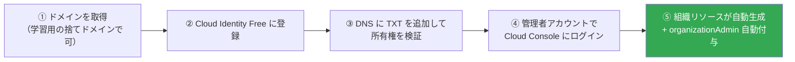
```mermaid
flowchart LR
    A["① ドメインを取得<br/>（学習用の捨てドメインで可）"] --> B["② Cloud Identity Free に登録"]
    B --> C["③ DNS に TXT を追加して<br/>所有権を検証"]
    C --> D["④ 管理者アカウントで<br/>Cloud Console にログイン"]
    D --> E["⑤ 組織リソースが自動生成<br/>+ organizationAdmin 自動付与"]
    style E fill:#34A853,color:#fff
```

> **DNS 側の準備**: ③ の TXT 追加は、DNS の仕組みを理解していないと詰まりやすい。委任・ホストゾーン・TXT レコードの扱いは [DNS と Route 53 ハンズオン](./dns-route53-handson.md) で先に押さえておくと確実（本教材の実行環境では `htrbass44.click` を Route 53 で運用している）。

##### ステップ ①〜②: Cloud Identity Free に登録する

<https://workspace.google.com/gcpidentity/signup?sku=identitybasic>

**会社情報の入力**

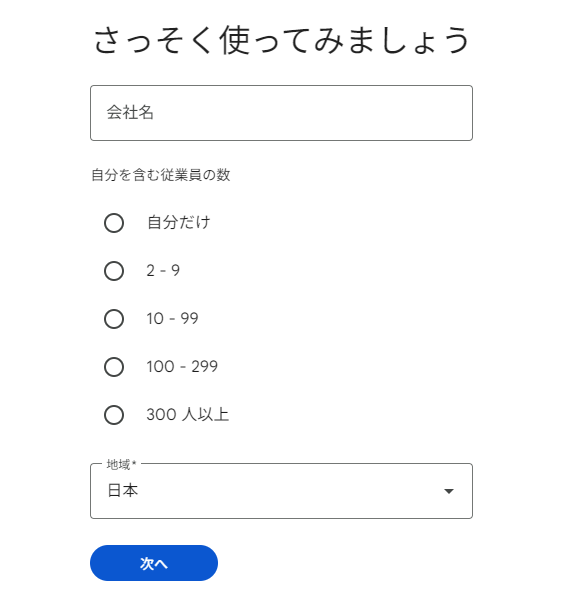

| 項目 | 学習用途での入力 | 備考 |
|------|------------------|------|
| 会社名 | 任意（例: `handson-lab`） | 後から Admin コンソールで変更できる |
| 自分を含む従業員の数 | **自分だけ** | Free 版は 50 ユーザーまで。ここでの選択は課金に影響しない |
| 地域 | **日本** | 契約主体の所在地。組織リソースのデータ所在地とは別物 |

> **「会社名」に本名や実在企業名を入れる必要はない**。Cloud Identity Free は法人契約の審査を伴わないため、学習用であればラボ名で問題ない。ただし**ドメインの所有権は実際に検証される**ので、そこだけは自分が管理するドメインが必須。

**連絡先の入力**

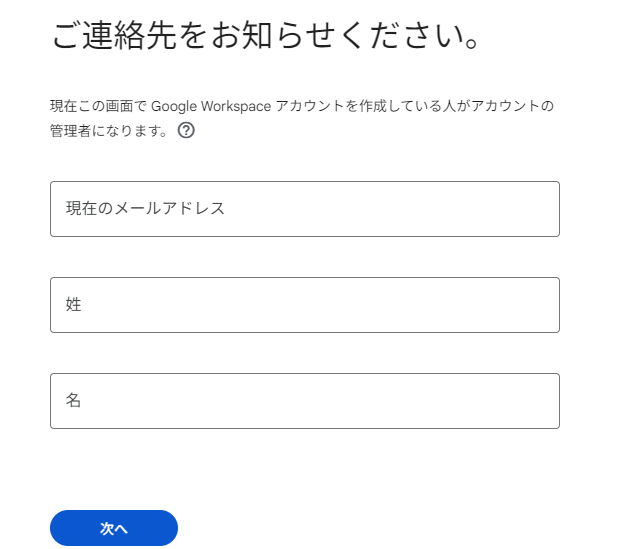

| 項目 | 入力するもの | 注意 |
|------|--------------|------|
| 現在のメールアドレス | **今使っている個人の Gmail 等** | ⚠️ これは**管理者アカウントのアドレスではない** |
| 姓 / 名 | 自分の名前 | アカウント復旧時の本人確認に使われる |

> **最大の誤解ポイント**: 「現在のメールアドレス」は**これから作る管理者アカウントとは別物**である。ここに入れるのは、Google からの連絡やアカウント復旧を受け取るための**既存の**アドレス。管理者アカウント（`admin@htrbass44.click` のような独自ドメインのアカウント）は、この先の画面でドメインを登録したあとに作る。
>
> ここに入れた Gmail が Cloud Identity の管理下に入ることもない。**あくまで連絡先**である。

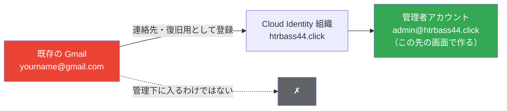
```mermaid
graph LR
    A["既存の Gmail<br/>yourname@gmail.com"] -->|"連絡先・復旧用として登録"| B["Cloud Identity 組織<br/>htrbass44.click"]
    B --> C["管理者アカウント<br/>admin@htrbass44.click<br/>（この先の画面で作る）"]
    A -.->|"管理下に入るわけではない"| X["✗"]

    style A fill:#EA4335,color:#fff
    style C fill:#34A853,color:#fff
    style X fill:#5F6368,color:#fff
```

> **実務での使い分け**: 本番環境では、ここに個人のアドレスではなく**メーリングリスト**（`cloud-admin@yourcompany.co.jp` 等）を入れる。担当者の退職・異動でアカウント復旧手段を失う事故を防ぐため。演習1 で設定する Essential Contacts と同じ思想。

**ドメイン名の入力（最重要）**

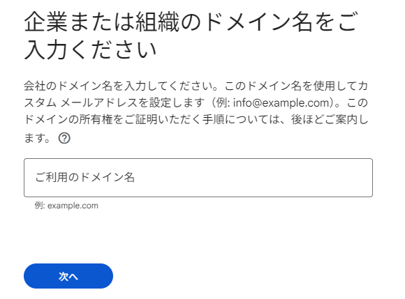

ここで入力したドメインが **Cloud Identity のプライマリドメイン**になり、そのまま **Google Cloud 組織リソースの名前**になる。

```
htrbass44.click        ← 入力するのはこの形式のみ
```

| 書き方 | 可否 |
|--------|:---:|
| `htrbass44.click` | ✅ |
| `https://htrbass44.click` | ❌ スキームは不要 |
| `www.htrbass44.click` | ❌ `www` は付けない |
| `htrbass44.click.` | ❌ 末尾ドットは不要 |
| `gcp.htrbass44.click` | ⚠️ サブドメインも可（後述） |

##### 頂点かサブドメインか

| | 頂点（`htrbass44.click`） | サブドメイン（`gcp.htrbass44.click`） |
|---|---|---|
| 管理者アカウント | `admin@htrbass44.click` | `admin@gcp.htrbass44.click` |
| 既存のメール運用への影響 | **なし**（Cloud Identity Free は Gmail 非ホストのため MX 変更不要） | なし |
| 向いているケース | 学習用・そのドメインを他に使っていない | 本番ドメインを別用途で使っており、分離したい |

本教材では**頂点（`htrbass44.click`）を使う**。学習用ドメインで他用途がないため、分ける理由がない。

##### 事前に確認すべきこと

| 確認事項 | 理由 |
|---------|------|
| そのドメインが**他の Workspace / Cloud Identity に未登録**か | 登録済みだとここで弾かれる |
| **DNS の TXT レコードを追加できる**か | 次のステップで所有権検証に必要 |
| ドメインを**維持し続けられる**か | 組織リソースはこのドメインに紐付く。失効させると管理不能になる |

> **プライマリドメインは後から変更できるが、避けたほうがよい**。Cloud Identity ではプライマリドメインの変更が可能で、その場合 Google Cloud の組織リソースの表示名も追随する（反映に数日かかる）。プロジェクトやリソースへの影響はない。ただし「手間のかかる作業」と公式に明記されており、通常は最初に決めたドメインを使い続ける前提で選ぶ。

> **ドメインの維持のほうが重要**: 本教材の環境では `htrbass44.click` の有効期限が 2027-10-04。**Route 53 で自動更新をオンにしておくこと**（DNS ハンズオンの演習8-3）。

**管理者アカウント（ユーザー名・パスワード）の作成**

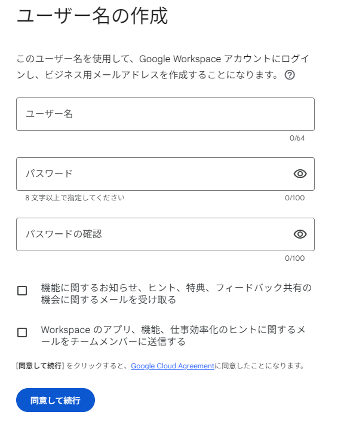

| 項目 | 入力するもの |
|------|--------------|
| ユーザー名 | `admin` → `admin@htrbass44.click` になる |
| パスワード | 8 文字以上。**パスワードマネージャーで生成した強力なもの** |
| チェックボックス 2 つ | マーケティングメールの受信可否。**両方オフでよい** |

##### ここで作られるのは「組織で最も強いアカウント」

このアカウントは Cloud Identity の **特権管理者（super admin）** となり、Google Cloud 側では `roles/resourcemanager.organizationAdmin` が自動付与される。

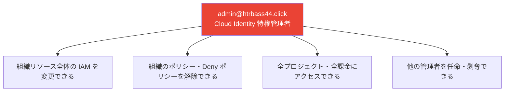
```mermaid
graph TD
    SA["admin@htrbass44.click<br/>Cloud Identity 特権管理者"]
    SA --> P1["組織リソース全体の IAM を変更できる"]
    SA --> P2["組織のポリシー・Deny ポリシーを解除できる"]
    SA --> P3["全プロジェクト・全課金にアクセスできる"]
    SA --> P4["他の管理者を任命・剥奪できる"]

    style SA fill:#EA4335,color:#fff
```

| リスク | 対策 |
|--------|------|
| 乗っ取られると組織全体を失う | **2 段階認証を必ず有効化**（登録後すぐ Admin コンソールで設定） |
| パスワードを失うと復旧が極めて困難 | パスワードマネージャーに保存。復旧用の連絡先（前画面の Gmail）を維持 |
| 日常利用で権限事故を起こす | 実務では**ブレークグラス用途に限定**し、日常は権限を絞った別アカウントを使う |

> **実務での定石**: 特権管理者アカウントは「金庫に入れる鍵」として扱い、普段は使わない。演習1 で `roles/resourcemanager.organizationAdmin` を別ユーザーに付与するのは、まさにこの分離のため。本ハンズオンでは学習効率を優先して特権管理者のまま進めるが、本番では必ず分ける。

##### 「ビジネス用メールアドレスを作成」という表示について

画面には「ビジネス用メールアドレスを作成することになります」とあるが、**Cloud Identity Free は Gmail をホストしない**。したがって：

- `admin@htrbass44.click` は **ログイン ID としては機能する**
- しかし **このアドレスでメールを受信することはできない**
- パスワードリセット等の通知は、前の画面で入力した**個人の Gmail に届く**

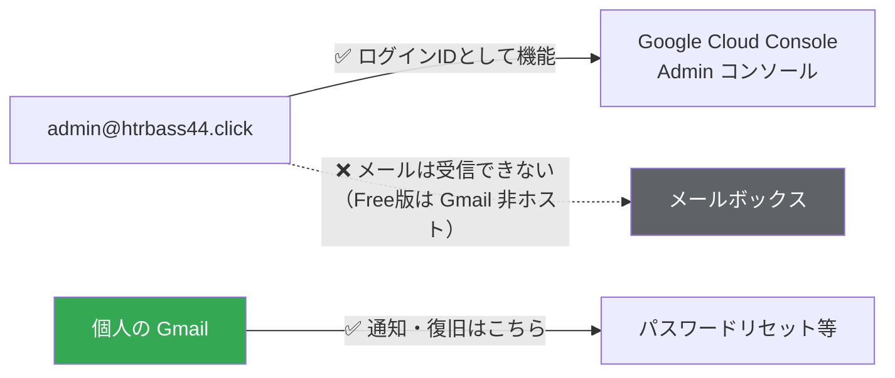
```mermaid
graph LR
    A["admin@htrbass44.click"] -->|"✅ ログインIDとして機能"| B["Google Cloud Console<br/>Admin コンソール"]
    A -.->|"❌ メールは受信できない<br/>（Free版は Gmail 非ホスト）"| C["メールボックス"]
    D["個人の Gmail"] -->|"✅ 通知・復旧はこちら"| E["パスワードリセット等"]

    style C fill:#5F6368,color:#fff
    style D fill:#34A853,color:#fff
```

**だから前画面の連絡先アドレスが生命線になる。** ここを失うと管理者アカウントの復旧手段がなくなる。

<!-- 以降の画面のスクリーンショットはここに追記していく -->

##### ステップ ③: ドメイン所有権を検証する

アカウント作成が完了すると、ドメイン検証の開始画面になる。

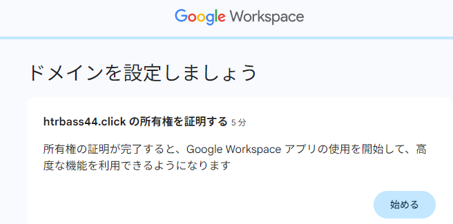

「始める」を押すと、まずドメインホスト（DNS を運用している事業者）の選択画面になる。

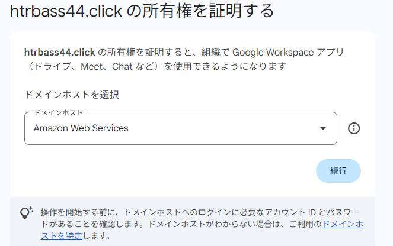

**`Amazon Web Services` が自動で選択されている**はず。そのまま「続行」でよい。

> **なぜ Google は当てられたのか**: 演習1 でやったのと同じことを Google もしている。ドメインの NS レコードを引いて、そのホスト名から事業者を推定しているだけである。
>
> ```bash
> qh htrbass44.click NS
> #   -> ns-198.awsdns-24.com. / ns-1009.awsdns-62.net.
> #      ns-1120.awsdns-12.org. / ns-1772.awsdns-29.co.uk.
> ```
>
> `awsdns` という文字列から AWS と判定している。**もし演習4 の NS 差し替えが済んでいなければ、ここで別の事業者が表示されるか、判定に失敗する。** 委任が正しいことの傍証にもなる。
>
> なお選択したホストによって Google が表示する手順文言が変わるだけで、**やることは「TXT レコードを 1 行足す」で共通**。

「続行」を押すと `google-site-verification=...` という**あなた専用のランダム文字列**が発行される。これを DNS の TXT レコードに追加して「このドメインを管理している」ことを証明する。

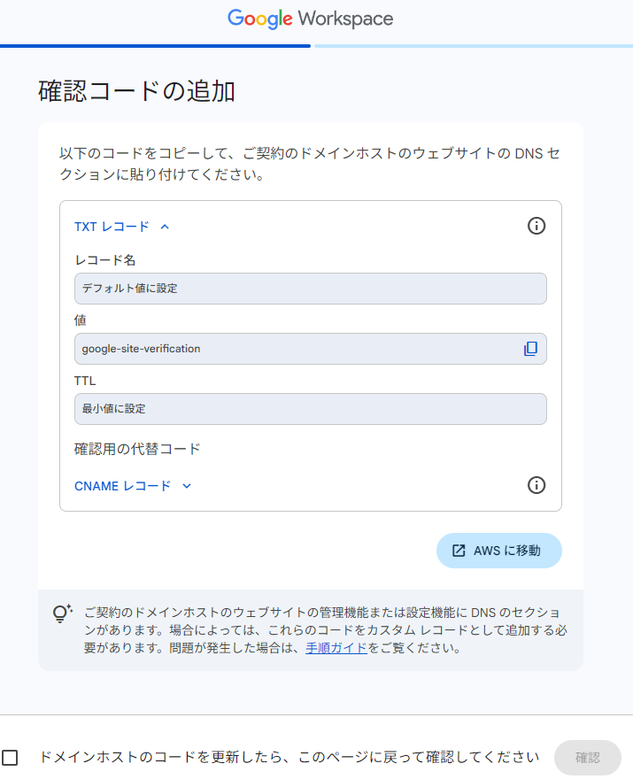

「レコード名: デフォルト値に設定」はゾーンの頂点（`htrbass44.click` そのもの）を指す。「TTL: 最小値に設定」は反映を早めるための推奨。「AWS に移動」ボタンはコンソール操作用のショートカットだが、以下は CLI で直接投入する。

> **なぜこれが証明になるのか**: ゾーンのレコードを書き換えられるのは、そのドメインの DNS を管理している人だけ。**TXT を置けること＝ドメインの支配権を持つことの証明**になる。同じ原理が ACM の証明書 DNS 検証、Let's Encrypt の DNS-01 チャレンジ、各種 SaaS のドメイン認証でも使われている。

**⚠️ 適用前に必ず既存の TXT を確認する**

同じ名前・同じタイプのレコードセットは **1 つしか作れない**。頂点にすでに TXT がある状態で新規に UPSERT すると、**既存の値が消える**。

```bash
cd /c/dev/handson-gcloud-cnt/handson && source activate.sh

# 既存の TXT を確認
aws route53 list-resource-record-sets --hosted-zone-id "$ZONE_ID" \
  --query "ResourceRecordSets[?Type=='TXT'].{Name:Name,Values:ResourceRecords[].Value}" --output json
```

**検証文字列と既存の値をまとめて 1 レコードセットに入れる**

```bash
VERIFY='google-site-verification=xxxxxxxxxxxx'   # 画面に表示された値に置換

cat > records/rr-verify.json <<EOF
{
  "Comment": "Cloud Identity domain verification + SPF",
  "Changes": [{
    "Action": "UPSERT",
    "ResourceRecordSet": {
      "Name": "${DOMAIN}",
      "Type": "TXT",
      "TTL": 300,
      "ResourceRecords": [
        {"Value": "\"${VERIFY}\""},
        {"Value": "\"v=spf1 -all\""}
      ]
    }
  }]
}
EOF

rr_apply records/rr-verify.json
```

> 学習用に入れた `"hello-dns-handson"` は落としてよい。`"v=spf1 -all"` は「このドメインはメールを送らない」という宣言で、なりすまし対策として残す価値がある。

**反映を確認してから「確認」を押す**

```bash
qh htrbass44.click TXT
```

**✅ 確認ポイント**: 検証文字列が返ってきてから Google 側のボタンを押す。**先に押して失敗すると、リトライまで待たされることがある。**

Route 53 の詳細な挙動（`INSYNC` の意味、クォートの必要性など）は [DNS ハンズオンの演習7](./dns-route53-handson.md) を参照。

##### ステップ ④: 検証完了 → Cloud Console で利用規約に同意する

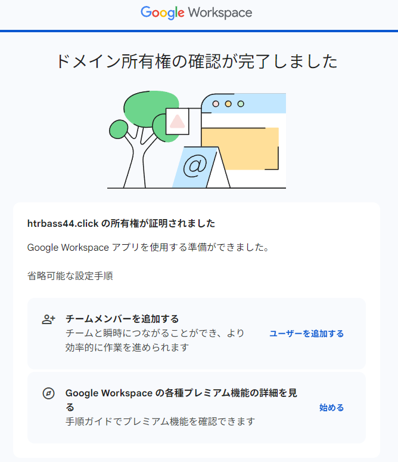

「省略可能な設定手順」（チームメンバー追加 / Workspace プレミアム機能）は**どちらも不要**。Cloud Identity Free では Workspace アプリを使わない。

代わりに、この時点で **2 段階認証を有効化**しておく（<https://admin.google.com> → セキュリティ → 認証 → 2 段階認証プロセス）。

**⚠️ 同意画面は 2 種類あり、混同しやすい**

| 画面 | 内容 | 組織リソースを生成するか |
|------|------|:---:|
| 「新しいアカウントへようこそ」 | 管理対象アカウントの通知（組織管理者がデータを管理できる旨）。`gcloud auth login` の途中でも出る | ❌ しない |
| **「Google Cloud 利用規約」** | 国の選択＋規約チェック | ✅ **これがトリガー** |

作成した管理者アカウント（例: `admin@htrbass44.click`）で <https://console.cloud.google.com> にアクセスすると、後者が表示される。

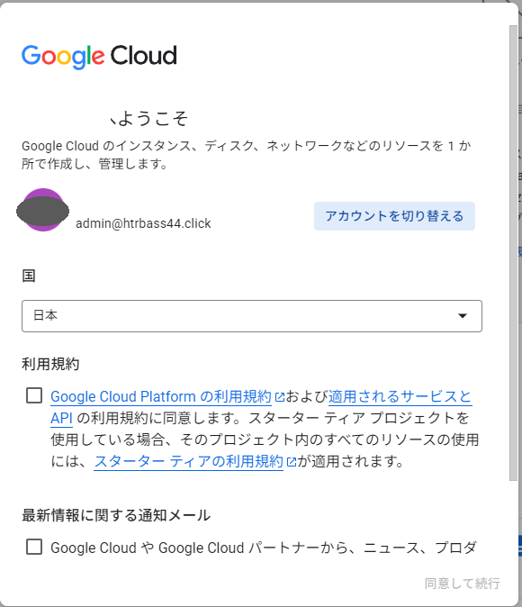

| 項目 | 操作 |
|------|------|
| 国 | 日本 |
| 利用規約 | **チェック必須** |
| 最新情報に関する通知メール | 任意（オフでよい） |

##### この画面にたどり着くまでにつまずきやすい点

**① 複数アカウントでログイン中だとコンソールが読み込めないことがある**

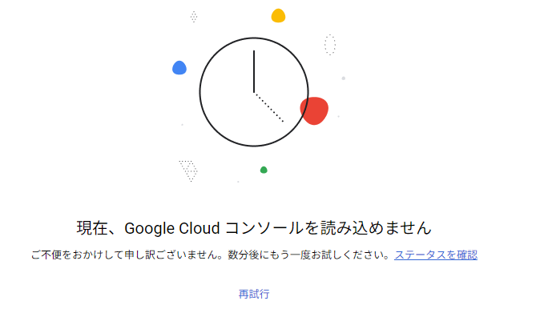

ブラウザに個人の Gmail と管理者アカウントが同時にログインしていると、`authuser` の解決に失敗してこのエラーになることがある。**シークレットウィンドウで管理者アカウントのみでログインし直す**のが最も確実。

**② `gcloud auth login` の途中でも別の同意画面が挟まる**

`gcloud auth login` で管理者アカウントを選択すると、ブラウザ上でこの画面が出ることがある。

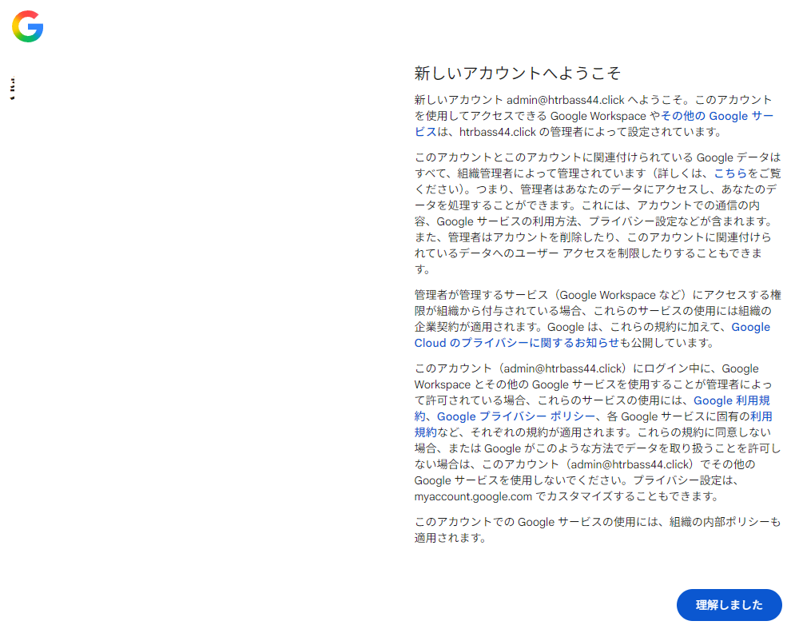

これは前述の表で示した「新しいアカウントへようこそ」画面そのもの。**組織リソースを生成する画面ではない**ので、「理解しました」を押して先に進んでよい。内容は「このアカウントは組織管理者によって管理されている」という通知であり、Cloud Identity 配下のアカウントである以上必ず表示される。

##### ステップ ⑤: 組織リソースの生成を確認する

```bash
gcloud auth login          # 管理者アカウントを選択
gcloud organizations list
```

```
DISPLAY_NAME     ID            DIRECTORY_CUSTOMER_ID
htrbass44.click  123456789012  C01abcdef
```

**✅ 確認ポイント**: 組織が 1 件返ること。`Listed 0 items.` の場合は利用規約への同意がまだ完了していない。

> **gcloud のアクティブアカウントに注意**: `gcloud auth login` 後は管理者アカウントが ACTIVE になる。請求先アカウントの管理操作（`billing.admin` が必要なもの）は元のアカウントに戻して実行する。
>
> ```bash
> gcloud config set account admin@htrbass44.click   # 演習1 以降はこちら
> gcloud auth list                                   # 現在の ACTIVE を確認
> ```
>
> AWS のプロファイル切り替えと同じ感覚で、**「今どちらのアカウントで操作しているか」を常に意識する**こと。演習1 以降の事故の大半はこれが原因になる。

> **組織を用意できない場合**: 演習 3・7 の一部（プロジェクト作成、課金リンク、予算アラート）は組織なしでも実行できる。それ以外の演習はコマンドを読んで理解する「読み物」として進めてほしい。組織階層は Google Cloud 統制の土台なので、可能なら捨てドメインを 1 つ買って実機で触ることを強く推奨する。

#### 0-3. gcloud のセットアップと変数定義

```bash
# 認証（ブラウザが開く）
gcloud auth login

# アプリケーションのデフォルト認証情報（演習9 の Terraform で使う）
gcloud auth application-default login

# バージョン確認
gcloud version
```

#### 0-4. 作業ディレクトリを有効化する

環境変数・ポリシー定義・スクリプトは、ホームディレクトリや `/tmp` ではなく **`handson/` 配下に集約**する。

```bash
cd /c/dev/handson-gcloud-cnt/handson

# 初回のみ
cp env/handson.env.example env/handson.env
# DOMAIN / PREFIX / LOCATION を埋める（ORG_ID 等は演習1・2 で自動的に書き込まれる）

# GitBash を開くたびに実行
source activate.sh
```

```
─────────────────────────────────────────────
 HANDSON_ROOT : /c/dev/handson-gcloud-cnt/handson
 読込済ライブラリ: dns.sh gcp.sh
 DOMAIN       : htrbass44.click
─────────────────────────────────────────────
```

`activate.sh` は環境変数と関数を読み込み、**cwd を `handson/` に移動する**。以降のコマンドはすべて相対パスで書ける。

| ディレクトリ | 用途 | Git |
|-------------|------|:---:|
| `env/handson.env` | 組織ID・請求先アカウント等の環境固有値 | ❌ 除外 |
| `lib/gcp.sh` | ヘルパー関数（`env_set` / `folder_id` / `op_apply` / `tree_show`） | ✅ |
| `policies/` | 組織のポリシー YAML・Deny ポリシー JSON | ✅ **残す** |
| `scripts/` | 払い出しスクリプト | ✅ |
| `tf/` | Terraform（Project Factory） | ✅（state 除く） |
| `tmp/` | 使い捨ての作業ファイル | ❌ 除外 |

> **`policies/` を使い捨てにしない理由**: 適用したガードレールの定義がそのまま残るので、**演習9 の Terraform 化の下書きになる**。実務でも「いつ・誰が・どの制約を入れたか」は監査で必ず問われる。`/tmp` に書き捨てると、この履歴が消える。

#### 0-5. `/tmp` を使うと Windows では失敗する

`gcloud` / `aws` / `terraform` は **ネイティブの Windows プログラム**で、GitBash の仮想パスを知らない。

```bash
cygpath -w /tmp
#   -> C:\Users\Yoshi\AppData\Local\Temp   ← GitBash が見る /tmp
# ネイティブプログラムに "/tmp/x.yaml" を渡すと → C:\tmp\x.yaml（存在しない）
```

```bash
# ❌ 失敗する（多くの手順書がこう書いている）
cat > /tmp/policy.yaml <<< '...'
gcloud org-policies set-policy /tmp/policy.yaml
#   -> ERROR: Unable to read file [/tmp/policy.yaml]

# ✅ 相対パスなら通る（activate.sh が cwd を handson/ にしている）
gcloud org-policies set-policy policies/policy.yaml

# ✅ 絶対パスが必要な場面では np で変換する
gcloud org-policies set-policy "$(np policies/policy.yaml)"
#   np -> C:/dev/handson-gcloud-cnt/handson/policies/policy.yaml
```

**✅ 確認ポイント**

```bash
gcloud auth list          # 自分のアカウントが ACTIVE
echo "$HANDSON_ROOT"      # /c/dev/handson-gcloud-cnt/handson
np policies/test.yaml     # C:/dev/... 形式で返る
```

**ここで学んだこと**: Google Cloud の組織リソースは ID 基盤（Cloud Identity）に従属する。「まず組織を作る」ではなく「まず ID 基盤を作る」が正しい順序。作業ファイルは最初から**リポジトリ内の決まった場所**に置く。ガードレールの定義は使い捨てではなく資産である。

---

### 演習1: 組織の把握と初期統制

**目的**: 組織 ID を取得し、「既定でドメイン全員がプロジェクトを作れる」という初期状態を潰して、払い出しを統制下に置く。

#### 1-1. 組織 ID と請求先アカウント ID を取得する

```bash
gcloud organizations list
```

```
DISPLAY_NAME  ID            DIRECTORY_CUSTOMER_ID
example.com   123456789012  C01abcdef
```

```bash
gcloud billing accounts list
```

得られた値を `env_set` で `env/handson.env` に書き込む。**手で編集せず関数で入れる**ことで、シェルを開き直しても値が残り、タイプミスも防げる。

```bash
env_set ORG_ID          "123456789012"
env_set BILLING_ACCOUNT "0X0X0X-0X0X0X-0X0X0X"
```

Cloud Identity の顧客 ID（`C01abcdef`）は演習5 の `iam.allowedPolicyMemberDomains` で使うので、これも保存しておく。

```bash
env_set CUSTOMER_ID "$(gcloud organizations describe $ORG_ID \
  --format='value(owner.directoryCustomerId)')"
```

**✅ 確認ポイント**: 新しい GitBash を開いて `source activate.sh` すると、ヘッダに `ORG_ID` と `BILLING` が表示される。

#### 1-2. 現状の組織 IAM を棚卸しする

```bash
gcloud organizations get-iam-policy $ORG_ID --format=yaml
```

出力に次のようなバインディングがあるはず。**これが「誰でも勝手に環境を作れる」状態**である。

```yaml
bindings:
- members:
  - domain:example.com
  role: roles/resourcemanager.projectCreator
- members:
  - domain:example.com
  role: roles/billing.creator
```

#### 1-3. ドメイン全体からプロジェクト作成権限を剥がす

AWS で言えば「誰でも新規アカウントを作れる」状態を止める操作。**払い出しの入口を 1 本にする**、統制の要である。

##### なぜ `domain:` バインディングが危険か

`domain:example.com` は特定の誰かではなく、**そのドメインの全ユーザーを指す動的なグループ**である。

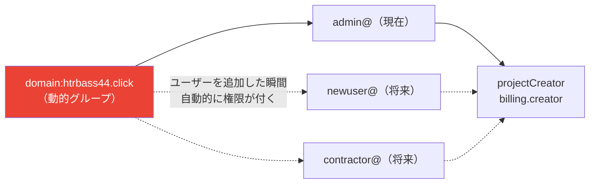
```mermaid
graph LR
    D["domain:htrbass44.click<br/>（動的グループ）"] --> U1["admin@（現在）"]
    D -.->|"ユーザーを追加した瞬間<br/>自動的に権限が付く"| U2["newuser@（将来）"]
    D -.-> U3["contractor@（将来）"]
    U1 --> P["projectCreator<br/>billing.creator"]
    U2 -.-> P
    U3 -.-> P

    style D fill:#EA4335,color:#fff
```

いま組織にユーザーが 1 人しかいなくても、**Cloud Identity にユーザーを追加した瞬間、そのユーザーにも自動でこの権限が付く**。AWS で言えば「新入社員が入社した瞬間、誰でも新規アカウントを開設できる」状態にあたる。

##### ⚠️ 順序が重要：付与してから剥奪する

`roles/resourcemanager.organizationAdmin` には **`resourcemanager.projects.create` も `resourcemanager.folders.create` も含まれていない**。実際に確認できる。

```bash
gcloud iam roles describe roles/resourcemanager.organizationAdmin \
  --format="value(includedPermissions)" | tr ';' '\n' | grep -E "projects\.create|folders\.create"
#   -> （何も返らない）
```

| ロール | 主な権限 | プロジェクト作成 |
|--------|----------|:---:|
| `organizationAdmin` | 組織/フォルダ/プロジェクトの **IAM 変更**、参照 | ❌ **できない** |
| `projectCreator` | プロジェクトの作成 | ✅ |
| `folderAdmin` | フォルダの作成・変更 | ✅（フォルダ） |

つまり `domain:` の `projectCreator` を先に剥がすと、**組織管理者である自分自身もプロジェクトを作れなくなる**。`organizationAdmin` があるので IAM を直せば復旧はできるが、**自分の代替手段を確保してから既存権限を落とす**のが原則。

**ステップ 1: 先に自分へ明示的に権限を付与する**

```bash
export ME=$(gcloud config get-value account)

for R in resourcemanager.projectCreator \
         resourcemanager.folderAdmin \
         orgpolicy.policyAdmin \
         iam.denyAdmin \
         logging.configWriter; do
  gcloud organizations add-iam-policy-binding $ORG_ID \
    --member="user:${ME}" --role="roles/${R}" >/dev/null
  echo "  granted: roles/${R}"
done
```

| ロール | 何のために必要か |
|--------|------------------|
| `resourcemanager.projectCreator` | 演習3 のプロジェクト払い出し |
| `resourcemanager.folderAdmin` | 演習2 のフォルダ階層構築 |
| `orgpolicy.policyAdmin` | 演習5 の組織のポリシー |
| `iam.denyAdmin` | 演習6 の Deny ポリシー |
| `logging.configWriter` | 演習8 の組織シンク |

**ステップ 2: ドメイン全体から剥奪する**

```bash
gcloud organizations remove-iam-policy-binding $ORG_ID \
  --member="domain:${DOMAIN}" \
  --role="roles/resourcemanager.projectCreator"

gcloud organizations remove-iam-policy-binding $ORG_ID \
  --member="domain:${DOMAIN}" \
  --role="roles/billing.creator"
```

**✅ 確認ポイント**: `domain:` のバインディングが 1 つも残っていないこと。

```bash
gcloud organizations get-iam-policy $ORG_ID --format=yaml | grep -c "domain:"
#   -> 0
```

#### 1-4. Essential Contacts を設定する

課金・セキュリティ・法務などのカテゴリ別に、Google からの重要通知の宛先を組織レベルで設定する。個人アカウント宛に来て見落とす事故を防ぐ。

```bash
gcloud essential-contacts create \
  --email="cloud-billing@${DOMAIN}" \
  --notification-categories="billing" \
  --language="ja" \
  --organization=$ORG_ID
```

**⚠️ 2024年5月以降に作成した組織では、これが失敗する場合がある**

```
ERROR: (gcloud.essential-contacts.create) FAILED_PRECONDITION: Precondition check failed.
  reason: CUSTOM_ORG_POLICY_VIOLATION
  customConstraints: constraints/essentialcontacts.managed.allowedContactDomains
```

1.5 節で述べたベースライン制約により、**組織の検証済みドメイン以外のメールアドレスは登録できない**。個人の Gmail 等を直接指定するとここで弾かれる。

```bash
# ❌ 失敗する（gmail.com は組織外のドメイン）
gcloud essential-contacts create --email="you@gmail.com" ...

# ✅ 成功する（組織自身のドメイン）
gcloud essential-contacts create \
  --email="admin@${DOMAIN}" \
  --notification-categories="billing,security,suspension,technical" \
  --language="ja" \
  --organization=$ORG_ID
```

> **これは仕様として正しい**。Essential Contacts は「組織に属する管理された ID」にのみ通知を送る設計であり、外部の個人アドレスへ機密性の高い通知（セキュリティアラート等）が漏れることを防いでいる。AWS のアカウント連絡先が誰でも設定できるのとは対照的。

**カテゴリを追加・変更する場合**（`create` ではなく既存の連絡先を更新）

```bash
gcloud essential-contacts list --organization=$ORG_ID
#   -> name: organizations/xxx/contacts/0 のように ID が確認できる

gcloud essential-contacts update 0 \
  --organization=$ORG_ID \
  --notification-categories="billing,security,suspension,technical"
```

指定できるカテゴリ: `all`, `billing`, `legal`, `product-updates`, `security`, `suspension`, `technical`, `technical-incidents`

> ⚠️ **`technical-incidents` は指定できない場合がある**。このカテゴリは **Premium Support 契約者向け**の重大障害専用通知チャネルで、通常サポートでは以下のエラーになる。
>
> ```
> ERROR: INVALID_ARGUMENT: The given Contact's notification category subscriptions
> contains TECHNICAL_INCIDENTS when the parent resource is not opted in to
> technical incident notifications.
> ```
>
> 一般的な技術通知が欲しい場合は `technical`（Premium Support 不要）を使う。`technical-incidents` は Premium Support のオプトイン設定を組織で有効化しないと使えない。

##### ここで発生する実務上の課題：`admin@${DOMAIN}` は実在するメールボックスではない

Cloud Identity **Free** は Gmail をホストしない（0-2 節参照）。したがって `admin@${DOMAIN}` は Essential Contacts への**登録は通る**が、**実際には誰にも届かない**。組織の検証済みドメインという条件と、そのドメインでメールを受信できることは別の話である。

| 選択肢 | 内容 | 本番での位置づけ |
|--------|------|------------------|
| このまま（未達を許容） | 学習用途として割り切る | 不可（実務では必ず解決が必要） |
| **DNS に MX レコードを追加し、無料転送サービス経由で実メールボックスへ届ける** | Route 53 で MX を設定 | 小規模組織の現実解 |
| Google Workspace に契約変更 | 実メールボックスを持つ | 中〜大規模組織の標準解 |

MX レコードは DNS ハンズオンの演習5 で扱った A・TXT と同じ「レコードの一種」であり、「このドメイン宛のメールを誰が処理するか」を示す。設定手順は [DNS ハンズオンの演習8（メール転送を設定する）](./dns-route53-handson.md#演習8-メール転送を設定するmxレコード) を参照。

**✅ 確認ポイント**

```bash
# ドメイン全体のバインディングが消えている（演習1-3の結果）
gcloud organizations get-iam-policy $ORG_ID --format=yaml | grep -A2 "projectCreator"

# 連絡先が登録されている
gcloud essential-contacts list --organization=$ORG_ID
```

**ここで学んだこと**: 「組織作成直後の Google Cloud は AWS Organizations の既定よりゆるい」という通説は、**IAM の権限付与に関しては今も正しい**が、**一部の組織のポリシー（Essential Contacts のドメイン制限を含む）に関してはもう正しくない**。2024年5月以降の新規組織は、一部のガードレールを初日から持っている。

---

### 演習2: フォルダ階層の構築

**目的**: AWS の OU に相当するフォルダ階層を作り、「境界をどこに引くか」を体で理解する。

#### 2-1. 設計方針を決める

Google Cloud のランディングゾーン設計ガイドは、大きく 3 つの型を挙げている。

| 型 | 分け方 | 向いているケース |
|----|--------|------------------|
| 環境ベース | prod / nonprod / dev | 環境ごとにポリシーと権限を変えたい（**最も一般的**） |
| 地域・子会社ベース | APAC / EMEA、subsidiary-1 / -2 | 多国籍・M&A で運用主体が独立している |
| プロダクト・責任ベース | ecommerce / logistics | 各プロダクトチームがライフサイクル全体を所有 |

いずれの型でも、**組織直下に `bootstrap`（払い出し基盤自身）と `common`（共通サービス）を置く**のが定石。今回は環境ベースで進める。

> **やってはいけないこと**: 社内の組織図（本部→部→課）をそのままフォルダにマッピングすること。組織改編のたびに階層を作り直すことになる。**運用上の境界（環境・ポリシー・権限の切れ目）**でフォルダを切る。

#### 2-2. 第 1 階層をコンソールで作る

**この演習は Google Cloud コンソール（マネジメントコンソール）から作成する。** gcloud CLI と GUI では同じ API を叩いているだけなので、どちらで作っても後続の演習に影響しない。CLI 版のコマンドは 2-2b に参考として残す。

1. `admin@htrbass44.click` でログインした状態で、リソースの管理ページを開く: <https://console.cloud.google.com/cloud-resource-manager>
2. ページ上部の**組織の選択ドロップダウン**で `htrbass44.click` が選ばれていることを確認する
3. **「フォルダを作成」**（Create folder）をクリックする

   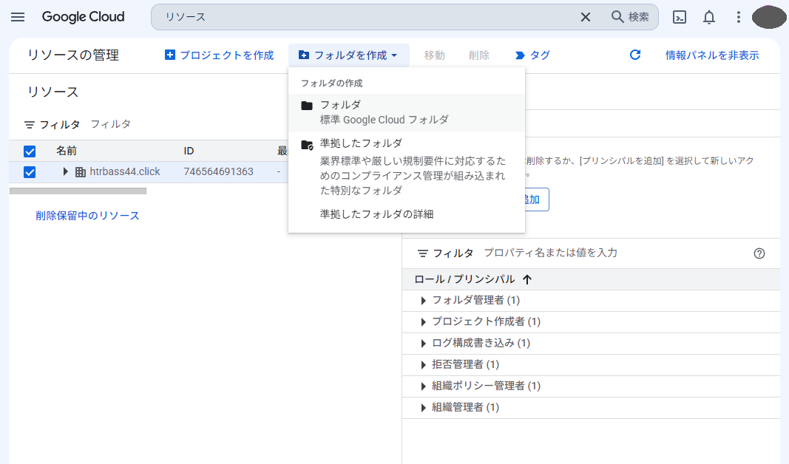

   - 「フォルダ」（標準 Google Cloud フォルダ）と「準拠したフォルダ」（業界標準や規制要件向けの Assured Workloads フォルダ）の選択肢が出る。今回は**「フォルダ」（標準）**を選ぶ
4. **フォルダ名**に `bootstrap` と入力する
   - 命名規則: 3〜30 文字、先頭と末尾は英数字、使えるのは英数字・スペース・ハイフン・アンダースコアのみ、兄弟フォルダ内で一意
5. **移動先**（Destination）で「参照」を押し、組織 `htrbass44.click` を選択する（第1階層なので親は組織そのもの）
6. **「作成」**をクリックする
7. 同じ手順を `common` / `prod` / `nonprod` / `sandbox` の 4 つについても繰り返す

> 作成直後は一覧に反映されるまで数分かかることがある（バックエンドの伝播待ち）。表示されない場合はページを再読み込みする。

**✅ 確認ポイント**: リソースの管理ページのツリー表示に、5 つのフォルダが組織直下に並んでいる。

#### 2-2b. （参考）同じ操作を CLI で行う場合

```bash
for f in bootstrap common prod nonprod sandbox; do
  gcloud resource-manager folders create \
    --display-name="$f" \
    --organization="$ORG_ID"
done
```

#### 2-2c. 作成したフォルダの ID を環境に取り込む

コンソールで作った場合も、**ID の取得だけは CLI で行う**。以降の演習（5・6・8等）でフォルダ ID を組織のポリシーやログシンクの適用先として使い続けるため、`env/handson.env` に保存しておく。`folder_id` と `env_set` は [`lib/gcp.sh`](../handson/lib/gcp.sh) で定義済み。

```bash
env_set F_BOOTSTRAP "$(folder_id bootstrap)"
env_set F_COMMON    "$(folder_id common)"
env_set F_PROD      "$(folder_id prod)"
env_set F_NONPROD   "$(folder_id nonprod)"
env_set F_SANDBOX   "$(folder_id sandbox)"
```

```
  F_BOOTSTRAP = 987654321098
  F_COMMON    = 876543210987
  ...
```

> コンソールでフォルダを開くと、URL に `folders/123456789012` の形でフォルダ ID が表示される。`env_set` の代わりにここから目視で拾って手入力してもよいが、**入力ミスが起きやすいので `folder_id` 関数での取得を推奨**する。

#### 2-3. 第 2 階層（チーム用フォルダ）をコンソールで作る

`prod` フォルダと `sandbox` フォルダのそれぞれに `team-a` フォルダを作る。手順は 2-2 と同じだが、**移動先（親）を組織ではなく該当フォルダにする**。

> **なぜ `nonprod` ではなく `sandbox` なのか**: 教材の既定は環境ベース（prod/nonprod）の分割だが、小規模なチームでは「本番」と「それ以外（開発・検証をまとめて sandbox で扱う）」の2階層まで単純化することも多い。`nonprod` フォルダは階層としては残すが、本ハンズオンでは `team-a` の実働はすべて `sandbox` 側で行う。**`sandbox` は演習5で外部IP禁止・公開バケット禁止といった強い制約を持つ設計**なので、「制約の強い環境でもチーム単位の例外を作れる」ことを示す教材にもなる。

1. リソースの管理ページのツリーで `prod` フォルダを開く（クリックして中に入る）
2. 「フォルダを作成」→ フォルダ名 `team-a` → 移動先は「参照」で `prod` を選択（すでに `prod` の中にいれば自動的に選択されていることもある）→ 作成
3. 同様に `sandbox` フォルダの中で `team-a` を作成する

```bash
# folder_id の第2引数に親フォルダIDを渡すと、その直下から探す
env_set F_PROD_TEAMA    "$(folder_id team-a "$F_PROD")"
env_set F_SANDBOX_TEAMA "$(folder_id team-a "$F_SANDBOX")"
```

> **なぜ `env_set` を使うのか**: フォルダ ID は 12 桁の数字で、演習5 以降のポリシー適用先としてずっと使い続ける。シェル変数だけだと GitBash を閉じた瞬間に失われ、毎回 `folders list` から探し直すことになる。**取得と同時にファイルに書く**のが正解。コンソールで作業していても、この ID 保存の一手間だけは CLI に戻ってくる必要がある。

**（参考）CLI 版**

```bash
gcloud resource-manager folders create --display-name="team-a" --folder="$F_PROD"
gcloud resource-manager folders create --display-name="team-a" --folder="$F_SANDBOX"
```

**✅ 確認ポイント**: ここまでの作業をコンソールと CLI の両方から検証する。GUI で作ったものが CLI から見えることを確認しておくと、「結局同じ API を叩いている」という実感が持てる。

```bash
# 組織直下のフォルダ一覧
gcloud resource-manager folders list --organization=$ORG_ID

# prod 配下
gcloud resource-manager folders list --folder=$F_PROD
```

階層全体をツリーで見るヘルパーも用意してある。

```bash
tree_show
```

```
organizations/123456789012
├─ bootstrap (987654321098)
├─ common (876543210987)
├─ nonprod (765432109876)
├─ prod (543210987654)
│  ├─ team-a (432109876543)
├─ sandbox (321098765432)
│  ├─ team-a (210987654321)
```

コンソールのツリー表示（<https://console.cloud.google.com/cloud-resource-manager>）と見比べて、同じ構造になっていることを確認する。

**制約の確認**（覚えておくべき数字）

| 項目 | 上限 |
|------|------|
| フォルダの階層の深さ | 10 階層 |
| 1 つの親が持てる子フォルダ数 | 300 |
| フォルダ作成 API のレート | 6 リクエスト/分（**大量作成時は待たされる**） |

**ここで学んだこと**: フォルダは「ポリシーと権限の継承単位」。組織図ではなく、**同じガードレール・同じ権限を適用したい塊**でフォルダを切る。フォルダ作成 API はレート制限が厳しいので、大規模階層は Terraform で並列度を落として流す。

---

### 演習3: プロジェクトの払い出し

**目的**: 「チームからの依頼 → 使える環境の受け渡し」までの一連の流れを手作業で通し、自動化すべきステップを洗い出す。

#### 3-1. 払い出しの標準フロー

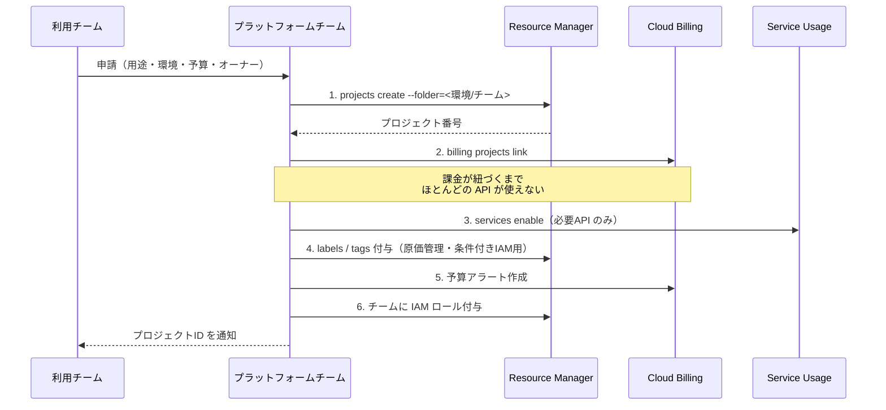
```mermaid
sequenceDiagram
    participant Team as 利用チーム
    participant Plat as プラットフォームチーム
    participant RM as Resource Manager
    participant Bill as Cloud Billing
    participant SU as Service Usage

    Team->>Plat: 申請（用途・環境・予算・オーナー）
    Plat->>RM: 1. projects create --folder=<環境/チーム>
    RM-->>Plat: プロジェクト番号
    Plat->>Bill: 2. billing projects link
    Note over Plat,Bill: 課金が紐づくまで<br/>ほとんどの API が使えない
    Plat->>SU: 3. services enable（必要API のみ）
    Plat->>RM: 4. labels / tags 付与（原価管理・条件付きIAM用）
    Plat->>Bill: 5. 予算アラート作成
    Plat->>RM: 6. チームに IAM ロール付与
    Plat-->>Team: プロジェクトID を通知
```

#### 3-2. プロジェクトを作る（コンソール）

プロジェクト ID は**全世界で一意・後から変更不可**。命名規約を先に決める。ここでは `{prefix}-{team}-{app}-{env}` とし、末尾にランダムサフィックスを付けて衝突を避ける。サフィックスだけは事前に発行して控えておく（コンソールでは乱数生成できないため）。

```bash
source /c/dev/handson-gcloud-cnt/handson/activate.sh
export SUFFIX=$(openssl rand -hex 3)
echo "PROJ_DEV candidate: ${PREFIX}-teama-api-dev-${SUFFIX}"
```

1. リソースの管理ページ（<https://console.cloud.google.com/cloud-resource-manager>）で **「プロジェクトを作成」** をクリックする
2. **プロジェクト名**を入力する
   - 名前は 4〜30文字。英数字・ハイフン・スペース・アポストロフィ・感嘆符が使える
   - 教材の既定は `{prefix}-{team}-{app}-{env}`（ランダムサフィックス付き）だが、**組織のドメイン名を接頭辞にする** `{organization}-{team}-api-dev` のような命名規約でもよい。プロジェクト ID の衝突を避けられれば方式は自由
3. 自動生成される**プロジェクト ID** を確認する。編集したい場合は右の「編集」を押す
4. **請求先アカウント**のドロップダウンで、演習1で使っている請求先アカウントを選択する（**この画面で課金までまとめて設定できる**。演習3-3 は本来ここで完了する）
5. **親リソース**で「参照」を押し、`htrbass44.click` → `sandbox` → `team-a` と辿って選択する
   - `prod` にも同名の `team-a` フォルダがあるため、**パンくず（階層のパス表示）で `sandbox` 配下であることを必ず確認**する
6. **「作成」**をクリックする

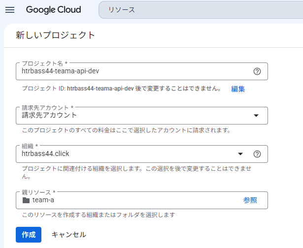

> **ラベルはこの画面では設定できない**。Google Cloud コンソールの新規プロジェクト作成ダイアログには label 入力欄が無く、**作成後に別画面で追加**する仕様になっている（3-5 で行う）。CLI の `gcloud projects create --labels=...` は作成と同時に付けられるが、コンソールにはこの機能が無い ── **GUI と CLI で操作の粒度が異なる好例**。

作成が終わると、リソースの管理ページのツリーに新しいプロジェクトが表示される。**`sandbox > team-a` の配下に正しくネストされていることを確認する**のが重要。

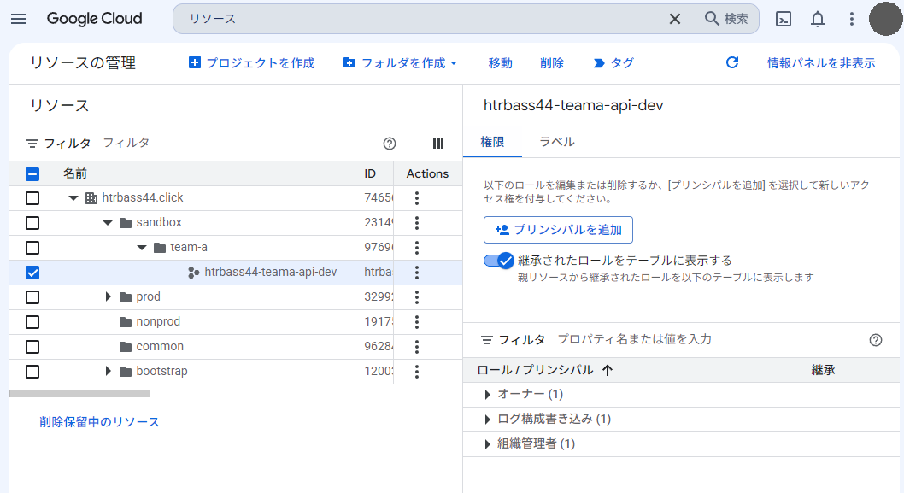

右側の情報パネルには、そのプロジェクトに効いている IAM ロール（オーナー・ログ構成書き込み・組織管理者）が並ぶ。「継承されたロールをテーブルに表示する」がオンになっているため、**プロジェクト自身に直接付与されたロールと、親フォルダ／組織から継承したロールが混在して見える**。「組織管理者」は演習1で `admin@htrbass44.click` に付与した組織全体のロールが継承されてここに現れている。

作成後、プロジェクト ID を控えておく（以降のコマンドで使う）。

```bash
env_set PROJ_DEV "htrbass44-teama-api-dev"   # 実際に作成した ID に置き換え
```

#### 3-3. 請求先アカウントのリンクを確認する

3-2 の手順4 で請求先アカウントを選択していれば、この時点で**課金は既にリンク済み**。CLI で確認するだけでよい。

```bash
gcloud billing projects describe "$PROJ_DEV" --format="value(billingEnabled,billingAccountName)"
```

`billingEnabled: True` になっていれば OK。もし `False` の場合（作成時に請求先アカウントを選ばなかった場合）は、コンソールの「お支払い」ページから該当プロジェクトにリンクし直す。

> **権限の分離ポイント**: 請求先アカウントをプロジェクトにリンクするには、請求先アカウント側の `roles/billing.user` と、プロジェクト側の `roles/billing.projectManager`（または Owner）の**両方**が必要。つまり「プロジェクトを作れる人」と「課金を紐づけられる人」を分離できる。財務部門に請求先アカウント管理を残すときはこの分離を使う。

#### 3-4. 必要な API だけ有効化する（コンソール）

1. 左側のナビゲーションメニューから **「API とサービス」→「ライブラリ」** を開く（プロジェクトセレクタで `$PROJ_DEV` が選ばれていることを確認）

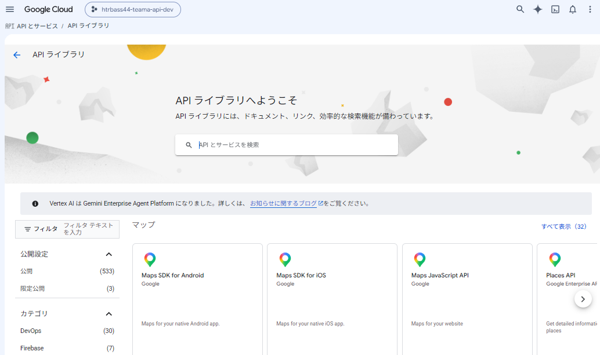

   > **プロジェクトセレクタの確認が最重要**。画面左上、Google Cloud ロゴの右にあるバッジが操作対象のプロジェクトを示す。ここが演習3-2で作成したプロジェクトになっていないと、意図しないプロジェクトに API を有効化してしまう。

2. 検索ボックスで有効化したい API を検索し、結果をクリックして **「有効にする」** を押す
3. 次の 4 つについて繰り返す

| 表示名で検索 | API 名 |
|---|---|
| Compute Engine API | `compute.googleapis.com` |
| Cloud Logging API | `logging.googleapis.com` |
| Cloud Monitoring API | `monitoring.googleapis.com` |
| Cloud Resource Manager API | `cloudresourcemanager.googleapis.com` |

**✅ 確認ポイント**（CLI で一覧確認）

```bash
gcloud services list --enabled --project="$PROJ_DEV"
```

#### 3-5. label と tag を付ける（違いを体感する）

**label**（課金レポートの分類用）

コンソールでは 3-2 で設定できなかったので、ここで追加する。

1. リソースの管理ページで `$PROJ_DEV` の行にチェックを入れる（または左のチェックボックス）
2. 右側に開く情報パネルの **「ラベル」** タブを開く
3. **「+ ラベルを追加」** を押し、`env` / `sandbox`、`team` / `team-a`、`cost-center` / `cc1001` の3組を入力する
4. **「保存」**

```bash
# 確認
gcloud projects describe "$PROJ_DEV" --format="value(labels)"
```

**tag**（IAM 条件・組織のポリシー条件に使える。こちらが本命）

**⚠️ 事前にロールが必要**: 演習1-3 で付与した6ロール（`organizationAdmin` 等）には**タグ管理の権限が含まれていない**。`organizationAdmin` は「組織の IAM を変更する権限」であって「タグを操作する権限」ではないため、このままコンソールの「タグ」ページを開くとエラーになる。

```
追加のアクセス権が必要です
組織 に対する追加のアクセス権が必要です: htrbass44.click
resourcemanager.tagKeys.list（権限がありません）
```

先に専用ロールを付与しておく。

```bash
gcloud organizations add-iam-policy-binding $ORG_ID \
  --member="user:admin@htrbass44.click" --role="roles/resourcemanager.tagAdmin"
gcloud organizations add-iam-policy-binding $ORG_ID \
  --member="user:admin@htrbass44.click" --role="roles/resourcemanager.tagUser"
```

| ロール | 権限 |
|---|---|
| `roles/resourcemanager.tagAdmin` | タグキー・タグ値の作成/管理 |
| `roles/resourcemanager.tagUser` | タグ値をリソースにバインド |

> 付与直後にブラウザで開くとまだエラーのままのことがある。IAM の反映自体は即時（CLI で `gcloud resource-manager tags keys list --parent="organizations/${ORG_ID}"` を叩けば確認できる）だが、**コンソールの権限チェック結果がキャッシュされている**ことがあるため、**強制再読み込み**（`Ctrl+Shift+R`）で解消する。

タグキー・タグ値の定義は組織で1回だけ行う。

1. コンソール左上の検索から **「IAM と管理」→「タグ」** を開く
2. スコープ選択で組織 `htrbass44.click` を選ぶ

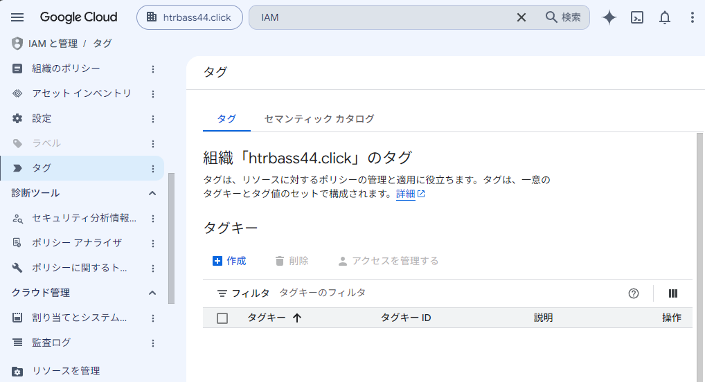

3. **「作成」** を押し、**タグキー**に `environment` と入力
   - ⚠️ **末尾にスペースを入れないこと**。コンソールは前後の空白を検証・除去しないため、`"environment "` のような値がそのまま登録されてしまう。**`short_name` は作成後に変更できない**ため、間違えるとタグキーを削除して作り直すしかない
4. 「事前定義された値」を選び、**「値を追加」** で `dev` と `prod` をそれぞれ登録する
5. **「タグキーを作成」**

作成したタグをプロジェクトにバインドする。

1. リソースの管理ページで `$PROJ_DEV` を選び、**タグ** アイコンをクリック
2. パネルで「スコープを選択」→ 組織を選ぶ
3. **「タグを追加」** → キー: `environment` / 値: `dev` を選択 → **「保存」** → **「確認」**

```bash
# CLI から確認する場合
export PROJ_DEV_NUM=$(gcloud projects describe "$PROJ_DEV" --format="value(projectNumber)")
gcloud resource-manager tags bindings list \
  --parent="//cloudresourcemanager.googleapis.com/projects/${PROJ_DEV_NUM}"
```

| | label | tag |
|---|-------|-----|
| 用途 | 課金レポート・検索の分類 | **IAM 条件・組織のポリシー条件のキー** |
| 定義場所 | リソースごとに自由記述 | 組織/プロジェクトで**キーと値を事前定義** |
| 継承 | しない | **フォルダから継承する** |
| 上限 | 64 個/リソース | 50 ペア/リソース、1,000 キー/組織 |
| コンソールでの作成場所 | リソースの管理 → 情報パネル「ラベル」タブ | IAM と管理 → タグ |

> フォルダにタグをバインドすれば配下のプロジェクトが継承する。「prod タグが付いたプロジェクトでのみ、この権限を有効化する」といった条件付き IAM が組める。**AWS のタグポリシー＋条件キーに相当するのは label ではなく tag** である。

**（参考）CLI 版一式**

```bash
gcloud projects create "$PROJ_DEV" \
  --name="team-a api (dev)" --folder="$F_SANDBOX_TEAMA" \
  --labels="env=sandbox,team=team-a,cost-center=cc1001"
gcloud billing projects link "$PROJ_DEV" --billing-account="$BILLING_ACCOUNT"
gcloud services enable compute.googleapis.com logging.googleapis.com \
  monitoring.googleapis.com cloudresourcemanager.googleapis.com --project="$PROJ_DEV"
gcloud resource-manager tags keys create environment --parent="organizations/${ORG_ID}"
export TAGKEY=$(gcloud resource-manager tags keys list --parent="organizations/${ORG_ID}" \
  --filter="shortName=environment" --format="value(name)")
gcloud resource-manager tags values create dev --parent="$TAGKEY"
export TAGVAL_DEV=$(gcloud resource-manager tags values list --parent="$TAGKEY" \
  --filter="shortName=dev" --format="value(name)")
gcloud resource-manager tags bindings create --tag-value="$TAGVAL_DEV" \
  --parent="//cloudresourcemanager.googleapis.com/projects/${PROJ_DEV_NUM}"
```

**✅ 確認ポイント**

```bash
gcloud projects describe "$PROJ_DEV"          # parent が folder になっている
gcloud billing projects describe "$PROJ_DEV"  # billingEnabled: true
gcloud resource-manager tags bindings list \
  --parent="//cloudresourcemanager.googleapis.com/projects/${PROJ_DEV_NUM}"
```

**ここで学んだこと**: 払い出しは最低 6 ステップの定型作業。**コンソールと CLI では操作の粒度が違う**（label は CLI なら作成と同時に付けられるがコンソールでは別操作）。手作業では抜け漏れが必ず出るので、演習9 で自動化する。プロジェクト ID の命名規約と、label / tag の使い分けは**最初に決めないと後戻りできない**。

---

### 演習4: IAM 設計と権限委譲

**目的**: 「プラットフォームチームだけが払い出せて、利用チームは自分のフォルダ内だけを触れる」構造を作る。さらに、**実際の運用を想定した一連の流れ**（新しいメンバーが加わる → 既存のグループに入れる → 何もIAM設定をいじらずにプロジェクトへアクセスできるようになる）を最後まで通す。

**この演習は長いので、先に全体地図を示す**

| 項 | 何をするか | 一言で |
|---|---|---|
| 4-0 | IAM の基本公式を理解する（読み物） | プリンシパル・ロール・バインディングの関係 |
| 4-1 | グループを作る | 権限付与の受け皿（Admin コンソール） |
| 4-2 | フォルダにロールを付与する | `sandbox`=編集者、`prod`=閲覧者 |
| 4-2b | 新メンバーをオンボーディングする | ユーザー作成 → グループ参加 → サービス制限 |
| 4-3 | 払い出し専用サービスアカウントを作る | `project-factory` に各種ロールを付与 |
| 4-4 | カスタムロールを定義する | `lzAuditor`（**バインドはしない**、定義のみ） |
| 4-5 | 継承を確認する | コンソール／トラブルシューターで実効権限を裏取り |

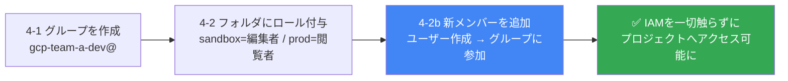
```mermaid
flowchart LR
    A["4-1 グループを作成<br/>gcp-team-a-dev@"] --> B["4-2 フォルダにロール付与<br/>sandbox=編集者 / prod=閲覧者"]
    B --> C["4-2b 新メンバーを追加<br/>ユーザー作成 → グループに参加"]
    C --> D["✅ IAMを一切触らずに<br/>プロジェクトへアクセス可能に"]

    style C fill:#4285F4,color:#fff
    style D fill:#34A853,color:#fff
```

> **プロジェクトの払い出し（演習3）とユーザーの払い出し（このあと）は別プロセス**。演習3では「資源の箱」を作っただけで、人は一切登場しなかった。この演習4で、その箱に「誰が」「どうやって」入れるようになるかを完成させる。

#### 4-0. IAM の基本公式（この先すべての土台）

演習4-2以降で繰り返し出てくる「プリンシパルを追加」「ロールを選択」という操作が何をしているのか、先に構造を理解しておく。

**プリンシパル（Principal）＝「誰が」**

アクセスを要求する側の身元の総称。

| プリンシパルの種類 | 表記例 |
|---|---|
| 個人ユーザー | `user:admin@htrbass44.click` |
| **グループ** | `group:gcp-team-a-dev@htrbass44.click` |
| サービスアカウント | `serviceAccount:project-factory@...` |
| ドメイン全体 | `domain:htrbass44.click` |

**グループ自体も1つのプリンシパルとして扱える**のがポイント。複数人をまとめて指定できるのはこのため。

**ロール（Role）＝「何ができるか」**

ロールは単体の権限ではなく、**個々の権限（permission）をまとめた「束」**。

```
permission（最小単位）    例: compute.instances.create
   ↓ 束ねると
role（権限の束）
```

束ね方の粒度は様々で、たとえば `roles/editor`（編集者）には **11,911個**の permission が含まれる一方、演習4-4で作るカスタムロール `lzAuditor` は**わずか7個**に絞り込む。

```bash
# 実際に数えて確認できる
gcloud iam roles describe roles/editor --format="value(includedPermissions)" | tr ';' '\n' | wc -l
```

**バインディング（Binding）＝実際の許可**

プリンシパルとロールは、単体では何も起きない。**「リソース」を加えた3つが揃って初めて、1つの許可になる。**

```
バインディング = リソース + プリンシパル + ロール
```

演習4-2でこれから行う操作を、この式に当てはめるとこうなる。

```
フォルダ「sandbox/team-a」  +  group:gcp-team-a-dev@  +  roles/editor
       (リソース)              (プリンシパル)              (ロール)
              ↓
「gcp-team-a-dev@ というグループは、sandbox/team-a フォルダ以下で、
  roles/editor に含まれる操作を実行してよい」
```

3層構造で整理すると：

```
permission（最小単位）
   ↓ 束ねると
role（権限の束）
   ↓ プリンシパル・リソースと組み合わせると
binding（実際の許可）  ← コンソールで「プリンシパルを追加」する操作は、これを1件作ること
```

> **演習6（Cloud Identity ハンズオン）との接続**: グループに新しいユーザーを追加しても、**バインディングは1件も増えない**。増えるのはグループの「メンバー名簿」だけで、IAM 側の許可（プリンシパル＝グループのバインディング）は演習4-2で作った1件のまま変わらない。プリンシパルがグループである以上、その名簿に載っている全員に効果が及ぶ、という仕組みである。

#### 4-1. グループを起点にする（個人ユーザーに直接付けない）（コンソール）

Google Cloud IAM のベストプラクティスは **Google グループ単位での付与**。人事異動のたびに IAM を触らなくて済む。

**⚠️ ここだけ別のコンソールを使う**。グループは Cloud Identity / Google Workspace の機能で、`console.cloud.google.com`（Google Cloud コンソール）ではなく **`admin.google.com`（Google 管理コンソール）** で作成する。ここまで使ってきた画面とは別物。

1. <https://admin.google.com> を開く（`admin@htrbass44.click` でログイン）

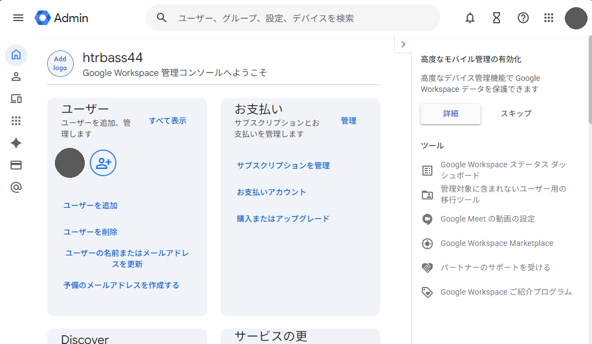

   > 左上のロゴが「Google Cloud」ではなく「Admin」になっている点で見分けられる。ドメイン名（`htrbass44`）がそのまま組織名として表示されている。

2. 左メニューから **「ディレクトリ」→「グループ」** を開く
3. 上部の **「グループを作成」** をクリック
4. **グループ名**に `GCP team-a developers`、**グループのメールアドレス**に `gcp-team-a-dev` と入力する（`@htrbass44.click` は自動で付く）

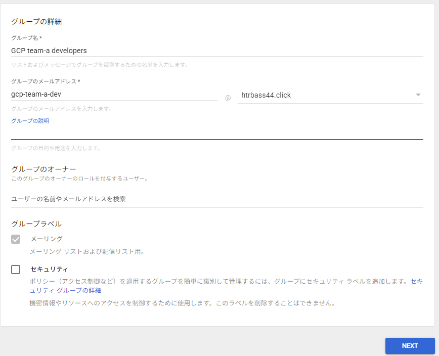

   > **「グループラベル」の「セキュリティ」にチェックを入れることを推奨**。説明文にあるとおり「機密情報やリソースへのアクセスを制御するために使用」するラベルで、このグループはまさにこの後 IAM ロールの付与対象になる。**削除できない設定**なので、意図して選ぶこと。

5. アクセス設定は **「チーム」**（Team）を選択（組織内からの参加・投稿を想定）— 実際にはこれが既定値になっている

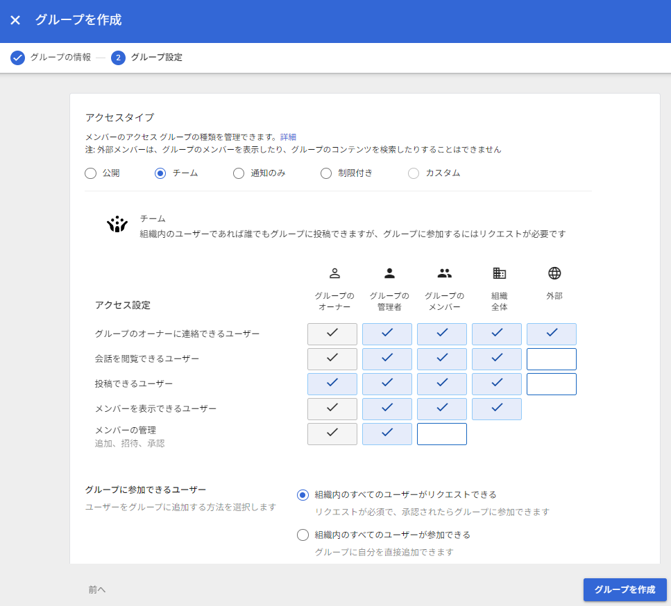

   > 「チーム」は「組織内のユーザーであれば誰でもグループに投稿できるが、参加にはリクエストが必要」という設定。今回のような IAM 権限付与用グループでは、参加を承認制にしておくことで**意図しないメンバー追加を防げる**。「グループに参加できるユーザー」は既定の「組織内のすべてのユーザーがリクエストできる」のままでよい。

6. 「グループを作成」で確定する

> **API がエラーになる場合、あるいは Admin コンソールへのアクセス権が無い場合**: 以降の演習ではグループが無くても `user:admin@htrbass44.click` で代替できる。学習目的なら省略しても支障はない。

**（参考）CLI 版**

```bash
gcloud identity groups create "gcp-team-a-dev@${DOMAIN}" \
  --organization="$CUSTOMER_ID" \
  --display-name="GCP team-a developers" \
  --labels="cloudidentity.googleapis.com/groups.discussion_forum"
```

#### 4-2. フォルダ単位でロールを付与する（＝ OU 単位の権限委譲）（コンソール）

演習2・3 で使った「リソースの管理」ページの情報パネルと同じ操作。

1. <https://console.cloud.google.com/cloud-resource-manager> で `sandbox` フォルダの下の `team-a` フォルダにチェックを入れる
2. 情報パネルの **「権限」** タブで **「プリンシパルを追加」**
3. 新しいプリンシパルに `gcp-team-a-dev@htrbass44.click`（グループを作らなかった場合は `admin@htrbass44.click`）を入力
4. ロールを選択のドロップダウンで **「編集者」**（Editor）を選ぶ
5. **「保存」**
6. 同様に `prod` フォルダの下の `team-a` フォルダを選び、今度はロールを **「閲覧者」**（Viewer）にして追加する

> ⚠️ **`sandbox` と `prod` でロールが違う点を取り違えやすい**。コンソールのロール選択欄は直前に選んだ値を覚えていることがあり、`prod` の方でも無意識に「編集者」を選んでしまう事故が起きやすい。**両方の設定が終わったら、必ず下記の CLI で実際に付いたロールを確認する**こと。

**⚠️ 新規グループ特有のつまずき**

グループを作った直後にこの手順を行うと、次のような症状に遭遇することがある。

| 症状 | 原因 | 対処 |
|------|------|------|
| プリンシパル欄に `gcp-team-a-dev@htrbass44.click` を入れると「有効な Google アカウント等に関連付けられている必要があります」というエラーになる | Admin コンソールでのグループ作成と、Cloud IAM のプリンシパル検証システムへの反映には**タイムラグ**がある。バックエンド自体は先に認識していることが多い | 数分待ってから再試行する。急ぐ場合は CLI（`gcloud resource-manager folders add-iam-policy-binding`）を使う。CLI は対話的な検証を行わないため、この種の遅延の影響を受けにくい |
| プリンシパル欄の候補に `gcp-team-a-dev@htrbass44.click.test-google-a.com` のようなエイリアスが出る | `test-google-a.com` は Google が自動発行する**メール受信テスト専用のエイリアス**であり、実運用の識別子ではない | **選ばない**。本来のドメイン（`@htrbass44.click`）のアドレスが認識されるまで待つか、CLI で直接指定する |

**（参考）CLI 版**

```bash
gcloud resource-manager folders add-iam-policy-binding "$F_SANDBOX_TEAMA" \
  --member="group:gcp-team-a-dev@${DOMAIN}" --role="roles/editor"
gcloud resource-manager folders add-iam-policy-binding "$F_PROD_TEAMA" \
  --member="group:gcp-team-a-dev@${DOMAIN}" --role="roles/viewer"
```

**✅ 確認ポイント**: コンソールで設定した後は、必ず CLI で実際に付いたロールを確認する。

```bash
gcloud resource-manager folders get-iam-policy "$F_SANDBOX_TEAMA" --format=yaml   # roles/editor のはず
gcloud resource-manager folders get-iam-policy "$F_PROD_TEAMA" --format=yaml      # roles/viewer のはず
```

#### 4-2b. 新しいチームメンバーをオンボーディングする（コンソール）

**ここが本演習の core**。「ユーザーを追加して、その人用にプロジェクトを与える」という実際の運用を、最後まで通す。ポイントは、**プロジェクトやIAMを一切触らない**こと。4-1・4-2 で「グループに権限を与える」設計を先に済ませてあるので、あとは**そのグループにユーザーを入れるだけ**でアクセスが完成する。

**⚠️ CLIには存在しない操作**。`gcloud identity` はグループとメンバーシップの管理コマンドしか持たず、**ユーザー自体を作成するコマンドは無い**（Cloud Identity/Workspace のユーザー管理は Admin SDK Directory API の領域で、gcloud はこれをラップしていない）。ここは**コンソール以外に手段が無い**、正真正銘のコンソール専用操作。

**① ユーザーを追加する**

1. <https://admin.google.com> を開く（`admin@htrbass44.click` でログイン）
2. 「ディレクトリ」→「ユーザー」を開く
3. **「新しいユーザーを追加」** をクリック
4. 表形式の入力欄が開く（複数ユーザーを一括追加できる UI。今回は1行だけ使う）。**名**に `太郎`、**姓**に `山田` と入力する（学習用の架空の氏名。実在の人物を指すものではない）
5. **メインのメールアドレス**に `yamada.taro` と入力する（ドメインは `@htrbass44.click` で固定。「利用可能」と表示されれば重複なし）
6. **予備のメールアドレス**は任意（ログイン手順の通知用）。空欄でもよい

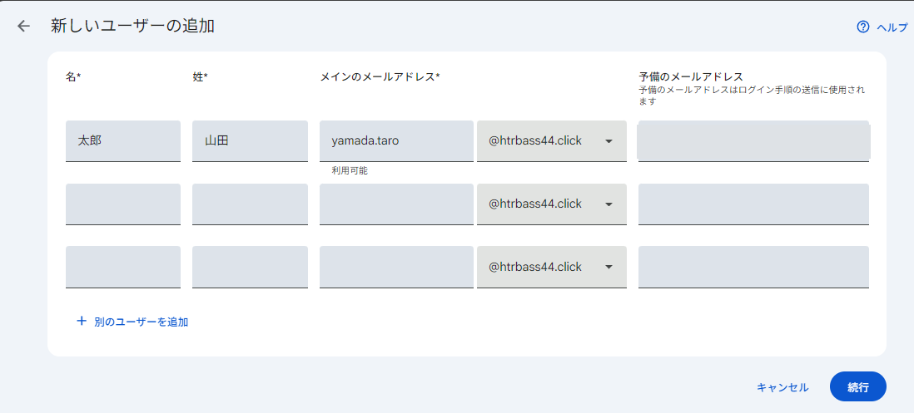

7. **「続行」** をクリックすると、パスワードの設定（自動生成／手動）や組織部門の選択画面に進む。学習用途ではパスワードは自動生成でよい
8. 最後の確認画面で **「ユーザーを追加」** をクリックして確定する

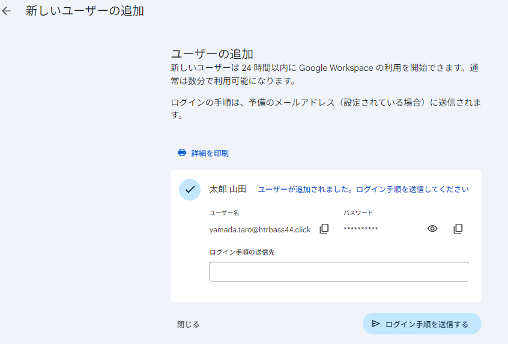

ここで表示される **ユーザー名とパスワードは、初回ログインに必要な情報**。パスワードはコピーアイコンで控えておく。「ログイン手順を送信する」を押すと、送信先アドレス（DNSハンズオンで設定したメール転送が生きていれば、実際に受信できる）に案内メールが届く。

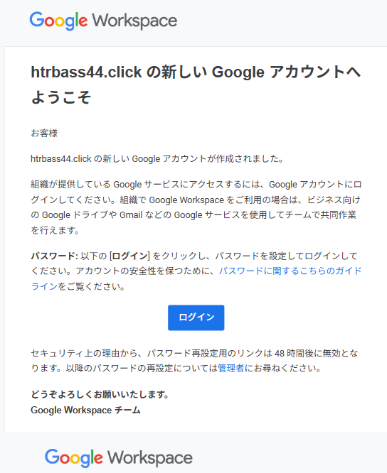

> このメールが届くこと自体、[DNS ハンズオン演習8](./dns-route53-handson.md#演習8-メール転送を設定するmxレコード) で設定したメール転送（ImprovMX）が **`admin@` 以外の任意のアドレスでも機能している**ことの実証になる。
>
> **ログインは必須ではない**。演習4-2b の目的（グループ経由でIAMを一切触らずにアクセスできること）は、次の③のトラブルシューターで確認できる。実際にこのアカウントでログインして VM 作成まで試すのは**任意のボーナス演習**。試す場合はシークレットウィンドウを使い、`admin@` の既存セッションと混在させないこと。

実際にログインすると、Google アカウントのホーム画面が開く。

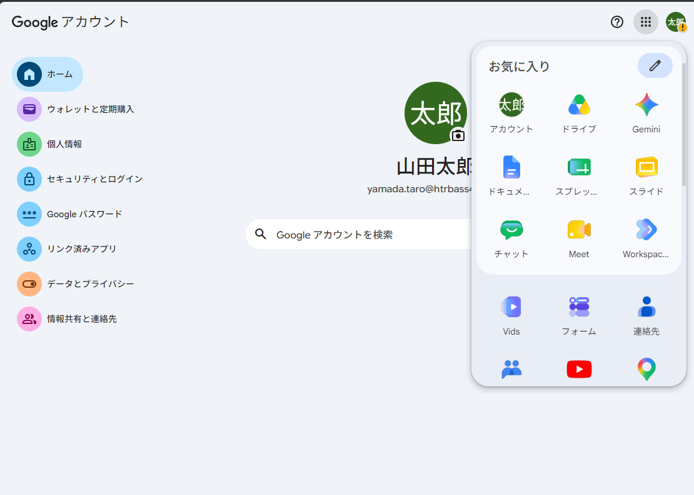

**ここで気づくはずの問題**: アプリランチャー（右上の格子アイコン）に、Drive・Gemini・YouTube・Maps・フォーム・Chat など、**Google Cloud とは無関係な消費者向け Google サービスが大量に並んでいる**。このアカウントは「Google Cloud のプロジェクトを触るためだけ」に作ったのに、既定では組織内の全サービスにアクセスできる状態になっている。次の④で、これを Google Cloud だけに絞り込む。

> ディレクトリへの反映（他の画面から検索できるようになるまで）に最大24時間かかることがある、と公式ヘルプに明記されている。多くの場合は数分で反映されるが、次の手順で見つからない場合は時間を置いて再試行する。

**② 作成したユーザーを、演習4-1のグループに追加する**

1. 「ディレクトリ」→「グループ」を開き、`gcp-team-a-dev@htrbass44.click` を選択
2. **「メンバーを追加」** をクリック
3. `yamada.taro@htrbass44.click` を入力
4. 役割は「メンバー」のまま、**「グループに追加」** で確定する

**③ IAMを一切触らずにアクセスできることを確認する**

演習4-5で使う **IAM ポリシー トラブルシューター**（<https://console.cloud.google.com/iam-admin/troubleshooter>）を先取りして使う。

1. **プリンシパル**に `yamada.taro@htrbass44.click`
2. **リソース**の「参照」から `$PROJ_DEV`（種類を「Project」に絞り込む）
3. **権限**に `compute.instances.create`
4. 「アクセス権を確認」

**✅ 確認ポイント**: 「許可」が「アクセスを許可」になっていれば成功。展開すると、**`gcp-team-a-dev@htrbass44.click` グループの `roles/editor`（sandbox/team-a フォルダで付与済み）が、山田太郎さんに継承されている**ことが分かるはず。`yamada.taro@` という個人に対しては、IAM バインディングを1件も作っていないことに注目。

**④ Google サービスの利用を Google Cloud だけに制限する（任意・推奨）**

ログイン画面で見たとおり、既定では Drive・Gemini・YouTube・Maps など**無関係なサービスにもアクセスできる**状態になっている。「このアカウントは Google Cloud のためだけに存在する」という設計を、実際に強制する。

Google Workspace/Cloud Identity には、**組織部門（OU）単位でサービスのオン・オフを切り替える機能**がある。個々のユーザーを1人ずつ設定するのではなく、**OUを1つ作り、そこに所属するユーザー全員に一括で制限をかける**のが正しいやり方（演習4-1で「グループ単位で付与する」と述べたのと同じ思想を、ここでは「OU単位で制限する」という形で使う）。

1. <https://admin.google.com> の「ディレクトリ」→「組織部門」を開く
2. **「組織部門を作成」** し、名前を `Cloud Engineers` のように付ける（親は最上位のままでよい）
3. 「ディレクトリ」→「ユーザー」で `yamada.taro@htrbass44.click` を開き、**「組織部門を変更」** で今作った `Cloud Engineers` に移動する

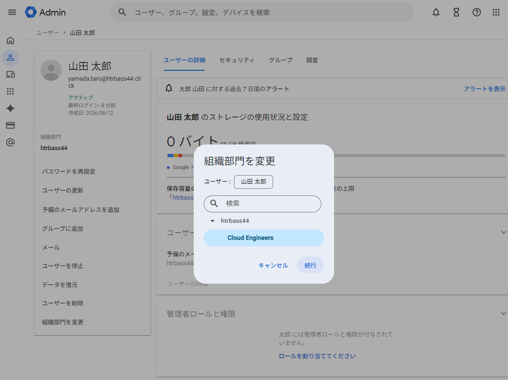

   左側のユーザー詳細パネルには、現在の組織部門（変更前は `htrbass44` = 最上位）、最終ログイン日時、管理者ロールの有無なども表示されている。「続行」を押すと確認画面を経て移動が確定する。

4. 「アプリ」→「Google Workspace」を開く。**左側の組織部門ツリーで `Cloud Engineers` を明示的にクリックして選択**する（既定では「このアカウントのすべてのユーザー」が選ばれているため、選び忘れると `admin@` にも影響してしまう）

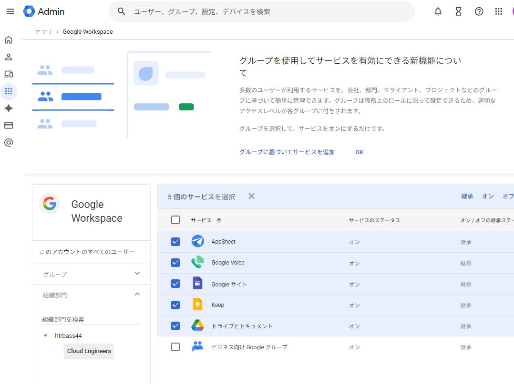

   一覧に並ぶサービスから、Google Cloud に無関係なもの（AppSheet・Google Voice・Google サイト・Keep・ドライブとドキュメント 等）にチェックを入れ、右上の **「オフ」** をクリックして保存する
5. 「アプリ」→「追加の Google サービス」を開く。同様に `Cloud Engineers` を選択した状態で、YouTube・マップ・Playなど不要なサービスを **「オフ」** にする

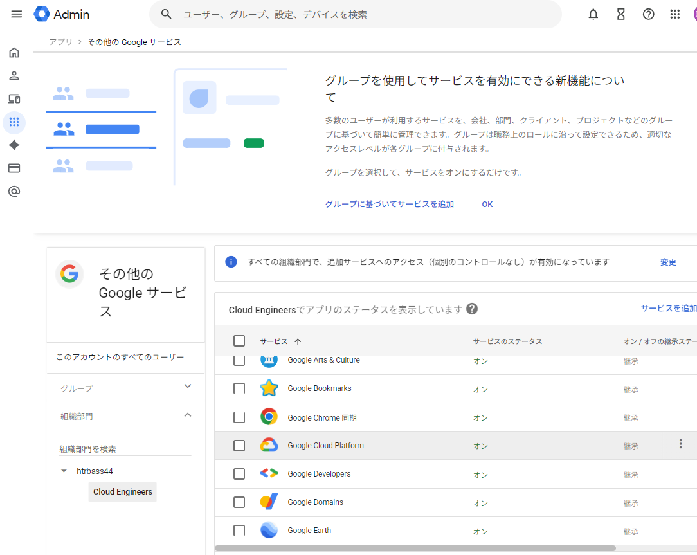

   > 画面上部の**「すべての組織部門で、追加サービスへのアクセス（個別のコントロールなし）が有効になっています［変更］」というバナーは無視してよい**。これは「この一覧に個別の行が無いその他大勢のサービス」を指す設定で、`Google Cloud Platform` のように**既に一覧に行があるサービスとは無関係**。
   >
   > 一覧は非常に長い（アルファベット順）ため、1つずつ選ぶより **ヘッダーの「すべて選択」でまとめてチェックし、`Google Cloud Platform` の行だけチェックを外してから「オフ」を押す**方が確実。

> **「ビジネス向け Google グループ」はオフにしても IAM の権限継承には影響しない**。公式ヘルプによれば、このサービスをオフにしても既存グループは削除されず、**メンバーへの IAM ロール継承もそのまま機能し続ける**。変わるのは「ユーザーが groups.google.com のアプリで高度な機能を使えなくなる」だけ。安全にオフにできるが、迷う場合はオンのままでも実害はない（今回はオンのまま残した）。

> ⚠️ **「Google Cloud」の項目だけは絶対にオフにしないこと**。「追加の Google サービス」の一覧に `Google Cloud` という項目があるが、これをオフにすると Cloud Console 自体に入れなくなり、これまでの演習が台無しになる。**オフにするのは Google Cloud に無関係なものだけ**。

> 設定は組織部門（OU）単位で管理されるため、**今後 `Cloud Engineers` OU に追加する人は自動的に同じ制限を受ける**。演習4-1のグループ設計と対になる、「アクセス範囲」ではなく「使えるサービス」を絞り込む統制軸だと理解するとよい。

**⚠️ 反映には時間がかかる**: サービスのオン・オフ設定は、公式ヘルプによれば**最大24時間**かかることがある。すぐに反映されないことがある点は、演習冒頭のユーザー追加と同じ。

**✅ 確認ポイント**: 少し待ってから `yamada.taro@` で再ログインし、アプリランチャーを開く。無効化したサービスが一覧から消えている（またはアクセス時にエラーになる）一方で、Google Cloud Console には引き続き入れることを確認する。

**（参考）CLI 版**

```bash
# ユーザー作成はCLIでは不可。グループへの追加のみCLIで代替できる
gcloud identity groups memberships add \
  --group-email="gcp-team-a-dev@${DOMAIN}" \
  --member-email="yamada.taro@${DOMAIN}"

# メンバーシップの確認
gcloud identity groups memberships list \
  --group-email="gcp-team-a-dev@${DOMAIN}"

# アクセス確認（Policy Troubleshooter の CLI 版）
gcloud policy-troubleshoot iam "//cloudresourcemanager.googleapis.com/projects/${PROJ_DEV}" \
  --principal-email="yamada.taro@${DOMAIN}" \
  --permission="compute.instances.create"
```

```bash
env_set NEW_USER "yamada.taro@${DOMAIN}"
```

**ここで学んだこと**: 「プロジェクトの払い出し」（演習3）と「ユーザーの払い出し」（この演習）は完全に別プロセス。前者は資源のコンテナを作るだけ、後者は人を既存のグループに参加させるだけ。**グループを起点に設計しておけば（4-1）、新メンバーが増えるたびにIAMポリシーを1件も書き換える必要がない**。これがAWSでいう IAM Identity Center の Permission Set をグループにアサインする設計と同じ発想であり、演習4-1で「人事異動のたびにIAMを触らなくて済む」と述べた効果の実演である。

#### 4-3. 払い出し専用サービスアカウントを作る（コンソール）

「払い出しの入口を 1 本にする」の実装。**演習1-4のトラブル対応で作成済みの `lz-bootstrap-5158c2`（`bootstrap` フォルダ配下）をそのまま使う**（新規プロジェクト作成は演習3-2 と同じ手順のため省略）。

**サービスアカウントの作成**

1. コンソール左上のプロジェクトセレクタで `$PROJ_BOOT`（`landing zone bootstrap` / `lz-bootstrap-5158c2`）を選択する
   - **CLI中心で作ったプロジェクトは「最近のプロジェクト」タブに出てこない**ことがある。検索ボックスに `lz-bootstrap` と直接入力するのが確実
2. 左メニューから **「サービス アカウント」** を開く（プロジェクトが選択されていないとグレーアウトして選べない）
3. **「サービス アカウントを作成」** をクリック
4. **サービス アカウント名**に `project-factory` と入力（サービスアカウント ID は自動生成される。**ID は後から変更できない**）

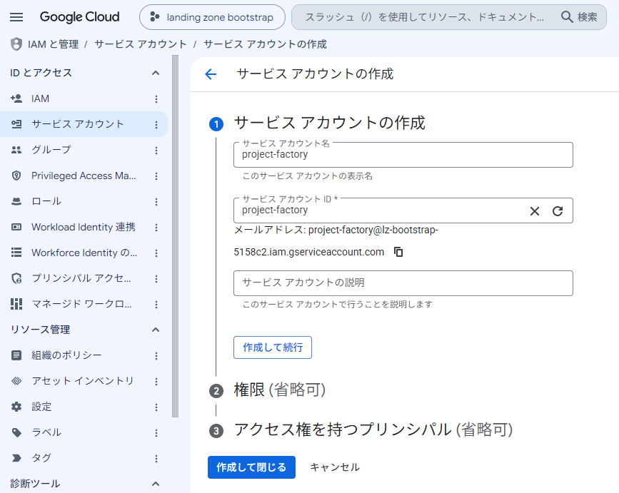

5. **「作成して続行」** → このプロジェクトへのロール付与はスキップして **「作成して閉じる」**（ロールは次のステップでフォルダ・組織・請求先アカウント側から個別に付与する）

作成されたメールアドレス（`project-factory@lz-bootstrap-5158c2.iam.gserviceaccount.com`）を控えておく。

```bash
export SA_PF="project-factory@${PROJ_BOOT}.iam.gserviceaccount.com"
```

**必要最小限のロールを、必要な階層にだけ付ける**

| 付与先の画面 | プリンシパル | ロール |
|---|---|---|
| リソースの管理（組織 `htrbass44.click` を選択） | `$SA_PF` | プロジェクト作成者（`roles/resourcemanager.projectCreator`） |
| リソースの管理（`prod` フォルダを選択） | `$SA_PF` | フォルダ管理者・プロジェクトの IAM 管理者 |
| リソースの管理（`nonprod` フォルダを選択） | `$SA_PF` | 同上 |
| リソースの管理（`sandbox` フォルダを選択） | `$SA_PF` | 同上 |
| 「お支払い」→ 該当請求先アカウント →「アカウント管理」 | `$SA_PF` | 請求先アカウント ユーザー（`roles/billing.user`） |

各行とも操作は同じ：対象を選ぶ →「権限」タブ（または情報パネル）→「プリンシパルを追加」→ サービスアカウントのメールアドレスを入力 → ロールを選択 →「保存」。フォルダは `prod` / `nonprod` / `sandbox` の**3つとも**繰り返す（組織全体には付けない ── 演習1-3 の「入口を絞る」設計と同じ考え方）。**複数フォルダを同時にチェックして選択すれば、まとめて1回の操作で3フォルダに同じロールを付与できる**（コンソール独自の効率化機能）。

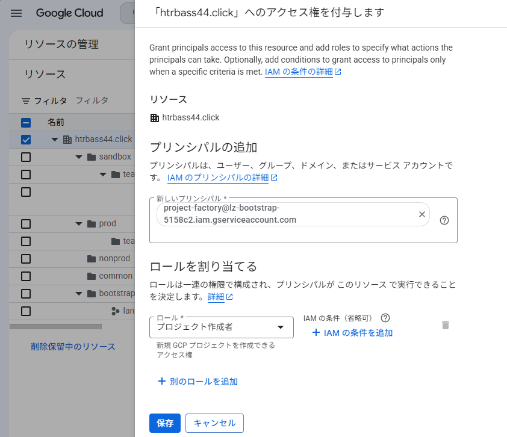

> **請求先アカウントだけは操作先が違う**。組織・フォルダ・プロジェクトには専用の「IAM と管理」ページがあるが、**請求先アカウントには存在しない**。<https://console.cloud.google.com/billing> → 対象の請求先アカウントを開く → 左メニュー最下部の **「アカウント管理」**（「IAM と管理」ではない）→ 右側の「請求先アカウント」パネルに「プリンシパルを追加」がある。ここで唯一「権限」が独立タブになっていない例外的なリソース。
>
> 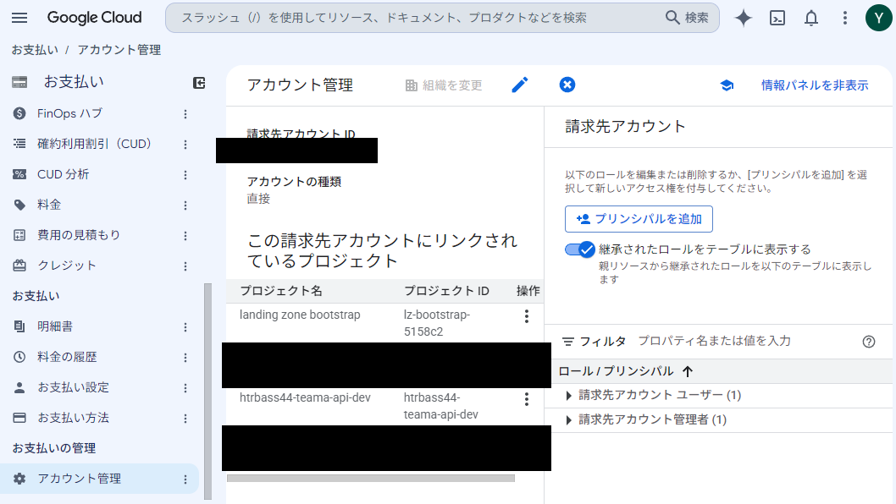
>
> なお、この画面を開けるのは請求先アカウントの `roles/billing.admin` を持つプリンシパルのみ。演習3-3 で権限分離した結果、`admin@htrbass44.click`（`billing.user` のみ）ではこのページの編集ができず、`billing.admin` を持つ元のオーナーアカウントに切り替える必要がある。**この一手だけ他の演習と操作アカウントが変わる**ので、終わったら `admin@htrbass44.click` に戻すこと。

**（参考）CLI 版一式**

```bash
gcloud iam service-accounts create project-factory \
  --display-name="Project Factory" --project="$PROJ_BOOT"

gcloud organizations add-iam-policy-binding "$ORG_ID" \
  --member="serviceAccount:${SA_PF}" --role="roles/resourcemanager.projectCreator"

for F in "$F_PROD" "$F_NONPROD" "$F_SANDBOX"; do
  gcloud resource-manager folders add-iam-policy-binding "$F" \
    --member="serviceAccount:${SA_PF}" --role="roles/resourcemanager.folderAdmin"
  gcloud resource-manager folders add-iam-policy-binding "$F" \
    --member="serviceAccount:${SA_PF}" --role="roles/resourcemanager.projectIamAdmin"
done

gcloud billing accounts add-iam-policy-binding "$BILLING_ACCOUNT" \
  --member="serviceAccount:${SA_PF}" --role="roles/billing.user"
```

#### 4-4. カスタムロールで最小権限を作る（コンソール）

「プロジェクトの一覧と課金状態を見られるが、変更はできない」監査担当向けのロール。

**⚠️ 事前にロールが必要**: これまでの演習1・3で付与したロールには、**カスタムロールの作成・一覧取得権限が含まれていない**。「ロール」ページを開くと次のエラーになる。

```
カスタムロールのリストを取得する権限がありません
必要な権限: iam.roles.list
```

先に専用ロールを付与する。**ここでもう一つ落とし穴がある**: IAM ロール管理のロール名は、**プロジェクト用と組織用で名前が異なる**。

```bash
# ❌ 失敗する（プロジェクト用のロール名）
gcloud organizations add-iam-policy-binding $ORG_ID \
  --member="user:admin@htrbass44.click" --role="roles/iam.roleAdmin"
#   -> INVALID_ARGUMENT: Role roles/iam.roleAdmin is not supported for this resource.

# ✅ 成功する（組織用のロール名）
gcloud organizations add-iam-policy-binding $ORG_ID \
  --member="user:admin@htrbass44.click" --role="roles/iam.organizationRoleAdmin"
```

| スコープ | ロール名 |
|---|---|
| プロジェクト | `roles/iam.roleAdmin` |
| **組織** | `roles/iam.organizationRoleAdmin` |

付与後はブラウザを強制再読み込み（`Ctrl+Shift+R`）してから進める。

1. **「IAM と管理」→「ロール」** を開く（スコープのドロップダウンで組織 `htrbass44.click` を選択）
2. **「カスタムロールを作成」** をクリック
3. **タイトル**に `LZ Auditor`、**説明**に `Read-only view of hierarchy and billing linkage`、**ID** に `lzAuditor`、**ロールの起動段階**に「一般提供」（GA）を設定する
4. **「権限を追加」** をクリック
5. 「すべてのサービス」フィルタで絞り込みながら、以下の7つの権限にチェックを入れて **「権限を追加」** で確定する

```
resourcemanager.projects.get
resourcemanager.projects.list
resourcemanager.folders.get
resourcemanager.folders.list
resourcemanager.organizations.get
billing.resourceAssociations.list
orgpolicy.policy.get
```

6. **「作成」** で確定する

**（参考）CLI 版**

```bash
cat > policies/role-lz-auditor.yaml <<'EOF'
title: "LZ Auditor"
description: "Read-only view of hierarchy and billing linkage"
stage: "GA"
includedPermissions:
- resourcemanager.projects.get
- resourcemanager.projects.list
- resourcemanager.folders.get
- resourcemanager.folders.list
- resourcemanager.organizations.get
- billing.resourceAssociations.list
- orgpolicy.policy.get
EOF

gcloud iam roles create lzAuditor --organization="$ORG_ID" \
  --file=policies/role-lz-auditor.yaml
```

> ⚠️ **この時点では、`lzAuditor` は誰にも・どのリソースにも付与されていない。** 4-0 の式を思い出すと、`role` 単体は「権限の束の定義（テンプレート）」でしかなく、実際に効力を持たせるには `binding = リソース + プリンシパル + ロール` の3点を揃える必要がある。ここでは意図的に**定義の作成まで**を範囲とし、バインドは行わない（実運用では監査担当のグループ等を用意し、組織またはフォルダに対して `gcloud organizations add-iam-policy-binding --role="organizations/${ORG_ID}/roles/lzAuditor"` のように付与する）。
>
> 実際に確認できる。
>
> ```bash
> gcloud organizations get-iam-policy $ORG_ID --format=json | \
>   python -c "import json,sys; d=json.load(sys.stdin); print([b for b in d['bindings'] if 'lzAuditor' in b['role']] or '見つからない = 誰にも付与されていない')"
> ```

#### 4-5. 継承を確認する（ここが AWS と一番違う）（コンソール）

**祖先をたどる**: リソースの管理ページでプロジェクト `$PROJ_DEV` をクリックすると、情報パネルの上部にパンくず（`htrbass44.click > sandbox > team-a > htrbass44-teama-api-dev`）が表示される。これが `get-ancestors` の中身そのもの。

```bash
# CLI 版
gcloud projects get-ancestors "$PROJ_DEV"
```

```
ID              TYPE
lz-teama-api-dev-a1b2c3   project
987654321098              folder     <- sandbox/team-a
876543210987              folder     <- sandbox
123456789012              organization
```

**直接付与 vs 継承の違いを確認する**: リソースの管理ページで `$PROJ_DEV` の「権限」タブを開くと、「継承されたロールをテーブルに表示する」というトグルがある（演習3-2 のスクリーンショットで見たもの）。オフにすると**そのプロジェクトに直接付与されたバインディングだけ**が残り、オンにすると親フォルダ・組織から継承したロールが混ざって表示される。

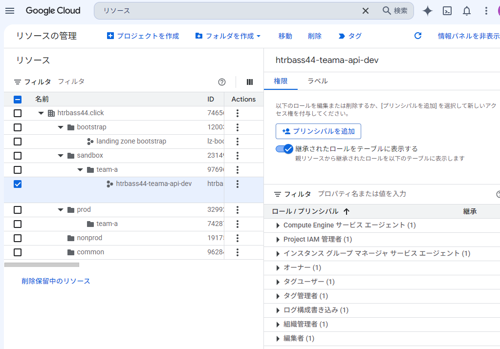

トグルをオフにすると一覧が一気に短くなる。**その差分がそのまま「このプロジェクトに直接付いているもの」と「上位から継承しているもの」の境界線**になる。演習1〜4で積み上げてきた組織レベルのロール付与（組織管理者・タグ管理者・ログ構成書き込み 等）が、このプロジェクトにまで届いていることが視覚的に確認できる。

```bash
# CLI 版（直接付与分のみ返す。継承分は含まれない）
gcloud projects get-iam-policy "$PROJ_DEV" --format=yaml
```

> **重要**: `get-iam-policy` は API としては**常に直接付与分のみ**を返す。「継承を含めて見る」のはコンソール側の表示機能であり、CLI で同じことをするには Policy Analyzer や次の Policy Troubleshooter を使う。

**IAM ポリシー トラブルシューター**: 特定のユーザーが特定の操作をできるか、継承元まで含めて調べられるツール。**4-2b で `admin@htrbass44.click` の代わりに `yamada.taro@htrbass44.click` を使ったのと同じ画面**だが、今度は「許可」の内訳まで掘り下げる。

> **なぜ `admin@` ではなく `yamada.taro@` で確認するのか**: `admin@` は組織管理者ロールを持つため、どんな権限チェックでも「許可」になってしまい**テストとして意味が薄い**。**個別のIAMバインディングを1件も持たない `yamada.taro@` が、グループ経由だけでアクセスできることを確認するのが本当のテスト**。

1. <https://console.cloud.google.com/iam-admin/troubleshooter> を開く
2. **プリンシパル**に `yamada.taro@htrbass44.click`（`$NEW_USER`）
3. **リソース**の「参照」から `$PROJ_DEV` を選ぶ
   - ⚠️ **リソースの種類が既定で「118件のオプション」（全種類）になっており、検索するとサブネットワーク等の個別リソースまでヒットして紛らわしい**。「リソースの種類」ドロップダウンを一度クリックし、**「Project」だけに絞り込んでから**検索し直すと、プロジェクト自体の1件だけに絞れる
4. **権限**に `compute.instances.create`
5. **「アクセス権を確認」** を押す

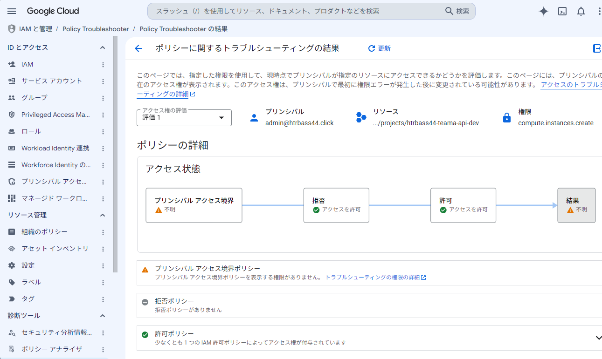

結果は「プリンシパル アクセス境界」「拒否ポリシー」「許可ポリシー」の3段階を経て「結果」に至る、4ボックスのフロー図で表示される。

| ボックス | 意味 |
|---|---|
| プリンシパル アクセス境界 | PAB（新しい境界ポリシー機能）による制限。今回は確認用の別権限が無く「不明」 |
| 拒否 | Deny ポリシーによるブロックが無いか。「拒否ポリシーがありません」なら通過 |
| 許可 | **どの IAM 許可ポリシー（＝どの階層のどのロール）がこの権限を与えているか** |
| 結果 | 上記3つを総合した最終判定 |

「許可ポリシー」の行を展開すると、**どの階層（プロジェクト自身／フォルダ／組織）のどのロールが効いているか**が表示される。演習1〜4 で積み上げてきた継承の全体像を、1つの画面で裏取りできる。

**（参考）CLI 版**

```bash
gcloud policy-troubleshoot iam "//cloudresourcemanager.googleapis.com/projects/${PROJ_DEV}" \
  --principal-email="${ME}" \
  --permission="compute.instances.create"
```

**✅ 確認ポイント**

```bash
gcloud resource-manager folders get-iam-policy "$F_SANDBOX_TEAMA" --format=yaml
gcloud iam roles describe lzAuditor --organization="$ORG_ID"
```

**ここで学んだこと**: IAM 許可ポリシーは**上位で付けたら下位で剥がせない**（AWS の SCP のような「上位で絞る」動きはしない）。だからこそ、組織レベルに強いロールを置かず、フォルダ単位で最小権限を配ることが設計の要になる。上位で絞りたい要求は演習5・6 の OrgPolicy と Deny ポリシーで実現する。コンソールの「継承されたロールを表示」トグルと IAM ポリシー トラブルシューターは、この継承構造を目視で追える数少ない手段。

---

### 演習5: ガードレール① 組織のポリシー（Organization Policy）（コンソール）

**目的**: SCP 的な「やらせない」制約を、影響調査（dry-run）を挟んで安全に適用する。

**この演習も全体地図を先に示す**

| 項 | 何をするか | 一言で |
|---|---|---|
| 5-1 | 制約の種類を知る（読み物） | list型／boolean型、8つの制約の効果一覧 |
| 5-2 | 「外部ドメイン締め出し」の状態を確認する | 既に有効なベースライン制約（1.5節）をコンソールで確認 |
| 5-3 | 環境ごとに違うガードレールを効かせる | `prod`=SAキー禁止のみ、`sandbox`=リージョン制限＋外部IP禁止＋公開バケット禁止 |
| 5-4 | dry-run で影響を調査してから本適用する | CLI で dryRunSpec 設定 → ログ確認 → コンソールで本適用 |
| 5-5 | 例外を作る（子で上書きする） | `sandbox/team-a` だけ Shielded VM 必須を解除 |
| 5-6 | 動作確認 | Compute Engine のVM作成画面で実際にブロックされることを見る |

#### 5-1. 制約の種類を知る

| 制約 | 型 | 効果 |
|------|----|----|
| `gcp.resourceLocations` | list | リソースを作成できるリージョンを限定 |
| `iam.disableServiceAccountKeyCreation` | boolean | SA の静的キー発行を禁止（漏洩事故の最大要因を潰す） |
| `iam.allowedPolicyMemberDomains` | list | **自社ドメイン外のアカウントに権限を付けられなくする** |
| `compute.vmExternalIpAccess` | list | VM への外部 IP 付与を禁止 |
| `compute.skipDefaultNetworkCreation` | boolean | 新規プロジェクトの default VPC 自動作成を抑止 |
| `storage.publicAccessPrevention` | boolean | GCS バケットの公開を禁止 |
| `sql.restrictPublicIp` | boolean | Cloud SQL のパブリック IP を禁止 |
| `compute.requireShieldedVm` | boolean | Shielded VM を強制 |

#### 5-2. 「外部ドメイン締め出し」の状態を確認する（コンソール）

**最も効果が高い制約の 1 つ**。これが無いと、誰かが誤って個人 Gmail に Owner を付けられてしまう。

**⚠️ 2024年5月以降に作成した組織では、すでに有効になっている**（1.5 節参照）。まず実効値を確認する。

1. コンソール左上の検索から **「IAM と管理」→「組織のポリシー」** を開く（スコープが組織 `htrbass44.click` になっていることを確認）
2. 検索ボックスで `allowedPolicyMemberDomains` と入力し、**「共有先のドメインを制限」**（制約ID: `iam.allowedPolicyMemberDomains`）をクリック
3. 開いたポリシー詳細ページで、**「組織で有効なポリシー」** の欄を確認する

**✅ 確認ポイント**: 許可される値に自組織の顧客ID（`$CUSTOMER_ID`）が入っていれば、**この制約はすでに有効**。改めて設定する必要はない。

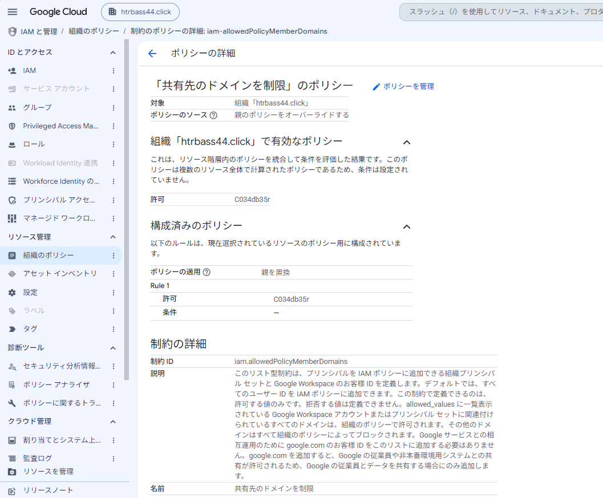

上記の通り、**「組織で有効なポリシー」の許可欄に `$CUSTOMER_ID` の値が入っており、「構成済みのポリシー」も「親を置換」ですでに設定済み**であることが確認できる。1.5 節で説明したベースライン制約が実際に効いている証拠であり、これ以上の作業は不要。

もし空、またはこの制約自体が見当たらない場合（2024年5月より前に作成された組織、または一度削除された場合）は、明示的に設定する。

4. ページ上部の **「ポリシーを管理」** をクリック
5. 「ポリシーの適用」で **「上書き親のポリシー」** を選択
6. **「ルールを追加」** → 「ポリシーの値」で「カスタム」を選び、**「カスタム値」** 欄に `$CUSTOMER_ID` の値を入力して「値を追加」
7. **「ポリシーの設定」** で確定する

> ⚠️ **この制約が有効な状態で外部の共同作業者や一部の Google 管理サービスアカウントに権限を付けようとすると失敗する**。実運用では特定フォルダに例外を設けるのが普通（5-5 参照）。

**（参考）CLI 版**

```bash
gcloud org-policies describe constraints/iam.allowedPolicyMemberDomains \
  --organization=$ORG_ID --effective
```

```bash
cat > policies/policy-domains.yaml <<EOF
name: organizations/${ORG_ID}/policies/iam.allowedPolicyMemberDomains
spec:
  rules:
  - values:
      allowedValues:
      - "${CUSTOMER_ID}"
EOF

gcloud org-policies set-policy policies/policy-domains.yaml
```

#### 5-3. 環境ごとに違うガードレールを効かせる（コンソール）

> 本ハンズオンでは、場所の制限（`gcp.resourceLocations`）は **`prod` ではなく `sandbox` フォルダに適用**する（`prod` には制約をかけない構成で進める）。

**sandbox: 場所を東京・大阪に限定する**

1. 「IAM と管理」→「組織のポリシー」で、スコープを **`sandbox` フォルダ**に切り替える（画面上部のリソースセレクタ）
2. `gcp.resourceLocations`（**「リソースの場所を制限する」**）を検索して開く
3. **「ポリシーを管理」** →「上書き親のポリシー」→「ルールを追加」
4. 「ポリシーの値」で「カスタム」を選び、**「カスタム値」** に `in:asia-northeast1-locations` を追加、続けて `in:asia-northeast2-locations` も追加
5. 「ポリシーの設定」で確定

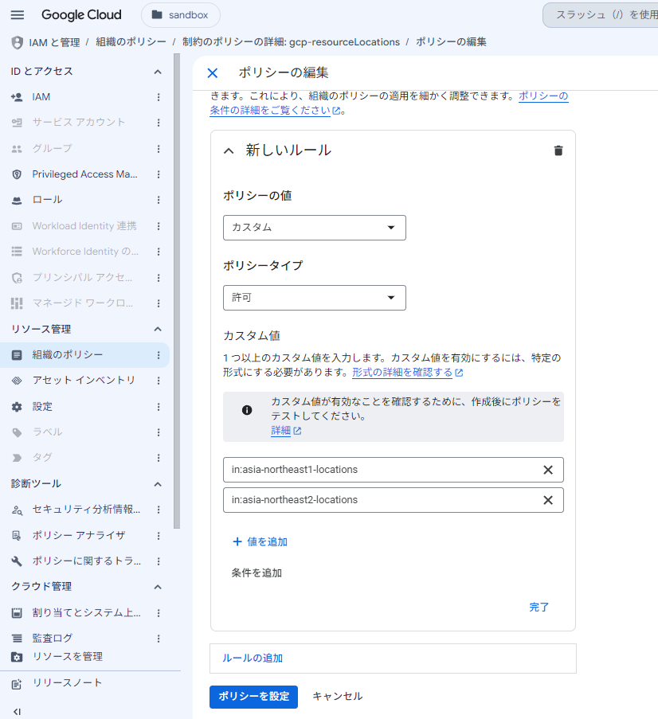

**prod: SA キー発行を禁止する**

1. スコープを **`prod` フォルダ**に切り替える
2. `iam.disableServiceAccountKeyCreation`（**「サービス アカウント キーの作成の無効化」**）を検索して開く
3. 「ポリシーを管理」→「上書き親のポリシー」→「ルールを追加」
4. 「適用」を **「オン」** にして「ポリシーの設定」

**sandbox: 外部IPと公開バケットを禁止する**（実験環境ほど事故りやすいので強く縛る）

1. 同じ `sandbox` スコープのまま、`compute.vmExternalIpAccess`（**「VM インスタンスの外部 IP アクセスの定義」**）を開く → 「ポリシーを管理」→「上書き親のポリシー」→「ルールを追加」→ 「ポリシーの値」で **「すべて拒否」** を選択 → 「ポリシーの設定」
3. 同様に `storage.publicAccessPrevention`（**「パブリック アクセス制限」**）を開く → 「適用」を **「オン」** にして設定

**（参考）CLI 版一式**

```bash
cat > policies/policy-locations-sandbox.yaml <<EOF
name: folders/${F_SANDBOX}/policies/gcp.resourceLocations
spec:
  rules:
  - values:
      allowedValues:
      - "in:asia-northeast1-locations"
      - "in:asia-northeast2-locations"
EOF
gcloud org-policies set-policy policies/policy-locations-sandbox.yaml

cat > policies/policy-sakey-prod.yaml <<EOF
name: folders/${F_PROD}/policies/iam.disableServiceAccountKeyCreation
spec:
  rules:
  - enforce: true
EOF
gcloud org-policies set-policy policies/policy-sakey-prod.yaml

cat > policies/policy-extip-sandbox.yaml <<EOF
name: folders/${F_SANDBOX}/policies/compute.vmExternalIpAccess
spec:
  rules:
  - denyAll: true
EOF
gcloud org-policies set-policy policies/policy-extip-sandbox.yaml

cat > policies/policy-pap-sandbox.yaml <<EOF
name: folders/${F_SANDBOX}/policies/storage.publicAccessPrevention
spec:
  rules:
  - enforce: true
EOF
gcloud org-policies set-policy policies/policy-pap-sandbox.yaml
```

**✅ 確認ポイント**: 各制約のページで実効ポリシーを見比べ、`prod` と `sandbox` で異なる制約が設定されていることを確認する。

#### 5-4. dry-run で影響を調査してから本適用する（CLI）

既存環境に新しい制約を入れるときは、**いきなり enforce しない**。dry-run を使うと、違反は監査ログに記録されるだけで実際にはブロックされない。

> ⚠️ **実機確認済みの注意点①**: コンソールの「組織のポリシー」一覧ページには「有効なドライラン ポリシー」というダッシュボードカード（件数表示・フィルタ表示）があるが、これは**既存のドライランポリシーを確認するための導線のみ**で、新規作成の導線ではない。制約の詳細画面にも、行の操作メニュー（「ポリシーを表示」「ポリシーの編集」）にも、ドライランポリシーを新規作成する項目は見当たらなかった。そのため、**ドライランポリシーの作成は CLI（`dryRunSpec`）を使う**。
>
> ⚠️ **実機確認済みの注意点②**: dry-run は**すべての制約で使えるわけではない**。`compute.requireShieldedVm` に対して `dryRunSpec` を設定しようとすると、実際に次のエラーになる。
> ```
> ERROR: (gcloud.org-policies.set-policy) INVALID_ARGUMENT: DryRun feature is not available for the resource.
> reason: DRY_RUN_NOT_SUPPORTED
> ```
> [公式ドキュメント](https://docs.cloud.google.com/organization-policy/test-policies)によると、dry-run が使えるのは「カスタム制約」「管理対象制約」、および「レガシー管理対象制約」のうち **サービス使用制限・エンドポイント制限・TLSバージョン制限・TLS暗号スイート制限の4つのみ**。`compute.requireShieldedVm`（レガシー管理対象制約）はこのリストに含まれないため使えない。ここでは dry-run 対応の `gcp.restrictServiceUsage`（**「制限するサービスの使用」**）で dry-run の一連の流れを体験し、`compute.requireShieldedVm` は dry-run を経ずに直接本適用する（③）。

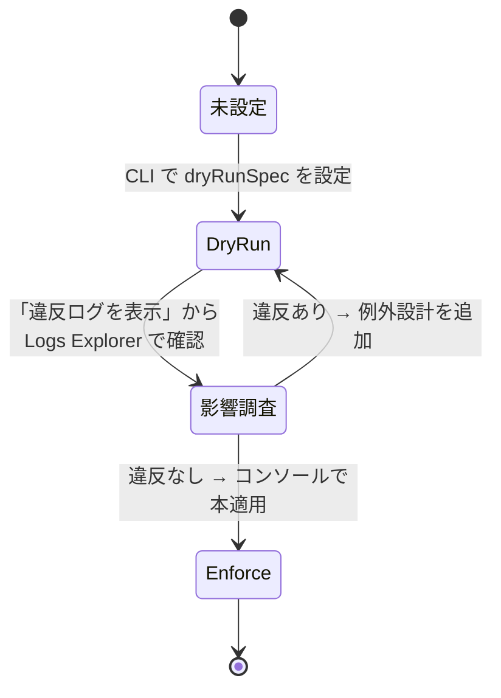
```mermaid
stateDiagram-v2
    [*] --> 未設定
    未設定 --> DryRun: CLI で dryRunSpec を設定
    DryRun --> 影響調査: 「違反ログを表示」から<br/>Logs Explorer で確認
    影響調査 --> DryRun: 違反あり → 例外設計を追加
    影響調査 --> Enforce: 違反なし → コンソールで本適用
    Enforce --> [*]
```

**① dry-run で設定する（CLI、`gcp.restrictServiceUsage` で体験）**

`sandbox` フォルダには現状この制約が無い（＝全サービス使用可）ので、まずは **`dryRunSpec` のみ**を設定し、ライブの `spec` には触れない。許可リストを意図的に絞り込み、違反が出ることを確認する。

```bash
cat > policies/policy-restrictservice-dryrun.yaml <<EOF
name: folders/${F_SANDBOX}/policies/gcp.restrictServiceUsage
dryRunSpec:
  rules:
  - values:
      allowedValues:
      - compute.googleapis.com
      - storage.googleapis.com
EOF
gcloud org-policies set-policy policies/policy-restrictservice-dryrun.yaml --update-mask="dryRunSpec"
```

設定後、コンソールの「組織のポリシー」一覧（`sandbox` スコープ）を開き、**「有効なドライラン ポリシー」** カードの件数が `1` に増えていること、**「ドライラン ポリシーを表示」** で `gcp.restrictServiceUsage` が一覧に出ることを確認できる（＝コンソールは確認用途では使える）。

**② 違反を確認する**

Logs Explorer（プロジェクトスコープ、対象は `$PROJ_DEV` など sandbox 配下のプロジェクト）で以下のクエリを使う。許可リストに無い API（例: `iam.googleapis.com` など）へのアクセスが `DENIED`（dry-run 上の判定）としてログに出る。

```
protoPayload.metadata.dryRunResult="DENIED" AND protoPayload.metadata.liveResult="ALLOWED"
```

この結果をもとに許可リストを調整する（実運用ではこの調査だけで終わり、狭すぎる許可リストをそのまま本適用はしない）。本ハンズオンではここまでで dry-run の流れの確認は完了とし、`gcp.restrictServiceUsage` 自体は本適用しない。

**③ 別の制約（`compute.requireShieldedVm`）を本適用する（コンソール）**

`compute.requireShieldedVm` は dry-run 非対応のため、5-5・5-6 で使う本番の制約として dry-run を経由せず直接設定する。

7. 「IAM と管理」→「組織のポリシー」で `sandbox` スコープのまま `compute.requireShieldedVm` を開く
8. **「ポリシーを管理」** →「上書き親のポリシー」→「ルールを追加」→「適用」を**「オン」**にして「ポリシーの設定」

**（参考）CLI 版**

```bash
# ① dry-run で設定する
cat > policies/policy-restrictservice-dryrun.yaml <<EOF
name: folders/${F_SANDBOX}/policies/gcp.restrictServiceUsage
dryRunSpec:
  rules:
  - values:
      allowedValues:
      - compute.googleapis.com
      - storage.googleapis.com
EOF
gcloud org-policies set-policy policies/policy-restrictservice-dryrun.yaml --update-mask="dryRunSpec"

# ② 違反の確認
gcloud logging read \
  'protoPayload.metadata.dryRunResult="DENIED" AND protoPayload.metadata.liveResult="ALLOWED"' \
  --project="$PROJ_DEV" --limit=20 --freshness=1d

# ③ 別の制約（dry-run 非対応）は直接本適用
cat > policies/policy-shielded-enforce.yaml <<EOF
name: folders/${F_SANDBOX}/policies/compute.requireShieldedVm
spec:
  rules:
  - enforce: true
EOF
gcloud org-policies set-policy policies/policy-shielded-enforce.yaml --update-mask="spec"
```

#### 5-5. 例外を作る（子で上書きする）（コンソール）

IAM と違い、組織のポリシーは**子階層で緩められる**。ここが SCP との決定的な違い。

1. スコープを **`sandbox` フォルダの下の `team-a` フォルダ**に切り替える（`prod/team-a` と間違えないこと）
2. `compute.requireShieldedVm` を検索して開く
3. **「ポリシーを管理」** をクリック
4. 「ポリシーの適用」で **「上書き親のポリシー」** を選択 →「ルールを追加」→「適用」を**「オフ」**に設定
5. 「ポリシーの設定」で確定

> **運用上の注意**: 緩められるということは、`roles/orgpolicy.policyAdmin` を持つ人が誰でも例外を作れるということ。このロールはプラットフォームチームだけに限定し、演習6 の Deny ポリシーで「絶対に緩めさせない層」を別に用意する。

**（参考）CLI 版**

```bash
cat > policies/policy-shielded-exception.yaml <<EOF
name: folders/${F_SANDBOX_TEAMA}/policies/compute.requireShieldedVm
spec:
  inheritFromParent: false
  rules:
  - enforce: false
EOF
gcloud org-policies set-policy policies/policy-shielded-exception.yaml
```

#### 5-6. 動作確認（コンソール）

**実効ポリシーの確認**

1. 「IAM と管理」→「組織のポリシー」で `prod` と `sandbox` それぞれのスコープに切り替え、一覧に並ぶ制約の数・内容を見比べる

**⚠️ ありがちな誤解**: `enforce: true` は「その種類のリソースの作成を一切禁止する」制約ではない。**制約の条件を満たさない構成での作成だけを禁止する**。`compute.requireShieldedVm` の場合、Shielded VM オプション（セキュアブート・vTPM・整合性モニタリング）を有効にした状態で作成する分には、`enforce: true` でも問題なく成功する。実際、Console の VM 作成画面は多くの既定イメージで Shielded VM オプションが最初から有効になっているため、**何も意識せず「作成」を押すと enforce: true でもあっさり成功してしまう**。ブロックされる場面を見るには、あえて条件を満たさない設定（セキュアブートを外す等）にする必要がある。

**Shielded VM 要求のブロックを確認する（5-5 の例外と対比）**

`sandbox/team-a` フォルダ（5-5 で `compute.requireShieldedVm` の例外を設定した場所）を使って、例外の有無で挙動が変わることを確認する。

1. `sandbox/team-a` フォルダの `compute.requireShieldedVm` を **`enforce: true`**（上書き親のポリシー→ルール追加→「適用」オン）に設定する（＝5-5 の例外を一時的に解除する）
2. `$PROJ_DEV` で「Compute Engine」→「VM インスタンス」→「インスタンスを作成」を開く
3. 左側のセクション一覧から **「セキュリティ」** を選び、**「Shielded VM」** の **「セキュアブートをオンにします」** のチェックを外す（vTPM・整合性モニタリングはオンのまま）
4. 画面に **「⚠️ Shielded VM ポリシーではセキュアブートを有効にする必要があります」** という警告が表示される
5. 「作成」をクリックする

**✅ 確認ポイント**: 「セキュリティ」のセクションが赤いエラー表示になり、作成が進まない。

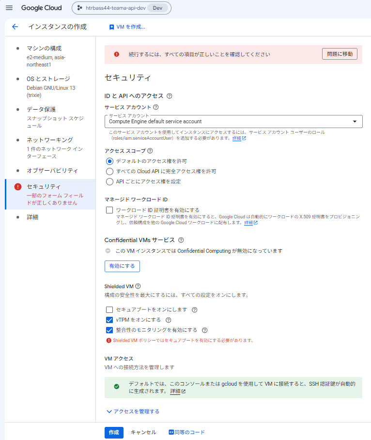

6. 検証が終わったら、`sandbox/team-a` の `compute.requireShieldedVm` を **`enforce: false`**（5-5 の状態）に戻しておく

> ⚠️ **実機確認済みの注意点**: ポリシーを `enforce: false` に戻した直後、VM作成画面が数分間**古い制約違反の警告を表示し続ける**ことがある（`gcloud ... --effective` ではAPI側の変更が即座に確認できるにもかかわらず）。反映遅延はコンソールのキャッシュ側の問題なので、ページをリロードして数分待つと解消する。

**外部IP禁止のブロックを確認する**

`sandbox` 直下（`team-a` ではない）に検証用プロジェクトを作る（手順は演習3-2と同じ）。`team-a` は Shielded VM の例外はあるが `compute.vmExternalIpAccess` の例外は無いので、こちらは `sandbox` 直下でも `team-a` 配下でも同様にブロックされるはずだが、例外の影響を受けない `sandbox` 直下で確認するとより素直に確認できる。

1. 検証用プロジェクトを選択した状態で「Compute Engine」→「VM インスタンス」→「インスタンスを作成」
2. マシンタイプ等は既定のまま「作成」をクリック

**✅ 確認ポイント**: `外部IPアクセスの制限に違反しています`（constraint `compute.vmExternalIpAccess` 違反）のようなエラーが画面に表示される。

3. 同じ作成画面で「ネットワーキング」セクションを開き、外部IPを **「なし」** に変更してから再度「作成」

**✅ 確認ポイント**: 今度は成功する。

> 検証が終わったら、作成した VM を忘れずに削除する（「VM インスタンス」一覧からチェックを入れて「削除」）。

**（参考）CLI 版**

```bash
export PROJ_SBOX="${PREFIX}-sandbox-${SUFFIX}"
gcloud projects create "$PROJ_SBOX" --folder="$F_SANDBOX"
gcloud billing projects link "$PROJ_SBOX" --billing-account="$BILLING_ACCOUNT"
gcloud services enable compute.googleapis.com --project="$PROJ_SBOX"

# 外部 IP 付き VM の作成 → 失敗するはず
gcloud compute instances create test-vm \
  --project="$PROJ_SBOX" --zone="${LOCATION}-a" \
  --machine-type=e2-micro

# 外部 IP なしなら成功する
gcloud compute instances create test-vm \
  --project="$PROJ_SBOX" --zone="${LOCATION}-a" \
  --machine-type=e2-micro --no-address

# 検証後は削除
gcloud compute instances delete test-vm --project="$PROJ_SBOX" --zone="${LOCATION}-a" --quiet
```

**ここで学んだこと**: 組織のポリシーは「IAM とは独立に、API レベルでリソース構成を制約する」仕組み。**継承しつつ子で上書きできる**という点で SCP と挙動が違う。`enforce: true` は「作成自体の禁止」ではなく「条件を満たさない構成での作成の禁止」であり、この違いを混同しやすい。既存環境への適用は、dry-run が使える制約（サービス使用制限など一部のみ）であれば必ず dry-run を挟む。dry-run はコンソールに新規作成の導線が無く、CLI（`dryRunSpec`）で作成し、コンソールは確認用途に使う。

---

### 演習6: ガードレール② IAM Deny ポリシー（SCP に最も近い機能）（コンソール）

**目的**: 「Owner を持っていてもこれだけはさせない」を実装する。

組織のポリシーは**リソース構成**を制約するが、権限そのものは止められない。「監査ログのシンクを消させない」「組織ポリシーを勝手に変更させない」といった要求は IAM Deny ポリシーで実装する。

**この演習の全体地図**

| 項 | 何をするか | 一言で |
|---|---|---|
| 6-1 | Deny ポリシーを作る | `platform-admins` 以外は組織のポリシー変更・ログシンク削除を禁止 |
| 6-2 | 確認 | 除外グループ外のアカウントで操作が拒否されることを見る |
| 6-3 | 3つのガードレールの使い分け（読み物） | IAM許可／組織のポリシー／IAM Denyの役割分担 |

#### 6-1. Deny ポリシーを作る（コンソール）

`platform-admins` グループ以外の全員が、組織ポリシーの変更とログシンクの削除をできないようにする。

> ⚠️ **実機確認済みの注意点**: 以前の版ではここで例外プリンシパルに `gcp-platform-admins` というグループを例として使っていたが、**このグループは演習4で実際には作成していない**（演習4-1で作ったのは `gcp-team-a-dev` のみ）。存在しないプリンシパルを指定すると、後述の通り `was not found` エラーになる。本ハンズオンでは簡略化し、**自分自身（`admin@$DOMAIN`）を個人プリンシパルとして直接例外に指定する**。実運用では、この位置には「プラットフォームチーム用のグループ」を作って指定するのが望ましい。

1. コンソール左上の検索から **「IAM」** を開き、上部の **「拒否」** タブに切り替える（スコープが組織 `htrbass44.click` になっていることを確認）
2. **「拒否ポリシーを作成」** をクリック
3. **「ポリシー名」** セクションで表示名（例: `Protect landing zone guardrails`）を入力
4. **「拒否ルール」** セクションで以下を設定する

| 項目 | 設定値 |
|------|--------|
| 拒否されたプリンシパル | `principalSet://goog/public:all` |
| 例外のプリンシパル | `principal://goog/subject/admin@$DOMAIN`（自分自身のアカウント） |
| 拒否される権限 | `orgpolicy.googleapis.com/policies.create`、`orgpolicy.googleapis.com/policies.update`、`orgpolicy.googleapis.com/policies.delete`、`logging.googleapis.com/sinks.delete`、`logging.googleapis.com/sinks.update`（「別の権限を追加」で追加） |

5. 内容を確認して保存する

「作成」をクリックすると確認ダイアログが表示される。**ほとんどの変更は2分以内に有効になるが、システム全体への反映には最大7分程度かかることがある**（組織のポリシーと同様、Deny ポリシーにも反映遅延があることが明示されている）。内容を確認して「確認」をクリックする。

> ⚠️ **例外のプリンシパルに自分（または自分が所属するグループ）を含めないと、自分自身も Deny ポリシーを解除できなくなる**。組織の特権管理者なら復旧可能だが、必ず先に除外グループの存在を確認すること。実運用では「自分を除外に含めた最小の Deny を先に適用 → 動作確認 → 範囲を広げる」の順で進める。

**（参考）CLI 版**

```bash
cat > policies/deny-guardrail.json <<EOF
{
  "displayName": "Protect landing zone guardrails",
  "rules": [
    {
      "denyRule": {
        "deniedPrincipals": ["principalSet://goog/public:all"],
        "exceptionPrincipals": [
          "principal://goog/subject/admin@${DOMAIN}"
        ],
        "deniedPermissions": [
          "orgpolicy.googleapis.com/policies.create",
          "orgpolicy.googleapis.com/policies.update",
          "orgpolicy.googleapis.com/policies.delete",
          "logging.googleapis.com/sinks.delete",
          "logging.googleapis.com/sinks.update"
        ]
      }
    }
  ]
}
EOF

gcloud iam policies create deny-guardrail \
  --attachment-point="cloudresourcemanager.googleapis.com/organizations/${ORG_ID}" \
  --kind=denypolicies \
  --policy-file=policies/deny-guardrail.json
```

| フィールド | 意味 |
|-----------|------|
| `deniedPrincipals` | 拒否対象。`principalSet://goog/public:all` で全員 |
| `exceptionPrincipals` | 除外。`principalSet://goog/group/GROUP_EMAIL` や `principal://goog/subject/USER_EMAIL` |
| `deniedPermissions` | `サービスFQDN/リソース.アクション` 形式。**IAM ロール名ではなく permission 単位** |
| `exceptionPermissions` | 拒否から除外する permission |

#### 6-2. 確認（コンソール）

1. 「IAM」→「拒否」タブで、作成したポリシー ID をクリックすると詳細が確認できる
2. 内容を修正したい場合は **「編集」** → 変更 → **「保存」**


**✅ 確認ポイント**: 除外プリンシパルに指定していないアカウントで組織のポリシーを変更しようとすると、Owner ロールを持っていても拒否される。

**（参考）CLI 版**

```bash
gcloud iam policies list \
  --attachment-point="cloudresourcemanager.googleapis.com/organizations/${ORG_ID}" \
  --kind=denypolicies

gcloud iam policies describe deny-guardrail \
  --attachment-point="cloudresourcemanager.googleapis.com/organizations/${ORG_ID}" \
  --kind=denypolicies
```

**✅ 確認ポイント**: 除外グループに属さないアカウントで `gcloud org-policies set-policy` を実行すると、Owner ロールを持っていても `PERMISSION_DENIED` になる。

#### 6-3. 3 つのガードレールの使い分け

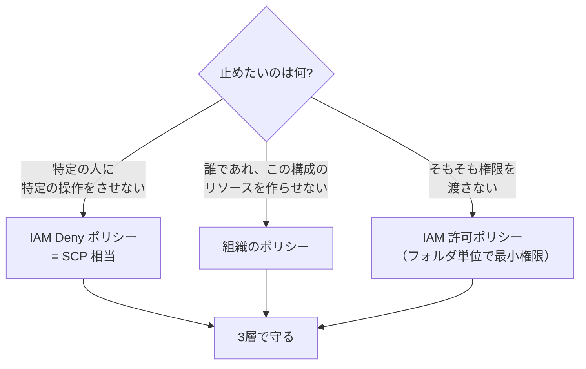
```mermaid
flowchart TD
    Q1{"止めたいのは何?"}
    Q1 -->|"特定の人に<br/>特定の操作をさせない"| D["IAM Deny ポリシー<br/>= SCP 相当"]
    Q1 -->|"誰であれ、この構成の<br/>リソースを作らせない"| O["組織のポリシー"]
    Q1 -->|"そもそも権限を<br/>渡さない"| I["IAM 許可ポリシー<br/>（フォルダ単位で最小権限）"]

    D --> R["3層で守る"]
    O --> R
    I --> R
```

| 要求 | 使うもの |
|------|----------|
| 「dev チームに prod を触らせない」 | IAM 許可ポリシー（prod フォルダにロールを付けない） |
| 「東京リージョン以外にリソースを作らせない」 | 組織のポリシー `gcp.resourceLocations` |
| 「Owner でも監査ログのシンクは消させない」 | IAM Deny ポリシー |
| 「Owner でも組織ポリシーを緩めさせない」 | IAM Deny ポリシー |

**ここで学んだこと**: AWS の SCP は 1 機能だが、Google Cloud では「組織のポリシー」と「IAM Deny ポリシー」に分かれている。**組織のポリシーは子で緩められるので、それ自体を守るために Deny ポリシーを重ねる**のが実務的な構成。

---

### 演習7: 課金ガバナンス（コンソール）

**目的**: 払い出した環境のコストを可視化し、暴走を検知する。

**この演習の全体地図**

| 項 | 何をするか | 一言で |
|---|---|---|
| 7-1 | 請求先アカウントの構成を決める（読み物） | 1個で始めるか部門ごとに分けるか |
| 7-2 | 予算アラートを作る | sandboxに月額10USD＋3段階しきい値 |
| 7-3 | 課金データをBigQueryにエクスポートする | コスト分析の土台（コンソール専用機能） |
| 7-4 | 課金の閲覧権限を配る | チームには自分のプロジェクトだけ、財務部門には全体 |

#### 7-1. 請求先アカウントの構成を決める

| 方式 | メリット | デメリット |
|------|----------|-----------|
| 請求先アカウント 1 個（全社共通） | 割引（確約利用割引の共有）が効きやすい。管理が単純 | 部門への直接請求が難しく、社内配賦が必要 |
| 部門ごとに複数 | 請求書レベルで分離。誤課金の影響範囲が小さい | 割引が分散。管理対象が増える |

まずは 1 個で始め、ラベルとタグでコストを分類、必要になったら分割するのが定石。

#### 7-2. 予算アラートを作る（コンソール）

sandbox プロジェクトに月額 10 USD の予算と 3 段階のしきい値を設定する。

1. コンソール左上の検索から **「お支払い」** を開き、対象の請求先アカウントを選択する
2. 左メニューの **「予算とアラート」** を開く
3. **「予算を作成」** をクリック
4. **「範囲」** で「プロジェクト」に `$PROJ_SBOX`（演習3で作った sandbox 用プロジェクト）を指定
5. **「金額」** で「指定の金額」を選び `10 USD` を入力
6. **「アクション」** のしきい値ルールで、50%・90%・100%（実績）・100%（**予測**支出ベース）の4つを追加
7. 内容を確認して **「完了」**

> ⚠️ **予算アラートは通知するだけで、課金を止めない**。AWS Budgets と同じ。「超えたら止める」を実現するには、予算通知を Pub/Sub に送り、Cloud Functions で `gcloud billing projects unlink` を実行する仕組みを自作する必要がある（sandbox 環境では実際によく使われる構成）。

**（参考）CLI 版**

```bash
gcloud services enable billingbudgets.googleapis.com --project="$PROJ_BOOT"

export PROJ_SBOX_NUM=$(gcloud projects describe "$PROJ_SBOX" --format="value(projectNumber)")

gcloud billing budgets create \
  --billing-account="$BILLING_ACCOUNT" \
  --display-name="sandbox-monthly-10usd" \
  --budget-amount=10USD \
  --filter-projects="projects/${PROJ_SBOX_NUM}" \
  --threshold-rule=percent=0.5 \
  --threshold-rule=percent=0.9 \
  --threshold-rule=percent=1.0 \
  --threshold-rule=percent=1.0,basis=forecasted-spend

gcloud billing budgets list --billing-account="$BILLING_ACCOUNT"
```

#### 7-3. 課金データを BigQuery にエクスポートする（コンソール）

コスト分析の土台。**この設定はコンソールからのみ**行える（gcloud コマンドは無い）。

1. 「お支払い」→ 対象の請求先アカウント → 左メニューの **「請求データのエクスポート」**
2. **「BigQuery データのエクスポートを編集」** をクリックし、エクスポート先の BigQuery データセットを指定（`common` フォルダ配下の課金分析用プロジェクトに作るのが定石）
3. 「標準の使用料金」と「料金データ」を有効化

エクスポート後、演習3 で付けた label でコストを集計できる。

```sql
SELECT
  project.id AS project_id,
  (SELECT value FROM UNNEST(labels) WHERE key = 'team')        AS team,
  (SELECT value FROM UNNEST(labels) WHERE key = 'cost-center') AS cost_center,
  SUM(cost) AS cost
FROM `PROJECT.DATASET.gcp_billing_export_v1_XXXXXX`
WHERE DATE(_PARTITIONTIME) >= DATE_SUB(CURRENT_DATE(), INTERVAL 30 DAY)
GROUP BY 1, 2, 3
ORDER BY cost DESC
```

#### 7-4. 課金の閲覧権限を配る（コンソール）

**各チームに自分のコストだけ見せる（プロジェクト単位）**

1. `$PROJ_DEV` を選択した状態で「IAM と管理」→「IAM」→ **「アクセス権を付与」**
2. 新しいプリンシパルに `gcp-team-a-dev@$DOMAIN`、ロールに **「請求先アカウント閲覧者」**（`roles/billing.viewer`）を指定して保存

**財務部門には請求先アカウント全体の閲覧権限**

1. 「お支払い」→ 対象の請求先アカウント → 左メニューの **「IAM と管理」**（演習1-3で触れた通り、請求先アカウントには「アカウント管理」ページの中に権限パネルがある）
2. **「アクセス権を付与」** → プリンシパルに `finance@$DOMAIN`、ロールに **「請求先アカウント閲覧者」** を指定して保存

**（参考）CLI 版**

```bash
# 各チームに自分のコストだけ見せる（プロジェクト単位）
gcloud projects add-iam-policy-binding "$PROJ_DEV" \
  --member="group:gcp-team-a-dev@${DOMAIN}" \
  --role="roles/billing.viewer"

# 財務部門には請求先アカウント全体の閲覧権限
gcloud billing accounts add-iam-policy-binding "$BILLING_ACCOUNT" \
  --member="group:finance@${DOMAIN}" \
  --role="roles/billing.viewer"
```

**✅ 確認ポイント**

```bash
gcloud billing budgets list --billing-account="$BILLING_ACCOUNT" \
  --format="table(displayName, amount.specifiedAmount.units, budgetFilter.projects)"
```

**ここで学んだこと**: 課金は階層の外にある独立した権限体系。「作れる人／課金を紐づけられる人／コストを見られる人」を分離できるのが Google Cloud の強み。**予算は止めない**ので、sandbox には自動停止の仕組みを別途用意する。

---

### 演習8: 監査ログの集約（コンソール）

**目的**: 組織配下すべてのプロジェクトの監査ログを 1 箇所に集約し、削除できないようにする。AWS の Organization Trail 相当。

**この演習の全体地図**

| 項 | 何をするか | 一言で |
|---|---|---|
| 8-1 | ログ集約先プロジェクトを作る | `common`フォルダ配下に監査ログ専用プロジェクト＋BigQueryデータセット |
| 8-2 | 組織レベルのログシンクを作る | 「子リソースを含める」で配下全部のログを対象に |
| 8-3 | シンクのライターIDに書き込み権限を付ける | 忘れるとログが1件も流れない最頻出のつまずき |
| 8-4 | データアクセスログを有効化する（任意） | 既定無効・有料のログを必要な範囲だけ有効化 |
| 8-5 | 動作確認 | BigQueryに実際にログが入るか確認 |

#### 8-1. ログ集約先プロジェクトを作る（コンソール）

1. 演習3-2 と同じ手順で、`common` フォルダ配下にプロジェクトを新規作成する（プロジェクト名の例: `audit logs`）
2. 作成したプロジェクトで「APIとサービス」→「ライブラリ」から **Cloud Logging API**・**BigQuery API** を有効化する
3. 「BigQuery」を開き、作成したプロジェクトを選択した状態で **「データセットを作成」**
4. データセットID（例: `audit_logs`）、ロケーション（`$LOCATION`）を指定して作成

**（参考）CLI 版**

```bash
export PROJ_LOG="${PREFIX}-audit-logs-${SUFFIX}"

gcloud projects create "$PROJ_LOG" --name="audit logs" --folder="$F_COMMON"
gcloud billing projects link "$PROJ_LOG" --billing-account="$BILLING_ACCOUNT"
gcloud services enable logging.googleapis.com bigquery.googleapis.com \
  --project="$PROJ_LOG"

# ログ保管用の BigQuery データセット
bq --project_id="$PROJ_LOG" mk --location="$LOCATION" --dataset audit_logs
```

#### 8-2. 組織レベルのログシンクを作る（コンソール）

**「子リソースを含める」設定が肝**。これで配下の全フォルダ・全プロジェクトのログが対象になる。

1. コンソール左上の検索から **「ロギング」** を開き、**「ログ ルーター」** を選ぶ
2. 画面上部のリソース選択で、スコープを **組織 `htrbass44.click`** に切り替える
3. **「シンクを作成」** をクリック
4. シンク名（例: `org-audit-sink`）を入力
5. **「シンクの宛先」** で「BigQuery データセット」を選び、8-1 で作った `$PROJ_LOG` の `audit_logs` データセットを指定
6. **「このリソースとすべての子リソースに取り込まれたログを含める」** にチェックを入れる（これが CLI の `--include-children` に相当）
7. 「包含フィルタを作成」で `logName:"cloudaudit.googleapis.com"` を指定
8. 「シンクを作成」で確定

**（参考）CLI 版**

```bash
gcloud logging sinks create org-audit-sink \
  "bigquery.googleapis.com/projects/${PROJ_LOG}/datasets/audit_logs" \
  --organization="$ORG_ID" \
  --include-children \
  --log-filter='logName:"cloudaudit.googleapis.com"'
```

#### 8-3. シンクのライター ID に書き込み権限を付ける（コンソール）

**ここを忘れるとログが 1 件も流れない**。最頻出のつまずきポイント。

1. 「ログ ルーター」の一覧（組織スコープ）で、作成したシンクの行を開く、または詳細を表示する
2. **「サービス アカウント」/「ライター ID」** に表示されているサービスアカウントのメールアドレスをコピーする
3. `$PROJ_LOG` プロジェクトの「IAM と管理」→「IAM」→「アクセス権を付与」で、そのサービスアカウントに **「BigQuery データ編集者」**（`roles/bigquery.dataEditor`）を付与する

**（参考）CLI 版**

```bash
export SINK_SA=$(gcloud logging sinks describe org-audit-sink \
  --organization="$ORG_ID" --format="value(writerIdentity)")
echo "$SINK_SA"

gcloud projects add-iam-policy-binding "$PROJ_LOG" \
  --member="$SINK_SA" \
  --role="roles/bigquery.dataEditor"
```

#### 8-4. データアクセスログを有効化する（任意）（コンソール）

管理アクティビティ監査ログ（誰が設定を変えたか）は**既定で有効・無料**。一方、データアクセス監査ログ（誰がデータを読んだか）は**既定で無効・有料**。必要な範囲だけ組織レベルで有効化する。

1. コンソール左上の検索から **「IAM と管理」→「監査ログ」** を開く（スコープが組織になっていることを確認）
2. 一覧から **「Cloud Storage」** を探してクリック
3. **「データ読み取り」**（DATA_READ）・**「データ書き込み」**（DATA_WRITE）にチェックを入れて保存

> ⚠️ 全サービスで DATA_READ を有効にすると**ログ量とコストが爆発する**。必要なサービスに絞ること。

**（参考）CLI 版**

```bash
gcloud organizations get-iam-policy "$ORG_ID" --format=yaml > tmp/org-policy.yaml

# tmp/org-policy.yaml の先頭に以下を追記して編集
cat <<'EOF'
auditConfigs:
- auditLogConfigs:
  - logType: DATA_READ
  - logType: DATA_WRITE
  service: storage.googleapis.com
EOF

# 編集後に適用（etag の競合に注意）
gcloud organizations set-iam-policy "$ORG_ID" tmp/org-policy.yaml
```

#### 8-5. 動作確認（コンソール）

1. 「ロギング」→「ログ ルーター」（組織スコープ）で、作成したシンクが一覧に出ていることを確認
2. 何か操作（例: フォルダの説明を変更）を行う
3. 数分後、「BigQuery」で `$PROJ_LOG` の `audit_logs` データセット配下にテーブルが作られていることを確認し、テーブルをプレビューする

**（参考）CLI 版**

```bash
gcloud logging sinks list --organization="$ORG_ID"
gcloud logging sinks describe org-audit-sink --organization="$ORG_ID"

bq query --project_id="$PROJ_LOG" --use_legacy_sql=false \
'SELECT timestamp, protopayload_auditlog.methodName, protopayload_auditlog.authenticationInfo.principalEmail
 FROM `'"$PROJ_LOG"'.audit_logs.cloudaudit_googleapis_com_activity`
 ORDER BY timestamp DESC LIMIT 10'
```

**✅ 確認ポイント**: ライター ID に `roles/bigquery.dataEditor` が付いており、数分後に BigQuery にレコードが入る。

**ここで学んだこと**: `--include-children` 付き組織シンクが AWS の Organization Trail 相当。ライター ID への権限付与が必須で、ここを忘れる事故が非常に多い。演習6 の Deny ポリシーでこのシンクを保護すると、監査基盤が完成する。

---

### 演習9: 払い出しの自動化（bash → Terraform）

**目的**: 手作業の払い出しをコード化し、Project Factory の考え方を理解する。

#### 9-1. まず bash スクリプトにまとめる

払い出しスクリプトは [`scripts/provision-project.sh`](../handson/scripts/provision-project.sh) に用意してある。中身は演習3 で手作業した 5 ステップをそのまま並べたもの。

```bash
sed -n '1,20p' scripts/provision-project.sh
```

要点だけ抜き出すとこうなっている。

```bash
#!/usr/bin/env bash
set -euo pipefail                      # 途中で失敗したら止める（中途半端な払い出しを残さない）

TEAM="$1"; APP="$2"; ENV="$3"; FOLDER_ID="$4"; CC="$5"

# activate.sh 由来の変数が無ければ即座にエラーにする
: "${PREFIX:?PREFIX が未設定です。source activate.sh してください}"
: "${BILLING_ACCOUNT:?BILLING_ACCOUNT が未設定です}"

PROJECT_ID="${PREFIX}-${TEAM}-${APP}-${ENV}-$(openssl rand -hex 3)"

gcloud projects create "$PROJECT_ID" --folder="$FOLDER_ID"   --labels="env=${ENV},team=${TEAM},app=${APP},cost-center=${CC}"
gcloud billing projects link "$PROJECT_ID" --billing-account="$BILLING_ACCOUNT"
gcloud services enable compute.googleapis.com logging.googleapis.com   monitoring.googleapis.com --project="$PROJECT_ID"
gcloud projects add-iam-policy-binding "$PROJECT_ID"   --member="group:gcp-${TEAM}-${ENV}@${DOMAIN}" --role="roles/editor"
```

> **`: "${VAR:?メッセージ}"` の意味**: 変数が未設定なら、そのメッセージを出して即座に終了する bash のイディオム。`source activate.sh` を忘れたまま実行して、`PREFIX` が空のまま `-teama-api-dev-xxx` という妙なプロジェクトを作ってしまう事故を防ぐ。**払い出しスクリプトには必ず入れる**。

```bash
source activate.sh
scripts/provision-project.sh teamb web dev "$F_NONPROD" cc2002
```

**bash 版の限界**: 冪等性がない（再実行すると失敗する）、削除の逆操作がない、現在の状態を把握できない。だから Terraform に移す。

#### 9-2. Terraform で階層とプロジェクトを宣言する

```bash
cd "$HANDSON_ROOT/tf"
```

`main.tf`:

```hcl
terraform {
  required_version = ">= 1.5"
  required_providers {
    google = {
      source  = "hashicorp/google"
      version = "~> 6.0"
    }
  }
}

provider "google" {}

variable "org_id"          { type = string }
variable "billing_account" { type = string }
variable "prefix"          { type = string }

# ---- フォルダ階層 ----
locals {
  top_folders = ["bootstrap", "common", "prod", "nonprod", "sandbox"]
}

resource "google_folder" "top" {
  for_each     = toset(local.top_folders)
  display_name = each.value
  parent       = "organizations/${var.org_id}"
  deletion_protection = false
}

# ---- Project Factory: YAML 的な map から一括生成 ----
variable "projects" {
  description = "払い出すプロジェクトの定義"
  type = map(object({
    folder      = string        # top_folders のキー
    env         = string
    team        = string
    cost_center = string
    apis        = list(string)
    editors     = list(string)  # "group:xxx@example.com"
  }))
  default = {
    "teama-api-dev" = {
      folder      = "sandbox"
      env         = "sandbox"
      team        = "team-a"
      cost_center = "cc1001"
      apis        = ["compute.googleapis.com", "logging.googleapis.com"]
      editors     = []
    }
    "teama-api-prod" = {
      folder      = "prod"
      env         = "prod"
      team        = "team-a"
      cost_center = "cc1001"
      apis        = ["compute.googleapis.com", "logging.googleapis.com"]
      editors     = []
    }
  }
}

resource "random_id" "suffix" {
  for_each    = var.projects
  byte_length = 3
}

resource "google_project" "app" {
  for_each = var.projects

  project_id      = "${var.prefix}-${each.key}-${random_id.suffix[each.key].hex}"
  name            = each.key
  folder_id       = google_folder.top[each.value.folder].name
  billing_account = var.billing_account

  labels = {
    env         = each.value.env
    team        = each.value.team
    cost-center = each.value.cost_center
  }

  deletion_policy = "DELETE"
}

resource "google_project_service" "apis" {
  for_each = merge([
    for pk, pv in var.projects : {
      for api in pv.apis : "${pk}/${api}" => { project = pk, api = api }
    }
  ]...)

  project                    = google_project.app[each.value.project].project_id
  service                    = each.value.api
  disable_dependent_services = true
}

resource "google_project_iam_member" "editors" {
  for_each = merge([
    for pk, pv in var.projects : {
      for m in pv.editors : "${pk}/${m}" => { project = pk, member = m }
    }
  ]...)

  project = google_project.app[each.value.project].project_id
  role    = "roles/editor"
  member  = each.value.member
}

# ---- ガードレール ----
resource "google_org_policy_policy" "prod_locations" {
  name   = "${google_folder.top["prod"].name}/policies/gcp.resourceLocations"
  parent = google_folder.top["prod"].name

  spec {
    rules {
      values {
        allowed_values = ["in:asia-northeast1-locations"]
      }
    }
  }
}

resource "google_org_policy_policy" "prod_no_sa_key" {
  name   = "${google_folder.top["prod"].name}/policies/iam.disableServiceAccountKeyCreation"
  parent = google_folder.top["prod"].name

  spec {
    rules { enforce = "TRUE" }
  }
}

output "project_ids" {
  value = { for k, v in google_project.app : k => v.project_id }
}
```

`terraform.tfvars`:

```hcl
org_id          = "123456789012"
billing_account = "0X0X0X-0X0X0X-0X0X0X"
prefix          = "lz"
```

実行:

```bash
cd "$HANDSON_ROOT/tf"
terraform init
terraform plan
terraform apply
```

> **注意**: 演習2 で既に同名のフォルダを gcloud で作成している場合、`terraform apply` は重複したフォルダを作ろうとする。既存を取り込む場合は `terraform import google_folder.top[\"prod\"] folders/FOLDER_ID` を使うか、演習10 で先に手動作成分を削除する。

#### 9-3. Project Factory の考え方

上の `var.projects` map が **Project Factory** の本質。実務では、これを YAML ファイルに切り出し、利用チームが Pull Request で YAML を追加 → CI がレビュー・`terraform apply` → プロジェクトが払い出される、という **GitOps 型の払い出し**にする。

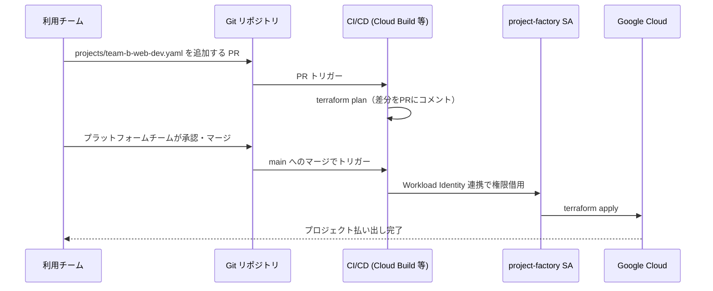
```mermaid
sequenceDiagram
    participant Team as 利用チーム
    participant Git as Git リポジトリ
    participant CI as CI/CD (Cloud Build 等)
    participant SA as project-factory SA
    participant GCP as Google Cloud

    Team->>Git: projects/team-b-web-dev.yaml を追加する PR
    Git->>CI: PR トリガー
    CI->>CI: terraform plan（差分をPRにコメント）
    Team->>Git: プラットフォームチームが承認・マージ
    Git->>CI: main へのマージでトリガー
    CI->>SA: Workload Identity 連携で権限借用
    SA->>GCP: terraform apply
    GCP-->>Team: プロジェクト払い出し完了
```

> **キーの権限設計**: CI から SA を使うときは、**サービスアカウントキー（JSON）を発行しない**。GitHub Actions なら Workload Identity 連携、Cloud Build ならサービスアカウントの直接指定を使う。演習5 で `iam.disableServiceAccountKeyCreation` を強制したのはこのため。

**✅ 確認ポイント**

```bash
terraform output project_ids
gcloud projects list --filter="parent.id=${F_PROD}"
```

**ここで学んだこと**: Control Tower の Account Factory 相当は自前で作る。実体は「map / YAML から `for_each` でプロジェクトを生成する Terraform」。本番では Cloud Foundation Fabric FAST や terraform-example-foundation をベースにする。

---

### 演習10: クリーンアップ

**目的**: 課金の発生を止め、削除の依存関係を理解する。

削除は**作成と逆順**で行う。プロジェクトがあるフォルダは削除できない。

```bash
source activate.sh

# 1) Terraform で作ったものを破棄
cd "$HANDSON_ROOT/tf" && terraform destroy && hs

# 2) 手動作成した VM
gcloud compute instances delete test-vm \
  --project="$PROJ_SBOX" --zone="${LOCATION}-a" --quiet || true

# 3) 予算
for B in $(gcloud billing budgets list --billing-account="$BILLING_ACCOUNT" \
             --format="value(name)"); do
  gcloud billing budgets delete "$B" --quiet
done

# 4) ログシンク
gcloud logging sinks delete org-audit-sink --organization="$ORG_ID" --quiet

# 5) Deny ポリシー（先に消さないと以降の操作がブロックされうる）
gcloud iam policies delete deny-guardrail \
  --attachment-point="cloudresourcemanager.googleapis.com/organizations/${ORG_ID}" \
  --kind=denypolicies --quiet

# 6) 組織のポリシー
gcloud org-policies delete gcp.resourceLocations --folder="$F_SANDBOX" --quiet
gcloud org-policies delete iam.disableServiceAccountKeyCreation --folder="$F_PROD" --quiet
gcloud org-policies delete compute.vmExternalIpAccess --folder="$F_SANDBOX" --quiet
gcloud org-policies delete storage.publicAccessPrevention --folder="$F_SANDBOX" --quiet
gcloud org-policies delete compute.requireShieldedVm --folder="$F_SANDBOX" --quiet
gcloud org-policies delete iam.allowedPolicyMemberDomains --organization="$ORG_ID" --quiet

# 7) プロジェクト（30日間は復元可能な「削除保留」状態になる）
for P in "$PROJ_DEV" "$PROJ_SBOX" "$PROJ_LOG" "$PROJ_BOOT"; do
  gcloud projects delete "$P" --quiet || true
done

# 8) フォルダ（配下が空になってから）
for F in "$F_PROD_TEAMA" "$F_SANDBOX_TEAMA" \
         "$F_PROD" "$F_NONPROD" "$F_SANDBOX" "$F_COMMON" "$F_BOOTSTRAP"; do
  gcloud resource-manager folders delete "$F" --quiet || true
done

# 9) カスタムロール（削除は論理削除、7日後に完全削除）
gcloud iam roles delete lzAuditor --organization="$ORG_ID" --quiet

# 10) グループのメンバーシップとグループ（演習4-1・4-2b）
gcloud identity groups memberships delete \
  --group-email="gcp-team-a-dev@${DOMAIN}" \
  --member-email="yamada.taro@${DOMAIN}" --quiet
gcloud identity groups delete "gcp-team-a-dev@${DOMAIN}" --quiet
```

**⚠️ ユーザー（`yamada.taro@htrbass44.click`）だけは CLI で削除できない**

`gcloud identity` にはグループ作成と同様、**ユーザー削除のコマンドも存在しない**。Admin コンソールから手動で削除する。

1. <https://admin.google.com> → 「ディレクトリ」→「ユーザー」
2. `yamada.taro@htrbass44.click` を選択
3. 「その他の操作」（縦三点リーダー）→「ユーザーを削除」

> 学習用の架空ユーザーとはいえ、放置すると Cloud Identity Free の**ユーザー数上限（50）**を静かに消費し続ける。ハンズオンを終えたら忘れずに削除する。

**✅ 確認ポイント**

```bash
gcloud projects list --filter="lifecycleState=ACTIVE AND projectId~^${PREFIX}-"
gcloud resource-manager folders list --organization="$ORG_ID"
gcloud identity groups memberships list --group-email="gcp-team-a-dev@${DOMAIN}" 2>&1 || echo "グループ削除済み"
```

> **削除保留について**: `gcloud projects delete` は即時削除ではなく、30 日間の削除保留状態にする。復元は `gcloud projects undelete PROJECT_ID`。ただし**プロジェクト ID は削除後も再利用できない**。

**ここで学んだこと**: 階層構造は削除の依存関係も作る。Deny ポリシーは自分の後片付けまでブロックしうるので、除外プリンシパルの設計は「削除する権限」も含めて考える必要がある。

---

## 4. 習得事項のまとめ

### 4.1 触れた要素の一覧

| 領域 | 使ったもの | AWS での対応 |
|------|-----------|--------------|
| 階層 | `gcloud organizations list/describe`, `gcloud resource-manager folders create` | Organizations / OU |
| 払い出し | `gcloud projects create --folder`, `gcloud billing projects link`, `gcloud services enable` | Account Factory |
| 分類 | プロジェクト label、Resource Manager tag（tag bindings） | コスト配分タグ / タグポリシー |
| IAM | フォルダ単位の `add-iam-policy-binding`、カスタムロール、`get-ancestors`、Policy Troubleshooter | IAM / SSO |
| ガードレール | `gcloud org-policies set-policy`、dry-run（`dryRunSpec`）、子での上書き | SCP（構成制約側） |
| ガードレール | `gcloud iam policies create --kind=denypolicies` | SCP（権限拒否側） |
| 課金 | `gcloud billing budgets create`、BigQuery 課金エクスポート、`roles/billing.user` の分離 | Budgets / CUR |
| 監査 | 組織シンク `--include-children`、writerIdentity への権限付与、Data Access ログ | Organization Trail |
| 通知 | `gcloud essential-contacts create` | アカウント連絡先 |
| 自動化 | bash スクリプト、Terraform（`google_folder` / `google_project` / `google_org_policy_policy`） | Control Tower / CfCT |

### 4.2 覚えておくべき「Google Cloud 特有の勘所」

1. **組織は Cloud Identity から生える** — API では作れない。組織設計＝ ID 基盤設計。
2. **既定がゆるい** — ドメイン全員の `projectCreator` を剥がすのが Day 1 作業。
3. **IAM 許可は下位で剥がせない** — 上位に強いロールを置かない。絞りたいなら OrgPolicy / Deny を使う。
4. **組織のポリシーは子で緩められる** — SCP と違う。緩めさせたくないなら Deny ポリシーで守る。
5. **label ≠ tag** — 条件付き IAM・条件付き OrgPolicy に使えるのは tag。
6. **請求先アカウントは階層の外** — 「作る権限」と「課金を紐づける権限」を分離できる。
7. **予算は止めない** — 自動停止は自作。
8. **ログシンクは writerIdentity への権限付与が必須**。
9. **フォルダ作成 API は 6 リクエスト/分** — 大規模階層は時間がかかる。
10. **プロジェクト ID は再利用不可・変更不可** — 命名規約は最初に確定させる。

### 4.3 トラブルシューティング

| 症状 | 原因 | 対処 |
|------|------|------|
| **`gcloud ... /tmp/x.yaml` で `Unable to read file`** | GitBash の `/tmp` とネイティブ Windows プログラムが見る `/tmp` が別物 | `handson/` を cwd にして**相対パス**で渡す（`policies/x.yaml`）。絶対パスが要るなら `"$(np policies/x.yaml)"` |
| **シェルを開き直すと `$ORG_ID` 等が空** | 変数をシェル上でしか export していない | `env_set ORG_ID <値>` で `env/handson.env` に永続化する。以後は `source activate.sh` だけで復元 |
| **払い出しスクリプトが変な名前のプロジェクトを作った** | `source activate.sh` を忘れ、`PREFIX` が空だった | スクリプト冒頭の `: "${PREFIX:?...}"` で防ぐ（同梱済み）。作ってしまったら `gcloud projects delete` |
| `gcloud organizations list` が空 | Cloud Identity/Workspace ドメイン未紐付け、または権限不足 | 特権管理者でログインし直す。`gcloud auth list` を確認 |
| `PERMISSION_DENIED` でプロジェクト作成できない | 演習1 で `projectCreator` を剥がした | 自分または SA に `roles/resourcemanager.projectCreator` を再付与 |
| `gcloud services enable` が失敗する | 請求先アカウント未リンク | `gcloud billing projects link` を先に実行 |
| `billing projects link` が権限エラー | 請求先アカウント側の `roles/billing.user` が無い | `gcloud billing accounts add-iam-policy-binding` で付与 |
| 組織ポリシーが効かない／効きすぎる | 継承と上書きの解決結果を見ていない | `gcloud org-policies describe CONSTRAINT --project=X --effective` で実効値を確認 |
| ログシンクを作ったのにログが来ない | writerIdentity に宛先への書き込み権限が無い | `describe` で writerIdentity を取得し、宛先に `roles/bigquery.dataEditor` 等を付与 |
| Deny ポリシー適用後に自分も操作できない | `exceptionPrincipals` に自分が入っていない | Cloud Identity 特権管理者で `gcloud iam policies delete` |
| フォルダが削除できない | 配下にプロジェクト／子フォルダが残っている | 先に配下を削除。`gcloud projects list --filter="parent.id=FOLDER_ID"` で確認 |
| `iam.allowedPolicyMemberDomains` 適用後、Google 管理 SA に権限を付けられない | 制約が外部プリンシパルを全部弾いている | 該当フォルダで例外ポリシーを設定するか、許可値に対象の顧客 ID を追加 |
| `gcloud projects create` で ID が衝突 | プロジェクト ID は全世界で一意 | ランダムサフィックスを付ける（演習3・9 の方式） |
| Terraform で「already exists」 | gcloud で手動作成した分と重複 | `terraform import` で取り込むか、手動作成分を削除 |
| **コンソールの「タグ」ページで「追加のアクセス権が必要です」** | `organizationAdmin` にタグ管理権限が含まれない | `roles/resourcemanager.tagAdmin`（キー/値の管理）と `roles/resourcemanager.tagUser`（バインド）を追加付与 |
| 権限付与後もコンソールがエラーのまま | ブラウザが古い権限チェック結果をキャッシュ | `Ctrl+Shift+R` で強制再読み込み。CLI（`gcloud resource-manager tags keys list`）で先に反映確認すると切り分けやすい |
| **新規作成した Google グループをコンソールのプリンシパル欄に入力するとエラーになる** | Admin コンソールでのグループ作成と、Cloud IAM 側のプリンシパル検証システムへの反映にタイムラグがある | 数分待って再試行。急ぐ場合は CLI の `add-iam-policy-binding` を使う（対話的な検証をしないため影響を受けにくい） |
| プリンシパル欄の候補に `xxx.test-google-a.com` が出る | Google が自動発行する**メール受信テスト専用のエイリアス**。実運用の識別子ではない | 選ばない。本来のドメインのアドレスが認識されるまで待つか、CLI で直接指定する |
| **`prod` フォルダに意図せず `editor`（本来は `viewer`）が付いていた** | コンソールのロール選択欄が直前の選択を覚えており、環境ごとの違いを付け忘れた | フォルダごとに設定後は必ず `get-iam-policy` で実際のロールを確認する習慣をつける |
| 請求先アカウントの画面に **「IAM と管理」が見当たらない** | 請求先アカウントには専用のIAMページが無く、「アカウント管理」ページに権限パネルが組み込まれている | 左メニュー最下部の「アカウント管理」をクリックする。それでも見えない場合は `roles/billing.admin` を持つアカウントに切り替える（`billing.user` では編集不可） |
| **「ロール」ページで「カスタムロールのリストを取得する権限がありません」** | `organizationAdmin` にカスタムロール管理権限が含まれない | `roles/iam.organizationRoleAdmin` を付与（**`roles/iam.roleAdmin` は組織では使えない**。それはプロジェクト専用のロール名） |
| IAM ポリシー トラブルシューターのリソース検索で、サブネットワーク等の無関係なリソースまでヒットする | 「リソースの種類」が既定で全種類（100件以上）を対象にしている | 「リソースの種類」ドロップダウンで「Project」など目的の種類だけに絞り込んでから検索する |
| **タグの `namespacedName` が `environment /dev` のように途中にスペースが入る** | コンソールのタグキー入力欄に末尾スペースが混入。**API側でtrim/検証されず、そのまま登録される** | `short_name` は作成後に変更不可（`tags keys update` は description のみ変更可）。バインディング→タグ値→タグキーの順で削除し、正しい名前で作り直す |
| 組織のポリシーを`enforce: false`に戻したのに、VM作成画面で古い制約違反の警告が消えない | `gcloud ... --effective` はAPI側では即時反映されているが、コンソールのVM作成画面側の評価に数分の反映遅延がある | ページをリロードして数分待ってから再試行する。急ぐ場合はCLI（`gcloud org-policies describe CONSTRAINT --folder=X --effective`）でAPI側の値を先に確認すると切り分けやすい |
| `compute.requireShieldedVm` を `enforce: true` にしたのにVM作成が普通に成功する | 誤解：この制約は「作成禁止」ではなく「条件（セキュアブート等）を満たさない構成での作成禁止」。既定イメージは条件を満たした状態で作成されるため、何もしなければ成功する | ブロックを確認したい場合は、作成画面の「セキュリティ」→「Shielded VM」で意図的にセキュアブート等を外して試す |

### 4.4 実務への持ち込み方

- **段階導入**: いきなり全ガードレールを enforce しない。`dryRunSpec` で 2〜4 週間観測 → 例外を洗い出す → enforce の順で進める。
- **例外は期限付きで管理**: 子フォルダでの上書きは Terraform コード上にコメントで期限と理由を書き、定期棚卸しする。
- **払い出しは GitOps に寄せる**: YAML の PR → CI で plan → 承認 → apply。誰がいつ何を払い出したかが Git 履歴に残る。
- **既存プロジェクトの取り込み**: 組織外の既存プロジェクトは `gcloud beta projects move PROJECT_ID --folder=FOLDER_ID` で階層に取り込める。取り込んだ瞬間に組織のポリシーが効き始めるので、必ず dry-run を先に。
- **本番構築は既製品から始める**: 一から書かず、Cloud Foundation Fabric FAST か terraform-example-foundation を fork してカスタマイズするのが最短。

---

## 5. 今後の学習ロードマップ

### 優先度順の次のステップ

| 優先度 | トピック | 理由・学ぶこと |
|:---:|----------|----------------|
| ★★★ | **ネットワーク設計（共有 VPC / VPC Service Controls）** | 払い出しの次に必ず来る課題。共有 VPC のホスト／サービスプロジェクト構成、VPC-SC によるデータ持ち出し防止は、AWS の Transit Gateway / Organizations の SCP とは全く別の考え方。ランディングゾーンの半分はネットワーク設計 |
| ★★★ | **Cloud Foundation Fabric FAST / terraform-example-foundation の実装読解** | 本ハンズオンで手で作ったものが、production-ready にどう組まれているかを読む。ステージ分割（bootstrap → resman → networking → security → project factory）の設計思想を学ぶ |
| ★★ | **Security Command Center と組織レベルの脅威検知** | ガードレールをすり抜けた設定ミス・脅威を検知する層。Premium/Enterprise ティアの機能差とコストの見極めが実務では重要 |
| ★★ | **ID 連携（Workforce Identity 連携 / Workload Identity 連携）** | 既存の社内 IdP（Entra ID / Okta）と Cloud Identity をどう繋ぐか。CI/CD からのキーレス認証（Workload Identity 連携）は、演習5 で SA キーを禁止した以上、必須の知識 |
| ★ | **FinOps（コミット割引・コスト配賦・Recommender）** | 確約利用割引を組織横断でどう共有・配賦するか。演習7 の BigQuery エクスポートを土台にした分析の実践 |

### 参考リンク

**公式ドキュメント（一次情報）**

- ランディングゾーン設計全体: <https://docs.cloud.google.com/architecture/landing-zones>
- リソース階層の決め方: <https://docs.cloud.google.com/architecture/landing-zones/decide-resource-hierarchy>
- ネットワーク設計の決め方: <https://docs.cloud.google.com/architecture/landing-zones/decide-network-design>
- 組織リソースのセットアップ: <https://docs.cloud.google.com/resource-manager/docs/creating-managing-organization>
- フォルダの作成と管理: <https://docs.cloud.google.com/resource-manager/docs/creating-managing-folders>
- Resource Manager の割り当てと上限: <https://docs.cloud.google.com/resource-manager/docs/limits>
- 組織のポリシーの dry-run: <https://docs.cloud.google.com/resource-manager/docs/organization-policy/dry-run-policy>
- カスタム制約の作成: <https://cloud.google.com/resource-manager/docs/organization-policy/creating-managing-custom-constraints>
- タグの作成と管理: <https://docs.cloud.google.com/resource-manager/docs/tags/tags-creating-and-managing>
- IAM Deny ポリシー: <https://docs.cloud.google.com/iam/docs/deny-access>
- 予算とアラート: <https://docs.cloud.google.com/billing/docs/how-to/budgets>
- Cloud Billing Budget API: <https://docs.cloud.google.com/billing/docs/how-to/budget-api>
- Cloud Identity のエディション: <https://docs.cloud.google.com/identity/docs/editions>
- Cloud Identity Free 登録: <https://workspace.google.com/gcpidentity/signup?sku=identitybasic>

**リファレンス実装（Terraform）**

- Cloud Foundation Fabric（モジュール＋FAST）: <https://github.com/GoogleCloudPlatform/cloud-foundation-fabric>
- Fabric FAST（ステージ構成の解説）: <https://github.com/GoogleCloudPlatform/cloud-foundation-fabric/blob/master/fast/README.md>
- Fabric Project Factory: <https://github.com/GoogleCloudPlatform/cloud-foundation-fabric/tree/master/modules/project-factory>

**コマンドリファレンス**

- `gcloud org-policies`: <https://docs.cloud.google.com/sdk/gcloud/reference/org-policies>
- `gcloud resource-manager org-policies`: <https://docs.cloud.google.com/sdk/gcloud/reference/resource-manager/org-policies>
- `gcloud billing projects link`: <https://docs.cloud.google.com/sdk/gcloud/reference/billing/projects/link>
- `gcloud essential-contacts create`: <https://docs.cloud.google.com/sdk/gcloud/reference/essential-contacts/create>
