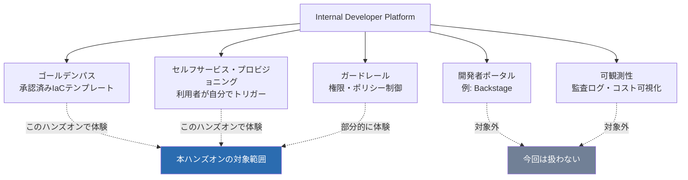
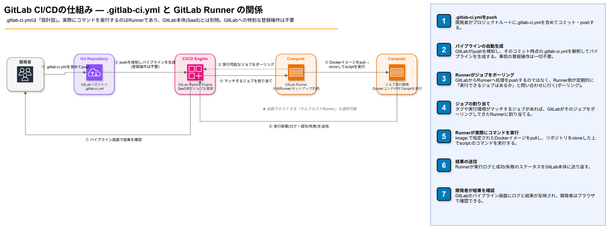
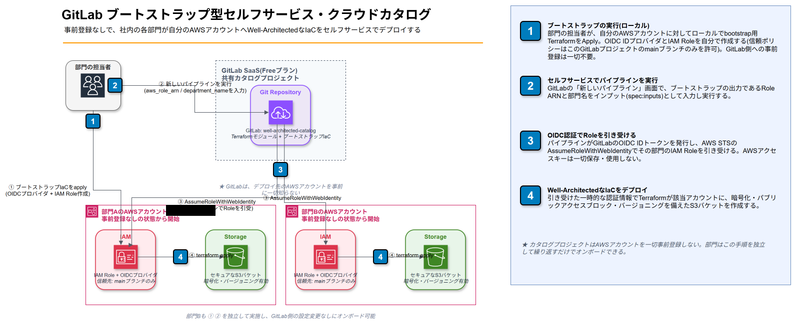
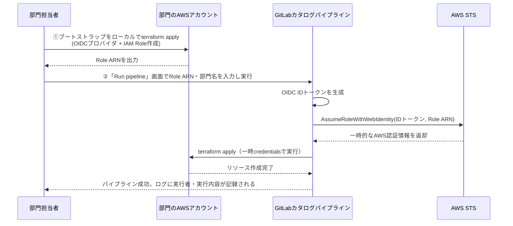

# GitLab IDP的セルフサービス・クラウドカタログ ハンズオン — 事前登録なしで社内の誰もが自分のAWSアカウントにWell-Architected構成をデプロイできるようにする

## 1. 勉強対象の概要

### 1.1 IDP（Internal Developer Platform）とは

IDPとは、組織内の開発者・利用部門が、インフラの専門知識を持たなくても「承認済みの構成」を自分でセルフサービス的に使えるようにする社内基盤の考え方です。目的は、中央のプラットフォーム/インフラチームがすべてのリクエストを個別対応するボトルネックを解消しつつ、セキュリティやコストのガードレールは維持することです。

IDPは単一の製品ではなく、複数の機能要素の組み合わせで構成されます。

| 構成要素 | 役割 |
|---|---|
| ゴールデンパス（Golden Path） | あらかじめレビュー・承認された「お手本のテンプレート」。ゼロから設計させない |
| セルフサービス・プロビジョニング | 利用者が自分でトリガーして環境を作れる仕組み |
| 開発者ポータル | カタログを検索・起動するGUI（例: Backstage） |
| ガードレール | 誰が・何を・どこまでできるかの権限/ポリシー制御 |
| 可観測性 | 誰が何を作ったか、コストはいくらかを追跡できる状態 |



本ハンズオンでは、GitLabの標準機能（プロジェクト、CI/CDパイプライン、OIDC連携）だけを使って、IDPの中核である「ゴールデンパス」と「セルフサービス・プロビジョニング」を小さく再現します。BackstageのようなポータルUIや、組織横断の可観測性基盤は対象外です。

### 1.2 AWS Service Catalogとの違い

「クラウドカタログ」と聞くとAWS Service Catalogを連想する方も多いはずです。目指す姿は似ていますが、実現方法が異なります。

| 観点 | AWS Service Catalog | 本ハンズオン（GitLab CI/CD） |
|---|---|---|
| 位置づけ | AWSのマネージドサービス | GitLabの標準機能を組み合わせた自作の仕組み |
| UI/ポータル | 専用の「Products」ポータルあり | 専用ポータルなし。パイプライン画面が実質のUI |
| 権限の代理実行 | Launch Constraintでネイティブに提供 | OIDC連携でRunnerがIAM Roleをassumeする形で自作 |
| マルチアカウント配布 | AWS Organizations連携でポートフォリオを一括共有 | 利用者自身が自分のアカウントに信頼関係を作る（後述） |
| コードレビュー | 標準機能としては弱い | GitのMR（マージリクエスト）で自然に統合 |
| 対象範囲 | AWS（CloudFormation中心） | クラウド・ツールを問わない |

### 1.3 中心概念

| 用語 | 意味 |
|---|---|
| ゴールデンパス | 中央プロジェクトで管理する、レビュー済みのTerraformモジュール |
| OIDCフェデレーション | GitLabが発行するIDトークンを使い、AWSキーを保存せずにAWS認証する仕組み |
| ブートストラップ | 利用者が自分のAWSアカウントで最初に一度だけ実行し、GitLabとの信頼関係を作るIaC |
| パイプライン入力変数 | パイプラインを手動実行する際にその場で指定する値（事前登録不要） |
| GitLab-managed Terraform state | GitLabが提供するTerraformのリモートステートバックエンド |

### 1.4 セルフサービスの2つの型：事前登録型とブートストラップ型

「部門が自分のAWSアカウントにデプロイする」を実現する方法には、大きく2つの型があります。

| | 事前登録型（パターンB） | ブートストラップ型（パターンA・本ハンズオンで採用） |
|---|---|---|
| 対象アカウントの把握 | 管理者が事前に一覧化し、GitLab側にRole ARNを登録しておく | 管理者は事前に把握しない。利用者が自分で信頼関係を作ってから使う |
| GitLab側の構成 | 部門ごとに別プロジェクト、または部門ごとにCI/CD変数を用意 | 単一の共有カタログプロジェクト。誰でも実行時にRole ARNを入力する |
| 向いている場面 | 対象アカウントの数が少なく固定的、社内の正式な部門管理下にある場合 | 対象アカウントの数が可変・不特定、利用者に自律的に始めてほしい場合（社外顧客向けSaaS連携でも同じ考え方が使われる） |

今回は「社内の部門が持つAWSアカウントが対象だが、事前登録なしで自由にデプロイできるようにしたい」というご要望のため、**パターンA（ブートストラップ型）** でハンズオンを構成します。この型は、DatadogやSnyk等のSaaSベンダーが顧客のAWSアカウントに対して行う「クロスアカウント連携」の仕組みと基本的に同じ考え方です。

### 1.5 `.gitlab-ci.yml`とGitLab Runnerの関係

ハンズオンの手順に入る前に、GitLab CI/CDの土台となる2つの疑問を整理しておきます。

- **`.gitlab-ci.yml`というファイル名は決まっているのか**: はい、GitLabのデフォルトの規約として、プロジェクトルート直下の`.gitlab-ci.yml`が使われます（`Settings > CI/CD > General pipelines`で変更も可能ですが、本ハンズオンでは標準のまま使用します）
- **このファイルをコミットするだけでパイプラインが定義されるのか**: その通りです。特別な「登録」操作は不要です。ファイルをpushした時点で、そのブランチ・コミットに対する有効なパイプライン定義になります。パイプライン定義そのものがコードと同じようにGitでバージョン管理されます

もう一つ重要なのが、**「`.gitlab-ci.yml`はあくまで設計図であり、実際にコマンドを実行するのはGitLab Runnerという別の実行主体である」** という点です。



| ステップ | 内容 |
|---|---|
| ①②(push→パイプライン生成) | 開発者が`.gitlab-ci.yml`をpushすると、GitLab本体（SaaS側）がそれを検知し、コミット時点の内容を解釈して「パイプライン」（ステージとジョブの集合）を生成する。事前の登録操作は一切不要 |
| ③④(ポーリング→割り当て) | GitLab RunnerはGitLabから処理を一方的に押し付けられるのではなく、**Runner側から**「実行できるジョブはあるか」と定期的に問い合わせる（ポーリング）。マッチするジョブがあればGitLabがそれを割り当てる |
| ⑤(実行) | Runnerが`image:`で指定されたDockerイメージをpullし、リポジトリをcloneした上で、`script:`に書かれたコマンドを実際に実行する |
| ⑥⑦(結果送信→確認) | 実行結果（ログ・成功/失敗）がGitLabに送り返され、開発者はパイプライン画面で確認する |

GitLab.comを利用する場合、通常は`saas-linux-small-amd64`のような**共有Runner**が自動的に使われるため、自分でRunnerをセットアップする必要はありません（本ハンズオンの演習3以降で実際に確認します）。自社で専用の実行環境が必要な場合は、自前でホストする「セルフホストRunner」を登録することもできます。

---

## 2. ハンズオンの概要

### 2.1 想定環境・所要時間

| 項目 | 内容 |
|---|---|
| GitLab | GitLab SaaS（GitLab.com）Freeプラン |
| AWSアカウント | 2つ以上（部門Aを模したアカウント、部門Bを模したアカウント）。1アカウントしかない場合はIAM Roleを2つ作って代用可 |
| ローカル環境 | GitBash、Git、Terraform CLI、AWS CLI（ブートストラップの実行に必須） |
| 所要時間目安 | 2.5〜3時間 |
| 前提知識 | GitLabの基本操作、Terraformの基礎、AWS IAMの基礎 |

### 2.2 ゴールイメージ

このハンズオンを終えると、以下の状態になります。

- GitLab上には**単一の共有カタログプロジェクト**（Well-Architectedを意識したS3ストレージ構成のIaC）だけが存在し、部門ごとにプロジェクトを増やす必要がない
- 部門Aの担当者は、**GitLab側に一切事前登録されていない状態**から、自分のAWSアカウントで1回だけブートストラップを実行し、その後は「Run pipeline」画面でRole ARNを入力するだけでセルフサービスにデプロイできる
- 部門Bも、管理者に何も依頼せず、同じ手順で自分のAWSアカウントにオンボードできる
- AWSキーはどこにも保存されず、誰が・いつ・どのRole ARNでデプロイしたかがパイプライン履歴に残る
- 「誰でもこのカタログプロジェクトを実行できてしまう」というこの方式特有のトレードオフを理解している

### 2.3 学べることの全体像

| 演習 | 学習項目 |
|---|---|
| 演習1 | Well-Architectedを意識したTerraformモジュールと、セルフサービス実行用パイプラインを中央カタログプロジェクトに用意する |
| 演習2 | 部門Aが自分のAWSアカウントで「ブートストラップ」を実行し、GitLabとの信頼関係を自分で作る |
| 演習3 | 事前登録なしで、パイプライン実行時の入力変数だけでデプロイする |
| 演習4 | 動作確認とアクセス境界の確認（このプロジェクトを実行できる人＝信頼される人、という設計の理解） |
| 演習5 | 部門Bも同じカタログを使って自律的にオンボードし、事前登録型との違いを体感する |
| 演習6 | 後片付け（destroy、ブートストラップリソースの削除） |

### 2.4 全体アーキテクチャ



事前登録型（前バージョンの構成）と違い、GitLab側は部門ごとのプロジェクトもCI/CD変数も持ちません。**信頼関係の起点は、常にAWSアカウント側（＝利用者自身）にあります。** カタログ側は「どのAWSアカウントが存在するか」を一切知らなくても機能します。図中の①〜④は次の意味です。

| 番号 | 主体 | 内容 |
|---|---|---|
| ① | 部門担当者 → 自分のAWSアカウント | ローカルでブートストラップIaCを`terraform apply`し、OIDCプロバイダとIAM Roleを自分で作成する（信頼先はこのカタログプロジェクトの`main`ブランチのみ） |
| ② | 部門担当者 → GitLab | 「新しいパイプライン」画面で、①の出力であるRole ARNと部門名を`spec:inputs`のインプットとして入力し実行する |
| ③ | GitLab → AWS STS | OIDC IDトークンを発行し、`AssumeRoleWithWebIdentity`でその部門のIAM Roleを引き受ける（AWSキーは一切保存・使用しない） |
| ④ | Terraform → 対象AWSアカウント | 引き受けた一時的な認証情報で、暗号化・パブリックアクセスブロック・バージョニングを備えたS3バケットを作成する |

### 2.5 演習全体の流れ



---

## 3. ハンズオンの手順

### 3.0 事前準備

1. GitLab.comのアカウントを用意し、演習用グループ（例: `handson-idp-catalog`）を作成する
2. AWSアカウントを2つ用意する（部門A用、部門B用）。1つしかない場合は同一アカウント内でRoleを2つ作って代用できる
3. 各AWSアカウントで、ブートストラップ実行に必要な権限（IAM OIDCプロバイダ・IAM Roleの作成権限）を確認しておく
4. ローカルにGit、Terraform CLI、AWS CLIをインストールし、各AWSアカウントにログインできる状態にしておく（`aws configure`または`aws sso login`など）

> **Freeプランでの注意点**
> - 共有Runnerは月400分までの無料枠（トップレベルグループ単位）。本ハンズオンの規模であれば十分収まる
> - Protected Environments機能はFreeプランにはない。本方式では、そもそも「このカタログプロジェクトのパイプラインを実行できる人＝GitLabプロジェクトメンバー」がアクセス境界になる（詳細は演習4で扱う）
> - トップレベルグループの無料メンバー枠は5人まで

---

### 演習1: 中央カタログプロジェクトを作る

**目的**: Well-Architectedを意識したゴールデンパスと、誰でも入力変数だけでセルフサービス実行できるパイプラインを用意する。

#### 演習1-1: GitLabでグループとプロジェクトを作成する

1. [gitlab.com](https://gitlab.com)にログインする
2. 左上メニューから「New group」→ グループ名（例: `handson-idp-catalog`）を入力して作成する（既にグループがあればスキップ）
3. 作成したグループ画面から「New project」→「Create blank project」を選択する
   - Project name: `well-architected-catalog`
   - Visibility Level: `Private`（社内用途のため）
   - 「Initialize repository with a README」に**チェックを入れる**（最初からmainブランチができている方がこの後の作業がスムーズです）
4. 「Create project」をクリックする

#### 演習1-2: Personal Access Tokenを発行する（ローカルからgit pushするために必要）

GitLab.comはHTTPS経由のgit push時にパスワードではなくPersonal Access Token（PAT）を使います。

1. 右上のアバターをクリック→「Edit profile」を選択する
2. 左サイドバーの「**Access**」カテゴリを開き、「**Personal access tokens**」を選択する（またはログイン状態で `https://gitlab.com/-/user_settings/personal_access_tokens` に直接アクセスする）
3. 「Add new token」の生成方式ドロップダウンで**「Legacy token」**を選択する（新しい「Fine-grained token」はBeta機能で権限区分が細かいため、今回はシンプルなLegacy tokenを使う）
4. 以下を設定する
   - トークン名: 任意（例: `handson-local`）
   - 有効期限: 演習期間をカバーする範囲で設定
   - スコープ: **`write_repository`にチェック**（これだけでgit clone/pushに十分。`write_registry`はコンテナイメージ用なので今回は不要）
5. 「トークンを生成」をクリックし、表示された文字列を控える（この画面を離れると二度と表示されません）

> **注意**: `write_registry`はDockerイメージなどコンテナレジストリ用のスコープで、git操作には効きません。git clone/pushに必要なのは`write_repository`です。

#### 演習1-3: ローカルにクローンしてファイルを作成する

GitBashで以下を実行する。

```bash
cd /c/dev  # 任意の作業ディレクトリ
git clone https://gitlab.com/<グループ名>/well-architected-catalog.git
cd well-architected-catalog
```

- ユーザー名・パスワードを聞かれたら、ユーザー名はGitLabのユーザー名、パスワードには演習1-2で控えたPersonal Access Tokenを入力する

`.terraform/`ディレクトリ（`terraform init`実行時に生成されるproviderバイナリ。数百MBになりGitLabの1ファイル100MiB制限に抵触する）をコミットしないよう、最初に`.gitignore`を作成しておく。

```bash
cat > .gitignore <<'EOF'
.terraform/
*.tfstate
*.tfstate.*
crash.log
crash.*.log
EOF
```

続いて、以下のディレクトリ構成でファイルを作成する

```
well-architected-catalog/
├── modules/
│   └── secure-storage/
│       ├── main.tf
│       ├── variables.tf
│       └── outputs.tf
├── bootstrap/
│   └── aws-trust/
│       ├── main.tf
│       ├── variables.tf
│       └── outputs.tf
└── .gitlab-ci.yml
```

`modules/secure-storage/variables.tf`
```hcl
variable "department_name" {
  type        = string
  description = "部門を識別する名前(例: dept-a)"
}

variable "aws_region" {
  type    = string
  default = "ap-northeast-1"
}
```

`modules/secure-storage/main.tf`（Well-Architected: セキュリティ・信頼性ピラーを意識した構成）
```hcl
terraform {
  required_providers {
    aws = {
      source  = "hashicorp/aws"
      version = "~> 5.0"
    }
  }
  # GitLab-managed Terraform stateを使う。接続先(TF_HTTP_*)はCI側の環境変数で渡す
  backend "http" {}
}

provider "aws" {
  region = var.aws_region
}

resource "random_id" "suffix" {
  byte_length = 4
}

resource "aws_s3_bucket" "this" {
  bucket = "${var.department_name}-iac-handson-${random_id.suffix.hex}"

  tags = {
    Department = var.department_name
    ManagedBy  = "gitlab-ci-idp-handson"
  }
}

# 信頼性ピラー: バージョニングで誤削除・上書きから復旧できるようにする
resource "aws_s3_bucket_versioning" "this" {
  bucket = aws_s3_bucket.this.id
  versioning_configuration {
    status = "Enabled"
  }
}

# セキュリティピラー: 保管時暗号化を必須化する
resource "aws_s3_bucket_server_side_encryption_configuration" "this" {
  bucket = aws_s3_bucket.this.id
  rule {
    apply_server_side_encryption_by_default {
      sse_algorithm = "AES256"
    }
  }
}

# セキュリティピラー: パブリックアクセスを明示的にすべて禁止する
resource "aws_s3_bucket_public_access_block" "this" {
  bucket                  = aws_s3_bucket.this.id
  block_public_acls       = true
  block_public_policy     = true
  ignore_public_acls      = true
  restrict_public_buckets = true
}
```

`modules/secure-storage/outputs.tf`
```hcl
output "bucket_name" {
  value = aws_s3_bucket.this.bucket
}
```

`bootstrap/aws-trust/variables.tf`
```hcl
variable "department_name" {
  type        = string
  description = "この信頼関係を作る部門名(例: dept-a)"
}

variable "gitlab_project_path" {
  type        = string
  description = "信頼するGitLabプロジェクトのフルパス"
  default     = "handson-idp-catalog/well-architected-catalog"
}

variable "aws_region" {
  type    = string
  default = "ap-northeast-1"
}
```

`bootstrap/aws-trust/main.tf`
```hcl
terraform {
  required_providers {
    aws = {
      source  = "hashicorp/aws"
      version = "~> 5.0"
    }
    tls = {
      source  = "hashicorp/tls"
      version = "~> 4.0"
    }
  }
}

provider "aws" {
  region = var.aws_region
}

data "tls_certificate" "gitlab" {
  url = "https://gitlab.com"
}

resource "aws_iam_openid_connect_provider" "gitlab" {
  url             = "https://gitlab.com"
  client_id_list  = ["https://gitlab.com"]
  thumbprint_list = [data.tls_certificate.gitlab.certificates[0].sha1_fingerprint]
}

data "aws_iam_policy_document" "trust" {
  statement {
    effect  = "Allow"
    actions = ["sts:AssumeRoleWithWebIdentity"]

    principals {
      type        = "Federated"
      identifiers = [aws_iam_openid_connect_provider.gitlab.arn]
    }

    condition {
      test     = "StringEquals"
      variable = "gitlab.com:sub"
      values   = ["project_path:${var.gitlab_project_path}:ref_type:branch:ref:main"]
    }

    condition {
      test     = "StringEquals"
      variable = "gitlab.com:aud"
      values   = ["https://gitlab.com"]
    }
  }
}

resource "aws_iam_role" "deploy" {
  name               = "gitlab-${var.department_name}-deploy-role"
  assume_role_policy = data.aws_iam_policy_document.trust.json
}

# スコープ限定: アクションはs3:*だが、対象は本ハンズオン用のバケット命名規則のリソースのみに限定する
# (個別のGet/Putアクションを列挙すると、AWSプロバイダがバケット作成後に読み取る
#  s3:GetAccelerateConfiguration 等、"GetBucket"ではない命名のアクションを
#  漏れなく列挙するのが難しいため、リソースARN側の絞り込みで安全性を確保する)
data "aws_iam_policy_document" "s3_scoped" {
  statement {
    effect    = "Allow"
    actions   = ["s3:*"]
    resources = [
      "arn:aws:s3:::*-iac-handson-*",
      "arn:aws:s3:::*-iac-handson-*/*"
    ]
  }
}

resource "aws_iam_role_policy" "s3_scoped" {
  name   = "secure-storage-scoped-policy"
  role   = aws_iam_role.deploy.id
  policy = data.aws_iam_policy_document.s3_scoped.json
}
```

`bootstrap/aws-trust/outputs.tf`
```hcl
output "role_arn" {
  value = aws_iam_role.deploy.arn
}
```

`.gitlab-ci.yml`

> **重要（インプットについて）**: GitLabは2025年後半以降、パイプライン手動実行時の値の渡し方を「CI/CD変数（Variables）」から「**インプット（`spec:inputs`）**」に移行させています。現在のGitLab.comの「新しいパイプライン」画面には、従来のようなフリー入力の変数欄がデフォルトでは表示されず、`.gitlab-ci.yml`側で`spec:inputs`を宣言して初めてUIに入力欄が現れます。そのため本ハンズオンでは`spec:inputs`を使う構成にしています。
>
> **重要（`hashicorp/terraform`イメージについて）**: この公式Dockerイメージは`ENTRYPOINT`が`terraform`固定になっているため、`image:`を単純な文字列で指定すると、GitLab Runnerがスクリプトを実行できず`Terraform has no command named "sh"`のようなエラーになります。下記のように`image.entrypoint: [""]`を指定してENTRYPOINTを打ち消す必要があります。
>
> **重要（AWS認証について）**: OIDC認証には`aws sts assume-role-with-web-identity`をCLIで手動実行する方法もありますが、Alpineの`aws-cli`パッケージには`libexpat`とのバイナリ互換性問題が知られており、`Error relocating ... pyexpat ...`のようなエラーで失敗することがあります。TerraformのAWSプロバイダ（内部で使うAWS SDK）は`AWS_ROLE_ARN`と`AWS_WEB_IDENTITY_TOKEN_FILE`という2つの環境変数を設定するだけでOIDC認証を自動的に行えるため、下記の構成ではAWS CLIを一切使わずにこの標準的な仕組みだけで認証しています。

```yaml
spec:
  inputs:
    aws_role_arn:
      type: string
      description: "デプロイ先AWSアカウントのIAM Role ARN(演習2のブートストラップの出力値)"
      default: ""
    department_name:
      type: string
      description: "部門を識別する名前(例: dept-a)"
      default: ""
---

stages:
  - validate
  - deploy

validate:
  stage: validate
  image:
    name: hashicorp/terraform:1.9
    entrypoint: [""]
  rules:
    - if: '$CI_PIPELINE_SOURCE == "merge_request_event" || $CI_PIPELINE_SOURCE == "push"'
  script:
    - cd modules/secure-storage
    - terraform init -backend=false
    - terraform validate

.terraform_deploy_base:
  image:
    name: hashicorp/terraform:1.9
    entrypoint: [""]
  id_tokens:
    GITLAB_OIDC_TOKEN:
      aud: https://gitlab.com
  rules:
    - if: '$CI_PIPELINE_SOURCE == "web"'
  variables:
    AWS_ROLE_ARN: $[[ inputs.aws_role_arn ]]
    DEPARTMENT_NAME: $[[ inputs.department_name ]]
  before_script:
    - |
      if [ -z "$AWS_ROLE_ARN" ] || [ -z "$DEPARTMENT_NAME" ]; then
        echo "'新しいパイプライン'画面のインプット欄に aws_role_arn と department_name を指定してください"
        exit 1
      fi
    - export TF_STATE_NAME="dept-${DEPARTMENT_NAME}"
    - export TF_ADDRESS="${CI_API_V4_URL}/projects/${CI_PROJECT_ID}/terraform/state/${TF_STATE_NAME}"
    - export TF_HTTP_ADDRESS="${TF_ADDRESS}"
    - export TF_HTTP_LOCK_ADDRESS="${TF_ADDRESS}/lock"
    - export TF_HTTP_UNLOCK_ADDRESS="${TF_ADDRESS}/lock"
    - export TF_HTTP_USERNAME="gitlab-ci-token"
    - export TF_HTTP_PASSWORD="${CI_JOB_TOKEN}"
    - export TF_HTTP_LOCK_METHOD="POST"
    - export TF_HTTP_UNLOCK_METHOD="DELETE"
    - echo "${GITLAB_OIDC_TOKEN}" > "${CI_PROJECT_DIR}/gitlab_oidc_token.jwt"
    - export AWS_WEB_IDENTITY_TOKEN_FILE="${CI_PROJECT_DIR}/gitlab_oidc_token.jwt"
    - export AWS_ROLE_SESSION_NAME="gitlab-${DEPARTMENT_NAME}-${CI_PIPELINE_ID}"
    - cd modules/secure-storage
    - terraform init

deploy:
  extends: .terraform_deploy_base
  stage: deploy
  script:
    - terraform plan -var="department_name=${DEPARTMENT_NAME}" -out=tfplan
    - terraform apply -auto-approve tfplan

destroy:
  extends: .terraform_deploy_base
  stage: deploy
  script:
    - terraform destroy -auto-approve -var="department_name=${DEPARTMENT_NAME}"
  when: manual
```

#### 演習1-4: GitLabにpushする

```bash
git add .
git commit -m "add secure-storage module, bootstrap IaC, and pipeline"
git push origin main
```

- push時も再度ユーザー名/PATの入力を求められることがある

GitLabのプロジェクト画面（`https://gitlab.com/<グループ名>/well-architected-catalog`）をブラウザでリロードし、`modules/`・`bootstrap/`のディレクトリと`.gitlab-ci.yml`が反映されていることを確認する。

✅ **確認ポイント**: `well-architected-catalog`プロジェクトに上記ファイルがpushされていること。この時点ではまだ何もデプロイされていない（`deploy`/`destroy`は`$CI_PIPELINE_SOURCE == "web"`の場合のみ動くため、通常のpushでは走らない）。

**ここで学んだこと**: ゴールデンパスは「本番用のIaC」と「利用者が自分のアカウントに信頼関係を作るためのIaC（ブートストラップ）」の2つをセットで用意する必要がある。

---

### 演習2: 部門Aが自分のAWSアカウントでブートストラップを実行する

**目的**: GitLab側には何も登録せず、AWSアカウント側の自己申告だけで信頼関係を作る。

1. ローカルで`well-architected-catalog`リポジトリをクローンする
2. 部門AのAWSアカウントに対して認証を通す

   - **AWS SSO（IAM Identity Center）を使っている場合**は、事前に`aws sso login`でログインしておく必要がある

     ```bash
     aws sso login --profile <部門AのAWSプロファイル名>
     export AWS_PROFILE=<部門AのAWSプロファイル名>
     ```

   - IAMユーザーのアクセスキーを使っている場合は、`export AWS_ACCESS_KEY_ID=...` / `export AWS_SECRET_ACCESS_KEY=...`、または`~/.aws/credentials`に該当プロファイルを設定しておく
   - `provider "aws" { region = var.aws_region }`には認証情報を明示していないため、AWS CLIの標準認証チェーン（環境変数 → `~/.aws/credentials` → SSOキャッシュ）を通じて認証される。ここで有効な認証情報がないと`No valid credential sources found`エラーになる

3. 以下を実行する

```bash
cd well-architected-catalog/bootstrap/aws-trust
terraform init
terraform apply \
  -var="department_name=dept-a" \
  -var="gitlab_project_path=<グループ名>/well-architected-catalog"
```

> `department_name`はAWSアカウント名やエイリアスと一致させる必要はない。S3バケット名やIAM Role名に使われるだけの任意の識別ラベルであり、後続の演習で`Run pipeline`実行時に指定する`DEPARTMENT_NAME`と表記を揃えておくことだけが重要。

4. 出力される`role_arn`を控える（例: `arn:aws:iam::111111111111:role/gitlab-dept-a-deploy-role`）

> **トラブルシューティング**: `refresh cached SSO token failed ... InvalidGrantException`のようなエラーが出た場合、SSOのキャッシュされたセッションが無効/期限切れになっている。`aws sso login --profile <プロファイル名>`でログインし直しても解消しない場合は、`rm -rf ~/.aws/sso/cache/*`でキャッシュを削除してから再度ログインする。

> この時点で、GitLab側は部門Aの存在も、このRole ARNの存在も一切知りません。信頼関係はAWSアカウント側だけで完結しています。既にアカウント内にGitLab用のOIDCプロバイダが存在する場合は`aws_iam_openid_connect_provider`をimportするかコードから一時的に外してください（1アカウントにつきプロバイダは1つまで）。

✅ **確認ポイント**: AWSコンソールのIAM > IDプロバイダに`gitlab.com`が、IAM > ロールに`gitlab-dept-a-deploy-role`が作成されている

**ここで学んだこと**: 「事前登録不要」を実現する鍵は、信頼関係を作る操作の主体を管理者からアカウント所有者自身に移すこと。これはSaaSベンダーが顧客に「このCloudFormationを実行してください」と案内する仕組みと同じ構造。

---

### 演習3: 事前登録なしでセルフサービス・デプロイを実行する

**目的**: GitLab側の設定変更を一切せず、パイプライン実行時の入力だけでAWSにリソースを作る。

1. GitLabの`well-architected-catalog`プロジェクトで左メニュー「ビルド」→「パイプライン」を開き、右上の「**新しいパイプライン**」をクリックする
2. ブランチに`main`を選択する
3. 「**インプット**」セクションに以下を入力する

| インプット名 | 値 |
|---|---|
| `aws_role_arn` | 演習2で控えた部門AのRole ARN |
| `department_name` | `dept-a` |

4. 「新しいパイプライン」ボタンをクリックする
5. `deploy`ジョブのログで、`terraform plan`の差分（`+ create`）と`apply`の成功を確認する

✅ **確認ポイント**
- 部門AのAWSコンソールでS3バケット（`dept-a-iac-handson-xxxxxxxx`）が作成されている
- 暗号化・パブリックアクセスブロック・バージョニングが有効になっている
- パイプラインのジョブログに、誰が・いつ・どのRole ARNで実行したかが記録されている

**ここで学んだこと**: 事前登録型と違い、GitLab側にCI/CD変数もプロジェクトも増やさずに、実行のたびに入力値を渡すだけでデプロイが完結する。

---

### 演習4: アクセス境界を確認する

**目的**: 「事前登録が要らない」ことの裏側にあるトレードオフを理解する。

事前登録型では「部門Aのプロジェクトのメンバーだけが部門Aにデプロイできる」という分離がプロジェクト単位で自然に得られました。ブートストラップ型では**カタログプロジェクトが1つしかない**ため、境界は次の2点に変わります。

1. **GitLab側の境界**: `well-architected-catalog`プロジェクトで「新しいパイプライン」を実行できる人（Developer以上のロールを持つメンバー）は、理論上どの部門のRole ARNを`aws_role_arn`インプットに入力してもそのRoleをassumeしようとすることができる
2. **AWS側の境界（実質的な防御線）**: 各部門のIAM Roleの信頼ポリシーは`sub`条件で`well-architected-catalog`プロジェクトの`main`ブランチしか許可していないため、**カタログプロジェクト以外からは絶対に呼べない**。ただし、カタログプロジェクトの中からであれば、Role ARNさえ知っていれば誰でもassumeを試みられる

**確認作業**:
- `well-architected-catalog`プロジェクトのメンバー一覧（Settings > Members）を確認し、社内の信頼できる担当者だけがDeveloper以上になっていることを確認する
- 部門Aの担当者が誤って（あるいは意図的に）部門BのRole ARNを入力してパイプラインを実行した場合、AWS側の権限（付与したS3スコープ）の範囲でしか操作できないことを確認する

✅ **確認ポイント**: 「誰がこのカタログプロジェクトにアクセスできるか」がそのままセキュリティ境界になっていることを説明できる

**ここで学んだこと**: ブートストラップ型は事前登録の手間を省く代わりに、プロジェクト単位の自然な分離を失う。この方式を採用する場合、カタログプロジェクトのメンバー管理と、各部門が付与するIAM権限の最小化（最小権限の原則）が実質的な統制の要になる。

---

### 演習5: 部門Bも同じカタログで自律的にオンボードする

**目的**: 管理者への依頼なしに、部門Bが自分だけで使い始められることを確認する。

1. 部門BのAWSアカウントで演習2と同じ手順（`department_name=dept-b`）でブートストラップを実行する
2. GitLabの管理者に何も連絡せず、`well-architected-catalog`プロジェクトで「新しいパイプライン」を実行し、インプット`aws_role_arn`と`department_name=dept-b`を入力してデプロイする

✅ **確認ポイント**: `well-architected-catalog`プロジェクト側に部門Bのための変更が一切不要だったこと（プロジェクト作成もCI/CD変数登録も発生していない）

**ここで学んだこと**: ゴールデンパス（カタログ）は1つのまま、対象アカウントの数が増えてもGitLab側の管理コストが増えない。これが「不特定多数」を相手にする際の実務的な利点。

---

### 演習6: 後片付け

**目的**: 不要なコストや残存リソースを残さない。

1. 部門A・部門Bそれぞれで、`well-architected-catalog`プロジェクトの「新しいパイプライン」からインプット`aws_role_arn`・`department_name`を指定し、`destroy`ジョブを手動実行する
2. AWSコンソールでS3バケットが削除されていることを確認する
3. 恒常的に使わないのであれば、ローカルで`bootstrap/aws-trust`ディレクトリに対して`terraform destroy`を実行し、IAM Role・OIDCプロバイダも削除する

✅ **確認ポイント**: 両部門のAWSアカウントに演習で作成したリソースが残っていないこと

---

## 4. 習得事項のまとめ

### 4.1 触れた要素一覧

| カテゴリ | 要素 |
|---|---|
| GitLab | 単一プロジェクトでの`spec:inputs`によるパイプライン入力、「新しいパイプライン」画面でのインプット指定、`$CI_PIPELINE_SOURCE == "web"`によるトリガー制御、GitLab-managed Terraform state |
| AWS | IAM OIDC IDプロバイダ、IAM Roleの信頼ポリシー（`sub`/`aud`条件）、`AssumeRoleWithWebIdentity`、S3の暗号化・パブリックアクセスブロック・バージョニング |
| IaC | ゴールデンパス用モジュールと、信頼関係構築用のブートストラップIaCの分離 |
| 概念 | IDP、事前登録型 vs ブートストラップ型のセルフサービス、アクセス境界の設計判断 |

### 4.2 トラブルシューティング

| 症状 | 主な原因 | 対処 |
|---|---|---|
| `AssumeRoleWithWebIdentity`が`AccessDenied` | 信頼ポリシーの`sub`条件のプロジェクトパス/ブランチが実際のパイプラインと一致していない | ブートストラップの`gitlab_project_path`変数とGitLab上の実際のプロジェクトパスを突き合わせる |
| ブートストラップの`terraform apply`が`EntityAlreadyExists`（OIDCプロバイダ） | 対象AWSアカウントに既にGitLab用OIDCプロバイダが存在する（1アカウント1つまで） | 既存プロバイダをTerraformに`import`するか、`aws_iam_openid_connect_provider`をコードから外して既存ARNを直接参照する |
| `deploy`ジョブが「aws_role_arn と department_name を指定してください」で失敗する | 「新しいパイプライン」画面のインプット欄に値を入力し忘れている、またはブランチ選択がmain以外 | インプットの`aws_role_arn`・`department_name`に値を入力し、ブランチが`main`であることを確認する |
| 「新しいパイプライン」画面に「この設定にインプットはありません」と表示される | `.gitlab-ci.yml`冒頭に`spec:inputs`ブロックが正しく反映されていない（pushし忘れ、YAML構文エラーなど） | `.gitlab-ci.yml`の1行目が`spec:`から始まっているか、`---`区切りが正しいかを確認し、pushし直す |
| 別部門のstateを上書きしてしまう | `department_name`インプットの入力ミス、または同名を複数部門が使ってしまった | `TF_STATE_NAME`が`dept-${DEPARTMENT_NAME}`である前提で、部門名の命名規則を事前に決めておく |
| ジョブが`Terraform has no command named "sh"`で失敗する | `hashicorp/terraform`イメージのENTRYPOINTが`terraform`固定になっており、Runnerがシェルスクリプトを実行できない | `image:`を`name`/`entrypoint: [""]`の形式で指定し、ENTRYPOINTを打ち消す |
| `Error relocating ... pyexpat ... symbol not found`で失敗する | Alpineの`aws-cli`パッケージと`libexpat`のバイナリ互換性問題（既知の不具合） | `aws sts assume-role-with-web-identity`をCLIで呼ぶのをやめ、`AWS_ROLE_ARN`+`AWS_WEB_IDENTITY_TOKEN_FILE`環境変数によるAWS SDKネイティブのOIDC認証に切り替える（AWS CLI自体が不要になる） |
| `terraform init`が`Error: Error refreshing state: HTTP remote state endpoint requires auth`で失敗する | `TF_HTTP_USERNAME`に部門名など任意の文字列を指定していた。GitLab-managed Terraform stateは`TF_HTTP_USERNAME`が固定文字列`gitlab-ci-token`であることを前提にしている | `TF_HTTP_USERNAME="gitlab-ci-token"`に修正する（`TF_HTTP_PASSWORD`は`${CI_JOB_TOKEN}`のまま） |
| `terraform apply`が`AccessDenied: ... s3:GetAccelerateConfiguration`等で失敗する | AWSプロバイダがバケット作成後に読み取る一部のS3アクション名が`GetBucketXxx`ではなく`GetXxxConfiguration`という命名になっており、ブートストラップIAMポリシーの`s3:GetBucket*`ワイルドカードでは漏れる | ブートストラップのIAMポリシーを、対象リソースARNは`*-iac-handson-*`に絞ったまま、アクションは`s3:*`に広げて再apply（`bootstrap/aws-trust`ディレクトリで`terraform apply`を再実行）する |
| S3バケット名の重複エラー | バケット名はグローバルに一意である必要がある | `random_id`のサフィックスが正しく生成されているか確認し、再実行する |
| ブートストラップの`terraform apply`/`destroy`で`No valid credential sources found`や`ForbiddenException: No access` | ローカルのAWS認証情報(SSOセッション)が無効、または`AWS_PROFILE`が意図したアカウントを指していない | `aws sts get-caller-identity --profile <プロファイル名>`でどのアカウントに向いているか確認し、`aws sso login --profile <プロファイル名>`でログインし直す。`~/.aws/config`の`sso_role_name`が実際にAWSアクセスポータルで表示されるロール名と一致しているかも確認する |

### 4.3 応用・実務での活かし方

- 本ハンズオンではブートストラップをローカルの`terraform apply`で実行させたが、実務ではCloudFormationのQuick-Createリンク（テンプレートURLを公開しクリック1つで実行できる形）にすると、利用者側の負担をさらに下げられる
- カタログプロジェクトのメンバー管理（誰が「新しいパイプライン」を実行できるか）が実質的な統制点になるため、GitLabのプロジェクトメンバー一覧を定期的に棚卸しすることが重要
- S3以外のリソースにモジュールを拡張する場合も、「ゴールデンパス用モジュール」と「ブートストラップ用IaC」を分離する構造はそのまま使い回せる

---

## 5. 今後の学習ロードマップ

優先度順に、次に取り組むと理解が深まるトピックです。

1. **ブートストラップのCloudFormation Quick-Create化**（優先度: 高）
   ローカルでのTerraform実行が前提だと、Terraformに不慣れな部門担当者には依然としてハードルがある。ブートストラップ部分だけCloudFormationテンプレートとして公開し、AWSコンソールでの「スタックの作成」ボタン一つで完結する体験に発展させる。

2. **社内で数が変動する多数のAWSアカウントを一元管理したい場合の選択肢: AWS Control Tower Account Factory for Terraform (AFT)**（優先度: 中〜高）
   今回は「事前登録なし」を優先したブートストラップ型で構成したが、もし将来的に「組織としてどのアカウントに何が入っているかは把握したい」という要件が強くなった場合は、AWS Organizations配下でアカウントが払い出されるたびに標準IaCを自動適用するAFTの利用も検討に値する。AFTはGitLab（GitLab.com含む）をIaCのソースとして公式にサポートしている。
   参考: [Deploy AWS Control Tower Account Factory for Terraform (AFT)](https://docs.aws.amazon.com/controltower/latest/userguide/aft-getting-started.html), [Alternatives for version control of source code in AFT](https://docs.aws.amazon.com/controltower/latest/userguide/aft-alternative-vcs.html)

3. **`spec:inputs`のバリデーション強化**（優先度: 中）
   本ハンズオンでは`aws_role_arn`・`department_name`を単純な文字列インプットとして扱ったが、`regex`オプションでARNの形式（`^arn:aws:iam::\d{12}:role/.+$`など）を強制したり、`department_name`に`options`で許可する部門名の選択肢を限定したりすることで、入力ミスをより早い段階で防げる。
   参考: [CI/CD inputs | GitLab Docs](https://docs.gitlab.com/ci/inputs/)

4. **ポリシー・アズ・コードによるガードレール強化**（優先度: 中）
   演習4で明らかになった「カタログプロジェクトにアクセスできる人なら誰でも任意のRole ARNを入力できてしまう」という弱点に対し、`terraform plan`の結果をCheckovやOPA/Conftestでスキャンし、許可されていないリソースタイプへの逸脱を自動的に検知する仕組みを追加する。

5. **開発者ポータル（Backstage）との統合**（優先度: 低）
   Role ARNの入力すらポータルのフォームで行い、裏側でGitLabパイプラインをAPI経由でトリガーする構成にすることで、利用者はGitLabの画面を一切意識しない体験に発展させられる。

### 参考リンク

- [Connect to cloud services | GitLab Docs](https://docs.gitlab.com/ci/cloud_services/) — GitLab CI/CDからAWS等へのOIDC接続の公式ガイド
- [Configure OpenID Connect in AWS to retrieve temporary credentials | GitLab Docs](https://docs.gitlab.com/ci/cloud_services/aws/) — AWS向けOIDC設定の詳細
- [GitLab-managed Terraform/OpenTofu state | GitLab Docs](https://docs.gitlab.com/user/infrastructure/iac/terraform_state/) — Terraformステートのリモートバックエンド設定
- [CI/CD inputs | GitLab Docs](https://docs.gitlab.com/ci/inputs/) — `spec:inputs`によるパイプライン入力の型付け・必須化
- [Deploy AWS Control Tower Account Factory for Terraform (AFT)](https://docs.aws.amazon.com/controltower/latest/userguide/aft-getting-started.html) — 社内マルチアカウントを一元管理したくなった場合の発展先
- [Setting up OpenID Connect with GitLab CI/CD to provide secure access to environments in AWS accounts | AWS Partner Network Blog](https://aws.amazon.com/blogs/apn/setting-up-openid-connect-with-gitlab-ci-cd-to-provide-secure-access-to-environments-in-aws-accounts/) — AWS公式ブログによる同種の実装例
