# GitLab Duo Agent Platform ハンズオン — 無料トライアルでAgentic ChatとFlowsを体験する

## 1. 勉強対象の概要

**GitLab Duo Agent Platform** は、GitLabがソフトウェア開発ライフサイクル全体に組み込んだ「AIエージェント基盤」です。単発のコード補完AIではなく、GitLabのプロジェクト・イシュー・マージリクエスト(MR)・CI/CDパイプラインの情報を理解した複数のエージェントが、対話的に、あるいは自律的に作業を進めてくれる点が特徴です。

### 中心概念

| 概念 | 説明 |
|---|---|
| **Agentic Chat** | UI・IDE・CLIから使えるチャットインターフェース。単なるQ&Aだけでなく、変更の提案や実行まで行える |
| **Foundational Agent** | GitLabが標準提供するエージェント。汎用の「GitLab Duo」の他に、Planner(日本語UIでは「プランニング」)・Security Analyst(同「セキュリティ」)・Data Analyst(データ分析)・CI Expert(CI/CD)などの専門エージェントがある |
| **Flow** | 1つ以上のエージェントが連携して複雑なタスクを自律的に完遂するワークフロー。GitLabのコンピュート上で実行される(対話不要) |
| **Foundational Flow** | GitLabが提供・保守する本番利用可能なFlow。設定画面上では英語名の一覧で管理する: **デベロッパー(Developer)**・**コードレビュー(Code Review)**・SAST弱点検出・SAST脆弱性を修正・**CI/CDパイプラインの修正(Fix CI/CD Pipeline)**・GitLab CI/CDに変換・シークレット検出の誤検出判定 |
| **Sessions** | Flowやエージェントの実行履歴・ログ・推論過程を確認できる画面(**AI → Sessions**) |
| **AI Catalog** | 利用可能なエージェント・Flowをカタログとして参照・カスタマイズできる管理画面 |

### 全体像

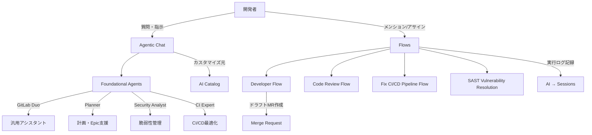

- Agentic Chat = 「対話しながら一緒に作業する」
- Flows = 「指示を渡して裏側で自律的にやらせる」

この違いを体感することが、このハンズオンのゴールです。

---

## 2. ハンズオンの概要

- **想定環境**: ブラウザとメールアドレスが使えるPC(GitLab.comアカウントは未作成でもOK。このハンズオンの中で新規作成します)
- **所要時間**: 約2時間
- **前提知識**: GitLabの基本操作(プロジェクト作成、イシュー、MR、CI/CD)を理解していること

### ゴールイメージ

このハンズオンを終えると、以下ができるようになります。

- GitLab.comアカウントを新規作成し、GitLab Ultimateの無料トライアルを申請してGitLab Duo Agent Platformを有効化できる
- Agentic Chatでエージェントを切り替えながら質問・イシュー作成を行える
- Developer Flowをイシューから起動し、AIに自動でドラフトMRを作らせられる
- Sessions画面でFlowの実行内容(推論・ツール呼び出し・ログ)を追跡できる

### 学べることの全体像

| 演習 | 学習項目 |
|---|---|
| 事前準備 | GitLab.comアカウントの新規作成、画面の日本語化、Ultimateトライアル申請、Duo Agent Platformの有効化確認 |
| 演習1 | Agentic Chatの起動方法、エージェント/モデルの切り替え |
| 演習2 | 演習1でChatが作成したIssueの確認と追記(承認フローの再確認) |
| 演習3 | Developer Flowをイシューから起動し、ドラフトMRを自動生成 |
| 演習4 | Sessions画面でのFlow実行トレースの確認とクレジット消費の把握 |

### 演習全体の流れ

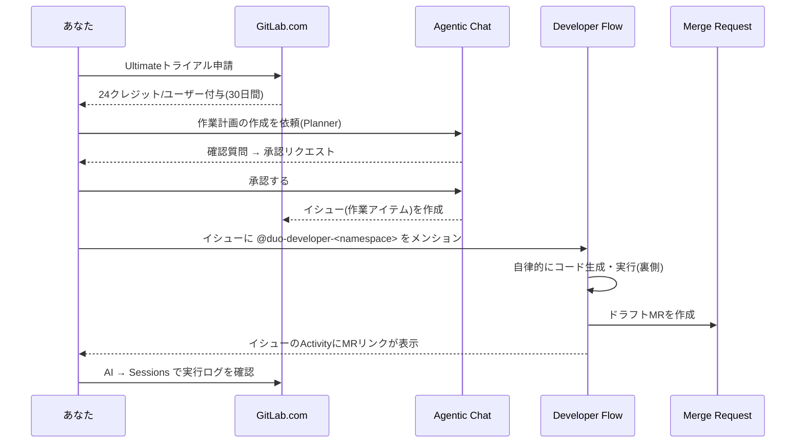

---

## 3. ハンズオンの手順

### 事前準備

#### 準備1: GitLab.comアカウントを新規作成する

1. ブラウザで https://gitlab.com/users/sign_up を開く
2. 以下いずれかの方法でサインアップする
   - メールアドレス・ユーザー名・パスワードを入力して登録(フォーム入力方式)
   - Google / GitHub などのソーシャルログインで登録(既存アカウントを流用する方式。確認の手間が少なく、このハンズオンではおすすめ)
3. 登録後に届く確認メールを開き、記載の認証リンクをクリック、またはログイン画面で6桁の確認コードを入力する(コードの有効期限は発行から60分)
4. 氏名・利用目的などの初期アンケート(オンボーディング)が表示された場合は入力して進める

✅ **確認ポイント**: ログイン後、画面右上に自分のアバターが表示され、トップバーの「Search or go to」から自分のトップレベルネームスペース(オンボーディングの選び方によって、ユーザー名と同じ個人ネームスペース、または`〇〇-group`のようなグループ名になります。詳しくは準備3で確認します)が見えていればアカウント作成は完了です。

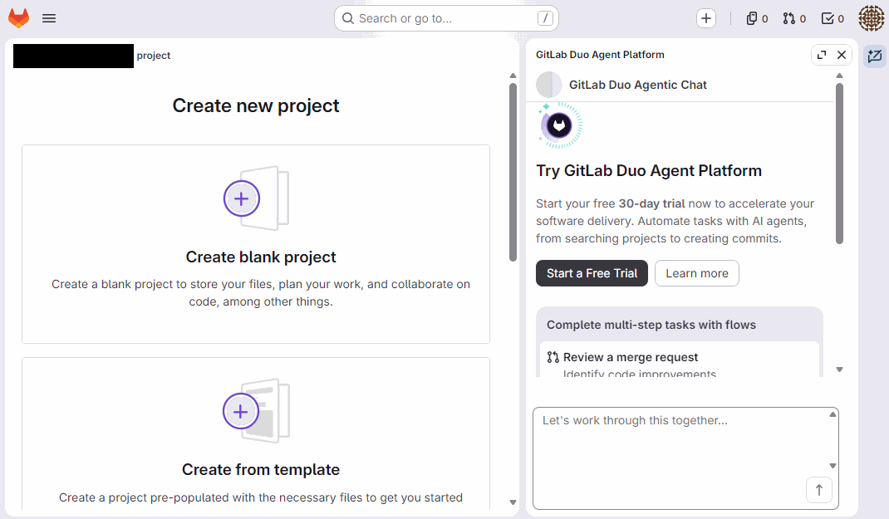

> 💡 アカウント作成後に「Create new project」画面を開くと、上図のように右側へ**GitLab Duo Agent Platformの無料トライアル案内パネル**が表示されることがあります。ここに出てくる **Start a Free Trial** ボタンからも、準備3で行うUltimateトライアルの申請に進めます(画面中のグループ名部分は個人が特定できるため黒塗りしています)。

> ⚠️ **本人確認(Identity Verification)について**: GitLab.comはリスク判定に応じて、メール確認に加えて**電話番号確認**や**クレジットカード確認**を追加で求めることがあります。特に、後の演習3でCI/CDパイプライン(Runner)を初めて実行するタイミングで確認を求められることが多いため、案内が出た場合は画面の指示に従って認証を済ませてください(国によっては電話番号確認が非対応で、代わりにカード確認が案内されます)。

#### 準備2: 画面表示を日本語にする(任意)

英語UIのままでも問題ありませんが、日本語で操作したい場合はここで切り替えます。

1. 画面右上の**アバターアイコン**をクリックし、**Preferences** を選択する
2. **Localization**(ローカライゼーション)セクションまでスクロールする
3. **Language**(言語)のドロップダウンから **Japanese – 日本語** を選択する
4. ページ下部の **Save changes** をクリックする
5. 反映されない場合はブラウザをリロードする

✅ **確認ポイント**: 左サイドバーが「マイワーク」「ホーム」「プロジェクト」「作業アイテム」「マージリクエスト」のような日本語表示に変わり、右側のDuo Agent Platformパネルも「GitLab Duo Agent Platformを試す」「無料トライアルを開始する」のように日本語化されていれば成功です。

> ⚠️ **翻訳カバレッジについて**: 実際に切り替えてみると、ダッシュボードやDuo Agent Platformの紹介パネルなど主要な画面は想像以上にしっかり日本語化されています(例: Flow→**フロー**、Planner→**プランニング**、Security Analyst→**セキュリティ**)。ただし、**Sessions一覧やChange configurationのような管理・設定寄りの新しい画面**は翻訳が追いついておらず、英語のまま表示されることがあります。以降の手順では、確認が取れた項目は「**日本語表記(English)**」の形式で併記し、未確認の項目は英語表記のまま記載します。実際の画面と表記が完全に一致しない場合は、英語表記を手がかりに探してください。

#### 準備3: 自分のトップレベルネームスペース(グループ)を確認する

サインアップ時のオンボーディングの選び方によって、トップレベルのネームスペースは2パターンあります。

- ユーザー名と同名の**パーソナルネームスペース**が自動生成される場合
- 「会社・チームで使う」的な選択をした場合、`〇〇-group` のような**グループ**が自動生成される場合(例: `htrbass44-group`)

どちらの場合も、以降の手順(トライアル申請、Duo Agent Platformの設定)はこの「トップレベルのネームスペース」に対して行うという点は同じです。

1. トップバーの**検索または移動先...(Search or go to)**をクリックする
2. 表示されるクイック検索の「**頻繁に参照するグループ**」または「**頻繁に参照するプロジェクト**」欄に、自分のネームスペース/グループが表示されているのでクリックする(見当たらない場合はユーザー名や会社名で入力して検索する)
3. 開いた画面に **設定(Settings)** メニューがあることを確認する

✅ **確認ポイント**: 左サイドバーに **設定(Settings) → 請求(Billing)** の項目が存在すること(=このネームスペースに対してトライアルやサブスクリプションを設定できること)を確認します。

> 💡 会社やチームで使う場合は、この後 https://gitlab.com/groups/new から別途「グループ」を新規作成し、そのグループ単位でトライアルを申請することも可能です。個人検証の場合は、サインアップ時に作られたネームスペース/グループで十分です。

#### 準備4: GitLab Ultimateの無料トライアルを開始する

Freeプランのままではクレジットが付与されないため、まずUltimateの無料トライアルを申請します。

1. GitLab.comにログインし、トップバーの**検索または移動先...(Search or go to)**で対象のトップレベルグループ(準備3で確認したネームスペース/グループ)を開く
2. 左サイドバーで **設定(Settings) → 請求(Billing)** を選択
3. 「プランの詳細」の **Ultimate** カードにある **無料で試す(Try for free)** をクリック
4. 「**無料トライアルを始める**」フォームが開くので、以下を入力する
   - **グループ**: トライアルを適用するグループ(自動的に選択されているはず)
   - **会社名**: 任意の名称でよい(デフォルトでグループ名が入っていることが多い)
   - **国またはリージョン**: 「Japan」を選択
   - **電話番号 (optional)**: 任意項目のため空欄でよい
5. **トライアルを有効にする** をクリックする

✅ **確認ポイント**: グループのトップページ上部に「**GitLab Ultimateのトライアルを開始しました。有効期限は(日付)です。**」という緑色のバナーが表示され、グループページの「サブスクリプション」欄が **Ultimate Trial** になっていればOKです。フォーム画面にも「クレジットカードは必要ありません」と明記されている通り、カード情報の入力画面は出てきません。

> 💡 トライアルを開始すると、「**自動コードレビューが有効になっています**」というバナーが表示されることがあります。これはFoundational Flowの1つである**Code Review Flow**がグループに対して自動で有効化されたことを示しています(応用・発展でも触れています)。今は「詳しく見る」で内容を確認するだけでよく、実際に使うのは今後の学習ロードマップで扱います。

> 💡 請求画面には「GitLabクレジット」という項目があり、トライアル開始前は `0 クレジット` です。Freeティアでトライアルを有効化すると**24クレジット/ユーザー(30日間のトライアル全体で1回だけ付与)** が想定されます。この24クレジットはFlow実行などで**想像以上に早く消費されます**(演習4で実例として24/24消費した様子を確認します)。実際の消費量・残高は、請求(Billing)ページとは別にある**GitLabクレジット**という専用ページで確認できます。使い切ると追加のクレジット購入(0.95ドル〜)が必要になります。

#### 準備5: GitLab Duo Agent Platformが有効になっているか確認し、Developer Flowを有効化する

トライアル適用直後、多くの設定は既定でオンになっていますが、**演習3で使うDeveloper Flowだけはデフォルトでオフ**になっているため、ここで明示的に有効化します。

1. トップレベルグループで **設定(Settings) → GitLab Duo** を開く(このページには「Change configuration」のような別ボタンはなく、設定項目がページ上に直接並んでいます)
2. 「**GitLab Duoの可用性**」セクションで **デフォルトでオン** が選択されていることを確認する
3. 「**GitLab Duo Agent Platform**」セクションの **GitLab Duo Agentic Chat、エージェント、フローを有効にする** チェックボックスがオンになっていることを確認する
4. 「**GitLab Duo Core**」セクションの **GitLab Duo Agent Platformのアクセスを有効にする** チェックボックスもオンになっていることを確認する
5. 下にスクロールし、「**フロー**」セクションの **フロー実行を許可** と **基本フローを許可** がオンになっていることを確認する
6. その下のフロー一覧を確認する。**コードレビュー** はデフォルトでオンになっていますが、**デベロッパー(Developer)** は既定でオフです。演習3で使うため、**デベロッパー** のチェックボックスをオンにする
7. ページ最下部までスクロールし、**変更を保存** をクリックする

✅ **確認ポイント**: 「フロー」セクションで「コードレビュー」と「デベロッパー」の両方にチェックが入った状態で保存できていればOKです。この設定はグループ配下の全プロジェクトに継承されます。

> 💡 この設定画面には他にも「基本エージェント」ごとの可用性設定(Orbit、Planner、Security Analyst、Data Analyst、CI Expert、Permissions Assistant、Support Assistant、Flow Creatorなど)、カスタムエージェント/フローの許可、ネットワークアクセス制御、プロンプトインジェクション保護といった細かい設定が並んでいます。今回のハンズオンでは変更不要ですが、実務でガバナンスを利かせる際にはここを調整します。エージェント名は設定画面上では英語のままですが、ホーム画面のDuo紹介パネルでは「プランニング」(Planner)「セキュリティ」(Security Analyst)のように意訳されて表示されるなど、画面によって表記の粒度が異なる点も覚えておくと混乱しません。

#### 準備6: 練習用プロジェクトを作成する

1. トップレベルグループ内に新規プロジェクトを作成(例: `duo-agent-sandbox`)
2. README付きの空プロジェクトでよい(**空のプロジェクトを作成(Create blank project)** + **READMEファイルを追加(Include a README)**)
3. 簡単なコードを1つpushしておく(下記参照)。ローカルにgitを用意しなくても、GitLabのWeb UIの「**+**」→「新規ファイル」だけで完結します

READMEだけの空プロジェクトでも演習1(Agentic Chat)は動きますが、「主要なファイルは?」と聞いても中身がないため、以下のような最小限のコードを事前にpushしておくと、演習1で具体的な回答が得られ、演習2・3で依頼する「`/health`エンドポイントの追加」も既存コードのパターンに沿って実装してもらいやすくなります。

`package.json`:

```json
{
  "name": "duo-agent-sandbox",
  "version": "1.0.0",
  "main": "app.js",
  "scripts": {
    "start": "node app.js"
  },
  "dependencies": {
    "express": "^4.19.2"
  }
}
```

`app.js`:

```javascript
const express = require('express');
const app = express();

app.get('/', (req, res) => {
  res.json({ message: 'Hello from GitLab Duo Agent Platform handson' });
});

app.listen(3000, () => console.log('Server running on port 3000'));
```

**ここまでで学んだこと**: GitLab.comのアカウント作成では、メール確認に加えてリスク判定次第で電話番号やカードの本人確認が求められること、Preferencesから画面表示を日本語化できる一方でDuo Agent Platform関連の新しい画面は翻訳が追いついておらず英語のまま残りやすいこと、サインアップ時に自動生成されるパーソナルネームスペースがトライアル申請やDuo設定の単位になること、そして無料でDuo Agent Platformを試すには「Ultimateトライアル」経由でクレジットを得る必要があることを理解しました。

---

### 演習1: Agentic Chatを使ってみる

**目的**: Agentic Chatの起動方法と、エージェント切り替えの感覚を掴む。

1. GitLab.comの画面右上にある **Duoアイコン** をクリックし、チャットパネルを開く
2. まずは既定の **GitLab Duo** エージェントのまま、以下のように質問する

   ```text
   このプロジェクトの構成を説明して。主要なファイルは何?
   ```

3. 続けて別のエージェントに切り替える。チャットパネル右上にある **鉛筆(新しいチャット)アイコン** をクリックすると「**エージェントを選択**」というドロップダウンが開くので、一覧から **Planner**(英語表記のまま表示されます)を選択する
4. 新しいチャットが開始されるので、次のように依頼する

   ```text
   このプロジェクトに新機能を追加するときの作業計画を、Issueの形でまとめて。
   ```

5. 回答の傾向(汎用エージェントとPlannerで、粒度や視点がどう違うか)を比較する

> 💡 エージェントを切り替えると新しいチャットスレッドが開始されるため、直前の会話の続きにはなりません。エージェントごとに会話が独立している点も覚えておきましょう。

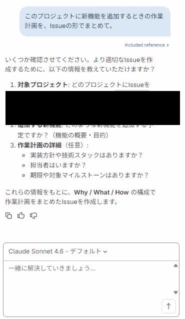

> 💡 Plannerはグループのホーム画面からチャットを開始したため、「対象プロジェクトはどれですか?」と確認を返してきました。このように、いきなり計画を作らせるのではなく**必要な情報を質問で引き出してくる**のがPlannerらしい振る舞いです。ここでは以下のように具体的に答えると、後続の演習2・3でも使う`/health`エンドポイントに沿った作業計画Issueを作成してくれます。
>
> ```text
> 対象プロジェクトは duo-agent-sandbox です。
> 追加したい新機能は、ヘルスチェック用の /health エンドポイントです。
> GET /health にアクセスすると {"status": "ok"} を返すようにしたいです。
> 技術スタックは今のExpress.jsのままで問題ありません。担当者や期限は特に指定しません。
> ```

6. Plannerが「Create work item」というカードを提示してくる。これはIssueを実際に作成する前の**承認リクエスト**で、プロジェクト・タイプ・タイトル・Description/Workplanなどの内容が表示される
7. 内容を確認し、問題なければ **承認する** をクリックする(**拒否** を選ぶとキャンセルできる)

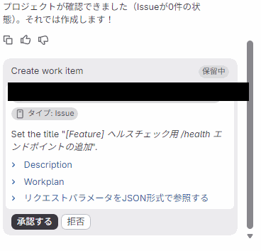

> 💡 この「承認する/拒否」の確認画面は、GitLabのAIが**GitLab上のリソースを変更する操作を行う前に必ず人間の承認を求める**という安全機構です(準備5の設定画面で見た「セッションに対するツールの承認」に対応します)。承認すると、この時点で実際にIssue(作業アイテム)が作成されます。

✅ **確認ポイント**: チャットパネルにプロジェクト名やファイル内容を踏まえた回答が返ってくること(=プロジェクトコンテキストを参照できていること)、およびPlannerが確認質問→承認リクエストという段階を踏んで実際にIssueを作成する流れを確認します。

**ここで学んだこと**: Agentic Chatはプロジェクトの文脈を保持したまま対話でき、エージェントを切り替えることで「答え方の専門性」が変わることを体感しました。また、GitLab上のリソースを変更する操作の前には必ず承認を求められる、という安全機構も確認できました。

---

### 演習2: Chatが作成したIssueを確認し、内容を拡充する

**目的**: 演習1でAgentic Chat(Planner)が実際に作成したIssueを確認し、Chatが「回答するだけ」でなく「GitLab上で実際にアクションを実行できる」ことを再確認する。

> 💡 演習1のPlannerとのやり取りで、すでに`/health`エンドポイント追加のIssueが作成済みのはずです。ここでは新しいIssueを作らず、その内容を確認・拡充します。

1. 左サイドバーの **作業アイテム(Work items)** を開き、演習1で作成されたIssueがあることを確認する(以前は「Issues」という表記でしたが、現在のGitLabでは「作業アイテム」に統合されています)
2. Issueを開き、タイトル・Description・Workplanの内容が、Plannerに伝えた`/health`エンドポイントの内容と合っているか確認する

Planner Agentは、Issue作成後にチャット上へも内容のまとめを表示してくれます。今回の例では、単に「Issueを作成しました」ではなく、**Why(なぜやるのか)/What(何をするのか)/How(どうやるのか)/完了条件(DoD)** という構成でまとめられました。

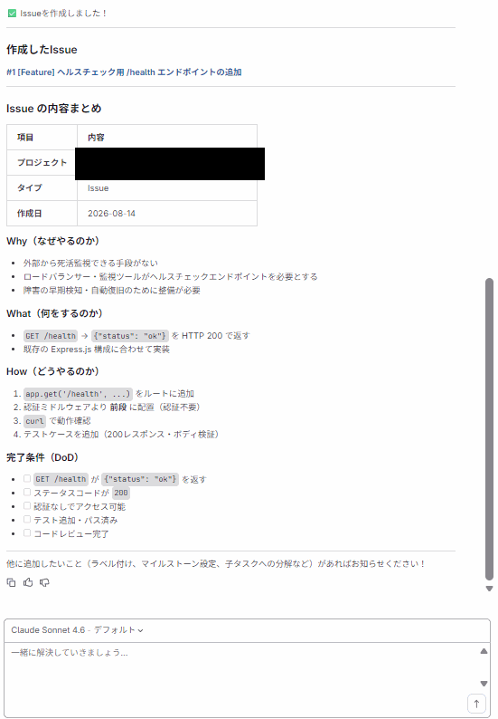

> 💡 依頼したのは「作業計画をIssueの形でまとめて」という一言だけでしたが、Plannerは`/health`エンドポイントという抽象的な要望を「外部から死活監視できる手段がない」という**Why**まで補って構造化しています。これはPlannerが持つ「要求を分解し、優先順位づけされた実装計画を作る」という役割(準備5のAI Catalogで見た説明文)を反映した挙動です。

3. 内容が不十分だと感じたら、Agentic Chatに追記を依頼してみる

   ```text
   このIssueに受け入れ基準(Acceptance Criteria)を追加して。
   ```

4. 再び承認リクエストが表示されるので、内容を確認して **承認する** をクリックする

✅ **確認ポイント**: 作成済みのIssueに`/health`エンドポイントの内容が反映されていること、また追記の依頼によって既存のIssueが更新されること(=新規作成だけでなく既存リソースの編集もできること)を確認します。

**ここで学んだこと**: Agentic ChatはGitLab上のリソース(Issueなど)を実際に作成・更新できる「実行力」を持つこと、そしてその実行には必ず人間の承認ステップが挟まることを確認しました。

---

### 演習3: Developer FlowでドラフトMRを自動生成する

**目的**: Flowを使って、Issueから自律的にコード変更・ドラフトMR作成までをAIに任せる。

> ⚠️ Flowの実行はクレジットを消費します。まずは小さく・具体的な指示で1回試すのがおすすめです。

1. 演習2で作成したIssue(または新規に作った簡単なIssue)を開く
2. 右サイドバーの **担当者(Assignees)** のドロップダウンを開くと、AIバッジ付きの候補として **Duo Developer**(ハンドル名は`@duo-developer-<namespace>`)と **GitLab Duo**(`@GitLabDuo`)が表示される。ここでは **Duo Developer** を選択してアサインする

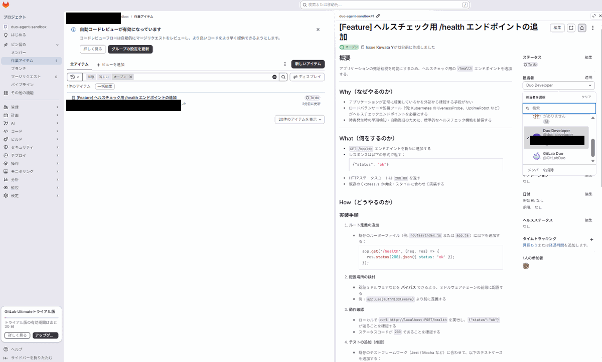

3. 別のやり方として、Issueのコメント欄で直接メンションして指示することもできる

   ```text
   @duo-developer-<namespace> /health エンドポイントを追加するドラフトMRを作成して。
   レスポンスは {"status": "ok"} というJSONを返すこと。
   ```

   (`<namespace>` は自分のグループ/プロジェクトのnamespaceに置き換える)

4. 左サイドバーの **AI → セッション(Sessions)** を開く。**Solve work item and create MR** のような名前のセッションが表示され、実行中は緑のチェックマーク付きで **Finished**(完了)になる

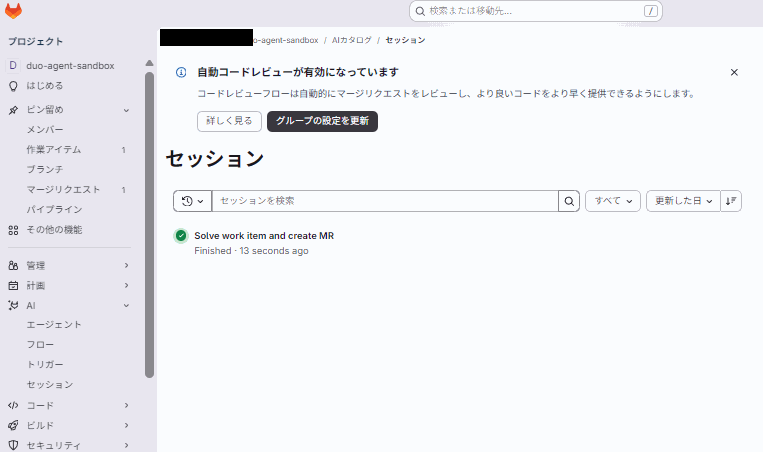

> 💡 今回の例では**わずか13秒**で完了しました。Issueの規模やコード変更量によっては数分かかることもあります。「実行中」のタイミングを見たい場合は、アサイン直後にこの画面を素早く開くとRunning状態を確認できます。

5. Issueの **アクティビティ(Activity)** セクションに新しいMRへのリンクが表示されるのを確認する
6. ドラフトMRを開き、「**変更**」タブで実際のコード差分を確認する。Developer Flowは`app.js`への実装だけでなく、`app.test.js`(Node標準の`node:test`を使ったテスト)や`package.json`のテストスクリプトまで自律的に追加してくれる
7. (任意)内容に問題なければ **準備済みとしてマーク** をクリックしてドラフト状態を解除し、**マージ** する。マージすると元のIssueも自動でクローズされる

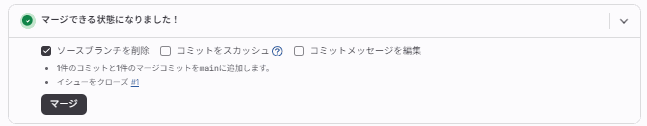

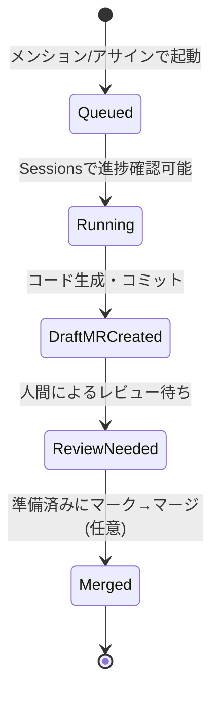

✅ **確認ポイント**: ドラフトMRが作成され、差分に演習で依頼した内容(`/health`エンドポイント追加、テスト追加など)が反映されていること。マージした場合は、元のIssueが自動的にクローズされることも確認します。

> 💡 今回の例では、MRのNotesに「CI実行環境ではnpmレジストリがブロックされているため、エージェントのセッション中に`npm install`を実行できなかった」という補足がありました。これは準備5で見た「ネットワークアクセス制御」設定(許可ドメインが未設定だと外部ネットワークへのアクセスが制限される)が影響しています。Flowは制約を把握した上で、追加パッケージなしで動くテストコードを書く、という工夫をしてくれていました。

**ここで学んだこと**: Developer Flowは「メンション」または「アサイン」で起動でき、演習2で追記した受け入れ基準まで踏まえて実装・テストコードまで自律的に作成することを確認しました。Flowは対話不要でバックグラウンド実行される点がAgentic Chatとの大きな違いです。また、マージまで行うとIssue作成(演習1)→内容拡充(演習2)→実装(演習3)というAgent Platformの一連の流れが完結することも体感しました。

---

### 演習4: Sessionsでの実行トレース確認とクレジット管理

**目的**: Flow実行の裏側(推論・ツール呼び出し・ログ)を確認し、無料クレジットの消費状況を把握する。

1. プロジェクトの左サイドバーの **AI → セッション(Sessions)** を開く。演習3で実行した **Solve work item and create MR** に加えて、ドラフトMR作成をきっかけに**自動で実行された `code_review/v1`** というセッションも並んでいるはずです(準備4で有効化した「自動コードレビュー」機能の実行記録)
2. それぞれのセッションを開き、推論(reasoning)やツール呼び出しの履歴、**Details** タブのCI/CDジョブログへのリンクを確認する
3. トップレベルグループの **設定(Settings) → 請求(Billing)** を開く(**注意**: プロジェクトの設定にはBillingはありません。グループレベルの設定です)
4. 左サイドバーの **GitLabクレジット**(「請求」とは別の項目)を開き、「ユーザー別使用量」テーブルで実際の消費量を確認する

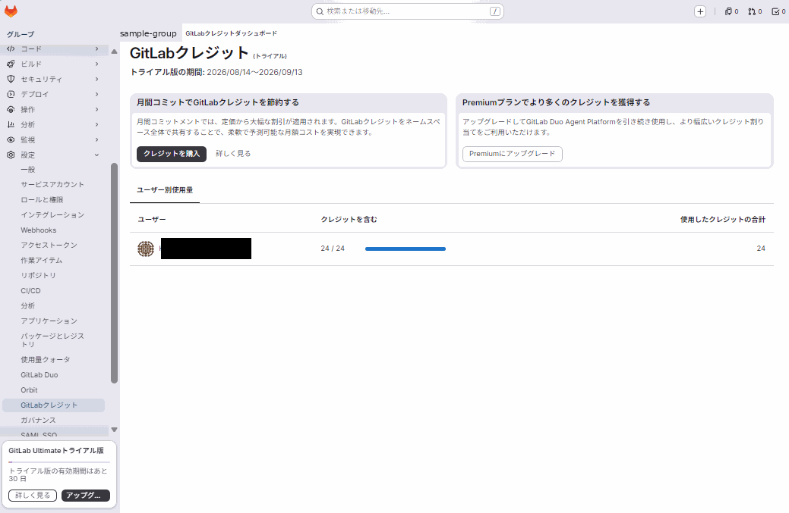

✅ **確認ポイント**: 「請求(Billing)」トップページの「24クレジット/ユーザー」は**トライアルの割り当て量の表示**であり、現在の残高ではありません。実際の消費量・残高は「**GitLabクレジット**」という専用ページ(請求とは別の左サイドバー項目)の「ユーザー別使用量」テーブルで確認する必要があります。

> ⚠️ **実例での発見**: このハンズオンの演習1〜3(Plannerとの対話・Issue作成の承認・受け入れ基準の追記・Developer Flow実行・自動Code Reviewの実行)だけで、**24クレジットを100%使い切りました**。「トライアル版の期間: 2026/08/14〜2026/09/13」という表示の通り、この24クレジットは**30日間のトライアル全体に対する割り当て**であり、月ごとに再チャージされるものではありません。つまり、無料トライアルで実際に試せる操作量はかなり限られており、Flow実行(Developer Flow、自動Code Review Flowなど)がクレジットを大きく消費する主因と考えられます。
>
> クレジットを使い切った後にAgentic Chatでの単純な質問(演習1のステップ2のような、リソースを変更しないChatのみの利用)がまだ可能かどうかは、GitLab Duo Core(準備5で見た「すべてのユーザーが利用可能」な基本機能)がクレジット制とは別枠である可能性があるため、実際に試して確認するのが確実です。継続して検証したい場合は、この画面の **クレジットを購入**(0.95ドル〜)、または **Premiumにアップグレード** が必要になります。

**ここで学んだこと**: SessionsはAIエージェントの「ブラックボックス」を可視化する画面であり、トラブルシュートや挙動理解に役立つこと、そして無料トライアルのクレジットは想像より少ない操作で使い切ってしまうほど限られたものであることを、実際の数値(24/24消費)で学びました。「請求(Billing)」と「GitLabクレジット」が別ページである点も、つまずきやすいポイントとして覚えておきましょう。

---

## 4. 習得事項のまとめ

### 触れた要素一覧

| 要素 | 内容 |
|---|---|
| 画面の日本語化 | アバター → Preferences → Localization → Language → 日本語 → Save changes。ダッシュボードやDuo紹介パネル(フロー、プランニング等)は日本語化されるが、Sessions等の管理画面は英語のまま残ることがある |
| Ultimate無料トライアル | 請求(Billing)画面から申請、Freeティアでは24クレジット/ユーザー(30日間)付与 |
| Duo Agent Platformの有効化 | グループ 設定(Settings) → GitLab Duoページで直接設定。Developer Flowはデフォルトオフなので明示的にチェックが必要 |
| Agentic Chat | UI右上のDuoアイコンから起動。エージェント切り替えは「新しいチャット」アイコン→「エージェントを選択」、モデル切り替えは入力欄下のセレクタから行う(いずれも新しいチャットスレッドになる場合がある) |
| Foundational Agent | GitLab Duo(汎用)、Planner、Security Analyst、CI Expertなど |
| 承認フロー | AIがGitLab上のリソース(Issue作成など)を変更する前に「Create work item」のような承認カードを表示し、**承認する/拒否**を選ばせる。承認した時点で実際に変更が適用される |
| Developer Flow | Issueへのメンション(`@duo-developer-<namespace>`)またはアサインで起動 |
| Sessions | AI → Sessions で実行ログ・推論過程・CI/CDジョブログへのリンクを確認 |

### トラブルシューティング

| 症状 | 原因・対処法 |
|---|---|
| Chatにプロジェクトの内容が反映されない | Duo Agent Platformがプロジェクト個別に無効化されていないか、設定(Settings) → 一般(General) → GitLab Duoを確認 |
| Flowが起動しない/エラーになる | 設定(Settings) → GitLab Duoの「フロー」セクションで「基本フローを許可」と対象Flow(例: デベロッパー)にチェックが入っているか、Runnerが設定されているかを確認 |
| Flowへの指示通りのMRができない | 指示が抽象的すぎることが多い。対象ファイルパス、期待するレスポンス形式、既存コードのパターンなど具体的な情報を追加する |
| クレジットが足りずFlowが実行できない | 請求(Billing)ページの「24クレジット/ユーザー」は割り当て量の表示であり残高ではない。実際の残高・消費量は**GitLabクレジット**ページ(請求とは別項目)の「ユーザー別使用量」で確認する。少ない操作回数でも使い切りやすいので、クレジット購入(0.95ドル〜)またはPremium/Ultimateへのアップグレードで継続 |
| デフォルトのDuo namespaceが未設定でエラーになる | 一部のプロキシ経由機能(外部エージェント、`/v1/proxy` API)はデフォルトのGitLab Duo namespace設定が必要 |
| 日本語化してもSessionsなど一部の画面だけ英語のまま | 想定通りの挙動。Duo Agent Platformの紹介パネルやチャット導線は日本語化されているが、Sessions一覧やChange configurationなど管理寄りの新しい画面は翻訳が追いついていないことがある。英語表記のまま操作して問題ない |

### 応用・発展

- チームで使う場合は、Flowの起動権限(誰がアサイン/メンションできるか)をプロジェクトのロール設計と合わせて検討する
- AI Catalogを使うと、自社の運用に合わせてカスタムエージェント・カスタムFlowを定義できる
- Code Review Flow、Fix CI/CD Pipeline Flow、SAST Vulnerability Resolution FlowなどをMRやパイプライン失敗時に組み込むことで、レビュー・運用の自動化を段階的に拡張できる

#### AIエージェントは「プロジェクトメンバー」として扱われる

演習3までを終えると、プロジェクトの **メンバー(Members)** 一覧に、使用したAIエージェントが実際に追加されていることが確認できます。

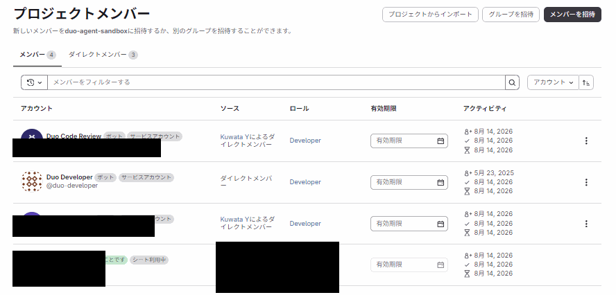

- Duo Developer・Duo Code ReviewなどのAIエージェントは「**ボット / サービスアカウント**」というタグ付きで、人間のメンバーと**同じメンバーリスト・同じロール体系(Developer/Maintainer/Ownerなど)**に並ぶ
- 権限管理が既存のGitLabのロールモデルの範囲に収まるため、AI用に新しい権限概念を別途学ぶ必要がない
- 「いつ・誰が(どのエージェントが)追加されたか」がメンバーの来歴(例: 「Kuwata Yによるダイレクトメンバー」)として残り、通常のメンバー管理と同じ操作(削除・ロール変更など)でAIエージェントの権限も管理できる
- 同じ「Duo Developer」という表示名でも、インスタンス共通のグローバルなアカウント(`@duo-developer`)と、ネームスペース固有のアカウント(`@duo-developer-<namespace>`)が別々に存在する場合がある

この「AIをメンバー/ロールという既存概念に統合する」設計は、他のAI駆動開発ツールが別レイヤーの仕組み(専用の権限モデルや管理コンソール)を必要とすることが多いのに対し、既存のGitLab運用に自然に組み込める点が特徴です。

---

## 5. 今後の学習ロードマップ

1. **Code Review Flow / Fix CI/CD Pipeline Flowを試す**(優先度: 高) — 実際のMRやパイプライン失敗に対してFlowを適用し、レビュー・運用系のユースケースを体験する
2. **AI Catalogでカスタムエージェント/Flowを作成する**(優先度: 中) — 自社特有のルール(コーディング規約やレビュー基準)を反映したエージェントを設計する
3. **IDE(VS Code/JetBrains)からのAgentic Chat利用**(優先度: 中) — ローカル開発環境に組み込み、コーディング中の生産性向上を検証する
4. **セルフマネージド環境でのDuo Agent Platform設定**(優先度: 低) — 自社ホスティングのGitLab Self-Managed/Dedicated環境での管理者設定・ネットワーク要件を理解する

### 参考リンク

- [GitLab Duo Agent Platform: Get started](https://docs.gitlab.com/user/get_started/get_started_agent_platform)
- [Control GitLab Duo Agent Platform availability](https://docs.gitlab.com/user/duo_agent_platform/turn_on_off)
- [GitLab Duo trials](https://docs.gitlab.com/subscriptions/gitlab_duo_trials/)
- [Ultimate trials](https://docs.gitlab.com/subscriptions/free_trials/)
- [Developer Flow (Foundational Flow)](https://docs.gitlab.com/user/duo_agent_platform/flows/foundational_flows/developer/)
- [Getting started with GitLab Duo Agentic Chat (Blog)](https://about.gitlab.com/blog/getting-started-with-gitlab-duo-agentic-chat/)
- [Understanding Flows: multi-agent workflows (Blog)](https://about.gitlab.com/blog/understanding-flows-multi-agent-workflows/)
- [Introduction to GitLab Duo Agent Platform (Blog)](https://about.gitlab.com/blog/introduction-to-gitlab-duo-agent-platform/)
