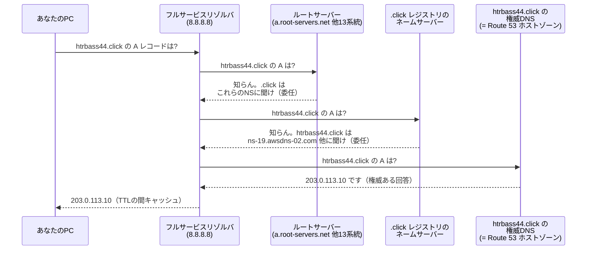
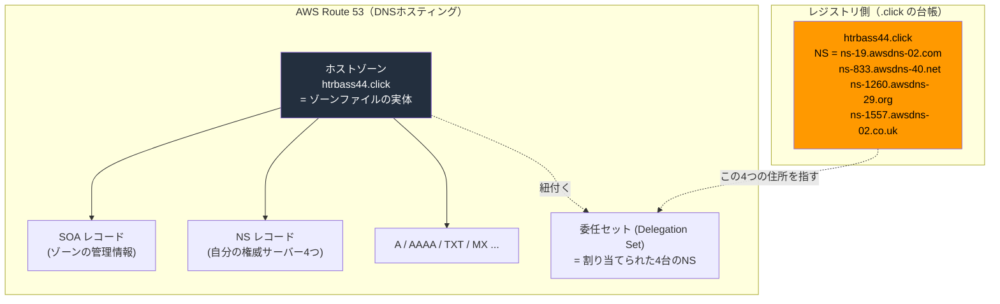
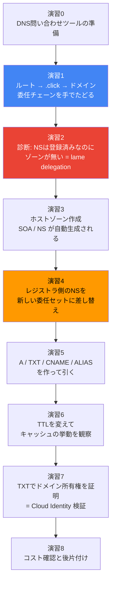
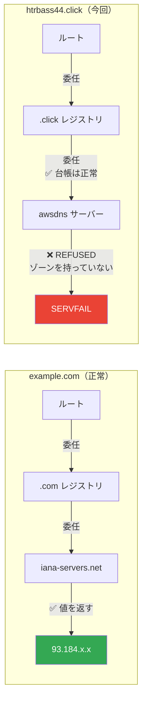
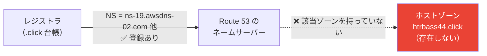
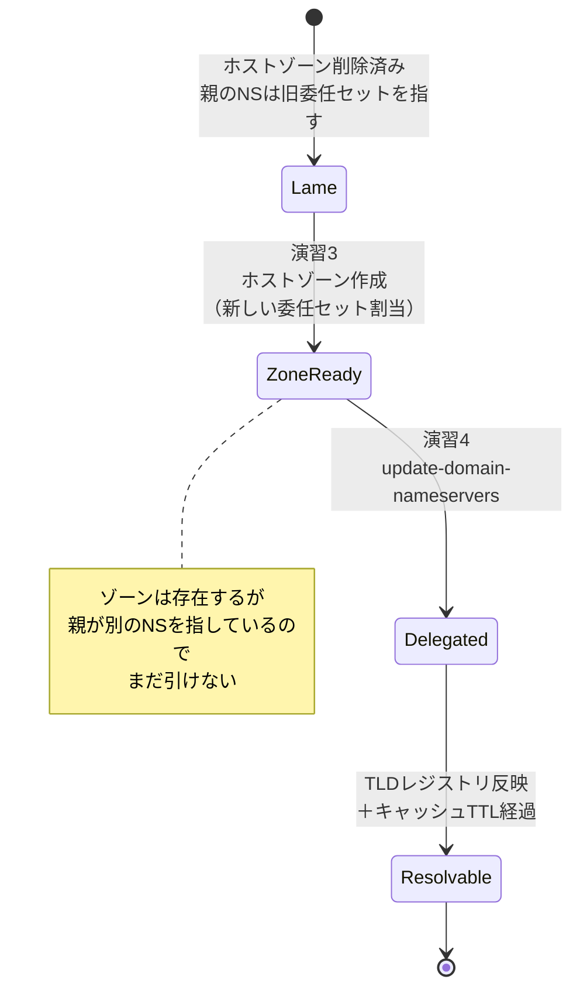
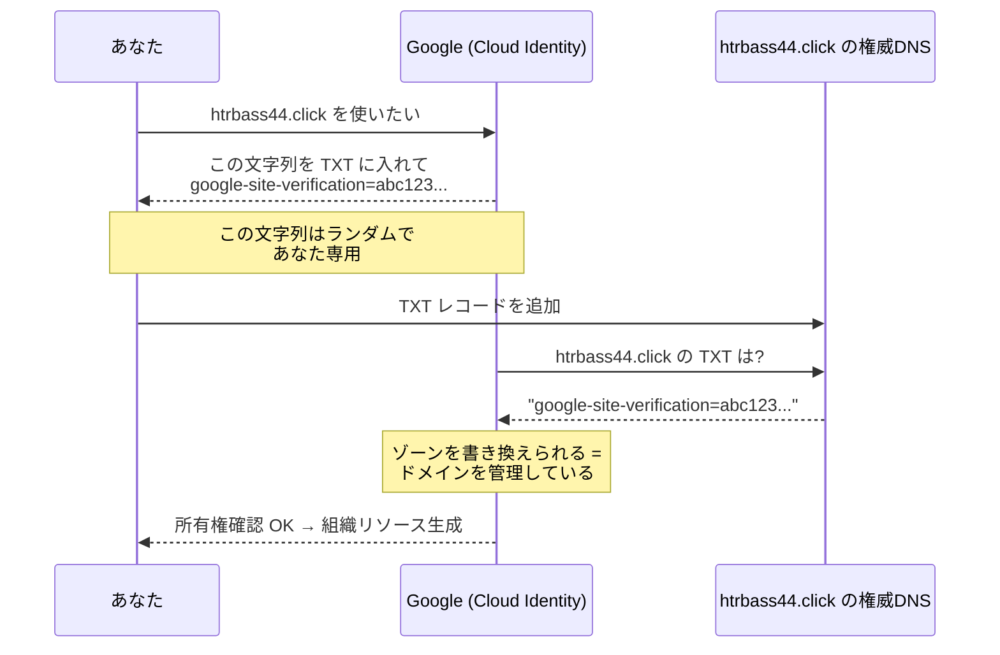

# DNS と Route 53 ハンズオン — ホストゾーン・ネームサーバー・委任を、自分のドメインで解剖する

> **対象読者**: `htrbass44.click` のようにドメインは持っているが、「ホストゾーン」「ネームサーバー」「委任」が何を指しているのか腹落ちしていない人。
> **所要時間**: 約 2 時間
> **ターミナル**: GitBash（Windows）
> **題材**: Route 53 に登録済みだがホストゾーンが存在しない、実在のドメイン `htrbass44.click`

---

## 1. 勉強対象の概要

### 1.1 DNS は「巨大な分散データベース」ではなく「たらい回しの仕組み」

DNS を「ドメイン名を IP に変換する電話帳」と説明されることが多いが、それだと**ホストゾーンやネームサーバーが何なのか永久に分からない**。正確には次のとおり。

> DNS は、**世界中の誰も全体を持っていないデータベース**である。名前を解決したい人は、上（ルート）から順に「その先は誰が知ってる?」と聞いて回り、たらい回しにされながら答えにたどり着く。

この「たらい回し」が **委任（delegation）** であり、「答えを持っているサーバー」が **ネームサーバー（権威 DNS サーバー）** であり、「そのサーバーが持っている答えの束」が **ゾーン**、AWS における実体が **ホストゾーン** である。

### 1.2 登場人物 4 種類

ここを混同すると全部わからなくなる。**「ドメインを買う」と「DNS を運用する」は完全に別の行為**である。

| 役割 | 何をする人／モノ | `htrbass44.click` の場合 |
|------|------------------|--------------------------|
| **レジストリ** | その TLD（`.click`）の台帳を管理する組織。「どのドメインが誰のもので、どのネームサーバーに委任されているか」を保持 | `.click` レジストリ |
| **レジストラ** | 利用者に代わってレジストリに登録申請する窓口（＝ドメインを売る人） | **Route 53 Domains**（AWS） |
| **DNS ホスティング（権威 DNS）** | 実際にゾーンのデータを保持し、問い合わせに答えるサーバー群 | **Route 53（ホストゾーン）** |
| **フルサービスリゾルバ（キャッシュ DNS）** | 利用者の代わりにルートから順に聞いて回る人。結果をキャッシュする | ISP の DNS、`8.8.8.8`、`1.1.1.1` など |

> **今回のドメインで起きていること**: レジストラ（Route 53 Domains）には「ネームサーバーは `ns-19.awsdns-02.com` ほか3つ」と登録済み。しかし DNS ホスティング側（Route 53 のホストゾーン）にゾーンの実体が無い。**委任先の住所は登録されているのに、その住所には誰も住んでいない**状態。これを **lame delegation（不正な委任）** と呼ぶ。
>
> Google Public DNS はこの状態を明示的に報告してくれる（演習1-4 で実際に確認する）。
>
> ```
> "Comment": "Name servers refused query (lame delegation?) [205.251.195.65, ...]"
> ```

### 1.3 名前解決の流れ（委任チェーン）



重要なのは、**各段階のサーバーは「答え」ではなく「次に聞くべき相手（NS レコード）」を返している**という点。この「次に聞け」の連鎖が委任チェーンである。

### 1.4 ホストゾーンとネームサーバーの関係



| 用語 | 正体 | 一言で |
|------|------|--------|
| **ゾーン** | あるドメイン以下の名前についての「答えの集合」 | データそのもの |
| **ホストゾーン** | Route 53 における「ゾーン」の実装名。作ると 4 台の NS が自動で割り当てられる | AWS 用語 |
| **ネームサーバー（NS）** | そのゾーンを配信するサーバー。ホスト名で表される | 答えを持つサーバー |
| **委任セット（Delegation Set）** | ホストゾーン作成時に割り当てられる 4 台の NS の組 | AWS 用語 |
| **NS レコード** | 「このゾーンの権威サーバーはこれ」を示すレコード。**親（レジストリ）側と自ゾーン側の 2 箇所に存在する** | 委任の矢印 |
| **SOA レコード** | ゾーンの管理情報（プライマリ NS、シリアル、TTL 既定値など）。ゾーンに必ず 1 つ | ゾーンの表紙 |

> **ここが最頻出のつまずき**: NS レコードは**親側と子側の 2 箇所にある**。実際の委任を決めているのは**親（レジストリ）側**。ホストゾーンの中の NS レコードをいくら編集しても、レジストラ側を更新しなければ何も変わらない。逆に、レジストラ側の NS を差し替えれば、ホストゾーン内の NS レコードが古いままでも名前解決は新しい方に向く。

### 1.5 なぜ Route 53 の NS は 4 つとも TLD が違うのか

```
ns-19.awsdns-02.com
ns-833.awsdns-40.net
ns-1260.awsdns-29.org
ns-1557.awsdns-02.co.uk
```

`.com` / `.net` / `.org` / `.co.uk` にわざと分散されている。これは **NS のホスト名自身を解決するために別の TLD を引く必要がある**ため、1 つの TLD レジストリが停止しても残りで解決できるようにする可用性設計である。偶然ではない。

### 1.6 主要レコード種別

| 種別 | 意味 | 例・注意点 |
|------|------|-----------|
| `A` | ホスト名 → IPv4 アドレス | `www.example.com → 203.0.113.10` |
| `AAAA` | ホスト名 → IPv6 アドレス | |
| `CNAME` | 別名 → 正式名への転送 | **ゾーン頂点（apex）には置けない**。同じ名前に他のレコードを共存させられない |
| `MX` | メールの配送先サーバー | 優先度付き。Cloud Identity Free では**不要** |
| `TXT` | 任意の文字列 | **ドメイン所有権証明**、SPF、DKIM、DMARC に使う |
| `NS` | このゾーンの権威サーバー | 親側と子側の 2 箇所 |
| `SOA` | ゾーンの管理情報 | 自動生成 |
| `ALIAS` | **Route 53 独自**。AWS リソースへの別名 | **apex に置ける**、クエリ料が無料、TTL は自動 |
| `CAA` | どの認証局に証明書発行を許すか | |

**CNAME と ALIAS の使い分け**（Route 53 特有の頻出論点）

| | CNAME | ALIAS |
|---|-------|-------|
| ゾーン頂点（`example.com` 自体） | ❌ 置けない | ✅ 置ける |
| 指し先 | 任意のホスト名 | AWS リソース（ALB/CloudFront/S3等）または同一ゾーン内のレコード |
| DNS 標準 | 標準 | Route 53 独自（外から見ると A レコードに見える） |
| クエリ料金 | 課金対象 | AWS リソース宛は無料 |
| TTL | 自分で指定 | 指定不可（AWS が管理） |

### 1.7 TTL と「DNS 伝播」の正体

「DNS の変更が反映されるまで時間がかかる」とよく言うが、実際には**どこかに伝播しているわけではない**。世界中のリゾルバが持っている**古いキャッシュが TTL で切れるのを待っている**だけである。

| 変更の種類 | 反映にかかる時間 | 理由 |
|-----------|-----------------|------|
| ホストゾーン内のレコード変更（A/TXT等） | **そのレコードの TTL 秒** | リゾルバのキャッシュ切れ待ち |
| レジストラ側の NS 差し替え | **数分〜数時間**（まれに 48h） | TLD レジストリの反映＋TLD が返す委任情報の TTL（通常 1〜2日） |
| 新規レコードの追加（今まで無かった名前） | **ほぼ即時** | キャッシュすべき古い値が無い |

> 実務のコツ: 切り替え作業の**前日**に TTL を 60 秒に下げておく。作業当日の巻き戻しが速くなる。

---

## 2. ハンズオンの概要

### 2.1 ゴールイメージ

このハンズオンを終えたとき、次ができるようになる。

1. **ルートサーバーから自分のドメインまで、委任チェーンを 1 段ずつ手でたどれる**
2. 「レジストラ側の NS」と「ホストゾーン」の食い違いを診断し、修復できる
3. `htrbass44.click` が名前解決できる状態になり、TXT による所有権証明が通る
4. CNAME / ALIAS / TTL を、なぜそうなっているか説明できる

**成果物**: 正常に委任され、レコードを引ける `htrbass44.click` のホストゾーン（＝ Cloud Identity のドメイン検証が通る状態）

### 2.2 学べることの全体像

| 演習 | テーマ | 中心概念 | 目安 |
|------|--------|----------|------|
| 0 | 事前準備（DNS 問い合わせツール） | リゾルバ / 権威サーバー | 15分 |
| 1 | ルートから委任チェーンを手でたどる | **委任・NS レコード・権威** | 25分 |
| 2 | 自分のドメインを診断する | レジストラ側 NS vs ホストゾーン、**lame delegation** | 20分 |
| 3 | ホストゾーンを作る | **ゾーンの実体・SOA・委任セット** | 15分 |
| 4 | レジストラ側の NS を差し替える | **親側 NS が委任を決める** | 20分 |
| 5 | レコードを作って引く | A / TXT / CNAME / ALIAS | 20分 |
| 6 | TTL とキャッシュを体感する | **DNS 伝播の正体** | 15分 |
| 7 | ドメイン所有権証明の仕組み | TXT 検証 | 15分 |
| 8 | コストとクリーンアップ | ホストゾーン課金 | 10分 |

### 2.3 演習の流れ



### 2.4 費用

| 項目 | 費用 |
|------|------|
| ホストゾーン | **$0.50 / 月**（最初の 25 個まで。26 個目以降は $0.10） |
| DNS クエリ | $0.40 / 100万クエリ（10億まで） |
| ALIAS → AWS リソースへのクエリ | **無料** |
| ドメイン更新（`.click`） | 年数ドル程度（レジストリによる） |

このハンズオンでの実費は**月 $0.50 程度**。

---

## 3. ハンズオンの手順

### 演習0: 事前準備 — DNS 問い合わせツールを用意する

**目的**: DNS を「見る」道具を揃える。ここが無いと何も観察できない。

#### 0-1. Windows で使えるツール

`dig` は Linux/macOS の標準ツールだが、**Git for Windows には含まれていない**。Windows では次の 3 つを使う。

| ツール | 入手 | 特徴 |
|--------|------|------|
| `nslookup` | Windows 標準 | どこでも動く。出力が読みにくい |
| `Resolve-DnsName` | Windows 標準（PowerShell） | **最も高機能**。`-Server` で問い合わせ先を指定できる |
| Google DoH API + `curl` | 標準（`curl` は Git for Windows 同梱） | HTTP で DNS を引ける。確実に動く保険 |

#### 0-1-a. Windows 特有の落とし穴 2 つ（先に潰す）

**① シングルラベル名には末尾のドットが必須**

`click` のようにドットを含まない名前（シングルラベル名）を Windows の DNS クライアントに渡すと、**DNS の名前ではなく社内ホスト名だと解釈**され、DNS サフィックスの補完や NetBIOS 解決に回されて失敗する。

```bash
# ❌ 失敗する
nslookup -type=NS click 8.8.8.8
#   -> *** dns.google が click を見つけられません: Server failed

powershell -NoProfile -Command "Resolve-DnsName -Name click -Type NS -Server 8.8.8.8"
#   -> ERROR_INVALID_NAME: ファイル名、ディレクトリ名、またはボリューム ラベルの構文が間違っています

# ✅ 末尾にドットを付けて FQDN（絶対名）にすれば通る
nslookup -type=NS click. 8.8.8.8
powershell -NoProfile -Command "Resolve-DnsName -Name 'click.' -Type NS -Server 8.8.8.8 -DnsOnly"
```

> 1.4 節で触れた「DNS の内部表現では常に末尾にドットが付く」がここで効いてくる。**ドットは「ルートから見た絶対名である」という宣言**であり、Windows ではこれが省略できない場面がある。TLD を直接引くときは必ず付けること（`example.com` のようにドットを含む名前なら省略できる）。

**② nslookup の日本語出力が GitBash で文字化けする**

`nslookup` は CP932（Shift-JIS）で出力するが、GitBash は UTF-8 で解釈するため文字化けする。`iconv` を通せば読める。

```bash
nslookup -type=NS click. 8.8.8.8 2>&1 | iconv -f CP932 -t UTF-8
```

これが面倒なら、`Resolve-DnsName` か DoH API を使うほうが快適。

#### 0-1-b. 動作確認

```bash
# 1) nslookup（末尾ドット＋文字化け対策）
nslookup -type=NS click. 8.8.8.8 2>&1 | iconv -f CP932 -t UTF-8

# 2) PowerShell の Resolve-DnsName を GitBash から呼ぶ
powershell -NoProfile -Command "Resolve-DnsName -Name 'click.' -Type NS -Server 8.8.8.8 -DnsOnly | Format-Table Name,Type,TTL,NameHost -AutoSize"

# 3) Google の DNS-over-HTTPS API（JSON で返る。末尾ドット不要）
curl -s "https://dns.google/resolve?name=click&type=NS" | python -m json.tool
```

いずれも `.click` の権威ネームサーバー 4 つが返る。

```
ns01.trs-dns.com
ns01.trs-dns.net
ns10.trs-dns.org
ns10.trs-dns.info
```

> `dig` をどうしても使いたい場合は ISC の BIND 配布物に含まれる `dig.exe` を入手する方法があるが、本教材は標準ツールだけで完結する。

#### 0-2. AWS CLI の確認

```bash
aws --version
aws sts get-caller-identity
```

`Account` が `219002378686`（`aws-yk`）であることを確認する。

#### 0-3. 便利関数を定義する

以降で何度も使うので、GitBash に関数を定義しておく。

```bash
cat > ~/dns-helpers.sh <<'EOF'
# 指定サーバーに問い合わせる: q <名前> [タイプ] [問い合わせ先]
# 末尾のドットは自動で付与する（シングルラベル名対策）
q() {
  local name="${1%.}." type="${2:-A}" server="${3:-8.8.8.8}"
  powershell -NoProfile -Command \
    "Resolve-DnsName -Name '$name' -Type $type -Server $server -DnsOnly -ErrorAction SilentlyContinue |
     Select-Object Name,Type,TTL,NameHost,IPAddress,NameExchange,Strings,PrimaryServer |
     Format-List"
}

# DoH 版（結果がJSONで構造が見やすい。SERVFAIL の理由も返る）
qh() {
  curl -s "https://dns.google/resolve?name=$1&type=${2:-A}" | python -m json.tool
}

# nslookup 版（文字化け対策込み）
qn() {
  nslookup -type="${2:-A}" "${1%.}." "${3:-8.8.8.8}" 2>&1 | iconv -f CP932 -t UTF-8
}
EOF

source ~/dns-helpers.sh
q click NS
qh click NS
qn click NS
```

**✅ 確認ポイント**: 3 つとも `.click` の権威ネームサーバー（`ns01.trs-dns.com` 等 4 つ）が一覧表示される。

**ここで学んだこと**: DNS の問い合わせは「どのサーバーに聞くか」を指定できる。既定ではリゾルバ（キャッシュ）に聞くが、`-Server` で権威サーバーに直接聞くと**キャッシュを飛ばして真実**が見える。トラブルシューティングの基本動作。

---

### 演習1: ルートから委任チェーンを手でたどる

**目的**: リゾルバが内部でやっていることを、自分の手で 1 段ずつ再現する。**この演習が本教材の核**。

#### 1-1. ルートサーバーに聞く

ルートサーバーは世界に 13 系統（`a` 〜 `m.root-servers.net`）ある。

```bash
q htrbass44.click NS a.root-servers.net
```

ルートは `htrbass44.click` を知らないので、「`.click` はこいつらに聞け」という**委任情報**を返す。PowerShell の出力では、回答セクションが空で、権威セクションに `.click` の NS が並ぶ形になる。

DoH 版のほうが構造が見やすい。

```bash
curl -s "https://dns.google/resolve?name=htrbass44.click&type=NS&do=1" | python -m json.tool
```

#### 1-2. `.click` レジストリのネームサーバーを特定する

```bash
q click NS 8.8.8.8
```

実際の出力:

```
ns01.trs-dns.com
ns01.trs-dns.net
ns10.trs-dns.org
ns10.trs-dns.info
```

これが **`.click` TLD の権威サーバー**、つまり「`.click` の台帳を持っている人」である。

> TLD の NS が `a.nic.<TLD>` のような命名になっているとは限らない。`.click` は Trellian 系のレジストリ（`trs-dns`）が運用している。**TLD ごとに運用者が違う**ので、必ずこの手順で調べること。

#### 1-3. `.click` レジストリに、自分のドメインの委任先を聞く

```bash
q htrbass44.click NS ns01.trs-dns.com
```

ここで**レジストラに登録されている 4 つの NS** が返る。

```
htrbass44.click nameserver = ns-19.awsdns-02.com
htrbass44.click nameserver = ns-833.awsdns-40.net
htrbass44.click nameserver = ns-1260.awsdns-29.org
htrbass44.click nameserver = ns-1557.awsdns-02.co.uk
```

> **これが「親側 NS」＝実際の委任**である。`aws route53domains get-domain-detail` で見えたのと同じ値。レジストラで NS を設定するという行為は、**この TLD レジストリの台帳を書き換える**ことを意味する。
>
> 応答ヘッダに `サーバー: UnKnown` と出るのは、問い合わせ先 IP の逆引き（PTR）ができないだけで、DNS の応答自体には影響しない。無視してよい。

#### 1-4. 委任先のネームサーバーに、実際に聞いてみる

ここまでは**親側の台帳は完全に正常**だった。次が問題の段。

```bash
q htrbass44.click SOA ns-19.awsdns-02.com
q htrbass44.click A   ns-19.awsdns-02.com
```

リゾルバ経由でも試す。

```bash
qn htrbass44.click NS 8.8.8.8
```

```
*** dns.google が htrbass44.click を見つけられません: Server failed
```

**✅ 確認ポイント（今の状態）**: `Server failed`（= **SERVFAIL**）が返る。`NXDOMAIN`（そんな名前は無い）ではない点が重要で、**「委任先までは分かったが、その先で解決に失敗した」**という意味である。

DoH で引くと、リゾルバが理由まで教えてくれる。

```bash
qh htrbass44.click NS
```

```json
{
  "Status": 2,
  "Comment": "Name servers refused query (lame delegation?) [205.251.195.65, ...]",
  "extended_dns_errors": [
    {"info_code": 23, "extra_text": "[205.251.195.65] rcode=REFUSED for htrbass44.click/ns"},
    {"info_code": 22, "extra_text": "At delegation htrbass44.click for htrbass44.click/ns"}
  ]
}
```

| 手がかり | 意味 |
|---------|------|
| `"Status": 2` | SERVFAIL（`0`=正常、`3`=NXDOMAIN） |
| `rcode=REFUSED` | 委任先の AWS ネームサーバーが「そのゾーンは自分の担当ではない」と拒否 |
| `lame delegation?` | Google のリゾルバが**明示的に lame delegation を疑っている** |
| `info_code: 22` | 拡張 DNS エラー「No Reachable Authority」 |

> **DoH API を使う最大の価値がこれ**。`nslookup` の「Server failed」だけでは原因が分からないが、DoH は `extended_dns_errors` で理由を返す。切り分けが一気に進む。

#### 1-5. 比較のため、正常なドメインで同じことをする

`example.com` で同じ 4 段をたどる。**各段で返ってきた NS を、次の段の問い合わせ先に使う**のがポイント。

```bash
# 段1: .com の権威サーバーを調べる
q com NS 8.8.8.8
#   -> a.gtld-servers.net 〜 m.gtld-servers.net

# 段2: .com レジストリに example.com の委任先を聞く
q example.com NS a.gtld-servers.net
#   -> a.iana-servers.net / b.iana-servers.net

# 段3: 委任先の権威サーバーに直接聞く
q example.com A a.iana-servers.net
#   -> 実際の IP が返る（権威ある回答）
```

**✅ 確認ポイント**: 正常なドメインでは**最終段で値が返る**。`htrbass44.click` では最終段が `REFUSED` になる。この 1 段の差が今回の問題そのもの。



**ここで学んだこと**: DNS はルートから始まる委任の連鎖。「ドメインが引けない」とき、**どの段で連鎖が切れているか**を 1 段ずつ確認すれば原因は必ず特定できる。今回は「TLD レジストリまでは正常、委任先サーバーがゾーンを持っていない」段で切れている。

---

### 演習2: 自分のドメインを診断する

**目的**: レジストラ側と DNS ホスティング側の食い違いを、AWS CLI で確定させる。

#### 2-1. レジストラ側（ドメイン登録情報）を見る

```bash
aws route53domains get-domain-detail \
  --domain-name htrbass44.click \
  --region us-east-1 \
  --query '{Nameservers:Nameservers[].Name, AutoRenew:AutoRenew, Expiry:ExpirationDate, Status:StatusList}'
```

> **`--region us-east-1` が必須**。Route 53 Domains の API エンドポイントは `us-east-1` にある（DNS 自体はグローバルサービスだが、ドメイン登録 API はここ）。

現状の結果:

```json
{
  "Nameservers": ["ns-1260.awsdns-29.org", "ns-1557.awsdns-02.co.uk",
                  "ns-19.awsdns-02.com", "ns-833.awsdns-40.net"],
  "AutoRenew": false,
  "Expiry": "2027-10-04T14:20:07+09:00"
}
```

#### 2-2. DNS ホスティング側（ホストゾーン）を見る

```bash
aws route53 list-hosted-zones --query 'HostedZones[].{Name:Name,Id:Id,Records:ResourceRecordSetCount}' --output table
```

`htrbass44.click.` が**存在しない**ことを確認する。

#### 2-3. 診断結果



| 層 | 状態 |
|----|------|
| `.click` レジストリの委任情報 | ✅ 4 つの NS が登録済み |
| その NS が保持するゾーン | ❌ **存在しない** |
| 結果 | **lame delegation** — 名前解決不能 |

**原因**: Route 53 でドメインを登録すると自動でホストゾーンが作られるが、その後**ホストゾーンだけを削除した**ためこの状態になる。ホストゾーンを削除しても、レジストラ側の NS 設定は自動では消えない。

#### 2-4. なぜ「新しいホストゾーンを作れば直る」わけではないのか

ホストゾーンを作り直すと、**前回とは別の 4 台の NS が割り当てられる**。つまり、ホストゾーンを作っただけでは委任先がズレたままで、状況は改善しない。

> 例外: **再利用可能な委任セット（reusable delegation set）** を作っておけば、複数のホストゾーンに同じ NS 組を割り当てられる。大量のドメインを Route 53 に移行するときに、レジストラ側の NS 設定を統一できて便利。今回は使わない。

**✅ 確認ポイント**: 「レジストラ側の NS」と「実在するホストゾーンの委任セット」を並べて、不一致であることを言葉で説明できる。

**ここで学んだこと**: DNS の障害の大半は、**この 2 層の食い違い**である。「レジストラで設定した NS」と「その NS が実際に持っているゾーン」を別々に確認するのが定石。

---

### 演習3: ホストゾーンを作る

**目的**: ゾーンの実体を作り、自動生成されるレコードを観察する。

#### 3-1. パブリックホストゾーンを作成する

```bash
aws route53 create-hosted-zone \
  --name htrbass44.click \
  --caller-reference "$(date +%s)" \
  --hosted-zone-config Comment="DNS learning + Cloud Identity verification"
```

| パラメータ | 意味 |
|-----------|------|
| `--name` | ゾーンの頂点となるドメイン名 |
| `--caller-reference` | **冪等性キー**。同じ値で再実行すると重複作成を防げる。一意なら何でもよいのでタイムスタンプを使う |
| `--hosted-zone-config Comment=` | 説明。`PrivateZone=true` にすると VPC 内専用のプライベートホストゾーンになる |

> **パブリック vs プライベート**: パブリックホストゾーンはインターネットから引ける。プライベートホストゾーンは指定した VPC 内からのみ引ける（社内向け名前解決に使う）。今回はパブリック。

#### 3-2. ゾーン ID と割り当てられた NS を取得する

```bash
ZONE_ID=$(aws route53 list-hosted-zones \
  --query "HostedZones[?Name=='htrbass44.click.'].Id | [0]" \
  --output text | sed 's|/hostedzone/||')
echo "ZONE_ID=$ZONE_ID"

aws route53 get-hosted-zone --id "$ZONE_ID" \
  --query 'DelegationSet.NameServers' --output table
```

> **`Name` の末尾のドット**に注目。`htrbass44.click.` と、最後に `.` が付く。これは **FQDN（完全修飾ドメイン名）** 表記で、「ルートから見た絶対パス」を意味する。DNS の内部表現では常にこの形。

#### 3-3. 自動生成されたレコードを見る

```bash
aws route53 list-resource-record-sets --hosted-zone-id "$ZONE_ID" \
  --query 'ResourceRecordSets[].{Name:Name,Type:Type,TTL:TTL,Values:ResourceRecords[].Value}' \
  --output json | python -m json.tool
```

作りたてのゾーンには **SOA と NS の 2 つだけ**が入っている。

**SOA レコードの読み方**:

```
ns-19.awsdns-02.com. awsdns-hostmaster.amazon.com. 1 7200 900 1209600 86400
└─────────┬────────┘ └───────────┬──────────────┘ │  │    │   │       │
    プライマリNS          管理者メール(@を.に)      │  │    │   │       └ ネガティブキャッシュTTL
                        (awsdns-hostmaster@       │  │    │   └ Expire（セカンダリが諦めるまで）
                         amazon.com)              │  │    └ Retry（再試行間隔）
                                                  │  └ Refresh（セカンダリの同期間隔）
                                                  └ Serial（ゾーンの版数）
```

最後の `86400` が **ネガティブキャッシュ TTL**。「そんな名前は存在しない（NXDOMAIN）」という回答をリゾルバがキャッシュする秒数。**存在しないレコードを引いたあとに作成すると、最大この秒数だけ反映が遅れる**理由がこれ。

**ゾーン側の NS レコード**は、演習1 で見た「親側 NS」と対になるもの。両者が一致しているのが正常な状態。

**✅ 確認ポイント**

```bash
# ホストゾーンが 2 レコード（SOA + NS）持っている
aws route53 get-hosted-zone --id "$ZONE_ID" --query 'HostedZone.ResourceRecordSetCount'

# ただし、まだ名前解決はできない（親側が古い NS を指しているため）
q htrbass44.click SOA 8.8.8.8
```

**ここで学んだこと**: ホストゾーン＝ゾーンの実体。作った瞬間に SOA と NS が自動生成され、4 台の NS（委任セット）が割り当てられる。しかし**これだけでは名前解決できない**。親からの委任が新しい NS を指していないからである。

---

### 演習4: レジストラ側の NS を差し替える

**目的**: 「委任を決めているのは親側」を、実際に書き換えて体感する。

#### 4-1. 差し替え前後の比較

```bash
echo "=== レジストラ側（親）の現在の NS ==="
aws route53domains get-domain-detail --domain-name htrbass44.click \
  --region us-east-1 --query 'Nameservers[].Name' --output table

echo "=== 新しいホストゾーンの NS ==="
aws route53 get-hosted-zone --id "$ZONE_ID" \
  --query 'DelegationSet.NameServers' --output table
```

不一致であることを目で確認する。

#### 4-2. NS を差し替える

```bash
NS=$(aws route53 get-hosted-zone --id "$ZONE_ID" \
  --query 'DelegationSet.NameServers[]' --output text)

aws route53domains update-domain-nameservers \
  --domain-name htrbass44.click \
  --region us-east-1 \
  --nameservers $(for n in $NS; do printf 'Name=%s ' "$n"; done)
```

このコマンドは**レジストラ経由で `.click` レジストリの台帳を書き換える**操作である。非同期なので、完了を確認する。

```bash
aws route53domains list-operations --region us-east-1 \
  --query 'Operations[0].{Type:Type,Status:Status,Submitted:SubmittedDate}'
```

`Status` が `SUCCESSFUL` になるまで待つ（通常 1〜数分）。

#### 4-3. 委任が切り替わったことを、レジストリに直接聞いて確認する

**リゾルバ（8.8.8.8）ではなく、`.click` レジストリに直接聞く**のがポイント。キャッシュを飛ばして真実が見える。

```bash
# 親側（.click レジストリ）が返す委任情報
q htrbass44.click NS ns01.trs-dns.com
```

新しい NS 4 つに変わっていれば成功。

```bash
# リゾルバ経由（キャッシュの影響を受ける）
q htrbass44.click NS 8.8.8.8

# 委任先の権威サーバーに直接聞く → 今度は答えが返る
NEW_NS=$(aws route53 get-hosted-zone --id "$ZONE_ID" \
  --query 'DelegationSet.NameServers[0]' --output text)
q htrbass44.click SOA "$NEW_NS"
```

#### 4-4. 状態遷移の整理



**✅ 確認ポイント**: `q htrbass44.click SOA 8.8.8.8` で SOA が返る。あわせて `qh htrbass44.click NS` の `Status` が `2`（SERVFAIL）から `0`（正常）に変わっていることを確認する。まだ返らない場合は `.click` レジストリへの反映待ち（通常 15分〜1時間、最大 48時間）。**`ns01.trs-dns.com` に直接聞いて新 NS が返っているなら、あとは待つだけ**と判断できる。

**ここで学んだこと**: 委任を決めるのは**親（レジストリ）側の NS レコード**。ホストゾーン内の NS レコードを編集しても委任は変わらない。「レジストラで NS を設定する」＝「TLD レジストリの台帳を書き換える」。

---

### 演習5: レコードを作って引く

**目的**: A / TXT / CNAME / ALIAS の違いを、実際に作って引いて理解する。

#### 5-1. A レコードを作る

```bash
cat > /tmp/rr-a.json <<'EOF'
{
  "Comment": "test A record",
  "Changes": [{
    "Action": "UPSERT",
    "ResourceRecordSet": {
      "Name": "www.htrbass44.click",
      "Type": "A",
      "TTL": 300,
      "ResourceRecords": [{"Value": "203.0.113.10"}]
    }
  }]
}
EOF

aws route53 change-resource-record-sets --hosted-zone-id "$ZONE_ID" \
  --change-batch file:///tmp/rr-a.json
```

| `Action` | 意味 |
|----------|------|
| `CREATE` | 新規作成。既に同名同タイプがあると失敗 |
| `UPSERT` | あれば更新、なければ作成（**冪等。基本これを使う**） |
| `DELETE` | 削除。**現在の値を完全一致で指定する必要がある** |

```bash
q www.htrbass44.click A 8.8.8.8
```

#### 5-2. TXT レコードを作る（クォートの罠）

```bash
cat > /tmp/rr-txt.json <<'EOF'
{
  "Changes": [{
    "Action": "UPSERT",
    "ResourceRecordSet": {
      "Name": "htrbass44.click",
      "Type": "TXT",
      "TTL": 300,
      "ResourceRecords": [{"Value": "\"hello-dns-handson\""}]
    }
  }]
}
EOF

aws route53 change-resource-record-sets --hosted-zone-id "$ZONE_ID" \
  --change-batch file:///tmp/rr-txt.json

q htrbass44.click TXT 8.8.8.8
```

> ⚠️ **TXT の値はダブルクォートで囲む**。DNS の TXT レコードは仕様上「文字列（character-string）」の並びであり、クォートが区切り記号になる。Route 53 はこれをそのまま要求するため、JSON 内では `\"` とエスケープする。**囲み忘れは Route 53 で最も多いエラー**。

#### 5-3. 複数値の TXT（SPF と検証レコードの共存）

同じ名前・同じタイプのレコードセットは **1 つしか作れない**。既に TXT がある場所に追加したい場合は、**レコードセットを上書きして両方の値を入れる**。

```bash
cat > /tmp/rr-txt-multi.json <<'EOF'
{
  "Changes": [{
    "Action": "UPSERT",
    "ResourceRecordSet": {
      "Name": "htrbass44.click",
      "Type": "TXT",
      "TTL": 300,
      "ResourceRecords": [
        {"Value": "\"hello-dns-handson\""},
        {"Value": "\"v=spf1 -all\""}
      ]
    }
  }]
}
EOF

aws route53 change-resource-record-sets --hosted-zone-id "$ZONE_ID" \
  --change-batch file:///tmp/rr-txt-multi.json

q htrbass44.click TXT 8.8.8.8
```

**✅ 確認ポイント**: 2 つの文字列が返る。「新しいレコードを作ろうとしたら既存が消えた」という事故は、この仕様を知らないために起きる。

#### 5-4. CNAME を作り、頂点に置けないことを確認する

```bash
# サブドメインなら OK
cat > /tmp/rr-cname.json <<'EOF'
{
  "Changes": [{
    "Action": "UPSERT",
    "ResourceRecordSet": {
      "Name": "blog.htrbass44.click",
      "Type": "CNAME",
      "TTL": 300,
      "ResourceRecords": [{"Value": "www.htrbass44.click"}]
    }
  }]
}
EOF

aws route53 change-resource-record-sets --hosted-zone-id "$ZONE_ID" \
  --change-batch file:///tmp/rr-cname.json

q blog.htrbass44.click A 8.8.8.8
```

**✅ 確認ポイント**: `blog` を A で引くと、CNAME をたどって `203.0.113.10` が返る。**CNAME は「引きたいタイプに関わらず別名にリダイレクトする」**ため、A で引いても解決される。

次に、頂点に CNAME を置こうとすると失敗することを確認する。

```bash
cat > /tmp/rr-cname-apex.json <<'EOF'
{
  "Changes": [{
    "Action": "UPSERT",
    "ResourceRecordSet": {
      "Name": "htrbass44.click",
      "Type": "CNAME",
      "TTL": 300,
      "ResourceRecords": [{"Value": "www.htrbass44.click"}]
    }
  }]
}
EOF

aws route53 change-resource-record-sets --hosted-zone-id "$ZONE_ID" \
  --change-batch file:///tmp/rr-cname-apex.json
```

**✅ 確認ポイント**: `InvalidChangeBatch` エラーになる。理由は、**頂点には必ず SOA と NS が存在するが、CNAME は「同じ名前に他のレコードを共存させられない」という仕様**があるため（RFC 1034）。この制約を回避するために Route 53 が用意したのが ALIAS である。

#### 5-5. ALIAS レコード（同一ゾーン内への別名）

```bash
cat > /tmp/rr-alias.json <<EOF
{
  "Changes": [{
    "Action": "UPSERT",
    "ResourceRecordSet": {
      "Name": "htrbass44.click",
      "Type": "A",
      "AliasTarget": {
        "HostedZoneId": "${ZONE_ID}",
        "DNSName": "www.htrbass44.click",
        "EvaluateTargetHealth": false
      }
    }
  }]
}
EOF

aws route53 change-resource-record-sets --hosted-zone-id "$ZONE_ID" \
  --change-batch file:///tmp/rr-alias.json

q htrbass44.click A 8.8.8.8
```

**✅ 確認ポイント**: 頂点 `htrbass44.click` を A で引くと `203.0.113.10` が返る。外部からは**普通の A レコードに見える**（CNAME としては見えない）。これが ALIAS の正体で、Route 53 がサーバー側で解決して A の値を返している。

**ここで学んだこと**: レコードは「名前 + タイプ」で 1 セット。TXT のクォート、複数値の扱い、CNAME の apex 制約と ALIAS による回避は、実務で必ずぶつかる論点。

---

### 演習6: TTL とキャッシュを体感する

**目的**: 「DNS 伝播」が実際には**キャッシュ切れ待ち**であることを確認する。

#### 6-1. 現在の TTL の残り時間を観察する

リゾルバ経由で引くと、TTL が**カウントダウンしていく**のが見える。

```bash
for i in 1 2 3; do
  echo "--- $(date +%H:%M:%S) ---"
  powershell -NoProfile -Command \
    "Resolve-DnsName -Name www.htrbass44.click -Type A -Server 8.8.8.8 -DnsOnly |
     Select-Object Name,TTL,IPAddress | Format-Table -AutoSize"
  sleep 20
done
```

**✅ 確認ポイント**: TTL が `300 → 280 → 260` のように減っていく。これは「8.8.8.8 がこの回答をキャッシュしてから経過した分を差し引いた残り秒数」。

#### 6-2. 値を変えて、キャッシュが効いていることを確認する

```bash
# 値を 203.0.113.99 に変更
sed 's/203.0.113.10/203.0.113.99/' /tmp/rr-a.json > /tmp/rr-a2.json
aws route53 change-resource-record-sets --hosted-zone-id "$ZONE_ID" \
  --change-batch file:///tmp/rr-a2.json

# 権威サーバーに直接聞く → 即座に新しい値
q www.htrbass44.click A "$NEW_NS"

# リゾルバに聞く → TTL が切れるまで古い値のまま
q www.htrbass44.click A 8.8.8.8
```

**✅ 確認ポイント**: 権威サーバーは `203.0.113.99`、リゾルバは `203.0.113.10` を返す時間帯が存在する。**これが「DNS 伝播中」の正体**。どこかを伝わっているのではなく、キャッシュが古いだけ。

#### 6-3. TTL を短くしておく意味

```bash
# TTL を 60 秒に下げる
sed 's/"TTL": 300/"TTL": 60/' /tmp/rr-a2.json > /tmp/rr-a3.json
aws route53 change-resource-record-sets --hosted-zone-id "$ZONE_ID" \
  --change-batch file:///tmp/rr-a3.json
```

| タイミング | 推奨 TTL | 理由 |
|-----------|---------|------|
| 平常時 | 300〜3600 秒 | クエリ料金とサーバー負荷を抑える |
| 切り替え作業の**前日** | 60 秒 | 当日の変更を素早く反映・巻き戻しできる |
| 切り替え完了後 | 元に戻す | |

> **注意**: TTL を短くしても、**すでに配られた古い回答の TTL は変わらない**。だから「前日に」下げる必要がある。

**ここで学んだこと**: DNS の変更は「権威サーバーへの反映（即時）」と「リゾルバのキャッシュ切れ（TTL 秒）」の 2 段階。トラブル時は必ず**権威サーバーに直接聞いて**、権威側が正しいかを先に切り分ける。

---

### 演習7: ドメイン所有権証明の仕組み

**目的**: `google-site-verification` のような TXT 検証が、なぜ所有権の証明になるのかを理解し、実際に通す。

#### 7-1. 仕組み



> **なぜ証明になるか**: ゾーンのレコードを書き換えられるのは、そのドメインの DNS を管理している人だけ。つまり **TXT を置けること＝ドメインの支配権を持つことの証明**になる。同じ原理が ACM の証明書 DNS 検証、Let's Encrypt の DNS-01 チャレンジ、各種 SaaS のドメイン認証で使われている。

#### 7-2. 実際に入れる

Cloud Identity Free の登録画面（<https://workspace.google.com/gcpidentity/signup?sku=identitybasic>）で発行された文字列を使う。

```bash
VERIFY='google-site-verification=xxxxxxxxxxxxxxxx'   # 実際の値に置換

cat > /tmp/rr-verify.json <<EOF
{
  "Comment": "Cloud Identity domain verification",
  "Changes": [{
    "Action": "UPSERT",
    "ResourceRecordSet": {
      "Name": "htrbass44.click",
      "Type": "TXT",
      "TTL": 300,
      "ResourceRecords": [
        {"Value": "\"${VERIFY}\""}
      ]
    }
  }]
}
EOF

aws route53 change-resource-record-sets --hosted-zone-id "$ZONE_ID" \
  --change-batch file:///tmp/rr-verify.json
```

> ⚠️ 演習5-3 で入れた TXT が消えます（同じ名前・タイプのレコードセットは 1 つのため）。共存させたい場合は `ResourceRecords` に両方を並べてください。

#### 7-3. 変更の反映を確認してから「確認」ボタンを押す

```bash
# 変更リクエストの状態（PENDING → INSYNC）
CHANGE_ID=$(aws route53 change-resource-record-sets --hosted-zone-id "$ZONE_ID" \
  --change-batch file:///tmp/rr-verify.json --query 'ChangeInfo.Id' --output text)

aws route53 get-change --id "$CHANGE_ID" --query 'ChangeInfo.Status'

# 実際に引けるか
q htrbass44.click TXT 8.8.8.8
```

**✅ 確認ポイント**: `INSYNC`（Route 53 の全ネームサーバーに配布完了）になり、`8.8.8.8` 経由で検証文字列が返ってきてから、Google 側の「確認」を押す。**先に押して失敗すると、リトライまで待たされることがある**。

**ここで学んだこと**: TXT による所有権証明は「ゾーンを書き換えられる者＝ドメインの支配者」という前提に立った、DNS の最も実用的な応用。Route 53 の `INSYNC` は「Route 53 の全 NS に配布完了」を意味するが、**リゾルバのキャッシュとは別物**。

---

### 演習8: コストとクリーンアップ

**目的**: 何に課金されているかを理解し、不要なものを片付ける。

#### 8-1. コストの内訳

| 項目 | 単価 | このハンズオンでの発生 |
|------|------|----------------------|
| ホストゾーン | $0.50 / 月（最初の25個） | 1 個 → **$0.50/月** |
| 標準クエリ | $0.40 / 100万 | 学習用途では実質 $0 |
| ALIAS → AWS リソース | 無料 | — |
| プライベートホストゾーンのクエリ | 無料 | — |
| ドメイン更新 | TLD による | `.click` 年数ドル |

> **ホストゾーンは作成後 12 時間以内に削除すれば課金されない**（AWS の仕様）。それ以降は月額が発生する。

#### 8-2. 学習用レコードだけ削除する（ホストゾーンは残す）

Cloud Identity の検証 TXT は残し、テスト用レコードを消す。**`DELETE` は現在の値を完全一致で指定する必要がある**点に注意。

```bash
# 現在のレコードを確認
aws route53 list-resource-record-sets --hosted-zone-id "$ZONE_ID" \
  --query 'ResourceRecordSets[?Type!=`SOA` && Type!=`NS`]' --output json | python -m json.tool
```

```bash
# ALIAS（頂点のA）を削除
aws route53 change-resource-record-sets --hosted-zone-id "$ZONE_ID" --change-batch "$(cat <<EOF
{"Changes":[{"Action":"DELETE","ResourceRecordSet":{
  "Name":"htrbass44.click.","Type":"A",
  "AliasTarget":{"HostedZoneId":"${ZONE_ID}","DNSName":"www.htrbass44.click.","EvaluateTargetHealth":false}}}]}
EOF
)"

# CNAME を削除
aws route53 change-resource-record-sets --hosted-zone-id "$ZONE_ID" --change-batch '{
  "Changes":[{"Action":"DELETE","ResourceRecordSet":{
    "Name":"blog.htrbass44.click.","Type":"CNAME","TTL":300,
    "ResourceRecords":[{"Value":"www.htrbass44.click"}]}}]}'

# www の A を削除（TTL・値は現在の状態と完全一致させる）
aws route53 change-resource-record-sets --hosted-zone-id "$ZONE_ID" --change-batch '{
  "Changes":[{"Action":"DELETE","ResourceRecordSet":{
    "Name":"www.htrbass44.click.","Type":"A","TTL":60,
    "ResourceRecords":[{"Value":"203.0.113.99"}]}}]}'
```

#### 8-3. ドメインの自動更新をオンにする

組織リソースはこのドメインに永続的に紐付くため、**失効させると管理不能になる**。

```bash
aws route53domains enable-domain-auto-renew \
  --domain-name htrbass44.click --region us-east-1

# 確認
aws route53domains get-domain-detail --domain-name htrbass44.click \
  --region us-east-1 --query '{AutoRenew:AutoRenew,Expiry:ExpirationDate}'
```

#### 8-4. （学習を完全に終える場合のみ）ホストゾーンを削除する

> ⚠️ Cloud Identity で組織を作った後にホストゾーンを削除すると、演習2 で見た **lame delegation の状態に戻る**。組織を使い続けるなら削除しないこと。

```bash
# SOA と NS 以外のレコードをすべて消してからでないと削除できない
aws route53 delete-hosted-zone --id "$ZONE_ID"
```

**✅ 確認ポイント**

```bash
aws route53 list-resource-record-sets --hosted-zone-id "$ZONE_ID" \
  --query 'ResourceRecordSets[].{Name:Name,Type:Type}' --output table
aws route53domains get-domain-detail --domain-name htrbass44.click \
  --region us-east-1 --query 'AutoRenew'
```

**ここで学んだこと**: ホストゾーンは「存在するだけ」で月額課金される。逆に、消せば委任が壊れる。**ドメインを持ち続ける限りホストゾーンも維持する**のが基本。

---

## 4. 習得事項のまとめ

### 4.1 触れた要素の一覧

| 領域 | 内容 | 使ったコマンド |
|------|------|---------------|
| 委任チェーン | ルート → TLD → 権威 DNS の連鎖を手でたどる | `Resolve-DnsName -Server <各段のNS>` |
| 役割分担 | レジストリ / レジストラ / DNS ホスティング / リゾルバ | `route53domains get-domain-detail` |
| ホストゾーン | ゾーンの実体、SOA、委任セット | `route53 create-hosted-zone` / `get-hosted-zone` |
| 委任の書き換え | 親側 NS が委任を決める | `route53domains update-domain-nameservers` |
| レコード操作 | UPSERT / DELETE、A / TXT / CNAME / ALIAS | `route53 change-resource-record-sets` |
| TXT の罠 | クォート必須、同名同タイプは 1 レコードセット | 同上 |
| CNAME の制約 | apex に置けない → ALIAS で回避 | 同上 |
| TTL とキャッシュ | 「DNS 伝播」の正体 | `Resolve-DnsName` の TTL 観察 |
| 所有権証明 | TXT 検証の原理 | `route53 get-change` |
| コスト | ホストゾーン $0.50/月 | — |

### 4.2 一言で言えるようになるべきこと

| 用語 | 一言 |
|------|------|
| **ゾーン** | あるドメイン以下の名前についての「答えの集合」 |
| **ホストゾーン** | Route 53 におけるゾーンの実体。作ると NS が 4 台割り当たる |
| **ネームサーバー** | ゾーンのデータを持ち、問い合わせに答えるサーバー |
| **委任** | 「その先は誰々に聞け」と NS レコードで指し示すこと |
| **委任セット** | ホストゾーンに割り当てられた 4 台の NS の組 |
| **レジストラ** | ドメインを売る窓口。ここで設定した NS が TLD レジストリに登録される |
| **lame delegation** | 委任先の NS がそのゾーンを持っていない壊れた状態 |
| **SERVFAIL** | 「解決に失敗した」。委任先までは分かったがその先で失敗。lame delegation の典型的な症状 |
| **NXDOMAIN** | 「そんな名前は存在しない」。SERVFAIL とは意味が違う（**切り分けの分岐点**） |
| **REFUSED** | 問い合わせたサーバーが「それは自分の担当ではない」と拒否 |
| **SOA** | ゾーンの管理情報。ネガティブキャッシュ TTL もここ |
| **TTL** | リゾルバがその回答をキャッシュしてよい秒数 |
| **DNS 伝播** | （実体は）世界中のリゾルバのキャッシュが TTL で切れるのを待つこと |
| **ALIAS** | Route 53 独自。apex に置ける、外からは A に見える別名 |

### 4.3 トラブルシューティング

| 症状 | 原因 | 切り分け方・対処 |
|------|------|-----------------|
| `nslookup` が「Server failed」を返す | SERVFAIL。委任先で解決に失敗（lame delegation など） | `qh <domain> <type>` で DoH に切り替えると `extended_dns_errors` に理由が出る |
| **シングルラベル名（`click` 等）が引けない** | Windows が DNS 名でなくホスト名と解釈し、`ERROR_INVALID_NAME` / Server failed になる | **末尾にドットを付ける**（`click.`）。ヘルパー関数 `q` は自動付与する |
| `nslookup` の日本語が文字化けする | CP932 出力を GitBash が UTF-8 と解釈 | `\| iconv -f CP932 -t UTF-8` を通す。または `Resolve-DnsName` / DoH を使う |
| 応答に `サーバー: UnKnown` と出る | 問い合わせ先 IP の逆引き（PTR）ができないだけ | **無視してよい**。DNS の応答自体には影響しない |
| ドメインが全く引けない | lame delegation（今回のケース） | `q <domain> NS <TLDのNS>` で親側の委任先を確認 → 実在するホストゾーンの委任セットと突き合わせる |
| ホストゾーンを作ったのに引けない | 親側の NS が古いまま | `route53domains update-domain-nameservers` を実行 |
| NS を変えたのに反映されない | TLD レジストリへの反映待ち、または委任情報の TTL | `q <domain> NS ns01.trs-dns.com`（`.click` の場合）で親側を直接確認。親が新しければ待つだけ |
| TLD の権威 NS が分からない | TLD ごとに運用者が違う | `q <TLD> NS 8.8.8.8` で調べる（`.click` → `trs-dns` 系、`.com` → `gtld-servers.net`） |
| レコードを変えたのに古い値が返る | リゾルバのキャッシュ | 権威 NS に直接聞いて切り分け。権威が正しければ TTL 待ち |
| 新規追加したレコードが引けない | ネガティブキャッシュ（NXDOMAIN のキャッシュ） | SOA の最終フィールド（既定 86400 秒）ぶん待つ。**作る前に引かない**のがコツ |
| TXT が不正と言われる | ダブルクォートで囲んでいない | 値を `"..."` で囲む。JSON 内では `\"...\"` |
| TXT を追加したら既存の SPF が消えた | 同名同タイプのレコードセットは 1 つだけ | 既存の値と新しい値を **同一レコードセットの複数値**として並べる |
| apex に CNAME を作れない | RFC の制約（CNAME は他レコードと共存不可） | `ALIAS` レコードを使う |
| `DELETE` が失敗する | 現在の値・TTL と完全一致していない | `list-resource-record-sets` の出力をそのまま使う |
| `route53domains` コマンドがエラー | リージョン指定漏れ | `--region us-east-1` を付ける |
| ホストゾーンを削除できない | SOA / NS 以外のレコードが残っている | 先に全レコードを削除 |

### 4.4 実務への持ち込み方

- **障害切り分けの型**: ①親側の委任 → ②権威 NS の応答 → ③リゾルバのキャッシュ、の順に上から確認する。逆順にやると原因を見失う。
- **移行作業の型**: 前日に TTL を 60 秒へ → 新旧両方の権威 NS に同じレコードを用意 → NS 切り替え → 旧環境を最低 1 週間は残す（キャッシュを持っているリゾルバのため）。
- **`INSYNC` ≠ 反映完了**: Route 53 の `INSYNC` は「Route 53 の全 NS に配布完了」であって、世界中のリゾルバのキャッシュとは無関係。
- **ホストゾーンは消さない**: 消すと委任が壊れ、作り直すと NS が変わる。再利用可能な委任セットを使う設計もある。

---

## 5. 今後の学習ロードマップ

### 優先度順の次のステップ

| 優先度 | トピック | 学ぶこと・理由 |
|:---:|----------|----------------|
| ★★★ | **Route 53 のルーティングポリシー** | 加重（Weighted）、レイテンシー、フェイルオーバー、位置情報、複数値回答。DNS を「名前解決」から「トラフィック制御」の道具に変える。ヘルスチェックと組み合わせた DNS フェイルオーバーは実務頻出 |
| ★★★ | **メール認証（SPF / DKIM / DMARC）** | すべて TXT レコードで実装される。演習5 で触れた「複数値の TXT」がそのまま効いてくる。独自ドメインでメールを送るなら必須 |
| ★★ | **証明書の DNS 検証（ACM / Let's Encrypt DNS-01）** | 演習7 の TXT 検証と同じ原理。ワイルドカード証明書は DNS 検証でしか取れない。CAA レコードとの関係も押さえる |
| ★★ | **プライベートホストゾーンと Route 53 Resolver** | VPC 内専用の名前解決、オンプレとのハイブリッド DNS（インバウンド/アウトバウンドエンドポイント、転送ルール）。スクリーンショットにあった「VPC リゾルバー」メニューがこれ |
| ★ | **DNSSEC** | 委任チェーンに署名を付けて改ざんを防ぐ仕組み。DS レコードを親（レジストリ）に登録する構造は、本教材で学んだ委任の理解がそのまま効く |
| ★ | **Google Cloud DNS との比較** | Google Cloud 側の等価物。「マネージドゾーン」＝ホストゾーン。Google Cloud の組織構築を進める上で、対応関係を押さえておくと迷わない |

### 参考リンク

**AWS 公式**

- Route 53 開発者ガイド: <https://docs.aws.amazon.com/Route53/latest/DeveloperGuide/Welcome.html>
- ホストゾーンの操作: <https://docs.aws.amazon.com/Route53/latest/DeveloperGuide/hosted-zones-working-with.html>
- サポートされる DNS レコードタイプ: <https://docs.aws.amazon.com/Route53/latest/DeveloperGuide/ResourceRecordTypes.html>
- ALIAS と非 ALIAS の選び方: <https://docs.aws.amazon.com/Route53/latest/DeveloperGuide/resource-record-sets-choosing-alias-non-alias.html>
- ALIAS レコードの作成: <https://docs.aws.amazon.com/Route53/latest/DeveloperGuide/CreatingAliasRRSets.html>
- ネームサーバーとグルーレコード: <https://docs.aws.amazon.com/Route53/latest/DeveloperGuide/domain-name-servers-glue-records.html>
- ドメインのネームサーバー変更: <https://docs.aws.amazon.com/Route53/latest/DeveloperGuide/domain-name-servers-glue-records-adding-changing.html>
- ルーティングポリシー: <https://docs.aws.amazon.com/Route53/latest/DeveloperGuide/routing-policy.html>
- Route 53 料金: <https://aws.amazon.com/route53/pricing/>
- Route 53 FAQ: <https://aws.amazon.com/route53/faqs/>

**DNS 一般**

- RFC 1034（DNS の概念と機能）: <https://datatracker.ietf.org/doc/html/rfc1034>
- RFC 1035（DNS の実装と仕様）: <https://datatracker.ietf.org/doc/html/rfc1035>
- ルートサーバー一覧（IANA）: <https://www.iana.org/domains/root/servers>
- Google Public DNS（DoH API）: <https://developers.google.com/speed/public-dns/docs/doh/json>

**Google Cloud 側**

- Cloud Identity のドメイン設定: <https://docs.cloud.google.com/identity/docs/how-to/set-up-cloud-identity-admin>
- Cloud DNS ドキュメント: <https://docs.cloud.google.com/dns/docs/overview>

---

### 関連教材

- [Google Cloud 組織払い出しハンズオン](./google-cloud-organization-handson.md) — 本教材で `htrbass44.click` の名前解決が通ったら、演習7 の TXT 検証を経て組織リソースを作り、そちらの演習1 へ進む。
