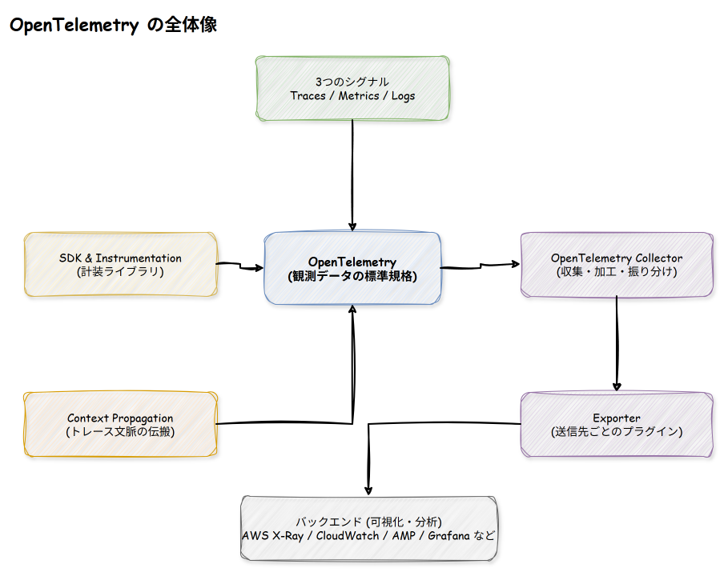
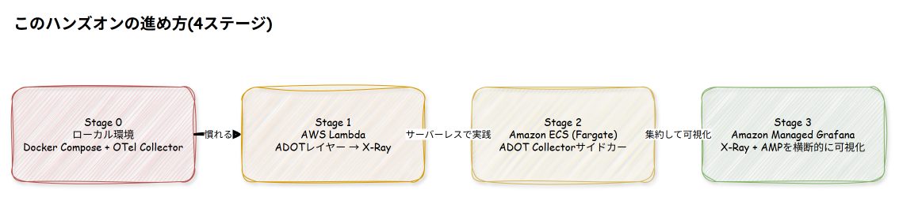
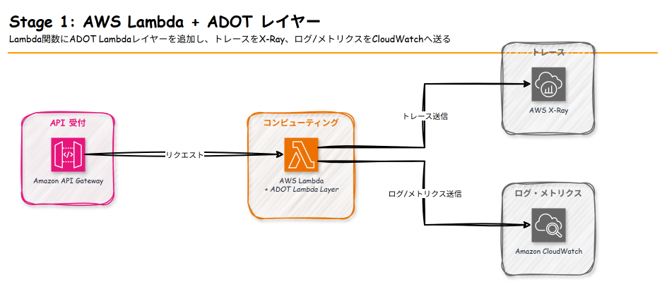
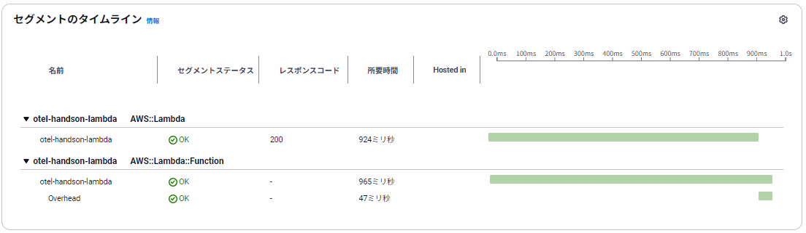
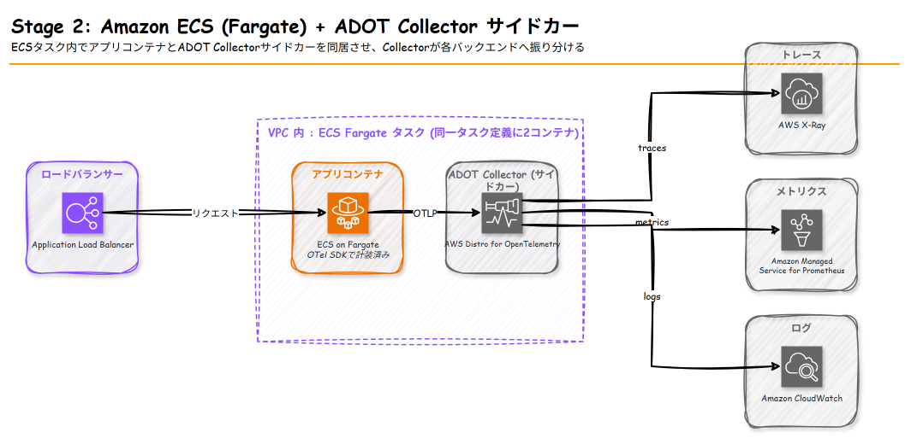
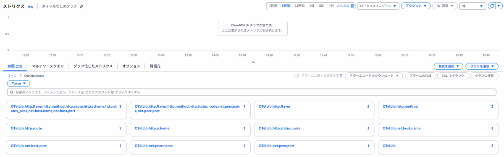
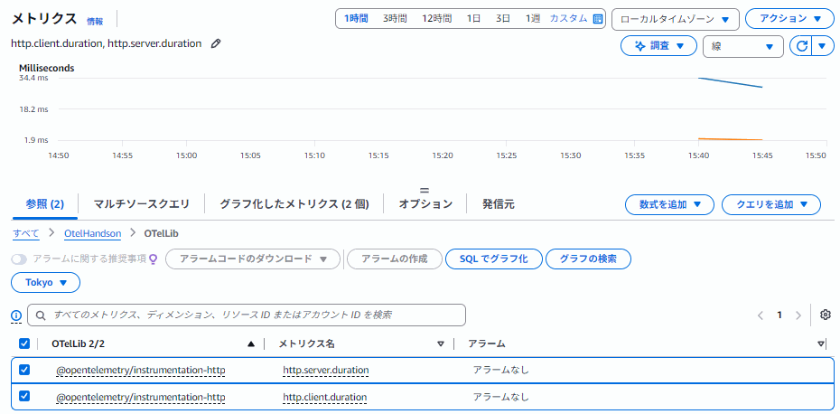
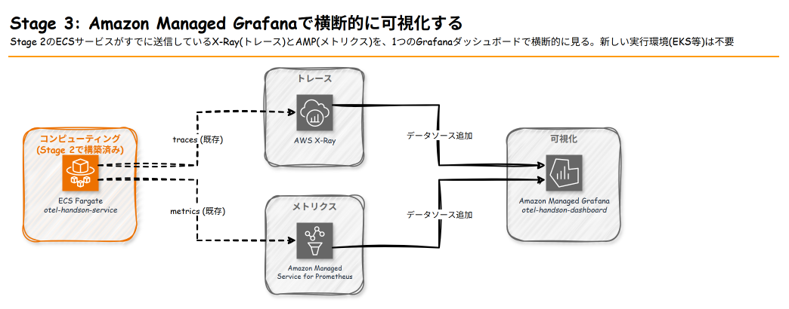
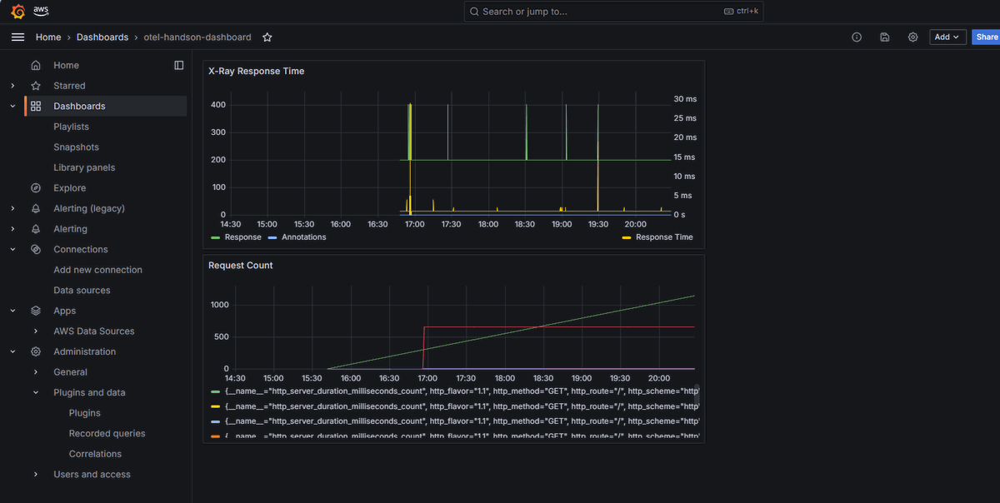

# OpenTelemetry ハンズオン — AWSで学ぶ可観測性の標準規格

## 1. 勉強対象の概要

### 1.1 OpenTelemetryとは

**OpenTelemetry (OTel)** は、アプリケーションから **トレース (Traces)・メトリクス (Metrics)・ログ (Logs)** の3種類のテレメトリデータを収集するための、CNCF (Cloud Native Computing Foundation) が主導するベンダーニュートラルな標準規格です。

以前はDatadog、New Relic、AWS X-Rayなど監視ツールごとに専用のSDKを組み込む必要がありましたが、OpenTelemetryを使えば「計装は1回、送信先は自由に選べる/切り替えられる」という状態を作れます。これが学ぶ最大のメリットです。

### 1.2 なぜAWSと紐づけて学ぶのか

AWSはOpenTelemetryを自社にディストリビューションした **ADOT (AWS Distro for OpenTelemetry)** を提供しており、これを使うと以下のAWSマネージドサービスへシームレスにテレメトリを流し込めます。

| OTelの概念 | 対応するAWSサービス・機能 |
|---|---|
| Traces | AWS X-Ray |
| Metrics | Amazon CloudWatch / Amazon Managed Service for Prometheus (AMP) |
| Logs | Amazon CloudWatch Logs |
| Collector | ADOT Collector (ECS/EKS/EC2上で稼働、またはLambda Layer) |
| 可視化 | Amazon Managed Grafana / CloudWatch ダッシュボード |

つまり「OpenTelemetryの基礎」と「AWSでの実践」はセットで学ぶことで理解が定着しやすい分野です。

### 1.3 中心となる4つの概念

OpenTelemetryを理解する上で外せない概念を整理します。

- **Traces / Metrics / Logs (3つのシグナル)**: リクエストの経路を追う「トレース」、数値の推移を見る「メトリクス」、イベント記録の「ログ」。この3つを合わせて可観測性 (Observability) と呼びます。
- **SDK & Instrumentation (計装)**: アプリケーションコードにテレメトリ収集を組み込む仕組み。多くの言語・フレームワークでは自動計装 (auto-instrumentation) が可能です。
- **OpenTelemetry Collector**: アプリケーションから送られたデータを受信し、加工 (バッチ化・サンプリング・属性の付与など) してから、1つ以上のバックエンドへ振り分けるミドルウェア。ADOT CollectorはこれのAWSディストリビューションです。
- **Context Propagation (文脈伝搬)**: サービスAからサービスBを呼び出したときに、「同じトレースの一部である」ことを示すtrace idなどをHTTPヘッダー等で伝搬する仕組み。分散トレーシングの要です。

これらの関係を図にすると以下のようになります。



SDK & InstrumentationがTraces/Metrics/Logsを生成し、Context Propagationがサービス間でトレースの文脈を繋ぎ、生成されたデータはOpenTelemetry Collectorに集約され、Exporterを経由してAWSの各バックエンドに届く、という流れです。

### 1.4 用語ミニ辞典

| 用語 | 意味 |
|---|---|
| Span | 1つの処理単位(例: 1回のHTTPリクエスト処理)を表すトレースの最小構成要素 |
| Trace | 複数のSpanが親子関係でつながった、1つのリクエスト全体の記録 |
| Resource | どのサービス・ホスト・バージョンから送られたデータかを表すメタ情報 |
| OTLP | OpenTelemetry Protocol。SDK/CollectorがAWSやその他バックエンドと通信する際の標準プロトコル |
| ADOT | AWS Distro for OpenTelemetry。AWSが提供するOTelのディストリビューション(SDK・Collector・Lambda Layerを含む) |
| AMP | Amazon Managed Service for Prometheus。マネージドなPrometheus互換のメトリクスストア |

## 2. ハンズオンの概要

### 2.1 ゴールイメージ

このハンズオンは、**ローカル環境でOpenTelemetryの基礎を体感 → AWS Lambda → Amazon ECS (Fargate) → Amazon Managed Grafanaで横断的に可視化** という順で段階的に進みます。同じ「アプリを計装してテレメトリを送る」という作業を、AWSの実行環境を変えながら繰り返すことで、OTelの概念とAWS各サービスとの結びつきの両方を身につけます。最後のStage 3では新しい実行環境は増やさず、それまでに送信したデータをGrafanaで1画面にまとめる体験に集中します。



| ステージ | 学べること | 想定所要時間 |
|---|---|---|
| Stage 0: ローカル | Collectorの基本動作、自動計装、Context Propagation | 60分 |
| Stage 1: Lambda | サーバーレスでのADOT導入、X-Rayとの連携 | 45分 |
| Stage 2: ECS Fargate | サイドカーパターン、Collector設定ファイルの書き方 | 60分 |
| Stage 3: Amazon Managed Grafana | X-Ray/AMPのデータソース追加、横断的な可視化 | 60分 |

### 2.2 前提条件

- AWSアカウント(検証用。Lambda/ECS/Amazon Managed Grafanaはいずれも課金が発生します。特にALBとGrafanaワークスペースは稼働しているだけで時間課金が発生するため、検証後すぐに削除することを推奨)
- AWS CLI v2 がインストール・設定済み(`aws configure`済み)
- Docker / Docker Compose がローカルにインストール済み
- Stage 3のみ: IAM Identity Centerが有効化されていること(組織の管理アカウント側でのみ有効化できる場合があります)
- Stage 2でAMPの動作確認をする場合のみ: Python環境と`pip install awscurl`(AMPのクエリAPIにSigV4署名付きリクエストを送るツール)
- AWSの基礎用語(IAMロール、VPC、ALB、ECR)が分かること(本教材では詳細説明を省略します)

> **Git Bash(Windows)を使う場合の注意**: Git Bashは、コマンドライン引数のうち`/`から始まる文字列(例: `/opt/otel-handler`、`/otel-handson/collector-config`)を、ローカルのファイルパスと誤認して自動的にWindowsパス(例: `C:/Program Files/Git/opt/otel-handler`)に変換してしまうことがあります。本教材ではAWS CLIの引数にこの形式の文字列(Lambdaの環境変数値、SSMパラメータ名など)が何度か登場するため、意図しない値になっていないか`--query`付きの確認コマンドで都度チェックし、化けている場合はコマンドの先頭に`MSYS_NO_PATHCONV=1`を付けて再実行してください。PowerShellやmacOS/Linuxのターミナルではこの問題は発生しません。

### 2.3 サンプルアプリケーションについて

このハンズオンでは、言語やフレームワークの違いに学習効果が左右されないよう、**Node.js (Express) の最小限のHTTP APIサーバー**を題材にします。同じアプリコードを各ステージで使い回し、「実行環境とCollectorへの送り方」だけを変えていきます。

```js
// app.js — 各ステージ共通で使う最小限のサンプルAPI
const express = require("express");
const app = express();

app.get("/", (req, res) => {
  res.json({ message: "hello from otel handson", time: new Date().toISOString() });
});

app.get("/work", (req, res) => {
  // わざと処理時間を作り、トレースの所要時間を確認しやすくする
  const delay = Math.floor(Math.random() * 300);
  setTimeout(() => res.json({ message: "work done", delayMs: delay }), delay);
});

app.listen(8080, () => console.log("listening on 8080"));
```

## 3. ハンズオンの手順

### Stage 0: ローカル環境でOpenTelemetryの基礎を体感する

#### 演習0-1: OpenTelemetry Collectorをローカルで起動し、コンソール出力で仕組みを理解する

**目的**: Collectorが「受信 (Receiver) → 加工 (Processor) → 送信 (Exporter)」というパイプラインで動いていることを、実際に手を動かして理解する。

**手順**:

1. 作業用ディレクトリを作成します。以降のStage 0の演習はすべてこのディレクトリの中で行います。

```bash
mkdir handson && cd handson
```

2. 2.3節のサンプルアプリを `app.js` として保存します。

3. アプリの依存関係を定義する `package.json` を用意します(この時点ではローカルにNode.js/npmがなくても問題ありません。依存関係のインストールは後述のDockerイメージのビルド時にコンテナの中で行われます)。**JSONにはコメントを書けないため、`// package.json` のような行は含めず、`{` から始めてください。**

```json
{
  "name": "otel-handson-app",
  "version": "1.0.0",
  "private": true,
  "main": "app.js",
  "scripts": {
    "start": "node app.js"
  },
  "dependencies": {
    "express": "^4.19.2"
  }
}
```

4. アプリをコンテナ化する `Dockerfile` を用意します。

```dockerfile
# Dockerfile
FROM node:20-slim
WORKDIR /usr/src/app
COPY package.json ./
RUN npm install
COPY app.js ./
CMD ["node", "app.js"]
```

5. Collectorの設定ファイルを用意します。**ファイル名の拡張子は `.yaml` です**(`docker-compose.yaml` から `./otel-collector-config.yaml` という名前で参照するため、1文字でも違うとマウントに失敗します)。

**Collectorの受信ポートはデフォルトでは自コンテナ内(`127.0.0.1`)にしかバインドされず、別コンテナの`app`から接続できません。`endpoint: 0.0.0.0:xxxx`を明示して、Docker Composeのネットワーク内の他コンテナからも接続できるようにします。**

```yaml
# otel-collector-config.yaml
receivers:
  otlp:
    protocols:
      grpc:
        endpoint: 0.0.0.0:4317
      http:
        endpoint: 0.0.0.0:4318

processors:
  batch:

exporters:
  debug:
    verbosity: detailed

service:
  pipelines:
    traces:
      receivers: [otlp]
      processors: [batch]
      exporters: [debug]
    metrics:
      receivers: [otlp]
      processors: [batch]
      exporters: [debug]
```

6. Docker Composeで、サンプルアプリとCollectorを同時に起動します。

```yaml
# docker-compose.yaml
services:
  otel-collector:
    image: otel/opentelemetry-collector-contrib:latest
    command: ["--config=/etc/otel-collector-config.yaml"]
    volumes:
      - ./otel-collector-config.yaml:/etc/otel-collector-config.yaml
    ports:
      - "4317:4317"   # OTLP gRPC
      - "4318:4318"   # OTLP HTTP

  app:
    build: .
    ports:
      - "8080:8080"
    environment:
      - OTEL_EXPORTER_OTLP_ENDPOINT=http://otel-collector:4318
      - OTEL_EXPORTER_OTLP_PROTOCOL=http/protobuf
      - OTEL_SERVICE_NAME=otel-handson-app
      - OTEL_NODE_RESOURCE_DETECTORS=env,host,os
      - OTEL_NODE_DISABLED_INSTRUMENTATIONS=fs
    depends_on:
      - otel-collector
```

`OTEL_NODE_RESOURCE_DETECTORS=env,host,os`は、自動計装が標準で行うクラウド環境判定(AWS/GCP/Azureのメタデータエンドポイントへの接続試行)を無効化する設定です。ローカルDocker環境ではこれらの接続はすべて失敗し、その失敗自体がHTTPリクエストとして自動計装されるため、`metadata.google.internal`などへの`ENOTFOUND`エラーSpanが大量に出力されてしまいます。

`OTEL_NODE_DISABLED_INSTRUMENTATIONS=fs`は、ファイルシステム操作(`readFileSync`、`realpathSync`など)を自動計装する`@opentelemetry/instrumentation-fs`を無効化する設定です。Node.jsは`require()`のたびに内部でファイルを読み込むため、これを有効にしたままだとアプリ起動時だけで数百件の無関係なSpanが生成されてしまいます(公式にも非常にノイズが多いモジュールとして知られています)。学習の妨げになるノイズなので、どちらも無効化しています。

`OTEL_EXPORTER_OTLP_ENDPOINT`は4317番(gRPC)ではなく **4318番(HTTP)** を指定している点に注意してください。Node.jsの自動計装SDKはデフォルトで`http/protobuf`プロトコル(HTTP/1.1ベース)を使うため、gRPC専用の4317番ポートに接続すると、HTTP/1.1のパーサーがgRPC(HTTP/2)の応答を解釈できずエラーになります。`OTEL_EXPORTER_OTLP_PROTOCOL=http/protobuf`を明示しておくと、将来SDKのデフォルトが変わっても挙動が揺れません。

7. ディレクトリの中身が以下のようになっていることを確認してから起動します。

```
handson/
├── app.js
├── package.json
├── Dockerfile
├── otel-collector-config.yaml
└── docker-compose.yaml
```

```bash
docker compose up --build
```

この時点で起動しているシステムの構成は以下の通りです。`app` コンテナと `otel-collector` コンテナが同じDocker Composeネットワークの中で動いており、`app` にはCollectorの宛先(`OTEL_EXPORTER_OTLP_ENDPOINT`)が設定済みですが、まだ自動計装が入っていないため実際には何も送信されていません。`otel-collector` はOTLPの受信待ち(Receiver)の状態で、何かデータを受け取れば `debug` エクスポーターでログに出力する準備だけができています。


**確認ポイント**: `otel-collector` コンテナのログに、まだ何もトレースを送っていない段階では何も出力されないことを確認してください(パイプラインの受け口だけが起動している状態)。別ターミナルで `docker compose logs otel-collector` を実行し、ログの最後が `Everything is ready. Begin running and processing data.` で止まっていて、`Span` などのトレース内容が一切出ていなければOKです。`docker compose ps` で `app` `otel-collector` 両方のコンテナが `Up` になっていることも合わせて確認してください。

#### 演習0-2: サンプルアプリに自動計装を入れてトレースを送る

**目的**: SDK & Instrumentationがどのようにアプリからテレメトリを生成するかを体感する。

**手順**:

1. `package.json` の `dependencies` に、自動計装パッケージを追加します(ローカルにNode.js/npmが無い場合は、このように `package.json` を直接編集するだけで問題ありません。実際のインストールは手順3のコンテナビルド時に行われます)。

```json
{
  "name": "otel-handson-app",
  "version": "1.0.0",
  "private": true,
  "main": "app.js",
  "scripts": {
    "start": "node app.js"
  },
  "dependencies": {
    "express": "^4.19.2",
    "@opentelemetry/api": "^1.9.0",
    "@opentelemetry/auto-instrumentations-node": "^0.50.0",
    "@opentelemetry/sdk-node": "^0.53.0"
  }
}
```

(ローカルにNode.js/npmがある場合は、代わりに `npm install --save @opentelemetry/api @opentelemetry/auto-instrumentations-node @opentelemetry/sdk-node` を実行しても同じ結果になります。)

2. `Dockerfile` のCMDを、自動計装ラッパー経由の起動に変更します。

```dockerfile
# Dockerfile
FROM node:20-slim
WORKDIR /usr/src/app
COPY package.json ./
RUN npm install
COPY app.js ./
CMD ["node", "--require", "@opentelemetry/auto-instrumentations-node/register", "app.js"]
```

3. `docker compose up --build` で再ビルド・再起動し、別ターミナルから何度かリクエストを送ります。

```bash
curl http://localhost:8080/
curl http://localhost:8080/work
```

**確認ポイント**: `otel-collector` のログ(debug exporter)に、`Span #0` から始まるトレース情報が出力されることを確認します。`http.route`、`http.status_code` などの属性が自動的に付与されている点に注目してください。これが「自動計装」の効果です。

#### 演習0-3: Context Propagationを確認する

**目的**: サービスをまたいでも1つのトレースとして繋がる仕組みを理解する。

**手順**:

1. `app.js` に、自分自身を呼び出す(擬似的に別サービスを呼ぶ)`/chain`エンドポイントを追加します。ファイル全体は以下のようになります。

```js
// app.js
const express = require("express");
const http = require("http");
const app = express();

app.get("/", (req, res) => {
  res.json({ message: "hello from otel handson", time: new Date().toISOString() });
});

app.get("/work", (req, res) => {
  // わざと処理時間を作り、トレースの所要時間を確認しやすくする
  const delay = Math.floor(Math.random() * 300);
  setTimeout(() => res.json({ message: "work done", delayMs: delay }), delay);
});

app.get("/chain", (req, res) => {
  http.get("http://localhost:8080/work", (upstream) => {
    upstream.on("data", () => {});
    upstream.on("end", () => res.json({ message: "chain done" }));
  });
});

app.listen(8080, () => console.log("listening on 8080"));
```

2. `docker compose up --build` で再ビルドしてから、`curl http://localhost:8080/chain` を実行します。

**確認ポイント**: Collectorのログに出力される複数のSpanが、同じ `trace_id` を共有していることを確認してください。`/chain` のSpanが親、`/work` のSpanが子として `parent_span_id` で紐づいています。これがContext Propagationの実体です。HTTPリクエストのヘッダーに自動的に `traceparent` が付与され、trace idが伝搬しています。

実際のログを図にすると、以下のような入れ子構造になっています。


ポイントは、`/work`のServer Span(③)が、`/chain`のServer Span(①)とは別の「新しいリクエスト」として扱われていることです。appコンテナ自身が`http.get()`でHTTPクライアントとなり(②)、自分自身にリクエストを送っています。ネットワーク的には別々のリクエストなのに、`traceparent`ヘッダーによってtrace_idが引き継がれているため、Collector上では1本の連続したトレースとして表示されます。

> **学んだこと**: Collectorはパイプライン(Receiver→Processor→Exporter)で構成される / 自動計装だけでSpanが自動生成される / trace idはHTTPヘッダーで伝搬し、サービスをまたいでも1本のトレースにまとまる / Server SpanとClient Spanが交互に入れ子になることで、実際のネットワークホップを跨いだ呼び出し関係がそのままSpanの親子構造として記録される。

---

### Stage 1: AWS Lambda + ADOT Lambdaレイヤー → X-Ray



サーバーレスでは、Collectorをアプリと同じプロセス内(拡張機能として)動かす **ADOT Lambdaレイヤー** を使うのが基本パターンです。アプリコード自体を大きく変更せずにOpenTelemetryを導入できます。

#### 演習1-1: Lambda関数を作成する

**目的**: サーバーレス環境でのOTel導入がいかに小さな変更で済むかを体感する。

**手順**:

1. Lambda実行ロールを作成します。通常のLambda実行権限に加えて、X-Rayへの書き込み権限 (`AWSXRayDaemonWriteAccess`) をアタッチします。

```bash
aws iam create-role \
  --role-name otel-handson-lambda-role \
  --assume-role-policy-document '{"Version":"2012-10-17","Statement":[{"Effect":"Allow","Principal":{"Service":"lambda.amazonaws.com"},"Action":"sts:AssumeRole"}]}'

aws iam attach-role-policy \
  --role-name otel-handson-lambda-role \
  --policy-arn arn:aws:iam::aws:policy/service-role/AWSLambdaBasicExecutionRole

aws iam attach-role-policy \
  --role-name otel-handson-lambda-role \
  --policy-arn arn:aws:iam::aws:policy/AWSXRayDaemonWriteAccess
```

ロールのARNを控えておきます(IAMロール作成直後は数秒〜十数秒ほど反映待ちが必要な場合があります)。

```bash
LAMBDA_ROLE_ARN=$(aws iam get-role --role-name otel-handson-lambda-role --query 'Role.Arn' --output text)
echo "$LAMBDA_ROLE_ARN"
```

2. Lambda用の最小限のハンドラーを用意します。

```js
// index.js
exports.handler = async (event) => {
  return {
    statusCode: 200,
    body: JSON.stringify({ message: "hello from lambda + adot" }),
  };
};
```

3. デプロイパッケージを作成し、Lambda関数を作成します。

```bash
zip function.zip index.js

aws lambda create-function \
  --function-name otel-handson-lambda \
  --runtime nodejs20.x \
  --handler index.handler \
  --zip-file fileb://function.zip \
  --role "$LAMBDA_ROLE_ARN"
```

作成直後にロールの反映待ちで `InvalidParameterValueException` が出た場合は、10秒ほど待って同じコマンドを再実行してください。

#### 演習1-2: ADOT Lambdaレイヤーをアタッチする

**目的**: レイヤーを追加するだけでCollectorが同居する仕組みを理解する。

**手順**:

1. リージョンに応じたADOTレイヤーのARNを確認します。**レイヤー名・バージョン番号は頻繁に更新される**ため、使用する前に必ず[ADOT Lambda対応言語一覧(Node.js)](https://aws-otel.github.io/docs/getting-started/lambda/lambda-js)の公式ページで、対象リージョン・アーキテクチャ(x86_64/arm64)に合った最新のARNを確認してください。レイヤー名自体が `aws-otel-nodejs-amd64-ver-1-x` のような命名から `aws-otel-nodejs-amd64-ver-1-30-2` のようにバージョン番号を含む命名に変わることもあり、古いARNを指定すると `AccessDeniedException (lambda:GetLayerVersion)` という、権限エラーのように見えるが実際は「レイヤーが存在しない」ことが原因のエラーになります。以下は記載当時の `ap-northeast-1` 向けの例です。

```bash
aws lambda update-function-configuration \
  --function-name otel-handson-lambda \
  --layers arn:aws:lambda:ap-northeast-1:901920570463:layer:aws-otel-nodejs-amd64-ver-1-30-2:6
```

2. 環境変数でラッパーとX-Rayトレースモードを指定します。

> **Git Bash(Windows)を使っている場合の注意**: Git Bashは`/`から始まる引数を自動的にWindowsパスへ変換してしまうため、`AWS_LAMBDA_EXEC_WRAPPER=/opt/otel-handler`が`AWS_LAMBDA_EXEC_WRAPPER=C:/Program Files/Git/opt/otel-handler`のような誤った値に化けることがあります。`aws lambda get-function-configuration --function-name otel-handson-lambda`で実際に設定された値を確認し、化けている場合はコマンドの先頭に`MSYS_NO_PATHCONV=1`を付けて再実行してください(この変換を無効化できます)。

```bash
MSYS_NO_PATHCONV=1 aws lambda update-function-configuration \
  --function-name otel-handson-lambda \
  --environment "Variables={AWS_LAMBDA_EXEC_WRAPPER=/opt/otel-handler,OTEL_PROPAGATORS=xray,OTEL_SERVICE_NAME=otel-handson-lambda}"
```

| 環境変数 | 意味 |
|---|---|
| `AWS_LAMBDA_EXEC_WRAPPER=/opt/otel-handler` | Lambdaの実行ラッパーを、ADOTレイヤーが提供する`/opt/otel-handler`に差し替える設定です。関数のハンドラーを直接呼び出す代わりに、まずこのラッパーが起動してOpenTelemetry SDKを初期化し、その後に本来のハンドラー(`index.handler`)を呼び出します。これが「アプリコードを変更せずに計装できる」仕組みの正体です。 |
| `OTEL_PROPAGATORS=xray` | Context Propagation(Stage 0の演習0-3で確認した、trace idをヘッダーで伝搬する仕組み)に使うフォーマットを指定します。`xray`を指定すると、X-Ray互換のトレースIDフォーマット・伝搬ヘッダー(`X-Amzn-Trace-Id`)が使われ、Lambdaランタイムが元々発行するX-RayのトレースIDと、ADOTが生成するOpenTelemetryのトレースが同じ1本のトレースとして繋がるようになります。省略するとW3C標準の`traceparent`ヘッダー形式になり、X-Rayとトレースが繋がらなくなります。 |
| `OTEL_SERVICE_NAME=otel-handson-lambda` | このLambda関数が送信するテレメトリの送信元を識別する名前です。X-Rayのトレース詳細やService Map上に、この名前でサービスが表示されます(Stage 0で`app`コンテナに設定した`OTEL_SERVICE_NAME`と同じ役割です)。 |

3. X-Rayのアクティブトレースを有効化します。

```bash
aws lambda update-function-configuration \
  --function-name otel-handson-lambda \
  --tracing-config Mode=Active
```

反映には数秒かかることがあります。マネジメントコンソールの表示がすぐに変わらない場合は、ページを再読み込みするか、`aws lambda get-function-configuration --function-name otel-handson-lambda --query TracingConfig`で実際の設定値を確認してください。

4. ADOTのCollector拡張機能は初期化に数百ミリ秒〜数秒かかるため、デフォルトのタイムアウト(3秒)ではコールドスタート時に`Sandbox.Timedout`エラーになることがあります。タイムアウトを延長しておきます。

```bash
aws lambda update-function-configuration \
  --function-name otel-handson-lambda \
  --timeout 15
```

#### 演習1-3: 呼び出してX-Rayでトレースを確認する

**手順**:

```bash
aws lambda invoke --function-name otel-handson-lambda out.json && cat out.json
```

AWSマネジメントコンソールで **X-Ray > Traces**、または **CloudWatch > X-Ray traces** を開き、直近のトレースを確認します。

**確認ポイント**: トレースの中に `otel-handson-lambda` というServiceが表示され、Lambdaの初期化 (Init) フェーズと実行 (Invocation) フェーズが別のSubsegmentとして見えることを確認してください。実処理を伴うトレースをクリックすると、セグメントのタイムラインは以下のように表示されます。



`AWS::Lambda`(Lambdaサービス自体の呼び出し)の中に `AWS::Lambda::Function`(実際の関数実行)が入れ子になっており、さらにその中の `Overhead`(Lambdaランタイムが計測用に付加するわずかなオーバーヘッド時間)が確認できます。今回のコード自体は一瞬で終わる処理のため、`Init`/`Invocation`という名前ではなく、この`AWS::Lambda::Function`のセグメント自体が実行フェーズ全体を表しています。

> **補足**: トレース一覧に、実処理を伴うトレース(所要時間が数百ms〜1秒程度、レスポンスコード200)とは別に、所要時間0秒の短いトレースがもう1本表示されることがあります。これはADOT(OTel)とLambda標準のX-Rayトレース(`TracingConfig: Active`)を両方有効にした場合に、Lambda基盤側が自動生成する付随的なセグメントが別トレースとして分かれてしまうためで、環境によってよく見られる現象です。実処理を伴う方のトレースをクリックし、その中にInit/Invocationのサブセグメントが含まれていれば確認ポイントは満たされています。

> **学んだこと**: ADOTレイヤーはアプリコードを変更せず「環境変数の追加」だけでCollectorを同居させられる / `OTEL_PROPAGATORS=xray` によりX-Ray互換のトレースID形式で伝搬される / X-Rayのアクティブトレース設定とADOTは別々に有効化が必要。

---

### Stage 2: Amazon ECS (Fargate) + ADOT Collectorサイドカー



コンテナ環境では、アプリコンテナと同じタスク内にADOT Collectorを**サイドカー**として配置するのが定番パターンです。アプリはlocalhost経由でCollectorにデータを送るだけで済みます。

> **本ステージで事前に用意しておくもの**: 2つ以上のパブリックサブネットを持つVPC、ALB(HTTPリスナー80番、ターゲットタイプ`IP`・ポート8080・ヘルスチェックパス`/`のターゲットグループを1つ)、ECSタスク用セキュリティグループ(ALB用セキュリティグループからの8080番ポート許可)。これらはVPC/ALBの一般的な作成手順のため本教材では割愛します(2.2節の前提条件を参照)。それ以外の、ADOT導入に固有のリソース(ECSクラスター、ECRリポジトリ、IAMロールなど)はこのステージの中で作成します。
>
> **既存のVPCを持っていない場合**: 以下のコマンドで、このハンズオン専用のVPC一式(VPC・Internet Gateway・パブリックサブネット2つ・ルートテーブル・セキュリティグループ2つ・ALB・ターゲットグループ)を作成できます。
>
> ```bash
> REGION=ap-northeast-1
>
> VPC_ID=$(aws ec2 create-vpc --cidr-block 10.100.0.0/16 \
>   --tag-specifications 'ResourceType=vpc,Tags=[{Key=Name,Value=otel-handson-vpc}]' \
>   --query 'Vpc.VpcId' --output text)
> aws ec2 modify-vpc-attribute --vpc-id "$VPC_ID" --enable-dns-support "{\"Value\":true}"
> aws ec2 modify-vpc-attribute --vpc-id "$VPC_ID" --enable-dns-hostnames "{\"Value\":true}"
>
> IGW_ID=$(aws ec2 create-internet-gateway \
>   --tag-specifications 'ResourceType=internet-gateway,Tags=[{Key=Name,Value=otel-handson-igw}]' \
>   --query 'InternetGateway.InternetGatewayId' --output text)
> aws ec2 attach-internet-gateway --vpc-id "$VPC_ID" --internet-gateway-id "$IGW_ID"
>
> SUBNET_A=$(aws ec2 create-subnet --vpc-id "$VPC_ID" --cidr-block 10.100.1.0/24 \
>   --availability-zone "${REGION}a" \
>   --tag-specifications 'ResourceType=subnet,Tags=[{Key=Name,Value=otel-handson-public-1a}]' \
>   --query 'Subnet.SubnetId' --output text)
> SUBNET_C=$(aws ec2 create-subnet --vpc-id "$VPC_ID" --cidr-block 10.100.2.0/24 \
>   --availability-zone "${REGION}c" \
>   --tag-specifications 'ResourceType=subnet,Tags=[{Key=Name,Value=otel-handson-public-1c}]' \
>   --query 'Subnet.SubnetId' --output text)
> aws ec2 modify-subnet-attribute --subnet-id "$SUBNET_A" --map-public-ip-on-launch
> aws ec2 modify-subnet-attribute --subnet-id "$SUBNET_C" --map-public-ip-on-launch
>
> RTB_ID=$(aws ec2 create-route-table --vpc-id "$VPC_ID" \
>   --tag-specifications 'ResourceType=route-table,Tags=[{Key=Name,Value=otel-handson-public-rtb}]' \
>   --query 'RouteTable.RouteTableId' --output text)
> aws ec2 create-route --route-table-id "$RTB_ID" --destination-cidr-block 0.0.0.0/0 --gateway-id "$IGW_ID"
> aws ec2 associate-route-table --route-table-id "$RTB_ID" --subnet-id "$SUBNET_A"
> aws ec2 associate-route-table --route-table-id "$RTB_ID" --subnet-id "$SUBNET_C"
>
> ALB_SG_ID=$(aws ec2 create-security-group --group-name otel-handson-alb-sg \
>   --description "ALB SG for otel handson" --vpc-id "$VPC_ID" \
>   --query 'GroupId' --output text)
> aws ec2 authorize-security-group-ingress --group-id "$ALB_SG_ID" --protocol tcp --port 80 --cidr 0.0.0.0/0
>
> ECS_SG_ID=$(aws ec2 create-security-group --group-name otel-handson-ecs-sg \
>   --description "ECS task SG for otel handson" --vpc-id "$VPC_ID" \
>   --query 'GroupId' --output text)
> aws ec2 authorize-security-group-ingress --group-id "$ECS_SG_ID" --protocol tcp --port 8080 --source-group "$ALB_SG_ID"
>
> ALB_ARN=$(aws elbv2 create-load-balancer --name otel-handson-alb \
>   --subnets "$SUBNET_A" "$SUBNET_C" --security-groups "$ALB_SG_ID" \
>   --scheme internet-facing --type application \
>   --query 'LoadBalancers[0].LoadBalancerArn' --output text)
> ALB_DNS=$(aws elbv2 describe-load-balancers --load-balancer-arns "$ALB_ARN" --query 'LoadBalancers[0].DNSName' --output text)
>
> TG_ARN=$(MSYS_NO_PATHCONV=1 aws elbv2 create-target-group --name otel-handson-tg \
>   --protocol HTTP --port 8080 --vpc-id "$VPC_ID" --target-type ip --health-check-path "/" \
>   --query 'TargetGroups[0].TargetGroupArn' --output text)
> MSYS_NO_PATHCONV=1 aws elbv2 create-listener --load-balancer-arn "$ALB_ARN" \
>   --protocol HTTP --port 80 --default-actions "Type=forward,TargetGroupArn=$TG_ARN"
>
> echo "SUBNET_A=$SUBNET_A / SUBNET_C=$SUBNET_C / ECS_SG_ID=$ECS_SG_ID / TG_ARN=$TG_ARN / ALB_DNS=$ALB_DNS"
> ```
>
> `--health-check-path "/"`のように`/`だけの引数もGit Bashのパス変換の対象になるため、`MSYS_NO_PATHCONV=1`を付けています。最後に表示される値を、以降の`<SUBNET_ID>`・`<SG_ID>`・`<TARGET_GROUP_ARN>`・`<ALB_DNS_NAME>`にそのまま使ってください。

#### 演習2-1: 事前準備(ECSクラスター・ECRリポジトリ・IAMロール)

**目的**: サイドカーパターンを動かすために必要な土台のAWSリソースを作成する。

**手順**:

1. ECSクラスターと、コンテナのログ出力先となるCloudWatch Logsのロググループを作成します。

```bash
aws ecs create-cluster --cluster-name otel-handson-cluster
MSYS_NO_PATHCONV=1 aws logs create-log-group --log-group-name /ecs/otel-handson-task --region ap-northeast-1
```

2. アプリコンテナ用のECRリポジトリを作成し、Stage 0で作成した `app.js` / `package.json` をコピーしてビルド・pushします。

> **重要**: `--require @opentelemetry/auto-instrumentations-node/register` というStage 0で使ったゼロコードの自動計装方式は、**現時点でメトリクスのエクスポーターを一切初期化しない**という既知の制限があります([opentelemetry-js-contrib#2527](https://github.com/open-telemetry/opentelemetry-js-contrib/issues/2527))。トレースはこの方式のままでも正しく送信されますが、後述の演習2-4でCloudWatchのメトリクスを確認するために、ここで`NodeSDK`を明示的に初期化する`instrumentation.js`に切り替えます。

`instrumentation.js` を新規作成します。

```js
// instrumentation.js
const { NodeSDK } = require("@opentelemetry/sdk-node");
const { getNodeAutoInstrumentations } = require("@opentelemetry/auto-instrumentations-node");
const { PeriodicExportingMetricReader } = require("@opentelemetry/sdk-metrics");
const { OTLPMetricExporter } = require("@opentelemetry/exporter-metrics-otlp-http");

const sdk = new NodeSDK({
  instrumentations: [
    getNodeAutoInstrumentations({
      "@opentelemetry/instrumentation-fs": { enabled: false },
    }),
  ],
  metricReader: new PeriodicExportingMetricReader({
    exporter: new OTLPMetricExporter(),
    exportIntervalMillis: 10000,
  }),
});

sdk.start();
```

`package.json`に2つの依存関係を追加します。

```json
{
  "name": "otel-handson-app",
  "version": "1.0.0",
  "private": true,
  "main": "app.js",
  "scripts": {
    "start": "node app.js"
  },
  "dependencies": {
    "express": "^4.19.2",
    "@opentelemetry/api": "^1.9.0",
    "@opentelemetry/auto-instrumentations-node": "^0.50.0",
    "@opentelemetry/sdk-node": "^0.53.0",
    "@opentelemetry/sdk-metrics": "^1.26.0",
    "@opentelemetry/exporter-metrics-otlp-http": "^0.53.0"
  }
}
```

`Dockerfile`のCMDを、この`instrumentation.js`を読み込む形に変更します。

```dockerfile
# Dockerfile
FROM node:20-slim
WORKDIR /usr/src/app
COPY package.json ./
RUN npm install
COPY app.js instrumentation.js ./
CMD ["node", "--require", "./instrumentation.js", "app.js"]
```

ECRリポジトリを作成し、ビルド・pushします。

```bash
aws ecr create-repository --repository-name otel-handson-app

ACCOUNT_ID=$(aws sts get-caller-identity --query Account --output text)
REGION=ap-northeast-1
ECR_REPO="$ACCOUNT_ID.dkr.ecr.$REGION.amazonaws.com/otel-handson-app"

aws ecr get-login-password --region "$REGION" \
  | docker login --username AWS --password-stdin "$ACCOUNT_ID.dkr.ecr.$REGION.amazonaws.com"

docker build -t "$ECR_REPO:latest" .
docker push "$ECR_REPO:latest"
```

3. **タスク実行ロール** (イメージのpullやSSMパラメータの読み取りなど、ECS自体がタスクを起動するために使う権限)を作成します。

```bash
aws iam create-role \
  --role-name otel-handson-ecs-execution-role \
  --assume-role-policy-document '{"Version":"2012-10-17","Statement":[{"Effect":"Allow","Principal":{"Service":"ecs-tasks.amazonaws.com"},"Action":"sts:AssumeRole"}]}'

aws iam attach-role-policy \
  --role-name otel-handson-ecs-execution-role \
  --policy-arn arn:aws:iam::aws:policy/service-role/AmazonECSTaskExecutionRolePolicy

# Collector設定をSSMパラメータストアから読み取れるようにする
aws iam put-role-policy \
  --role-name otel-handson-ecs-execution-role \
  --policy-name ssm-read-otel-config \
  --policy-document '{"Version":"2012-10-17","Statement":[{"Effect":"Allow","Action":"ssm:GetParameters","Resource":"*"}]}'
```

4. **タスクロール** (アプリ・Collectorコンテナが実行時にX-Ray/CloudWatch/AMPを呼び出すための権限)を作成します。

```bash
aws iam create-role \
  --role-name otel-handson-ecs-task-role \
  --assume-role-policy-document '{"Version":"2012-10-17","Statement":[{"Effect":"Allow","Principal":{"Service":"ecs-tasks.amazonaws.com"},"Action":"sts:AssumeRole"}]}'

aws iam put-role-policy \
  --role-name otel-handson-ecs-task-role \
  --policy-name otel-handson-telemetry-write \
  --policy-document '{"Version":"2012-10-17","Statement":[{"Effect":"Allow","Action":["xray:PutTraceSegments","xray:PutTelemetryRecords","cloudwatch:PutMetricData","logs:CreateLogGroup","logs:CreateLogStream","logs:PutLogEvents","aps:RemoteWrite"],"Resource":"*"}]}'
```

5. 作成した2つのロールのARNを控えます。

```bash
EXECUTION_ROLE_ARN=$(aws iam get-role --role-name otel-handson-ecs-execution-role --query 'Role.Arn' --output text)
TASK_ROLE_ARN=$(aws iam get-role --role-name otel-handson-ecs-task-role --query 'Role.Arn' --output text)
```

**確認ポイント**: `aws ecr describe-repositories --repository-names otel-handson-app` でリポジトリにイメージが1件push済みであること(`aws ecr describe-images --repository-name otel-handson-app`)、`aws iam get-role` の2つのコマンドがエラーなくARNを返すことを確認してください。

#### 演習2-2: ADOT Collectorの設定ファイルを書き、SSMパラメータストアに保存する

**目的**: Collectorが複数バックエンドへ同時にデータを振り分けられることを理解する。あわせて、ECSタスクへ設定ファイルを渡す実践的な方法(SSMパラメータストア経由)を学ぶ。

**手順**:

1. AMP(Amazon Managed Service for Prometheus)のワークスペースを作成します。このワークスペースはStage 3でも引き続き使用します。

```bash
aws amp create-workspace --alias otel-handson-amp

AMP_WORKSPACE_ID=$(aws amp list-workspaces --alias otel-handson-amp --query 'workspaces[0].workspaceId' --output text)
echo "$AMP_WORKSPACE_ID"
```

(AMPを使わない場合はこの手順を飛ばし、後述の設定ファイルから `prometheusremotewrite` 関連の記述を削除しても構いません。)

2. 以下の設定を `otel-config.yaml` として保存します。`<AMP_WORKSPACE_ID>` は手順1で取得した値に置き換えてください。

```yaml
receivers:
  otlp:
    protocols:
      grpc:
      http:

processors:
  batch:

exporters:
  awsxray:
    region: ap-northeast-1
  awsemf:
    region: ap-northeast-1
    namespace: OtelHandson
  prometheusremotewrite:
    endpoint: "https://aps-workspaces.ap-northeast-1.amazonaws.com/workspaces/<AMP_WORKSPACE_ID>/api/v1/remote_write"
    auth:
      authenticator: sigv4auth

extensions:
  sigv4auth:
    region: ap-northeast-1

service:
  extensions: [sigv4auth]
  pipelines:
    traces:
      receivers: [otlp]
      processors: [batch]
      exporters: [awsxray]
    metrics:
      receivers: [otlp]
      processors: [batch]
      exporters: [awsemf, prometheusremotewrite]
```

`awsxray` エクスポーターがトレースをX-Rayへ、`awsemf` がメトリクスをCloudWatch Embedded Metric Format経由でCloudWatchへ、`prometheusremotewrite` がAMPへ送ります。1つのCollectorが複数のバックエンドに同時配信できることがポイントです。

3. ECSコンテナ内では通常のファイルマウントが使えないため、**SSMパラメータストア**に設定内容を保存し、コンテナ起動時に環境変数として注入します。ADOT Collectorの公式にサポートされた方法です。

> **Git Bash(Windows)を使っている場合の注意**: SSMパラメータ名の`/otel-handson/collector-config`のように`/`から始まる引数も、演習1-2の`AWS_LAMBDA_EXEC_WRAPPER`と同様にGit Bashが自動的にWindowsパスへ変換してしまい、`ValidationException: Parameter name must be a fully qualified name.`というエラーになることがあります。その場合はコマンドの先頭に`MSYS_NO_PATHCONV=1`を付けて再実行してください。

```bash
MSYS_NO_PATHCONV=1 aws ssm put-parameter \
  --name "/otel-handson/collector-config" \
  --type String \
  --value file://otel-config.yaml
```

**確認ポイント**: `MSYS_NO_PATHCONV=1 aws ssm get-parameter --name /otel-handson/collector-config` で、先ほどの設定内容がそのまま取得できることを確認してください(Git Bash以外の環境では`MSYS_NO_PATHCONV=1`は不要です)。

#### 演習2-3: タスク定義に2コンテナを登録し、サービスをデプロイする

**目的**: サイドカーパターンの実装方法と、IAMロール・SSM連携の全体像を理解する。

**手順**:

1. タスク定義JSON `task-def.json` を用意します。`executionRoleArn`/`taskRoleArn`、Collectorコンテナの `secrets` (SSMパラメータの内容を環境変数 `AOT_CONFIG_CONTENT` として注入)がポイントです。

```json
{
  "family": "otel-handson-task",
  "executionRoleArn": "${EXECUTION_ROLE_ARN}",
  "taskRoleArn": "${TASK_ROLE_ARN}",
  "containerDefinitions": [
    {
      "name": "app",
      "image": "${ECR_REPO}:latest",
      "portMappings": [{ "containerPort": 8080 }],
      "environment": [
        { "name": "OTEL_EXPORTER_OTLP_ENDPOINT", "value": "http://localhost:4318" },
        { "name": "OTEL_EXPORTER_OTLP_PROTOCOL", "value": "http/protobuf" },
        { "name": "OTEL_NODE_RESOURCE_DETECTORS", "value": "env,host,os,aws" },
        { "name": "OTEL_NODE_DISABLED_INSTRUMENTATIONS", "value": "fs" },
        { "name": "OTEL_SERVICE_NAME", "value": "otel-handson-ecs" }
      ],
      "logConfiguration": {
        "logDriver": "awslogs",
        "options": {
          "awslogs-group": "/ecs/otel-handson-task",
          "awslogs-region": "ap-northeast-1",
          "awslogs-stream-prefix": "app"
        }
      }
    },
    {
      "name": "aws-otel-collector",
      "image": "public.ecr.aws/aws-observability/aws-otel-collector:latest",
      "command": ["--config=env:AOT_CONFIG_CONTENT"],
      "secrets": [
        { "name": "AOT_CONFIG_CONTENT", "valueFrom": "/otel-handson/collector-config" }
      ],
      "environment": [
        { "name": "AWS_REGION", "value": "ap-northeast-1" }
      ],
      "logConfiguration": {
        "logDriver": "awslogs",
        "options": {
          "awslogs-group": "/ecs/otel-handson-task",
          "awslogs-region": "ap-northeast-1",
          "awslogs-stream-prefix": "collector"
        }
      }
    }
  ],
  "requiresCompatibilities": ["FARGATE"],
  "networkMode": "awsvpc",
  "cpu": "512",
  "memory": "1024"
}
```

2. プレースホルダを実際の値に置き換えてから登録します(`envsubst` が無い環境ではエディタで手動置換しても構いません)。

> **注意**: `$EXECUTION_ROLE_ARN`・`$TASK_ROLE_ARN`・`$ECR_REPO`は演習2-1で設定したシェル変数です。ターミナルを閉じた後や別のターミナルで作業している場合、これらの変数は失われています。`envsubst`は未定義の変数を空文字列に置き換えてしまうため、`executionRoleArn`が空のまま登録され`ClientException: ... you must also specify a value for 'executionRoleArn'`のようなエラーになります。`echo "$EXECUTION_ROLE_ARN"`などで値が入っているか確認し、空であれば演習2-1の手順5・手順2のコマンドで再取得してから`envsubst`を実行してください。

```bash
envsubst < task-def.json > task-def.rendered.json
MSYS_NO_PATHCONV=1 aws ecs register-task-definition --cli-input-json file://task-def.rendered.json
```

3. 事前に用意したVPC・サブネット・セキュリティグループ・ALBターゲットグループの情報を使って、サービスを作成します。

```bash
aws ecs create-service \
  --cluster otel-handson-cluster \
  --service-name otel-handson-service \
  --task-definition otel-handson-task \
  --desired-count 1 \
  --launch-type FARGATE \
  --network-configuration "awsvpcConfiguration={subnets=[<SUBNET_ID>],securityGroups=[<SG_ID>],assignPublicIp=ENABLED}" \
  --load-balancers "targetGroupArn=<TARGET_GROUP_ARN>,containerName=app,containerPort=8080"
```

**確認ポイント**: `aws ecs describe-services --cluster otel-handson-cluster --services otel-handson-service` の `deployments` が `PRIMARY` かつ `runningCount` が `desiredCount` と一致していることを確認してください。ALBのターゲットグループのコンソール画面で、ターゲットのヘルスチェックが `healthy` になっていればタスク起動は成功です。

#### 演習2-4: ALB経由でアクセスしてトレース/メトリクスを確認する

**手順**: ALBのDNS名にアクセスします。

```bash
curl http://<ALB_DNS_NAME>/work
```

- **X-Ray**: マネジメントコンソールの X-Ray > Traces で `otel-handson-ecs` のトレースが見えることを確認。
- **CloudWatch**: `aws cloudwatch list-metrics --namespace OtelHandson` を実行し、`http.server.duration`(サーバー側の応答時間)・`http.client.duration`(クライアント側の応答時間)というメトリクスが登録されていることを確認。マネジメントコンソールから見る場合は Metrics > All metrics > `OtelHandson` 名前空間を開きます。**ここで確認するのは、ECSサービス自体が標準で出す`ECS`名前空間のCPU/メモリ使用率ではなく、アプリが生成したこのカスタム名前空間のメトリクスです**(紛らわしいので注意してください)。

  

  一覧の中から`http.server.duration`・`http.client.duration`のチェックボックスにチェックを入れると、実際の応答時間の推移がグラフに表示されます。

  

- **AMP**: `awscurl`(未インストールの場合は`pip install awscurl`)でAMPのクエリAPIにSigV4署名付きリクエストを送り、メトリクスが登録されていることを確認します。AMPコンソールのワークスペース詳細ページに表示されている「Endpoint - query URL」を使います。

  ```bash
  WORKSPACE_ID="ws-xxxxxxxxxxxxxxxxxxxxxxxxxxxx"  # コンソールの「Workspace ID」に置き換える
  QUERY_URL="https://aps-workspaces.ap-northeast-1.amazonaws.com/workspaces/$WORKSPACE_ID/api/v1/query"

  # 届いている全メトリクス名を確認
  awscurl --service aps --region ap-northeast-1 \
    "https://aps-workspaces.ap-northeast-1.amazonaws.com/workspaces/$WORKSPACE_ID/api/v1/label/__name__/values"
  ```

  `http_server_duration_milliseconds_count`のような名前(ドットがアンダースコアに変換されたPrometheus形式)が返ってくれば成功です。**`up`メトリクスは表示されません**。`up`はPrometheusサーバー自身が対象を能動的にスクレイピングした時にだけ生成される特殊なメトリクスで、今回のように`prometheusremotewrite`エクスポーターでpush型(remote_write)で送り込む構成には存在しないためです。具体的な値を見たい場合は、`$QUERY_URL?query=http_server_duration_milliseconds_count`のように`query`パラメータでメトリクス名を指定してください(Stage 3でGrafanaから可視化します)。

**確認ポイント**: アプリコンテナのログにはOTLP送信エラーが出ていないか(サイドカーがlocalhostで正しくリッスンできているか)を確認してください。

> **学んだこと**: サイドカーパターンではアプリは常に `localhost` のCollectorにさえ送ればよく、送信先の切り替えはCollector設定ファイルの変更だけで完結する / 1つのCollectorが複数のエクスポーターを同時に使える。

---

### Stage 3: Amazon Managed Grafanaで横断的に可視化する



Stage 3では**新しい実行環境は構築しません**。Amazon Managed Grafanaの本質的な価値は「複数のバックエンド(X-Ray・AMP)を横断的に1画面で見られること」にあり、これはStage 2で構築したECS Fargateのデータがすでに満たしています。EKS上でも同じADOTのパターン(Collectorをサイドカー/DaemonSetとして配置)がそのまま使えますが、Grafanaの体験そのものは実行環境に依存しないため、ここではStage 2の資産をそのまま使います。

#### 演習3-1: Amazon Managed Grafanaワークスペースを作成する

**目的**: Grafanaワークスペースの作成に必要な前提(IAM Identity Center)と、ワークスペース用IAMロールの役割を理解する。

**手順**:

1. IAM Identity Centerが有効化されているか確認します。

```bash
aws sso-admin list-instances
```

`Instances` が空の場合は、事前にAWSマネジメントコンソールでIAM Identity Centerを有効化してください(組織で管理アカウント側からのみ有効化できる場合があります)。

2. ワークスペース用のIAMロールを作成します(GrafanaがX-Ray/AMPを読み取るための実行ロールです。ECSのタスクロールに相当します)。

```bash
aws iam create-role \
  --role-name otel-handson-grafana-role \
  --assume-role-policy-document '{"Version":"2012-10-17","Statement":[{"Effect":"Allow","Principal":{"Service":"grafana.amazonaws.com"},"Action":"sts:AssumeRole"}]}'

aws iam attach-role-policy --role-name otel-handson-grafana-role --policy-arn arn:aws:iam::aws:policy/AWSXrayReadOnlyAccess
aws iam attach-role-policy --role-name otel-handson-grafana-role --policy-arn arn:aws:iam::aws:policy/AmazonPrometheusQueryAccess

GRAFANA_ROLE_ARN=$(aws iam get-role --role-name otel-handson-grafana-role --query 'Role.Arn' --output text)
```

3. ワークスペースを作成します。

```bash
aws grafana create-workspace \
  --workspace-name otel-handson-grafana \
  --account-access-type CURRENT_ACCOUNT \
  --authentication-providers AWS_SSO \
  --permission-type SERVICE_MANAGED \
  --workspace-role-arn "$GRAFANA_ROLE_ARN" \
  --workspace-data-sources XRAY PROMETHEUS \
  --region ap-northeast-1
```

作成された`id`(例: `g-xxxxxxxxxx`)を控えます。

> **時間がかかります**: ワークスペースの作成は**10分以上かかることが珍しくありません**。以下のコマンドで`status`が`ACTIVE`になるまで待ちます。

```bash
WORKSPACE_ID="g-xxxxxxxxxx"  # 実際のIDに置き換える
aws grafana describe-workspace --workspace-id "$WORKSPACE_ID" --query 'workspace.status' --output text
```

**確認ポイント**: `status` が `ACTIVE` になっていることを確認してください。

#### 演習3-2: IAM Identity Centerユーザーにログイン権限を割り当てる

**目的**: Grafanaワークスペースへのログインは、AWS本体のIAMユーザーではなくIAM Identity Centerのユーザー/グループ単位で管理することを理解する。

**手順**:

1. IAM Identity Centerのユーザー一覧を確認します。

```bash
aws identitystore list-users --identity-store-id <IDENTITY_STORE_ID> \
  --query "Users[].{UserId:UserId,UserName:UserName}" --output table
```

`<IDENTITY_STORE_ID>`は`aws sso-admin list-instances`の`IdentityStoreId`の値です。

2. ログインさせたいユーザーに`ADMIN`権限を割り当てます。

```bash
aws grafana update-permissions \
  --workspace-id "$WORKSPACE_ID" \
  --update-instruction-batch '[{"action":"ADD","role":"ADMIN","users":[{"id":"<USER_ID>","type":"SSO_USER"}]}]' \
  --region ap-northeast-1
```

**確認ポイント**: `aws grafana list-permissions --workspace-id "$WORKSPACE_ID"` で、指定したユーザーが`ADMIN`ロールで登録されていることを確認してください。

#### 演習3-3: Prometheus(AMP)データソースを追加する

**目的**: Grafanaの「Add new connection」から見える多くのデータソースが、実はGrafana Labsのプラグインマーケットプレイスであり、Amazon Managed Grafanaでは自己インストールできないものが多いことを理解する。

**手順**:

1. `aws grafana describe-workspace --workspace-id "$WORKSPACE_ID" --query 'workspace.endpoint'` で得られるURLに、IAM Identity Centerのユーザーでサインインします。
2. 左メニューの **Connections > Add new connection** を開き、検索ボックスに **`Prometheus`** とだけ入力します(「Amazon Managed Service for Prometheus」という専用プラグインは選ばないでください。マーケットプレイス経由のインストールが必要になり、`You do not have permission to install this plugin.`というエラーになります)。
3. 素の **「Prometheus」**(Grafana本体に同梱されている、インストール不要のコアプラグイン)を選び、**「Add new data source」** をクリックします。
4. 設定:
   - **Prometheus server URL**: AMPワークスペースの **Endpoint - query URL** をコピーして貼り付けます(AWSコンソールのAMPワークスペース詳細ページで確認できます)。
     ```
     https://aps-workspaces.ap-northeast-1.amazonaws.com/workspaces/<AMP_WORKSPACE_ID>
     ```
   - **Auth** セクションの **「SigV4 auth」** をONにする
   - **Authentication Provider**: `Workspace IAM Role`
   - **Default Region**: `ap-northeast-1`
5. **「Save & test」** をクリックします。

**確認ポイント**: 「Successfully queried the Prometheus API.」と表示されれば成功です。

#### 演習3-4: X-Ray(AWS Application Signals)データソースを追加する

**目的**: AWS X-Rayのデータソースプラグインが「AWS Application Signals」という名前にリニューアルされていること、Amazon Managed Grafanaでプラグインを追加するにはワークスペース単位で「プラグイン管理」を有効化する必要があることを理解する。

**手順**:

1. AWSマネジメントコンソールで、対象のGrafanaワークスペースの **「データソース」** タブを開きます。
2. 一覧から **「AWS X-Ray」** のチェックボックスにチェックを入れ、**「アクション」→「サービスマネージド型のポリシーを有効化」** を実行します(ワークスペースのIAMロールにX-Ray権限が自動で追加されます)。
3. ワークスペースの「プラグイン管理」機能自体を有効化します(**これをしないと、Admin権限があっても「You do not have permission to install this plugin.」というエラーになります**)。

```bash
aws grafana update-workspace-configuration \
  --region ap-northeast-1 \
  --workspace-id "$WORKSPACE_ID" \
  --configuration '{"plugins": {"pluginAdminEnabled": true}}'
```

> この設定変更も、ワークスペース作成時と同様に**反映まで10分前後かかることがあります**。`aws grafana describe-workspace --workspace-id "$WORKSPACE_ID" --query 'workspace.status'`が`ACTIVE`に戻るまで待ってください。

4. Grafana画面に戻り、左メニューの **Apps > AWS Data Sources** を開き、**「AWS services」タブ** から **X-Ray** の **「Install now」** をクリックします(手順3が反映されていれば、ここでのインストールが成功するはずです)。
5. インストール後、**「Add new data source」** をクリックし、以下を設定します。
   - **Default Region**: `ap-northeast-1`
   - **Authentication Provider**: `Workspace IAM Role`
6. **「Save & test」** をクリックします。

**確認ポイント**: 「Data source is working」と表示されれば成功です。

#### 演習3-5: ダッシュボードでメトリクスとトレースを並べる

**目的**: X-Ray(トレース)とAMP(メトリクス)を1つの画面で横断的に見る体験をする。

**手順**:

1. 左メニューの **Dashboards > + Create dashboard > + Add visualization** を開きます。
2. データソースに演習3-3で追加した **Prometheus** を選び、クエリに以下を入力します(演習2-4でAMPに届いていることを確認したメトリクスです)。
   ```
   http_server_duration_milliseconds_count
   ```
   （メトリクス名が候補に出てこない場合は、一覧をスクロールするか検索ボックスに`server`と入力して絞り込んでください。）
3. パネルのタイトルを「Request Count」などに変更し、「Apply」をクリックします。
4. ダッシュボードに戻ったら **「+ Add」→「Visualization」** をクリックし、データソースに演習3-4で追加した **AWS Application Signals** を選びます。
5. Regionを`ap-northeast-1`にしてクエリを実行し、直近のトレースを検索します。パネルのタイトルを「X-Ray Response Time」などに変更して「Apply」をクリックします。
6. ダッシュボード右上の保存アイコンから、`otel-handson-dashboard`のような名前で保存します。



**確認ポイント**: 同じGrafana画面上で「あるリクエストのレイテンシが伸びたタイミング」(メトリクスパネル)と「そのタイミングの実際のトレース」(トレースパネル)を行き来できることを確認してください。これがOTel + AWSマネージドサービスの組み合わせの最終的な価値です。

#### 後片付け(重要)

> **注意**: `$WORKSPACE_ID`などのシェル変数は、ターミナルを開き直すと演習2-3・2-1で遭遇したのと同様に消えています。空の場合は`aws grafana list-workspaces --query "workspaces[].{id:id,name:name}" --output table`で実際のIDを確認し、そのまま値を指定してください。

```bash
aws grafana delete-workspace --workspace-id "$WORKSPACE_ID"
```

ワークスペースの削除も、作成時と同様に**数分かかることがあります**(`DELETING`状態が続くのは正常です)。完了は`aws grafana describe-workspace --workspace-id "$WORKSPACE_ID"`が`ResourceNotFoundException`になることで確認できます。

```bash
aws iam detach-role-policy --role-name otel-handson-grafana-role --policy-arn arn:aws:iam::aws:policy/AWSXrayReadOnlyAccess
aws iam detach-role-policy --role-name otel-handson-grafana-role --policy-arn arn:aws:iam::aws:policy/AmazonPrometheusQueryAccess
aws iam delete-role --role-name otel-handson-grafana-role
```

**補足**: 上記のIAMロール削除コマンドは、`NoSuchEntity`エラーになることがあります。`permission-type SERVICE_MANAGED`で作成したワークスペースを削除すると、AWS側がこのIAMロールも一緒に自動削除する場合があるためです。エラーが出た場合は「すでに削除済み」という意味なので、そのまま次に進んで問題ありません。

Lambda・ECSサービス・ECRリポジトリ・IAMロールなど、Stage 1/2で作成したリソースも合わせて削除してください。Stage 2で「事前に用意しておくもの」として専用VPCを新規作成した場合は、以下の順序で削除します(依存関係があるため、この順番を守ってください)。

```bash
aws ecs update-service --cluster otel-handson-cluster --service otel-handson-service --desired-count 0
aws ecs delete-service --cluster otel-handson-cluster --service otel-handson-service

aws elbv2 delete-listener --listener-arn "$(aws elbv2 describe-listeners --load-balancer-arn "$ALB_ARN" --query 'Listeners[0].ListenerArn' --output text)"
aws elbv2 delete-load-balancer --load-balancer-arn "$ALB_ARN"
# ALBの削除完了まで数十秒待ってからターゲットグループを削除
aws elbv2 delete-target-group --target-group-arn "$TG_ARN"

aws ec2 delete-security-group --group-id "$ECS_SG_ID"
aws ec2 delete-security-group --group-id "$ALB_SG_ID"

aws ec2 disassociate-route-table --association-id "$(aws ec2 describe-route-tables --route-table-ids "$RTB_ID" --query 'RouteTables[0].Associations[0].RouteTableAssociationId' --output text)"
aws ec2 delete-route-table --route-table-id "$RTB_ID"
aws ec2 delete-subnet --subnet-id "$SUBNET_A"
aws ec2 delete-subnet --subnet-id "$SUBNET_C"
aws ec2 detach-internet-gateway --vpc-id "$VPC_ID" --internet-gateway-id "$IGW_ID"
aws ec2 delete-internet-gateway --internet-gateway-id "$IGW_ID"
aws ec2 delete-vpc --vpc-id "$VPC_ID"
```

各変数(`$ALB_ARN`など)が空の場合は、`aws elbv2 describe-load-balancers --names otel-handson-alb`のように名前やタグから検索して再取得してください。ALB(Application Load Balancer)とAmazon Managed Grafanaのワークスペースは稼働しているだけで時間課金が発生するため、検証が終わったら忘れずに削除することが重要です。

> **学んだこと**: Amazon Managed Grafanaは、新しい実行環境を作らなくても、既存のX-Ray/AMPのデータに対してデータソースを追加するだけで可視化を始められる / Grafanaの「Add new connection」の多くはGrafana Labsのマーケットプレイス経由であり、Amazon Managed Grafanaでは既定でインストールできない(ワークスペースの`pluginAdminEnabled`設定が必要) / AMPのようなPrometheus互換サービスには、専用プラグインではなく標準のPrometheusデータソース+SigV4認証で接続するのが確実 / X-RayのGrafanaプラグインは「AWS Application Signals」にリニューアルされている。

### 3.4 トラブルシューティング

| 症状 | 主な原因 | 対処 |
|---|---|---|
| Collectorのログにトレースが出力されない | アプリの `OTEL_EXPORTER_OTLP_ENDPOINT` が誤っている、またはCollectorがまだ起動していない | エンドポイントのホスト名・ポート(4317=gRPC, 4318=HTTP)を確認し、`docker compose logs otel-collector` でCollectorの起動完了を確認 |
| `metadata.google.internal` など見覚えのないホストへの接続エラーSpanが大量に出る | 自動計装のクラウドリソース検出(AWS/GCP/Azureのメタデータエンドポイント判定)がローカル環境で失敗しているだけ(無害だが読みにくい) | `OTEL_NODE_RESOURCE_DETECTORS=env,host,os` を環境変数に追加してクラウド検出を無効化する |
| `fs readFileSync`・`fs realpathSync`などのSpanが大量に(起動直後だけで100件以上)出る | `@opentelemetry/instrumentation-fs`がNode.jsの`require()`によるファイル読み込みまで計装してしまっている(無害だが読みにくい) | `OTEL_NODE_DISABLED_INSTRUMENTATIONS=fs` を環境変数に追加してfs計装を無効化する |
| X-Rayコンソールにトレースが表示されない | IAMロールに `AWSXRayDaemonWriteAccess` 等の権限がない | Lambda実行ロール/ECSタスクロールに権限をアタッチ |
| Lambdaでレイヤーを追加してもトレースが飛ばない | `AWS_LAMBDA_EXEC_WRAPPER` の設定漏れ、またはレイヤーARNのリージョン/アーキテクチャ不一致 | 環境変数を再確認し、関数のアーキテクチャ(x86_64/arm64)に合ったレイヤーARNを選び直す |
| `update-function-configuration`実行時に `AccessDeniedException: ... lambda:GetLayerVersion ...` が出る | 自分のIAM権限の問題ではなく、指定したレイヤーARNのバージョン(またはレイヤー名自体)がすでに存在しない。AWSは「存在しないリソース」と「未共有のリソース」を区別せず同じAccessDeniedExceptionを返すため紛らわしい | [ADOT Lambda対応言語一覧](https://aws-otel.github.io/docs/getting-started/lambda/lambda-js)で現在有効な最新のレイヤーARNを確認し、指定し直す |
| `AWS_LAMBDA_EXEC_WRAPPER`が`/opt/otel-handler`ではなく`C:/Program Files/Git/opt/otel-handler`のような値になっている | Git Bash(Windows)が`/`始まりの引数を自動でWindowsパスに変換してしまっている | コマンドの先頭に`MSYS_NO_PATHCONV=1`を付けて再実行する。`aws lambda get-function-configuration`で実際の値を確認できる |
| Lambda呼び出しが`Sandbox.Timedout`で失敗する | ADOT拡張機能の初期化に数百ミリ秒〜数秒かかり、デフォルトのタイムアウト(3秒)を超えている(特にコールドスタート時) | `aws lambda update-function-configuration --timeout 15`などでタイムアウトを延長する |
| ECSサイドカーでOTLP送信がタイムアウトする | アプリコンテナが `localhost` ではなく別ホスト名でCollectorを指定している | `awsvpc` ネットワークモードではコンテナ間は `localhost` で通信できることを確認 |
| AMPにメトリクスが届かない | `prometheusremotewrite` エクスポーターの認証(`sigv4auth`)設定漏れ、IAM権限不足 | Collectorのタスクロール/Podの IAMロールに `aps:RemoteWrite` 権限があるか確認 |
| Grafanaでデータソースのテストが失敗する | Grafanaワークスペースの IAMロールにX-Ray/AMPへのアクセス権限がない | ワークスペースの権限タイプ(サービスマネージド)を確認し、必要なポリシーを追加 |
| Grafanaでデータソースを追加しようとすると`You do not have permission to install this plugin.`と出る | ワークスペースの「プラグイン管理」(`pluginAdminEnabled`)が無効になっている。Admin権限があっても解消しない | `aws grafana update-workspace-configuration --workspace-id <ID> --configuration '{"plugins":{"pluginAdminEnabled":true}}'` で有効化する(反映に10分前後かかることがある) |
| 「Amazon Managed Service for Prometheus」データソースでも同じ権限エラーになる | そのプラグインもGrafana Labsのマーケットプレイス経由のため、Amazon Managed Grafanaでは既定でインストールできない | 代わりに標準の「Prometheus」データソース(コア同梱、インストール不要)を追加し、SigV4 authを有効にしてAMPのクエリURLを指定する |
| Amazon Managed Grafanaのワークスペース作成・設定変更が数分経っても`CREATING`/`UPDATING`のまま | Amazon Managed Grafanaのプロビジョニングは、特に初回は10分以上かかることが珍しくない | `aws grafana describe-workspace --workspace-id <ID> --query 'workspace.status'` で定期的に確認しつつ待つ(エラーではない) |
| ECSタスクが起動直後に `STOPPED` になる | タスク実行ロールにSSMパラメータの読み取り権限がない、またはイメージのpullに失敗している | `aws ecs describe-tasks` の `stoppedReason` を確認。`ResourceInitializationError` ならSSM/ECR権限、`CannotPullContainerError` ならECRリポジトリ名・タグを確認 |
| トレースはX-Rayに届くのに、CloudWatchの`OtelHandson`名前空間にメトリクスが一件も出ない | `--require @opentelemetry/auto-instrumentations-node/register`というゼロコード自動計装は、現状メトリクスのエクスポーターを一切初期化しない([既知の制限](https://github.com/open-telemetry/opentelemetry-js-contrib/issues/2527)) | `instrumentation.js`で`NodeSDK`を明示的に初期化し、`OTLPMetricExporter`を使うよう切り替える(演習2-1参照) |
| `register-task-definition`で`ClientException: ... you must also specify a value for 'executionRoleArn'`が出る | `$EXECUTION_ROLE_ARN`・`$TASK_ROLE_ARN`・`$ECR_REPO`がシェル変数として未設定(ターミナルを開き直すと消える)で、`envsubst`が空文字列に置き換えてしまっている | `cat task-def.rendered.json`で`executionRoleArn`等が空になっていないか確認し、空なら演習2-1のコマンドで変数を再取得してから`envsubst`をやり直す |

## 4. 習得事項のまとめ

このハンズオンを終えると、以下を説明・実践できるようになっているはずです。

- [ ] OpenTelemetryの3つのシグナル(Traces / Metrics / Logs)の役割を説明できる
- [ ] SDK & Instrumentation(自動計装)がどのようにSpanを生成するか説明できる
- [ ] OpenTelemetry Collectorの Receiver → Processor → Exporter というパイプライン構造を説明できる
- [ ] Context Propagationにより、サービスをまたいでも1つのトレースとして繋がる仕組みを説明できる
- [ ] ADOT (AWS Distro for OpenTelemetry) がAWS向けにOTelを配布したものであると理解している
- [ ] AWS Lambdaに ADOT Lambdaレイヤーを追加し、X-Rayへトレースを送れる
- [ ] Amazon ECS (Fargate) でADOT Collectorをサイドカーとして動かし、複数バックエンド(X-Ray/CloudWatch/AMP)へ振り分けられる
- [ ] Amazon Managed Grafanaのワークスペースを作成し、IAM Identity Centerユーザーにログイン権限を割り当てられる
- [ ] AMP(Prometheus互換)には標準のPrometheusデータソース+SigV4認証で接続し、X-Rayには「AWS Application Signals」プラグインで接続することを理解している
- [ ] Amazon Managed Grafanaで、X-RayとAMPを横断的に可視化できる

## 5. 今後の学習ロードマップ

基礎とAWS連携ができるようになった後は、以下のトピックに進むと実務レベルの運用に近づけます。

1. **サンプリング戦略**: 全リクエストをトレースするとコストが膨らむため、`probabilistic sampling` や `tail-based sampling`(エラーや遅いリクエストだけを優先保存する方式)を学ぶ。
2. **Collectorのプロセッサ活用**: `attributes`、`resourcedetection`、`memory_limiter` など、Collectorのプロセッサでデータを加工・保護する方法。
3. **Semantic Conventions**: OTelが定める属性名の標準(`http.method`、`db.system` など)を守ることで、ツールを跨いでも一貫した分析ができるようにする。
4. **Amazon EKS(Kubernetes)への展開**: 本教材では扱いませんでしたが、ADOT CollectorはEKS上でも同じパターン(サイドカーまたはDaemonSetとして配置)で使えます。EKSではPodがAWS APIを呼ぶためにIRSA (IAM Roles for Service Accounts) の設定が必要になる点がECSのタスクロールとの違いです。さらにOpenTelemetry Operatorを使うと、Podにアノテーションを付けるだけでサイドカー注入・自動計装ができ、運用の手間を減らせます。
5. **メトリクスの本格運用**: AMPで収集したメトリクスをベースにCloudWatch Alarmやアラート、SLO(Service Level Objective)監視を組む。
6. **コスト最適化**: X-Ray/CloudWatch/AMPそれぞれの課金体系を理解し、サンプリング率やログ保持期間を適切に設定する。
7. **他のバックエンドとの併用**: OpenTelemetryはベンダーニュートラルなので、DatadogやHoneycombなど他ツールへのエクスポートも同じ計装コードのまま追加できることを試す。

### 参考リンク

- [OpenTelemetry 公式ドキュメント](https://opentelemetry.io/docs/)
- [AWS Distro for OpenTelemetry (ADOT) 公式ドキュメント](https://aws-otel.github.io/docs/introduction)
- [AWS X-Ray デベロッパーガイド](https://docs.aws.amazon.com/xray/latest/devguide/aws-xray.html)
- [Amazon Managed Service for Prometheus ユーザーガイド](https://docs.aws.amazon.com/prometheus/latest/userguide/what-is-Amazon-Managed-Service-Prometheus.html)
- [Amazon Managed Grafana ユーザーガイド](https://docs.aws.amazon.com/grafana/latest/userguide/what-is-Amazon-Managed-Service-Grafana.html)

---

図を編集したい場合は、`diagrams/` 内のPNGファイルを draw.io デスクトップアプリ、または [app.diagrams.net](https://app.diagrams.net/) で開くと、埋め込まれた図データがそのまま再編集できます。
