# Snyk ハンズオン — AWSワークロードを題材に開発者向けセキュリティスキャンを一気通貫で学ぶ

## 1. 勉強対象の概要

[Snyk](https://snyk.io/) は「開発者ファースト」を掲げるアプリケーションセキュリティ SaaS です。IDE・CLI・Git リポジトリ・CI/CD・コンテナレジストリ・クラウドアカウントなど、ソフトウェアが生まれてから本番稼働するまでのあらゆる場面に統合され、脆弱性や設定ミスを開発フローの中でできるだけ早く（Shift Left）検出・修正できるようにすることを目的としています。

Snyk は単一のツールではなく、対象領域ごとに分かれた 5 つの製品群（プロダクト）で構成されています。

| プロダクト | 何をスキャンするか | 主な CLI コマンド |
| --- | --- | --- |
| **Snyk Open Source**（SCA） | package.json や requirements.txt などのオープンソース依存関係 | `snyk test` / `snyk monitor` |
| **Snyk Code**（SAST） | 自社が書いた 1st パーティのソースコード（インジェクション、ハードコードされた秘密情報など） | `snyk code test` |
| **Snyk Container** | Docker / OCI コンテナイメージとその中の OS パッケージ | `snyk container test` |
| **Snyk IaC** | Terraform、AWS CloudFormation、Kubernetes マニフェストなどの構成ファイル | `snyk iac test` |
| **Snyk Cloud** | AWS / Azure / GCP 上で実際に稼働しているクラウドリソースの構成ドリフト・誤設定 | （CLI ではなく Web UI 経由のクラウド連携） |

これらは個別に使うこともできますが、真価を発揮するのは「1 つのコードベースが AWS 上でデプロイされていく過程」を一気通貫でカバーしたときです。下図は、開発者のローカル環境から CI/CD パイプライン、コンテナレジストリ、そして本番の AWS アカウントに至るまで、Snyk の各プロダクトがどの場面でどの対象をスキャンするかを示したものです。

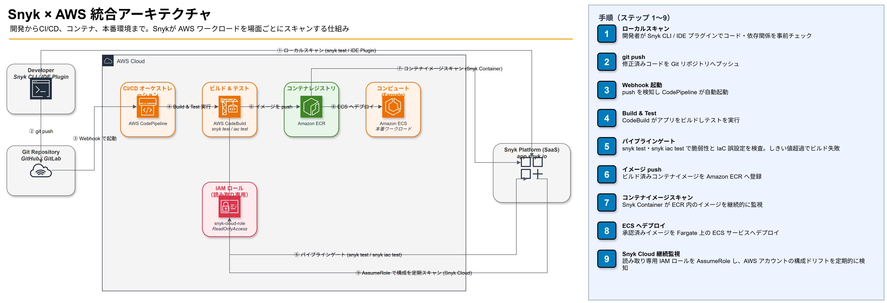

### 押さえておきたい中心概念

- **Shift Left**: 脆弱性は本番環境で見つかるほど修正コストが跳ね上がる。IDE・CLI・PR の時点で検出することで手戻りを最小化する考え方。
- **SCA（Software Composition Analysis）**: 自分では書いていないオープンソースライブラリに潜む既知の脆弱性（CVE）やライセンスリスクを洗い出す手法。Snyk Open Source が担う。
- **SAST（Static Application Security Testing）**: ソースコードを実行せずに静的解析し、インジェクションや認可漏れなどのコーディング上の欠陥を検出する手法。Snyk Code が担う。
- **IaC スキャン**: クラウドリソースをコードとして定義した Terraform / CloudFormation を、実際にデプロイする前に検査し、公開 S3 バケットや過度に開いたセキュリティグループなどの誤設定を防ぐ。
- **CSPM（Cloud Security Posture Management）に近い機能**: Snyk Cloud は IAM ロールを介して AWS アカウントに読み取り専用で接続し、IaC の定義だけでなく「実際に今デプロイされている構成」を継続的に監視する。IaC とライブ環境の差分（ドリフト）を検出できるのが特徴。
- **パイプラインゲート**: CI/CD の中で `snyk test` 等がしきい値超過の脆弱性を検出した場合にビルドを失敗させ、危険な変更が本番へ到達するのを防ぐ仕組み。

### 料金プラン

Snyk は SaaS として提供されており、2026 年時点で **Free / Team / Ignite / Enterprise** の 4 段階のプランがあります。

| プラン | 対象 | 価格 | テスト回数の上限 | 主な追加機能 |
| --- | --- | --- | --- | --- |
| **Free** | 個人・小規模チームでの検証利用 | 無料 | Open Source 200件/月、Code 100件/月、IaC 300件/月、Container 100件/月 | IDE・CLI 統合、基本的な SCA/SAST/IaC/Container スキャン |
| **Team** | 継続的に使う開発チーム | $25〜/貢献開発者/月（年払い） | 制限が大幅に緩和 | Jira 連携、Fix PR 自動作成、翌営業日サポート |
| **Ignite** | 開発者 50 名未満の成長期の組織 | $1,260/貢献開発者/年（月換算 約 $105） | 無制限 | Team 機能に加え、**DAST**（10 ターゲットまで）、カスタムルール、高度なリスク優先順位付け |
| **Enterprise** | 大規模組織 | 個別見積り | 無制限 | Ignite 機能に加え、SSO/RBAC、統一 AppSec ガバナンス、ゼロデイ対策、SLA、SDLC 全体の自動化 |

- 課金単位は「**貢献開発者（contributing developer）**」＝実際にスキャン対象のコードをコミットした開発者数です。閲覧専用メンバーは課金対象になりません。
- Free と Team の違いは主に「回数制限の有無」と「Fix 自動化・Jira 連携などのコラボレーション機能」です。
- Team と Ignite の違いは「DAST の追加」と「無制限テスト」が大きなポイントです。
- Enterprise は機能差というより「組織横断のガバナンス・監査・SLA」が主眼で、機能面は Ignite とほぼ同等です。
- **Snyk Cloud（クラウド環境の継続監視機能、Cloud environments）は Enterprise プラン限定**です。実機で確認したところ、Free プランの Organization では Settings 上に「Cloud environments」の項目自体が表示されません。

本ハンズオンの演習のうち、演習1〜5・演習7は OSS・Code・IaC・Container それぞれ数回ずつのテストしか行わないため **Free プランの範囲内で問題なく完結**します。演習6（Snyk Cloud）のみ Enterprise プラン限定機能のため、Free プランでは概念説明として読み進める形になります。

### アカウント階層（Tenant / Group / Organization）とプロジェクト管理

Snyk の Web UI 左サイドバーには **Tenant / Group / Organization** という3つの階層が並んで表示されます。それぞれの関係は以下のとおりです。

```
Tenant（テナント）
 └─ Group（グループ）
     └─ Organization（組織）
         └─ Project（プロジェクト）
```

- **Tenant**: 階層の最上位。契約している Snyk のすべての Group・Organization・作業内容をひとまとめにする箱。大企業が複数の Group を横断的に管理・レポーティングする際に意味を持つ。
- **Group**: ユーザー基盤全体をまとめる単位。1つの Group の下に複数の Organization を置ける（例: 事業部ごとに Organization を分ける、など）。
- **Organization**: 実際にチームやプロジェクト群を管理する単位。課金プラン、Integrations、ポリシーなどはこの Organization 単位で設定する。CLI 実行時に表示される `Organization:` もこの単位。

個人で無料アカウントを作成した場合、Snyk 側が自動的に「1 Tenant の中に 1 Group、その中に 1 Organization」という最小構成を作り、いずれも同じ名前になる。そのため3つとも同じ名前が並んで表示されるのが正常な状態で、将来チームを増やしたり事業部を分けたりする際に、この階層を使って Group や Organization を追加していく。

Organization の中には **Project**（スキャン対象として登録されたコードベース・イメージ・IaC 定義など）が並ぶ。以下は演習2を終えた時点の Projects 画面の例で、`snyk-lambda-sample` が1件登録されている。

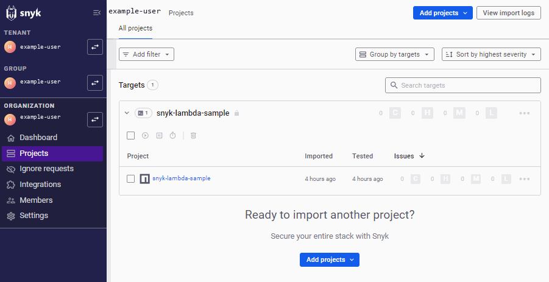

ここで重要なのは、**この Project 登録は `snyk test` ではなく `snyk monitor` の実行によるもの**という点です。

| コマンド | 挙動 |
| --- | --- |
| `snyk test` / `snyk code test` / `snyk iac test` / `snyk container test` | その場限りの検査。結果はターミナルに表示されるだけで、Web UI の Projects には残らない |
| `snyk monitor` | 実行時点の依存関係のスナップショットを Snyk 側にアップロードし、**継続監視の対象となる Project としてダッシュボードに登録**する |

演習2の手順4で `snyk monitor` を実行したことで、この `snyk-lambda-sample` が Project として登録され、以降 `lodash` に新しい脆弱性が公表された際に継続的に検知されるようになっています。

---

## 2. ハンズオンの概要

### 想定環境・所要時間

| 項目 | 内容 |
| --- | --- |
| 想定読者 | AWS の基本操作（S3・Lambda・IAM 等）を触ったことがあり、CLI 操作にも慣れているエンジニア |
| 所要時間の目安 | 2.5〜3 時間 |
| 必要なアカウント | AWS アカウント（無料利用枠で可）、Snyk 無料アカウント（GitHub 等で 2 分程度で登録可能） |
| 事前インストール | Node.js 18 以降、npm、AWS CLI v2、Docker Desktop、Git（Terraform を使う場合は Terraform CLI も） |

### ゴールイメージ

このハンズオンを終えると、以下ができるようになります。

- Snyk CLI をローカル・CI/CD の両方で使い、AWS Lambda 向け Node.js アプリの **依存関係の脆弱性**（Snyk Open Source）と **コード自体の欠陥**（Snyk Code）を検出・修正できる
- Terraform / CloudFormation で書かれた AWS インフラ定義から、公開 S3 バケットや開きすぎたセキュリティグループなどの **誤設定**（Snyk IaC）を CI で未然に防げる
- ECR に登録する **コンテナイメージの脆弱性**（Snyk Container）を検査し、より安全なベースイメージに切り替えられる
- IAM ロールを使って **AWS アカウントを Snyk Cloud に接続**し、デプロイ後もライブ環境の構成ミスを継続的に監視する仕組みを理解できる（Snyk Cloud は Enterprise プラン限定機能のため、本教材では概念説明までとなります）
- GitHub Actions に Snyk を組み込み、**パイプラインゲート**としてセキュリティチェックを自動化できる

### 学べることの全体像

| 演習 | 使う Snyk プロダクト | 学習項目 | 対象の AWS 要素 |
| --- | --- | --- | --- |
| 事前準備 | — | Snyk / AWS アカウント発行、CLI インストール | — |
| 演習1 | 共通 | Snyk CLI の認証と基本操作 | — |
| 演習2 | Snyk Open Source | 依存関係の脆弱性スキャンと修正（`snyk test` / `snyk fix`） | Lambda 用 Node.js コード |
| 演習3 | Snyk Code | 静的解析によるコード欠陥の検出（`snyk code test`） | Lambda 用 Node.js コード |
| 演習4 | Snyk IaC | IaC 誤設定の検出と修正（`snyk iac test`） | Terraform（S3 / セキュリティグループ） |
| 演習5 | Snyk Container | コンテナイメージの脆弱性スキャン（`snyk container test`） | Docker / Amazon ECR |
| 演習6（概念説明） | Snyk Cloud | クラウドアカウント連携とライブ監視の仕組み | IAM ロール、AWS アカウント全体 |
| 演習7（応用） | 横断 | CI/CD パイプラインへの統合 | GitHub Actions |

演習は下図のように、環境構築 → 個別プロダクトの体験 → クラウド連携 → CI/CD 統合という順で難易度を上げながら進みます。

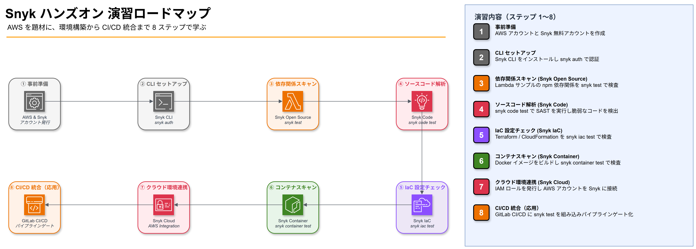

> **注**: 図中の「⑦ クラウド環境連携」（Snyk Cloud）は **Enterprise プラン限定機能**のため、Free プランでは実機操作ができません。演習6は概念説明として読み、実際に手を動かすのは演習1〜5・演習7になります。

---

## 3. ハンズオンの手順

### 事前準備

1. **Snyk アカウントを作成する**
   [snyk.io](https://snyk.io/) にアクセスし、GitHub 等の Git プロバイダでサインアップします（Git 連携でサインアップすると後の統合設定が楽になります）。無料プランで本ハンズオンの全機能を利用できます。

   サインアップを進めると、GitHub の OAuth 認可画面が表示されます。要求されているのはメールアドレスの読み取り専用アクセスのみで、リポジトリへの書き込み権限などは含まれません。内容を確認し「Authorize snyk」を押して進めます。

   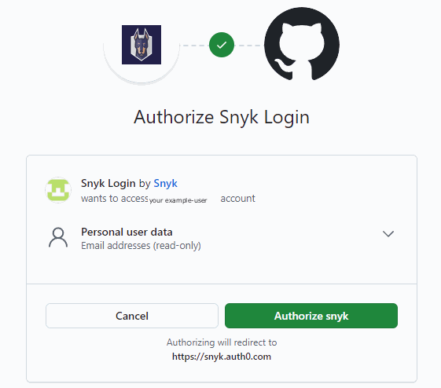

2. **オンボーディングウィザードで CLI を選び、Snyk CLI をインストール・認証する**

   サインアップ直後の「Where is the code you want to scan?」ウィザードは 4 ステップで構成されています。

   1. **Choose integration method**（左上）: GitHub / Bitbucket Cloud / CLI の 3 択。本ハンズオンはローカルでの CLI 実行が中心なので、**CLI** を選択します。GitHub を選ぶと Snyk の GitHub App にリポジトリへのアクセス権限を追加で許可することになり、この段階では不要に権限範囲が広がってしまいます。
   2. **Install Snyk CLI**（右上）: npm / Homebrew / Scoop / 実行ファイル直接ダウンロードのいずれかでインストールします。
   3. **Authenticate your machine**（左下）: `snyk auth` を実行し、ブラウザ経由でこのマシンを Snyk アカウントに紐づけます。
   4. **Scan for security issues**（右下）: スキャン対象のディレクトリに移動したうえで、`snyk monitor --all-projects --org=<組織ID>` のように Organization ID 付きのコマンドが案内されます。この ID は Organization ごとに異なる固有値なので、そのままコピーして使って構いません（下図の ID はマスキング済みのダミー値です）。

   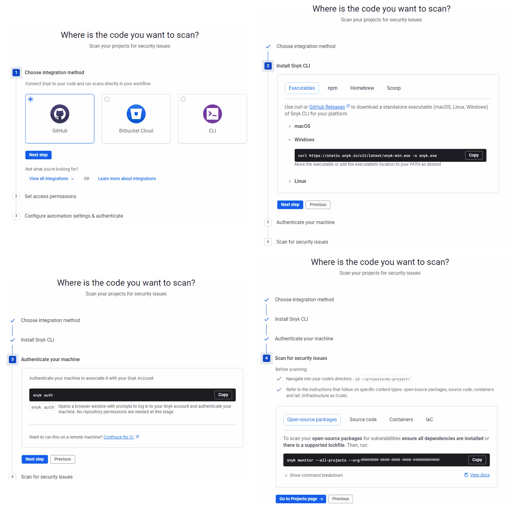

   本ハンズオンではまず基本操作を体験したいので、ウィザードが案内する `snyk monitor`（継続監視への登録）ではなく、次の演習1でまず `snyk auth` と `snyk test`（その場限りのスキャン）から始めます。`snyk monitor` の使い方は演習2で改めて扱います。

   ウィザードを終えると、Organization の Projects ダッシュボード（まだ何もスキャンしていない空の状態）が表示されます。「Monitor deployed apps」「Protect your source code」「Monitor local projects」の 3 つのカードは、それぞれ Git 連携・PR チェック・CLI という異なる取り込み方法への入り口です。本ハンズオンでは一番右の「Monitor local projects」に相当する CLI ベースの使い方を一貫して使います。

   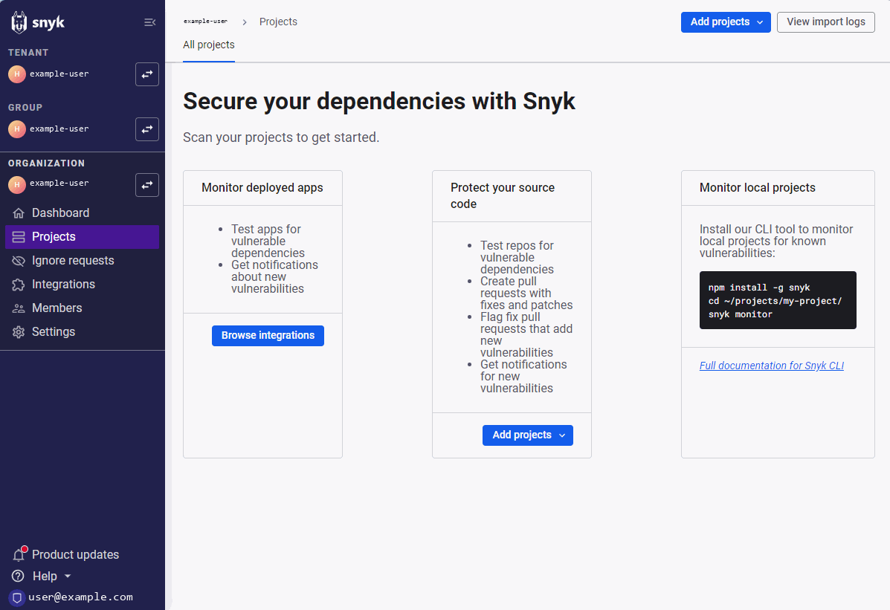

   CLI を npm でインストールする場合は次のようにします。

   ```bash
   npm install -g snyk
   snyk --version
   ```

   npm 以外にも Homebrew（`brew install snyk`）や Scoop（Windows: `scoop install snyk`）でもインストール可能です。

3. **AWS CLI が使える状態にしておく**

   ```bash
   aws sts get-caller-identity
   ```

   自分のアカウント情報が表示されれば OK です。IAM ユーザーには、演習6 で IAM ロール作成用の CloudFormation スタックを実行できる権限（`cloudformation:*`, `iam:CreateRole` 等）が必要です。

4. **Docker Desktop が起動していることを確認する**（演習5 で使用）

5. **作業用ディレクトリを作成する**

   ```bash
   mkdir snyk-aws-handson && cd snyk-aws-handson
   ```

---

### 演習1: Snyk CLI のセットアップと基本操作

**目的**: Snyk CLI をアカウントに紐づけ、最も基本的な `snyk test` の使い方を体験する。

1. CLI をブラウザ経由で認証します。

   ```bash
   snyk auth
   ```

   ブラウザが開き、Snyk へのログイン・CLI 連携の許可を求められます。「Snyk CLI or IDE is requesting access to act on your behalf」という同意画面が表示されるので、アカウントのメールアドレスが正しいことを確認して「Grant app access」を押してください。許可すると、以降 CLI から Snyk アカウントに結果がアップロードできるようになります。

   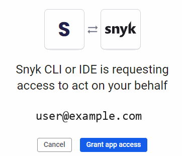

2. 適当な Node.js プロジェクトを初期化し、まずは依存関係が無い状態でテストしてみます。

   ```bash
   npm init -y
   snyk test
   ```

   依存パッケージが無いため「脆弱性は見つかりませんでした」という趣旨のメッセージが表示されます。

✅ **確認ポイント**: `snyk test` がエラーなく完了し、Organization 名やテスト対象が正しく表示されること。

**ここで学んだこと**: Snyk CLI は `snyk auth` でアカウントと紐づけてから使う。`snyk test` はカレントディレクトリのプロジェクトを自動検出してスキャンする。

---

### 演習2: Snyk Open Source — Lambda アプリの依存関係スキャン

**目的**: AWS Lambda 向け Node.js アプリを題材に、オープンソース依存関係の既知脆弱性を検出し、修正する。

1. Lambda ハンドラーを想定した簡単なアプリを作成します。

   `package.json`:

   ```json
   {
     "name": "snyk-lambda-sample",
     "version": "1.0.0",
     "main": "handler.js",
     "dependencies": {
       "lodash": "4.17.15"
     }
   }
   ```

   `handler.js`:

   ```javascript
   const _ = require("lodash");

   exports.handler = async (event) => {
     const merged = _.merge({}, event);
     return {
       statusCode: 200,
       body: JSON.stringify(merged),
     };
   };
   ```

   ```bash
   npm install
   ```

   `lodash@4.17.15` は Prototype Pollution の既知脆弱性（CVE）を含むバージョンです。

2. 依存関係をスキャンします。

   ```bash
   snyk test
   ```

   `lodash` の脆弱性と重大度（Severity）、修正が必要なバージョンが一覧表示されます。実際に実行すると、以下のような出力が得られます。

   ```text
   Testing C:\dev\handson-snyk\handson\snyk-aws-handson...

   Tested 1 dependencies for known issues, found 8 issues, 8 vulnerable paths.


   Issues to fix by upgrading:

     Upgrade lodash@4.17.15 to lodash@4.18.1 to fix
     ✗ Prototype Pollution [Medium Severity][https://security.snyk.io/vuln/SNYK-JS-LODASH-15869619] in lodash@4.17.15
       introduced by lodash@4.17.15
     ✗ Prototype Pollution [Medium Severity][https://security.snyk.io/vuln/SNYK-JS-LODASH-15053838] in lodash@4.17.15
       introduced by lodash@4.17.15
     ✗ Regular Expression Denial of Service (ReDoS) [Medium Severity][https://security.snyk.io/vuln/SNYK-JS-LODASH-1018905] in lodash@4.17.15
       introduced by lodash@4.17.15
     ✗ Arbitrary Code Injection [High Severity][https://security.snyk.io/vuln/SNYK-JS-LODASH-15869625] in lodash@4.17.15
       introduced by lodash@4.17.15
     ✗ Code Injection [High Severity][https://security.snyk.io/vuln/SNYK-JS-LODASH-1040724] in lodash@4.17.15
       introduced by lodash@4.17.15
     ✗ Prototype Pollution [High Severity][https://security.snyk.io/vuln/SNYK-JS-LODASH-567746] in lodash@4.17.15
       introduced by lodash@4.17.15
     ✗ Prototype Pollution [High Severity][https://security.snyk.io/vuln/SNYK-JS-LODASH-608086] in lodash@4.17.15
       introduced by lodash@4.17.15
     ✗ Prototype Pollution [High Severity][https://security.snyk.io/vuln/SNYK-JS-LODASH-6139239] in lodash@4.17.15
       introduced by lodash@4.17.15


   Organization:      your-org-name
   Package manager:   npm
   Target file:       package-lock.json
   Project name:      snyk-lambda-sample
   Open source:       no
   Project path:      C:\dev\handson-snyk\handson\snyk-aws-handson
   Licenses:          enabled
   ```

   この出力から読み取れるポイントは次のとおりです。

   - **1 つの依存パッケージから 8 件の Issue**: `lodash@4.17.15` という単一バージョンの中に、Prototype Pollution（4件）、Arbitrary/Code Injection（2件）、ReDoS（1件）など複数の脆弱性が積み重なっています。同じバージョンに対して過去に複数回セキュリティ修正が入っているライブラリでは珍しくありません。
   - **重大度は Medium と High が混在**: `npm audit` が「1 high severity vulnerability」とだけ要約していたのに対し、Snyk は High 5件（Prototype Pollution 3件、Arbitrary Code Injection・Code Injection 各1件）・Medium 3件（Prototype Pollution 2件、ReDoS 1件）をそれぞれ個別の脆弱性 ID（`SNYK-JS-LODASH-xxxxxxx`）付きで一覧化しており、リンク先で個々の詳細（影響範囲・PoC・CVE番号との対応）を確認できます。
   - **"Upgrade lodash@4.17.15 to lodash@4.18.1 to fix" という1行の結論**: 8 件すべてが `4.18.1` へのアップグレード 1 回で解消することを Snyk が計算済みで教えてくれています。個々の脆弱性を1つずつ調べて対応バージョンを突き合わせる必要はありません。
   - **`Target file: package-lock.json`**: `package.json` ではなくロックファイルを基準に実際にインストールされたバージョンを解析しています。`Organization` 欄には自分の Organization 名が表示されます（本教材では伏せています）。

3. 自動修正を試します（対応していれば）。

   ```bash
   snyk fix
   ```

   `snyk fix` は対応エコシステムであれば推奨バージョンへ自動でアップグレードしてくれるコマンドですが、オープンベータの現時点では **Python（Pip / Pipenv / Poetry）中心の対応**で、npm プロジェクトでは以下のようなエラーになることがあります。

   ```text
    ERROR   Unspecified Error (SNYK-CLI-0000)

              `snyk fix` is not supported.
              See documentation on how to enable this beta feature.
   ```

   これは Snyk の Web UI（Settings > Snyk Preview）でベータ機能を有効化すれば解消するケースもありますが、Organization やプランによってはこの設定項目自体が表示されない場合もあります。**npm プロジェクトでは `snyk fix` に頼らず、指摘されたバージョンへ手動でアップグレードするのが確実です。**

   ```bash
   npm install lodash@4.18.1
   snyk test
   ```

   （なお、GitHub 等と連携した場合に作成される「Fix PR」機能は npm / Yarn / pnpm にも対応していますが、これは Git 連携時の自動プルリクエスト機能であり、ここで使っている CLI の `snyk fix` コマンドとは別物です。）

4. 継続監視に登録します。

   ```bash
   snyk monitor
   ```

   `snyk test` がその場限りの検査なのに対し、`snyk monitor` はスナップショットを Snyk 側に送り、新しい脆弱性が公表された際に通知を受けられるようにします。

✅ **確認ポイント**: 修正後に再度 `snyk test` を実行し、検出された脆弱性が解消されていること。

**ここで学んだこと**: `snyk test` は依存関係ツリー全体を解析し重大度付きで問題を報告する。`snyk fix` で自動修正、`snyk monitor` で継続監視という 2 段構えの使い分けができる。

---

### 演習3: Snyk Code — ソースコードの静的解析（SAST）

**目的**: 依存関係ではなく自分が書いたコードそのものに潜む欠陥を、Snyk Code で検出する。

> **事前準備**: Snyk Code（SAST）は新規 Organization では **デフォルトで無効**になっています。`snyk code test` を実行して `Snyk Code is not enabled (SNYK-CODE-0005)` というエラーが出た場合は、Web UI の **Settings > Snyk Code**（左メニューの「Products and features」内）を開き、「Enable Snyk Code」を Enabled にして「Save changes」を押してから再実行してください（Org Admin 権限が必要です）。
>
> 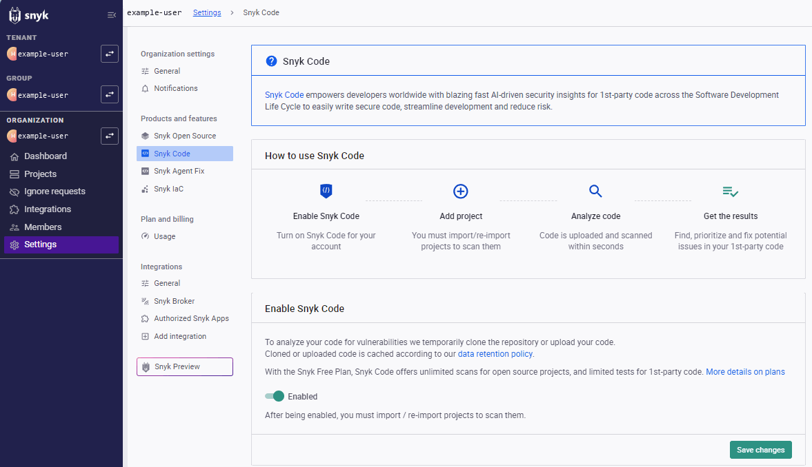

1. `express` を追加インストールします。

   ```bash
   npm install express
   ```

2. 演習2 の `handler.js` に、意図的に脆弱なコードを追加します。

   ```javascript
   const _ = require("lodash");
   const express = require("express");
   const { exec } = require("child_process");

   exports.handler = async (event) => {
     const merged = _.merge({}, event);
     return {
       statusCode: 200,
       body: JSON.stringify(merged),
     };
   };

   // API Gateway 経由で Lambda に Express アプリを載せる構成（serverless-http 等）を
   // 想定したデバッグ用エンドポイント
   const app = express();
   app.get("/debug", (req, res) => {
     // 外部入力をそのままシェルコマンドに連結している（コマンドインジェクション）
     const cmd = `echo ${req.query.name}`;
     exec(cmd, (err, stdout) => {
       res.send(stdout);
     });
   });
   exports.app = app;
   ```

   > **なぜ `event.queryStringParameters.name` ではなく `req.query.name` なのか**: Snyk Code は「どの入力が汚染されたデータ（ソース）か」をフレームワークごとのパターンで判定しています。Express の `req.query` は広く認識されるソースパターンですが、生の AWS Lambda `event` オブジェクトへの直接的なプロパティアクセス（`event.queryStringParameters.name`）は、執筆時点の Snyk Code では認識パターンに合致せず検出されないことが確認されています。実務で Lambda 上に Express アプリを載せる構成（`serverless-http` 等のアダプタを使う）は一般的なパターンでもあるため、本教材ではこちらを採用しています。

3. Snyk Code でスキャンします。

   ```bash
   snyk code test
   ```

   コマンドインジェクションの脆弱性が、該当行番号・データフロー（どこから来た入力がどこで使われているか）付きで報告されます。実際には以下のような出力になります（`node_modules` 内の指摘は自分で書いたコードではないため今回の演習では対象外です）。

   ```text
   Open Issues

    ✗ [MEDIUM] Allocation of Resources Without Limits or Throttling
      Path: handler.js, line 15
      Info: Expensive operation (a system command execution) is performed by an endpoint
      handler which does not use a rate-limiting mechanism. It may enable the attackers to
      perform Denial-of-service attacks. Consider using a rate-limiting middleware such as
      express-limit.

    ✗ [HIGH] Command Injection
      Path: handler.js, line 18
      Info: Unsanitized input from an HTTP parameter flows into child_process.exec, where
      it is used to build a shell command. This may result in a Command Injection
      vulnerability.
   ```

   > **`node_modules` がスキャン対象に混ざる場合**: `node_modules` 配下にもたくさんの `.js` ファイルがあるため、そのままだと `node_modules` 内のライブラリ自身の指摘（自分のコードではないもの、上の出力例では `etag` や `express`、`router` 関連の行）も一緒に出てきます。`handler.js` 側の指摘（Command Injection など）が確認できていれば演習の目的は達成しているので、これらは無視して先に進んで構いません。もし出力を `handler.js` だけに絞りたい場合は、プロジェクト直下に `.snykignore` を作成し `node_modules/` を1行追加する方法がありますが、**CLI のバージョンや環境によっては効かないことが確認されています**。その場合は一時的に `node_modules` をリネーム／移動してからスキャンし、終わったら元に戻すのが最も確実です。

   ```bash
   mv node_modules ../node_modules_backup
   snyk code test
   mv ../node_modules_backup node_modules
   ```

4. 修正します。外部入力を直接シェルコマンドに埋め込まず、`execFile` を使うか入力を検証・エスケープします。

   ```javascript
   const { execFile } = require("child_process");

   app.get("/debug", (req, res) => {
     execFile("echo", [req.query.name], (err, stdout) => {
       res.send(stdout);
     });
   });
   ```

5. 再度 `snyk code test` を実行し、指摘が解消されたことを確認します。

✅ **確認ポイント**: 修正前の実行結果に `handler.js` の行番号付きで「Command Injection」の指摘が含まれ、修正後はその指摘が消えていること。

**ここで学んだこと**: Snyk Code はパッケージではなく自社コードのロジック（データフロー）を解析するため、依存関係スキャンでは見つからないインジェクション系の欠陥を検出できる。

---

### 演習4: Snyk IaC — Terraform の誤設定チェック

**目的**: AWS インフラを定義する Terraform ファイルを、デプロイする前に検査して誤設定を防ぐ。

1. 意図的に誤設定を含む Terraform ファイルを作成します。

   `main.tf`:

   ```hcl
   provider "aws" {
     region = "ap-northeast-1"
   }

   resource "aws_s3_bucket" "data" {
     bucket = "snyk-handson-sample-bucket"
   }

   resource "aws_s3_bucket_acl" "data_acl" {
     bucket = aws_s3_bucket.data.id
     acl    = "public-read"
   }

   resource "aws_security_group" "web" {
     name = "snyk-handson-sg"

     ingress {
       from_port   = 22
       to_port     = 22
       protocol    = "tcp"
       cidr_blocks = ["0.0.0.0/0"]
     }
   }
   ```

2. IaC スキャンを実行します。

   ```bash
   snyk iac test main.tf
   ```

   S3 バケットが公開読み取り可能になっている点、SSH（22 番ポート）が全世界（`0.0.0.0/0`）に開放されている点が、それぞれ重大度付きで報告されます。実際には以下のように、意図した2件（Medium）に加えて、S3のバージョニングやアクセスログ、セキュリティグループの説明未設定といった**ベストプラクティス逸脱（Low）も一緒に検出**されます。

   ```text
   Medium Severity Issues: 2

     [Medium] Security Group allows open ingress
     Path:    input > resource > aws_security_group[web] > ingress
     Resolve: Set `cidr_block` attribute with a more restrictive IP

     [Medium] S3 Bucket is publicly readable
     Path:    input > resource > aws_s3_bucket_acl[data_acl] > acl
     Resolve: Set `acl` attribute to `private`, or remove the attribute

   Low Severity Issues: 4

     [Low] S3 bucket versioning disabled
     [Low] S3 bucket MFA delete control disabled
     [Low] S3 server access logging is disabled
     [Low] Security group description is missing

   Test Summary
     Total issues: 6 [ 0 critical, 0 high, 2 medium, 4 low ]
   ```

   本演習では意図した Medium 2件の解消を確認できれば十分です（Low 4件への対応は任意の発展課題として扱えます）。

3. 指摘に従って修正します。

   ```hcl
   resource "aws_s3_bucket_acl" "data_acl" {
     bucket = aws_s3_bucket.data.id
     acl    = "private"
   }

   resource "aws_security_group" "web" {
     name = "snyk-handson-sg"

     ingress {
       from_port   = 22
       to_port     = 22
       protocol    = "tcp"
       cidr_blocks = ["203.0.113.0/24"] # 自社オフィスの IP レンジ等に限定
     }
   }
   ```

4. 再スキャンして指摘が解消されたことを確認します。

   ```bash
   snyk iac test main.tf
   ```

   CloudFormation を使う場合も `snyk iac test template.yaml` のように同じコマンドでスキャンできます。修正後は以下のように、Medium 重大度の指摘が両方とも解消されます。

   ```text
   Low Severity Issues: 1

     [Low] Security group description is missing
     Path:    resource > aws_security_group[web] > description
     Resolve: Set `description` attribute to meaningful statement

   Test Summary
     Total issues: 1 [ 0 critical, 0 high, 0 medium, 1 low ]
   ```

   意図した Medium 2件（公開S3バケット・無制限セキュリティグループ）が解消され、対応していない Low の「Security group description is missing」だけが残っていれば OK です。

✅ **確認ポイント**: 修正前に「S3 Bucket は公開アクセス可能」「セキュリティグループが無制限に開放」といった指摘が出て、修正後は出なくなること。

**ここで学んだこと**: Snyk IaC は `terraform apply` する前の段階でクラウドの誤設定を検出できるため、実際にリソースを公開してしまう前に問題を潰せる。CloudFormation・Terraform・Kubernetes マニフェストを同じコマンド体系でスキャンできる。

---

### 演習5: Snyk Container — コンテナイメージのスキャンと ECR 連携

**目的**: Docker イメージの脆弱性を検出し、より安全なベースイメージへの切り替えを検討する。

1. 意図的に古いベースイメージを使う `Dockerfile` を作成します。

   ```dockerfile
   FROM node:14

   WORKDIR /app
   COPY package.json .
   RUN npm install
   COPY handler.js .

   CMD ["node", "handler.js"]
   ```

2. イメージをビルドします。

   ```bash
   docker build -t snyk-handson-app:latest .
   ```

3. Snyk Container でスキャンします。

   ```bash
   snyk container test snyk-handson-app:latest --file=Dockerfile
   ```

   OS パッケージ（Debian/Alpine 等）とアプリの依存関係の両方について脆弱性が報告されます。`--file=Dockerfile` を付けることで、より新しく・脆弱性の少ないベースイメージの推奨も表示されます。実際には以下のような出力になります。

   ```text
   Base Image  Vulnerabilities  Severity
   node:14     546              9 critical, 77 high, 76 medium, 384 low

   Recommendations for base image upgrade:

   Major upgrades
   Base Image    Vulnerabilities  Severity
   node:24.19.0  471              3 critical, 21 high, 14 medium, 433 low

   Alternative image types
   Base Image                  Vulnerabilities  Severity
   node:14.21.3-bullseye-slim  239              7 critical, 44 high, 44 medium, 144 low

   Debian 10 is no longer supported by the Debian maintainers. Vulnerability
   detection may be affected by a lack of security updates.
   ```

   `node:14` のベースは Debian 10（buster）ですが、**Debian 10 自体がすでにサポート終了（EOL）**しており、これが大量の脆弱性の主因になっています。アプリ自身の依存関係（`lodash`・`express` 等）は演習2〜3で対応済みのため、この時点では別枠のスキャンで「脆弱性なし」と出るはずです。

4. 推奨に従い、`FROM node:14` を `FROM node:20-slim` のような新しい LTS 系イメージに変更し、再ビルド・再スキャンします。

   ```dockerfile
   FROM node:20-slim
   ```

   ```bash
   docker build -t snyk-handson-app:latest .
   snyk container test snyk-handson-app:latest --file=Dockerfile
   ```

   実際に切り替えると、以下のように大幅に脆弱性件数が減少します。

   ```text
   Base Image    Vulnerabilities  Severity
   node:20-slim  110              3 critical, 8 high, 9 medium, 90 low

   Recommendations for base image upgrade:

   Major upgrades
   Base Image        Vulnerabilities  Severity
   node:26.7.0-slim  76               0 critical, 2 high, 2 medium, 72 low

   Alternative image types
   Base Image                Vulnerabilities  Severity
   node:20.20.2-trixie-slim  101              0 critical, 3 high, 4 medium, 94 low
   node:20.20.2-alpine3.23   15               0 critical, 0 high, 0 medium, 15 low
   ```

   `node:14`（546件）→ `node:20-slim`（110件）で **8割近く削減**できました。さらに Snyk が提案する代替案の中では、`node:20.20.2-alpine3.23`（Alpine Linux ベース）が **15件（Critical/High/Medium すべて0件）** と圧倒的に少なくなっています。Alpine は Debian 系よりも同梱パッケージ数が少なく軽量なため、コンテナの攻撃対象範囲（アタックサーフェス）を小さくする定石としてよく使われます。余裕があれば `FROM node:20-alpine` に変更して、さらに脆弱性が減ることも確認してみてください（Alpine は Debian と C ライブラリの実装が異なる `musl libc` を使うため、まれにネイティブモジュールの動作に差異が出ることがある点には注意してください）。

5. **（任意）Amazon ECR へ登録して継続監視する場合**

   ```bash
   aws ecr create-repository --repository-name snyk-handson-app
   aws ecr get-login-password --region ap-northeast-1 | docker login --username AWS --password-stdin <アカウントID>.dkr.ecr.ap-northeast-1.amazonaws.com
   docker tag snyk-handson-app:latest <アカウントID>.dkr.ecr.ap-northeast-1.amazonaws.com/snyk-handson-app:latest
   docker push <アカウントID>.dkr.ecr.ap-northeast-1.amazonaws.com/snyk-handson-app:latest
   ```

   Snyk の Web UI（Projects > Add project > Amazon ECR）から ECR リポジトリを連携すると、push されたイメージが自動でインポートされ、定期的に再スキャンされるようになります。

✅ **確認ポイント**: ベースイメージ変更前後で `snyk container test` の脆弱性件数が減少していること。

**ここで学んだこと**: `snyk container test` はローカルの Docker イメージだけでなく ECR 上のイメージも対象にでき、ベースイメージの選び方だけで脆弱性件数を大きく減らせるケースが多い。

---

### 演習6（概念説明）: Snyk Cloud — AWS アカウントとの連携（クラウド構成の継続監視）

> **この演習は Free プランでは実際に操作できません。** Snyk Cloud の「Cloud environments」機能は **Enterprise プラン限定**であることが確認されています。Free プランの Organization では Settings の一覧（General / Products and features / Integrations 等）のどこにも「Cloud environments」の項目が表示されません。これは設定ミスではなく仕様です。本節は実機操作ではなく、**仕組みの理解を目的とした概念説明**として読み進めてください（Enterprise プランを利用できる環境であれば、以下の手順がそのまま実機手順として使えます）。

**目的**: IAM ロールを介して AWS アカウントを Snyk に接続し、IaC だけでなく「実際にデプロイされている」クラウド構成の誤設定を継続的に検出する、という Snyk Cloud の仕組みを理解する。

Snyk Cloud（Enterprise プラン）を有効化できる環境では、おおよそ次の流れで AWS アカウントと連携します。

1. Snyk の Web UI で **Organization Settings > Cloud environments** を開き、「Add environment」から AWS を選択する。
2. 表示された手順に従い、Snyk 用の IAM ロールを作成するための CloudFormation テンプレートをダウンロードする。
3. AWS CLI または AWS コンソールでスタックを作成し、読み取り専用の IAM ロールを払い出す。

   ```bash
   aws cloudformation create-stack \
     --stack-name snyk-cloud-integration \
     --template-body file://snyk-role-template.yaml \
     --capabilities CAPABILITY_NAMED_IAM
   ```

   スタックの作成が完了すると、IAM ロールの ARN が出力（Outputs）として得られる。

4. Snyk の Web UI に戻り、「Add AWS Environment」の画面に取得した Role ARN を入力する。「AWS environment successfully added」と表示されれば連携完了。
5. 連携が完了すると、Snyk が数分〜数十分以内にアカウント内のリソースをスキャンし、演習4 で修正する前のような「公開 S3 バケット」「過度に開いたセキュリティグループ」に相当する誤設定があれば Web UI 上のダッシュボードに表示される。

**理解しておきたいポイント**: Snyk IaC が「コード上の定義」を検査するのに対し、Snyk Cloud は「実際にクラウド上で稼働している状態」を読み取り専用ロールで継続的に可視化する。手動変更やコンソールからの直接操作による IaC との構成ドリフトも検出できるのが最大の違い。IaC スキャン（演習4）が「デプロイ前の予防」なのに対し、Snyk Cloud は「デプロイ後の継続監視」を担う、という役割分担で捉えると理解しやすい。

---

### 演習7（応用）: CI/CD パイプラインへの統合（GitLab CI/CD）

**目的**: これまでローカルで手動実行してきた `snyk test` 系コマンドを GitLab CI/CD に組み込み、Merge Request ごとに自動でセキュリティゲートをかける。

> **補足**: Snyk には GitLab.com 向けの「Organization レベル統合」（Web UI からリポジトリを自動インポートし、MR 上に結果を表示する方式）や、GitLab 公式の Snyk CI/CD コンポーネント（GitLab 側のマーケットプレイスから招待制で導入する方式）もありますが、いずれも設定にやや手間がかかります。本演習では、どの環境でも確実に動く **Snyk CLI を GitLab CI/CD ジョブの中で直接実行する方式**を採用します。GitHub Actions 版で使った `snyk/actions` のような専用アクションの代わりに、`npm install -g snyk` で CLI を入れてコマンドを直接叩く形です。

1. このハンズオン専用の、新しい GitLab プロジェクトを作成します。

   > **注意**: 既存の別用途のプロジェクト（社内の別ハンズオンで使ったリポジトリなど）を流用しないでください。無関係なファイルが混ざって履歴が分かりにくくなるほか、誤って既存ファイルを上書き・削除してしまうリスクがあります。

   - GitLab の Web UI で「New project」→「Create blank project」を選択
   - プロジェクト名: `snyk-aws-handson`（教材のフォルダ名と揃えると分かりやすい）
   - Visibility は Private のままで問題ない
   - 「Initialize repository with a README」は**チェックを外す**（ローカルの内容をそのまま push するため、GitLab 側に競合する初期コミットを作らないようにする）
   - 「Create project」

2. これまでの演習で使ってきたローカルの作業フォルダを、作成したプロジェクトに接続します。

   まず `.gitignore` を作成します。`node_modules`（演習2）や Terraform の作業ファイル（演習4）、演習3のトラブルシューティングで作った退避フォルダなど、Git で管理する必要のないものを除外します。

   ```text
   node_modules/
   node_modules_backup/
   .terraform/
   terraform.tfstate
   terraform.tfstate.backup
   *.tfvars
   ```

   > **注意**: `.gitignore` を作る前に `git add` や `git init` を済ませてしまうと、`node_modules` 配下の数百〜千個のファイルがまとめてステージングされてしまうことがあります（`git status` で `new file: node_modules/...` が大量に並ぶ場合はこの状態です）。その場合は `git reset` でステージングを取り消してから、`.gitignore` を作り直して `git add` をやり直してください。

   フォルダがまだ Git リポジトリになっていない場合は初期化し、手順1で作成したプロジェクトをリモートとして登録して push します（リモート URL はプロジェクトページの「Clone」ボタンから取得してください）。

   ```bash
   git init
   git add .gitignore
   git add .
   git status   # node_modules 配下が出てこないことを確認
   git commit -m "Initial commit for Snyk handson"
   git branch -M main
   git remote add origin https://gitlab.com/<グループ名>/snyk-aws-handson.git
   git push -u origin main
   ```

   すでに Git リポジトリ化・`git init` 済みの場合は、`git remote -v` で `origin` の有無を確認し、無ければ `git remote add origin ...` のみ実行してから `add` / `commit` / `push` してください。

3. 作成したプロジェクトの CI/CD 変数に Snyk の API トークンを登録します。

   - Snyk の Web UI で、右上のアカウントメニュー（またはユーザーアイコン）から **Account settings > Personal Access Tokens** を開く
   - 「Generate personal access token (PAT)」の **Name** に分かりやすい名前（例: `gitlab-ci-snyk-handson`）を入力し、必要なら Expiry（有効期限）を設定して「Generate new token」を押す
   - 表示されたトークンをコピーする（この画面を離れると再表示できないので注意）

     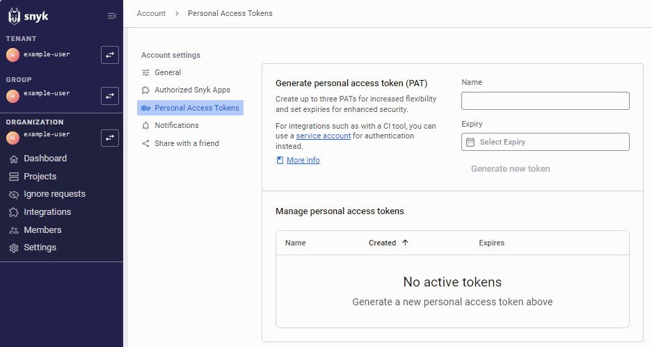

     > 画面にあるとおり、CI ツールとの連携には個人に紐づく Personal Access Token より、Organization 単位で発行できる **Service account** の利用が Snyk 推奨のベストプラクティスです（担当者の退職・アカウント無効化時に CI が止まるリスクを避けられるため）。本演習では学習目的のため PAT のまま進めますが、実務では Service account の利用を検討してください。

   - GitLab 側: **手順1で作成したプロジェクトの** Settings > CI/CD > Variables を開き、「変数を追加」で以下を設定
     - キー: `SNYK_TOKEN`
     - 値: 取得したトークン
     - **保護（Protect variable）はオフ**、**マスクする（Mask variable）はオン** にしておく

   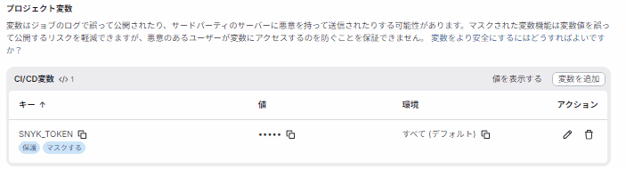

   > **注意1**: デフォルトのまま追加すると上図のように「保護」が有効な状態になっていることがあります。「保護」が有効な変数は **Protected（保護）ブランチ上で実行されるパイプラインにしか渡されません**。この演習では Merge Request（保護されていない feature ブランチ）でパイプラインを動かすため、「保護」が有効なままだと `SNYK_TOKEN` がジョブに渡らず `snyk test` が認証エラーで失敗します。一覧の鉛筆アイコンから編集し、**「保護」のチェックを外して**保存してください。
   >
   > **注意2**: CI/CD 変数は **プロジェクトごとに独立**しています（Group 変数として明示的に継承させない限り、他のプロジェクトには引き継がれません）。手順1で新しいプロジェクトを作った場合は、そのプロジェクト側で改めて `SNYK_TOKEN` を登録する必要があります。

4. リポジトリ直下に `.gitlab-ci.yml` を作成します（このファイル名・配置場所は GitLab が自動検出するデフォルトの決まりです。変更する場合は Settings > CI/CD > General pipelines > CI/CD configuration file で別パスを指定できますが、通常は変更不要です）。

   ```yaml
   stages:
     - security

   snyk_security_scan:
     stage: security
     image: node:20
     rules:
       - if: '$CI_PIPELINE_SOURCE == "merge_request_event"'
     before_script:
       - npm install -g snyk
       - npm install
     script:
       - snyk test --severity-threshold=high
       - snyk iac test main.tf --severity-threshold=high
   ```

   `SNYK_TOKEN` は手順3で登録した CI/CD 変数から自動的に環境変数として渡されるため、`snyk auth` を明示的に実行する必要はありません（Snyk CLI は `SNYK_TOKEN` 環境変数を自動的に読み取ります）。

   > **`stage` と `rules` の役割の違い**: `stage: security` は複数ジョブがある場合の**実行順序のグループ分け**を決めるだけで、「いつパイプラインを走らせるか」には関係ありません（今回はステージが1つしかないため、実質的な意味は薄いです）。「**Merge Request のときだけパイプラインを走らせる**」という挙動を決めているのは `rules: if: $CI_PIPELINE_SOURCE == "merge_request_event"` の方です。この `rules` を書かないと、ブランチへの push のたびにパイプラインが走るだけでなく、MR を開いた際に同じ内容のパイプラインが重複して実行されてしまうことがあります。

   > **発展1: `snyk code test` も追加する場合**: 同様に `script` に1行追加すれば OK ですが、演習3のトラブルシューティングで判明したとおり `node_modules` が存在する状態だと大量のファイルが混ざる可能性があります。SAST は `node_modules` のインストールを必要としないため、**`npm install` より前に実行する**よう順序を入れ替えるのが安全です。
   >
   > ```yaml
   > script:
   >   - snyk code test --severity-threshold=high
   >   - npm install
   >   - snyk test --severity-threshold=high
   >   - snyk iac test main.tf --severity-threshold=high
   > ```
   >
   > **発展2: SBOM（Software Bill of Materials）を出力する場合**: `snyk sbom` コマンドで CycloneDX / SPDX 形式の部品表を生成できます。パイプラインに追加し `artifacts:` で保存すれば、ビルドのたびにSBOMを自動生成・保管できます。
   >
   > ```yaml
   > script:
   >   - snyk sbom --format=cyclonedx1.4+json > sbom.json
   > artifacts:
   >   paths:
   >     - sbom.json
   > ```

5. ブランチを切って `git push` し、Merge Request を作成します。GitLab の **CI/CD > Pipelines**（または MR 画面のパイプライン状況）で `snyk_security_scan` ジョブが自動実行されることを確認します。

   ```bash
   git checkout -b snyk-ci-demo
   git add .gitlab-ci.yml
   git commit -m "Add Snyk CI/CD pipeline gate"
   git push -u origin snyk-ci-demo
   ```

   push すると GitLab がマージリクエスト作成用のリンクを表示するので、それを開いて Merge Request を作成します。作成すると同時にパイプラインが自動的に走り始めます。ジョブが実行されたことは、MR 画面の **「変更」タブではなく「パイプライン」タブ**（またはパイプライン番号のリンク）から確認できます。`rules` の条件に一致しないとジョブ自体がスキップされたまま「パイプライン成功」と表示されてしまうことがあるため、必ずジョブ一覧に `snyk_security_scan` が実行済みとして表示されているかまで確認してください。

   意図した脆弱性がすでに修正済みの状態（演習2・4を完了済み）で push すると、ジョブは以下のように成功します。

   ```text
   $ snyk test --severity-threshold=high
   Testing /builds/<group>/snyk-aws-handson...

   Organization:      <org>
   Package manager:   npm
   Target file:       package-lock.json
   Project name:      snyk-lambda-sample
   Open source:       no
   Project path:      /builds/<group>/snyk-aws-handson
   Licenses:          enabled
   ✔ Tested 67 dependencies for known issues, no vulnerable paths found.
   $ snyk iac test main.tf --severity-threshold=high
   Snyk Infrastructure as Code
   - Snyk testing Infrastructure as Code configuration issues.
   ✔ Test completed.

   Issues
     No vulnerable paths were found!

   Test Summary
     Files without issues: 1
     Files with issues: 0
     Total issues: 0 [ 0 critical, 0 high, 0 medium, 0 low ]

   Job succeeded
   ```

6. 高重大度の脆弱性が見つかるようにわざと `lodash` のバージョンを古いものに戻すなどして push し、パイプラインが **失敗（赤）** になることを確認します。これが「パイプラインゲート」の動作です。

   > **手順5のMRはまだマージしないでください。** ここではブランチ名を指定せず `git push` するため、開いたままの Merge Request に新しいコミットが追加され、同じパイプラインが再実行される形になります。先にマージしてしまうと（「ソースブランチを削除」がオンだと特に）ブランチごと削除され、続けてpushできなくなります。

   ```bash
   npm install lodash@4.17.15
   git add package.json package-lock.json
   git commit -m "Intentionally downgrade lodash to trigger pipeline gate"
   git push
   ```

   同じ Merge Request のパイプラインが再実行され、`snyk test --severity-threshold=high` が High 重大度の脆弱性（Arbitrary Code Injection 等）を検出してジョブが失敗（赤）になることを確認してください。

   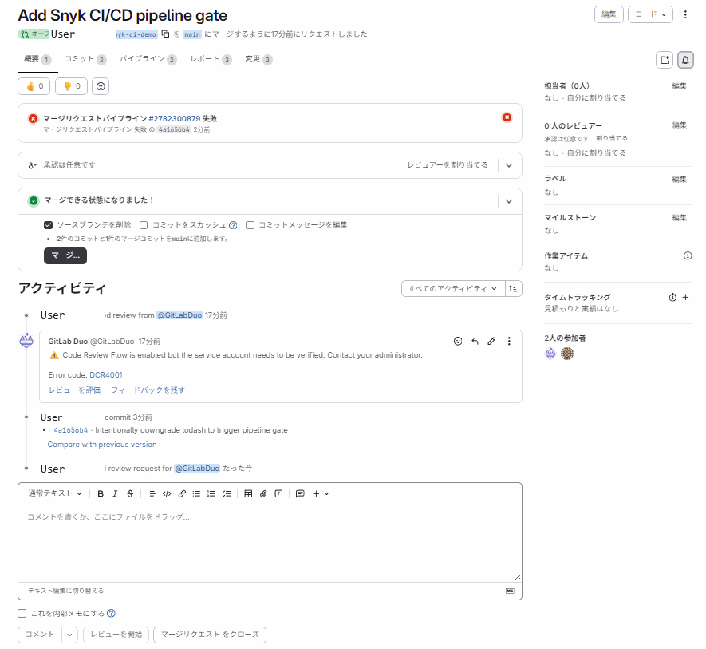

   上図のように、パイプラインが失敗していても「マージできる状態になりました！」と表示され、マージボタン自体は有効なままになっていることがあります。これは次の補足で説明する「Merge checks」の設定次第です。確認できたら、`npm install lodash@4.18.1` で元のバージョンに戻し、再度 push してパイプラインが成功に戻ることも確認しておくと理解が深まります。

   > **補足（真の「ゲート」にするために）**: デフォルト設定では、パイプラインが失敗していても GitLab 上で手動マージ自体はできてしまう場合があります。失敗を確実にマージ阻止につなげるには、プロジェクトの **Settings > Merge requests > Merge checks** で「Pipelines must succeed（パイプラインが成功しなければならない）」を有効にしてください。有効化すると、パイプラインが失敗している間は「マージ」ボタンが無効化され、文字どおりの「ゲート」として機能します。

✅ **確認ポイント**: 脆弱性が無い状態ではパイプラインが成功（緑のチェックマーク）、意図的に脆弱性を混入させると失敗（赤の✗）になること。

**ここで学んだこと**: `--severity-threshold` のようなオプションでゲートの厳しさを調整できる。GitLab CI/CD では専用アプリを使わなくても、CLI をジョブ内にインストールして直接実行するだけでパイプラインゲートを実現できる。ローカルでの `snyk test` と CI での自動実行を組み合わせることで、「開発者が気づく」と「チームとして防ぐ」の二重の防御線を作れる。

---

## 4. 習得事項のまとめ

### 触れた要素一覧

| カテゴリ | 触れた要素 |
| --- | --- |
| Snyk CLI コマンド | `snyk auth`, `snyk test`, `snyk monitor`, `snyk fix`, `snyk code test`, `snyk iac test`, `snyk container test` |
| Snyk プロダクト | Snyk Open Source, Snyk Code, Snyk IaC, Snyk Container（いずれも実機操作）, Snyk Cloud（概念説明のみ、Enterprise プラン限定のため） |
| AWS サービス | Lambda（想定コード）, S3, EC2 セキュリティグループ, ECR, ECS, IAM, CloudFormation |
| IaC ツール | Terraform（CloudFormation も同じ考え方で対応可） |
| CI/CD | GitLab CI/CD（`.gitlab-ci.yml` 内で Snyk CLI を直接実行） |

### つまずきやすいポイント

| 症状 | 原因 | 対処 |
| --- | --- | --- |
| `snyk test` が「Authentication error」で失敗する | `snyk auth` が未実行、またはトークンが失効している | `snyk auth` を再実行するか、`SNYK_TOKEN` 環境変数を設定し直す |
| `snyk code test` が `SNYK-CODE-0005 / Snyk Code is not enabled` で失敗する | 新規 Organization では Snyk Code がデフォルト無効 | Web UI の Settings > Snyk Code で「Enable Snyk Code」を Enabled にし Save changes（Org Admin 権限が必要） |
| `snyk code test` は成功するが明らかに脆弱なコードでも `Total issues: 0` になる | ①`node_modules` の大量のファイルがスキャン対象に混ざり本来のファイルが埋もれている、②AWS Lambda の生の `event` オブジェクトへのプロパティアクセスなど、Snyk Code が汚染データの入力元として認識しないパターンを使っている | `-d` オプション（`snyk code test -d`）でデバッグログを見て `files: N` のファイル数を確認する。数百〜数千件あれば `node_modules` が混入している可能性が高い。それでも 0 件のままなら、Express の `req.query` のような広く認識されるソースパターンに書き換えて切り分ける |
| `snyk code test` の結果に `node_modules` 配下のライブラリ自身の指摘が混ざる | `.snykignore` を作成しても、CLI のバージョン・環境によっては `node_modules` が除外されないことがある（実機で再現確認済み） | 自分のファイル（例: `handler.js`）の指摘だけ確認できていれば無視してよい。出力を絞りたい場合は `mv node_modules ../node_modules_backup` で一時退避してから `snyk code test` を実行し、終わったら `mv` で元に戻す |
| `snyk fix` が `SNYK-CLI-0000 / not supported` で失敗する | `snyk fix` はオープンベータで、現時点では Python（Pip/Pipenv/Poetry）中心の対応。npm 等では未対応の場合がある | npm プロジェクトでは `snyk fix` に頼らず、`npm install <package>@<fixed-version>` 等で手動アップグレードする。Web UI の Settings > Snyk Preview に関連トグルがあれば試してもよいが、Organization によっては表示されないこともある |
| `snyk iac test` が対象ファイルを認識しない | ファイル拡張子や配置パスが対象外、あるいは構文エラーがある | `.tf` / `.yaml` / `.json` など対応拡張子か確認し、`terraform validate` 等で構文エラーを先に潰す |
| `snyk container test` の実行が遅い／失敗する | Docker デーモンが起動していない、イメージが未ビルド | Docker Desktop の起動を確認し、`docker images` でイメージの存在を確認 |
| Settings に「Cloud environments」の項目が見当たらない | Snyk Cloud は Enterprise プラン限定機能で、Free/Team/Ignite プランでは項目自体が表示されない（実機で確認済み） | 設定ミスではないので探し続ける必要はない。演習6は概念説明として読み、実機操作が必要なら Enterprise プランへのアップグレードまたは Snyk 営業への問い合わせを検討する |
| （Enterprise プラン利用時）Snyk Cloud に AWS アカウントを追加しても Issues が出ない | IAM ロールの権限不足、またはスキャンが完了していない | ロールに付与したポリシーを確認し、初回スキャンは数十分かかる場合があるためしばらく待つ |
| CI 上で `SNYK_TOKEN が見つからない` | Secrets 未登録、もしくは Fork からの PR で Secrets が渡らない | リポジトリの Secrets 設定を確認し、Fork PR の場合は `pull_request_target` 等の代替トリガーを検討 |
| `git status` で `node_modules/` 配下が大量に `new file` として表示される | `.gitignore` を作る前に `git add` / `git init` してしまった | `git reset` でステージングを取り消し、`.gitignore` に `node_modules/` を追加してから `git add` をやり直す |
| GitLab の CI/CD 変数を追加したのにジョブが認証エラーになる | 変数の「保護（Protect）」が有効なままで、保護されていないブランチ（feature ブランチ等）のパイプラインに値が渡っていない | 変数を編集し「保護」のチェックを外す |

### 応用・発展

- **ポリシー管理**: Organization 単位で無視ルール（`.snyk` ファイルや Ignore ポリシー）を設定し、既知だが対応不要な指摘をノイズとして除外できる。
- **SBOM 出力**: `snyk sbom` コマンドでソフトウェア部品表（SBOM）を CycloneDX / SPDX 形式で出力し、サプライチェーンの可視化に活用できる。
- **通知連携**: Slack や Jira と連携し、検出された高重大度の脆弱性を自動でチケット化・通知できる。
- **マルチクラウド展開**: 本ハンズオンは AWS を題材にしたが、Snyk Cloud は Azure・GCP にも同様の考え方で接続できる。

---

## 5. 今後の学習ロードマップ

1. **カスタムポリシーとガバナンス**: Organization / Group 単位でのセキュリティポリシー設計、Ignore ルールの承認フロー、複数チームでの権限管理を学ぶ。
2. **Kubernetes 運用への展開**: `snyk-operator` や `snyk-monitor` を使い、稼働中の Kubernetes クラスタ上のワークロードを継続的に監視する方法を学ぶ。
3. **サプライチェーンセキュリティの強化**: SBOM 生成・Snyk Broker を使ったオンプレミス／プライベートリポジトリとの安全な連携を学ぶ。
4. **他クラウドへの展開**: Azure・GCP に対する Snyk Cloud 連携を試し、マルチクラウド環境でのポリシー統一を学ぶ。

### 参考リンク

- [Snyk 公式ドキュメント トップ](https://docs.snyk.io/)
- [What's Snyk?（製品概要）](https://docs.snyk.io/whats-snyk)
- [Snyk Plans and Pricing（料金プラン公式ページ）](https://snyk.io/plans/)
- [Getting started with the Snyk CLI](https://docs.snyk.io/developer-tools/snyk-cli/getting-started-with-the-snyk-cli)
- [CLI commands and options summary](https://docs.snyk.io/developer-tools/snyk-cli/cli-commands-and-options-summary)
- [Snyk IaC — Terraform files](https://docs.snyk.io/developer-tools/snyk-cli/scan-and-maintain-projects-using-the-cli/snyk-cli-for-iac/test-your-iac-files/terraform-files)
- [Snyk IaC — CloudFormation files](https://docs.snyk.io/developer-tools/snyk-cli/scan-and-maintain-projects-using-the-cli/snyk-cli-for-iac/test-your-iac-files/cloudformation-files)
- [Amazon ECR との連携（Snyk Container）](https://docs.snyk.io/scan-with-snyk/snyk-container/container-registry-integrations/integrate-with-amazon-elastic-container-registry-ecr)
- [AWS integration（Snyk Cloud）](https://docs.snyk.io/scan-with-snyk/snyk-iac/cloud-platform-integrations/aws-integration)
- [Snyk Learn — CLI と Open Source のトレーニング](https://learn.snyk.io/lesson/snyk-cli/)
