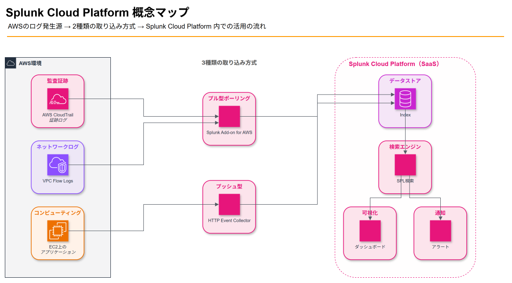
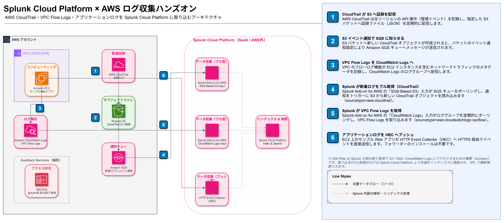
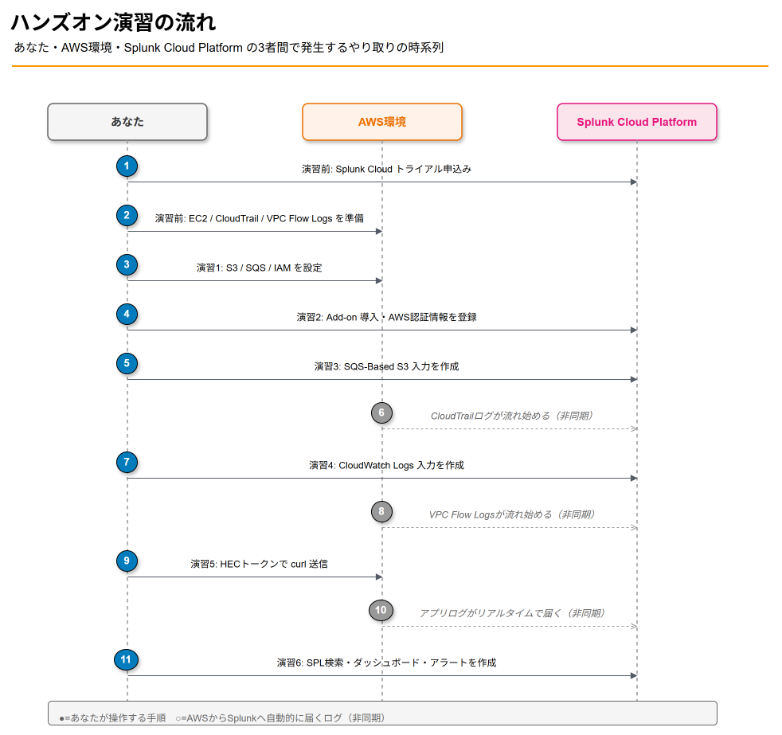
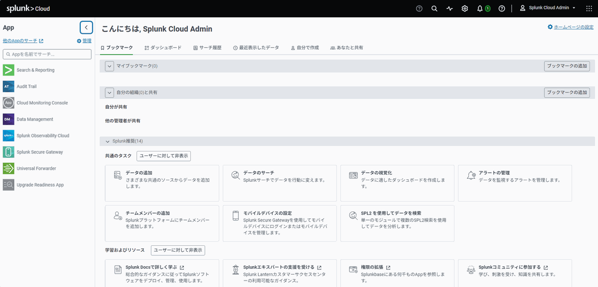
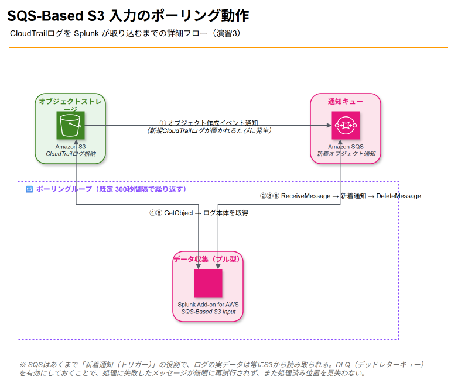

# Splunk Cloud Platform ハンズオン — AWSのログをSplunkに集約して横断検索できるようになる

## 1. 勉強対象の概要

### Splunkとは何か

**Splunk**は「あらゆるマシンデータ（ログ、イベント、メトリクス）を取り込み、検索・可視化・監視・分析する」ためのプラットフォームです。もともとはオンプレミス／自社ホスティング型の **Splunk Enterprise** として広まりましたが、現在はSplunk社（2024年よりCisco傘下）がインフラ運用を肩代わりするSaaS版 **Splunk Cloud Platform** が主力製品になっています。

本教材では、Splunk CloudのSaaSとしての特徴（サインアップするだけで使える／インデクサやサーチヘッドの面倒を見なくてよい）を活かし、**AWS環境から出るログをSplunk Cloud Platformに取り込んで検索できるようになること**をゴールにします。

### 押さえるべき中心概念

| 概念 | 説明 |
|---|---|
| **Index（インデックス）** | 取り込んだデータの保存先。用途ごとに分けるのが一般的（例: `aws_cloudtrail`, `aws_vpcflow`, `app_logs`） |
| **Sourcetype（ソースタイプ）** | データの形式・意味づけを表すラベル。フィールド抽出やタイムスタンプ解釈のルールが紐づく（例: `aws:cloudtrail`, `aws:cloudwatchlogs:vpcflow`） |
| **SPL（Search Processing Language）** | Splunkの検索言語。`index=... sourcetype=... | stats ... | timechart ...` のようにパイプでコマンドをつなぐ |
| **データ入力（Input）の3種類** | ① Universal Forwarder（エージェントで転送）、② Add-on（クラウドAPIをポーリングして取り込む）、③ HTTP Event Collector（HEC、アプリからHTTPSでプッシュ） |
| **App / Add-on** | Splunkの機能拡張パッケージ。AWS向けには「Splunk Add-on for Amazon Web Services」がAWS各サービスの入力設定UIを提供する |
| **データパイプライン** | Input → Parsing（フィールド抽出・タイムスタンプ判定）→ Indexing（保存）→ Search（SPLでの検索・可視化）という4段階で処理される |

### 全体像（概念マップ）



AWS環境のログ発生源が2種類の取り込み方式（プル型のAdd-on／プッシュ型のHEC）を経由してSplunk Cloud Platformのインデックスに集約され、SPL検索からダッシュボードとアラートにつながる全体像を図示しています。編集可能な元データは [`outputs/diagrams/splunk-concept-overview.drawio`](diagrams/splunk-concept-overview.drawio) です。

Splunkエコシステムには他にも、機械学習向けの Splunk ML Toolkit、セキュリティ運用に特化した Splunk Enterprise Security（ES）、IT運用監視の Splunk ITSI などがありますが、これらはすべて「取り込んだログをどう活用するか」の応用レイヤーです。まずは本教材で **取り込み（Input）から検索（Search）までの基本の型** を身につけます。

---

## 2. ハンズオンの概要

### 想定環境・所要時間

| 項目 | 内容 |
|---|---|
| 想定読者 | AWSの基本操作（EC2/S3/IAM/CloudTrail）に触れたことがある人。Splunkは未経験でOK |
| 必要なアカウント | AWSアカウント（個人検証用でOK）、Splunk Cloud Platform 無料トライアル（14日間・5GB/日・クレジットカード不要） |
| 想定コスト | AWS側はt3.micro EC2 1台＋S3/SQS/CloudWatch Logsの少量利用（無料枠でほぼ収まる） |
| 所要時間の目安 | 約2.5〜3時間 |
| 実行環境 | ブラウザ（Splunk Web / AWSマネジメントコンソール）+ ローカル端末のターミナル（AWS CLI, curlが使えること） |

### ゴールイメージ

このハンズオンを終えると、次の状態になっています。

- AWSアカウントの **CloudTrail（管理イベント）** と **VPC Flow Logs** が、Splunk Add-on for AWSを通じてSplunk Cloud Platformに自動的に取り込まれ続けている
- EC2上のサンプルアプリケーションが生成したログを **HTTP Event Collector（HEC）** 経由でリアルタイムにSplunkへ送信できている
- SPLを使って「いつ・誰が・どのAPIを・どこから呼んだか」「どの通信が拒否されたか」「アプリでどんなエラーが起きたか」を **横断的に検索** できる
- 簡単な **ダッシュボード** と **アラート（しきい値超過で通知）** を自分で作成できる

### アーキテクチャ

以下の構成でログを取り込みます。draw.io形式の詳細図を用意しています。



AWSアカウント境界とSplunk Cloud Platform（SaaS）境界を分け、①CloudTrail→S3、②S3→SQS通知、③EC2→VPC Flow Logs、④⑤Splunkのプル型ポーリング、⑥HECへのプッシュ、という6ステップのデータフローを番号付きで示しています（右側に凡例パネル付き）。編集可能な元データは [`outputs/diagrams/splunk-aws-architecture.drawio`](diagrams/splunk-aws-architecture.drawio) です。

### 学べることの全体像

| 演習 | 学習項目 | 使う主なAWS/Splunk機能 |
|---|---|---|
| 準備 | Splunk Cloud試用開始、AWS検証環境の作成 | Splunk Cloud Platform、EC2、IAM |
| 演習1 | AWS側でログ発生源を構成する | CloudTrail、S3、SQS、VPC Flow Logs |
| 演習2 | Splunk Add-on for AWSの導入とAWS認証情報の登録 | Splunkbase、IAMアクセスキー |
| 演習3 | CloudTrailをSQS-Based S3入力で取り込む | SQSポーリング、`aws:cloudtrail` |
| 演習4 | VPC Flow LogsをCloudWatch Logs入力で取り込む | `aws:cloudwatchlogs:vpcflow` |
| 演習5 | アプリケーションログをHECでプッシュ送信する | HTTP Event Collector、curl |
| 演習6 | SPLで横断検索・ダッシュボード・アラートを作る | SPL、`stats`/`timechart`、Alert |

### 演習の流れ



あなた・AWS環境・Splunk Cloud Platformの3者間で発生するやり取りを、実施順に11ステップの時系列（ライフライン形式）で図示しています。⑥⑧⑩は非同期でログが自動的に届くステップです。編集可能な元データは [`outputs/diagrams/exercise-flow.drawio`](diagrams/exercise-flow.drawio) です。

---

## 3. ハンズオンの手順

### 演習0: 事前準備

**目的**: Splunk CloudのトライアルとAWS側の検証用リソース（EC2）を用意する。

#### 0-1. Splunk Cloud Platformの無料トライアルに申し込む

1. [Splunk Cloud Platform Free Trial](https://www.splunk.com/en_us/download/o11y-cloud-free-trial.html) にアクセスし、居住地に近いリージョン（米国／欧州／APAC(日本/オーストラリア)）を選択
2. 氏名・メールアドレスなど必要事項を入力（クレジットカード不要）
3. 届いたメールのリンクからログインし、管理者ユーザーとしてOrg（テナント）を初期設定する
   - 5GB/日までのデータ取り込みが14日間無料
   - メールが10分以内に届かない場合は迷惑メールフォルダを確認

> 📌 **本教材でのスタック情報**（以降のコマンド例では下記のようなプレースホルダーで表記しています）
> - Splunk Cloud Platform URL: `https://<your-stack>.splunkcloud.com`
> - ユーザー名: `<admin-username>`
> - ご自身の環境で試す場合は、上記を届いたメール記載のスタック名・ユーザー名に置き換えてください。

✅ **確認ポイント**: ログイン後、以下のようなSplunk Webのホーム画面が表示されればOK。



#### 0-2. AWS側の検証用EC2インスタンスを作成する

```bash
# VPC/サブネットはデフォルトVPCでOK。SSH(22)のみ自分のIPから許可するセキュリティグループを使う
aws ec2 run-instances \
  --image-id ami-0c101f26f147fa7fd \
  --instance-type t3.micro \
  --key-name <your-key-pair> \
  --security-group-ids <your-sg-id> \
  --subnet-id <your-subnet-id> \
  --tag-specifications 'ResourceType=instance,Tags=[{Key=Name,Value=splunk-handson-app}]'
```

✅ **確認ポイント**: `aws ec2 describe-instances` でインスタンスが `running` になっていること。

> 💡 AMI IDはリージョンによって異なります。最新のAmazon Linux 2023 AMIをご自身のリージョンで確認してください。

**ここで学んだこと**: Splunk Cloudはインストール作業が不要で、サインアップするだけで使い始められる（SaaSであることのメリット）。

---

### 演習1: AWS側でログ発生源を構成する

**目的**: CloudTrail・S3・SQS・VPC Flow Logsを設定し、「Splunkに取り込ませるログ」をAWS側で用意する。

#### 1-1. S3バケットとCloudTrail証跡を作成する

```bash
BUCKET=splunk-handson-cloudtrail-$(aws sts get-caller-identity --query Account --output text)
aws s3 mb s3://$BUCKET

# CloudTrailがS3へ書き込めるようバケットポリシーを付与
cat > bucket-policy.json <<EOF
{
  "Version": "2012-10-17",
  "Statement": [
    {
      "Sid": "AWSCloudTrailAclCheck",
      "Effect": "Allow",
      "Principal": {"Service": "cloudtrail.amazonaws.com"},
      "Action": "s3:GetBucketAcl",
      "Resource": "arn:aws:s3:::$BUCKET"
    },
    {
      "Sid": "AWSCloudTrailWrite",
      "Effect": "Allow",
      "Principal": {"Service": "cloudtrail.amazonaws.com"},
      "Action": "s3:PutObject",
      "Resource": "arn:aws:s3:::$BUCKET/AWSLogs/*",
      "Condition": {"StringEquals": {"s3:x-amz-acl": "bucket-owner-full-control"}}
    }
  ]
}
EOF
aws s3api put-bucket-policy --bucket $BUCKET --policy file://bucket-policy.json

aws cloudtrail create-trail --name splunk-handson-trail --s3-bucket-name $BUCKET
aws cloudtrail start-logging --name splunk-handson-trail
```

#### 1-2. SQSキュー（本体＋DLQ）を作成し、S3のイベント通知を設定する

```bash
# デッドレターキュー（Splunk側が最後に処理した位置を追跡するために必須）
aws sqs create-queue --queue-name splunk-handson-cloudtrail-dlq
DLQ_ARN=$(aws sqs get-queue-attributes --queue-url <dlq-url> --attribute-names QueueArn --query Attributes.QueueArn --output text)

# 本体キュー（RedrivePolicyでDLQに接続、可視性タイムアウトは5分以上を推奨）
aws sqs create-queue --queue-name splunk-handson-cloudtrail-queue \
  --attributes VisibilityTimeout=300,RedrivePolicy="{\"deadLetterTargetArn\":\"$DLQ_ARN\",\"maxReceiveCount\":\"5\"}"

# S3からのメッセージ送信を許可するキューポリシー
QUEUE_ARN=$(aws sqs get-queue-attributes --queue-url <queue-url> --attribute-names QueueArn --query Attributes.QueueArn --output text)
cat > queue-policy.json <<EOF
{
  "Version": "2012-10-17",
  "Statement": [{
    "Effect": "Allow",
    "Principal": {"Service": "s3.amazonaws.com"},
    "Action": "sqs:SendMessage",
    "Resource": "$QUEUE_ARN",
    "Condition": {"ArnLike": {"aws:SourceArn": "arn:aws:s3:::$BUCKET"}}
  }]
}
EOF
aws sqs set-queue-attributes --queue-url <queue-url> --attributes Policy="$(cat queue-policy.json)"

# S3バケットのイベント通知設定（オブジェクト作成イベント→SQS）
aws s3api put-bucket-notification-configuration --bucket $BUCKET --notification-configuration '{
  "QueueConfigurations": [{
    "QueueArn": "'"$QUEUE_ARN"'",
    "Events": ["s3:ObjectCreated:*"]
  }]
}'
```

✅ **確認ポイント**: S3バケットに数分待ってCloudTrailログが `AWSLogs/.../CloudTrail/` 配下に生成され、SQSキューの `ApproximateNumberOfMessages` が一時的に増えることを確認する。

#### 1-3. VPC Flow LogsをCloudWatch Logsへ配信する

```bash
aws logs create-log-group --log-group-name /vpc/flowlogs/splunk-handson

aws ec2 create-flow-logs \
  --resource-type VPC \
  --resource-ids <your-vpc-id> \
  --traffic-type ALL \
  --log-destination-type cloud-watch-logs \
  --log-group-name /vpc/flowlogs/splunk-handson \
  --deliver-logs-permission-arn arn:aws:iam::<account-id>:role/flowlogsRole
```

> 💡 `deliver-logs-permission-arn` にはVPC Flow LogsサービスがCloudWatch Logsへ書き込むためのIAMロール（信頼ポリシーのPrincipalが `vpc-flow-logs.amazonaws.com`）が必要です。未作成の場合はAWSマネジメントコンソールの「VPC > フローログの作成」からウィザードで自動作成すると簡単です。

#### 1-4. Splunk用の読み取り専用IAMユーザーを作成する

Splunk Cloud PlatformからAWSを読み取るための最小権限ポリシーを作成します。

```json
{
  "Version": "2012-10-17",
  "Statement": [
    {
      "Sid": "S3ReadForCloudTrail",
      "Effect": "Allow",
      "Action": ["s3:GetObject", "s3:GetBucketLocation", "s3:ListBucket"],
      "Resource": ["arn:aws:s3:::splunk-handson-cloudtrail-*", "arn:aws:s3:::splunk-handson-cloudtrail-*/*"]
    },
    {
      "Sid": "SQSForCloudTrailNotification",
      "Effect": "Allow",
      "Action": [
        "sqs:GetQueueUrl", "sqs:ReceiveMessage", "sqs:DeleteMessage",
        "sqs:ChangeMessageVisibility", "sqs:GetQueueAttributes", "sqs:ListQueues"
      ],
      "Resource": "arn:aws:sqs:*:*:splunk-handson-cloudtrail-*"
    },
    {
      "Sid": "CloudWatchLogsForVpcFlow",
      "Effect": "Allow",
      "Action": ["logs:DescribeLogGroups", "logs:DescribeLogStreams", "logs:GetLogEvents"],
      "Resource": "*"
    }
  ]
}
```

```bash
aws iam create-user --user-name splunk-handson-reader
aws iam put-user-policy --user-name splunk-handson-reader --policy-name SplunkReadOnly --policy-document file://splunk-readonly-policy.json
aws iam create-access-key --user-name splunk-handson-reader
# 出力される AccessKeyId / SecretAccessKey を控えておく（演習2で使用）
```

✅ **確認ポイント**: `aws iam get-user-policy` で作成したユーザーとポリシーが紐づいていること。アクセスキーはSplunk Cloud側にしか使わないので、他に流出させないよう注意。

**ここで学んだこと**: Splunkは「AWS内部にエージェントを置かず」「SQS通知＋S3読み取り」「CloudWatch Logsポーリング」というプル型の仕組みでAWSからログを収集できる。この仕組みには最小権限のIAMユーザー/ロールが必須。

---

### 演習2: Splunk Add-on for AWSの導入とAWS認証情報の登録

**目的**: Splunk Cloud PlatformにAWS取り込み用のアドオンを入れ、演習1で作ったIAMアクセスキーを登録する。

1. Splunk Webにログイン → **Apps > Splunkbaseで検索** を開く
2. 「**Splunk Add-on for Amazon Web Services**」を検索してインストール（Splunk Cloud Platformでは自己サービスインストールが可能な場合が多いですが、環境によっては管理者による承認が必要な場合があります）
3. インストール後、アドオンを開き **Configuration > Account** タブへ移動
4. **Add** をクリックし、以下を入力
   - **Name**: `splunk-handson-reader`
   - **Key ID / Secret Key**: 演習1-4で発行したアクセスキー
5. 保存して、アカウントが一覧に表示されることを確認する

✅ **確認ポイント**: Configuration画面のAccount一覧に、エラーなくアカウントが表示されている。

**ここで学んだこと**: AWSサービスをポーリングする入力は「Add-on」という追加パッケージの形で提供され、認証情報はSplunk側に一度登録すれば複数の入力（CloudTrail・VPC Flow Logsなど）で使い回せる。

---

### 演習3: CloudTrailをSQS-Based S3入力で取り込む

**目的**: SQSキューをトリガーにS3からCloudTrailログを読み取る入力を作成する（sourcetype: `aws:cloudtrail`）。



①S3の新着通知がSQSに届き、②〜⑥のポーリングループ（既定300秒間隔）でSplunkがSQSからメッセージを受け取り、S3から実データを読み取ってからメッセージを削除する、という2段階の流れを図示しています。編集可能な元データは [`outputs/diagrams/cloudtrail-sqs-s3-polling.drawio`](diagrams/cloudtrail-sqs-s3-polling.drawio) です。

1. Splunk Add-on for AWSを開き、**Inputs > Create New Input > CloudTrail > SQS-Based S3** を選択
2. 以下を設定
   - **Name**: `cloudtrail-sqs-input`
   - **AWS Account**: 演習2で登録したアカウント
   - **AWS Region**: EC2/CloudTrailと同じリージョン
   - **SQS Queue**: 演習1-2で作成した `splunk-handson-cloudtrail-queue`
   - **Force using DLQ**: 有効のまま（デフォルト）にする
   - **Index**: `aws_cloudtrail`（存在しない場合は事前に **Settings > Indexes** で作成しておく）
3. 保存する

✅ **確認ポイント**: 数分待ってから以下のSPLを実行し、イベントが増え続けていることを確認する。

```spl
index=aws_cloudtrail sourcetype="aws:cloudtrail"
| stats count by eventName
| sort -count
```

**ここで学んだこと**: SQS-Based S3入力は「SQSはトリガー（新着通知）」「実データの読み取りはS3から」という2段構えの仕組み。Force DLQを有効にすることで、Splunk障害時に取りこぼしなく再開できる。

---

### 演習4: VPC Flow LogsをCloudWatch Logs入力で取り込む

**目的**: CloudWatch Logsのロググループをポーリングし、VPC Flow Logsを取り込む（sourcetype: `aws:cloudwatchlogs:vpcflow`）。

1. Splunk Add-on for AWSで **Inputs > Create New Input > CloudWatch Logs** を選択
2. 以下を設定
   - **Name**: `vpcflow-cwlogs-input`
   - **AWS Account**: 演習2で登録したアカウント
   - **AWS Region**: VPCと同じリージョン
   - **Log group**: `/vpc/flowlogs/splunk-handson`
   - **Source type**: `aws:cloudwatchlogs:vpcflow`
   - **Index**: `aws_vpcflow`
   - **Interval**: 600（デフォルト）
3. 保存する

✅ **確認ポイント**:

```spl
index=aws_vpcflow sourcetype="aws:cloudwatchlogs:vpcflow"
| stats count by action
```
`ACCEPT` / `REJECT` の内訳が表示されればOK。

> ⚠️ **本番運用に向けた注意**: Splunkは大量トラフィックが発生するVPC Flow Logsのようなデータについて、CloudWatch Logsをポーリングするこの方式ではなく **Amazon Kinesis Data Firehose 経由でHECにプッシュする方式** を推奨する方向にシフトしています。本ハンズオンでは仕組みの理解を優先してシンプルなポーリング方式を採用していますが、大規模環境では章5のロードマップも参考にしてください。

**ここで学んだこと**: CloudWatch Logs入力は「ロググループ名」を指定するだけの手軽さが利点。一方でポーリング間隔（Interval）がリアルタイム性に直結する。

---

### 演習5: アプリケーションログをHTTP Event Collector（HEC）でプッシュ送信する

**目的**: フォワーダーを使わずに、EC2上のアプリからHTTPS経由で直接Splunkにログを送る方式を体験する。

#### 5-1. HECトークンを発行する

1. Splunk Webで **設定 > データの追加 > 監視 > HTTP Event Collector** を開く
2. **新規トークン** をクリックし、名前（例: `handson-app-hec`）を入力して次へ
3. ソースタイプは `_json` のまま、**Index** に `app_logs`（事前作成）を選択して送信元を確定
4. 発行されたトークン（例: `xxxxxxxx-xxxx-xxxx-xxxx-xxxxxxxxxxxx` のようなUUID形式）を控える
5. Splunk Cloud PlatformではHECはデフォルトで有効になっているため、有効化の追加作業は不要

#### 5-2. EC2からHECへイベントを送信する

EC2インスタンスにSSHでログインし、サンプルアプリのログを模したイベントをHECへ送信します。

```bash
HEC_URL="https://http-inputs-<your-stack>.splunkcloud.com:443/services/collector/event"
HEC_TOKEN="<発行されたトークン>"

curl -k "$HEC_URL" \
  -H "Authorization: Splunk $HEC_TOKEN" \
  -d '{
        "event": {"level": "INFO", "message": "user login succeeded", "user": "alice", "src_ip": "203.0.113.10"},
        "sourcetype": "handson:app",
        "index": "app_logs"
      }'
```

より実践的には、簡単なループでアクセスログ風のイベントを連続送信してみましょう。

```bash
for i in $(seq 1 20); do
  LEVEL=$([ $((RANDOM % 10)) -eq 0 ] && echo "ERROR" || echo "INFO")
  curl -sk "$HEC_URL" \
    -H "Authorization: Splunk $HEC_TOKEN" \
    -d "{\"event\": {\"level\": \"$LEVEL\", \"message\": \"request handled\", \"path\": \"/api/orders\", \"status\": $([ "$LEVEL" = "ERROR" ] && echo 500 || echo 200)}, \"sourcetype\": \"handson:app\", \"index\": \"app_logs\"}"
  sleep 2
done
```

✅ **確認ポイント**: レスポンスが `{"text":"Success","code":0}` であること。Splunk Webで以下のSPLを実行し、イベントが即座に検索できることを確認する。

```spl
index=app_logs sourcetype="handson:app"
| table _time level message status
```

**ここで学んだこと**: HECはトークンさえあればcurlや標準的なログライブラリから直接送信できる「プッシュ型」の入力。Universal Forwarderのインストールが不要なため、コンテナやサーバーレスなど"エージェントを置きにくい環境"との相性が良い。

---

### 演習6: SPLで横断検索し、ダッシュボードとアラートを作る

**目的**: 3系統（CloudTrail／VPC Flow Logs／アプリログ）のデータを横断的に検索し、可視化・通知まで一気通貫で体験する。

#### 6-1. 横断検索（相関）を試す

例えば「特定のIPアドレスがVPCへの接続を試み、かつ同時刻にアプリでエラーが出ていないか」を確認します。

```spl
(index=aws_vpcflow sourcetype="aws:cloudwatchlogs:vpcflow" action=REJECT)
OR (index=app_logs sourcetype="handson:app" level=ERROR)
| eval log_source=if(sourcetype="handson:app", "application", "vpcflow")
| timechart span=5m count by log_source
```

#### 6-2. シンプルなダッシュボードを作る

1. Splunk Webで **ダッシュボード > 作成** から新規ダッシュボードを作成
2. 以下3つのパネルを追加する

| パネル | SPL |
|---|---|
| CloudTrail APIコール数の推移 | `index=aws_cloudtrail | timechart span=10m count` |
| VPC Flow LogsのACCEPT/REJECT比率 | `index=aws_vpcflow | stats count by action` |
| アプリのエラー率 | `index=app_logs | timechart span=1m count by level` |

#### 6-3. アラートを作成する

1. 6-1で作った検索、または `index=app_logs level=ERROR | stats count` のような検索を保存
2. **アラートとして保存** を選択
3. トリガー条件を「結果件数 > 5」、実行頻度を「5分ごと」に設定
4. 通知アクションとして「メールで通知」または「トリガーされたアラートに追加（デフォルト）」を選択して保存

✅ **確認ポイント**: 演習5-2のループスクリプトをもう一度実行し、ERRORイベントが閾値を超えた際にアラートがトリガーされること（**アクティビティ > トリガーされたアラート** で確認）。

**ここで学んだこと**: SPLでは `sourcetype` や `index` が異なるデータでも、`OR`検索や共通フィールドの`eval`で正規化すれば横断的に扱える。ダッシュボードとアラートは同じSPL検索を土台にしている。

---

## 4. 習得事項のまとめ

### 触れた要素の一覧

| 分類 | 要素 |
|---|---|
| Splunk Cloud Platformの基本 | Index、Sourcetype、SPL、App/Add-on、HEC |
| 取り込み方式（プル型） | Splunk Add-on for AWS（SQS-Based S3入力、CloudWatch Logs入力） |
| 取り込み方式（プッシュ型） | HTTP Event Collector（HECトークン、curlでの送信） |
| AWS側の設定 | CloudTrail、S3バケットポリシー、SQSキュー＋DLQ、S3イベント通知、VPC Flow Logs、IAM最小権限ポリシー |
| 検索・可視化 | 横断SPL検索、`stats`/`timechart`、ダッシュボード、アラート |

### トラブルシューティング

| 症状 | よくある原因 | 対処 |
|---|---|---|
| SQS-Based S3入力でイベントが増えない | S3バケット通知がSQSに届いていない／IAM権限不足 | バケットのイベント通知設定とSQSキューポリシーを再確認。`sqs:ReceiveMessage`等の権限をIAMポリシーで確認 |
| CloudWatch Logs入力でイベントが取得できない | ロググループ名の誤り／`logs:GetLogEvents`権限不足 | Log group名にワイルドカードは使えない点に注意。IAMポリシーの`Resource`を`*`にして権限不足を切り分ける |
| HECで`{"text":"Invalid token"}`エラー | トークンの入力ミス、または無効化されたトークン | Splunk Webの「データの追加 > HTTP Event Collector」で該当トークンが有効か確認 |
| HECで`{"text":"Incorrect index"}` | 存在しないIndexを指定 | HECはIndex自動作成ができないため、事前に**設定 > インデックス**で作成しておく |
| CloudTrailのイベント時刻がズレる | タイムゾーンの解釈違い | `aws:cloudtrail`はUTC前提。Splunk Web右上のタイムゾーン設定を確認する |
| SQSメッセージが溜まり続ける | 可視性タイムアウトが短すぎて二重処理・処理漏れが発生 | 可視性タイムアウトを5分以上に設定し直す（演習1-2参照） |

### 応用・発展

- 本ハンズオンのSPLやダッシュボードは、そのまま **Splunkアプリ**（.spl形式）としてパッケージ化し、チームに配布できます（**Apps > アプリの管理 > アプリの作成**）
- セキュリティ運用に本格活用するなら、CIM（Common Information Model）に沿ったフィールド正規化を行うと、Splunk Enterprise Securityなどの上位製品とも相性が良くなります
- 複数AWSアカウントを一元管理する場合は、各アカウントに読み取り専用IAMロールを作り、Splunk側で **Assume Role** を使う構成にするとアクセスキーの管理が不要になります

---

## 5. 今後の学習ロードマップ

1. **SPLを深める**（優先度：高） — `eval`, `stats`, `join`, `lookup`, マクロなど。検索の書き方次第でダッシュボードの表現力が大きく変わります。
2. **本番向けのAWSログ集約アーキテクチャ**（優先度：高） — VPC Flow LogsやCloudWatch LogsをAmazon Kinesis Data Firehose経由でHECにプッシュする構成（Splunkが現在推奨している方式）。大量データ・低レイテンシが要件になったら次はここです。
3. **CIM（Common Information Model）とデータモデル**（優先度：中） — フィールド名を業界標準に正規化し、既製のダッシュボード／検索を再利用できるようにする仕組み。
4. **Splunk Enterprise Security / ITSI**（優先度：中） — 本ハンズオンで作った生ログ収集基盤の上に、セキュリティ運用（SIEM）やIT運用監視のユースケースを積み上げる上位製品。
5. **マルチアカウント／マルチリージョンのAWS集約**（優先度：低〜中） — IAM Assume Roleを使ったクロスアカウント構成、Splunk Cloud側でのIndex設計・アクセス制御（ロールベースアクセス）。

### 参考リンク

- [Splunk Cloud Platform Free Trial](https://www.splunk.com/en_us/download/o11y-cloud-free-trial.html)
- [Get Amazon Web Services (AWS) data into Splunk Cloud Platform](https://help.splunk.com/en/data-management/splunk-cloud-platform-admin-manual/10.0.2503/get-data-into-splunk-cloud-platform/get-amazon-web-services-aws-data-into-splunk-cloud-platform)
- [Splunk Add-on for Amazon Web Services（公式ドキュメントサイト）](https://splunk.github.io/splunk-add-on-for-amazon-web-services/)
- [Configure SQS-Based S3 inputs for the Splunk Add-on for AWS](https://splunk.github.io/splunk-add-on-for-amazon-web-services/SQS-basedS3/)
- [Configure CloudWatch Logs inputs for the Splunk Add-on for AWS](https://splunk.github.io/splunk-add-on-for-amazon-web-services/CloudWatchLogs/)
- [Set up and use HTTP Event Collector in Splunk Web](https://help.splunk.com/en/splunk-cloud-platform/get-started/get-data-in/10.2.2510/get-data-with-http-event-collector/set-up-and-use-http-event-collector-in-splunk-web)
- [Hunting for Threats in VPCFlows（Splunkブログ）](https://www.splunk.com/en_us/blog/security/threat-hunting-vpcflows.html)
- [Ingest VPC flow logs into Splunk using Amazon Kinesis Data Firehose（AWS Big Data Blog）](https://aws.amazon.com/blogs/big-data/ingest-vpc-flow-logs-into-splunk-using-amazon-kinesis-data-firehose/)
