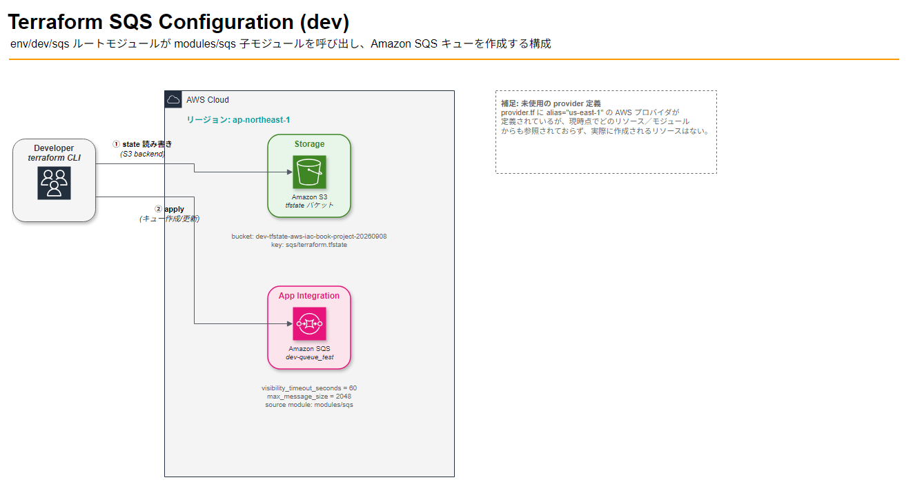
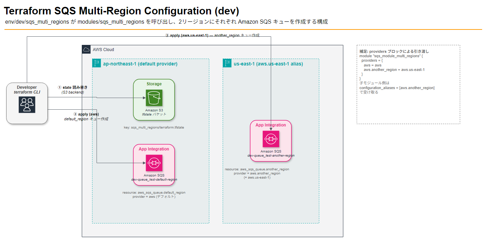

# Terraform SQS 構成解説（dev環境）

`terraform/env/dev/sqs` 配下の構成について、現状のコードから読み取れる構成を図とあわせて解説します。

## 全体構成図



図の元データ（編集用）: [`terraform-sqs-dev-architecture.drawio`](terraform-sqs-dev-architecture.drawio)（[draw.io](https://app.diagrams.net/) で開くと再編集できます）

## ディレクトリとファイルの役割

```
terraform/
├── env/dev/sqs/          # ルートモジュール（実行単位）
│   ├── backend.tf        # tfstateの保存先(S3)を定義
│   ├── terraform.tf      # Terraform/AWSプロバイダのバージョン制約
│   ├── provider.tf       # AWSプロバイダの設定
│   └── main.tf           # 子モジュール呼び出し + output
└── modules/sqs/          # 子モジュール（再利用可能なSQS定義）
    ├── main.tf            # aws_sqs_queueリソース本体
    ├── variables.tf       # 呼び出し側から渡す変数
    ├── outputs.tf         # 呼び出し元へ返す値
    └── terraform.tf       # バージョン制約
```

`env/dev/sqs/main.tf` は `source = "../../../modules/sqs"` で `modules/sqs` を呼び出しています。ディレクトリの深さが3階層（`env/dev/sqs`）ある点に注意してください。

## 各ファイルの詳細

### バックエンド（状態管理）— [backend.tf](../env/dev/sqs/backend.tf)

```hcl
terraform {
    backend "s3" {
        bucket = "dev-tfstate-aws-iac-book-project-20260908"
        key    = "sqs/terraform.tfstate"
        region = "ap-northeast-1"
    }
}
```

`terraform apply`/`plan` を実行するたびに、tfstate（Terraformが管理するリソースの状態ファイル）はローカルではなく、指定のS3バケットに `sqs/terraform.tfstate` というキーで保存されます。複数人・複数環境で作業しても状態が一貫するようにするための仕組みです。

### プロバイダ設定 — [provider.tf](../env/dev/sqs/provider.tf)

```hcl
provider "aws" {
  region = "ap-northeast-1"
  default_tags { ... }
}
provider "aws" {
  alias  = "us-east-1"
  region = "us-east-1"
  default_tags { ... }
}
```

- デフォルトプロバイダ: `ap-northeast-1` — 実際にSQSキューが作成されるリージョンです。
- エイリアスプロバイダ `us-east-1`: 定義されていますが、`main.tf` のモジュール呼び出しではどのプロバイダにも `providers = { aws.us-east-1 = aws.us-east-1 }` のような明示的な受け渡しをしていないため、**現状は未使用**です（図の右側の注記を参照）。CloudFrontの証明書など、将来us-east-1のリソースが必要になった場合に備えた定義と考えられます。

両プロバイダとも `default_tags` で `Terraform=true` / `STAGE=dev` / `MODULE=sqs` のタグを自動付与します。

### ルートモジュール — [main.tf](../env/dev/sqs/main.tf)

```hcl
module "sqs_module_test" {
  source                                = "../../../modules/sqs"
  stage                                 = "dev"
  queue_name_suffix                     = "queue_test"
  sqs_queue_vasibility_timeout_seconds  = 60
}

output "sqs_queue_url" {
  value = module.sqs_module_test.sqs_queue_url
}
```

子モジュール `modules/sqs` を呼び出し、`stage="dev"` と `queue_name_suffix="queue_test"` を渡すことで、キュー名は `dev-queue_test` になります。可視性タイムアウトは60秒を明示的に指定しています。

### 子モジュール — [modules/sqs/main.tf](../modules/sqs/main.tf)

```hcl
resource "aws_sqs_queue" "this" {
    name                       = "${var.stage}-${var.queue_name_suffix}"
    visibility_timeout_seconds = var.sqs_queue_vasibility_timeout_seconds
    max_message_size           = 2048
}
```

実際に作成されるAWSリソースはこの `aws_sqs_queue` 1つだけです。

| 変数名 | 説明 | 今回の値 |
| --- | --- | --- |
| `stage` | 環境名 | `dev` |
| `queue_name_suffix` | キュー名の接尾語 | `queue_test` |
| `sqs_queue_vasibility_timeout_seconds` | 可視性タイムアウト（秒）、デフォルト30 | `60` |
| `max_message_size` | 最大メッセージサイズ（バイト） | `2048`（固定値） |

出力 `sqs_queue_url` はキューのURLで、ルートモジュールの `output "sqs_queue_url"` を通じて `terraform output` で参照できます。

## データフロー（図の①②に対応）

1. **① state 読み書き**: `terraform init/plan/apply` を実行すると、Developer（terraform CLI）はまずS3バックエンドの `dev-tfstate-aws-iac-book-project-20260908/sqs/terraform.tfstate` を読み書きし、現在の状態を把握します。
2. **② apply**: 差分があれば、AWSプロバイダ（`ap-northeast-1`）経由で `aws_sqs_queue` を作成・更新します。

## 気づいた点（コード上の注意事項）

- 変数名 `sqs_queue_vasibility_timeout_seconds` は `visibility` のスペルミス（`vasibility`）になっています。動作上は問題ありませんが、今後リネームする場合は呼び出し側（`main.tf`）とセットで変更が必要です。
- `us-east-1` のプロバイダエイリアスは定義のみで未使用です。使わないなら削除、使うなら子モジュール側で `providers` ブロックによる明示的な受け渡しの追加を検討してください。

---

# Terraform SQS マルチリージョン構成解説（dev環境）

`terraform/env/dev/sqs_muti_regions` 配下の構成について解説します。単一リージョン版（`env/dev/sqs`）と異なり、1つのモジュール呼び出しで **2つのリージョンに1つずつSQSキューを作成する** 構成です。

## 全体構成図



図の元データ（編集用）: [`terraform-sqs-multi-region-architecture.drawio`](terraform-sqs-multi-region-architecture.drawio)

## ディレクトリとファイルの役割

```
terraform/
├── env/dev/sqs_muti_regions/     # ルートモジュール（実行単位）
│   ├── backend.tf                 # tfstateの保存先(S3、keyが単一リージョン版と異なる)
│   ├── terraform.tf               # Terraform/AWSプロバイダのバージョン制約
│   ├── provider.tf                # AWSプロバイダ設定（ap-northeast-1 + us-east-1エイリアス）
│   └── main.tf                    # 子モジュール呼び出し(providers渡し) + output
└── modules/sqs_multi_regions/     # 子モジュール（2リージョン分のSQS定義）
    ├── main.tf                     # aws_sqs_queueリソース×2（デフォルト/別リージョン）
    ├── variables.tf                # 呼び出し側から渡す変数
    ├── outputs.tf                  # 2つのキューURLを出力
    └── terraform.tf                # バージョン制約 + configuration_aliases
```

フォルダ名が `sqs_muti_regions`（`multi` ではなく `muti`）になっている点に注意してください（タイプミスですが、既存の状態に合わせてそのまま使っています）。

## 各ファイルの詳細

### バックエンド（状態管理）— [backend.tf](../env/dev/sqs_muti_regions/backend.tf)

単一リージョン版と同じS3バケットを使いますが、`key` が `sqs_multi_regions/terraform.tfstate` となっており、tfstateが混ざらないよう分離されています。

### プロバイダ設定 — [provider.tf](../env/dev/sqs_muti_regions/provider.tf)

単一リージョン版と同じく `aws`（デフォルト、`ap-northeast-1`）と `aws`（`alias = "us-east-1"`）の2つを定義していますが、こちらでは **両方とも実際に使われます**。

### ルートモジュール — [main.tf](../env/dev/sqs_muti_regions/main.tf)

```hcl
module "sqs_module_multi_regions" {
  source                                = "../../../modules/sqs_multi_regions"
  stage                                 = "dev"
  queue_name_suffix                     = "queue_test"
  sqs_queue_vasibility_timeout_seconds  = 60
  providers = {
    aws                 = aws
    aws.another_region  = aws.us-east-1
  }
}

output "default_region_sqs_queue_url" {
  value = module.sqs_module_multi_regions.default_region_sqs_queue_url
}

output "another_region_sqs_queue_url" {
  value = module.sqs_module_multi_regions.another_region_sqs_queue_url
}
```

ポイントは `providers` ブロックです。子モジュールが要求する `aws.another_region` という名前のプロバイダに対して、呼び出し側で定義した `aws.us-east-1`（provider.tfの `alias = "us-east-1"`）を明示的に割り当てています。**Terraformのプロバイダエイリアスはモジュール境界を自動では越えない**ため、この受け渡しが必須です。

### 子モジュール — [modules/sqs_multi_regions/terraform.tf](../modules/sqs_multi_regions/terraform.tf) / [main.tf](../modules/sqs_multi_regions/main.tf)

```hcl
terraform {
    required_providers {
        aws = {
            source  = "hashicorp/aws"
            version = "~> 5.72.1"
            configuration_aliases = [aws.another_region]
        }
    }
}
```

```hcl
resource "aws_sqs_queue" "default_region" {
    name = "${var.stage}-${var.queue_name_suffix}-default-region"
    # provider未指定 → デフォルトプロバイダ(ap-northeast-1)が使われる
}

resource "aws_sqs_queue" "another_region" {
    name     = "${var.stage}-${var.queue_name_suffix}-another-region"
    provider = aws.another_region   # ← ルート側から渡されたus-east-1プロバイダ
}
```

`configuration_aliases = [aws.another_region]` は、「このモジュールは `aws.another_region` という名前のプロバイダ設定を外部から受け取る」という宣言です。これがないと、`providers` ブロックでいくら渡しても子モジュール内で `provider = aws.another_region` を使えません。

| リソース | 使用プロバイダ | 作成先リージョン | キュー名 |
| --- | --- | --- | --- |
| `aws_sqs_queue.default_region` | `aws`（デフォルト） | ap-northeast-1 | `dev-queue_test-default-region` |
| `aws_sqs_queue.another_region` | `aws.another_region`（= `aws.us-east-1`） | us-east-1 | `dev-queue_test-another-region` |

## データフロー（図の①〜③に対応）

1. **① state 読み書き**: `terraform init/plan/apply` 実行時、S3バックエンド（`sqs_multi_regions/terraform.tfstate`）を読み書きします。
2. **② apply (aws)**: デフォルトプロバイダ経由で ap-northeast-1 に `default_region` キューを作成します。
3. **③ apply (aws.us-east-1)**: `providers` ブロックで渡された `aws.us-east-1` 経由で us-east-1 に `another_region` キューを作成します。

## このフォルダで実際に発生していたエラーと修正

このコードには当初、`terraform plan` が失敗する2つの不具合がありました。

1. **プロバイダエイリアス名の不一致** — `main.tf` が `aws.us_east_1`（アンダースコア）を参照していましたが、`provider.tf` 側のエイリアス名は `alias = "us-east-1"`（ハイフン）でした。エラー `missing provider ...us_east_1` はこの typo が原因です。→ `aws.us-east-1` に修正。
2. **存在しないモジュール/出力の参照** — `output` ブロックが単一リージョン版からのコピペ残りで、存在しないモジュール名 `sqs_module_test` と存在しない出力 `sqs_queue_url` を参照していました（子モジュールの `outputs.tf` も空でした）。→ 子モジュールに `default_region_sqs_queue_url` / `another_region_sqs_queue_url` の出力を追加し、ルート側の `output` も正しいモジュール名・出力名に修正。

## 気づいた点（コード上の注意事項）

- ディレクトリ名 `sqs_muti_regions`（`multi` → `muti`）、モジュール名 `sqs_multi_regions`（正しいスペル）で表記が揺れています。混乱の元になるため、将来的にはディレクトリ名を `sqs_multi_regions` にリネームすることを検討してください。
- 単一リージョン版と同じ `sqs_queue_vasibility_timeout_seconds` のスペルミスがこちらの子モジュールにも引き継がれています。
